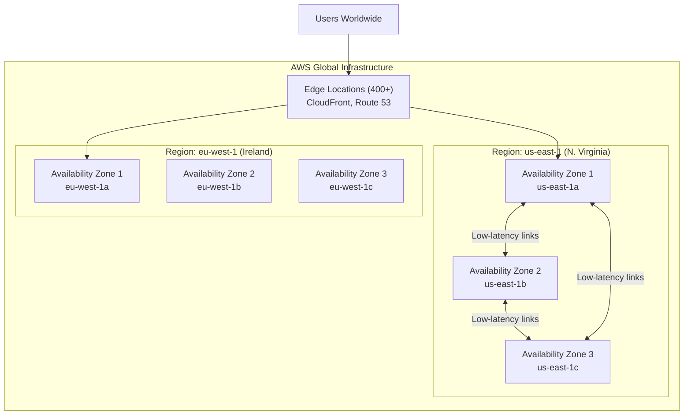
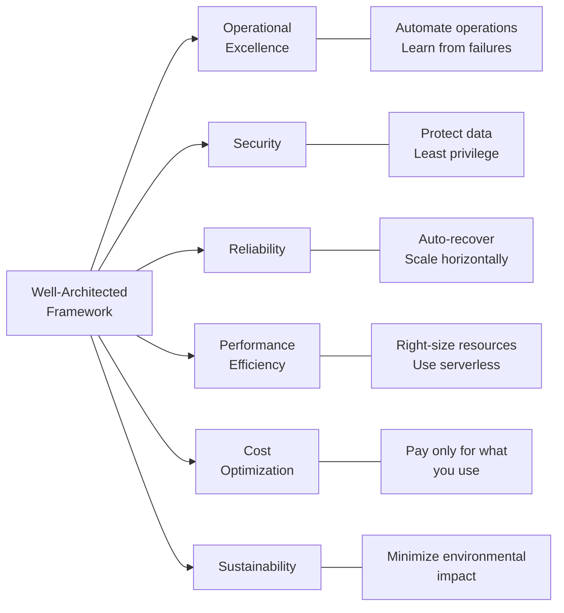
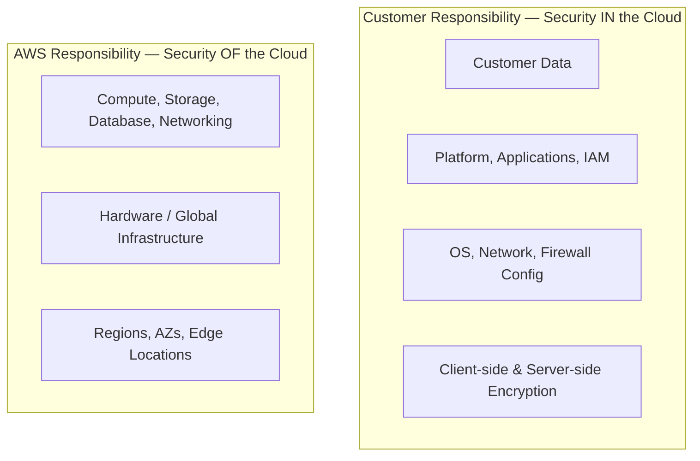

# Cloud Fundamentals

## Overview

Cloud computing is the on-demand delivery of IT resources over the internet with pay-as-you-go pricing. Instead of buying, owning, and maintaining physical data centers, you access technology services — compute power, storage, databases — from a cloud provider like AWS.

**AWS (Amazon Web Services)** is the world's most comprehensive cloud platform, offering 200+ services from data centers globally.

## Key Concepts

### Cloud Computing Models

| Model | What You Manage | Provider Manages | Example |
|-------|----------------|-----------------|---------|
| **IaaS** (Infrastructure as a Service) | OS, Runtime, App, Data | Servers, Storage, Networking | EC2, VPC |
| **PaaS** (Platform as a Service) | App, Data | OS, Runtime, Servers | Elastic Beanstalk, RDS |
| **SaaS** (Software as a Service) | Nothing (just use it) | Everything | Gmail, Salesforce |

### Cloud Deployment Models

| Model | Description | Use Case |
|-------|-------------|----------|
| **Public Cloud** | Resources owned by cloud provider, shared infra | Startups, variable workloads |
| **Private Cloud** | Dedicated infra for one organization | Compliance-heavy industries |
| **Hybrid Cloud** | Combination of public and private | Migration, data sovereignty |

## Architecture Diagram

### AWS Global Infrastructure

### AWS Well-Architected Framework

## Deep Dive

### AWS Global Infrastructure

- **Regions** (30+): Geographic areas with multiple data centers. Choose based on:
  - **Compliance**: Data residency laws (e.g., GDPR requires EU regions)
  - **Latency**: Pick the region closest to your users
  - **Service availability**: Not all services are in all regions
  - **Pricing**: Costs vary by region (us-east-1 is often cheapest)

- **Availability Zones (AZs)**: Each region has 2-6 AZs. Each AZ is one or more discrete data centers with redundant power, networking, and connectivity. AZs within a region are connected via high-bandwidth, low-latency networking.

- **Edge Locations** (400+): Endpoints for CloudFront (CDN) and Route 53 (DNS). Cache content close to users for low-latency delivery.

- **Local Zones**: Extend AWS regions closer to end users for latency-sensitive applications.

- **Wavelength Zones**: Embed AWS compute inside 5G networks for ultra-low-latency mobile applications.

### Shared Responsibility Model

### AWS Well-Architected Framework — 6 Pillars

| Pillar | Key Principle | Example |
|--------|--------------|---------|
| **Operational Excellence** | Run and monitor systems to deliver business value | Use CloudFormation for IaC |
| **Security** | Protect information, systems, and assets | Enable MFA, encrypt at rest |
| **Reliability** | Recover from failures, meet demand | Multi-AZ deployments |
| **Performance Efficiency** | Use resources efficiently | Right-size EC2 instances |
| **Cost Optimization** | Avoid unnecessary costs | Use Reserved Instances |
| **Sustainability** | Minimize environmental impact | Use managed services |

## Best Practices

1. **Always deploy across multiple AZs** for high availability
2. **Choose regions based on compliance first**, then latency, then cost
3. **Use the Well-Architected Tool** to review your workloads
4. **Understand the Shared Responsibility Model** — it's asked in every interview
5. **Start with managed services** before building custom solutions

## Common Interview Questions

### Q1: What is the difference between a Region and an Availability Zone?

**A:** A Region is a geographic area (e.g., us-east-1 in N. Virginia) that contains multiple isolated locations called Availability Zones. Each AZ is one or more physical data centers with independent power, cooling, and networking. AZs within a region are connected via low-latency links. You choose a Region for compliance and latency; you use multiple AZs within that Region for high availability.

### Q2: Explain the Shared Responsibility Model.

**A:** AWS manages security *of* the cloud (physical infrastructure, hypervisor, managed service internals). Customers manage security *in* the cloud (OS patching on EC2, IAM policies, encryption, firewall rules, application code). The boundary shifts depending on the service — with EC2 you patch the OS; with Lambda, AWS does.

### Q3: What are the 6 pillars of the Well-Architected Framework?

**A:** Operational Excellence, Security, Reliability, Performance Efficiency, Cost Optimization, and Sustainability. Each pillar has design principles and best practices. AWS provides a free Well-Architected Tool to review workloads against these pillars.

### Q4: How do you choose an AWS Region?

**A:** Consider four factors in order: (1) **Compliance** — legal or regulatory data residency requirements, (2) **Latency** — proximity to end users, (3) **Service availability** — some services aren't available in all regions, (4) **Pricing** — costs vary by region.

### Q5: What is the difference between IaaS, PaaS, and SaaS?

**A:** IaaS provides raw infrastructure (EC2 — you manage OS and up). PaaS provides a platform to deploy apps without managing infrastructure (Elastic Beanstalk — you manage app code). SaaS delivers complete applications (Rekognition API — you just call it). As you go from IaaS to SaaS, you manage less and AWS manages more.

### Q6: What are Edge Locations and why do they matter?

**A:** Edge Locations are AWS endpoints distributed globally (400+) used by services like CloudFront (CDN) and Route 53 (DNS). They cache content closer to users, reducing latency. Edge Locations are NOT the same as AZs — there are many more Edge Locations than AZs.

### Q7: What is AWS Organizations?

**A:** A service to centrally manage multiple AWS accounts. Provides consolidated billing, Service Control Policies (SCPs) to restrict what accounts can do, and organizational units (OUs) for grouping accounts. Essential for enterprises with multiple teams or environments.

### Q8: Explain the difference between high availability and fault tolerance.

**A:** High availability means a system is operational for a high percentage of time (e.g., 99.99%), usually achieved by redundancy across AZs. Fault tolerance means a system continues operating without degradation when a component fails — it's a stricter requirement. A Multi-AZ RDS deployment is highly available (failover takes ~60s). A DynamoDB Global Table is fault tolerant (reads succeed immediately from another region).

## Latest Updates (2025-2026)

- **AWS Regions expanded to 35+** with new regions in Malaysia, Thailand, Mexico, New Zealand, and Taiwan announced or launched, giving customers more options for data residency and low-latency access.
- **Local Zones now in 30+ cities** worldwide including across the US, Europe, and Asia-Pacific, enabling sub-10ms latency for applications like real-time gaming, media streaming, and AR/VR.
- **Dedicated Local Zones** now available for government and regulated industries, providing isolated infrastructure within a specific metro area that meets compliance requirements like ITAR and FedRAMP High.
- **AWS Outposts Rack & Server** fully GA — Outposts Rack delivers a full AWS rack on-premises, while Outposts Server provides a 1U or 2U form factor for edge locations with limited space. Both run native AWS services including EC2, EBS, S3, ECS, and RDS on local infrastructure.
- **Sovereign cloud options** expanding — AWS European Sovereign Cloud (launching in Germany) provides a physically and logically separate cloud for European customers to meet data residency and operational sovereignty requirements, with all data and metadata staying in the EU.
- **Well-Architected Framework Tool** now includes custom lenses and six additional AWS-provided lenses (Serverless, SaaS, Data Analytics, Machine Learning, IoT, and Games Industry).
- **AWS Control Tower** enhanced with Account Factory for Terraform (AFT), comprehensive drift detection, and region deny controls to simplify multi-account governance at scale.

### Q9: What is the difference between Local Zones and Wavelength Zones?

**A:** Local Zones extend an AWS Region to a metropolitan area and provide a subset of AWS services (EC2, EBS, VPC, ELB, etc.) with single-digit millisecond latency for end users in that city. They are connected back to the parent Region via AWS's private network. Wavelength Zones, by contrast, embed AWS compute and storage inside 5G telecommunication carrier networks (Verizon, Vodafone, etc.) to deliver ultra-low latency — typically under 10ms — to mobile devices connected over 5G. Use Local Zones for applications like video rendering, real-time gaming, or hybrid on-prem workloads. Use Wavelength Zones specifically when your end users are on 5G mobile networks and you need the absolute lowest latency path from the device to compute (e.g., autonomous vehicles, smart factories, connected medical devices).

### Q10: What are AWS Outposts use cases and how do they differ from Local Zones?

**A:** AWS Outposts bring AWS infrastructure, services, and APIs on-premises to your own data center or co-location facility. They are ideal when you need low-latency access to on-premises systems (factory automation, hospital data), local data processing due to data residency requirements, or migration workloads that need a hybrid stepping stone. Outposts Rack is a full 42U rack managed by AWS, while Outposts Server is a 1U/2U form factor for space-constrained environments like retail stores or branch offices. Local Zones, by contrast, are AWS-managed infrastructure in a metro area — you do not manage any hardware. Choose Outposts when you need AWS in your facility; choose Local Zones when you just need low-latency AWS closer to a city.

### Q11: What are Well-Architected Framework Lenses and when would you use them?

**A:** Lenses are extensions to the core Well-Architected Framework that provide additional best practices tailored to specific technology domains or industry verticals. AWS offers lenses for Serverless, SaaS, Data Analytics, Machine Learning, IoT, Games, Financial Services, and more. For example, the Serverless Lens adds questions about event-driven architecture, function optimization, and async patterns that the core framework does not cover. You apply a lens during a Well-Architected Review using the Well-Architected Tool in the AWS console, and you can also create custom lenses to encode your organization's internal standards. Lenses help ensure that domain-specific best practices are not overlooked during architecture reviews.

### Q12: How does the Shared Responsibility Model shift across EC2, RDS, and Lambda?

**A:** The Shared Responsibility Model is not one-size-fits-all — it shifts depending on the service type. With **EC2 (IaaS)**, the customer is responsible for the OS, patching, middleware, runtime, application code, and data. With **RDS (PaaS)**, AWS manages the OS, database engine patching, and underlying infrastructure, while the customer manages database configuration, IAM access, encryption settings, security groups, and data. With **Lambda (Serverless/FaaS)**, AWS manages everything up to and including the runtime — the customer is only responsible for their function code, IAM execution role, and data. Understanding this gradient is critical in interviews because it determines who is accountable for security controls at each layer.

### Q13: What is the AWS Cloud Adoption Framework (CAF)?

**A:** The AWS Cloud Adoption Framework is a structured guidance document that helps organizations plan and execute their cloud migration and modernization journeys. It is organized around six perspectives: **Business** (align cloud investments with business outcomes), **People** (organizational change management and skills), **Governance** (risk management, compliance, and cloud program management), **Platform** (architecture patterns and engineering), **Security** (security controls, identity management, and compliance), and **Operations** (managing cloud workloads at scale). Each perspective includes foundational capabilities that map to specific stakeholders — for example, the Business perspective is aimed at CxOs and finance, while the Platform perspective targets architects and engineers. CAF helps identify skills gaps and create actionable transformation plans.

### Q14: What is AWS Control Tower and how does it relate to Landing Zones?

**A:** AWS Control Tower automates the setup of a secure, well-architected multi-account AWS environment based on AWS best practices. It orchestrates AWS Organizations, IAM Identity Center, AWS Config, CloudTrail, and Service Catalog into a unified experience called a **Landing Zone**. The Landing Zone is the actual multi-account structure — including a management account, log archive account, audit account, and organizational units — that Control Tower provisions and governs. Control Tower enforces governance through **guardrails** (now called controls), which are pre-packaged SCPs (preventive) and AWS Config rules (detective) that enforce policies like "disallow public S3 buckets" or "require encryption on EBS volumes." Account Factory lets you provision new, pre-configured accounts on demand. Control Tower is the service; the Landing Zone is the output.

### Q15: What is AWS Artifact and what compliance programs does AWS support?

**A:** AWS Artifact is a self-service portal in the AWS console for accessing AWS compliance reports, certifications, and agreements. It provides on-demand access to SOC 1/2/3 reports, PCI DSS Attestation of Compliance, ISO 27001/27017/27018 certifications, FedRAMP authorization packages, HIPAA Business Associate Addendum (BAA), and many more. AWS maintains compliance with over 140 security standards and compliance certifications globally. For interview purposes, know these key programs: **HIPAA** requires a BAA with AWS and restricts which services can process Protected Health Information (PHI). **SOC 2** reports cover security, availability, processing integrity, confidentiality, and privacy. **PCI DSS** certifies that the AWS infrastructure meets Level 1 requirements for handling credit card data, but the customer is still responsible for their application-layer PCI compliance.

### Q16: What is the practical difference between high availability, fault tolerance, and disaster recovery?

**A:** **High Availability (HA)** means the system remains operational with minimal downtime, typically achieved by deploying across multiple AZs with automatic failover — for example, Multi-AZ RDS with ~60 seconds of failover. **Fault Tolerance** is a stricter standard where the system continues operating without any perceptible degradation when a component fails — for example, DynamoDB Global Tables where reads and writes succeed immediately against another replica. **Disaster Recovery (DR)** is the strategy for recovering from a large-scale failure (entire region outage, data corruption) and involves RPO (Recovery Point Objective — how much data you can afford to lose) and RTO (Recovery Time Objective — how fast you must recover). DR strategies range from backup-and-restore (cheap, slow RTO) to multi-site active-active (expensive, near-zero RTO). HA and FT prevent outages; DR recovers from them.

### Q17: How do you decide between managed and unmanaged (self-managed) services?

**A:** Start with managed services by default unless you have a specific reason to self-manage. Managed services (RDS, DynamoDB, EFS, Lambda) reduce operational overhead because AWS handles patching, backups, scaling, and high availability. Choose self-managed (EC2 + self-installed database) when you need a specific software version or configuration that managed services do not support, require custom kernel modules or OS-level access, need a database engine not available as a managed offering, or have existing licenses (BYOL) that require dedicated hosts. The trade-off is always operational burden vs. control. In interviews, frame this as: "I default to managed services for faster time-to-market and reduced undifferentiated heavy lifting, and only self-manage when there is a specific technical or compliance requirement."

### Q18: When should you deploy multi-region vs. multi-AZ?

**A:** **Multi-AZ** should be the default for all production workloads — it protects against single data center failures and provides high availability within a region with low latency between AZs (typically <2ms). **Multi-Region** is necessary when you need: (1) disaster recovery against an entire region failure, (2) low-latency access for globally distributed users, (3) compliance requirements that mandate data residency in specific geographies, or (4) regulatory requirements for geographic separation. Multi-region is significantly more complex and expensive — it requires data replication strategies (DynamoDB Global Tables, S3 Cross-Region Replication, Aurora Global Database), global routing (Route 53, CloudFront, Global Accelerator), and careful handling of eventual consistency. Start with multi-AZ and only add multi-region when the business requirements justify the cost and complexity.

### Q19: What is the AWS Well-Architected Tool and how do you use it?

**A:** The AWS Well-Architected Tool is a free service in the AWS console that lets you review your workloads against the six pillars of the Well-Architected Framework. You define a workload, answer a series of questions organized by pillar, and the tool generates a report highlighting high-risk and medium-risk issues with specific improvement recommendations. You can apply additional lenses (Serverless, SaaS, etc.) for domain-specific guidance. The tool tracks milestones so you can measure improvement over time, and it integrates with AWS Trusted Advisor to surface automated recommendations. Many organizations run Well-Architected Reviews quarterly or before major launches as part of their architecture governance process.

### Q20: What is the difference between AWS Organizations SCPs and IAM policies in the context of cloud governance?

**A:** SCPs and IAM policies serve fundamentally different purposes in governance. **IAM policies** grant or deny permissions to specific principals (users, roles, groups) and are the primary mechanism for fine-grained access control. **SCPs** set the maximum available permissions for an entire AWS account or organizational unit — they act as a guardrail or ceiling and never grant permissions themselves. For example, an SCP that denies all actions in the ap-southeast-1 region means that no IAM policy in any account under that OU can override it, regardless of how permissive the IAM policy is. Use SCPs for organization-wide guardrails (allowed regions, disallowed services, mandatory encryption). Use IAM policies for granting specific permissions to specific identities. Together, the effective permission is the intersection of SCP + IAM policy + permissions boundary.

## Scenario-Based Questions

### S1: Your startup is launching an MVP with 2 developers. How do you choose between EC2, ECS, or Lambda?

**A:** Choose **Lambda + API Gateway + DynamoDB** (fully serverless). Reasoning: (1) Zero infrastructure management — no patching, scaling, or capacity planning. (2) Pay-per-request — costs near zero at low traffic. (3) Built-in auto-scaling from 0 to millions of requests. (4) Focus 100% of dev time on features, not ops. Skip EC2 (too much ops overhead) and ECS (container orchestration is overkill). Reassess when you hit Lambda limitations (>15 min execution, persistent connections, >10 GB memory). At that point, Fargate is the next step.

### S2: Your company operates in the EU and must comply with GDPR. A customer requests complete data deletion. How do you handle this across AWS services?

**A:** GDPR "right to erasure" requires deleting all customer data everywhere. (1) **Data inventory** — use Macie to discover PII across S3, maintain a catalog mapping customer IDs to storage locations. (2) **DynamoDB** — query all items with `PK=CUSTOMER#<id>` and batch delete. (3) **S3** — delete objects and all versions (versioned buckets retain deleted objects). (4) **RDS/Aurora** — run DELETE queries. (5) **CloudWatch Logs** — can't delete individual entries; set retention to comply with data minimization. (6) **Backups** — document that they're encrypted and auto-expire. Build an automated **data deletion pipeline** via Step Functions that orchestrates deletion across all services.

### S3: Your company acquired another company on Azure. Leadership wants both to coexist. How do you architect hybrid multi-cloud connectivity?

**A:** (1) **Network** — Direct Connect + Azure ExpressRoute, both at the same colo (e.g., Equinix). Or VPN mesh as a cheaper alternative. (2) **Identity** — federate both clouds to a single IdP (Okta, Azure AD). IAM Identity Center for AWS. (3) **DNS** — Route 53 for external, forward internal zones between Route 53 Resolver and Azure Private DNS. (4) **Data** — avoid cross-cloud transfers for latency-sensitive workloads. S3 as primary data lake, sync Azure Blob via DataSync. (5) **Monitoring** — Datadog or Grafana Cloud for unified observability. (6) **IaC** — Terraform for both clouds. Plan to consolidate over 12-18 months rather than running hybrid permanently.

## Deep Dive Notes

### Well-Architected Framework Lenses

The core Well-Architected Framework covers universal best practices, but real-world workloads need domain-specific guidance. AWS offers these key lenses:

- **Serverless Lens**: Focuses on event-driven design, function optimization (memory/timeout tuning), asynchronous invocation patterns, and managing state in stateless architectures. Key principle: prefer asynchronous over synchronous wherever possible.
- **SaaS Lens**: Covers multi-tenant architecture patterns (silo, pool, bridge), tenant isolation strategies, onboarding automation, tiering/throttling per tenant, and SaaS-specific metrics (tenant cost attribution, noisy neighbor detection).
- **Data Analytics Lens**: Addresses data lake design, batch vs. streaming pipeline architectures, data governance and cataloging (Glue Data Catalog, Lake Formation), query performance optimization, and cost control for analytics workloads.
- **Machine Learning Lens**: Covers ML pipeline design (data prep, training, deployment), model versioning and reproducibility, inference optimization (Inf2, SageMaker endpoints), and MLOps practices for continuous training and monitoring.

### AWS Control Tower and Landing Zone Concepts

A Landing Zone is a well-architected multi-account foundation that includes:

- **Management Account**: Hosts AWS Organizations and billing. Should not run workloads.
- **Log Archive Account**: Central repository for CloudTrail logs, Config snapshots, and VPC Flow Logs from all accounts. Locked down with limited access.
- **Audit Account**: Security team's account for cross-account read-only access and security tooling (Security Hub, GuardDuty administrator).
- **Organizational Units (OUs)**: Logical groupings such as Security OU, Infrastructure OU, Sandbox OU, Workload OU (with Prod and Non-Prod children). SCPs are applied at the OU level.
- **Account Factory**: Automates new account provisioning with pre-configured VPC, IAM roles, and guardrails. Account Factory for Terraform (AFT) allows infrastructure-as-code provisioning.
- **Controls (Guardrails)**: Three categories — **Preventive** (SCPs that block actions like disabling CloudTrail), **Detective** (AWS Config rules that flag non-compliance like unencrypted S3 buckets), and **Proactive** (CloudFormation hooks that block non-compliant resource creation before deployment).

### Compliance and Governance on AWS

Key compliance concepts for interviews:

- **Shared Responsibility for Compliance**: AWS certifies the infrastructure layer. The customer must certify their application, configurations, and data handling practices. For example, running on HIPAA-eligible services does not make you HIPAA-compliant — you must also sign a BAA, use encryption, configure access logging, and implement proper access controls.
- **AWS Config**: Continuously evaluates resource configurations against desired state. Use Config Rules (managed or custom) to check compliance (e.g., all EBS volumes encrypted, all S3 buckets versioned). Config supports remediation actions via SSM Automation.
- **AWS Audit Manager**: Automates evidence collection for audits. Maps AWS Config rules and CloudTrail logs to compliance frameworks (SOC 2, PCI, HIPAA) to generate audit-ready reports.
- **Service Catalog**: Lets administrators create portfolios of approved products (CloudFormation stacks) that developers can self-service deploy. Ensures only compliant architectures are provisioned.
- **Tag Policies**: Enforced through AWS Organizations to ensure consistent tagging for cost allocation, access control, and compliance. Tags are the foundation of cost attribution and ABAC (Attribute-Based Access Control).

## Cheat Sheet

| Concept | Key Facts |
|---------|-----------|
| Regions | 30+ worldwide, choose by compliance > latency > services > cost |
| Availability Zones | 2-6 per region, isolated data centers, connected with low-latency links |
| Edge Locations | 400+, used by CloudFront and Route 53, more locations than AZs |
| Shared Responsibility | AWS = security OF the cloud, Customer = security IN the cloud |
| Well-Architected | 6 pillars: OpEx, Security, Reliability, PerfEff, CostOpt, Sustainability |
| IaaS | You manage OS up (EC2) |
| PaaS | You manage app + data (Elastic Beanstalk, RDS) |
| SaaS | You just use it (complete application) |
| Local Zones | Extend regions for low-latency use cases |
| Wavelength Zones | AWS inside 5G networks for ultra-low-latency mobile apps |

---

[Next: IAM & Security →](../02-iam-and-security/)
