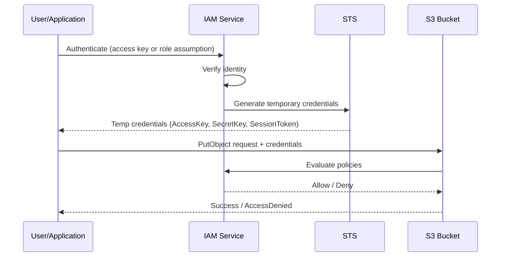
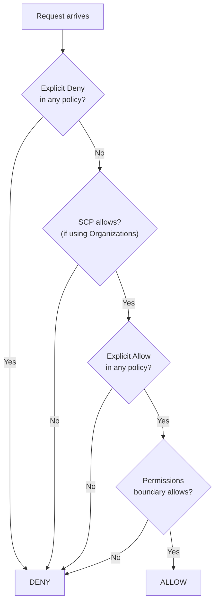
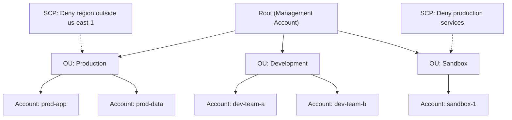
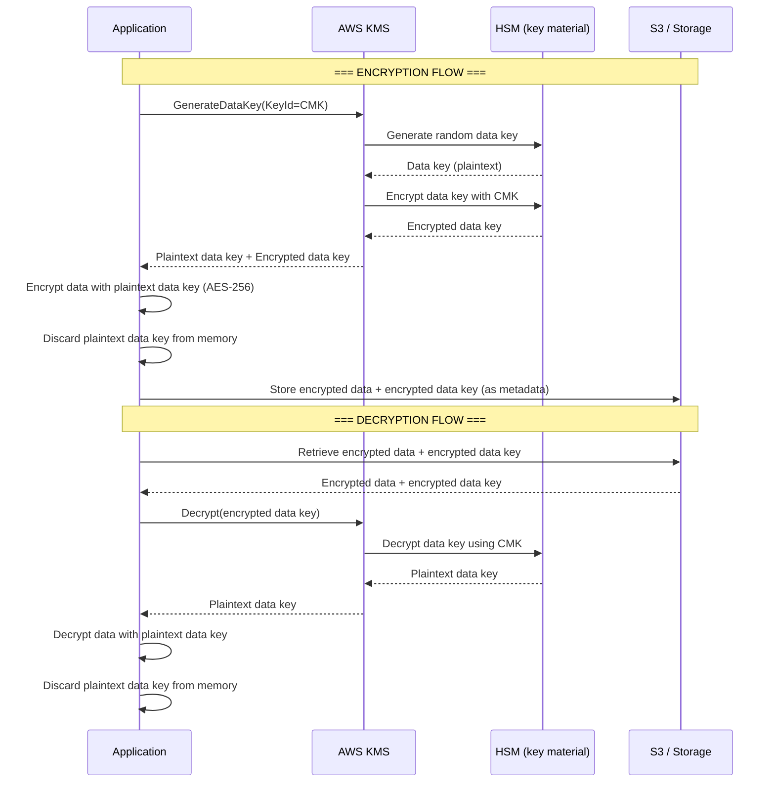

# IAM & Security

## Overview

**AWS Identity and Access Management (IAM)** lets you control who can access what in your AWS account. It's a free, global service (not region-specific) and the foundation of every secure AWS architecture. IAM is arguably the most important service to understand for interviews — it touches everything.

## Key Concepts

| Concept | Description |
|---------|-------------|
| **User** | An identity representing a person or application. Has long-term credentials (password, access keys) |
| **Group** | A collection of users. Assign permissions to the group, all users inherit them |
| **Role** | An identity with permissions that can be *assumed* by users, services, or external identities. Uses temporary credentials |
| **Policy** | A JSON document that defines permissions (allow/deny actions on resources) |
| **STS** | Security Token Service — generates temporary credentials when a role is assumed |

## Architecture Diagram

### IAM Authentication & Authorization Flow



### IAM Policy Evaluation Logic



## Deep Dive

### IAM Policy Structure

```json
{
  "Version": "2012-10-17",
  "Statement": [
    {
      "Sid": "AllowS3ReadOnly",
      "Effect": "Allow",
      "Action": [
        "s3:GetObject",
        "s3:ListBucket"
      ],
      "Resource": [
        "arn:aws:s3:::my-bucket",
        "arn:aws:s3:::my-bucket/*"
      ],
      "Condition": {
        "IpAddress": {
          "aws:SourceIp": "203.0.113.0/24"
        }
      }
    }
  ]
}
```

### Policy Types (in order of evaluation)

| Policy Type | Scope | Purpose |
|------------|-------|---------|
| **Service Control Policies (SCPs)** | Organization/OU/Account | Guardrails — max permissions for an account |
| **Permissions Boundary** | User/Role | Max permissions an IAM entity can have |
| **Identity-based Policies** | User/Group/Role | Grant permissions to the principal |
| **Resource-based Policies** | Resource (S3, SQS, etc.) | Grant cross-account access without assuming a role |
| **Session Policies** | STS session | Limit permissions for a specific session |

### IAM Roles — When to Use

| Scenario | Why a Role |
|----------|-----------|
| EC2 instance needs S3 access | Attach role via Instance Profile — no keys stored on the instance |
| Lambda function accesses DynamoDB | Execution role grants permissions automatically |
| Cross-account access | Account B assumes a role in Account A |
| Federated users (SSO) | External IdP users assume roles via SAML/OIDC |
| Temporary elevated access | Assume admin role with MFA requirement |

### AWS Organizations & SCPs



### Security Services Ecosystem

| Service | Purpose |
|---------|---------|
| **IAM Identity Center (SSO)** | Single sign-on for multiple AWS accounts |
| **AWS CloudTrail** | Logs all API calls for auditing |
| **AWS Config** | Tracks resource configuration changes |
| **Amazon GuardDuty** | Threat detection using ML (analyzes CloudTrail, VPC Flow Logs, DNS) |
| **AWS Security Hub** | Central dashboard aggregating findings from GuardDuty, Inspector, Macie |
| **Amazon Inspector** | Automated vulnerability assessment for EC2 and ECR |
| **Amazon Macie** | Discovers and protects sensitive data (PII) in S3 |
| **AWS KMS** | Managed encryption keys (AES-256, RSA) |
| **AWS Secrets Manager** | Store, rotate, and retrieve secrets (DB passwords, API keys) |
| **AWS WAF** | Web Application Firewall — protects against SQL injection, XSS |
| **AWS Shield** | DDoS protection (Standard = free, Advanced = paid) |

## Best Practices

1. **Never use the root account** for daily tasks — create IAM users/roles instead
2. **Enable MFA** on root and all human users
3. **Use roles, not access keys** — roles use temporary credentials
4. **Follow least privilege** — grant only the permissions needed
5. **Use IAM Identity Center (SSO)** for multi-account access
6. **Rotate credentials regularly** and use Secrets Manager for applications
7. **Use SCPs as guardrails**, not as a replacement for IAM policies
8. **Enable CloudTrail** in all regions for audit logging
9. **Use resource-based policies** for cross-account access when possible
10. **Use permission boundaries** to delegate admin safely

## Common Interview Questions

### Q1: What is the difference between an IAM User and an IAM Role?

**A:** An IAM User has permanent long-term credentials (username/password or access keys) and represents a specific person or application. An IAM Role has no permanent credentials — when assumed, STS generates temporary credentials that expire. Roles are preferred because temporary credentials reduce the blast radius of a compromise. EC2 instances, Lambda functions, and cross-account access should always use roles.

### Q2: How does IAM policy evaluation work?

**A:** By default, everything is denied (implicit deny). Then AWS evaluates: (1) If any policy has an explicit **Deny**, it wins — always. (2) If using Organizations, the SCP must allow the action. (3) At least one policy must have an explicit **Allow**. (4) Permission boundaries must also allow it. The rule: **Deny overrides Allow, and Allow overrides the default implicit Deny.**

### Q3: What is the difference between an Identity-based Policy and a Resource-based Policy?

**A:** Identity-based policies are attached to users, groups, or roles — they say "this principal can do X." Resource-based policies are attached to resources (S3 bucket, SQS queue) — they say "these principals can do X to me." Key difference: resource-based policies can grant cross-account access without the other account needing to assume a role.

### Q4: Explain cross-account access patterns.

**A:** Two main approaches: (1) **Role assumption** — Account B creates a role that trusts Account A. Users in Account A call `sts:AssumeRole` to get temporary credentials for Account B. (2) **Resource-based policies** — Account A's S3 bucket policy directly grants access to Account B's principal. Role assumption is more common for broad access; resource-based policies work well for specific resources.

### Q5: What are Service Control Policies (SCPs)?

**A:** SCPs are policies in AWS Organizations that set permission guardrails for accounts or OUs. SCPs don't grant permissions — they set the maximum permissions. Even if an IAM policy allows an action, if the SCP denies it, it's denied. SCPs don't affect the management (root) account. Use them for organization-wide rules like "deny all services outside approved regions."

### Q6: How would you implement least privilege?

**A:** Start with zero permissions, then add specific permissions as needed. Use IAM Access Analyzer to identify unused permissions and tighten policies. Use CloudTrail to see what API calls are actually made. Apply permission boundaries to prevent privilege escalation. Use AWS managed policies as a starting point, then replace with custom policies scoped to specific resources.

### Q7: What is the difference between AWS KMS and AWS Secrets Manager?

**A:** KMS manages encryption keys — you use it to encrypt data (S3 objects, EBS volumes, RDS databases). Secrets Manager stores and rotates secrets (database passwords, API keys, tokens). They complement each other: Secrets Manager uses KMS to encrypt the secrets it stores. Use KMS when you need encryption, Secrets Manager when you need to store and rotate credentials.

### Q8: How does federation work with IAM?

**A:** Federation lets external users (corporate AD, Google, Facebook) access AWS without creating IAM users. Flows: (1) **SAML 2.0** — Corporate IdP authenticates user, sends SAML assertion to AWS, STS returns temporary credentials. (2) **OIDC (OpenID Connect)** — For web/mobile apps, users authenticate with IdP (Cognito, Google), then assume a role. (3) **IAM Identity Center** — Preferred approach for workforce federation across multiple accounts.

### Q9: What is the difference between GuardDuty, Inspector, and Macie?

**A:** **GuardDuty** = threat detection (analyzes CloudTrail/VPC Flow Logs/DNS for suspicious activity like crypto mining or compromised credentials). **Inspector** = vulnerability scanning (checks EC2 instances and ECR container images for known CVEs and network reachability issues). **Macie** = data discovery (uses ML to find and classify sensitive data like PII, credit card numbers in S3). All three feed findings into Security Hub.

### Q10: What is a Permissions Boundary?

**A:** A permissions boundary is an advanced feature that sets the maximum permissions an IAM user or role can have. It acts as a ceiling — the effective permissions are the intersection of identity-based policies AND the permissions boundary. Use case: you want to let developers create their own IAM roles, but limit what permissions those roles can have.

## Latest Updates (2025-2026)

- **IAM Access Analyzer custom policy checks** now validate policies against custom policy templates before deployment, catching overly permissive policies in CI/CD pipelines before they reach production.
- **IAM Identity Center** (formerly AWS SSO) enhanced with multi-account permissions sets that support attribute-based access control (ABAC), delegated administrator support, and automatic permission set provisioning.
- **Resource Control Policies (RCPs)** introduced as a new policy type in AWS Organizations — similar to SCPs but applied to resources rather than principals, allowing you to restrict what actions can be performed on resources regardless of who the caller is.
- **Amazon Verified Permissions** GA — a fine-grained authorization service using the **Cedar policy language** for application-level authorization decisions. Integrates with Cognito and API Gateway to externalize authorization logic from application code.
- **CloudTrail Lake** enables SQL-based queries on CloudTrail events with up to 7 years of event history, eliminating the need to export logs to S3 and run Athena queries for security investigations.
- **AWS Security Hub** now supports automated remediation actions and central configuration across all organization accounts, with auto-enable for new accounts joining the organization.
- **IAM Roles Anywhere** enables on-premises workloads to obtain temporary AWS credentials using X.509 certificates, eliminating the need for long-term access keys on non-AWS infrastructure.

### Q11: What is IAM Access Analyzer and how would you use it?

**A:** IAM Access Analyzer helps you identify resources shared with external entities and validate IAM policies. It has two key capabilities: (1) **Findings** — it continuously monitors your environment and generates findings when resource policies (S3 buckets, KMS keys, SQS queues, IAM roles, Lambda functions) grant access to principals outside your account or organization. (2) **Policy validation** — it checks IAM policies against best practices and grammar rules, and can even generate least-privilege policies based on CloudTrail activity. In a CI/CD pipeline, you can use Access Analyzer's custom policy checks API to validate that new policies don't grant unintended access before deploying them. This makes Access Analyzer essential for maintaining least privilege at scale.

### Q12: What is the IAM Policy Simulator and when would you use it?

**A:** The IAM Policy Simulator is a tool in the AWS console (or API) that lets you test and troubleshoot IAM policies without actually making API calls. You select a user, group, or role, choose an action and resource, and the simulator evaluates all applicable policies to determine if the request would be allowed or denied. It shows which specific policy statement resulted in the decision. Use it when debugging "Access Denied" errors, verifying that a new policy grants the intended permissions before deploying it, or validating that removing a policy won't break an existing workflow. The simulator is especially valuable for complex permission setups with multiple policy types (identity-based, resource-based, SCPs, permission boundaries).

### Q13: Explain cross-account access with identity-based vs. resource-based policies.

**A:** For cross-account access, you have two primary approaches, and they differ in a critical way. With **identity-based policies + role assumption**, Account B creates a role that trusts Account A, and the principal in Account A calls `sts:AssumeRole` to get temporary credentials — they effectively "become" the role and lose their original permissions for that session. With **resource-based policies**, Account A's resource (e.g., S3 bucket) directly grants access to Account B's principal — the principal keeps their own identity and permissions while also gaining access to the resource. The key difference: resource-based policies allow the principal to interact with both their own account resources and the shared resource simultaneously. Additionally, resource-based policies do not require an intermediate role and are simpler for single-resource sharing. Use role assumption for broad cross-account access; use resource-based policies for targeted resource sharing.

### Q14: When should you use IAM Identity Center (SSO) vs. Cognito?

**A:** **IAM Identity Center** is designed for workforce identity management — your employees, contractors, and internal users who need access to AWS accounts and business applications (Salesforce, Slack, custom SAML apps). It integrates with corporate identity providers (Active Directory, Okta, Azure AD) and manages permission sets across multiple AWS accounts. **Amazon Cognito** is designed for customer identity management — the external end users of your web or mobile application who need to sign up, sign in, and access your APIs. Cognito provides user pools (authentication), identity pools (temporary AWS credentials), and supports social logins (Google, Facebook, Apple). Think of it this way: Identity Center is for people who work at your company, Cognito is for people who use your product.

### Q15: How would you detect and respond to compromised AWS credentials?

**A:** Detection and response involve multiple layers. **Detection**: Enable GuardDuty, which analyzes CloudTrail, VPC Flow Logs, and DNS logs to detect anomalies like API calls from unusual locations, cryptocurrency mining, or credential exfiltration. CloudTrail logs provide the audit trail. Config rules can detect when access keys haven't been rotated. IAM Access Analyzer flags external access. **Response**: (1) Immediately disable the compromised access keys or deactivate the compromised user. (2) Revoke all active sessions by attaching an inline deny-all policy with a condition on `aws:TokenIssueTime` before the compromise time. (3) Rotate all secrets the compromised identity had access to. (4) Use CloudTrail to audit what actions were taken during the compromise window. (5) Use Amazon Detective to visualize the blast radius. Automate this runbook with Security Hub custom actions or EventBridge rules.

### Q16: How does AWS Security Hub work and how would you automate remediation?

**A:** Security Hub is a central security dashboard that aggregates findings from GuardDuty, Inspector, Macie, Firewall Manager, IAM Access Analyzer, and third-party tools into a standardized format (ASFF — AWS Security Finding Format). It runs automated compliance checks against frameworks like CIS AWS Foundations Benchmark, PCI DSS, and AWS Foundational Security Best Practices. For automated remediation, you create EventBridge rules that match specific Security Hub findings (e.g., "S3 bucket is public") and trigger Lambda functions or SSM Automation runbooks to fix the issue automatically (e.g., enable Block Public Access). You can also use Security Hub custom actions to create manual remediation workflows. In a multi-account setup, designate a delegated administrator account that receives findings from all member accounts.

### Q17: What is Amazon Detective and how does it differ from GuardDuty?

**A:** **GuardDuty** detects threats and generates findings — it tells you "something suspicious happened." **Detective** is for investigation — it helps you answer "what exactly happened, who did it, and what was affected." Detective automatically ingests CloudTrail, VPC Flow Logs, EKS audit logs, and GuardDuty findings, then uses machine learning and graph analytics to build a behavioral model of your environment. When you investigate a finding, Detective shows you visualizations of related API calls, IP addresses, resource interactions, and timelines. For example, if GuardDuty flags an anomalous API call, Detective lets you pivot from that finding to see all activity from the same IP address, what other resources were accessed, and whether similar behavior was observed before. Use GuardDuty for detection, Detective for investigation, and Security Hub as the central aggregation point.

### Q18: What is AWS Audit Manager and when would you use it?

**A:** AWS Audit Manager automates evidence collection for regulatory audits and compliance assessments. You select a framework (SOC 2, PCI DSS, HIPAA, GDPR, CIS Benchmark, or custom), and Audit Manager continuously collects relevant evidence from CloudTrail logs, AWS Config rule evaluations, and Security Hub findings. It organizes evidence into control-mapped assessment reports that auditors can review directly. This dramatically reduces the manual effort of preparing for audits — instead of spending weeks gathering screenshots and log exports, Audit Manager provides a continuously updated evidence repository. Use it when your organization undergoes regular compliance audits and you want to reduce preparation time from weeks to hours.

### Q19: How would you implement a zero-trust architecture on AWS?

**A:** Zero trust means "never trust, always verify" — every request must be authenticated and authorized regardless of network location. On AWS, implement this through: (1) **Identity-centric access** — use IAM roles with least privilege, short-lived credentials, and MFA everywhere. Replace VPN-based network access with AWS Verified Access or IAM Identity Center for application access. (2) **Micro-segmentation** — use Security Groups per workload rather than broad subnet-level rules, and implement VPC Lattice for service-to-service authentication. (3) **Continuous verification** — use GuardDuty for anomaly detection, CloudTrail for audit, and IAM Access Analyzer to continuously validate permissions. (4) **Encryption everywhere** — enforce TLS in transit and encryption at rest for all data stores. (5) **Device trust** — use AWS Verified Access to evaluate device posture before granting access. The key mindset shift is moving from perimeter-based security (VPN + firewall) to identity-based security where every API call is authenticated and authorized.

### Q20: How do you implement least privilege at scale across a large organization?

**A:** Least privilege at scale requires a combination of tooling and process: (1) **Start with AWS managed policies** as a baseline, then use IAM Access Analyzer policy generation to create custom policies based on actual CloudTrail activity after 30-90 days. (2) **Use permission boundaries** to set maximum permission ceilings for delegated roles — developers can create roles up to the boundary but not beyond. (3) **Apply SCPs at the OU level** for organization-wide guardrails (deny unused regions, deny dangerous services). (4) **Implement ABAC** (Attribute-Based Access Control) using tags — a single policy can dynamically scope access based on resource and principal tags, reducing the number of policies to manage. (5) **Use IAM Identity Center permission sets** that are scoped per account and per team. (6) **Continuously monitor** with Access Analyzer findings and remove unused roles and permissions. The goal is a layered approach: SCPs as the ceiling, permission boundaries per team, and identity policies per role.

### Q21: How do you prevent privilege escalation in AWS?

**A:** Privilege escalation occurs when a user gains higher permissions than intended — for example, a developer who can create IAM roles and attach any policy could create an admin role and assume it. Prevention strategies: (1) **Permission boundaries** — require that all roles created by developers include a permission boundary that limits what the role can do. (2) **SCP-level controls** — deny `iam:CreateUser`, `iam:CreateRole`, or `iam:AttachRolePolicy` unless a condition requires a specific permission boundary ARN. (3) **Deny `iam:PassRole` without conditions** — restrict which roles can be passed to services like Lambda or EC2. (4) **Restrict `sts:AssumeRole`** to specific role ARNs rather than wildcards. (5) **Audit with Access Analyzer** — it identifies policies that allow privilege escalation paths. (6) **Use `aws:PrincipalTag` conditions** to ensure roles can only be assumed by intended principals. Regular access reviews and automated detection of overly permissive policies are essential.

### Q22: What is ABAC (Attribute-Based Access Control) and how does it compare to RBAC?

**A:** **RBAC** (Role-Based Access Control) assigns permissions based on a user's role — you create separate policies for each role (e.g., "developers can access dev resources, ops can access prod resources"). This is straightforward but doesn't scale well because you need a new policy for every combination of team and environment. **ABAC** assigns permissions based on attributes (tags) — you write a single policy that says "allow access when the principal's `team` tag matches the resource's `team` tag." When a new project is created, you just tag the resources and users, and the existing policies automatically work. ABAC advantages: fewer policies to manage, scales dynamically as the organization grows, and supports self-service (new teams just need proper tags). ABAC on AWS uses IAM condition keys like `aws:PrincipalTag`, `aws:ResourceTag`, and `aws:RequestTag`. Best practice: use RBAC for broad permission structures and ABAC within those structures for fine-grained, dynamic access control.

### Q23: Explain AWS KMS — CMKs vs AWS-managed keys, key policies, and when to use KMS vs CloudHSM.

**A:**

AWS Key Management Service (KMS) is a managed service for creating and controlling encryption keys used across AWS services and applications.

- **Key types**:
  - **AWS managed keys** (`aws/s3`, `aws/ebs`, etc.) — created and managed automatically by AWS when a service encrypts on your behalf. You cannot manage rotation, key policies, or grants. Free to store, but you pay per API call. Rotation is automatic (every year).
  - **Customer managed keys (CMKs)** — you create, own, and manage these. Full control over key policies, rotation (enable annual auto-rotation or rotate on demand), and grants. Cost: $1/month per key + API call charges. Can be symmetric (AES-256-GCM) or asymmetric (RSA, ECC).
  - **Custom key store keys** — CMKs backed by CloudHSM clusters rather than the default KMS key store, for workloads requiring FIPS 140-2 Level 3 or direct HSM control.
- **Key policies** are resource-based policies attached directly to a KMS key. Every KMS key must have exactly one key policy. Unlike most AWS resources, KMS keys default to denying all access unless the key policy explicitly grants it — IAM policies alone are not sufficient unless the key policy includes the `"Enable IAM User Policies"` statement that delegates to IAM.
- **Key rotation**: AWS managed keys rotate automatically every year. For customer managed keys, you can enable automatic rotation (new key material generated annually, old material retained for decryption). You can also rotate manually by creating a new key and using aliases to point to it.
- **Envelope encryption**: KMS generates a data key, you encrypt your data locally with the data key, then KMS encrypts the data key with the master key. This avoids sending large payloads to KMS (which has a 4 KB limit on direct encrypt/decrypt).
- **Encryption context**: A set of key-value pairs included as additional authenticated data (AAD) in encryption operations. It is logged in CloudTrail and provides an additional authorization layer — you must supply the same encryption context to decrypt. Use it for audit trails and access control via policy conditions.
- **KMS vs CloudHSM**: Use KMS for most encryption needs — it integrates natively with 100+ AWS services, is fully managed, and is cost-effective. Use CloudHSM when you need FIPS 140-2 Level 3 validation, full control over the HSM, custom key stores, or compliance requirements that mandate single-tenant dedicated hardware (e.g., contractual or regulatory obligations).

### Q24: How does envelope encryption work and why does AWS use it?

**A:**

Envelope encryption is a two-tier encryption strategy where data is encrypted with a data key, and the data key itself is encrypted with a master key (KMS key). This is the standard pattern used across AWS services like S3, EBS, and RDS.

- **How it works step by step**:
  1. You call `kms:GenerateDataKey` — KMS returns a **plaintext data key** and an **encrypted (ciphertext) copy** of that same key.
  2. You use the plaintext data key to encrypt your data locally (client-side, using AES-256).
  3. You discard the plaintext data key from memory immediately after encryption.
  4. You store the encrypted data key alongside the encrypted data (e.g., as metadata on the S3 object or EBS volume).
  5. To decrypt: retrieve the encrypted data key, call `kms:Decrypt` to get the plaintext data key back, then decrypt the data locally.
- **Why AWS uses envelope encryption**:
  - **Performance** — encrypting large data (gigabytes of EBS volumes, S3 objects) by sending it all to KMS would be extremely slow and impractical. KMS has a 4 KB payload limit on `Encrypt`/`Decrypt`. With envelope encryption, only the small data key (256 bits) travels to KMS; the bulk encryption/decryption happens locally at full speed.
  - **Reduced KMS API calls** — you call KMS once to generate or decrypt the data key, then process any amount of data locally.
  - **Security** — the master key never leaves KMS (it's held in FIPS 140-2 Level 2 validated HSMs). Even if someone obtains the encrypted data and the encrypted data key, they cannot decrypt without access to the KMS master key.
  - **Scalability** — different objects/volumes use different data keys, limiting the blast radius if a data key is compromised. Only that one object is exposed, not everything encrypted under the master key.
- **Data key vs master key**: The data key is a single-use symmetric key for encrypting your actual data. The master key (CMK) is the long-lived key in KMS that protects data keys. You can have millions of data keys all protected by one master key.

### Q25: How does AWS Secrets Manager differ from SSM Parameter Store, and when should you use each?

**A:**

Both store configuration data and secrets, but they serve different purposes and have different capabilities.

- **Secrets Manager**:
  - Purpose-built for secrets (database credentials, API keys, OAuth tokens).
  - **Automatic rotation** — built-in Lambda rotation functions for RDS, Redshift, DocumentDB, and other databases. You enable rotation, set a schedule (e.g., every 30 days), and Secrets Manager handles it automatically, including updating the database password.
  - Enforces encryption at rest with KMS (mandatory, not optional).
  - Supports **cross-account access** via resource-based policies — Account B can directly call `GetSecretValue` on a secret in Account A without assuming a role.
  - **Pricing**: $0.40 per secret per month + $0.05 per 10,000 API calls. This adds up when you have many secrets.
  - Supports versioning and staging labels (`AWSCURRENT`, `AWSPREVIOUS`, `AWSPENDING`) for safe rotation.
- **SSM Parameter Store**:
  - General-purpose hierarchical key-value store for configuration data and secrets.
  - **Standard tier is free** (up to 10,000 parameters, 4 KB max size). Advanced tier costs $0.05/parameter/month (up to 100,000 parameters, 8 KB max).
  - Supports `SecureString` parameters encrypted with KMS, but no built-in rotation mechanism — you must implement rotation yourself via Lambda or automation.
  - Supports parameter hierarchies (`/app/prod/db-password`) and path-based IAM policies.
  - Integrates with ECS task definitions, CloudFormation, and Lambda environment variables natively.
  - Lower throughput (40 TPS standard, 1,000 TPS advanced) compared to Secrets Manager.
- **When to use which**:
  - Use **Secrets Manager** when you need automatic rotation (especially for RDS credentials), cross-account secret sharing, or compliance requirements for secret management.
  - Use **Parameter Store** when you need a free/low-cost solution for application configuration, feature flags, or secrets that don't require automatic rotation.
  - Many organizations use both: Parameter Store for config values and non-rotating secrets, Secrets Manager for database credentials and other secrets that need rotation.

### Q26: What does Amazon GuardDuty monitor and how would you set up automated remediation?

**A:**

Amazon GuardDuty is an intelligent threat detection service that continuously monitors your AWS accounts and workloads for malicious activity and unauthorized behavior.

- **Data sources GuardDuty analyzes**:
  - **AWS CloudTrail management events** — detects unusual API activity (credential theft, privilege escalation, reconnaissance).
  - **AWS CloudTrail S3 data events** — detects suspicious data access patterns in S3 (exfiltration, anomalous data retrieval).
  - **VPC Flow Logs** — detects network-based threats (port scans, communication with known C&C servers, cryptocurrency mining traffic, data exfiltration via DNS).
  - **DNS logs** — detects DNS-based exfiltration and communication with malicious domains.
  - **EKS Audit Logs and Runtime Monitoring** — detects threats targeting Kubernetes workloads.
  - **Lambda Network Activity** — detects suspicious network connections from Lambda functions.
  - **RDS Login Activity** — detects anomalous login attempts to RDS databases.
- **Finding types** fall into categories: Recon (port probes, API enumeration), UnauthorizedAccess (compromised credentials, brute force), CryptoCurrency (mining activity), Trojan, Exfiltration, and Stealth (CloudTrail logging disabled).
- **Multi-account with Organizations**: Designate a delegated administrator account that automatically enables GuardDuty on all member accounts and aggregates findings centrally. New accounts joining the organization are auto-enrolled.
- **Automated remediation pattern**:
  1. GuardDuty generates a finding (e.g., `UnauthorizedAccess:EC2/MaliciousIPCaller`).
  2. An **EventBridge rule** matches the finding type and severity.
  3. EventBridge triggers a **Lambda function** (or Step Functions for complex workflows).
  4. Lambda performs remediation — e.g., isolate the EC2 instance by replacing its security group with a deny-all group, snapshot the instance for forensics, send a notification to the security team via SNS.
  5. Findings also flow to **Security Hub** for centralized visibility and compliance tracking.
- GuardDuty is regional — you must enable it in each region you use. It requires no agents, no infrastructure, and no log collection setup.

### Q27: What does Amazon Inspector scan and how does it work?

**A:**

Amazon Inspector is an automated vulnerability management service that continuously scans AWS workloads for software vulnerabilities and unintended network exposure.

- **What it scans**:
  - **EC2 instances** — scans the operating system and installed software packages for known CVEs (Common Vulnerabilities and Exposures). Uses the SSM Agent (already present on most Amazon Linux and Windows AMIs) to collect software inventory — no separate Inspector agent is needed since Inspector v2.
  - **Amazon ECR container images** — scans container images pushed to ECR for OS and programming language package vulnerabilities. Supports automated re-scanning when new CVEs are published.
  - **AWS Lambda functions** — scans function code packages and layers for vulnerabilities in included dependencies.
- **Agent-based vs agentless**:
  - Inspector v2 (current) uses the **SSM Agent** for EC2 scanning — this is sometimes called "agentless" because it leverages an agent that's already there for Systems Manager, not a separate Inspector-specific agent.
  - For ECR and Lambda, scanning is fully agentless — Inspector reads the image/package metadata directly.
  - Inspector v2 also supports **agentless scanning** for EC2 via EBS snapshots, where Inspector creates a snapshot of the instance volume and scans it without requiring the SSM Agent at all.
- **CVE database**: Inspector uses multiple vulnerability intelligence sources including the National Vulnerability Database (NVD), vendor security advisories (ALAS for Amazon Linux, USN for Ubuntu, etc.), and Snyk's database for programming language packages. Findings include the CVE ID, severity score (CVSS), affected package, and fixed version.
- **Integration with Security Hub**: Inspector automatically sends all findings to Security Hub in ASFF format. You can create EventBridge rules to trigger automated remediation (e.g., auto-patching via SSM Patch Manager) when critical vulnerabilities are found.
- **Amazon Inspector score**: Inspector calculates its own severity score (1-10) that adjusts the base CVSS score based on network reachability and exploit availability, giving you a contextual risk assessment.

### Q28: What is Amazon Macie and how is it used for compliance?

**A:**

Amazon Macie is a data security and privacy service that uses machine learning and pattern matching to discover, classify, and protect sensitive data stored in Amazon S3.

- **S3 data discovery**: Macie automatically inventories all S3 buckets in your account and evaluates their security posture — it reports on public buckets, unencrypted buckets, and buckets shared with accounts outside your organization.
- **PII detection**: Macie uses managed data identifiers (200+ built-in) and custom data identifiers (regex patterns you define) to detect sensitive data including:
  - Personal data: names, addresses, dates of birth, Social Security numbers, passport numbers.
  - Financial data: credit card numbers, bank account numbers.
  - Health data: health insurance claim numbers, medical record numbers.
  - Credentials: AWS secret keys, private keys, API tokens.
- **Sensitive data findings**: When Macie discovers sensitive data, it generates findings that include the S3 bucket and object key, the type and count of sensitive data found, and a severity rating. Findings are sent to Security Hub and can trigger EventBridge rules.
- **Automated classification**: You configure **sensitive data discovery jobs** that run on a schedule or one-time basis. Jobs can target specific buckets, prefixes, or use bucket criteria (e.g., scan all unencrypted buckets). Macie samples objects intelligently to reduce cost while maintaining coverage.
- **Compliance use cases**:
  - **GDPR**: Discover and classify personal data of EU residents stored in S3 to fulfill data inventory and data mapping requirements.
  - **PCI DSS**: Detect credit card numbers in S3 to ensure they're not stored in unauthorized locations.
  - **HIPAA**: Identify protected health information (PHI) in S3 buckets and verify encryption requirements.
  - **Data loss prevention (DLP)**: Trigger automated remediation when sensitive data is found in non-compliant locations — e.g., move the object to a quarantine bucket, encrypt it, or notify the data owner.
- Macie is regional. Pricing is based on the number of S3 buckets evaluated (first bucket free) plus the volume of data inspected ($1 per GB for the first 50,000 GB/month).

### Q29: What is AWS CloudHSM and when would you use it instead of KMS?

**A:**

AWS CloudHSM provides dedicated Hardware Security Module (HSM) appliances within the AWS cloud, giving you full control over your encryption keys and cryptographic operations.

- **Dedicated hardware**: CloudHSM runs on single-tenant, dedicated HSM appliances in AWS data centers. You have exclusive access to the HSM — AWS cannot see or access your keys. With KMS, keys are stored in shared (multi-tenant) HSMs managed by AWS.
- **FIPS 140-2 Level 3**: CloudHSM is validated to FIPS 140-2 Level 3, which includes tamper-evident and tamper-resistant physical security mechanisms. KMS is validated to Level 2 (Level 3 in some regions). Level 3 is required by certain regulatory and contractual frameworks.
- **When to use CloudHSM vs KMS**:
  - Use CloudHSM when you need FIPS 140-2 Level 3 compliance, full and exclusive control over HSM hardware, the ability to export keys, or specific cryptographic algorithms not supported by KMS (e.g., custom PKCS#11, JCE, or CNG operations).
  - Use CloudHSM when contractual or regulatory requirements mandate single-tenant key storage.
  - Use CloudHSM for SSL/TLS offloading for web servers, signing code or documents, or Oracle TDE (Transparent Data Encryption) with a custom key store.
  - Use KMS for everything else — it's simpler, cheaper, fully managed, and integrates natively with 100+ AWS services.
- **CloudHSM clusters**: You deploy HSMs in a cluster that spans multiple AZs for high availability. HSMs within a cluster automatically synchronize keys and policies. Minimum recommendation is 2 HSMs across 2 AZs for production workloads.
- **Custom key stores with KMS**: You can create a custom key store in KMS backed by your CloudHSM cluster. This gives you the best of both worlds — KMS's seamless integration with AWS services (S3, EBS, RDS) combined with CloudHSM's dedicated hardware and FIPS 140-2 Level 3. KMS API calls for keys in the custom key store are routed to your CloudHSM cluster.
- **Cost**: CloudHSM is significantly more expensive — approximately $1.50/hour per HSM (~$1,100/month). With a minimum of 2 HSMs for HA, you're looking at ~$2,200/month baseline, compared to $1/month per key in KMS.

### Q30: How does AWS Certificate Manager (ACM) work and what are the key concepts?

**A:**

AWS Certificate Manager (ACM) provisions, manages, and deploys public and private TLS/SSL certificates for use with AWS services and internal resources.

- **Public vs private certificates**:
  - **Public certificates** are free, issued by the Amazon Trust Services CA, and trusted by all major browsers and operating systems. Used for public-facing websites and APIs.
  - **Private certificates** are issued by **AWS Private CA** (a separate paid service at $400/month per CA). Used for internal services, mutual TLS (mTLS), IoT devices, and internal microservice communication.
- **Validation methods** (for public certificates):
  - **DNS validation** (recommended) — ACM provides a CNAME record you add to your DNS. Supports automatic renewal because ACM can re-verify ownership as long as the CNAME exists. Works well with Route 53 (one-click validation).
  - **Email validation** — ACM sends an email to domain contacts (from WHOIS) and standard admin addresses. Does not support automatic renewal — you must manually re-approve via email.
- **Auto-renewal**: ACM automatically renews public certificates before they expire (60 days prior), provided you used DNS validation and the CNAME record is still in place. This eliminates the operational burden of certificate expiration incidents.
- **Integration with AWS services**:
  - **ALB (Application Load Balancer)** — terminate TLS at the load balancer using ACM certificates. Most common use case.
  - **CloudFront** — ACM certificates for CloudFront must be provisioned in **us-east-1** (N. Virginia) regardless of where your distribution serves content.
  - **API Gateway** — use ACM certificates for custom domain names on your APIs.
  - Also integrates with: NLB, Elastic Beanstalk, and AWS App Runner.
  - **Does NOT work with** EC2 directly — you cannot install an ACM certificate on an EC2 instance. For EC2, export a private certificate or use a third-party certificate.
- **Regional vs global**: ACM certificates are **regional** — a certificate in us-east-1 can only be used by resources in us-east-1. The exception is CloudFront, which is global but requires certificates in us-east-1. If you run ALBs in multiple regions, you need a separate ACM certificate in each region (they can cover the same domain).

### Q31: How does IAM Identity Center (SSO) work and how does it manage multi-account access?

**A:**

IAM Identity Center (formerly AWS SSO) is the recommended service for managing workforce access to multiple AWS accounts and business applications from a single place.

- **How it replaces legacy SSO**: Previously, organizations set up SAML 2.0 federation manually for each AWS account — creating identity providers and roles per account. Identity Center centralizes this: one configuration manages access across all accounts in your AWS Organization. It eliminates the need for individual SAML provider configurations per account.
- **SAML 2.0 federation**: Identity Center acts as a SAML 2.0 service provider. It can federate with external identity providers — Active Directory (via AWS Managed Microsoft AD or AD Connector), Okta, Azure AD, Ping Identity, OneLogin, and any SAML 2.0 / SCIM-compliant IdP. Users authenticate against the IdP and receive temporary AWS credentials.
- **Permission sets**: A permission set is a template that defines the level of access a user or group has in an AWS account. It is a collection of IAM policies (AWS managed, customer managed, or inline) that gets translated into an IAM role in each assigned account. For example, a "ReadOnlyAccess" permission set assigned to Account A creates a role in Account A with read-only permissions. You define the permission set once and assign it across any number of accounts.
- **Multi-account access**: You assign permission sets to users/groups for specific accounts. A user can have different permission sets for different accounts — e.g., "PowerUserAccess" in dev accounts and "ViewOnlyAccess" in production. Users see all their assigned accounts and roles in the SSO portal and can switch between them without re-authenticating.
- **Integration with Active Directory**:
  - **AWS Managed Microsoft AD** — Identity Center connects directly, syncing users and groups.
  - **AD Connector** — a proxy that redirects authentication to your on-premises AD without caching credentials in the cloud.
  - **Built-in directory** — Identity Center has its own identity store for organizations without an existing IdP.
  - **SCIM** (System for Cross-domain Identity Management) — automatic user and group provisioning from external IdPs like Okta or Azure AD.
- **Key benefits over manual federation**: centralized access management, single portal for all accounts, CloudTrail integration for auditing who accessed what account, and support for ABAC by passing IdP attributes as session tags.

### Q32: How do Web Identity Federation and Cognito Identity Pools provide temporary AWS credentials to application users?

**A:**

Web Identity Federation allows external users (authenticated via Google, Facebook, Apple, Amazon, or any OIDC provider) to obtain temporary AWS credentials without creating IAM users. Cognito Identity Pools is the AWS-managed implementation of this pattern.

- **How unauthenticated users get credentials**: Cognito Identity Pools can be configured to allow **unauthenticated (guest) access**. The pool assigns a dedicated IAM role with minimal permissions (e.g., read-only access to specific S3 prefixes or DynamoDB tables). The application calls `GetId` followed by `GetCredentialsForIdentity`, and Cognito returns temporary STS credentials scoped to the unauthenticated role. Use case: allowing guest users to upload profile photos or access public content before signing in.
- **How authenticated users get credentials**:
  1. The user authenticates with an IdP (Google, Facebook, Apple, SAML provider, or a **Cognito User Pool**) and receives an **ID token**.
  2. The application passes this token to the Cognito Identity Pool.
  3. Cognito validates the token with the IdP, maps the user to an **authenticated IAM role**, and calls STS on the user's behalf.
  4. Cognito returns temporary AWS credentials (AccessKeyId, SecretAccessKey, SessionToken) scoped to the authenticated role.
  5. The application uses these credentials to access AWS services directly (e.g., S3, DynamoDB, API Gateway with IAM auth).
- **Identity Pool vs User Pool**:
  - **Cognito User Pool** = authentication (who are you?). It is a user directory — handles sign-up, sign-in, password recovery, MFA, and issues JWT tokens (ID token, access token, refresh token). Think of it as your application's "login system."
  - **Cognito Identity Pool** = authorization (what can you access?). It exchanges tokens (from User Pools or external IdPs) for temporary AWS credentials. Think of it as the "AWS credentials vending machine."
  - Common pattern: User Pool authenticates the user and issues a JWT, then Identity Pool exchanges that JWT for temporary AWS credentials. They are complementary, not competing services.
- **STS AssumeRoleWithWebIdentity**: This is the underlying STS API call that Cognito Identity Pools abstracts. You can call it directly (without Cognito) by passing a web identity token and a role ARN. However, AWS recommends using Cognito Identity Pools instead because it handles token validation, identity merging (linking multiple IdP identities to one user), and role mapping automatically. The direct API call is still used in scenarios like EKS pod identity (IRSA — IAM Roles for Service Accounts).
- **Role mapping**: Identity Pools support rules-based role mapping — you can assign different IAM roles based on claims in the token (e.g., users with `admin` group claim get an admin role, others get a basic role). This enables fine-grained access control without managing per-user policies.

## Deep Dive Notes

### Zero Trust Architecture on AWS

Traditional network security relies on a perimeter — once you're "inside" the VPN, you're trusted. Zero trust eliminates this assumption. Every request must prove its identity and authorization.

**Core AWS services for zero trust:**

- **AWS Verified Access**: Provides secure, VPN-less access to corporate applications. Evaluates user identity (from IAM Identity Center or third-party IdP) and device posture (from CrowdStrike, Jamf, etc.) before granting access. Replaces traditional VPN for application access.
- **VPC Lattice**: Service-to-service networking that embeds authentication and authorization directly into the network layer. Services define auth policies that validate requests, eliminating the need for application-level auth code in service meshes.
- **IAM Roles Anywhere**: Extends IAM temporary credentials to on-premises workloads using X.509 certificates, eliminating long-term access keys on non-AWS servers.
- **PrivateLink**: Keeps traffic between services on the AWS private network, eliminating exposure to the public internet even for cross-account access.
- **AWS Nitro Enclaves**: Provides isolated compute environments for processing highly sensitive data with cryptographic attestation, ensuring even AWS operators cannot access the data.

## Scenario-Based Questions

### S1: An engineer's AWS access keys are found in a public GitHub repo. Walk through your incident response.

**A:** **Immediate (5 min)**: (1) Disable the exposed keys in IAM (don't delete — preserve for forensics). (2) Check CloudTrail for API calls made with those keys: new IAM users, EC2 launches (crypto mining), S3 data access, SG changes. (3) Revoke active sessions with deny-all inline policy. **Investigation (30 min)**: (4) Query CloudTrail Lake for all events with the compromised key ID. (5) Check for persistence: new IAM users, new access keys, Lambda backdoors. (6) Check for exfiltration: S3 GetObject, RDS snapshots shared externally. **Remediation**: (7) Delete exposed keys, rotate all creds. (8) Terminate unauthorized resources. (9) Enable GuardDuty. (10) Preventive controls: no long-lived keys (use Identity Center), git-secrets pre-commit hook.

### S2: You're designing IAM for a 50-person team with dev/staging/prod accounts. How do you structure access?

**A:** Use **AWS Organizations + IAM Identity Center**. (1) **Separate accounts** per environment plus shared-services. (2) **Permission Sets**: `DevAdmin` (full dev), `StagingReadOnly`, `ProdOperator` (read + restart), `ProdAdmin` (SRE lead + on-call only). (3) **SCPs on prod OU**: deny `iam:CreateUser`, deny unauthorized regions, deny disabling CloudTrail/GuardDuty. (4) **Break-glass**: separate `EmergencyAccess` permission set requiring MFA + manager approval, logged and alarmed. (5) **No long-lived access keys** — all CLI via `aws sso login`. (6) **Tag-based ABAC** in dev: engineers manage only resources tagged with their team.

### S3: Security audit reveals 200+ IAM policies with `Action: *` or `Resource: *`. How do you fix without breaking production?

**A:** (1) **Prioritize** — IAM Access Analyzer identifies policies granting external access or unused permissions. Start with production roles. (2) **Generate least-privilege** — Access Analyzer analyzes 90 days of CloudTrail and generates a policy with only actions actually used. (3) **Phased rollout**: attach new restrictive policy alongside old one. Monitor for access denied errors over 30 days. (4) **Permissions Boundaries** as a safety net — cap maximum permissions while iterating on individual policies. (5) **Prevent recurrence** — AWS Config rule `iam-policy-no-statements-with-admin-access` blocks new wildcard policies.

### ABAC vs. RBAC Patterns

**RBAC example (traditional):**
You need 3 policies: dev-team-A-policy, dev-team-B-policy, ops-team-policy. When team C joins, you create a fourth policy. For N teams and M environments, you need up to N x M policies.

**ABAC example (tag-based):**
One policy: "Allow ec2:* when `aws:PrincipalTag/team` equals `aws:ResourceTag/team` and `aws:PrincipalTag/env` equals `aws:ResourceTag/env`." When team C joins, just tag users with `team=C` and tag their resources with `team=C`. Zero new policies needed.

**ABAC implementation checklist:**
1. Define a tagging strategy (mandatory tags: `team`, `env`, `project`, `cost-center`)
2. Enforce tags via SCP (deny resource creation without required tags) and Tag Policies
3. Write IAM policies using tag conditions (`aws:PrincipalTag`, `aws:ResourceTag`, `aws:RequestTag`, `aws:TagKeys`)
4. Use IAM Identity Center to assign principal tags automatically from the IdP
5. Monitor with Config rules that check for missing or incorrect tags

### IAM Access Analyzer Deep Dive

Access Analyzer uses automated reasoning (provable logic, not ML heuristics) to determine whether a resource policy allows access from outside your zone of trust.

**Three key capabilities:**
1. **External access findings**: Identifies S3 buckets, IAM roles, KMS keys, SQS queues, Lambda functions, and Secrets Manager secrets accessible from outside your account or organization. Configure the zone of trust as either account or organization level.
2. **Unused access findings**: Identifies IAM roles, access keys, and passwords that haven't been used within a specified time window (30, 60, 90 days). Essential for cleaning up stale permissions.
3. **Policy validation and generation**: Validates policies against 100+ policy checks, generates least-privilege policies from CloudTrail activity, and supports custom policy checks in CI/CD pipelines to block overly permissive deployments.

### Security Incident Response Runbook

A structured approach for responding to a security event on AWS:

1. **Detection**: GuardDuty finding, CloudTrail anomaly, Security Hub alert, or external report.
2. **Triage**: Determine severity. Use Detective to understand scope. Check what resources and data were accessed.
3. **Containment**: (a) For compromised EC2 — isolate with a restrictive security group (deny all inbound/outbound), take a memory dump and EBS snapshot for forensics. (b) For compromised credentials — disable access keys, attach a deny-all policy, revoke sessions with `aws:TokenIssueTime` condition. (c) For compromised S3 — enable Block Public Access, review bucket policy, check CloudTrail data events for data exfiltration.
4. **Eradication**: Rotate all affected credentials and secrets. Patch vulnerabilities. Remove malware. Terminate compromised resources and rebuild from clean AMIs.
5. **Recovery**: Restore services from known-good backups. Monitor closely for re-compromise. Gradually restore access.
6. **Post-incident**: Write a blameless post-mortem. Update detection rules. Improve preventive controls. Update runbooks.

**Key services for incident response:** CloudTrail (audit trail), GuardDuty (detection), Detective (investigation), Security Hub (aggregation), Systems Manager (remediation automation), EventBridge (orchestration), Step Functions (complex workflows).

### Encryption & Key Management Deep Dive

#### KMS Key Hierarchy

KMS offers three tiers of key management, each with increasing control and responsibility:

| Tier | Key Type | Managed By | Rotation | Cost | Use Case |
|------|----------|-----------|----------|------|----------|
| **Tier 1** | AWS managed keys (`aws/s3`, `aws/ebs`) | AWS | Automatic (every year) | Free (storage), pay per API call | Default encryption, minimal management overhead |
| **Tier 2** | Customer managed keys (CMKs) | You | Optional auto-rotation (annual) or manual | $1/month + API calls | Custom key policies, cross-account sharing, granular access control, audit requirements |
| **Tier 3** | Custom key store keys (CMK backed by CloudHSM) | You + your HSM | Manual only | $1/month + CloudHSM costs (~$1.50/hr per HSM) | FIPS 140-2 Level 3, regulatory mandates, single-tenant key storage |

The hierarchy determines where key material lives: Tier 1 and 2 keys live in AWS-managed multi-tenant HSMs (FIPS 140-2 Level 2). Tier 3 keys live in your dedicated single-tenant CloudHSM cluster (FIPS 140-2 Level 3). In all cases, plaintext key material never leaves the HSM boundary.

#### Envelope Encryption Flow



**Key points about envelope encryption:**
- The CMK (master key) never leaves the HSM — only the data key travels.
- Each object/volume/resource can have its own unique data key, limiting blast radius.
- Bulk data encryption happens locally at full speed, not over the network to KMS.
- The 4 KB limit on KMS `Encrypt`/`Decrypt` API calls makes envelope encryption necessary for any data larger than 4 KB.

#### Key Policy vs IAM Policy Evaluation

KMS uses a unique authorization model that differs from most AWS services:

```
Access Granted = Key Policy ALLOWS + (IAM Policy ALLOWS or Grant ALLOWS)
```

1. **Key policy is the primary authorizer** — every KMS key has exactly one key policy, and it must explicitly allow access. If the key policy does not allow a principal, no IAM policy or grant can override that.
2. **The "Enable IAM User Policies" statement** — the default key policy includes a statement that allows the account root principal full access, which effectively delegates authorization to IAM policies. Without this statement, only principals explicitly named in the key policy can access the key.
3. **Grants** — a lightweight alternative to key policy changes. Grants allow temporary, programmatic, scoped access to a KMS key without modifying the key policy. AWS services use grants extensively (e.g., EBS creates a grant to use the key when attaching an encrypted volume).

**Evaluation order:**
1. Check the key policy — does it explicitly deny? If yes, deny.
2. Check the key policy — does it explicitly allow? If yes, check IAM policies.
3. If the key policy delegates to IAM (`kms:root` statement), evaluate IAM identity-based policies and SCPs.
4. Check grants — does an active grant allow the operation?
5. If none of the above results in an allow, deny (implicit deny).

**Cross-account KMS access requires both:**
- The key policy in Account A must allow Account B (or a specific principal in Account B).
- An IAM policy in Account B must allow the principal to use the key in Account A.

#### KMS Request Quotas and Throttling

KMS enforces per-account, per-region request rate quotas to prevent abuse and ensure service availability:

| Operation Category | Default Quota (requests/sec) | Notes |
|---|---|---|
| Cryptographic operations (Encrypt, Decrypt, GenerateDataKey, etc.) | **5,500 - 30,000** (varies by key type and region) | Symmetric keys: 5,500-30,000. RSA keys: 500. ECC keys: 300 |
| Administrative operations (CreateKey, DescribeKey, etc.) | **5 - 50** | Lower limits since these are infrequent |
| GenerateRandom | **50** | Not tied to a key |

**Throttling mitigation strategies:**
- **Implement exponential backoff and retry** in your application code — the AWS SDKs handle this automatically.
- **Use data key caching** with the AWS Encryption SDK — cache plaintext data keys locally for a configurable time or number of uses, drastically reducing KMS API calls. For example, cache a data key for 5 minutes and reuse it for multiple encrypt operations.
- **Request a quota increase** via Service Quotas if your workload legitimately needs higher throughput.
- **Spread across multiple CMKs** — each CMK has its own quota, so distributing encryption across multiple keys multiplies your effective throughput.
- **Use `GenerateDataKeyWithoutPlaintext`** when you only need the encrypted data key now and will decrypt it later — this avoids holding plaintext keys in memory unnecessarily.
- **Architecture consideration**: If you're being throttled by KMS, it's often a sign you should be using envelope encryption with data key caching rather than calling KMS for every individual encrypt/decrypt operation.

## Cheat Sheet

| Concept | Key Facts |
|---------|-----------|
| IAM | Global service, free, no region |
| Users | Long-term credentials (password + access keys) |
| Roles | Temporary credentials via STS, preferred over users |
| Groups | Collection of users, cannot be nested |
| Policy Evaluation | Explicit Deny > SCP > Explicit Allow > Implicit Deny |
| SCP | Guardrails for Organizations, don't grant permissions |
| Permissions Boundary | Maximum permissions ceiling for users/roles |
| Root Account | Has full access, secure with MFA, never use daily |
| Access Keys | Max 2 per user, rotate regularly |
| KMS | CMKs = $1/mo, AWS managed = free storage. Key policy is primary authorizer. 4 KB encrypt limit, use envelope encryption. Symmetric (AES-256-GCM) or asymmetric (RSA, ECC). Integrates with 100+ services |
| Secrets Manager | Auto-rotation for RDS/Redshift/DocumentDB, $0.40/secret/month, cross-account via resource policy, mandatory KMS encryption |
| GuardDuty | Monitors CloudTrail + VPC Flow Logs + DNS + S3 data events + EKS + Lambda + RDS. ML-based threat detection, regional, no agents needed, delegated admin for Organizations |
| CloudTrail | API audit logging, enable in all regions |
| Inspector | Vulnerability scanning for EC2 (SSM Agent), ECR images, and Lambda. Uses CVSS + contextual scoring. Findings to Security Hub |
| Macie | ML-based PII/sensitive data discovery in S3. 200+ managed data identifiers. Pricing: per bucket + per GB scanned |
| CloudHSM | Dedicated single-tenant HSM, FIPS 140-2 Level 3, ~$1.50/hr per HSM. Use for regulatory mandates, SSL offload, Oracle TDE. Custom key store integrates with KMS |
| ACM | Free public certs (Amazon CA), auto-renewal with DNS validation. Regional (CloudFront requires us-east-1). Integrates with ALB, CloudFront, API Gateway. Cannot install on EC2 |
| IAM Identity Center | Replaces manual SAML federation per account. Permission sets = IAM role templates across accounts. Integrates with AD, Okta, Azure AD via SCIM. Central SSO portal |

---

[← Previous: Cloud Fundamentals](../01-cloud-fundamentals/) | [Next: Compute →](../03-compute/)
