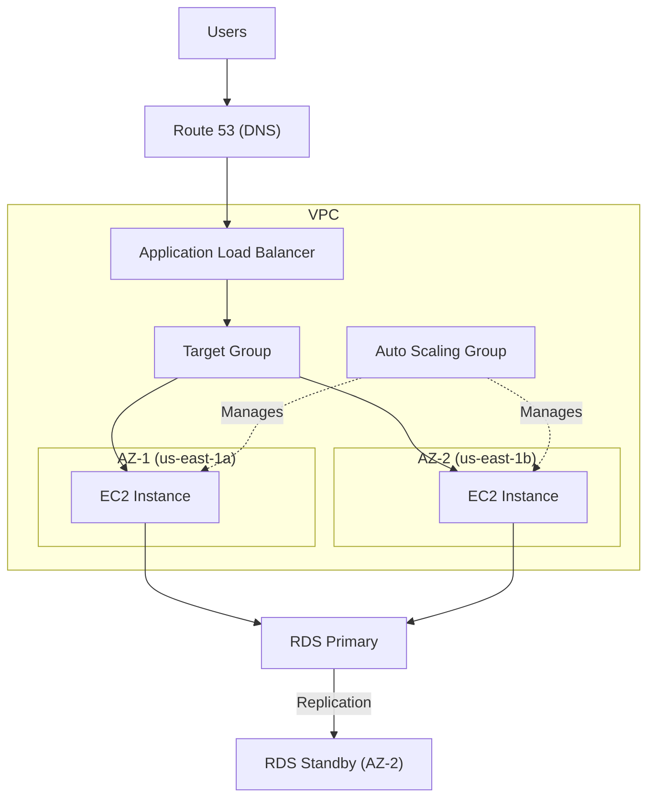
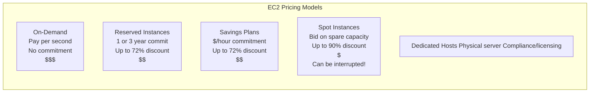
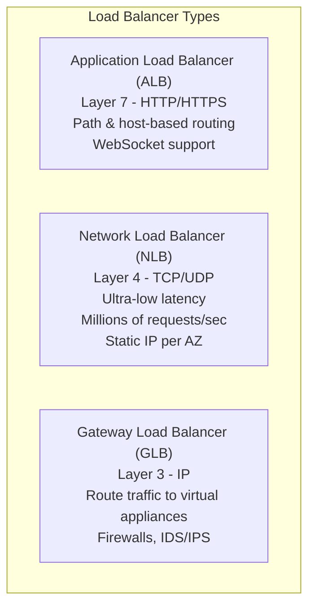
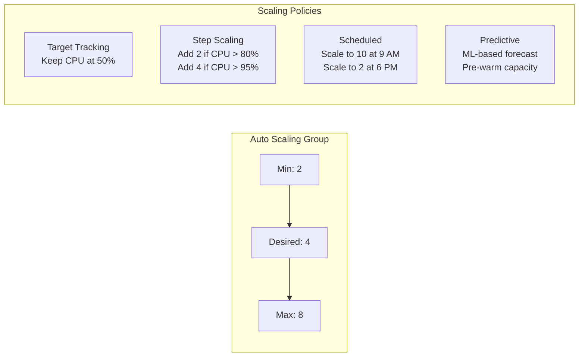
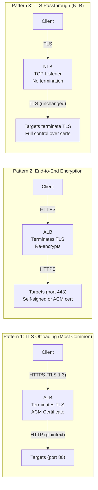

# Compute

## Overview

AWS Compute services let you run applications without owning physical servers. **EC2** is the foundational compute service — virtual machines in the cloud. On top of EC2, AWS provides **Auto Scaling** to handle demand, **Elastic Load Balancing** to distribute traffic, and **Elastic Beanstalk** for easy app deployment.

## Key Concepts

| Concept | Description |
|---------|-------------|
| **EC2 Instance** | A virtual machine running on AWS physical servers |
| **AMI** | Amazon Machine Image — a template for launching instances (OS + software) |
| **Instance Type** | Defines CPU, memory, storage, and network capacity (e.g., t3.micro) |
| **Security Group** | Virtual firewall controlling inbound/outbound traffic at the instance level |
| **Key Pair** | SSH key for secure login to Linux instances |
| **User Data** | Bootstrap script that runs on first launch |
| **Elastic IP** | Static public IPv4 address you can attach to an instance |

## Architecture Diagram

### High-Availability Web Application

## Deep Dive

### EC2 Instance Types

| Family | Optimized For | Use Case | Example |
|--------|--------------|----------|---------|
| **T** (Burstable) | General purpose, burstable CPU | Dev/test, small web apps | t3.micro, t3.medium |
| **M** (General) | Balanced compute/memory/network | Web servers, app servers | m6i.large, m7g.xlarge |
| **C** (Compute) | High-performance processors | Batch processing, ML inference | c6i.2xlarge |
| **R** (Memory) | Large in-memory datasets | In-memory databases, caches | r6i.4xlarge |
| **I** (Storage) | High sequential read/write to local storage | NoSQL databases, data warehousing | i3.xlarge |
| **G/P** (Accelerated) | GPU instances | ML training, video rendering | p4d.24xlarge, g5.xlarge |
| **Graviton (g suffix)** | ARM-based, 40% better price-performance | General workloads | m7g.large, c7g.xlarge |

### EC2 Purchasing Options

| Option | Discount | Commitment | Interruption? | Best For |
|--------|---------|------------|---------------|----------|
| **On-Demand** | 0% | None | No | Short-term, unpredictable workloads |
| **Reserved** | Up to 72% | 1 or 3 years | No | Steady-state workloads |
| **Savings Plans** | Up to 72% | $/hour for 1-3 years | No | Flexible across instance types |
| **Spot** | Up to 90% | None | **Yes (2-min warning)** | Fault-tolerant, batch, CI/CD |
| **Dedicated Hosts** | Varies | Optional | No | Compliance, BYOL |
| **Dedicated Instances** | Varies | Optional | No | Hardware isolation, less control than Hosts |

### EC2 Placement Groups

| Strategy | Behavior | Use Case |
|----------|----------|----------|
| **Cluster** | Instances packed close together in one AZ | HPC, low-latency networking |
| **Spread** | Instances on different hardware (max 7 per AZ) | Critical instances that must be isolated |
| **Partition** | Instances in logical partitions on different racks | Large distributed systems (HDFS, Cassandra) |

### Elastic Load Balancing (ELB)

| Feature | ALB | NLB | GLB |
|---------|-----|-----|-----|
| **Layer** | 7 (HTTP/HTTPS) | 4 (TCP/UDP/TLS) | 3 (IP) |
| **Routing** | Path, host, header, query string | Port-based | Transparent to apps |
| **Performance** | Good | Extreme (millions req/s) | N/A |
| **Static IP** | No (use Global Accelerator) | Yes, 1 per AZ | No |
| **Use Case** | Web apps, microservices | Gaming, IoT, real-time | Security appliances |
| **Health Checks** | HTTP/HTTPS | TCP/HTTP/HTTPS | HTTP/HTTPS |
| **SSL Termination** | Yes | Yes (TLS) | No |

### Auto Scaling

| Policy Type | How It Works | Best For |
|------------|-------------|----------|
| **Target Tracking** | Maintain a metric at target (e.g., CPU at 50%) | Most use cases |
| **Step Scaling** | Add/remove instances based on CloudWatch alarm thresholds | Variable step sizes |
| **Scheduled** | Scale at specific times | Predictable patterns |
| **Predictive** | ML forecasts demand and pre-provisions | Recurring spikes |

### Elastic Beanstalk

A PaaS that abstracts infrastructure: upload your code and Beanstalk handles EC2, Auto Scaling, ELB, RDS, and monitoring. Supports Java, .NET, PHP, Node.js, Python, Ruby, Go, Docker.

- **Single Instance**: One EC2 for dev/test
- **High Availability**: ALB + ASG across AZs for production
- **Worker Tier**: Processes messages from SQS (no web traffic)

## Best Practices

1. **Use Graviton instances** for 40% better price-performance (ARM-based)
2. **Combine purchasing options**: Reserved for baseline + Spot for burst capacity
3. **Use Launch Templates** (not Launch Configurations) for Auto Scaling
4. **Always deploy across multiple AZs** with an ALB
5. **Use target tracking scaling** as the default policy
6. **Enable detailed monitoring** (1-minute intervals) for production
7. **Use IMDSv2** (Instance Metadata Service v2) to prevent SSRF attacks
8. **Never store credentials on EC2** — use IAM roles via instance profiles
9. **Use Spot Instances for stateless workloads** (batch, CI/CD runners)
10. **Right-size instances** using AWS Compute Optimizer

## Common Interview Questions

### Q1: What are the EC2 purchasing options and when would you use each?

**A:** (1) **On-Demand** — no commitment, full price; use for unpredictable short-term workloads. (2) **Reserved Instances** — 1-3 year commitment, up to 72% discount; use for steady-state (databases, baseline servers). (3) **Savings Plans** — commit to $/hour, flexible across instance families; best general-purpose savings. (4) **Spot** — up to 90% discount, can be interrupted with 2-min warning; use for fault-tolerant batch jobs. (5) **Dedicated Hosts** — physical server for compliance/BYOL. A typical production strategy mixes Reserved for baseline + Spot for burst + On-Demand for remainder.

### Q2: What is the difference between ALB, NLB, and GLB?

**A:** **ALB** operates at Layer 7 (HTTP), supports path/host-based routing, great for microservices and web apps. **NLB** operates at Layer 4 (TCP/UDP), handles millions of requests per second with ultra-low latency, provides static IPs per AZ, ideal for gaming/IoT. **GLB** operates at Layer 3, routes traffic transparently to security appliances (firewalls, IDS). Rule of thumb: if you need HTTP routing, use ALB. If you need extreme performance or static IPs, use NLB.

### Q3: How does Auto Scaling work?

**A:** An Auto Scaling Group (ASG) maintains a fleet of EC2 instances between a minimum and maximum count. It uses Launch Templates to define instance configuration. Scaling is triggered by policies: target tracking (maintain CPU at 50%), step scaling (add instances at threshold), scheduled (time-based), or predictive (ML-based). ASG also replaces unhealthy instances automatically. Cooldown periods prevent rapid scale in/out oscillation.

### Q4: What is the difference between vertical and horizontal scaling?

**A:** **Vertical scaling** (scale up) = increase instance size (t3.micro → t3.xlarge). Limited by max instance size, requires downtime. **Horizontal scaling** (scale out) = add more instances. Theoretically unlimited, no downtime, requires a load balancer. AWS is designed for horizontal scaling. Use Auto Scaling Groups with ELB for horizontal scaling.

### Q5: What are EC2 Placement Groups?

**A:** Three strategies: **Cluster** — instances in same rack for lowest latency (HPC, tightly coupled workloads). **Spread** — instances on different hardware, max 7 per AZ (critical apps needing isolation). **Partition** — instances in logical partitions across racks (distributed databases like Cassandra, HDFS). Cluster for performance, Spread for availability, Partition for large distributed systems.

### Q6: How do Spot Instances work and how do you handle interruptions?

**A:** Spot Instances let you use spare EC2 capacity at up to 90% discount. AWS can reclaim them with a 2-minute warning. Handling strategies: (1) Use Spot Fleet with diverse instance types to reduce interruption probability, (2) Use ASG with mixed instance types and On-Demand fallback, (3) Checkpoint work regularly, (4) Use EventBridge to catch the interruption notice and drain gracefully. Never use Spot for databases or stateful single-instance workloads.

### Q7: What is the difference between Security Groups and NACLs?

**A:** **Security Groups**: Stateful (return traffic automatically allowed), instance-level, allow rules only, all rules evaluated. **NACLs**: Stateless (must allow both inbound and outbound), subnet-level, allow and deny rules, rules evaluated in order. Use Security Groups as primary defense (per instance), NACLs as a second layer (per subnet). Typical setup: NACL denies known bad IPs; Security Group allows only needed ports.

### Q8: What is EC2 Instance Store vs EBS?

**A:** **Instance Store**: Physically attached NVMe storage, extremely fast, ephemeral (data lost on stop/terminate), free with instance. **EBS**: Network-attached persistent storage, survives stop/start, supports snapshots. Use Instance Store for temporary data (cache, buffers, scratch space). Use EBS for OS drives, databases, anything that must persist.

### Q9: Explain ELB health checks and connection draining.

**A:** ELB sends health check requests (HTTP/TCP) to targets at configured intervals. If a target fails consecutive checks, it's marked unhealthy and removed from rotation. **Connection draining** (deregistration delay) gives in-flight requests time to complete before fully removing a target (default 300 seconds). This prevents dropped connections during deployments or scale-in events.

### Q10: What is Elastic Beanstalk and when would you use it?

**A:** Elastic Beanstalk is a PaaS — you upload code and it provisions EC2, ALB, ASG, RDS automatically. Use it when you want quick deployment without managing infrastructure. It supports multiple languages and Docker. You retain full control and can customize via .ebextensions. Avoid it when you need fine-grained infrastructure control or are already using containers (use ECS/EKS instead).

## Latest Updates (2025-2026)

- **Graviton4 processors (R8g instances)** launched, delivering up to 30% better compute performance over Graviton3 and up to 60% better price-performance compared to x86 equivalents, with enhanced memory bandwidth for data-intensive workloads.
- **New instance generations** across major families: **C7g** (compute-optimized Graviton3), **M7g** (general purpose Graviton3), **R7g** (memory-optimized Graviton3), and **Hpc7g** (high-performance computing Graviton3) offer significant improvements in performance per dollar.
- **EC2 Instance Connect Endpoint** GA — enables SSH and RDP connectivity to EC2 instances in private subnets without a bastion host, public IP, NAT gateway, or VPN. Traffic flows through a VPC endpoint, drastically simplifying and securing remote access.
- **On-Demand Capacity Reservations** now support capacity blocks for ML workloads, allowing you to reserve GPU instances (P5, Trn2) for defined future time windows to guarantee capacity for training jobs.
- **Mac instances** (M1, M2) available for macOS development, enabling iOS and macOS app builds and testing on native Apple silicon in the cloud. Dedicated hosts with a minimum 24-hour allocation.
- **Inf2 instances** for ML inference deliver up to 4x higher throughput and 10x lower latency per watt compared to Inf1, powered by AWS Inferentia2 chips. **Trn2 instances** powered by Trainium2 chips provide up to 4x the training performance of Trn1 for large language models.
- **EC2 Fleet** enhanced with allocation strategies that combine Spot and On-Demand in a single request, with attribute-based instance type selection (ABIS) to automatically choose instance types based on vCPU, memory, and architecture requirements.

### Q11: What are Graviton processors and what is the migration strategy?

**A:** Graviton processors are AWS-designed ARM-based chips that offer significantly better price-performance than x86 (Intel/AMD) instances — up to 40% with Graviton3 and 60% with Graviton4. They are identified by the `g` suffix in instance type names (e.g., m7g.large, c7g.xlarge, r8g.2xlarge). Migration strategy: (1) Start with stateless workloads like web servers and containers that are easy to test and roll back. (2) Verify your software supports ARM/aarch64 — most modern Linux distributions, containers, and runtimes (Java 11+, Python, Node.js, .NET 6+) work natively. (3) Use multi-architecture Docker images to support both x86 and ARM in the same ECS/EKS cluster. (4) Test thoroughly in staging, then gradually shift traffic using weighted target groups. (5) Watch for native library dependencies that may need ARM compilation. The effort is typically low for interpreted languages and container workloads.

### Q12: How would you implement immutable infrastructure on AWS?

**A:** Immutable infrastructure means servers are never modified after deployment — instead, you replace them entirely with new instances built from a fresh image. Implementation: (1) Use **EC2 Image Builder** or Packer to create golden AMIs with all software pre-installed and hardened. (2) Store AMI IDs in SSM Parameter Store and reference them in **Launch Templates**. (3) Use **Auto Scaling Groups** with rolling updates — deploy a new version by updating the launch template to the new AMI and initiating an instance refresh. (4) Infrastructure as Code (CloudFormation/Terraform) defines the desired state. (5) Blue/green deployments: create a new ASG with the new AMI, shift traffic via ALB target groups, then terminate the old ASG. Benefits: eliminates configuration drift, simplifies rollback (just point back to the old AMI), and ensures every server is identical. This pattern aligns with the DevOps principle of treating servers as "cattle, not pets."

### Q13: What is EC2 Instance Connect Endpoint and why does it replace bastion hosts?

**A:** EC2 Instance Connect Endpoint (EIC Endpoint) is a VPC-level resource that enables SSH and RDP connections to EC2 instances in private subnets without needing a bastion host, public IP address, NAT gateway, or Direct Connect/VPN. You create an endpoint in your VPC, and the connection flows through AWS's private network via the endpoint. Benefits over bastion hosts: no additional EC2 instance to manage, patch, and secure; no public subnet required; IAM policies control who can connect to which instances; connections are logged in CloudTrail for auditability. You can use the AWS CLI (`aws ec2-instance-connect ssh`) or the console to connect. IAM policies can restrict access by instance tags, IP address, or instance ID, providing granular control.

### Q14: What are Capacity Reservations and how do they compare to On-Demand and Reserved Instances?

**A:** On-Demand Capacity Reservations (ODCRs) guarantee that EC2 capacity is available for you in a specific AZ when you need it, without any long-term commitment. You pay the On-Demand rate whether you use the capacity or not. Compare this to: **On-Demand** — no capacity guarantee (during high-demand events, you might not get instances). **Reserved Instances** — billing discount + implicit capacity reservation in an AZ (but standard RIs don't guarantee capacity in all cases). **Savings Plans** — billing discount only, no capacity guarantee. Use ODCRs for mission-critical workloads that absolutely must launch during disaster recovery or scaling events. You can combine ODCRs with Savings Plans to get both the capacity guarantee and the discount. **Capacity Blocks** are a newer variant that reserve GPU instances for future time windows, ideal for planned ML training jobs.

### Q15: What is the difference between EC2 hibernation, stop, and terminate?

**A:** **Terminate** destroys the instance permanently — the root EBS volume is deleted (unless `DeleteOnTermination` is set to false), instance store data is lost, and the instance cannot be restarted. **Stop** halts the instance — the root EBS volume persists, you stop paying for compute (but still pay for EBS), instance store data is lost, and the public IP may change on restart. **Hibernate** saves the contents of RAM to the root EBS volume, then stops the instance. When you restart, the RAM contents are loaded back, and applications resume exactly where they left off without a cold boot. Hibernation is useful for long-initialization applications (large in-memory caches, pre-loaded ML models) where boot time matters. Requirements for hibernation: EBS root volume must be encrypted and large enough to hold the RAM, instance RAM must be under 150 GB, and hibernation must be enabled at launch.

### Q16: What is EC2 Image Builder?

**A:** EC2 Image Builder is a fully managed service that automates the creation, testing, and distribution of custom AMIs and container images. You define a pipeline with: (1) a base image (Amazon Linux, Windows, Ubuntu), (2) build components (install software, run scripts, apply security patches), and (3) test components (validate the image works correctly). Image Builder runs the pipeline on a schedule or on-demand, launches a temporary instance, applies the components, creates the image, tests it, and distributes it to specified regions and accounts. It integrates with SSM for patching and with AWS Organizations for cross-account sharing. This service is essential for immutable infrastructure because it automates the golden AMI creation process and ensures images are always up to date with security patches.

### Q17: How can you optimize EC2 costs without using Reserved Instances?

**A:** Several strategies beyond RIs: (1) **Savings Plans** — commit to a $/hour spend for 1-3 years, with more flexibility than RIs (Compute Savings Plans apply across instance families, regions, and even Fargate/Lambda). (2) **Spot Instances** — up to 90% discount for fault-tolerant workloads. Use Spot Fleet with diversified allocation across multiple instance types and AZs to minimize interruptions. (3) **AWS Compute Optimizer** — analyzes CloudWatch metrics and recommends right-sizing (many instances are over-provisioned by 30-50%). (4) **Graviton instances** — switch to ARM-based instances for 40-60% better price-performance. (5) **Auto Scaling** — scale in during low-demand periods instead of running instances 24/7. (6) **Scheduled scaling** — for predictable patterns (scale down at night/weekends). (7) **Instance Scheduler** — automatically stop dev/test instances outside business hours. (8) **Spot mixed with On-Demand** in ASGs — use On-Demand for baseline capacity and Spot for burst.

### Q18: What is the deep difference between NLB and ALB?

**A:** **ALB** operates at Layer 7 (HTTP/HTTPS) and inspects request content to make routing decisions — it supports path-based routing (/api vs /web), host-based routing (api.example.com vs web.example.com), HTTP header/method conditions, and query string routing. ALB terminates the TLS connection and can modify requests (add headers, redirect). It's ideal for microservices, WebSocket, HTTP/2, and gRPC. **NLB** operates at Layer 4 (TCP/UDP/TLS) and routes connections without inspecting content — it handles millions of requests per second with ultra-low latency (~100 microseconds), preserves the source IP address, provides a static IP per AZ (or Elastic IP), and supports TLS passthrough. NLB is ideal for TCP-based protocols (databases, MQTT, custom TCP), gaming, IoT, and situations where you need static IPs (firewall allowlisting). Key operational difference: ALB scales by adding nodes and changing DNS, so its IPs change over time. NLB has fixed IPs. For hybrid architectures, you can put an NLB in front of an ALB to get both static IPs and Layer 7 routing.

### Q19: What are cross-zone load balancing costs and when should you disable it?

**A:** Cross-zone load balancing distributes traffic evenly across all registered targets in all enabled AZs, regardless of the AZ the traffic entered. **ALB** has cross-zone enabled by default at no extra charge. **NLB** and **GLB** have cross-zone disabled by default, and enabling it incurs inter-AZ data transfer charges (typically $0.01/GB). You might disable cross-zone load balancing when: (1) your architecture is already balanced across AZs, (2) you want to minimize inter-AZ data transfer costs (which can be significant at high volumes), or (3) you want to implement AZ-aware routing where each AZ operates semi-independently for fault isolation (the "cell-based architecture" pattern). When cross-zone is disabled, each AZ's load balancer node only routes to targets within its own AZ, so you must ensure equal capacity in each AZ to avoid overloading.

### Q20: What are connection draining (deregistration delay) and slow start mode?

**A:** **Connection draining** (officially called deregistration delay) is the period the load balancer waits for in-flight requests to complete before fully deregistering a target. Default is 300 seconds. When a target is deregistering (during scale-in, deployment, or health check failure), the LB stops sending new requests but allows existing connections to finish within the delay period. For short-lived requests (APIs), reduce this to 30-60 seconds. For long-lived connections (WebSocket, file uploads), increase it. **Slow start mode** is an ALB feature that gradually increases the share of traffic sent to a newly registered target over a configurable ramp-up period (30-900 seconds). Without slow start, a new target immediately receives its full share of traffic, which can overwhelm applications that need to warm up caches, initialize connection pools, or JIT-compile code.

### Q21: What is the difference between Launch Templates and Launch Configurations?

**A:** Launch Configurations are the legacy mechanism for defining EC2 instance configurations in Auto Scaling Groups. **Launch Templates** are the recommended replacement and provide significant additional capabilities: versioning (maintain multiple versions and set a default), mixed instance types within a single ASG, support for Spot and On-Demand in the same group, ability to specify multiple network interfaces, ability to use the latest AMI via SSM parameter references, and support for Dedicated Hosts and placement groups. Launch Configurations cannot be modified after creation (you must create a new one), while Launch Templates support versioning. AWS recommends migrating all Launch Configurations to Launch Templates, and Launch Configurations no longer receive new features. Launch Templates can also be used outside of ASG — for one-off instance launches, EC2 Fleet, and Spot Fleet.

### Q22: What are EC2 Fleet and Spot Fleet strategies?

**A:** **EC2 Fleet** lets you launch a mix of On-Demand, Reserved, and Spot instances in a single API call. You define target capacity (by instances or vCPUs), specify a list of instance types and AZs, and set allocation strategies. **Spot Fleet** is a subset focused on Spot instances with optional On-Demand fallback. Key allocation strategies: (1) **lowest-price** — picks the cheapest instance types (higher interruption risk). (2) **capacity-optimized** — picks pools with the most available capacity (lower interruption risk, recommended for most workloads). (3) **diversified** — distributes across all pools equally (good for long-running workloads). (4) **price-capacity-optimized** — balances price and capacity (newest and generally best strategy). For production, use **Attribute-Based Instance Type Selection (ABIS)** where you specify requirements (e.g., 4 vCPUs, 16 GB RAM, ARM architecture) and AWS automatically selects matching instance types. This eliminates the need to manually list instance types and future-proofs your fleet against new instance type launches.

### Q23: What are the Elastic Beanstalk deployment policies and when would you use each?

**A:** Elastic Beanstalk offers five deployment policies that trade off speed, cost, and downtime:

| Policy | Downtime? | Deploy Time | Cost During Deploy | Rollback Speed |
|--------|-----------|-------------|-------------------|----------------|
| **All-at-once** | Yes | Fastest | No extra cost | Re-deploy (slow) |
| **Rolling** | No (reduced capacity) | Medium | No extra cost | Re-deploy (slow) |
| **Rolling with additional batch** | No (full capacity) | Medium-slow | Extra batch cost | Re-deploy (slow) |
| **Immutable** | No (full capacity) | Slowest | Double capacity cost | Fast (terminate new ASG) |
| **Blue/Green** | No (full capacity) | Slow | Double environment cost | Fast (swap URLs back) |

**(1) All-at-once** — deploys to all instances simultaneously. Fastest, but causes downtime. Use only in dev/test environments where brief outages are acceptable. **(2) Rolling** — deploys in batches (configurable batch size). Running capacity is reduced during deployment because each batch is taken out of service. Use for cost-sensitive production workloads that can tolerate reduced capacity. **(3) Rolling with additional batch** — launches a new batch of instances first, then does a rolling deploy. Maintains full capacity throughout. Use for production workloads where you cannot afford reduced capacity but want to minimize extra cost. **(4) Immutable** — launches a completely new set of instances in a temporary Auto Scaling Group, deploys to them, passes health checks, then swaps them into the original ASG and terminates the old instances. Use for production where you need fast rollback — just terminate the new ASG. **(5) Blue/Green** — not a native Beanstalk deployment policy but achieved by creating a separate Beanstalk environment (green), deploying to it, then swapping CNAMEs or using Route 53 weighted routing to shift traffic. Use for zero-risk production releases where you need full validation before switching traffic.

**Customization via .ebextensions and platform hooks**: `.ebextensions/` is a folder in your application source bundle containing `.config` YAML files that customize the environment — install packages, create files, configure services, set environment variables, and define CloudFormation resources. **Platform hooks** (in `.platform/hooks/`) are scripts that run at specific lifecycle stages: `prebuild/` (before the application is built), `predeploy/` (after build but before deployment), and `postdeploy/` (after deployment completes). Platform hooks replaced the older container_commands approach and provide cleaner lifecycle integration.

### Q24: When should you use Elastic Beanstalk vs ECS vs Lambda?

**A:** This is a common decision framework question. Each service targets a different operational model:

| Criteria | Elastic Beanstalk | ECS/EKS (Containers) | Lambda (Serverless) |
|----------|-------------------|----------------------|---------------------|
| **Abstraction level** | PaaS — deploy code, infra managed | Container orchestration — you manage task definitions & services | FaaS — deploy functions, no servers |
| **Control over infra** | Moderate (customizable via .ebextensions) | High (task placement, networking, service mesh) | Minimal (runtime, memory, timeout) |
| **Startup time** | Seconds (running EC2) | Seconds (running containers) | Milliseconds to seconds (cold start) |
| **Max execution time** | Unlimited (long-running servers) | Unlimited (long-running containers) | 15 minutes max |
| **Scaling granularity** | EC2 instances | Tasks/containers | Individual function invocations |
| **Portability** | AWS-specific | Highly portable (Docker/K8s) | AWS-specific |
| **Cost model** | Pay for EC2/RDS always running | Pay for EC2 or Fargate | Pay per invocation (zero when idle) |
| **Best for** | Monoliths, quick MVPs, small teams | Microservices, hybrid/multi-cloud | Event-driven, APIs, glue logic |

**Use Elastic Beanstalk when**: you want the fastest path from code to production, your team is small and does not want to manage infrastructure, you have a traditional web application (monolith or simple multi-tier), and you want built-in managed updates, monitoring, and health dashboards. Beanstalk is ideal for startups and prototypes that may graduate to containers later.

**Use ECS/EKS (containers) when**: you have a microservices architecture, you need workload portability across cloud providers or on-premises (Kubernetes), you need fine-grained resource allocation (CPU/memory per container), you want service mesh capabilities (App Mesh, Istio), or you have long-running background processes. ECS with Fargate removes the need to manage EC2 instances while keeping container-level control.

**Use Lambda when**: your workload is event-driven (S3 uploads, DynamoDB Streams, API Gateway requests), execution time is under 15 minutes, traffic is bursty or unpredictable (including periods of zero traffic), you want to pay nothing when idle, or you are building glue logic between AWS services. Avoid Lambda for steady high-throughput workloads (containers are more cost-effective) or workloads sensitive to cold-start latency.

### Q25: What is Gateway Load Balancer (GWLB) and how does it differ from ALB/NLB?

**A:** Gateway Load Balancer is a specialized load balancer that combines a transparent network gateway (single entry/exit point for all traffic) with a load balancer that distributes traffic to a fleet of third-party virtual appliances — firewalls (Palo Alto, Fortinet, Check Point), intrusion detection/prevention systems (IDS/IPS), deep packet inspection tools, and network analytics appliances.

**How it works**: GWLB operates at Layer 3 (network layer) and uses the **GENEVE protocol** (Generic Network Virtualization Encapsulation) on port 6081 to encapsulate the original packet, forward it to an appliance, and receive it back — all while preserving the original source/destination IP addresses. The traffic flow is: (1) traffic enters the VPC through an Internet Gateway, (2) route table sends it to a **GWLB Endpoint** (powered by AWS PrivateLink), (3) the endpoint forwards to GWLB, (4) GWLB sends the packet (GENEVE-encapsulated) to a healthy appliance, (5) the appliance inspects/modifies and returns it, (6) GWLB sends it to the final destination.

**Key differences from ALB/NLB**:

| Aspect | ALB | NLB | GWLB |
|--------|-----|-----|------|
| **Layer** | 7 (HTTP/HTTPS) | 4 (TCP/UDP) | 3 (IP packets) |
| **Purpose** | Route HTTP requests to apps | Route TCP/UDP connections | Route all IP traffic to appliances |
| **Visibility** | Terminates connection, sees HTTP | Passes through TCP/UDP | Transparent — preserves original packets |
| **Protocol** | HTTP/HTTPS/gRPC | TCP/UDP/TLS | GENEVE (port 6081) |
| **Typical targets** | Web servers, microservices | Any TCP/UDP service | Security appliances (firewalls, IDS/IPS) |
| **Traffic modification** | Yes (add headers, redirect) | No | No (transparent pass-through) |

**Use cases**: (1) Centralized firewall inspection — route all VPC ingress/egress traffic through a fleet of firewalls. (2) Compliance — ensure all traffic is inspected by an IDS/IPS before reaching workloads. (3) Network monitoring — mirror and analyze traffic for threat detection. (4) Shared services VPC — deploy appliances once in a central VPC and use GWLB endpoints from multiple spoke VPCs via Transit Gateway.

### Q26: What are the advanced ELB features you should know for production?

**A:** Several features beyond basic load balancing are critical for production architectures:

**Session stickiness (sticky sessions)**: Ensures a client's requests always go to the same target. Two types: (1) **Duration-based** — the ELB generates a cookie (`AWSALB` for ALB) with a configurable expiry (1 second to 7 days). (2) **Application-based** — your application generates a custom cookie and the ELB uses it to maintain affinity. Use stickiness when your application stores session state locally (shopping carts, user sessions), but prefer externalizing state to ElastiCache or DynamoDB for better scalability.

**SSL/TLS offloading**: The load balancer terminates the TLS connection, decrypts traffic, and forwards plaintext HTTP to backend targets. This offloads CPU-intensive cryptographic work from your instances. You manage certificates via **AWS Certificate Manager (ACM)** — free, auto-renewing public certificates. ALB supports SNI (Server Name Indication) for hosting multiple TLS domains on a single listener. For end-to-end encryption, configure the backend target group to use HTTPS as well (re-encrypt between LB and target).

**Connection draining (deregistration delay)**: When a target is deregistering, the ELB stops sending new requests but allows in-flight connections to complete within a configurable timeout (0-3600 seconds, default 300). Set to 30-60 seconds for short-lived API requests; increase for long-lived connections like WebSocket or file uploads.

**Cross-zone load balancing**: Distributes traffic evenly across all targets in all AZs, not just the targets in the AZ that received the traffic. ALB has it enabled by default (no extra charge). NLB and GWLB have it disabled by default (inter-AZ data transfer charges apply when enabled). Disable it for cost savings at high traffic volumes or for cell-based architectures where each AZ operates independently.

**Slow start mode**: ALB gradually ramps traffic to newly registered targets over 30-900 seconds. Without this, a new instance immediately receives its full share of traffic, which can overwhelm applications that need to warm JIT caches, connection pools, or in-memory data.

**Request routing algorithms**: (1) **Round robin** — ALB default, distributes requests sequentially. (2) **Least outstanding requests** — ALB sends to the target with the fewest in-progress requests, better for varying request processing times. (3) **Flow hash** — NLB default, uses a hash of source IP/port, destination IP/port, and protocol to assign a flow to a target for the lifetime of the connection.

### Q27: Explain all EC2 purchase options in depth, including the sub-types and when to use each.

**A:** EC2 offers a spectrum of purchase options that trade commitment for cost savings:

**On-Demand**: Full price, no commitment, launch and terminate at will. Use for short-lived workloads, development, unpredictable traffic, or as a fallback when Reserved/Spot capacity is insufficient.

**Reserved Instances (RIs)** come in three sub-types: (1) **Standard RI** — up to 72% discount, locked to a specific instance family, size, OS, tenancy, and region (or AZ for capacity reservation). You can modify the AZ or network platform, and sell unused RIs on the Reserved Instance Marketplace. (2) **Convertible RI** — up to 66% discount, allows you to change the instance family, OS, tenancy, and scope during the term. Use when you expect your instance needs to evolve. (3) **Scheduled RI** (being phased out) — reserved capacity for specific recurring time windows (e.g., every weekday 9 AM-5 PM). Being replaced by Savings Plans and On-Demand Capacity Reservations. All RIs are 1-year or 3-year terms with payment options: All Upfront (maximum discount), Partial Upfront, or No Upfront.

**Savings Plans** come in three sub-types: (1) **Compute Savings Plans** — up to 66% discount, most flexible. Apply across any EC2 instance family, size, region, OS, tenancy, and also apply to Fargate and Lambda. Use as the default savings mechanism. (2) **EC2 Instance Savings Plans** — up to 72% discount, locked to a specific instance family in a specific region (but flexible on size, OS, and tenancy). Use when you are confident in your instance family and region. (3) **SageMaker Savings Plans** — up to 64% discount on SageMaker ML instances. Savings Plans commit you to a consistent $/hour spend for 1 or 3 years.

**Spot Instances** — up to 90% discount on spare EC2 capacity. AWS can reclaim them with a **2-minute interruption notice** via instance metadata and EventBridge. Sub-concepts: (1) **Spot Fleet** — request a fleet of Spot instances with allocation strategies: `capacity-optimized` (picks pools with most spare capacity — lowest interruption rate), `price-capacity-optimized` (balances price and capacity — recommended default), `lowest-price` (cheapest pools — highest interruption risk), `diversified` (spreads across all pools — best for long-running workloads). (2) **Spot Block** (deprecated) — reserved Spot for 1-6 hours without interruption. (3) **Interruption handling** — use EventBridge to catch the interruption notice, drain connections, checkpoint state, and gracefully shut down. Use ASGs with mixed instance policies (On-Demand base + Spot overflow) for resilience. Never use Spot for databases, stateful singletons, or anything that cannot tolerate interruption.

**Dedicated Hosts** vs **Dedicated Instances**: Both provide hardware isolation, but they serve different purposes. **Dedicated Hosts** give you an entire physical server — you have visibility into sockets, cores, and host ID. Use for: bring-your-own-license (BYOL) software that requires per-socket or per-core licensing (Windows Server, SQL Server, Oracle), compliance requirements mandating physical server control, and consistent host affinity. You can share Dedicated Hosts across accounts with AWS RAM. **Dedicated Instances** run on hardware dedicated to your account but you have no visibility or control over the physical server. Use when you need hardware isolation for compliance but do not need BYOL or socket-level visibility.

| Option | Max Discount | Commitment | Flexibility | Interruption? |
|--------|-------------|------------|-------------|---------------|
| On-Demand | 0% | None | Full | No |
| Standard RI | 72% | 1-3 years | Locked family/region | No |
| Convertible RI | 66% | 1-3 years | Can change family | No |
| Compute Savings Plan | 66% | 1-3 years | Any family/region + Fargate/Lambda | No |
| EC2 Instance Savings Plan | 72% | 1-3 years | Locked family/region, flexible size | No |
| Spot | 90% | None | Full | **Yes** (2-min warning) |
| Dedicated Host | Varies | Optional (1-3 yr for discount) | Locked to host | No |
| Dedicated Instance | Varies | None | Per-instance | No |

### Q28: Explain EC2 Placement Groups in depth with real-world use cases for each type.

**A:** Placement Groups let you control how EC2 instances are physically placed on underlying hardware. There are three strategies, each optimizing for a different dimension:

**Cluster Placement Group** — all instances are placed on the same rack (or closely connected racks) within a single Availability Zone. This provides the lowest possible network latency (up to 10 Gbps or 25 Gbps with enhanced networking between instances in the group) and highest throughput between instances. **Constraints**: limited to a single AZ (no high availability), best results when all instances are the same type and launched together (launching incrementally may fail with `InsufficientInstanceCapacity` if the rack is full). **Real-world use cases**: (1) HPC workloads using MPI (weather simulation, fluid dynamics, genome sequencing) where inter-node communication latency directly impacts runtime. (2) Distributed ML training across multiple GPU instances (p4d, p5) using NCCL, where gradient synchronization requires ultra-low latency. (3) Real-time financial trading systems where microseconds matter.

**Spread Placement Group** — each instance is placed on distinct underlying hardware (different racks with independent power and network). You can span multiple AZs, but there is a hard limit of **7 instances per AZ per group**. **Constraints**: the 7-per-AZ limit means this does not scale for large fleets; it is designed for small sets of critical instances. **Real-world use cases**: (1) Primary database instances — place your RDS or self-managed database primary and replicas on separate hardware to ensure a single hardware failure does not take out multiple nodes. (2) ZooKeeper or etcd clusters (typically 3-5 nodes) where losing more than one node simultaneously is catastrophic. (3) Kafka controller nodes or Elasticsearch master-eligible nodes where hardware isolation is essential for quorum safety.

**Partition Placement Group** — instances are divided into logical partitions (up to **7 partitions per AZ**), where each partition maps to a separate rack. Instances in the same partition share hardware, but instances in different partitions are guaranteed to be on different racks. You can have hundreds of instances per partition. The key difference from Spread is that Partition scales to large deployments while still providing rack-level fault isolation. **Real-world use cases**: (1) HDFS — place NameNode replicas and DataNode groups in different partitions so that a rack failure only loses one copy of the data. (2) Apache Cassandra — map Cassandra's replication factor to partitions so replicas are rack-aware by default. (3) HBase RegionServers — distribute regions across partitions to prevent a rack failure from taking out multiple regions. (4) Apache Kafka brokers — place brokers in different partitions to align with Kafka's rack-aware replica assignment. Partition placement groups expose partition metadata to the application (via instance metadata), allowing partition-aware systems like HDFS and Cassandra to make topology-aware replication decisions.

**Summary decision table**:

| Factor | Cluster | Spread | Partition |
|--------|---------|--------|-----------|
| **Optimizes for** | Lowest latency | Maximum availability | Rack-level fault isolation at scale |
| **AZ span** | Single AZ only | Multi-AZ | Multi-AZ |
| **Scale** | Hundreds of instances | Max 7 per AZ | Hundreds per partition, 7 partitions per AZ |
| **Best for** | HPC, ML training | Small critical clusters | Large distributed systems |
| **Failure blast radius** | Entire group (same rack) | One instance | One partition (one rack) |

## Deep Dive Notes

### EC2 Networking Deep Dive (ENI, ENA, EFA)

- **ENI (Elastic Network Interface)**: The basic virtual network card for EC2. Every instance has a primary ENI (eth0) that cannot be detached, and you can attach additional ENIs for multi-homed configurations or to move a private IP between instances during failover. Each ENI can have multiple private IPs, one or more security groups, and optionally an Elastic IP.

- **ENA (Elastic Network Adapter)**: Enhanced networking driver that provides up to 100 Gbps network bandwidth with high packet-per-second (PPS) performance and low latency. ENA uses SR-IOV (Single Root I/O Virtualization) to bypass the hypervisor for network traffic, eliminating the virtualization overhead. Most current-generation instances support ENA by default. Always use ENA-enabled AMIs for production workloads.

- **EFA (Elastic Fabric Adapter)**: A specialized network interface for HPC and ML distributed training workloads. EFA provides OS-bypass capabilities using the libfabric API, enabling direct communication between instances without going through the operating system kernel — delivering latency and throughput comparable to on-premises HPC networks. EFA supports MPI (Message Passing Interface) and NCCL (NVIDIA Collective Communication Library) for distributed training. EFA is only available on specific instance types (p4d, p5, trn1, hpc7g, etc.) and works best with Cluster Placement Groups.

### Nitro System Architecture

The AWS Nitro System is the underlying platform for all modern EC2 instances. It offloads virtualization functions to dedicated hardware and software:

- **Nitro Cards**: Purpose-built cards that handle VPC networking, EBS storage, instance storage, and monitoring — moving these functions off the main CPU to dedicated hardware. This means nearly 100% of the host CPU is available to the customer workload.
- **Nitro Security Chip**: Provides a hardware root of trust. Protects the firmware and provides a locked-down security model where even AWS employees cannot access customer data on the host.
- **Nitro Hypervisor**: A lightweight hypervisor that manages memory and CPU allocation. It's significantly thinner than the previous Xen hypervisor, reducing overhead and improving performance.
- **Nitro Enclaves**: Isolated compute environments (TEEs — Trusted Execution Environments) that have no persistent storage, no network access, and no admin access — only a secure communication channel (vsock) with the parent instance. Use for processing sensitive data (keys, PII, health data) with cryptographic attestation.

### Instance Metadata Service (IMDS v1 vs v2)

IMDS provides instances with information about themselves (instance ID, IAM role credentials, network configuration) at `http://169.254.169.254`. This is a frequent security topic:

- **IMDSv1**: Simple HTTP GET request to the metadata endpoint. Vulnerable to SSRF attacks — if an attacker exploits an SSRF vulnerability in a web app running on EC2, they can make GET requests to the metadata endpoint and steal IAM role credentials. This was the vector in the Capital One breach (2019).
- **IMDSv2**: Requires a two-step process — first a PUT request with a hop limit header to get a session token, then the token must be included in subsequent GET requests. This mitigates SSRF because: (1) the PUT method is rarely forwarded by SSRF vectors, (2) the response hop limit (default 1) prevents the token from being usable from a container or forwarded request, (3) the session token has a configurable TTL. **Best practice**: Require IMDSv2 by setting `HttpTokens=required` on all instances, and enforce this with an SCP or Config rule. Many organizations disable IMDSv1 organization-wide.

### AMI Lifecycle Management

A mature AMI strategy includes:

1. **Golden AMI Pipeline**: Use EC2 Image Builder to automate: base OS → security patches → required agents (CloudWatch, SSM, antivirus) → hardening (CIS benchmark) → testing → distribution.
2. **Versioning**: Store AMI IDs in SSM Parameter Store (e.g., `/amis/amazon-linux/latest`). Launch Templates reference the parameter, so updating the AMI is a parameter change, not a template change.
3. **Cross-account sharing**: Share AMIs with member accounts using `ModifyImageAttribute`. Use AWS RAM (Resource Access Manager) for organization-wide sharing.
4. **Cross-region copying**: Copy AMIs to DR regions for disaster recovery. Automate with EventBridge rules that trigger on AMI creation.
5. **Deprecation and deregistration**: Use AMI deprecation dates to warn users before deregistering old AMIs. AMI lifecycle policies in EC2 Image Builder can automatically clean up AMIs older than a specified age.
6. **Encryption**: Always encrypt AMI snapshots with KMS. When sharing encrypted AMIs cross-account, the recipient must have access to the KMS key.

### ELB Architecture Deep Dive

#### ALB vs NLB vs GWLB Comparison

| Feature | ALB | NLB | GWLB |
|---------|-----|-----|------|
| **OSI Layer** | Layer 7 (Application) | Layer 4 (Transport) | Layer 3 (Network) |
| **Protocols** | HTTP, HTTPS, gRPC, WebSocket | TCP, UDP, TLS | IP (GENEVE encapsulation, port 6081) |
| **Primary use case** | Web apps, microservices, API routing | Extreme performance, static IPs, TCP passthrough | 3rd-party security appliances (firewalls, IDS/IPS) |
| **Performance** | Scales to thousands of req/s | Millions of req/s, ~100 μs latency | Transparent pass-through to appliance fleet |
| **Routing** | Path, host, header, query string, method, source IP | Port-based only | Transparent — route table driven |
| **Static IP** | No (DNS name only; use Global Accelerator for static IPs) | Yes, one static IP per AZ (or Elastic IP) | No |
| **SSL/TLS termination** | Yes (full Layer 7 termination, SNI support) | Yes (TLS, but no HTTP inspection) | No |
| **Source IP preservation** | Via `X-Forwarded-For` header | Yes, natively preserved | Yes, GENEVE preserves original packet |
| **Cross-zone LB** | Enabled by default (no charge) | Disabled by default (inter-AZ charge) | Disabled by default (inter-AZ charge) |
| **Health checks** | HTTP/HTTPS (Layer 7) | TCP, HTTP, HTTPS | HTTP, HTTPS |
| **Target types** | Instance, IP, Lambda | Instance, IP, ALB | Instance, IP |

#### ELB Node Placement and Cross-Zone Behavior

When you create an ELB and enable multiple AZs, AWS provisions **load balancer nodes** in each AZ. DNS resolves the ELB hostname to the IP addresses of these nodes. How traffic is distributed depends on cross-zone settings:

- **Cross-zone enabled** (ALB default): Each LB node distributes traffic to all healthy targets across all AZs. Result: perfectly even distribution regardless of how DNS resolves. Downside: inter-AZ data transfer charges (free for ALB, paid for NLB/GWLB).
- **Cross-zone disabled** (NLB/GWLB default): Each LB node only routes to targets in its own AZ. If DNS sends 50% of traffic to AZ-a and AZ-a has 2 targets while AZ-b has 8, each AZ-a target gets 25% of total traffic while each AZ-b target gets 6.25%. This creates hot spots unless capacity is balanced.

Best practice: Enable cross-zone for most workloads. Disable it only for cell-based architectures, cost optimization at very high volumes, or AZ-independent failure domains.

#### SSL/TLS Termination Patterns

- **Pattern 1 — TLS Offloading**: ALB terminates TLS using an ACM certificate and forwards plaintext HTTP to targets. Simplest and most common. Use when traffic between ALB and targets stays within a trusted VPC.
- **Pattern 2 — End-to-End Encryption**: ALB terminates the client TLS connection and re-encrypts to the target using a second TLS connection. Required for compliance standards (PCI-DSS, HIPAA) that mandate encryption in transit at all hops. The backend certificate does not need to be publicly trusted — self-signed is sufficient since the ALB does not validate the target certificate by default.
- **Pattern 3 — TLS Passthrough**: NLB forwards the raw TCP stream without terminating TLS. The target instance handles TLS directly. Use when you need mutual TLS (mTLS), custom TLS configurations, or when the application must see the original client certificate.

## Cheat Sheet

| Concept | Key Facts |
|---------|-----------|
| EC2 | Virtual machines, choose instance type by workload |
| Instance Types | T (burst), M (general), C (compute), R (memory), G/P (GPU) |
| Graviton | ARM-based, 40% better price-performance |
| On-Demand | No commitment, full price |
| Reserved | 1-3 yr commit, up to 72% discount |
| Spot | Up to 90% discount, can be interrupted (2-min warning) |
| ALB | Layer 7, HTTP routing, microservices |
| NLB | Layer 4, ultra-fast, static IPs |
| ASG | Auto scale between min/desired/max |
| Target Tracking | Best default scaling policy |
| Placement Groups | Cluster (performance), Spread (isolation), Partition (distributed) |
| Placement: Cluster | Same rack, single AZ, lowest latency — HPC, ML training |
| Placement: Spread | Different hardware, max 7/AZ — critical small clusters (ZooKeeper, etcd) |
| Placement: Partition | Separate racks, up to 7 partitions/AZ — HDFS, Cassandra, Kafka |
| Beanstalk | PaaS, upload code, infra managed for you |
| Beanstalk Deploys | All-at-once (fast/downtime), Rolling (reduced capacity), Rolling+batch (full capacity), Immutable (new ASG), Blue/Green (swap CNAMEs) |
| GWLB | Layer 3, GENEVE protocol, transparent pass-through to firewalls/IDS/IPS |
| Purchase: Reserved | Standard (72% off, locked), Convertible (66% off, changeable), 1-3 yr |
| Purchase: Savings Plans | Compute SP (66%, most flexible), EC2 SP (72%, locked family/region) |
| Purchase: Spot Strategies | capacity-optimized (safest), price-capacity-optimized (recommended), diversified (long-running), lowest-price (cheapest/riskiest) |
| Dedicated Host vs Instance | Host = physical server, BYOL, socket visibility. Instance = hardware isolation, no server control |

## Scenario-Based Questions

### S1: EC2 instances hit 90% CPU daily 9-11 AM, then drop to 20%. How do you optimize?

**A:** Predictable pattern — use **scheduled scaling + target tracking**. (1) **Scheduled scaling**: add 3x capacity at 8:45 AM, scale down at 11:30 AM. (2) **Target tracking** at 60% CPU as a safety net for unexpected spikes. (3) **Right-size**: if baseline is 20%, instances may be oversized. Use Compute Optimizer. (4) **Graviton**: switch m5.xlarge → m7g.xlarge for 20% cost savings. (5) **Warm pool**: pre-initialized instances in ASG for instant scale-out with no boot delay.

### S2: Your app behind an ALB returns 504 Gateway Timeouts intermittently. How do you troubleshoot?

**A:** 504 = ALB couldn't get a response within timeout. (1) **ALB access logs** — check `target_processing_time`. If close to idle timeout (60s), backend is too slow. (2) **Target health** — unhealthy targets stay in rotation briefly during deregistration. (3) **App logs** — long queries, external API timeouts, memory exhaustion. (4) **Keep-alive mismatch** — if backend closes connections before ALB idle timeout → 504. Fix: backend keep-alive > ALB idle timeout (120s vs 60s). (5) **Security groups** — verify ALB can reach targets on health check port.

### S3: You need a 3-hour batch job processing 10TB weekly. Most cost-effective compute?

**A:** **Spot Instances with checkpointing**. (1) Spot Fleet with `capacity-optimized` strategy across 4-5 instance types. (2) Checkpoint to S3 every 15 min for resumability. (3) ASG with 80/20 Spot/On-Demand mix. (4) Cost: On-Demand ~$20/run vs Spot ~$6/run (**70% savings**). (5) Better option: **AWS Batch** — manages Spot fleet, retries, and scheduling automatically.

---

[← Previous: IAM & Security](../02-iam-and-security/) | [Next: Storage →](../04-storage/)
