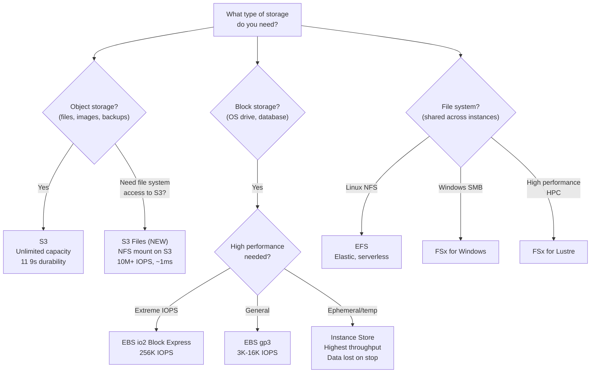
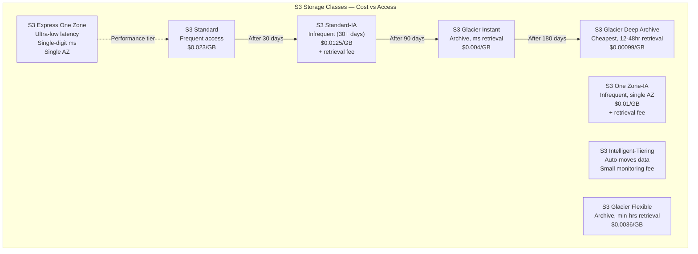
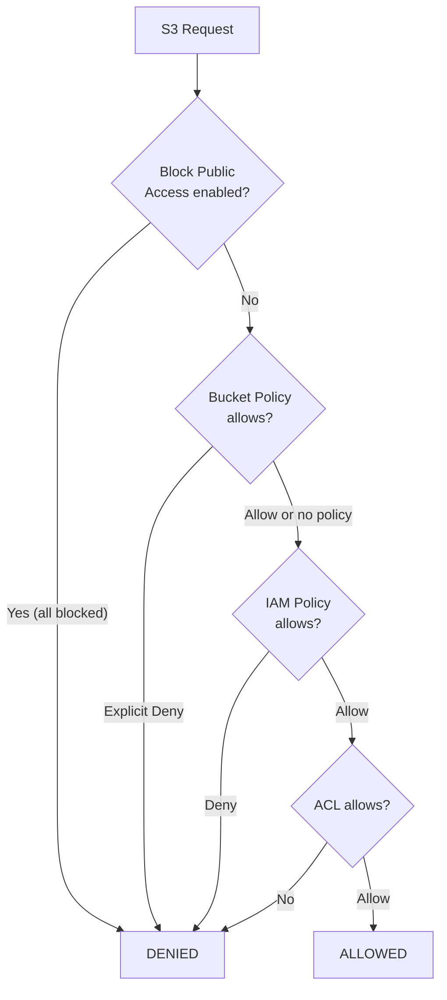
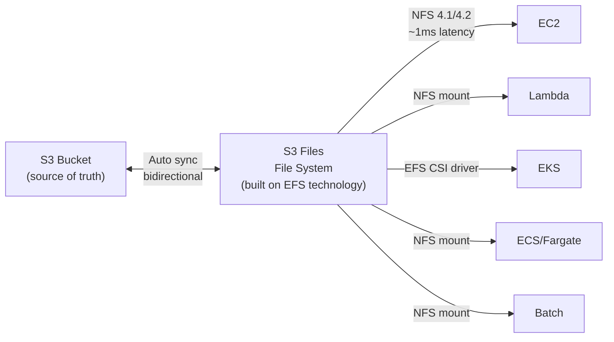
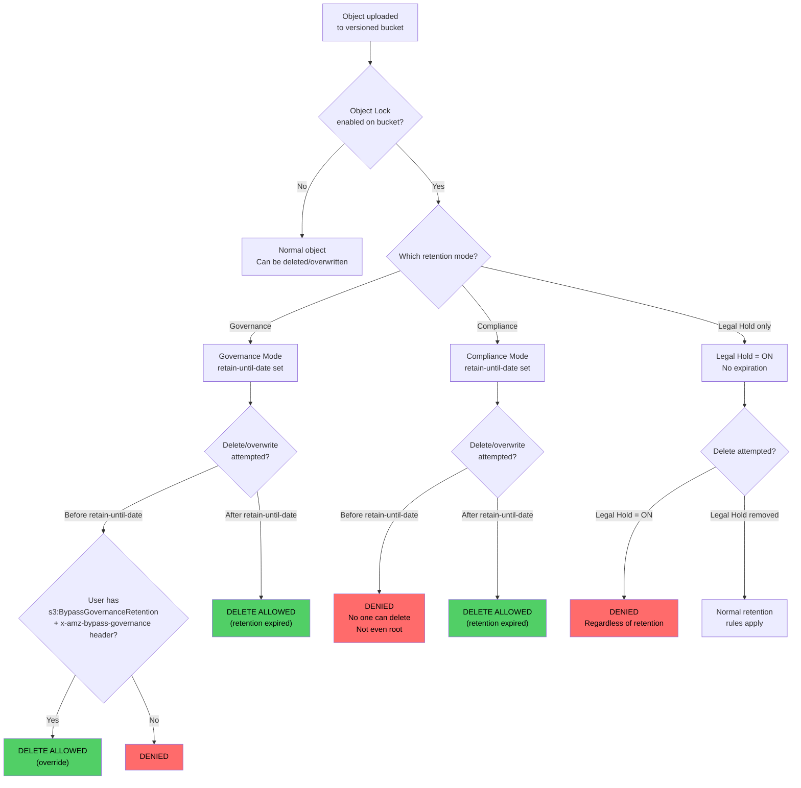
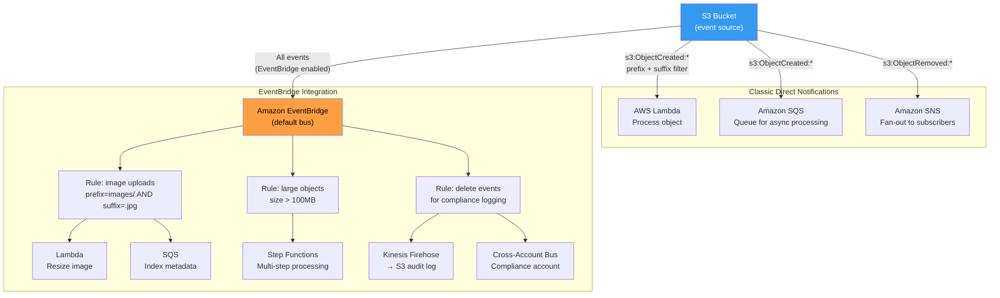

# Storage

## Overview

AWS offers a range of storage services for different data types, access patterns, and performance requirements. **S3** is the most important — an object store with virtually unlimited capacity. **EBS** provides block storage for EC2. **EFS** and **FSx** offer managed file systems. Understanding storage classes, lifecycle policies, and replication is essential for interviews.

## Key Concepts

| Concept | Description |
|---------|-------------|
| **Object Storage** | Store files as objects with metadata and unique keys (S3) |
| **Block Storage** | Raw storage volumes attached to instances like virtual hard drives (EBS) |
| **File Storage** | Shared file systems accessible via NFS/SMB protocols (EFS, FSx) |
| **Bucket** | S3 container for objects, globally unique name |
| **Storage Class** | Tier that determines cost, availability, and retrieval time |

## Architecture Diagram

### AWS Storage Decision Tree



## Deep Dive

### Amazon S3

#### S3 Storage Classes



| Storage Class | Access Pattern | Retrieval Time | Min Storage | Durability | Availability |
|--------------|---------------|----------------|-------------|------------|-------------|
| **Express One Zone** | Ultra-low latency, compute-intensive | Single-digit ms (10x faster than Standard) | None | 11 9s* | 99.95% |
| **Standard** | Frequent | ms | None | 11 9s | 99.99% |
| **Intelligent-Tiering** | Unknown/changing | ms | None | 11 9s | 99.9% |
| **Standard-IA** | Infrequent | ms | 30 days | 11 9s | 99.9% |
| **One Zone-IA** | Infrequent, non-critical | ms | 30 days | 11 9s | 99.5% |
| **Glacier Instant** | Archive, needs fast access | ms | 90 days | 11 9s | 99.9% |
| **Glacier Flexible** | Archive | 1-5 min to 5-12 hrs | 90 days | 11 9s | 99.9% |
| **Glacier Deep Archive** | Long-term archive | 12-48 hrs | 180 days | 11 9s | 99.9% |

*Express One Zone stores data in a single AZ using a new directory bucket type for consistent single-digit millisecond performance.

**11 9s durability = 99.999999999%** — you'd lose 1 object out of 10 billion over 10,000 years.

#### S3 Key Features

| Feature | Description |
|---------|-------------|
| **Versioning** | Keep multiple versions of objects, protect against accidental deletes |
| **Lifecycle Rules** | Auto-transition or expire objects (e.g., move to Glacier after 90 days) |
| **Replication** | CRR (Cross-Region) for compliance/DR, SRR (Same-Region) for log aggregation |
| **Encryption** | SSE-S3 (AWS managed), SSE-KMS (customer KMS key), SSE-C (customer-provided key) |
| **Object Lock** | WORM model — prevent objects from being deleted (compliance) |
| **Transfer Acceleration** | Use CloudFront edge locations for faster uploads |
| **Event Notifications** | Trigger Lambda, SQS, or SNS on object events (create, delete) |
| **S3 Select / Athena** | Query data in-place using SQL without downloading |
| **Presigned URLs** | Grant temporary access to private objects |
| **Multipart Upload** | Upload large files in parallel parts (required for > 5 GB) |
| **S3 Files** | Mount S3 buckets as high-performance NFS file systems on compute resources (NEW — April 2026) |

#### S3 Access Control



#### S3 Files (NEW — April 2026)

S3 Files makes S3 buckets accessible as **high-performance NFS file systems** on AWS compute resources — eliminating the need to copy data between object and file storage.



| Specification | Details |
|--------------|---------|
| **Protocol** | NFS v4.1 / v4.2 |
| **IOPS** | 10M+ per bucket |
| **Throughput** | Multiple TB/s aggregate reads |
| **Connections** | Up to 25,000 simultaneous |
| **Latency** | ~1ms for cached data |
| **Consistency** | NFS close-to-open |
| **Encryption** | TLS 1.2 in transit, KMS at rest |
| **Pricing** | Pay-as-you-go, no provisioned capacity |

**How it works:**

1. Create a file system on an existing S3 general purpose bucket (versioning required)
2. S3 Files lazily loads metadata + small file data onto high-performance storage (built on EFS)
3. Large reads (≥1 MiB) stream directly from S3 — no file system charge
4. Writes commit to high-performance storage, then auto-sync back to S3
5. Unused data expires after a configurable window (1–365 days, default 30)
6. S3 bucket remains the **source of truth** — conflicts resolve in S3's favor

**S3 Files vs EFS vs FSx for Lustre:**

| Feature | S3 Files | EFS | FSx for Lustre |
|---------|----------|-----|----------------|
| **Data source** | S3 bucket (stays in S3) | Standalone file system | Can hydrate from S3 |
| **Protocol** | NFS 4.1/4.2 | NFS 4.0/4.1 | POSIX |
| **Best for** | File access to existing S3 data | Shared Linux file storage | HPC, ML training |
| **Pricing model** | Pay for active working set only | Pay for all stored data | Provisioned capacity |
| **Cost advantage** | Up to 90% cheaper than copy-to-EFS | Predictable, elastic | Highest throughput |
| **Max IOPS** | 10M+ | 500K+ (General Purpose) | Millions |
| **Use case** | AI agents, ML pipelines, modernization | Web serving, CMS, shared home dirs | Genomics, video rendering |

**AWS CLI setup:**

```bash
# Create file system on an existing bucket (versioning must be enabled)
aws s3files create-file-system \
  --region us-east-1 \
  --bucket arn:aws:s3:::my-bucket \
  --role-arn arn:aws:iam::123456789012:role/S3FilesRole

# Create mount target in a subnet
aws s3files create-mount-target \
  --region us-east-1 \
  --file-system-id fs-0123456789abcdef0 \
  --subnet-id subnet-12345678

# Mount on EC2 (amazon-efs-utils v3.0.0+ required)
sudo mkdir /mnt/s3files
sudo mount -t s3files fs-0123456789abcdef0:/ /mnt/s3files
```

> **Interview tip:** S3 Files is a game-changer for 2026 interviews. It solves the classic problem of "I need file system access to my S3 data" without S3 Mountpoint's read-only limitations. Key selling points: no data duplication, pay only for active data, 10M+ IOPS, and bidirectional sync. Think of it as "EFS meets S3" — file semantics with object storage economics.

### EBS (Elastic Block Store)

| Volume Type | Max IOPS | Max Throughput | Use Case |
|------------|----------|----------------|----------|
| **gp3** (General SSD) | 16,000 | 1,000 MB/s | Boot volumes, dev/test, most workloads |
| **gp2** (General SSD) | 16,000 | 250 MB/s | Legacy, use gp3 instead |
| **io2 Block Express** | 256,000 | 4,000 MB/s | Mission-critical databases (Oracle, SAP) |
| **st1** (Throughput HDD) | 500 | 500 MB/s | Big data, data warehouses, log processing |
| **sc1** (Cold HDD) | 250 | 250 MB/s | Infrequently accessed data, cheapest |

- EBS volumes are **AZ-specific** (can't attach across AZs)
- **Snapshots** are stored in S3 (region-level), can create volumes in any AZ
- **Multi-Attach** (io2 only): attach one volume to up to 16 Nitro instances in the same AZ
- **Encryption**: AES-256, uses KMS, encrypts data at rest, in transit, and snapshots

### EFS (Elastic File System)

- Managed NFS file system, works with Linux EC2 and Lambda
- **Elastic**: Grows and shrinks automatically, no provisioning
- **Performance modes**: General Purpose (default) vs Max I/O (high parallelism)
- **Throughput modes**: Bursting, Provisioned, Elastic
- **Storage classes**: Standard, Infrequent Access (EFS-IA) — use lifecycle policies
- Multi-AZ by default (Regional), or One Zone for cost savings
- Cost: ~3x EBS, but shared across instances

### FSx

| Variant | Protocol | Use Case |
|---------|----------|----------|
| **FSx for Windows** | SMB | Windows workloads, Active Directory, SQL Server |
| **FSx for Lustre** | POSIX | HPC, ML training, video processing (integrates with S3) |
| **FSx for NetApp ONTAP** | NFS/SMB/iSCSI | Hybrid cloud, multi-protocol |
| **FSx for OpenZFS** | NFS | Linux workloads migrating from on-prem ZFS |

### AWS Storage Gateway

Bridges on-premises storage to AWS cloud:

| Type | Protocol | Use Case |
|------|----------|----------|
| **S3 File Gateway** | NFS/SMB | Store files as S3 objects, local cache |
| **FSx File Gateway** | SMB | Low-latency access to FSx for Windows |
| **Volume Gateway** | iSCSI | Block storage backed by S3 snapshots |
| **Tape Gateway** | iSCSI VTL | Replace physical tape backups with S3 Glacier |

## Best Practices

1. **Enable S3 versioning** on all important buckets
2. **Use lifecycle policies** to transition data to cheaper storage classes
3. **Block public access** by default on all S3 buckets
4. **Use gp3 over gp2** — better performance, lower cost, decoupled IOPS
5. **Encrypt everything** — enable default S3 encryption (SSE-S3 or SSE-KMS)
6. **Use S3 Intelligent-Tiering** when access patterns are unpredictable
7. **Use Cross-Region Replication** for disaster recovery
8. **Use EFS for shared storage** across multiple instances
9. **Take regular EBS snapshots** and use DLM (Data Lifecycle Manager) to automate
10. **Use multipart upload** for files > 100 MB

## Common Interview Questions

### Q1: What are the S3 storage classes and when would you use each?

**A:** **Express One Zone** — ultra-low latency (single-digit ms), 10x faster than Standard, uses directory buckets in a single AZ, ideal for ML training data, analytics, and compute-intensive workloads that need fast data access. **Standard** — frequently accessed data (web assets, application data). **Standard-IA** — infrequent access but needs millisecond retrieval (backups, DR). **One Zone-IA** — non-critical infrequent data (re-creatable thumbnails). **Intelligent-Tiering** — unknown access patterns, auto-moves between tiers. **Glacier Instant** — archive needing instant access (medical images). **Glacier Flexible** — archive with minutes to hours retrieval (quarterly reports). **Deep Archive** — cheapest, 12-48 hour retrieval (regulatory archives, 7-year retention).

### Q2: How does S3 replication work?

**A:** Two types: **CRR (Cross-Region Replication)** replicates objects to a bucket in another region — used for disaster recovery and compliance. **SRR (Same-Region Replication)** replicates within the same region — used for log aggregation, live replication between accounts. Requirements: versioning must be enabled on both buckets, proper IAM permissions. Replication is asynchronous, only new objects are replicated (use S3 Batch Replication for existing objects).

### Q3: What is the difference between EBS, EFS, and S3?

**A:** **EBS**: Block storage, attached to a single EC2 instance, AZ-specific, like a hard drive. Use for OS, databases. **EFS**: File storage, shared NFS mount across multiple instances and AZs, elastic. Use for shared content, CMS, development environments. **S3**: Object storage, unlimited capacity, accessed via HTTP API (not mounted like a filesystem). Use for backups, static assets, data lakes. Key: EBS = one instance, EFS = many instances, S3 = everyone/everything via API.

### Q4: Explain S3 encryption options.

**A:** **SSE-S3**: AWS manages key entirely (AES-256), default option. **SSE-KMS**: Uses AWS KMS, you control key policies, get audit trail in CloudTrail. Can use AWS-managed key or customer-managed key (CMK). **SSE-C**: You provide the encryption key with each request, AWS doesn't store it. **Client-side**: You encrypt before uploading. For most cases, SSE-KMS with CMK gives the best balance of security and manageability.

### Q5: What is S3 Object Lock and when would you use it?

**A:** S3 Object Lock enables WORM (Write Once Read Many) — prevents objects from being deleted or overwritten for a retention period. Two modes: **Governance** (users with special permissions can override), **Compliance** (nobody can delete, not even root). Use cases: financial records (SEC 17a-4), healthcare (HIPAA), legal holds. Must enable versioning. Can also apply Legal Holds to prevent deletion indefinitely.

### Q6: How would you optimize S3 costs?

**A:** (1) Use **lifecycle policies** to transition data to cheaper tiers (Standard → IA → Glacier). (2) Use **Intelligent-Tiering** for unpredictable access. (3) Delete incomplete multipart uploads (lifecycle rule). (4) Use **S3 Analytics** to identify optimal transition rules. (5) Enable **Requester Pays** for shared datasets. (6) Compress objects before uploading. (7) Use S3 inventory to audit bucket contents.

### Q7: What is the difference between EBS volume types?

**A:** **gp3**: General purpose SSD, 3000 IOPS baseline, independently provision up to 16K IOPS — best default choice. **io2 Block Express**: High performance SSD, up to 256K IOPS for mission-critical databases. **st1**: Throughput-optimized HDD for big data and sequential reads. **sc1**: Cold HDD, cheapest, for infrequent access. Boot volumes must be SSD (gp2/gp3/io2). Always prefer gp3 over gp2 — same or better performance at lower cost.

### Q8: How do EBS Snapshots work?

**A:** Snapshots capture the state of an EBS volume to S3. They're incremental — only changed blocks are saved, saving storage costs. You can create a new volume from a snapshot in any AZ within the region, or copy snapshots to other regions for DR. Use DLM (Data Lifecycle Manager) to automate snapshot schedules and retention. First snapshot takes longer; subsequent ones are fast. Snapshots can be shared with other AWS accounts or made public.

### Q9: What is AWS Snow Family?

**A:** Physical devices for migrating large datasets to AWS when network transfer is too slow. **Snowcone** (8-14 TB) — smallest, edge computing + data transfer. **Snowball Edge** (80-210 TB) — large data transfer + edge computing, two types: Storage Optimized and Compute Optimized. **Snowmobile** (100 PB) — a literal shipping container truck. Rule of thumb: if transfer over the network takes > 1 week, use Snow Family.

### Q10: When would you use EFS vs FSx?

**A:** **EFS** — Linux workloads, NFS protocol, elastic and serverless, great for web serving, content management, shared home directories. **FSx for Windows** — Windows workloads needing SMB protocol, Active Directory integration, SQL Server. **FSx for Lustre** — HPC, ML training, video rendering — highest performance, integrates with S3. **FSx for NetApp ONTAP** — multi-protocol (NFS + SMB + iSCSI), ideal for hybrid cloud migration.

### Q11: What is Amazon S3 Files and how does it differ from EFS and S3 Mountpoint?

**A:** S3 Files (launched April 2026) makes S3 buckets accessible as **high-performance NFS file systems** on AWS compute (EC2, Lambda, EKS, ECS, Fargate, Batch). It's built on EFS technology but the data stays in S3 — no duplication. Key differences: (1) **vs EFS**: S3 Files is cheaper (pay only for active working set, up to 90% savings) because cold data stays in S3 at S3 prices. EFS charges for all stored data. (2) **vs S3 Mountpoint**: S3 Files supports full read-write with NFS 4.1/4.2, file locking, and POSIX permissions. Mountpoint is read-heavy with limited write support. (3) **Performance**: 10M+ IOPS, TB/s throughput, ~1ms latency, 25K concurrent connections. (4) **Sync**: Bidirectional — writes sync back to S3, S3 changes reflect in the file system. S3 is the source of truth. Best for: AI agent workflows, ML training pipelines, file-based app modernization where data already lives in S3.

## Latest Updates (2025-2026)

- **S3 Express One Zone GA** — a new high-performance storage class using directory buckets that delivers consistent single-digit millisecond request latency, up to 10x faster than S3 Standard. Ideal for ML training, analytics, and compute-intensive workloads needing the fastest S3 access.
- **S3 Access Grants** enable identity-based data access by mapping IAM Identity Center users and groups (or any SAML/OIDC identity) directly to S3 prefixes. This eliminates the need for complex bucket policies or IAM roles for each user, making data lake access management dramatically simpler.
- **Mountpoint for Amazon S3** GA — an open-source POSIX file client that lets you mount an S3 bucket as a local file system on Linux. Supports sequential and random reads and sequential writes, optimized for data lake and ML training workloads where applications expect file system semantics.
- **EBS io2 Block Express** delivers up to 256,000 IOPS and 4,000 MB/s throughput on R5b and supported Nitro instances, with sub-millisecond latency and 99.999% durability (5 nines vs. 3 nines for other EBS types).
- **EFS Elastic Throughput** automatically scales throughput based on workload demand, eliminating the need to provision throughput or choose between Bursting and Provisioned modes. You pay only for the throughput you consume.
- **S3 conditional writes** now supported — you can use `If-None-Match` headers to ensure PutObject only succeeds if the key does not already exist, preventing accidental overwrites in concurrent write scenarios without application-level locking.
- **S3 Storage Lens** enhanced with advanced metrics, group-level aggregation, and free-tier dashboard for organization-wide visibility into storage usage, activity trends, and cost optimization recommendations.

### Q12: What are S3 Access Points and when would you use them?

**A:** S3 Access Points are named network endpoints attached to a bucket, each with its own access policy and (optionally) its own VPC restriction. Instead of managing a single monolithic bucket policy that grows unwieldy as more teams and applications access the bucket, you create a dedicated access point for each use case. For example, a data lake bucket might have access points for the "analytics-team" (read-only on /analytics/), "ml-team" (read/write on /training-data/), and "finance-app" (read-only on /reports/). Each access point has its own ARN and DNS name. Applications connect through the access point rather than the bucket directly. Access points can be restricted to a specific VPC to prevent internet access entirely. They simplify large-scale access management and are particularly valuable in multi-team data lake architectures.

### Q13: What are S3 Batch Operations and what are common use cases?

**A:** S3 Batch Operations let you perform actions on billions of objects with a single API request. You provide a manifest (S3 Inventory report or CSV) listing the target objects, choose an operation, and S3 Batch runs it at scale with progress tracking, completion reports, and retry logic. Supported operations include: copying objects between buckets or storage classes, invoking a Lambda function per object, replacing tag sets, modifying ACLs, restoring from Glacier, and replicating existing objects (Batch Replication). Common use cases: retroactively encrypting all objects in a bucket with a new KMS key, transitioning millions of objects to a different storage class that lifecycle rules cannot handle, tagging existing objects for access control or cost allocation, and invoking a Lambda function to transcode or process each object. Batch Operations handle the scale and error handling that would be impractical with individual API calls.

### Q14: What is the difference between S3 Event Notifications and EventBridge for S3?

**A:** **S3 Event Notifications** are the original mechanism — configured on the bucket to send notifications to SNS, SQS, or Lambda when specific events occur (object created, deleted, restored). They are simple to set up but limited: only three destinations, limited filtering (prefix and suffix only), and no ability to replay or archive events. **Amazon EventBridge for S3** is the modern alternative — S3 sends events to EventBridge, which supports 20+ target types (Lambda, Step Functions, SQS, SNS, Kinesis, ECS tasks, API destinations, etc.), advanced content-based filtering (match on object key, size, metadata), event replay and archiving, and cross-account event routing. EventBridge also provides event schema discovery and dead-letter queues. Always prefer EventBridge for new workloads unless you need the simplest possible setup with a single Lambda/SQS/SNS target. Note: EventBridge for S3 must be enabled on the bucket and does incur a small cost per event.

### Q15: How would you design a data lake on S3?

**A:** A well-designed S3 data lake follows a layered approach: (1) **Raw/Landing zone** — ingest data in its original format (JSON, CSV, logs, Parquet) from sources via Kinesis, Glue, Transfer Family, or direct upload. Use S3 Standard storage class. (2) **Processed/Curated zone** — transform and clean data using AWS Glue ETL or EMR, convert to columnar formats (Parquet, ORC) for query performance, and partition by date/region/category. (3) **Analytics/Consumption zone** — optimized datasets consumed by Athena, Redshift Spectrum, QuickSight, or SageMaker. Governance layers: use **AWS Lake Formation** for centralized permissions (column-level and row-level security), **Glue Data Catalog** as the metadata catalog, **S3 Access Points** for team-specific access, and **S3 Object Lock** for immutable audit data. Implement lifecycle policies to transition older data to IA or Glacier tiers. Use consistent prefix structures (e.g., `s3://datalake/raw/source=clickstream/year=2025/month=04/`) to optimize partition pruning in query engines.

### Q16: What is the difference between S3 Glacier Vault Lock and S3 Object Lock?

**A:** Both provide WORM (Write Once Read Many) protection, but they are different mechanisms. **S3 Object Lock** is applied to individual objects in regular S3 buckets. It supports two retention modes — Governance (privileged users can override) and Compliance (nobody can delete, not even root, until the retention period expires). You can also apply Legal Holds independently. Object Lock works with all S3 features (replication, lifecycle, etc.). **Glacier Vault Lock** is a vault-level policy in S3 Glacier that locks the entire vault's access policy. Once the vault lock policy is confirmed (you have 24 hours to abort), it becomes immutable and cannot be changed or deleted by anyone, including root. Vault Lock is specific to Glacier vaults and is commonly used for regulatory archives (SEC 17a-4, CFTC). In practice, for new architectures, prefer S3 Object Lock with Compliance mode on standard S3 buckets because it provides more granular control and works with all S3 storage classes including Glacier tiers.

### Q17: What are the patterns for cross-account S3 access?

**A:** There are four primary patterns: (1) **Bucket policy** — the bucket owner adds a statement granting access to the other account's principal (e.g., `"Principal": {"AWS": "arn:aws:iam::123456789012:root"}`). Simple but the bucket owner manages permissions. (2) **IAM role assumption** — the bucket-owning account creates a role that the requesting account assumes. The role's policy grants S3 access. Preferred when the requesting account needs broad access. (3) **S3 Access Points** — create an access point with a policy granting cross-account access, scoped to a specific prefix. Best for data lake multi-team scenarios. (4) **AWS RAM (Resource Access Manager)** — for sharing S3 on Outposts or sharing S3 Access Points. Important consideration: by default, when Account B writes objects to Account A's bucket, Account A does not own those objects. Use bucket policies with `bucket-owner-full-control` ACL requirement or S3 Object Ownership (Bucket Owner Enforced) to ensure the bucket owner always owns all objects.

### Q18: How do you optimize S3 performance?

**A:** S3 automatically scales to handle at least 3,500 PUT/COPY/POST/DELETE and 5,500 GET/HEAD requests per second per prefix. Optimization strategies: (1) **Distribute reads across prefixes** — if you need more throughput, use multiple prefixes (e.g., partition by hash, date, or source) so requests are spread across partitions. (2) **Multipart upload** — for files over 100 MB (required for >5 GB), upload parts in parallel. Use the AWS SDK's TransferManager for automatic multipart handling. (3) **Byte-range fetches** — download large objects in parallel by requesting specific byte ranges, reducing time-to-first-byte and enabling retry of only failed ranges. (4) **S3 Transfer Acceleration** — uses CloudFront edge locations for faster long-distance uploads (enable per-bucket, charges apply). (5) **S3 Express One Zone** — for the lowest latency, use directory buckets that deliver single-digit millisecond access. (6) **Caching** — put CloudFront in front of S3 for frequently read objects, or use ElastiCache for metadata. (7) **Retry with exponential backoff** for 503 errors during request rate scaling.

### Q19: What are EBS Multi-Attach scenarios and limitations?

**A:** EBS Multi-Attach allows a single **io2** (Provisioned IOPS SSD) volume to be attached to up to 16 Nitro-based EC2 instances simultaneously within the same Availability Zone. Use cases include clustered databases, distributed file systems, and applications that need shared block storage with high performance. Critical limitations: (1) Only io2 volumes support Multi-Attach. (2) All instances must be in the same AZ. (3) The application must handle concurrent write coordination — EBS does not manage write conflicts or provide any locking mechanism. You need a cluster-aware file system (like GFS2, OCFS2) or the application itself must coordinate writes. (4) Maximum 16 instances per volume. (5) Does not work with boot volumes. Multi-Attach is not a substitute for EFS — it provides raw block storage that requires explicit concurrency management, while EFS provides a fully managed NFS file system with built-in concurrency support.

### Q20: What is the decision matrix for choosing between EFS, FSx for Windows, FSx for Lustre, and FSx for NetApp ONTAP?

**A:** **EFS** — choose when you need a shared file system for Linux workloads using NFS protocol, want elastic/serverless simplicity (no capacity provisioning), and need multi-AZ durability. Best for web serving, content management, home directories, and container shared storage. **FSx for Windows** — choose when you need SMB protocol, Windows ACLs, Active Directory integration, DFS (Distributed File System) namespaces, or SQL Server file shares. Best for Windows-native enterprise applications. **FSx for Lustre** — choose when you need the highest performance (hundreds of GB/s throughput, millions of IOPS) for HPC, ML training, video rendering, or financial simulations. Integrates natively with S3 (auto-imports and exports). **FSx for NetApp ONTAP** — choose when you need multi-protocol support (NFS + SMB + iSCSI simultaneously), data tiering, deduplication, compression, SnapMirror replication, or are migrating from on-premises NetApp storage. Best for hybrid cloud and applications needing advanced data management features.

### Q21: What is S3 Storage Lens and how does it provide org-wide visibility?

**A:** S3 Storage Lens is an analytics feature that provides organization-wide visibility into S3 storage usage, activity trends, and cost optimization opportunities. It aggregates metrics across all buckets, accounts, and regions in your AWS Organization into a single dashboard. The **free tier** provides 28 usage metrics and 14-day data retention. **Advanced metrics** (paid) add 35+ additional metrics including activity metrics (request counts, bytes downloaded/uploaded, errors), cost optimization metrics (lifecycle rule opportunities, incomplete multipart uploads), data protection metrics (encryption, replication, versioning status), and 15-month data retention. You can create custom dashboards, filter by account, region, or bucket, and export metrics to S3 for analysis in Athena or QuickSight. Storage Lens is essential for large organizations to identify cost savings — for example, finding buckets without lifecycle policies, buckets with high percentages of old-version objects, or accounts with unusual activity patterns.

### Q22: What is AWS Transfer Family and when would you use it?

**A:** AWS Transfer Family provides fully managed SFTP, FTPS, FTP, and AS2 protocol servers that transfer files directly into and out of Amazon S3 or EFS. Use it when you have existing workflows, partners, or legacy systems that rely on traditional file transfer protocols and you want to modernize the backend without changing the client-side integration. For example, a trading partner sends you daily data files via SFTP — instead of managing an EC2 SFTP server, Transfer Family provides a managed endpoint that authenticates users (via IAM, Active Directory, or custom Lambda authorizer), maps them to S3 prefixes or EFS directories, and handles the protocol translation. Each user can be given their own home directory and role. It supports DNS CNAME for custom hostnames, VPC endpoints for private connectivity, and CloudWatch logging. Transfer Family eliminates the need to manage, patch, and scale file transfer servers while maintaining compatibility with existing client workflows.

### Q23: What is Mountpoint for Amazon S3 and when would you use it?

**A:** Mountpoint for Amazon S3 is an open-source, high-throughput POSIX file client that lets Linux applications access S3 buckets as if they were local file systems. You mount a bucket to a local directory path, and applications can read files using standard file I/O calls (open, read, seek) without any code changes. It is optimized for read-heavy workloads and supports sequential writes (new files) but does not support random writes, appends, deletes, or renames — it is not a general-purpose file system. Use cases: ML training frameworks (PyTorch, TensorFlow) that read training datasets from a file path, analytics applications that process data from a file path, and simulation workloads that read input data from files. Mountpoint translates file system calls into optimized S3 API calls (using byte-range fetches and concurrent requests) to maximize throughput. For workloads that need full POSIX semantics (random writes, file locking), use EFS instead. Mountpoint is free and significantly cheaper than EFS since you only pay for S3 storage and API calls.

### Q24: How do S3 Presigned URLs work and what are the security considerations?

**A:** A presigned URL grants time-limited access to a private S3 object without requiring the requester to have AWS credentials. The URL is generated by an IAM principal (user or role) who does have access, and the URL encodes the signer's credentials, the HTTP method, an expiration timestamp, and a signature. Anyone with the URL can perform the specified action until it expires.

**How generation works:** The signer's SDK or CLI creates the URL locally — no AWS API call is made. The signature is computed using Signature Version 4 (SigV4) over the request parameters. When a recipient uses the URL, S3 validates the signature and checks that (1) the URL has not expired, (2) the signer's credentials are still valid, and (3) the signer's IAM permissions still allow the action at the time of use.

**Expiration defaults and maximums:**
- **AWS CLI** (`aws s3 presign`): default 3,600 seconds (1 hour), maximum 604,800 seconds (7 days) when signed with IAM user long-term credentials.
- **SDK**: configurable at generation time. The maximum depends on the credential type — IAM user credentials allow up to 7 days, IAM role temporary credentials (STS) are capped at the session duration (typically 1-12 hours), and credentials from EC2 instance profiles or Lambda execution roles max out at 6 hours.
- **STS temporary credentials**: The presigned URL cannot outlive the temporary credentials that signed it. If a role session expires in 1 hour, the URL also becomes invalid after 1 hour regardless of the expiration you set.

**Use cases:** (1) **Temporary download access** — generate a presigned GET URL to let a user download a private report without making the bucket public. (2) **Direct uploads from browsers or mobile** — generate a presigned PUT URL so clients upload files directly to S3, bypassing your server and reducing bandwidth costs. (3) **Sharing content with external partners** — provide a time-boxed link to a private object without creating IAM users.

**Presigned URL vs Presigned POST:**
- **Presigned URL (GET/PUT)**: Simple signed URL for a single operation on a single key. PUT URL allows uploading one object to a specific key.
- **Presigned POST**: An HTML form-based upload mechanism that supports richer upload policies — you can enforce conditions on key prefix, content type, file size range, metadata, and more. It generates a form with multiple fields (policy, signature, etc.) rather than a single URL. Best for web forms where you want server-side control over upload constraints.

**Security considerations:** (1) Anyone with the URL can use it — treat presigned URLs as secrets. Use HTTPS only. (2) If the signing credentials are revoked or the IAM policy changes to deny access, the URL stops working even before expiration. (3) Keep expiration as short as practical — minutes for one-time downloads, not days. (4) For uploads, use presigned POST with conditions to restrict file size and content type, preventing abuse. (5) Presigned URLs do not go through S3 Access Points by default — you must generate them against the access point ARN if access point policies are in effect. (6) VPC endpoint policies apply: if the request comes through a VPC endpoint that restricts the bucket, the presigned URL will be denied even if the signature is valid.

### Q25: Explain S3 Object Lock and Glacier Vault Lock in detail. When would you use each?

**A:** Both provide WORM (Write Once Read Many) immutability, but they operate at different levels and serve different compliance needs.

**S3 Object Lock** is applied to individual object versions in a regular S3 bucket (versioning must be enabled). It has two retention modes and an independent legal hold mechanism:

- **Governance mode**: Prevents most users from deleting or overwriting an object version during the retention period, but users with the `s3:BypassGovernanceRetention` permission can override the lock. Use this for soft protection where administrators may need to adjust retention — for example, internal data governance policies where exceptions are occasionally needed.
- **Compliance mode**: No one can delete or overwrite the object version until the retention period expires — not the bucket owner, not the AWS account root user, and not even AWS Support. The retention period cannot be shortened. This is the mode required by financial regulators such as **SEC Rule 17a-4**, **FINRA**, and **CFTC Rule 1.31** for broker-dealer records retention. Once set, compliance mode retention is irreversible.
- **Retention period**: A timestamp (retain-until-date) set on each object version. Can be extended in both modes but can only be shortened in Governance mode (with bypass permission). In Compliance mode it can never be shortened.
- **Legal Hold**: An independent on/off flag that prevents deletion regardless of retention settings. Does not have an expiration — it remains until explicitly removed by a user with `s3:PutObjectLegalHold` permission. Use for litigation holds or investigations where you need to preserve evidence indefinitely.

**Glacier Vault Lock** operates at the vault level in S3 Glacier. You write a Vault Lock Policy (a JSON access policy) and initiate the lock. You have a 24-hour window to validate and confirm (or abort) the lock. Once confirmed, the policy becomes immutable — it can never be changed or deleted by anyone, including the root account. Vault Lock policies typically enforce rules like "deny deletion of any archive that is less than 365 days old" or "deny all delete operations." This is designed specifically for long-term regulatory archives where the access policy itself must be tamper-proof.

**When to use which:**
- **S3 Object Lock (Compliance mode)** — preferred for most new compliance architectures. It works with all S3 storage classes (Standard, IA, Glacier Instant, Glacier Flexible, Deep Archive), integrates with lifecycle rules and replication, and provides per-object granularity. Use for SEC 17a-4, FINRA, HIPAA, and SOX compliance on S3 data.
- **S3 Object Lock (Governance mode)** — internal governance where you want protection with admin override capability. Test environments, internal audit trails.
- **Glacier Vault Lock** — when you specifically use Glacier vaults (not S3 Glacier storage classes) and need the vault-level policy itself to be immutable. Common in legacy architectures or when auditors specifically require vault-level policy immutability.

### Q26: How do S3 Event Notifications work and how does EventBridge integration improve on them?

**A:** S3 Event Notifications let you trigger automated actions when events occur on objects in your bucket.

**Event types supported:**
- `s3:ObjectCreated:*` — fires on PUT, POST, COPY, or multipart upload completion
- `s3:ObjectRemoved:*` — fires on DELETE (both regular and DeleteMarker in versioned buckets)
- `s3:ObjectRestore:*` — fires when a Glacier restore is initiated or completed
- `s3:ObjectTagging:*` — fires when tags are added or removed
- `s3:ObjectAcl:Put` — fires when an object ACL is set
- `s3:ReducedRedundancyLostObject` — fires when an RRS object is lost
- `s3:Replication:*` — fires on replication success, failure, or threshold exceeded
- `s3:LifecycleExpiration:*` — fires when lifecycle deletes or transitions objects
- `s3:IntelligentTiering` — fires when an object moves to a new access tier
- `s3:LifecycleTransition` — fires when an object transitions to a different storage class

**Direct notification destinations (classic):**
- **AWS Lambda** — invoke a function to process the object (resize images, run ETL, trigger workflows)
- **Amazon SQS** — queue events for asynchronous processing (fan-out, buffering)
- **Amazon SNS** — publish to a topic for fan-out to multiple subscribers (email alerts, multiple SQS queues, HTTP endpoints)

**Filtering:** You can filter events by object key prefix (e.g., `images/`) and suffix (e.g., `.jpg`) so notifications only fire for matching objects. Prefix and suffix filters are combined with AND logic.

**Amazon EventBridge integration** (must be explicitly enabled per bucket) sends all S3 events to EventBridge as structured events, unlocking major advantages:

- **20+ target types**: Lambda, Step Functions, SQS, SNS, Kinesis Data Streams, Kinesis Firehose, ECS tasks, CodePipeline, API Gateway, EventBridge API Destinations (webhooks), and more.
- **Advanced content-based filtering**: Filter on any field in the event JSON — object key patterns (regex-like matching), object size ranges, requester account ID, source IP, metadata values, and more. Far richer than prefix/suffix filtering.
- **Event replay and archiving**: Archive events and replay them later for reprocessing, debugging, or backfilling.
- **Schema discovery**: EventBridge automatically detects the event schema so you can generate code bindings.
- **Cross-account routing**: Send events to EventBridge buses in other accounts.
- **Dead-letter queues**: Route failed event deliveries to an SQS DLQ for investigation.
- **Multiple rules on same event**: A single S3 event can trigger dozens of different targets through different EventBridge rules — no need for SNS fan-out.

**S3 direct notifications vs EventBridge:**

| Feature | Direct (Lambda/SQS/SNS) | EventBridge |
|---------|------------------------|-------------|
| **Destinations** | 3 (Lambda, SQS, SNS) | 20+ |
| **Filtering** | Prefix + suffix only | Any event field |
| **Fan-out** | Requires SNS topic | Built-in (multiple rules) |
| **Replay** | Not supported | Archive and replay |
| **Cross-account** | Manual setup | Native bus sharing |
| **Cost** | Free (destination costs only) | $1 per million events |
| **Setup** | Simpler for basic cases | More flexible |

**Best practice:** Use EventBridge for all new workloads. The slight per-event cost is justified by the flexibility, observability, and reduced architectural complexity. Only use direct notifications for the simplest single-destination use cases where cost is the primary concern.

### Q27: What are S3 CORS, S3 Select, and S3 Inventory, and when would you use each?

**A:** These are three distinct S3 features that serve very different purposes.

**S3 CORS (Cross-Origin Resource Sharing):**
CORS is a browser security mechanism, and S3 supports CORS configuration to allow web applications hosted on one domain to make requests to an S3 bucket on a different domain. Without CORS headers, browsers block cross-origin requests by default. You configure CORS rules on the bucket as a JSON (or XML) document specifying allowed origins, allowed HTTP methods, allowed headers, exposed headers, and max age (how long the browser caches the preflight response). Common use case: a web app at `https://app.example.com` needs to fetch images or upload files directly to a bucket at `https://my-bucket.s3.amazonaws.com`. The CORS configuration would allow GET/PUT from `https://app.example.com`. Key points: (1) CORS only applies to browser-based requests — server-to-server calls are unaffected. (2) You can use `"*"` as a wildcard origin but this reduces security. (3) CORS rules are evaluated in order; the first matching rule applies. (4) Always set `MaxAgeSeconds` to a reasonable value (e.g., 3600) to reduce preflight request overhead.

**S3 Select:**
S3 Select lets you use SQL expressions to retrieve only a subset of data from an object, rather than downloading the entire object and filtering client-side. S3 parses the object server-side and returns only the matching rows/columns. Supported formats: CSV, JSON, and Apache Parquet. Example: you have a 10 GB CSV in S3 and only need rows where `status = 'ERROR'` — S3 Select scans the file on S3's infrastructure and returns only the matching rows, potentially reducing data transfer by 90% or more. Benefits: (1) **Reduced data transfer** — less bandwidth, lower costs. (2) **Faster response** — no need to download and parse locally. (3) **Lower compute** — offload filtering to S3. Limitations: S3 Select works on individual objects (not across objects), supports only basic SQL (SELECT, WHERE, LIMIT — no JOINs, GROUP BY, or subqueries), and has a 256 MB compressed / 1 GB uncompressed input limit per object. For querying across many objects or complex SQL, use **Amazon Athena** instead (which uses S3 Select under the hood for Parquet pushdown). Glacier Select allows running S3 Select queries on Glacier Flexible objects without restoring them first.

**S3 Inventory:**
S3 Inventory provides a scheduled report of all objects in a bucket (or filtered by prefix), delivered as a CSV, ORC, or Apache Parquet file to a destination bucket. It runs daily or weekly and lists every object along with metadata you choose: object key, size, last modified date, storage class, encryption status (SSE-S3, SSE-KMS, SSE-C, or none), replication status, Object Lock retention mode and date, ETag, and more. Use cases: (1) **Compliance auditing** — verify all objects are encrypted, identify objects without Object Lock, check replication status across all objects. (2) **Lifecycle planning** — analyze storage class distribution and object age to design lifecycle rules. (3) **S3 Batch Operations input** — use the inventory report as a manifest for batch operations (bulk re-encrypt, retag, replicate). (4) **Cost analysis** — identify large objects, old versions, or incomplete multipart uploads. Inventory reports are far more efficient than LIST API calls for large buckets (millions+ objects), since LIST is paginated and rate-limited while Inventory runs asynchronously at scale.

### Q28: Explain the AWS Storage Gateway types in detail. How do you decide which one to use?

**A:** AWS Storage Gateway is a hybrid cloud storage service that gives on-premises applications access to virtually unlimited cloud storage. It runs as a VM (VMware ESXi, Microsoft Hyper-V, or KVM) or as a hardware appliance on your local network and caches frequently accessed data locally while storing the full dataset in AWS.

**S3 File Gateway:**
- **Protocol:** NFS v3/v4.1 and SMB
- **Backend:** Each file written through the gateway is stored as an individual S3 object in a 1:1 mapping (file path becomes the S3 key). Metadata (permissions, timestamps) is stored as S3 object metadata.
- **Local cache:** Frequently accessed data is cached on the gateway's local storage for low-latency reads.
- **Use cases:** On-premises applications that need file-based access to S3 data — backup and archive, data lakes ingestion from on-premises, media workflows where files land on-prem and need to flow to S3 for processing. Also useful for replacing on-premises NAS with cloud-backed storage.
- **Key detail:** Supports S3 lifecycle policies, versioning, replication, and all S3 storage classes on the backend. Integrates with Active Directory for SMB authentication.

**FSx File Gateway:**
- **Protocol:** SMB
- **Backend:** Amazon FSx for Windows File Server
- **Local cache:** Caches frequently accessed data locally for low-latency access from on-premises.
- **Use cases:** Windows-based on-premises applications that need low-latency access to an FSx for Windows file share — home directories, departmental file shares, and applications requiring Windows ACLs, Active Directory integration, and DFS namespaces. Choose this over S3 File Gateway when you specifically need a Windows-native managed file system in the cloud (not object storage).

**Volume Gateway:**
Provides iSCSI block storage volumes backed by S3, with two sub-modes:
- **Cached Volumes:** Primary data is stored in S3 with a local cache on the gateway for frequently accessed data. Volumes up to 32 TB each, up to 32 volumes (1 PB total). Your on-premises servers see an iSCSI volume but most data lives in the cloud. Best when you want to minimize on-premises storage hardware while keeping hot data local.
- **Stored Volumes:** Primary data is stored locally on-premises with asynchronous snapshots to S3 (as EBS snapshots). Volumes up to 16 TB each, up to 32 volumes (512 TB total). Your full dataset is on-premises for lowest latency, and S3 snapshots provide durable backup and disaster recovery. Best when you need full-speed local access to the complete dataset.
- **Use cases:** On-premises applications that use block storage (databases, ERP systems) and need cloud backup. Stored mode for low-latency local access + cloud DR. Cached mode to reduce on-premises storage footprint.

**Tape Gateway (Virtual Tape Library):**
- **Protocol:** iSCSI VTL — presents virtual tape cartridges to existing backup software (Veeam, Veritas NetBackup, Commvault, etc.)
- **Backend:** Virtual tapes are stored in S3 (Virtual Tape Library). Archived tapes go to S3 Glacier or S3 Glacier Deep Archive (Virtual Tape Shelf).
- **Use cases:** Organizations with existing tape-based backup workflows that want to eliminate physical tape infrastructure without changing backup software or processes. Drop-in replacement for physical tape libraries.

**Hardware appliance option:** For sites without VMware/Hyper-V infrastructure, AWS offers a pre-configured physical hardware appliance that you rack in your data center. It supports all four gateway types and provides the same functionality without requiring existing virtualization.

**Decision tree:**

| Requirement | Gateway Type |
|-------------|-------------|
| On-prem apps need file access to S3 (NFS/SMB) | **S3 File Gateway** |
| On-prem Windows apps need FSx for Windows file shares | **FSx File Gateway** |
| On-prem apps need block storage (iSCSI) with cloud backup | **Volume Gateway (Stored)** — full dataset local |
| On-prem apps need block storage with minimal local hardware | **Volume Gateway (Cached)** — primary data in S3 |
| Replace physical tape backup with cloud | **Tape Gateway** |
| Need file system semantics with S3 economics | S3 File Gateway (or consider S3 Files if workload is cloud-native) |
| No virtualization infrastructure on-prem | **Hardware Appliance** (any gateway type) |

## Deep Dive Notes

### S3 Internals: Consistent Reads and Request Rate Scaling

Understanding S3's internal behavior is valuable for architecture decisions:

- **Strong read-after-write consistency**: Since December 2020, S3 provides strong read-after-write consistency for all operations (PUT, DELETE, LIST) at no additional cost or performance penalty. After a successful PUT, any subsequent GET returns the latest version. After a successful DELETE, a GET returns "not found." LIST operations reflect the latest state. This eliminated the need for workarounds like DynamoDB-based consistency layers that were previously common in data lake architectures.

- **Request rate scaling**: S3 automatically partitions bucket data by key prefix. Each prefix supports 3,500 write and 5,500 read requests per second. When request rates increase, S3 automatically repartitions to handle the load. However, the repartitioning takes time (minutes to hours), so a sudden spike from 0 to 10,000 requests/second on a new prefix may see 503 Slow Down errors during scaling. Mitigation: distribute requests across multiple prefixes, use exponential backoff and retry, and for known high-throughput workloads, pre-warm by gradually ramping up traffic.

- **Object size and multipart**: Objects can be 0 bytes to 5 TB. Multipart upload splits an object into up to 10,000 parts (each 5 MB to 5 GB). The SDK TransferManager automatically uses multipart for large objects. Incomplete multipart uploads consume storage — always configure a lifecycle rule to abort incomplete multipart uploads after a few days.

### S3 Security Layers

S3 security is defense-in-depth with multiple overlapping layers:

1. **Block Public Access (account and bucket level)**: The outermost guard. When enabled, it overrides any bucket policy or ACL that would grant public access. Can be set at the account level to blanket-protect all buckets. Recommended: enable at the account level in all accounts.

2. **Bucket Policies**: JSON policies attached to the bucket that define who can do what. Support conditions like `aws:SourceVpc`, `aws:SourceIp`, `s3:x-amz-server-side-encryption`, and `aws:PrincipalOrgID`. Use `aws:PrincipalOrgID` to restrict access to your organization without listing individual account IDs.

3. **S3 Object Ownership (Bucket Owner Enforced)**: Disables ACLs entirely and makes the bucket owner the owner of all objects, regardless of who uploaded them. This is the recommended setting for all new buckets and eliminates the complexity of ACL-based access.

4. **S3 Access Points**: Per-application or per-team access policies that are easier to manage than a single bucket policy. Can be restricted to specific VPCs.

5. **VPC Endpoints (Gateway and Interface)**: Gateway endpoints (free) route S3 traffic through AWS's private network, preventing data from traversing the internet. Endpoint policies can restrict which buckets are accessible from the VPC. Interface endpoints (PrivateLink, paid) provide private DNS and are useful for on-premises connectivity via Direct Connect/VPN.

6. **Encryption**: SSE-S3 (default, zero config), SSE-KMS (audit trail, key policies, key rotation), SSE-C (customer manages keys), or client-side encryption. You can enforce encryption with a bucket policy that denies PutObject requests without the `x-amz-server-side-encryption` header.

7. **S3 Object Lock and Legal Hold**: WORM protection at the object level for regulatory compliance.

8. **Macie**: Automated discovery and classification of sensitive data (PII, credentials, financial data) in S3.

### Large-Scale Data Migration Strategies

Choosing the right migration method depends on data volume, network bandwidth, and time constraints:

| Method | Data Size | Timeline | Use Case |
|--------|----------|----------|----------|
| **AWS CLI / SDK** | < 100 GB | Hours | Small datasets, scripted transfers |
| **S3 Transfer Acceleration** | < 1 TB | Hours-Days | Long-distance transfers (cross-continent) |
| **AWS DataSync** | TB-scale | Days | On-prem NFS/SMB to S3/EFS, scheduled recurring transfers |
| **AWS Snowball Edge** | 10-80 TB per device | Weeks (shipping) | Limited bandwidth, offline transfer |
| **AWS Snowmobile** | 100 PB | Weeks-Months | Exabyte-scale DC migrations |
| **S3 Batch Replication** | Any | Hours-Days | Cross-account or cross-region bulk replication |
| **Direct Connect + DataSync** | TB-PB | Days-Weeks | High bandwidth, ongoing hybrid workloads |

**Decision framework:**
- Calculate transfer time: `(Data size in GB) / (Bandwidth in Gbps * 0.125 * utilization factor) = seconds`
- If transfer over the network exceeds 1 week, use Snow Family
- For ongoing replication, use DataSync with a schedule
- For one-time cloud-to-cloud migration, use S3 Batch Replication or S3 Cross-Region Replication with Batch Replication for existing objects
- For hybrid architectures with continuous sync, use DataSync with Direct Connect for maximum bandwidth

**AWS DataSync** deserves special mention — it is the most versatile tool for data migration. It supports NFS, SMB, HDFS, and self-managed object storage as sources, with S3, EFS, and FSx as targets. It handles incremental transfers (only changed files), provides built-in data integrity validation, encrypts in transit, supports bandwidth throttling, and integrates with CloudWatch for monitoring. DataSync agents run on-premises (as a VM) or in the cloud (as an EC2 instance) and can sustain up to 10 Gbps throughput per task.

### S3 Data Protection Deep Dive

## Scenario-Based Questions

### S1: Your S3 bucket has 50TB of data and costs are climbing. Users access recent files frequently but rarely touch anything older than 30 days. How do you optimize?

**A:** Implement **lifecycle rules**: (1) Transition to S3 Standard-IA after 30 days (40% cheaper, same durability). (2) Transition to Glacier Instant Retrieval after 90 days (68% cheaper, millisecond access). (3) Transition to Glacier Deep Archive after 365 days (95% cheaper). (4) **Abort incomplete multipart uploads** after 7 days — orphaned parts silently accumulate. (5) **Expire noncurrent versions** after 30 days if versioning is enabled. (6) Enable **S3 Intelligent-Tiering** for objects with unknown access patterns (only for objects >128 KB to avoid monitoring fees). Expected savings: 40-60% of storage costs.

### S2: An S3 bucket was accidentally made public and a news outlet discovered it. Walk through your incident response.

**A:** **Immediate (5 min)**: (1) Enable **S3 Block Public Access** at the account level — this overrides any bucket policy. (2) Check S3 server access logs and CloudTrail data events for who accessed the bucket while public. (3) Notify security team and legal. **Investigation**: (4) Use Macie to classify what data was exposed (PII, credentials, internal docs). (5) Check CloudTrail for who changed the bucket policy to public — was it a human or IaC? (6) Assess blast radius: how long was it public, what was downloaded? **Prevention**: (7) SCP to deny `s3:PutBucketPolicy` with public access conditions. (8) AWS Config rule `s3-bucket-public-read-prohibited` with auto-remediation. (9) Enable GuardDuty S3 protection for anomalous access pattern detection.

### S3: You need to migrate 100TB from on-premises NAS to S3 within 2 weeks. Your internet bandwidth is 1 Gbps. How?

**A:** 1 Gbps = ~10 TB/day theoretical max (~7 TB practical). 100TB would take ~14 days — tight but possible with **AWS DataSync**. However, this saturates your bandwidth for 2 weeks. Better approach: (1) Order **AWS Snowball Edge** (80TB per device) — order 2 devices, load in parallel, ship to AWS. Total time: ~10 days (3 days shipping + 3 days loading + 3 days return + 1 day import). (2) Simultaneously start **DataSync** for the most critical/recent data so it's available immediately. (3) After Snowball import completes, run DataSync in incremental mode to sync any changes made during the migration window. This hybrid approach ensures both speed and data consistency.

### S3 Data Protection Deep Dive

Understanding the interplay between Object Lock modes, encryption options, and event-driven architectures is critical for designing compliant, secure, and reactive storage systems.

#### Object Lock: Governance vs Compliance Mode



**Key rules:**
- Object Lock requires **versioning** — it applies to individual object versions, not keys.
- **Governance mode** retention can be extended but can also be overridden by privileged users.
- **Compliance mode** retention can only be extended, never shortened or removed — by anyone.
- **Legal Hold** is independent of retention — an object can have both a retention period AND a legal hold. Both must be cleared for deletion.
- For SEC 17a-4 / FINRA compliance, use **Compliance mode** with appropriate retention periods.

#### Encryption Options Comparison

| Feature | SSE-S3 | SSE-KMS (AWS managed) | SSE-KMS (Customer CMK) | SSE-C | Client-Side (CSE) |
|---------|--------|----------------------|------------------------|-------|-------------------|
| **Key management** | Fully AWS-managed | AWS KMS manages key | You create/manage CMK in KMS | You provide key per request | You manage keys entirely |
| **Encryption algorithm** | AES-256 | AES-256 | AES-256 | AES-256 | Your choice |
| **CloudTrail audit** | No key-level auditing | Yes (key usage logged) | Yes (key usage logged) | No (AWS never stores key) | No (AWS not involved) |
| **Key rotation** | Automatic (opaque) | Automatic (annual) | Configurable (annual or on-demand) | You manage rotation | You manage rotation |
| **KMS API costs** | None | Yes (per request) | Yes (per request) | None | None |
| **S3 Bucket Key** | N/A | Reduces KMS calls by up to 99% | Reduces KMS calls by up to 99% | N/A | N/A |
| **Cross-account access** | No key policy needed | Share KMS key ARN | Share CMK policy | Share encryption key | Share encryption key |
| **Enforcement** | Default encryption | Bucket policy condition | Bucket policy condition | Must include key per request | Application responsibility |
| **Best for** | Default, simplest | Audit trail needed | Regulatory, key control | Strict key ownership | End-to-end encryption |

**Best practice:** Use **SSE-KMS with a Customer CMK** and **S3 Bucket Key** enabled for the best balance of security (audit trail, key policies, rotation) and cost efficiency (Bucket Key reduces KMS API calls by up to 99%). Enforce with a bucket policy denying `PutObject` requests without `"s3:x-amz-server-side-encryption": "aws:kms"`.

#### S3 Event Notification Architecture



**Architecture decision:** Classic direct notifications (left) are simpler and free (no per-event charge), but limited to 3 destinations with basic prefix/suffix filtering. EventBridge (right) adds a per-event cost (~$1/million events) but enables advanced content-based filtering, 20+ target types, fan-out without SNS, event replay, archiving, cross-account routing, and dead-letter queues. For any architecture with more than one consumer or requiring filtering beyond prefix/suffix, EventBridge is the clear choice.

## Cheat Sheet

| Concept | Key Facts |
|---------|-----------|
| S3 | Object storage, unlimited, 11 9s durability, max object 5 TB |
| S3 Files (NEW 2026) | NFS mount on S3 buckets, 10M+ IOPS, ~1ms latency, pay for active data only, built on EFS |
| S3 Express One Zone | Single-digit ms latency, 10x faster, directory buckets, single AZ |
| S3 Standard | Frequent access, 99.99% availability |
| S3 Glacier Deep Archive | Cheapest, 12-48 hr retrieval, $0.00099/GB |
| S3 Intelligent-Tiering | Auto-moves data, best for unknown patterns |
| EBS gp3 | Default SSD, 3K-16K IOPS, replaces gp2 |
| EBS io2 | Up to 256K IOPS, mission-critical DBs |
| EBS Snapshots | Incremental, stored in S3, cross-AZ/region |
| EFS | Managed NFS, Linux, elastic, multi-AZ |
| FSx Lustre | HPC file system, integrates with S3 |
| Storage Gateway | On-prem to cloud bridge (File, Volume, Tape) |
| Snow Family | Physical data migration (Snowcone 14 TB, Snowball 210 TB, Snowmobile 100 PB) |
| Multipart Upload | Required for > 5 GB, recommended for > 100 MB |
| Presigned URLs | Temporary signed URL for private objects; GET (download) or PUT (upload); max 7 days (IAM user), limited by session for roles; treat as secrets |
| S3 Object Lock | WORM protection — Governance (admin override) vs Compliance (immutable until expiry, even root); requires versioning; SEC 17a-4 compliance |
| S3 Select | SQL queries on individual S3 objects (CSV, JSON, Parquet) server-side; reduces data transfer up to 90%; no JOINs — use Athena for cross-object queries |
| Storage Gateway Types | S3 File GW (NFS/SMB → S3), FSx File GW (SMB → FSx Windows), Volume GW Cached (iSCSI, data in S3), Volume GW Stored (iSCSI, data local + S3 snapshots), Tape GW (VTL → Glacier) |
| S3 CORS | Browser cross-origin access to S3; configure allowed origins, methods, headers per bucket; only affects browser requests, not server-to-server |

## Hands-On S3 Examples

Practice with real AWS CLI commands and JSON configurations in the [s3-examples/](s3-examples/) directory:

| File | What You'll Learn |
|------|-------------------|
| [bucket-policies.json](s3-examples/bucket-policies.json) | 7 bucket policy templates — enforce SSL, restrict to VPC endpoint, cross-account access, CloudFront OAC |
| [lifecycle-rules.json](s3-examples/lifecycle-rules.json) | Lifecycle configurations — transition Standard → IA → Glacier → Deep Archive, log cleanup, compliance retention |
| [encryption-configs.json](s3-examples/encryption-configs.json) | SSE-S3, SSE-KMS (AWS managed & CMK), encryption comparison table, BucketKey optimization |
| [replication-config.json](s3-examples/replication-config.json) | Cross-region, prefix-based, and cross-account replication with IAM role setup |
| [event-notifications.json](s3-examples/event-notifications.json) | Trigger Lambda/SQS/SNS on S3 events, EventBridge integration, complete event types reference |
| [website-and-cors.json](s3-examples/website-and-cors.json) | Static website hosting with CloudFront OAC, CORS configs, presigned URL generation (Python + CLI) |
| [aws-cli-cheatsheet.sh](s3-examples/aws-cli-cheatsheet.sh) | Comprehensive CLI reference — bucket ops, multipart upload, versioning, encryption, presigned URLs |

> **Tip:** Clone the repo and run the CLI commands against a real AWS account. Replace placeholder values (`my-bucket`, `us-east-1`, etc.) with your own. Use the JSON files as templates for `aws s3api` commands with `--cli-input-json` or `file://` references.

---

[← Previous: Compute](../03-compute/) | [Next: Networking →](../05-networking/)
