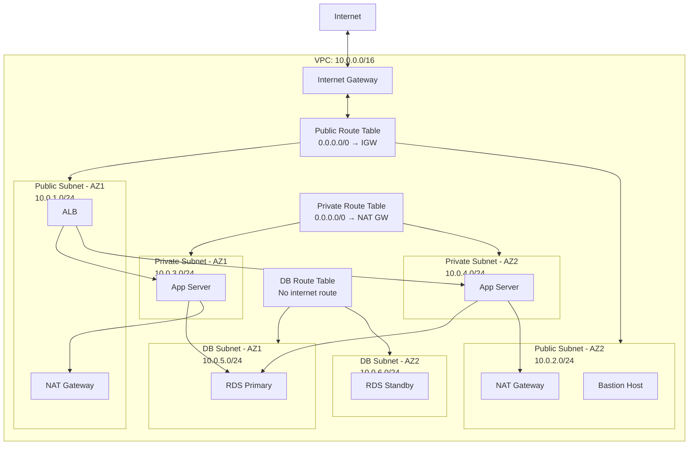
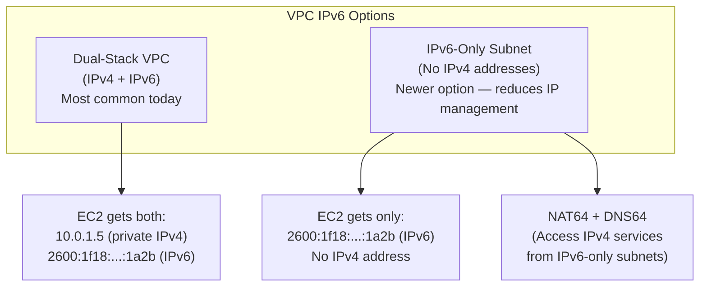
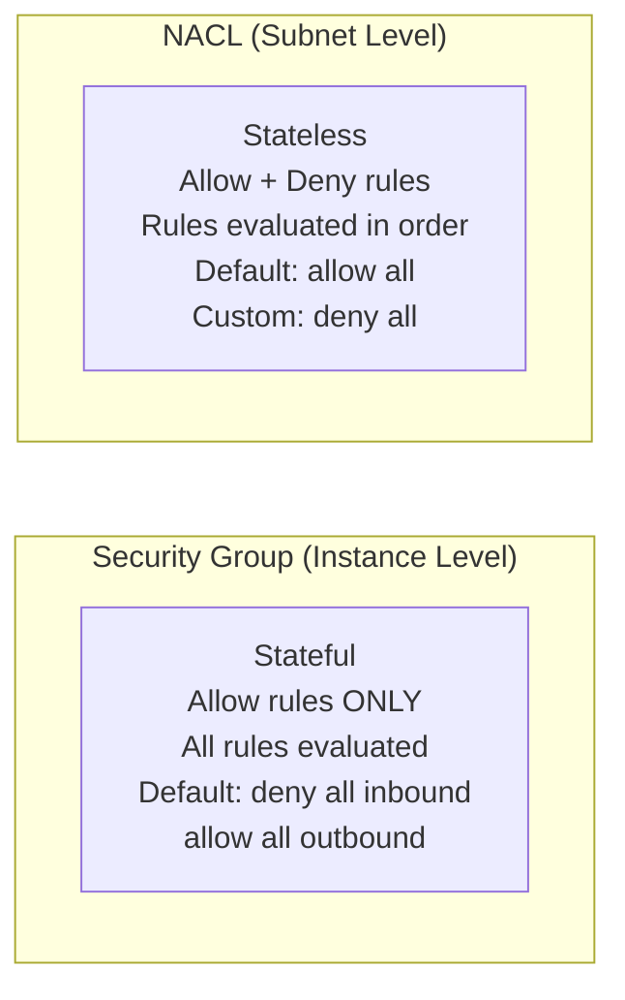
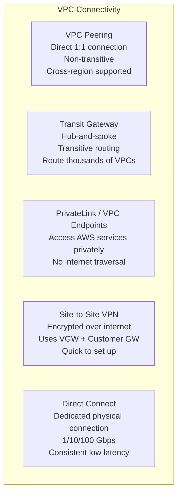
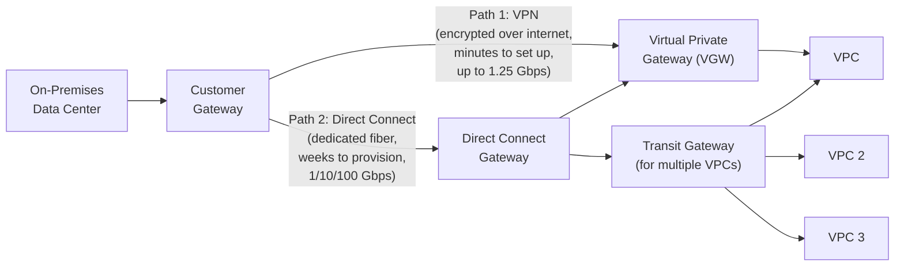
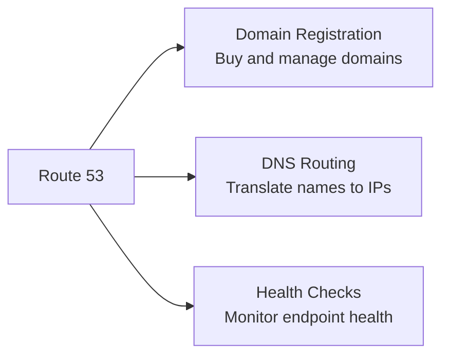
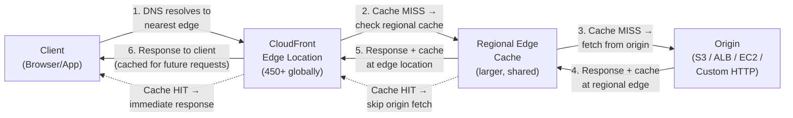

# Networking

## Overview

**Amazon VPC (Virtual Private Cloud)** is your private network in AWS. Every resource you deploy (EC2, RDS, Lambda) lives inside a VPC. Understanding VPC architecture — subnets, route tables, gateways, and security layers — is critical for interviews because networking is the backbone of every architecture.

## Key Concepts

| Concept | Description |
|---------|-------------|
| **VPC** | Isolated virtual network in a Region (default CIDR: 172.31.0.0/16) |
| **Subnet** | A range of IP addresses in a single AZ. Public subnets have a route to an Internet Gateway |
| **Route Table** | Rules that determine where network traffic is directed |
| **Internet Gateway (IGW)** | Enables internet access for public subnets |
| **NAT Gateway** | Allows private subnet instances to access the internet (outbound only) |
| **Security Group** | Stateful firewall at the instance level (allow rules only) |
| **NACL** | Stateless firewall at the subnet level (allow + deny rules) |

## Architecture Diagram

### VPC Architecture

## Deep Dive

### Subnet Types

| Type | Internet Access | Route to IGW? | Use Case |
|------|----------------|---------------|----------|
| **Public** | Full (inbound + outbound) | Yes (0.0.0.0/0 → IGW) | Load balancers, bastion hosts |
| **Private** | Outbound only via NAT | No (0.0.0.0/0 → NAT GW) | App servers, microservices |
| **Isolated/DB** | None | No internet route | Databases, sensitive data |

### CIDR and IP Addressing

- VPC CIDR: /16 (65,536 IPs) to /28 (16 IPs)
- AWS reserves 5 IPs per subnet: .0 (network), .1 (VPC router), .2 (DNS), .3 (future), .255 (broadcast)
- A /24 subnet = 256 IPs - 5 reserved = **251 usable IPs**
- Can add secondary CIDRs to a VPC

### IPv6 in VPC

AWS has significantly pushed IPv6 adoption. Key facts for interviews:

| Feature | IPv4 | IPv6 |
|---------|------|------|
| **Address Format** | 32-bit (10.0.1.5) | 128-bit (2600:1f18:...:1a2b) |
| **VPC CIDR** | Private range, you choose | /56 from Amazon's pool (auto-assigned) |
| **Public/Private** | Need IGW + public IP or NAT | All IPv6 are globally routable (but Security Groups still control access) |
| **Elastic IP** | Yes (IPv4 only) | Not applicable (addresses are persistent) |
| **IPv6-Only Subnet** | N/A | Supported — no IPv4 at all |
| **NAT64/DNS64** | N/A | Allows IPv6-only resources to reach IPv4 endpoints |
| **Supported Services** | All | EC2, ALB, NLB, S3, DynamoDB, and most modern services |

**Interview tip**: IPv6 addresses in AWS VPCs are globally unique and publicly routable, but this does NOT mean they're publicly accessible — Security Groups still control all inbound traffic (default deny). IPv6-only subnets are a cost optimization (no need to manage scarce IPv4 addresses) and are increasingly used for large-scale container and serverless deployments.

### Security Groups vs NACLs

| Feature | Security Group | NACL |
|---------|---------------|------|
| **Level** | Instance (ENI) | Subnet |
| **State** | Stateful (return traffic auto-allowed) | Stateless (must allow both directions) |
| **Rules** | Allow only | Allow + Deny |
| **Evaluation** | All rules checked | Rules checked in number order, first match wins |
| **Default** | Deny all inbound, allow all outbound | Default NACL allows all |
| **Association** | Multiple per instance | One per subnet |

### VPC Connectivity Options

| Option | Latency | Bandwidth | Cost | Use Case |
|--------|---------|-----------|------|----------|
| **VPC Peering** | Low | High | Data transfer fees | Connect 2 VPCs |
| **Transit Gateway** | Low | High | Per-attachment + data | Hub for many VPCs |
| **VPN** | Variable | Up to 1.25 Gbps | Low | Quick, encrypted connection to on-prem |
| **Direct Connect** | Consistent low | 1-100 Gbps | High (port + data) | Production hybrid workloads |
| **PrivateLink** | Low | N/A | Per-endpoint + data | Access AWS services without internet |

### Hybrid Connectivity (Data Center to VPC)

> **Interview trap question**: "How do you connect your on-premises data center to a VPC?" — interviewers expect you to compare Direct Connect vs VPN, explain when to use each, and describe the combined pattern.

| Factor | Site-to-Site VPN | Direct Connect |
|--------|-----------------|----------------|
| **Setup Time** | Minutes | Weeks to months |
| **Bandwidth** | Up to 1.25 Gbps (per tunnel, 2 tunnels) | 1, 10, or 100 Gbps dedicated ports |
| **Latency** | Variable (internet) | Consistent, low (dedicated line) |
| **Encryption** | IPsec encrypted by default | NOT encrypted by default — add VPN over DX for encryption |
| **Cost** | Low (~$0.05/hr per connection) | High (port-hour + data out) |
| **Redundancy** | 2 tunnels to 2 AZs by default | Need 2 connections at 2 DX locations for HA |
| **Use Case** | Quick setup, backup link, low-bandwidth | Production hybrid, compliance, high-throughput |

**Production pattern**: Direct Connect as primary (consistent, high bandwidth) + Site-to-Site VPN as backup (failover over internet). Use **Direct Connect Gateway** to connect one DX circuit to multiple VPCs across regions. Use **Transit Gateway** to route between multiple VPCs and on-premises through a single hub.

### VPC Endpoints

| Type | How It Works | Use Case |
|------|-------------|----------|
| **Gateway Endpoint** | Route table entry, free | S3 and DynamoDB only |
| **Interface Endpoint** | ENI in subnet, costs money | All other AWS services (SQS, KMS, CloudWatch, etc.) |

### Route 53

AWS managed DNS service. Three key functions:

#### Routing Policies

| Policy | How It Works | Use Case |
|--------|-------------|----------|
| **Simple** | Returns one record | Single resource |
| **Weighted** | Distribute traffic by weight % | A/B testing, blue/green |
| **Latency** | Route to lowest-latency region | Multi-region apps |
| **Failover** | Route to secondary if primary unhealthy | Active-passive DR |
| **Geolocation** | Route by user's geographic location | Compliance, localization |
| **Geoproximity** | Route by geographic proximity + bias | Shift traffic between regions |
| **Multi-value** | Return multiple healthy records | Simple load balancing |

### AWS Global Accelerator vs CloudFront

| Feature | Global Accelerator | CloudFront |
|---------|-------------------|------------|
| **Type** | Network layer (TCP/UDP) | CDN (HTTP/HTTPS) |
| **Use Case** | Non-HTTP apps, static IPs, instant failover | Static content caching, web apps |
| **Static IPs** | Yes (2 anycast IPs) | No |
| **Caching** | No | Yes (edge caching) |

## Best Practices

1. **Use 3-tier subnet architecture**: public (ALB), private (app), isolated (DB)
2. **Deploy NAT Gateways in each AZ** for high availability
3. **Use Security Groups as primary defense**, NACLs for subnet-level deny rules
4. **Use VPC endpoints** to access AWS services without internet traversal
5. **Never put databases in public subnets**
6. **Use Transit Gateway** instead of mesh VPC Peering for 3+ VPCs
7. **Plan CIDR ranges carefully** — they can't overlap for peering
8. **Use VPC Flow Logs** for network troubleshooting and security auditing
9. **Use Direct Connect with VPN backup** for hybrid production workloads
10. **Use Route 53 health checks** with failover routing for DR

## Common Interview Questions

### Q1: Walk me through designing a VPC for a production application.

**A:** (1) Choose a CIDR block (e.g., 10.0.0.0/16). (2) Create 3 tiers of subnets across 2-3 AZs: public subnets (10.0.1.0/24, 10.0.2.0/24) for ALB; private subnets (10.0.3.0/24, 10.0.4.0/24) for app servers; isolated subnets (10.0.5.0/24, 10.0.6.0/24) for databases. (3) Internet Gateway + public route table. (4) NAT Gateway per AZ + private route table. (5) No internet route for DB subnets. (6) Security Groups: ALB allows 443 inbound; app allows traffic from ALB SG only; DB allows 3306 from app SG only.

### Q2: What is the difference between Security Groups and NACLs?

**A:** Security Groups are stateful, instance-level, allow-only firewalls — if you allow inbound port 443, the return traffic is auto-allowed. NACLs are stateless, subnet-level, support allow + deny, and rules are evaluated in number order (first match wins). Use Security Groups for fine-grained instance access control; use NACLs to block specific IPs or as a defense-in-depth layer at the subnet level.

### Q3: Explain the difference between VPC Peering and Transit Gateway.

**A:** **VPC Peering** creates a direct, non-transitive connection between two VPCs. If VPC-A peers with VPC-B and VPC-B peers with VPC-C, VPC-A cannot reach VPC-C. **Transit Gateway** is a regional hub — all VPCs connect to it and can communicate transitively. Use peering for simple 1:1 connections; use Transit Gateway when connecting 3+ VPCs or need centralized routing. Transit Gateway also supports VPN and Direct Connect attachments.

### Q4: How does a NAT Gateway work and why is it needed?

**A:** Private subnet instances have no public IPs and no route to the Internet Gateway. A NAT Gateway sits in a public subnet, has an Elastic IP, and translates private IPs to its public IP for outbound internet traffic (e.g., downloading patches, calling external APIs). Inbound connections from the internet are blocked. Deploy one per AZ for high availability. NAT Gateway is managed and scales automatically; NAT Instance (EC2-based) is legacy.

### Q5: What are VPC Endpoints and when would you use them?

**A:** VPC Endpoints let you access AWS services (S3, DynamoDB, SQS, etc.) without going through the internet or NAT Gateway. Two types: **Gateway Endpoints** (free, for S3 and DynamoDB only, adds a route table entry) and **Interface Endpoints** (powered by PrivateLink, creates an ENI in your subnet, works for 100+ AWS services). Use them for security (traffic stays on AWS network) and cost (avoid NAT Gateway data processing fees).

### Q6: Explain Route 53 routing policies.

**A:** **Simple** — single resource. **Weighted** — split traffic by percentage (A/B tests). **Latency** — route to the region with lowest latency for the user. **Failover** — active-passive DR with health checks. **Geolocation** — route by user's country/continent (compliance, localization). **Geoproximity** — route by closest region with adjustable bias to shift traffic. **Multi-value** — return multiple healthy records (poor man's load balancing).

### Q7: What is Direct Connect and how does it differ from VPN?

**A:** **Direct Connect** is a dedicated physical network connection from your data center to AWS. Provides consistent latency, high bandwidth (1/10/100 Gbps), and doesn't traverse the public internet. Takes weeks to set up. **Site-to-Site VPN** creates an encrypted tunnel over the public internet. Quick to set up (minutes), lower bandwidth (up to 1.25 Gbps), variable latency. Common pattern: use VPN immediately while Direct Connect is provisioned, then keep VPN as backup.

### Q8: What are VPC Flow Logs?

**A:** VPC Flow Logs capture metadata about IP traffic going to/from network interfaces in your VPC. They log: source/destination IPs, ports, protocol, packets, bytes, action (ACCEPT/REJECT). Can be enabled at VPC, subnet, or ENI level. Logs go to CloudWatch Logs, S3, or Kinesis Data Firehose. Use for troubleshooting connectivity issues, security analysis (detect port scanning), and compliance auditing. They don't capture packet content — just metadata.

### Q9: What is AWS PrivateLink?

**A:** PrivateLink provides private connectivity between VPCs, AWS services, and on-premises networks without exposing traffic to the public internet. It creates an Interface VPC Endpoint in your subnet that routes traffic directly to the service over AWS's backbone. You can also expose your own services to other VPCs via PrivateLink (using Network Load Balancer). Great for SaaS vendors serving customers across accounts.

### Q10: How do you troubleshoot connectivity issues in a VPC?

**A:** Systematic approach: (1) Check **Security Groups** — is the correct port allowed from the correct source? (2) Check **NACLs** — remember they're stateless, check both inbound and outbound. (3) Check **Route Tables** — does the subnet have a route to the destination? (4) Check **Internet/NAT Gateway** — is it attached and functional? (5) Check **VPC Flow Logs** — look for REJECT entries. (6) Use **VPC Reachability Analyzer** — automated path analysis between two endpoints.

## Latest Updates (2025-2026)

- **VPC Lattice** is now the recommended way to handle service-to-service networking across VPCs and accounts, providing application-layer load balancing, auth, and observability without managing infrastructure.
- **AWS Cloud WAN** offers a centrally managed global wide-area network, letting you build and operate a unified network spanning multiple Regions and on-premises locations with a single policy-based dashboard.
- **AWS Verified Access** delivers zero-trust network access to corporate applications without requiring a VPN. It evaluates each request against identity and device posture policies using Cedar policy language.
- **IPv6-only VPCs** are becoming the standard for new large-scale deployments (especially containers and serverless) to avoid IPv4 exhaustion and reduce IP management overhead.
- **AWS Network Firewall** has added enhanced stateful inspection capabilities, managed rule groups from AWS and partners, and TLS inspection for encrypted traffic.
- **Route 53 Resolver DNS Firewall** allows you to filter and regulate outbound DNS queries from your VPC, blocking domains associated with known malicious activity or data exfiltration.
- **Route 53 Profiles** enable you to share DNS configurations (Resolver rules, DNS Firewall rule groups, private hosted zone associations) across multiple VPCs and accounts through a single reusable profile.

### Q11: What is VPC Lattice and how does it simplify service-to-service networking?

**A:** VPC Lattice is an application networking service that provides service-to-service connectivity, access control, and observability across VPCs and AWS accounts. Instead of configuring VPC peering, Transit Gateway, or PrivateLink for each service connection, you define services and service networks in Lattice. Lattice handles load balancing at layer 7 (HTTP/HTTPS/gRPC), integrates IAM auth policies for fine-grained access control, and provides built-in observability through access logs and CloudWatch metrics. It works across VPCs without requiring route table changes, security group references, or IP address management. The key abstraction is a **service network** that groups services together, and any VPC associated with that service network can reach any service in it.

### Q12: How does Cloud WAN differ from Transit Gateway?

**A:** Transit Gateway is a regional hub that connects VPCs and on-premises networks within a single Region (with inter-Region peering as an add-on). Cloud WAN is a global service that provides a centrally managed, policy-driven WAN spanning multiple Regions and on-premises sites. With Cloud WAN, you define a single global network policy that controls routing, segmentation, and connectivity across all your Regions. Transit Gateway is the right choice for single-Region or simple multi-Region architectures. Cloud WAN is designed for enterprises with complex global networks that need centralized policy, automated topology changes, and a single dashboard to monitor the entire global network. Under the hood, Cloud WAN uses Transit Gateways as building blocks in each Region.

### Q13: What is AWS Verified Access and when would you use it?

**A:** AWS Verified Access provides zero-trust network access to your corporate applications without requiring a VPN. When a user tries to access an application, Verified Access evaluates the request against policies that check identity (via IAM Identity Center, Okta, or other OIDC providers) and device posture (via CrowdStrike, Jamf, or other device management tools). Only requests that meet both identity and device trust conditions are allowed through. Use it when you want to replace traditional VPN-based remote access with a more granular, per-application approach. It is especially valuable for distributed workforces accessing internal web applications, because it eliminates the need to maintain VPN concentrators and reduces the blast radius of compromised credentials.

### Q14: How do you design a hub-and-spoke network architecture with Transit Gateway?

**A:** Create a Transit Gateway in your hub Region. Attach each spoke VPC (application VPCs, shared services VPC, security VPC) to the Transit Gateway. Use **Transit Gateway route tables** to control which VPCs can communicate with each other — for example, isolate production from development by associating them with separate route tables. Place your shared services (DNS, Active Directory, NAT, inspection) in a dedicated VPC that all route tables can reach. For on-premises connectivity, attach a VPN or Direct Connect Gateway to the Transit Gateway. Enable **Transit Gateway Network Manager** for centralized monitoring. For multi-Region, use Transit Gateway peering to connect hubs across Regions. This architecture scales to thousands of VPCs and provides centralized control over routing, security inspection, and connectivity.

### Q15: How do you use PrivateLink to expose a SaaS service to customers?

**A:** As a service provider, you deploy your service behind a **Network Load Balancer** in your VPC. You then create a **VPC Endpoint Service** backed by that NLB. Customer accounts create an **Interface VPC Endpoint** in their VPC that connects to your endpoint service. Traffic flows over AWS's private backbone — never touching the public internet. The provider can require **acceptance** before allowing connections, restrict access to specific AWS accounts, and use **PrivateLink-specific DNS names** so the customer's applications resolve to the endpoint IP. Customers see the service as a local ENI in their subnet. This pattern is widely used by SaaS vendors (Datadog, Snowflake, MongoDB Atlas) to offer private, secure connectivity to their platforms.

### Q16: How do you combine Route 53 failover and weighted routing policies?

**A:** Route 53 supports **alias records** and **routing policy combinations** using a tree of records. A common pattern is to use **failover routing** at the top level: primary points to your active Region, secondary points to a DR Region. Then at each Region level, use **weighted routing** to split traffic between blue/green deployments or canary targets. For example, the primary failover record is an alias to a weighted record set where production-v2 gets 90% and canary-v3 gets 10%. If the primary Region fails its health check, Route 53 automatically sends all traffic to the secondary Region's weighted set. You can nest routing policies to combine latency, geolocation, and failover for sophisticated global traffic management.

### Q17: How does DNS resolution work in a hybrid environment (on-premises + AWS)?

**A:** Use **Route 53 Resolver** with inbound and outbound endpoints. For **AWS-to-on-premises** resolution: create an **outbound endpoint** in your VPC and configure forwarding rules that send DNS queries for on-premises domains (e.g., corp.example.com) to your on-premises DNS servers through VPN or Direct Connect. For **on-premises-to-AWS** resolution: create an **inbound endpoint** that provides IP addresses your on-premises DNS servers can forward AWS-hosted domain queries to. This enables seamless bi-directional DNS resolution. Combine this with **Route 53 Private Hosted Zones** for internal AWS service names. Use **Route 53 Profiles** to share these configurations consistently across multiple VPCs and accounts.

### Q18: When would you use Network Firewall vs WAF vs Security Groups?

**A:** These operate at different layers and complement each other. **Security Groups** are instance-level, stateful L3/L4 firewalls — use them as your baseline defense for port and protocol access control. **AWS WAF** operates at L7 (HTTP/HTTPS) and protects web applications behind ALB, CloudFront, or API Gateway from OWASP threats like SQL injection, XSS, and bot attacks. **AWS Network Firewall** is a managed L3-L7 stateful firewall deployed at the VPC level — it inspects all traffic entering/leaving the VPC, supports IDS/IPS signatures, domain filtering, stateful protocol inspection, and TLS inspection. Use Network Firewall for centralized egress filtering (block unauthorized domains), intrusion detection, and compliance-mandated deep packet inspection. A defense-in-depth architecture uses all three together.

### Q19: How do you analyze VPC Flow Logs with Athena?

**A:** Configure VPC Flow Logs to deliver to an S3 bucket in **Parquet format** for optimal query performance and cost. Create an Athena table definition that maps to the flow log schema (version, account-id, interface-id, srcaddr, dstaddr, srcport, dstport, protocol, packets, bytes, start, end, action, log-status). Partition the table by date and Region for efficient scanning. Common analysis queries include: finding rejected traffic from specific CIDR ranges, identifying top talkers by bytes transferred, detecting unusual port scanning patterns, and measuring traffic volumes between VPCs. For ongoing security monitoring, create Athena named queries or use Amazon Security Lake, which automatically ingests Flow Logs into a normalized OCSF schema for security analysis at scale.

### Q20: What is Elastic Fabric Adapter (EFA) and when is it used?

**A:** EFA is a network interface for EC2 instances that provides high-bandwidth, low-latency networking required for HPC (High Performance Computing) and machine learning training workloads. It supports OS-bypass capabilities that allow applications to communicate directly with the network adapter, bypassing the operating system kernel for inter-instance communication. This dramatically reduces latency and increases throughput compared to standard ENIs. EFA is required for workloads using MPI (Message Passing Interface) and NCCL (NVIDIA Collective Communications Library) for distributed training. It is available on specific instance types (p4d, p5, hpc6a, hpc7g, etc.) and is critical for achieving near-bare-metal performance in tightly coupled parallel computing scenarios.

### Q21: What are the performance considerations for cross-Region VPC peering?

**A:** Cross-Region VPC peering uses AWS's encrypted backbone network but introduces latency proportional to the physical distance between Regions (typically 20-100ms depending on Region pair). All traffic is encrypted automatically. Bandwidth is limited by the inter-Region network capacity and is not guaranteed — there is no SLA for specific throughput. Data transfer charges apply for cross-Region peered traffic (per-GB fee in both directions). For latency-sensitive applications, consider placing resources in the same Region. For high-throughput cross-Region needs, evaluate whether a replicated architecture (database replication, S3 cross-Region replication) is more cost-effective and performant than shuttling data across a peering link. Transit Gateway peering provides similar cross-Region connectivity with centralized routing management.

### Q22: What is Amazon VPC IPAM (IP Address Manager)?

**A:** VPC IPAM is a service for planning, tracking, and monitoring IP address usage across your AWS organization. It provides a centralized IP address registry with configurable pools and allocation rules. You define top-level IPAM pools with CIDR ranges and sub-pools per Region, business unit, or environment. When teams create VPCs, IPAM automatically allocates non-overlapping CIDR blocks from the appropriate pool, eliminating the manual spreadsheet tracking that often leads to IP conflicts. IPAM provides dashboards showing IP utilization, detects overlapping CIDRs, and integrates with AWS Organizations for multi-account governance. It is essential for enterprises managing hundreds of VPCs where IP address conflicts and exhaustion are real operational risks.

### Q23: What is Amazon CloudFront and how does it work?

**A:** Amazon CloudFront is a global Content Delivery Network (CDN) that caches and delivers content from **edge locations** (450+ worldwide) close to end users, reducing latency and offloading origin servers. CloudFront has a two-tier cache architecture: **edge locations** (closest to users, most numerous) and **regional edge caches** (larger caches between edge locations and the origin, which retain content longer than individual edge locations). You create a **distribution** that maps an origin to a CloudFront domain name. Origins can be S3 buckets, ALBs, EC2 instances, API Gateway, or any custom HTTP server. CloudFront distributions support **behaviors** — path-pattern rules (e.g., `/api/*` goes to ALB, `/static/*` goes to S3) that control caching, allowed HTTP methods, viewer protocols, and Lambda@Edge/CloudFront Functions associations. **TTL** (Time to Live) controls how long objects remain cached: default TTL, minimum TTL, and maximum TTL interact with origin Cache-Control headers. You can **invalidate** cached objects on demand (by path, e.g., `/*`), but invalidations are costly at scale — versioned file names (e.g., `app-v2.3.js`) are the preferred cache-busting strategy. **Price classes** let you limit which edge locations serve your content to reduce costs: Price Class 100 (cheapest regions only), Price Class 200 (excludes the most expensive regions), and Price Class All (all edge locations globally). Note that RTMP distributions for streaming are deprecated — all new distributions are web distributions.

### Q24: How do you secure content delivered through CloudFront?

**A:** CloudFront offers multiple security mechanisms. **Origin Access Control (OAC)** is the recommended way to restrict S3 origin access so that users can only access S3 content through CloudFront, not directly via the S3 URL. OAC replaces the legacy **Origin Access Identity (OAI)**, which does not support SSE-KMS, S3 Object Lambda, or S3 in all Regions. For restricting access to specific users, use **signed URLs** (for individual file access, e.g., a paid video download) or **signed cookies** (for multiple restricted files, e.g., an entire subscriber-only area of a website) — both use an RSA key pair with configurable expiration and optional IP restrictions. **Field-level encryption** adds an additional layer by encrypting specific POST form fields at the edge with a public key, so only your application server with the private key can decrypt them — useful for sensitive data like credit card numbers. **Geo-restriction** (geoblocking) allows or denies access based on the viewer's country using a whitelist or blacklist. CloudFront integrates natively with **AWS WAF** — attach a web ACL to your distribution to protect against SQL injection, XSS, bot traffic, and rate-based attacks at the edge. For transport security, configure **viewer protocol policy** (redirect HTTP to HTTPS or HTTPS only) and **origin protocol policy** (HTTP only, HTTPS only, or match viewer) independently, and use custom SSL certificates from ACM for your own domain names.

### Q25: What are the key differences between CloudFront and AWS Global Accelerator?

**A:** **CloudFront** is a CDN that caches content at edge locations — ideal for HTTP/HTTPS workloads where serving cached static or dynamic web content from the edge reduces latency. **Global Accelerator** does not cache anything — it uses the AWS global network to route TCP and UDP traffic to the nearest healthy endpoint, reducing the number of internet hops. Key differences: (1) **Caching**: CloudFront caches at the edge; Global Accelerator proxies every request to the origin. (2) **Protocols**: CloudFront handles HTTP/HTTPS and WebSocket; Global Accelerator handles any TCP/UDP traffic (gaming, IoT, VoIP). (3) **IP addresses**: Global Accelerator provides two static anycast IPv4 addresses that never change — critical for clients that need to allowlist IPs or cannot resolve DNS. CloudFront uses DNS-based routing with dynamic IPs. (4) **Client affinity**: Global Accelerator supports client affinity (sticky routing to the same endpoint by source IP); CloudFront does not. (5) **Health checking**: Global Accelerator performs active health checks on endpoints and fails over within seconds; CloudFront relies on origin failover groups with configurable error codes. (6) **When to combine both**: Use Global Accelerator in front of ALBs for non-cacheable dynamic API traffic that needs static IPs and instant failover, and use CloudFront for cacheable static assets served from the same application.

### Q26: What is AWS Direct Connect and how do you set it up?

**A:** AWS Direct Connect provides a dedicated, private network connection between your on-premises data center and AWS. Connections come in two forms: **Dedicated connections** (physical port at a Direct Connect location, available in 1 Gbps, 10 Gbps, and 100 Gbps) and **Hosted connections** (sub-1 Gbps capacity shared via an AWS Direct Connect Partner, ranging from 50 Mbps to 10 Gbps). Once a physical connection is established, you create **Virtual Interfaces (VIFs)** to access AWS resources: a **Private VIF** connects to a VPC (via Virtual Private Gateway or Direct Connect Gateway), a **Public VIF** accesses all AWS public services (S3, DynamoDB, etc.) over the dedicated link instead of the internet, and a **Transit VIF** connects to a Transit Gateway to reach multiple VPCs. The setup process involves: (1) requesting a connection in the AWS console, (2) receiving a **LOA-CFA** (Letter of Authorization and Connecting Facility Assignment) that your colo provider uses to provision the cross-connect, (3) configuring BGP peering, and (4) creating VIFs. Lead time is typically **weeks to months** depending on the Direct Connect location and provider availability. **Direct Connect Gateway** is a globally available resource that lets you connect a single Direct Connect circuit to multiple VPCs across different AWS Regions through private or transit VIFs, eliminating the need for separate physical connections per Region.

### Q27: How do you design a resilient Direct Connect architecture?

**A:** A single Direct Connect connection is a single point of failure — if the connection, port, or Direct Connect location fails, all hybrid connectivity is lost. AWS defines two resiliency models. The **high-resiliency model** uses two connections at two separate Direct Connect locations, ensuring that one location failure does not affect connectivity. The **maximum-resiliency model** uses four connections — two at each of two separate Direct Connect locations — so each location can survive a single connection failure independently. For cost-effective resilience, combine **Direct Connect with a Site-to-Site VPN as a backup**: the VPN runs over the internet and takes over when the DX connection fails. This pattern provides reliable failover at a fraction of the cost of a second DX connection, though with higher latency and lower bandwidth during failover. BGP routing with AS-path prepending or MED values controls which path is preferred. **Link Aggregation Groups (LAGs)** bundle multiple physical connections at the same Direct Connect location into a single logical connection using LACP (802.3ad), providing increased bandwidth and operational simplicity, but LAGs do not improve location-level resiliency since all member connections terminate at the same location.

### Q28: How does AWS Site-to-Site VPN work?

**A:** AWS Site-to-Site VPN creates an encrypted IPSec tunnel between your on-premises network and your VPC. The components are: a **Virtual Private Gateway (VGW)** attached to your VPC (or a Transit Gateway), and a **Customer Gateway (CGW)** representing your on-premises VPN device. Each VPN connection includes **two IPSec tunnels** for redundancy, each terminating at a different AZ on the AWS side. Routing can be **static** (you manually define which CIDR ranges route over the VPN) or **dynamic** using **BGP** (Border Gateway Protocol), which automatically discovers and propagates routes — BGP is strongly recommended for failover and complex routing scenarios. Each tunnel supports up to **1.25 Gbps** throughput, and you can use ECMP (Equal-Cost Multi-Path) routing with Transit Gateway to aggregate multiple VPN connections for higher throughput. **Accelerated Site-to-Site VPN** routes VPN traffic through the AWS Global Accelerator network, using the closest AWS edge location to enter the AWS backbone rather than traversing the public internet end-to-end — this improves performance for geographically distant connections. The **VPN CloudHub** pattern connects multiple Customer Gateways to a single Virtual Private Gateway, enabling communication not only between each site and AWS but also between the sites themselves through the VGW as a hub.

### Q29: What is Transit Gateway and how does it compare to VPC Peering and PrivateLink?

**A:** Transit Gateway (TGW) is a regional network transit hub that uses a **hub-and-spoke model** to interconnect VPCs, VPN connections, and Direct Connect Gateways through a single gateway. Each connection is an **attachment**, and TGW uses **route tables** to control traffic flow between attachments — you can create multiple route tables for network segmentation (e.g., isolating production from development). Key advanced features: **TGW peering** enables cross-Region Transit Gateway connectivity with static routes; **TGW with Direct Connect** uses a transit VIF to connect on-premises networks through a Direct Connect Gateway to the Transit Gateway, enabling on-premises access to all attached VPCs; **TGW multicast** supports multicast traffic distribution for applications like financial market data feeds and media streaming; and **TGW Network Manager** provides a centralized dashboard for visualizing and monitoring your global network topology. **Comparison**: Use **VPC Peering** for simple, low-cost, low-latency 1:1 VPC connections — it is non-transitive and best when you have a small number of VPCs (fewer than 5-10) that need direct communication. Use **Transit Gateway** when connecting many VPCs (10+), when you need transitive routing, centralized network management, or integration with VPN and Direct Connect. Use **PrivateLink** when you need to expose a specific service (not an entire VPC) to consumers in other VPCs or accounts — it provides unidirectional, service-specific access without exposing CIDR ranges or requiring route table changes.

### Q30: How does VPC Peering work in depth?

**A:** VPC Peering creates a private networking connection between two VPCs using AWS's backbone infrastructure. The peered VPCs can be in the same account or different accounts, and in the same Region or different Regions (cross-Region peering). Each side must accept the peering request and add route table entries pointing the peer VPC's CIDR to the peering connection. **Non-transitive routing** is the most critical concept: if VPC-A is peered with VPC-B and VPC-B is peered with VPC-C, VPC-A cannot reach VPC-C through VPC-B — you must create a separate peering connection between A and C (creating a full mesh, which becomes unmanageable at scale). **CIDR overlap limitation**: you cannot create a peering connection between two VPCs with overlapping CIDR ranges, making IP address planning critical. **DNS resolution** across peers requires enabling the "Allow DNS resolution from remote VPC" setting on both sides so that public DNS hostnames of instances in the peer VPC resolve to their private IP addresses instead of public IPs. **Security group cross-referencing**: in same-Region peering, you can reference the peer VPC's security groups in your security group rules (e.g., allow inbound from `sg-abc123` in the peered VPC); cross-Region peering requires referencing by CIDR block instead. **When to choose peering vs Transit Gateway**: use peering when you have a small number of VPCs (the number of peering connections grows as n*(n-1)/2), need the lowest possible latency (peering has no additional hop), and want to avoid Transit Gateway per-attachment and per-GB costs. Switch to Transit Gateway when the mesh becomes unmanageable (typically 5-10+ VPCs) or when you need transitive routing.

### Q31: How does AWS Global Accelerator work in detail?

**A:** Global Accelerator provides two static **anycast IPv4 addresses** that serve as a fixed entry point to your application. Client traffic enters the AWS global network at the nearest edge location (instead of traversing the public internet) and is routed over AWS's backbone to the optimal endpoint. You configure **endpoint groups** per Region, each containing endpoints such as ALBs, NLBs, EC2 instances, or Elastic IPs. **Traffic dials** let you control the percentage of traffic directed to each endpoint group (Region), enabling gradual migration or Regional failover — set a Region to 0% to drain all traffic. **Client affinity** can be set to NONE (default, for stateless apps with best distribution) or SOURCE_IP (sticky — all requests from the same client IP go to the same endpoint). **Health checks** are continuous and automatic — if an endpoint fails, traffic is rerouted to healthy endpoints within seconds, providing much faster failover than DNS-based routing (which depends on TTL expiration). For **blue/green deployments**, create two endpoint groups (blue and green) and shift traffic by adjusting traffic dials, with instant rollback by resetting the dial. Global Accelerator supports **TCP and UDP** protocols, making it suitable for gaming (UDP), IoT (MQTT over TCP), and VoIP workloads that CloudFront cannot serve. **Pricing** includes a fixed hourly fee per accelerator plus a data transfer premium (DT-Premium) charged per GB based on the source and destination Regions — it is more expensive than standard data transfer but provides measurably lower latency and faster failover.

### Q32: What is AWS Certificate Manager (ACM) and how does it work?

**A:** AWS Certificate Manager (ACM) provisions, manages, and deploys SSL/TLS certificates for use with AWS services. ACM supports two types of certificates: **public certificates** (free, issued by Amazon's public CA, trusted by all major browsers) and **private certificates** (issued by **ACM Private CA**, an AWS-managed private certificate authority for internal services, IoT devices, and enterprise PKI — charged per certificate). Certificates can be validated via **DNS validation** (recommended — add a CNAME record to your hosted zone, enables automatic renewal) or **email validation** (sends an approval email to domain contacts, requires manual renewal approval). ACM-issued public certificates **auto-renew** indefinitely as long as the DNS validation CNAME record remains in place and the certificate is in use by an AWS resource. ACM integrates with **ALB, NLB, CloudFront, API Gateway, Elastic Beanstalk, and CloudFormation**. A critical regional distinction: certificates used with **ALB and NLB must be provisioned in the same Region** as the load balancer, while certificates used with **CloudFront must be provisioned in us-east-1 (N. Virginia)** regardless of where the distribution serves content. You can attach multiple certificates to a single ALB using **SNI (Server Name Indication)**, which selects the right certificate based on the hostname the client requests. **ACM Private CA** use cases include mTLS (mutual TLS) between microservices, code signing, IoT device authentication, and any internal PKI requirement where publicly trusted certificates are unnecessary or inappropriate.

## Deep Dive Notes

### VPC Lattice Architecture

VPC Lattice introduces two core abstractions: **services** and **service networks**. A Lattice service represents a logical application unit (e.g., a microservice) with listener rules routing requests to target groups (instances, IPs, Lambda, or ALBs). A service network groups multiple services and controls which VPCs can access them. When a VPC is associated with a service network, a link-local DNS name is automatically created for each service, and traffic flows over AWS's managed data plane without requiring route table entries or VPC peering. Auth policies use IAM conditions (source VPC, account, principal) and can be attached at the service-network or individual service level. Lattice supports weighted routing for blue/green and canary deployments, mutual TLS for service-to-service authentication, and access logs to S3, CloudWatch, or Kinesis Data Firehose. The primary advantage over PrivateLink is that Lattice provides L7 load balancing and routing, whereas PrivateLink is L4 only.

### Transit Gateway Advanced Routing

Transit Gateway supports multiple **route tables**, allowing you to segment traffic between attachments (VPCs, VPNs, Direct Connect). Each attachment is **associated** with one route table (which determines how outbound traffic from that attachment is routed) and can **propagate** routes to one or more route tables (which determines how other attachments can reach it). This separation enables complex isolation patterns: a shared-services VPC propagates to all route tables (everyone can reach it), but production and development VPCs propagate only to their own route tables (isolated from each other). Transit Gateway also supports **multicast** for applications requiring one-to-many data distribution (financial trading, media streaming). **Transit Gateway peering** connects Transit Gateways across Regions with static routes. For centralized egress, route all 0.0.0.0/0 traffic through an inspection VPC (with Network Firewall or third-party appliance) before reaching the Internet Gateway.

### Hybrid DNS Resolution Patterns

The most common hybrid DNS pattern uses Route 53 Resolver endpoints for bi-directional DNS resolution between AWS and on-premises. **Pattern 1 — Centralized DNS hub:** Deploy inbound and outbound Resolver endpoints in a shared-services VPC connected to all other VPCs via Transit Gateway. Use Route 53 Resolver rules (forwarding rules) shared via RAM (Resource Access Manager) to all accounts. On-premises DNS servers forward AWS zones to the inbound endpoint IPs. **Pattern 2 — Split-horizon DNS:** Use Route 53 Private Hosted Zones for internal-only records (e.g., api.internal.example.com) that resolve differently inside AWS than from the public internet. **Pattern 3 — DNS Firewall for security:** Attach DNS Firewall rule groups to VPCs to block DNS queries to known malicious domains or block DNS exfiltration tunnels. Use Route 53 Profiles to share Private Hosted Zone associations, forwarding rules, and DNS Firewall rule groups across hundreds of VPCs as a single configuration unit.

### Network Firewall Rule Groups and Stateful Inspection

AWS Network Firewall uses a hierarchical rule structure: **rule groups** contain individual rules, and a **firewall policy** references one or more rule groups. There are two types: **stateless rules** evaluate each packet independently (like NACLs) and are processed first with explicit pass, drop, or forward-to-stateful actions. **Stateful rules** track connection state and support three engines: (1) **5-tuple rules** — match on source/dest IP, port, protocol with allow/drop/alert actions; (2) **Domain list rules** — filter traffic based on domain names (e.g., allow only *.amazonaws.com for egress); (3) **Suricata-compatible IPS rules** — full intrusion detection/prevention signatures using the Suricata rule format. TLS inspection decrypts, inspects, and re-encrypts HTTPS traffic using certificates managed in ACM. Deploy Network Firewall in a dedicated inspection subnet using the VPC routing improvements (more specific routing) that send traffic through the firewall endpoints before it reaches the Internet Gateway or Transit Gateway.

### CloudFront Architecture Deep Dive

CloudFront uses a two-tier caching architecture to minimize latency and maximize cache hit ratios. When a client makes a request, it is routed to the nearest **edge location** via DNS. If the edge has the object cached (cache hit), it is returned immediately. If not (cache miss), the edge checks the **regional edge cache** — a larger, shared cache that serves multiple edge locations in the same geographic area. If the regional edge cache has the object, it returns it to the edge (which caches it locally). Only if both tiers miss does CloudFront forward the request to the **origin** (S3, ALB, EC2, or custom). This two-tier design means that even after an edge location evicts an object due to limited cache space, the regional edge cache likely still has it, avoiding expensive origin fetches.

**Key architectural details for interviews:**

- **Cache key**: By default, CloudFront caches based on URL path. You can include query strings, headers, and cookies in the cache key via **cache policies**, but adding more dimensions reduces cache hit ratio.
- **Origin request policy**: Controls which headers, cookies, and query strings are forwarded to the origin (separate from what is used as the cache key).
- **Origin failover**: Configure an **origin group** with a primary and secondary origin. If the primary returns specific HTTP error codes (e.g., 500, 502, 503, 504), CloudFront automatically retries the request against the secondary origin.
- **Lambda@Edge**: Run Lambda functions at edge locations on viewer-request, viewer-response, origin-request, and origin-response events for URL rewrites, A/B testing, authentication, and header manipulation.
- **CloudFront Functions**: Lightweight JavaScript functions that run at the edge for simple transformations (URL rewrites, header manipulation) at 1/6th the cost of Lambda@Edge with sub-millisecond startup.

### Hybrid Connectivity Decision Tree

Choosing between VPN, Direct Connect, or a combined approach depends on bandwidth requirements, latency sensitivity, encryption needs, cost constraints, and how quickly you need the connection operational.

| Factor | Site-to-Site VPN | Direct Connect | Direct Connect + VPN Backup |
|--------|-----------------|----------------|----------------------------|
| **Bandwidth** | Up to 1.25 Gbps per tunnel (2 tunnels per connection); aggregate with ECMP via TGW | 1 Gbps, 10 Gbps, or 100 Gbps dedicated; hosted connections from 50 Mbps | DX for bulk traffic, VPN for failover overflow |
| **Latency** | Variable — depends on internet path, typically 20-80ms | Consistent and low — dedicated fiber, typically 1-10ms to nearest Region | Primary: low and consistent (DX); Failover: variable (VPN) |
| **Encryption** | IPSec encrypted by default (both tunnels) | NOT encrypted by default — traffic is private but unencrypted on the dedicated link | DX for throughput + VPN over DX for encryption (IPSec over the DX connection), or VPN over internet as encrypted backup |
| **Cost** | Low — ~$0.05/hr per VPN connection + data transfer | High — port-hour fees ($0.30/hr for 1 Gbps, $2.25/hr for 10 Gbps) + data transfer out | Highest — DX port costs + VPN connection cost, but VPN backup is cheap insurance |
| **Setup Time** | Minutes — fully software-defined, provision in AWS console | Weeks to months — requires physical cross-connect at a DX location (LOA-CFA process) | Months for DX; deploy VPN immediately as interim and keep as backup |
| **Resilience** | 2 tunnels across 2 AZs by default; add multiple VPN connections for more redundancy | Single connection = SPOF; need 2 connections at 2 DX locations for HA (high-resiliency model) | Best resilience — DX provides consistent primary path, VPN provides independent backup path over the internet |
| **Best For** | Quick setup, low-bandwidth workloads, backup connectivity, dev/test environments | Production hybrid workloads, large data transfers, latency-sensitive applications, compliance | Mission-critical production — consistent performance with guaranteed failover |

**Decision logic:**

1. **Need it today?** Start with VPN. Direct Connect takes weeks/months.
2. **Bandwidth > 1.25 Gbps or need consistent latency?** Direct Connect is required.
3. **Encryption required on the dedicated link?** Run a VPN tunnel over the Direct Connect connection (IPSec over DX).
4. **Mission-critical production?** Direct Connect primary + VPN backup. Use BGP to prefer the DX path and auto-failover to VPN.
5. **Connecting to multiple VPCs/Regions?** Use Direct Connect Gateway (multi-Region over one DX circuit) + Transit Gateway (hub for multiple VPCs).
6. **Budget-constrained but need reliability?** VPN with two connections to different AZs; consider accelerated VPN for better performance.

## Scenario-Based Questions

### S1: Users in Asia report your US-hosted application is slow (2-3 second load times). How do you reduce latency?

**A:** (1) **CloudFront** — distribute static assets and cache API responses at edge locations in Asia. Reduces latency from 200ms+ to <50ms for cached content. (2) **Global Accelerator** — for non-cacheable dynamic content, GA routes traffic over AWS's backbone network instead of the public internet, reducing latency by 30-60%. (3) **Regional deployment** — if latency is still unacceptable, deploy a read replica or full stack in ap-southeast-1 (Singapore). Use Route 53 latency-based routing to direct users to the nearest region. (4) **Aurora Global Database** — for database reads, add a secondary region in Asia with <1s replication lag. (5) **Optimize payload** — compress responses (gzip/brotli), minimize API calls, implement pagination.

### S2: Two VPCs need to communicate, but they have overlapping CIDR ranges (both use 10.0.0.0/16). What are your options?

**A:** Overlapping CIDRs prevent VPC peering and Transit Gateway. Options: (1) **PrivateLink** — create an NLB in VPC-B exposing the target service, create a VPC endpoint in VPC-A that connects to it. Traffic flows over AWS backbone, no CIDR conflict. Best for service-to-service communication. (2) **ALB with private IP** — if you only need HTTP, use a private ALB in VPC-B and connect via PrivateLink. (3) **Re-IP one VPC** — if feasible, migrate one VPC to a non-overlapping CIDR (e.g., 172.16.0.0/16). This is the cleanest long-term solution but requires downtime. (4) **NAT-based routing** — use NAT instances to translate addresses. Complex and fragile — avoid if possible. **Best answer**: PrivateLink for immediate needs, plan CIDR re-architecture for the long term.

### S3: Your company needs to connect an on-premises data center to AWS with strict security requirements (no internet traffic). What do you design?

**A:** **AWS Direct Connect + VPN backup**. (1) **Primary**: 1 Gbps or 10 Gbps Direct Connect via a partner (Equinix, Megaport). Private VIF for VPC access, transit VIF for Transit Gateway. Traffic never touches the internet. (2) **Encryption**: DX is not encrypted by default — add a Site-to-Site VPN over the DX connection for IPsec encryption (required for compliance). (3) **Redundancy**: two DX connections at different locations (different buildings/providers) for resiliency. (4) **Backup**: Site-to-Site VPN over internet as failover if both DX circuits fail. (5) **DNS**: Route 53 Resolver endpoints for hybrid DNS resolution between on-prem and AWS. (6) **Architecture**: Transit Gateway as the central hub connecting DX, VPN, and all VPCs.

## Cheat Sheet

| Concept | Key Facts |
|---------|-----------|
| VPC | Regional, CIDR /16 to /28, AWS reserves 5 IPs per subnet |
| IPv6 | Dual-stack or IPv6-only subnets, /56 from Amazon pool, globally routable but SG-controlled |
| Public Subnet | Route to IGW, resources get public IPs |
| Private Subnet | Route to NAT GW, outbound internet only |
| Security Group | Stateful, instance-level, allow only, all rules evaluated |
| NACL | Stateless, subnet-level, allow + deny, evaluated in order |
| NAT Gateway | Managed, per-AZ, outbound internet for private subnets |
| VPC Peering | Direct 1:1 VPC connection, non-transitive, no CIDR overlap, cross-Region supported, SG cross-reference (same Region only), lowest latency |
| Transit Gateway | Regional hub-and-spoke, transitive routing, multiple route tables for segmentation, TGW peering cross-Region, supports VPN + DX attachments |
| Gateway Endpoint | Free, S3 and DynamoDB only |
| Interface Endpoint | PrivateLink, costs money, all other services |
| Route 53 | Managed DNS, domain registration, health checks |
| Direct Connect | Dedicated physical link, 1/10/100 Gbps, private/public/transit VIFs, LOA-CFA process, weeks to provision, DX Gateway for multi-Region |
| Site-to-Site VPN | IPSec over internet, 2 tunnels per connection, VGW + CGW, static or BGP routing, 1.25 Gbps/tunnel, accelerated VPN option |
| Hybrid Pattern | DX primary + VPN backup, DX Gateway for multi-VPC, Transit Gateway for hub |
| CloudFront | Global CDN, 450+ edge locations, two-tier cache (edge + regional), OAC for S3, signed URLs/cookies, WAF integration |
| Global Accelerator | 2 anycast static IPs, TCP/UDP acceleration over AWS backbone, traffic dials, instant health-check failover, no caching |
| ACM | Free public certs (auto-renew with DNS validation), integrates with ALB/NLB/CloudFront/API GW, CloudFront certs must be in us-east-1, Private CA for mTLS/IoT |

---

[← Previous: Storage](../04-storage/) | [Next: Databases →](../06-databases/)
