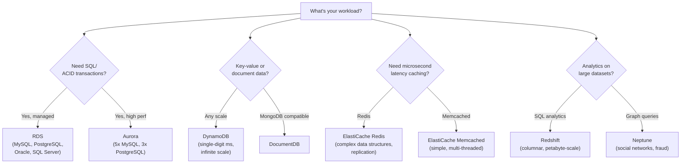
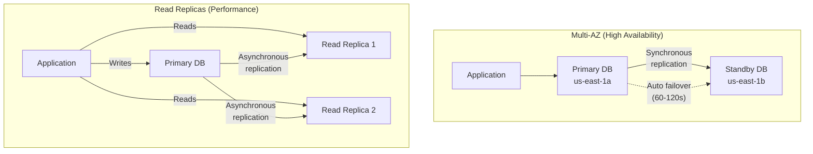
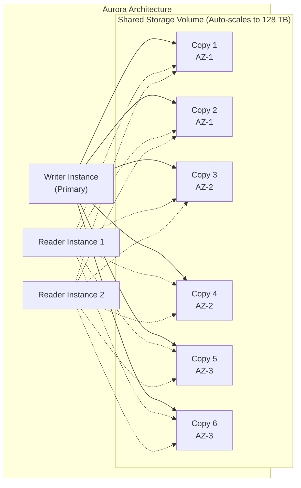
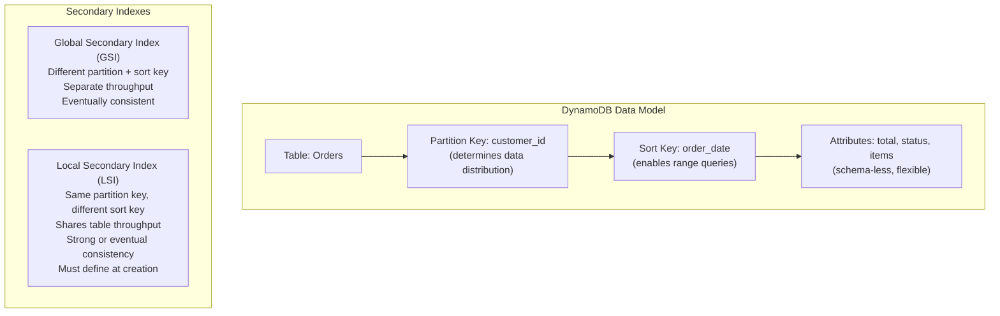
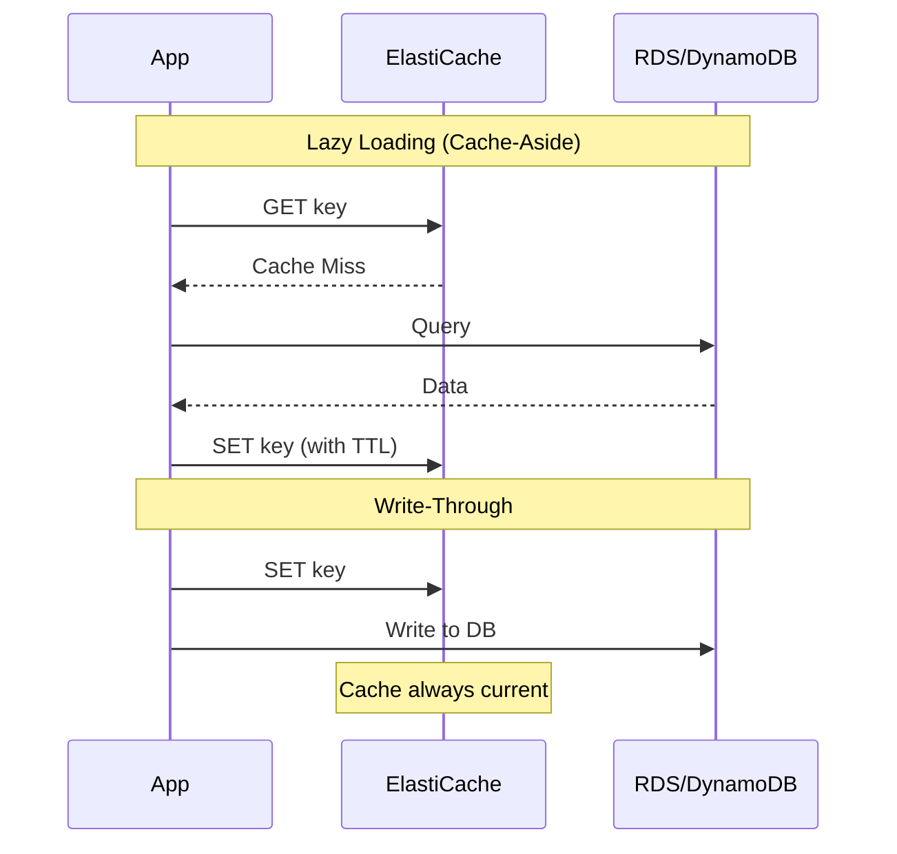

# Databases

## Overview

AWS offers purpose-built databases for every workload type. **RDS** provides managed relational databases. **Aurora** is AWS's cloud-native relational database with higher performance. **DynamoDB** is a fully managed NoSQL database for any scale. **ElastiCache** provides in-memory caching. **Redshift** is a petabyte-scale data warehouse. Choosing the right database is one of the most common interview topics.

## Key Concepts

| Concept | Description |
|---------|-------------|
| **Relational (SQL)** | Structured data, ACID transactions, joins (RDS, Aurora) |
| **NoSQL** | Flexible schema, high throughput, key-value or document (DynamoDB) |
| **In-Memory** | Microsecond latency, caching layer (ElastiCache) |
| **Data Warehouse** | Columnar storage, analytics on petabytes (Redshift) |
| **Graph** | Relationships between entities (Neptune) |
| **Time Series** | Time-stamped data like IoT metrics (Timestream) |

## Architecture Diagram

### Database Selection Guide

## Deep Dive

### Amazon RDS

Managed relational database service supporting MySQL, PostgreSQL, MariaDB, Oracle, SQL Server.

#### Multi-AZ vs Read Replicas

| Feature | Multi-AZ | Read Replicas |
|---------|----------|---------------|
| **Purpose** | High availability, disaster recovery | Read scaling, performance |
| **Replication** | Synchronous | Asynchronous |
| **Failover** | Automatic (60-120s) | Manual promotion |
| **Can serve reads?** | No (standby is passive) | Yes |
| **Cross-Region?** | No (same region) | Yes |
| **Max count** | 1 standby (2 for Multi-AZ cluster) | Up to 15 |

#### RDS Features

| Feature | Description |
|---------|-------------|
| **Automated Backups** | Daily snapshots + transaction logs, 0-35 day retention |
| **Manual Snapshots** | User-initiated, persist until deleted |
| **Encryption** | At-rest (KMS) and in-transit (SSL). Must enable at creation |
| **IAM Auth** | Token-based auth for MySQL/PostgreSQL (no password in code) |
| **RDS Proxy** | Connection pooling, reduces failover time by 66% |

### Amazon Aurora

AWS cloud-native relational database. **5x faster than MySQL, 3x faster than PostgreSQL** with the same compatibility.

| Feature | Detail |
|---------|--------|
| **Storage** | Auto-scales 10 GB to 128 TB, 6 copies across 3 AZs |
| **Durability** | Survives loss of 2 copies for writes, 3 for reads |
| **Failover** | < 30 seconds (vs 60-120s for RDS) |
| **Read Replicas** | Up to 15, auto-scaling, share storage volume |
| **Aurora Serverless v2** | Auto-scales compute on demand, pay per ACU-second |
| **Global Database** | Cross-region replication < 1 second, RPO < 1s |
| **Backtrack** | Rewind database to a point in time without restore |

### Amazon DynamoDB

Fully managed NoSQL key-value and document database. Single-digit millisecond performance at any scale.

#### DynamoDB Capacity Modes

| Mode | How It Works | Best For |
|------|-------------|----------|
| **Provisioned** | Set RCU/WCU, optional auto-scaling | Predictable traffic |
| **On-Demand** | Pay per request, no capacity planning | Unpredictable/spiky traffic |

- **1 RCU** = 1 strongly consistent read/sec (4 KB) or 2 eventually consistent reads/sec
- **1 WCU** = 1 write/sec (1 KB)

#### DynamoDB Advanced Features

| Feature | Description |
|---------|-------------|
| **DAX** | In-memory cache for DynamoDB (microsecond reads) |
| **DynamoDB Streams** | Capture item-level changes, trigger Lambda |
| **Global Tables** | Multi-region, active-active replication |
| **TTL** | Auto-delete expired items (no cost) |
| **PartiQL** | SQL-compatible query language for DynamoDB |
| **Point-in-Time Recovery** | Restore table to any second in last 35 days |
| **Transactions** | ACID transactions across multiple items/tables |

### Amazon ElastiCache

Managed in-memory data store for caching.

| Feature | Redis | Memcached |
|---------|-------|-----------|
| **Data Structures** | Strings, lists, sets, sorted sets, hashes, streams | Simple key-value strings |
| **Persistence** | Yes (AOF, RDB snapshots) | No |
| **Replication** | Yes (Multi-AZ with auto-failover) | No |
| **Clustering** | Yes (up to 500 nodes) | Yes (multi-threaded) |
| **Use Cases** | Caching, session store, leaderboards, pub/sub | Simple caching, large cache pools |

#### Caching Strategies

### Amazon Redshift

Petabyte-scale columnar data warehouse for analytics.

| Feature | Description |
|---------|-------------|
| **Architecture** | Leader node (query planning) + Compute nodes (storage/execution) |
| **Columnar Storage** | Stores data by column, ideal for analytical queries |
| **Redshift Spectrum** | Query S3 data directly without loading |
| **Concurrency Scaling** | Auto-add clusters for burst read queries |
| **Materialized Views** | Pre-computed query results for faster dashboards |
| **AQUA** | Hardware-accelerated cache layer |

## Best Practices

1. **Use Aurora over RDS** when you need higher performance and can use MySQL/PostgreSQL
2. **Always enable Multi-AZ** for production relational databases
3. **Use Read Replicas** to offload read traffic from the primary
4. **Use RDS Proxy** for Lambda-to-RDS connections (handles connection pooling)
5. **Choose DynamoDB** for high-throughput, low-latency, schema-flexible workloads
6. **Design DynamoDB tables around access patterns**, not data relationships
7. **Use DAX** for DynamoDB read-heavy workloads needing microsecond latency
8. **Use ElastiCache Redis** as default over Memcached (more features)
9. **Use lazy loading + TTL** as the default caching strategy
10. **Use Redshift for analytics**, not OLTP — that's what RDS/Aurora/DynamoDB are for

## Common Interview Questions

### Q1: When would you choose Aurora over standard RDS?

**A:** Choose Aurora when you need higher performance (5x MySQL, 3x PostgreSQL), faster failover (< 30s vs 60-120s), up to 15 read replicas (vs 5 for RDS), auto-scaling storage up to 128 TB, or cross-region replication under 1 second. Aurora costs ~20% more than RDS but the performance and availability gains are worth it for production. Stick with RDS when you need Oracle, SQL Server, or want lower cost for dev/test.

### Q2: Explain DynamoDB partition keys and how to design them.

**A:** The partition key determines which physical partition stores your data and is the primary mechanism for distributing load. A good partition key has **high cardinality** (many distinct values) and **even distribution** (each value gets similar traffic). Bad: `status` (only 3 values, hot partition). Good: `user_id` (millions of unique values). For time-series data, avoid using date as partition key — add a random suffix or use a composite key. Design starts with access patterns, not data model.

### Q3: What is the difference between Multi-AZ and Read Replicas?

**A:** **Multi-AZ** = high availability. Synchronous replication to a standby in another AZ, automatic failover in 60-120s, standby cannot serve reads. **Read Replicas** = read performance. Asynchronous replication, can serve read traffic, can be in other regions, must be manually promoted to become primary. They're complementary: use Multi-AZ for HA + Read Replicas for scaling reads.

### Q4: How does DynamoDB differ from a relational database?

**A:** DynamoDB is NoSQL: schema-less (each item can have different attributes), no joins (denormalize data instead), scales horizontally by adding partitions, single-digit ms at any scale. RDS is SQL: fixed schema, supports complex joins, scales vertically (bigger instance), ACID transactions. DynamoDB is designed around access patterns — you model data by how you query it, not by normalizing relationships. Trade-off: DynamoDB gives infinite scale and low latency but requires careful key design.

### Q5: When would you use ElastiCache Redis vs Memcached?

**A:** **Redis** for most use cases: it supports complex data structures (sorted sets for leaderboards, pub/sub for messaging), persistence (disaster recovery), replication (Multi-AZ failover), and clustering. **Memcached** only when you need the simplest possible caching with multi-threaded architecture for very high throughput on simple key-value pairs. Default to Redis unless you have a specific reason for Memcached.

### Q6: Explain caching strategies (lazy loading vs write-through).

**A:** **Lazy loading (cache-aside)**: App reads from cache first. On cache miss, reads from DB and writes to cache. Pros: only caches what's requested, handles cache failure gracefully. Cons: cache miss penalty (3 round trips), data can be stale. **Write-through**: App writes to cache and DB simultaneously. Pros: cache always current. Cons: write penalty, caches data that may never be read. Best practice: combine both — lazy loading with TTL for freshness guarantees.

### Q7: What is Aurora Serverless and when would you use it?

**A:** Aurora Serverless v2 automatically scales compute capacity based on demand, measured in ACUs (Aurora Capacity Units). It scales in fine-grained increments, even to zero for v1 (v2 scales to minimum 0.5 ACU). Use cases: dev/test environments, infrequent or unpredictable workloads, multi-tenant apps with variable per-tenant load. Not ideal for steady high-throughput production workloads where provisioned is more cost-effective.

### Q8: How would you migrate from a relational database to DynamoDB?

**A:** (1) Analyze access patterns — list every query your app makes. (2) Design the DynamoDB table model around those patterns using single-table design if possible. (3) Choose partition key for even distribution and sort key for query flexibility. (4) Create GSIs for additional access patterns. (5) Use AWS DMS (Database Migration Service) for the actual migration. (6) Test thoroughly — DynamoDB doesn't support ad-hoc queries like SQL, so missing access patterns means redesigning tables.

### Q9: What is Redshift Spectrum?

**A:** Redshift Spectrum lets you query data directly in S3 using SQL, without loading it into Redshift. It extends your Redshift cluster to the S3 data lake — queries hit both Redshift tables and S3 files. Supports Parquet, ORC, CSV, JSON. Use it for cold/historical data that doesn't justify loading into expensive Redshift storage. You only pay for the data scanned in S3.

### Q10: How does DynamoDB Global Tables work?

**A:** DynamoDB Global Tables provides multi-region, active-active replication. Write to any region and data replicates to all other configured regions within typically < 1 second. All replicas accept both reads and writes. Conflict resolution uses last-writer-wins. Use cases: global applications needing low-latency reads/writes everywhere, disaster recovery. Requires DynamoDB Streams enabled on the table.

## Latest Updates (2025-2026)

- **Aurora Limitless Database** provides transparent horizontal write scaling by sharding data across multiple Aurora DB instances while maintaining a single-database experience for applications. It supports distributed transactions and enables petabyte-scale transactional workloads.
- **Aurora Serverless v2** now scales up to **256 ACUs**, providing significantly more headroom for burst workloads while maintaining sub-second scaling responsiveness.
- **DynamoDB zero-ETL integration with Redshift** allows you to run analytics on live DynamoDB data in Redshift without building or maintaining ETL pipelines. Data is automatically replicated and kept in sync.
- **Amazon MemoryDB for Redis** is a durable, Redis-compatible in-memory database that provides microsecond read latency, single-digit millisecond write latency, and Multi-AZ durability. It can serve as a primary database, not just a cache.
- **ElastiCache Serverless** removes the need to choose node types and cluster sizes — it automatically scales cache capacity based on workload demands and charges per GB-hour of data stored and per ECPUs consumed.
- **RDS Blue/Green Deployments** allow you to create a staging environment that mirrors production, apply changes (engine upgrades, parameter changes, schema modifications), test, and then switch over with minimal downtime and automatic rollback capability.
- **Aurora I/O-Optimized** is a new cluster configuration that provides improved price-performance for I/O-heavy workloads by charging a higher compute rate but eliminating per-I/O charges, resulting in up to 40% cost savings for I/O-intensive applications.

### Q11: What is Aurora Limitless Database and when would you use it?

**A:** Aurora Limitless Database enables horizontal write scaling by automatically sharding data across multiple Aurora DB instances while presenting a unified, single-database interface to applications. You define shard keys on tables, and Aurora handles data distribution, distributed transactions, and cross-shard queries transparently. Unlike traditional sharding where applications must manage shard routing, Aurora Limitless handles this at the database layer. Use it when your transactional workload outgrows the write capacity of a single Aurora writer instance (for example, multi-tenant SaaS platforms, high-volume e-commerce, or gaming leaderboards). It maintains full SQL compatibility and ACID semantics across shards. It is not needed for read-heavy workloads that can be scaled with read replicas.

### Q12: When would you use MemoryDB for Redis vs ElastiCache for Redis?

**A:** **MemoryDB for Redis** is a durable, Redis-compatible database that stores data across multiple AZs using a Multi-AZ transactional log. It provides microsecond reads and single-digit millisecond writes with data durability — meaning it can serve as your **primary database** for Redis-based workloads, eliminating the need for a separate backend database. **ElastiCache for Redis** is designed as a **caching layer** in front of another database. While ElastiCache supports replication and persistence, it is not designed as a system of record. Choose MemoryDB when you need Redis as your primary database (session stores, real-time leaderboards, shopping carts) with durability guarantees. Choose ElastiCache when you need a pure caching layer to accelerate reads from RDS, DynamoDB, or another primary data store.

### Q13: What are the key principles of DynamoDB single-table design?

**A:** Single-table design stores multiple entity types (users, orders, products) in a single DynamoDB table using carefully designed composite keys. The partition key and sort key use generic names (PK, SK) with prefixed values (PK: "USER#123", SK: "ORDER#2024-01-15"). This enables efficient access patterns through key-condition expressions and reduces the number of tables and GSIs you need. The core principles are: (1) identify all access patterns before designing the schema, (2) use composite sort keys for hierarchical relationships (SK: "ORDER#2024#ITEM#456"), (3) use GSIs to support additional access patterns by overloading their keys, (4) denormalize data aggressively — duplicate data across items to avoid expensive scans, (5) use sparse indexes where only items with the GSI key attributes appear in the index. Single-table design maximizes efficiency and minimizes costs but requires upfront access pattern analysis and is harder to evolve.

### Q14: How do you decide between DynamoDB On-Demand and Provisioned capacity modes?

**A:** **On-Demand** charges per read/write request with no capacity planning — ideal for unpredictable traffic, new applications where patterns are unknown, and spiky workloads. It instantly accommodates up to double the previous peak throughput and gradually scales beyond that. **Provisioned** lets you set specific RCU/WCU with optional auto-scaling — ideal for predictable, steady workloads and offers significantly lower per-request cost (up to 5-7x cheaper than On-Demand at sustained throughput). The break-even point is typically around 18-20% utilization — if your provisioned capacity is consistently above that utilization, provisioned is cheaper. A common strategy is to start with On-Demand for new tables, analyze traffic patterns over 2-4 weeks, then switch to provisioned with auto-scaling once patterns stabilize. You can switch modes once every 24 hours.

### Q15: How does RDS Proxy work and why is it critical for Lambda?

**A:** RDS Proxy is a fully managed database proxy that sits between your application and RDS/Aurora. It maintains a pool of established database connections and multiplexes application connections over this pool. This is critical for Lambda because each Lambda invocation typically opens a new database connection, and hundreds of concurrent Lambda executions can quickly exhaust the database's maximum connections limit (causing "too many connections" errors). RDS Proxy solves this by reusing connections from its pool — hundreds of Lambda functions share a much smaller number of actual database connections. Additionally, RDS Proxy reduces failover time by up to 66% because it routes traffic to the new primary automatically while draining connections from the failed instance. It supports IAM authentication, enforces TLS, and integrates with Secrets Manager for credential rotation.

### Q16: What are common database sharding strategies on AWS?

**A:** Sharding horizontally partitions data across multiple database instances to scale writes beyond a single node. **Application-level sharding** has the app determine which shard to query using a shard key (e.g., customer_id mod N). This is flexible but complex — applications must manage routing, cross-shard queries, and rebalancing. **Aurora Limitless Database** provides transparent sharding at the database layer, removing application complexity. **DynamoDB** handles sharding automatically via partition keys — you just design good keys. For RDS/Aurora without Limitless, common approaches include: hash-based sharding (consistent hashing for even distribution), range-based sharding (date ranges for time-series), and directory-based sharding (lookup table maps keys to shards). Key challenges include cross-shard joins (avoid them by denormalizing), shard rebalancing when adding nodes, and maintaining referential integrity across shards.

### Q17: When should you choose Aurora I/O-Optimized vs Aurora Standard?

**A:** Aurora offers two storage configurations. **Aurora Standard** charges a lower compute rate plus per-I/O charges (reads and writes to storage). **Aurora I/O-Optimized** charges a higher compute rate (roughly 30% more) but eliminates all I/O charges. The break-even point is when I/O costs exceed approximately 25% of your total Aurora bill. I/O-Optimized is ideal for OLTP workloads with heavy read/write patterns, write-heavy applications, workloads with large working sets that exceed buffer pool size, and any application where I/O costs are unpredictable or hard to forecast. AWS reports customers typically see 40% savings on I/O-intensive workloads. You can switch between configurations without downtime, and you should monitor your Aurora cost breakdown for a few weeks before deciding.

### Q18: How does read-after-write consistency work in DynamoDB?

**A:** DynamoDB replicates data across three facilities (AZs) within a Region. By default, **GetItem** and **Query** operations use **eventually consistent** reads, which may return slightly stale data if a write just completed (typically consistent within a second). You can request **strongly consistent** reads by setting `ConsistentRead: true`, which guarantees you read the most recent write — but this costs 2x the RCUs and is not available on GSIs (only the base table and LSIs support strong consistency). For **transactions** (TransactGetItems, TransactWriteItems), DynamoDB provides serializable isolation, which is the strongest consistency level. A common pattern is to use eventual consistency for most reads (lower cost, higher throughput) and strong consistency only where business logic requires it (e.g., reading an account balance after a debit).

### Q19: How do you handle hot partitions in DynamoDB?

**A:** A hot partition occurs when a disproportionate amount of traffic targets a small number of partition key values, exceeding the per-partition throughput limit (3,000 RCU and 1,000 WCU per partition). Solutions include: (1) **Improve key design** — choose a high-cardinality partition key; add a random suffix (write sharding) to distribute writes (e.g., "product#1234#shard-3"). (2) **Use DynamoDB Adaptive Capacity** — automatically redistributes throughput from less-active partitions to hot ones. (3) **Implement DAX** for read-heavy hot keys to absorb repeated reads in-memory. (4) **Use On-Demand mode** which handles spiky key patterns more gracefully. (5) For time-series patterns, avoid using timestamps as partition keys — instead use a composite key with a high-cardinality prefix. The fundamental principle is that DynamoDB performs best when traffic is evenly distributed across partition keys.

### Q20: When would you use Amazon Neptune for graph databases?

**A:** Neptune is a fully managed graph database supporting both **Property Graph** (with Apache Gremlin queries) and **RDF** (with SPARQL queries) models. Use it when your data has many-to-many relationships that are expensive to model and query in relational databases: social networks (friends-of-friends), recommendation engines (users who bought X also bought Y), fraud detection (identify rings of connected suspicious entities), knowledge graphs (entity-relationship networks), identity graphs (mapping users across devices and accounts), and network/IT infrastructure mapping. Neptune stores relationships as first-class citizens, making traversals across millions of connections execute in milliseconds instead of requiring expensive self-joins. It supports up to 15 read replicas, Multi-AZ failover, and encryption at rest. Neptune Serverless auto-scales compute for variable workloads.

### Q21: What is Amazon Timestream and when would you choose it?

**A:** Timestream is a purpose-built serverless time-series database designed for IoT sensor data, application metrics, DevOps monitoring, and clickstream analytics. It automatically separates recent data into an in-memory store (fast queries on recent data) and historical data into a magnetic store (cost-effective queries on older data), with lifecycle policies managing the transition. Timestream's query engine supports time-series-specific functions: time bucketing, interpolation, smoothing, and approximation that would be complex to implement in a general-purpose database. Choose Timestream over DynamoDB when you primarily query data by time range and need built-in time-series analytics. Choose Timestream over RDS when you have billions of time-stamped events and need automatic tiered storage. It provides 1000x faster queries and 1/10th the cost compared to using relational databases for time-series workloads.

### Q22: What is QLDB and when would you use it for an immutable ledger?

**A:** Amazon QLDB (Quantum Ledger Database) provides an immutable, transparent, and cryptographically verifiable transaction log. Every change is tracked in an append-only journal with a SHA-256 hash chain, making it impossible to modify or delete historical records without detection. Use QLDB when you need a system of record with an auditable, tamper-proof history: financial transaction ledgers, supply chain tracking, regulatory compliance records, HR/payroll change logs, and insurance claims processing. Unlike a blockchain, QLDB is centrally owned (no distributed consensus needed), giving it higher throughput and simpler operations. It uses PartiQL (SQL-compatible) for queries and supports document data model with ACID transactions. Note: QLDB is purpose-built for immutable audit trails — if you need decentralized trust across parties, consider Amazon Managed Blockchain instead.

## Deep Dive Notes

### DynamoDB Single-Table Design Walkthrough

Consider an e-commerce application with three entity types: Users, Orders, and OrderItems. In single-table design, all entities share one table with generic key names. **Users**: PK = "USER#alice", SK = "PROFILE". **Orders**: PK = "USER#alice", SK = "ORDER#2024-01-15#ord-123". **OrderItems**: PK = "ORDER#ord-123", SK = "ITEM#sku-789". To query all orders for a user, you Query with PK = "USER#alice" and SK begins_with "ORDER#" — this returns all orders sorted by date. To get all items in an order, Query with PK = "ORDER#ord-123" and SK begins_with "ITEM#". For an access pattern like "get all orders containing a specific product," add a GSI with GSI-PK = "PRODUCT#sku-789" and GSI-SK = "ORDER#ord-123". Key design principles: use **composite sort keys** for hierarchical data, **overload GSIs** to serve multiple access patterns, use **sparse indexes** (only items with the GSI attribute appear), and **denormalize** by duplicating data (store product name in the OrderItem rather than requiring a join). Single-table design minimizes round-trips and cost but requires all access patterns to be known upfront.

### Aurora Architecture Internals

Aurora decouples compute from storage. The **storage layer** is a distributed, fault-tolerant, self-healing system spanning 3 AZs with 6 copies of data. Writes use a **quorum** model: a write is acknowledged when 4 of 6 copies confirm (ensuring durability even if an entire AZ fails). Reads require 3 of 6 copies. The storage layer handles replication, backup, and recovery independently of compute instances. Aurora does not write full data pages to storage — it writes only **redo log records**, reducing network I/O by 10x compared to traditional RDS MySQL. The storage layer applies redo records to reconstruct pages on demand. This architecture enables **instantaneous crash recovery** (replay redo from the last checkpoint, which takes seconds, not minutes). The **shared storage volume** auto-scales from 10 GB to 128 TB and is shared by the writer and all read replicas — replicas see writes with typical lag under 20ms because they read from the same storage. **Aurora cloning** creates a new cluster by sharing storage (copy-on-write), completing in seconds regardless of database size.

### Database Migration Strategies

**Homogeneous migration** (e.g., MySQL to Aurora MySQL): Use AWS DMS (Database Migration Service) with a replication instance that reads from the source and writes to the target. DMS supports full-load + change data capture (CDC) for near-zero-downtime migration. For simple cases, use native tools (mysqldump, pg_dump) for small databases. **Heterogeneous migration** (e.g., Oracle to Aurora PostgreSQL): First convert the schema using **AWS SCT (Schema Conversion Tool)**, which translates stored procedures, data types, and schema objects. Then use DMS for data migration with ongoing replication until cutover. SCT generates an assessment report highlighting incompatibilities requiring manual code changes. **DynamoDB migrations**: Use DMS to stream data from relational sources to DynamoDB, but the application must be redesigned for NoSQL access patterns — this is not a lift-and-shift. **Large-scale migrations**: For terabyte-scale databases, use DMS with multiple replication instances, enable parallel full-load, and consider AWS Snowball Edge for the initial data transfer if network bandwidth is a constraint. Always run the migration in a test environment first and validate data integrity using DMS validation features.

### Choosing Between SQL and NoSQL

The decision is driven by access patterns, scale requirements, and consistency needs. **Choose SQL (RDS/Aurora)** when: you need complex joins across tables, ACID transactions spanning multiple entities, flexible ad-hoc querying (business analysts writing arbitrary SQL), strong referential integrity, or your data model is highly relational. **Choose NoSQL (DynamoDB)** when: you need single-digit millisecond latency at any scale, your access patterns are well-defined and limited, you have massive write throughput requirements, your data is denormalized or document-oriented, or you need global replication (Global Tables). **Hybrid approach**: Many production architectures use both — DynamoDB for the hot path (user sessions, shopping carts, real-time APIs) and Aurora for the cold path (reports, analytics, complex queries). Common anti-patterns: using DynamoDB when you need ad-hoc queries (fight against its strengths), using RDS when you need horizontal write scaling (will hit single-node limits), or choosing based on technology preference rather than workload requirements.

## Scenario-Based Questions

### S1: Your Aurora MySQL cluster's read replica lag has jumped from 5ms to 500ms. Users see stale data. How do you investigate?

**A:** (1) **CloudWatch metrics** — check `AuroraReplicaLag` and `AuroraReplicaLagMaximum`. Correlate with `CPUUtilization` on the writer. (2) **Writer overload** — heavy write workloads generate more WAL records for replicas to apply. Check `DMLThroughput` and `CommitThroughput`. If writer CPU is high, the fix is scaling up the writer or optimizing write queries. (3) **Replica resource contention** — if the replica itself is CPU-bound (heavy read queries), it falls behind on applying writes. Solution: add more replicas to distribute read load, or use reader endpoint with connection pooling. (4) **Long-running queries on replica** — a large SELECT blocks WAL apply. Enable `innodb_kill_idle_transaction` or kill long queries. (5) **Network** — unlikely with Aurora (shared storage), but check if replica is in a different AZ with high cross-AZ latency.

### S2: Your DynamoDB table handles 10K writes/sec normally, but during a flash sale it spikes to 100K writes/sec and gets throttled. How do you handle this?

**A:** (1) **Switch to on-demand mode** before the sale — handles any traffic level instantly but costs 5-7x more than provisioned. Switch back after the sale. (2) **Pre-warm with scheduled scaling** — if you know the sale time, increase provisioned capacity to 100K WCU 30 minutes before (auto-scaling is too slow for 10x spikes). (3) **Write sharding** — if throttling is on specific items (hot products), add random suffix to PK (`PRODUCT#123#<1-10>`) to spread writes across partitions. (4) **SQS buffer** — put an SQS queue in front of DynamoDB. Accept all orders into SQS and drain to DynamoDB at sustainable rate. Customers get instant confirmation, processing is async. (5) **DAX write-through** — not for write scaling, but DAX can cache reads to reduce overall table pressure.

### S3: Your team wants to use DynamoDB for a new feature, but the data is highly relational with complex JOINs. How do you decide?

**A:** **Ask three questions**: (1) Are your access patterns well-defined and stable? DynamoDB requires knowing all queries upfront. If analysts need ad-hoc SQL, use Aurora. (2) Do you need single-digit millisecond latency at scale? DynamoDB wins. If sub-100ms is fine, Aurora works. (3) Do queries involve >2 table JOINs? DynamoDB has no native joins — you'd denormalize everything or make multiple queries. **Recommendation**: If the feature has 3-5 fixed access patterns and needs scale → DynamoDB. If it has complex relationships and evolving queries → Aurora. **Hybrid**: use DynamoDB for the hot path (real-time API) and Aurora for complex queries (reports, analytics). Sync via DynamoDB Streams → Lambda → Aurora.

## Cheat Sheet

| Concept | Key Facts |
|---------|-----------|
| RDS | Managed SQL, 6 engines, Multi-AZ for HA, up to 5 read replicas |
| Aurora | Cloud-native, 5x MySQL/3x PostgreSQL, 6 copies across 3 AZs, 128 TB max |
| Aurora Serverless | Auto-scaling compute, pay per ACU, good for variable workloads |
| DynamoDB | NoSQL, single-digit ms, infinite scale, key-value + document |
| DynamoDB Capacity | Provisioned (set RCU/WCU) or On-Demand (pay per request) |
| DAX | DynamoDB in-memory cache, microsecond reads |
| Global Tables | DynamoDB multi-region active-active, < 1s replication |
| ElastiCache Redis | In-memory, complex data structures, replication, persistence |
| ElastiCache Memcached | Simple caching, multi-threaded, no persistence |
| Redshift | Columnar data warehouse, petabyte-scale analytics |
| Redshift Spectrum | Query S3 data from Redshift using SQL |
| RDS Proxy | Connection pooling, 66% faster failover, great for Lambda |

---

[← Previous: Networking](../05-networking/) | [Next: Serverless →](../07-serverless/)
