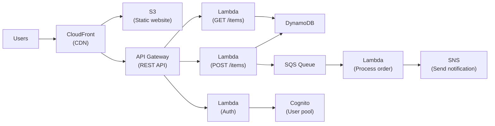
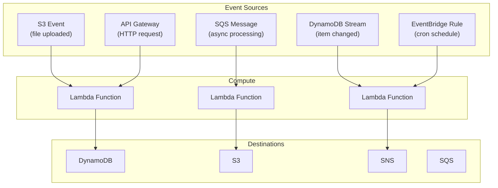
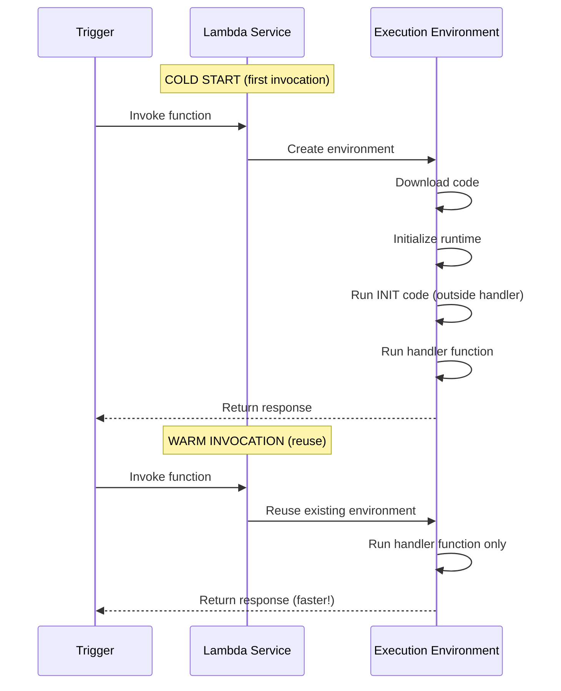
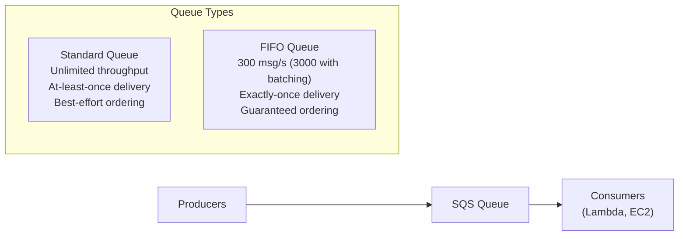
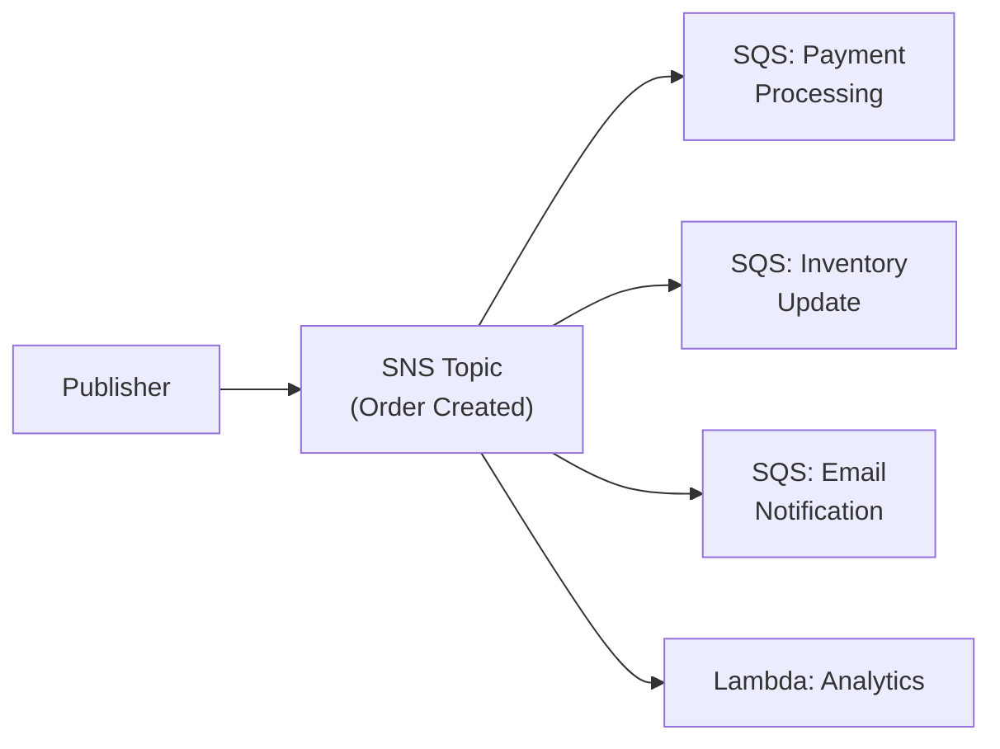
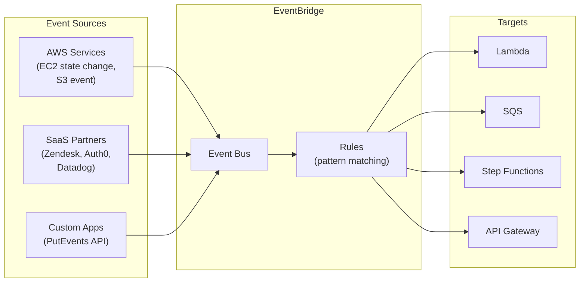
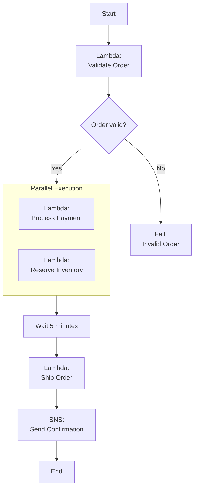
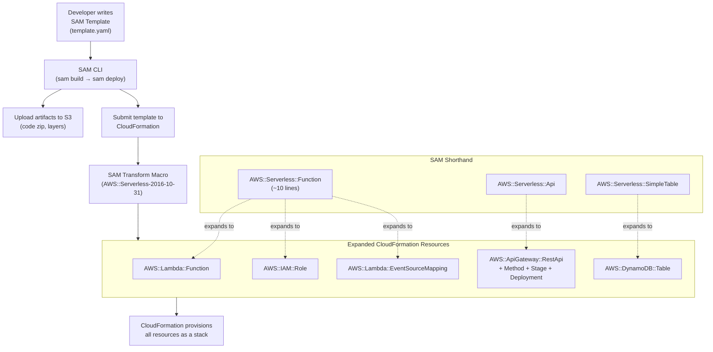
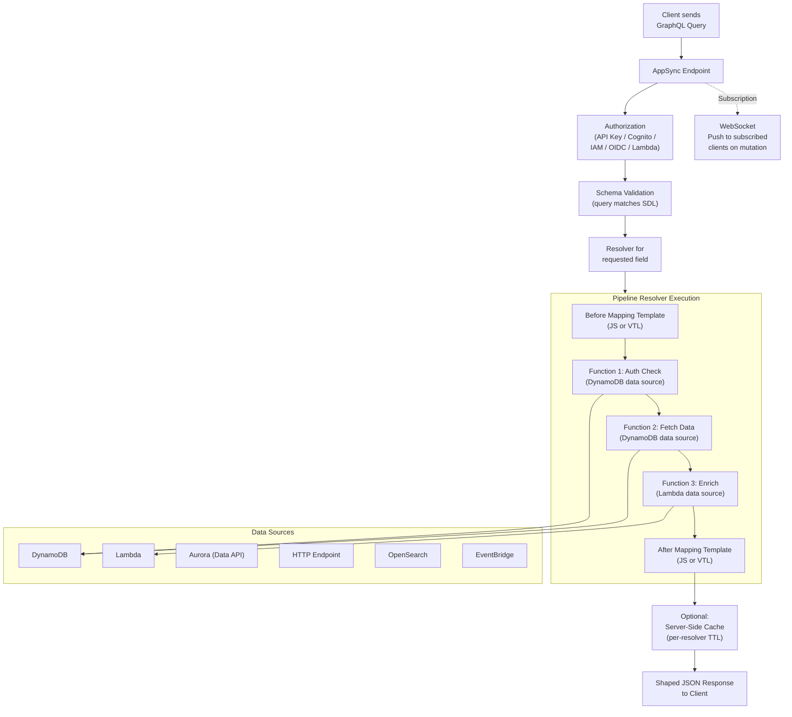

# Serverless

## Overview

Serverless means you don't manage any servers — AWS handles provisioning, scaling, patching, and availability. You only pay for what you use. **Lambda** runs code in response to events. **API Gateway** creates RESTful and WebSocket APIs. **Step Functions** orchestrates workflows. **SQS/SNS/EventBridge** handle messaging and event routing.

## Key Concepts

| Concept | Description |
|---------|-------------|
| **Function as a Service (FaaS)** | Run code without provisioning servers (Lambda) |
| **Event-Driven** | Functions triggered by events (S3 upload, API call, schedule) |
| **Pay-Per-Use** | Billed for actual execution time, not idle capacity |
| **Cold Start** | Latency on first invocation when Lambda creates a new execution environment |
| **Concurrency** | Number of function instances running simultaneously |

## Architecture Diagram

### Serverless Web Application

### Event-Driven Architecture

## Deep Dive

### AWS Lambda

| Feature | Detail |
|---------|--------|
| **Runtime** | Python, Node.js, Java, Go, .NET, Ruby, custom (via containers) |
| **Memory** | 128 MB to 10,240 MB (CPU scales proportionally) |
| **Timeout** | Max 15 minutes |
| **Package Size** | 50 MB zipped, 250 MB unzipped, 10 GB container image |
| **Concurrency** | 1000 default per region (can request increase) |
| **Ephemeral Storage** | /tmp — 512 MB to 10,240 MB |
| **Layers** | Share code/libraries across functions (up to 5 layers) |

#### Lambda Execution Lifecycle

#### Lambda Concurrency

| Type | Description | Use Case |
|------|-------------|----------|
| **Unreserved** | Shared pool (1000 default per region) | Most functions |
| **Reserved** | Guaranteed concurrency for a function | Critical functions that must always run |
| **Provisioned** | Pre-initialized environments, no cold starts | Latency-sensitive (API backends) |

#### Cold Start Optimization

1. Keep deployment packages small
2. Initialize SDK clients outside the handler (reused in warm invocations)
3. Use Provisioned Concurrency for latency-sensitive functions
4. Prefer Python/Node.js over Java/.NET (faster startup)
5. Use Lambda SnapStart (Java) — caches initialized snapshot
6. Minimize dependency imports

### API Gateway

| Feature | REST API | HTTP API | WebSocket API |
|---------|----------|----------|---------------|
| **Use Case** | Full-featured REST | Simple, low-cost REST | Real-time 2-way |
| **Cost** | $3.50/million | $1.00/million | $1.00/million + connection |
| **Features** | Caching, WAF, resource policies, usage plans | OIDC/OAuth, CORS | Persistent connections |
| **Latency** | Higher | Lower (40% less) | N/A |
| **Recommendation** | Legacy or full features | **Default choice** | Chat, gaming, dashboards |

#### API Gateway Key Features

| Feature | Description |
|---------|-------------|
| **Stages** | Deploy to dev, staging, prod independently |
| **Throttling** | Default 10,000 req/s per region, per-method limits |
| **Caching** | Cache responses (REST API only, 0.5 GB to 237 GB) |
| **Authorization** | Lambda authorizer, Cognito, IAM, API keys |
| **Request Validation** | Validate request body/parameters before hitting Lambda |
| **Usage Plans** | Rate limiting and quotas per API key |

### Amazon SQS (Simple Queue Service)

| Feature | Standard | FIFO |
|---------|----------|------|
| **Throughput** | Unlimited | 300 msg/s (3000 batched) |
| **Delivery** | At-least-once | Exactly-once |
| **Ordering** | Best effort | Guaranteed |
| **Deduplication** | No | Yes (5-minute window) |
| **Use Case** | Decoupling, high volume | Financial transactions, ordering matters |

- **Visibility Timeout**: Time a message is hidden after consumer reads it (default 30s, max 12h)
- **Dead Letter Queue (DLQ)**: Messages that fail processing N times go here for investigation
- **Long Polling**: Reduce empty responses and cost (set WaitTimeSeconds > 0)
- **Max Message Size**: 256 KB (use S3 for larger payloads via Extended Client Library)
- **Retention**: 1 minute to 14 days (default 4 days)

### Amazon SNS (Simple Notification Service)

Pub/sub messaging service. Publishers send messages to **topics**, which fan out to all **subscribers**.

| Subscriber Type | Description |
|----------------|-------------|
| SQS | Queue for async processing |
| Lambda | Invoke function |
| HTTP/HTTPS | Webhook endpoint |
| Email/SMS | Notifications |
| Kinesis Data Firehose | Stream to S3/Redshift |

**SNS + SQS Fan-Out Pattern**: Publish once to SNS topic → multiple SQS queues subscribe → each queue processes independently.

### Amazon EventBridge

Serverless event bus — the evolution of CloudWatch Events. Routes events from AWS services, SaaS apps, and custom apps to targets.

### AWS Step Functions

Orchestrate Lambda functions and AWS services into workflows using a visual state machine.

| Workflow Type | Max Duration | Price | Use Case |
|-------------- |-------------|-------|----------|
| **Standard** | 1 year | $0.025/1K transitions | Long-running, auditable |
| **Express** | 5 minutes | $1/million executions | High-volume, short (IoT, streaming) |

## Best Practices

1. **Keep Lambda functions small and focused** — one function, one responsibility
2. **Initialize SDK clients outside the handler** for warm start reuse
3. **Use environment variables** for configuration, Secrets Manager for secrets
4. **Set appropriate timeouts** — don't use the max 15 min if your function runs in 3 seconds
5. **Use Dead Letter Queues** for both Lambda and SQS to catch failures
6. **Prefer HTTP API over REST API** unless you need REST-specific features
7. **Use EventBridge over SNS** for complex routing (content-based filtering)
8. **Use SQS between services** for decoupling and retry handling
9. **Use Step Functions** for multi-step workflows instead of chaining Lambdas
10. **Monitor with X-Ray** for distributed tracing across serverless components

## Common Interview Questions

### Q1: What is a Lambda cold start and how do you minimize it?

**A:** A cold start occurs when Lambda creates a new execution environment — downloading code, initializing the runtime, and running init code outside the handler. It adds 100ms-10s latency depending on runtime and package size. Minimize by: (1) Using Provisioned Concurrency for latency-sensitive functions, (2) Keeping packages small, (3) Using Python/Node.js over Java, (4) Initializing clients outside the handler, (5) Using Lambda SnapStart for Java. After the first invocation, subsequent calls reuse the warm environment.

### Q2: Explain the difference between SQS, SNS, and EventBridge.

**A:** **SQS** = point-to-point queue. One producer, one consumer group. Messages persist until processed. Use for decoupling and retry. **SNS** = pub/sub. One message fans out to many subscribers. Push-based. Use for broadcasting notifications. **EventBridge** = event bus with content-based routing. Supports event patterns, schema registry, third-party SaaS sources, and 200+ AWS service events. EventBridge is the most flexible; use SQS for queuing, SNS for fan-out, EventBridge for complex event routing.

### Q3: How does Lambda concurrency work?

**A:** Each concurrent execution of your function uses one instance. Default regional limit is 1000 concurrent executions shared across all functions. **Reserved concurrency** guarantees capacity for a function but also caps it (prevents runaway). **Provisioned concurrency** pre-initializes environments to eliminate cold starts. If a function exceeds its concurrency limit, additional invocations are throttled (sync) or retried (async).

### Q4: What is the SNS + SQS fan-out pattern?

**A:** Publish a message to an SNS topic, and multiple SQS queues subscribe to it. Each queue gets a copy and processes independently. Example: "order placed" event publishes to SNS → one queue processes payment, another updates inventory, another sends email. Benefits: each consumer is decoupled, can process at its own pace, and failures in one don't affect others. Each SQS queue can have its own DLQ and retry policy.

### Q5: When would you use Step Functions vs direct Lambda chaining?

**A:** Use Step Functions when: (1) workflows have branching logic, (2) you need parallel execution, (3) you need wait states or human approval, (4) you want built-in retry with exponential backoff, (5) you need visual monitoring. Avoid direct Lambda-to-Lambda invocation — it creates tight coupling, wastes execution time waiting, and makes error handling complex. Step Functions handle all orchestration concerns declaratively.

### Q6: How does API Gateway authorization work?

**A:** Four methods: (1) **IAM authorization** — caller signs requests with AWS credentials (best for AWS-to-AWS). (2) **Cognito User Pool** — integrates with Cognito for user auth, validates JWT tokens. (3) **Lambda Authorizer** — custom auth function that returns an IAM policy (best for custom token formats). (4) **API Keys** — not for auth, only for usage tracking and throttling. For most web apps, Cognito or Lambda Authorizer is the right choice.

### Q7: How do you handle Lambda failures with async invocations?

**A:** For async invocations (S3 events, SNS, EventBridge): Lambda retries twice automatically with delays. After 3 total attempts, the event goes to a Dead Letter Queue (SQS or SNS) or Lambda Destinations (success/failure targets). **Lambda Destinations** are preferred over DLQs because they pass more context (request/response payload, not just the event). For stream-based invocations (Kinesis, DynamoDB Streams), Lambda retries until the record expires or succeeds.

### Q8: What is the difference between SQS Standard and FIFO?

**A:** **Standard**: unlimited throughput, at-least-once delivery (possible duplicates), best-effort ordering. **FIFO**: 300 msg/s (3000 with batching), exactly-once processing, strict ordering within a message group. FIFO queue names must end with `.fifo`. Use Standard for high-volume decoupling; use FIFO when message order and exactly-once matter (financial transactions, command sequencing).

### Q9: How would you design a serverless REST API?

**A:** CloudFront → API Gateway (HTTP API) → Lambda → DynamoDB. Auth via Cognito User Pool. Static frontend in S3 + CloudFront. Lambda environment variables for config, Secrets Manager for sensitive values. Enable X-Ray tracing across all components. Use API Gateway request validation to reject bad requests early. DLQ on Lambda for error handling. CloudWatch Logs + custom metrics for monitoring.

### Q10: What is EventBridge and how does it differ from SNS?

**A:** EventBridge is a serverless event bus with content-based filtering — you define rules that match event patterns and route to targets. Key advantages over SNS: (1) Native integration with 200+ AWS services (automatic events), (2) Third-party SaaS integration (Zendesk, Datadog), (3) Schema registry for event discovery, (4) Archive and replay events, (5) More granular filtering. SNS is simpler and cheaper for basic pub/sub fan-out. Use EventBridge for complex event-driven architectures.

## Latest Updates (2025-2026)

- **Lambda response streaming** allows functions to progressively stream response data back to clients, reducing time-to-first-byte for large payloads, server-side rendering, and real-time generative AI responses.
- **Lambda SnapStart for Java** is now GA and extends to additional runtimes, caching a snapshot of the initialized execution environment to eliminate cold start latency (reducing Java cold starts from 5-10s to under 200ms).
- **EventBridge Pipes** connects event producers to consumers with optional filtering, enrichment, and transformation in a point-to-point integration pattern, reducing the glue code needed between services.
- **EventBridge Scheduler** is a serverless scheduler for one-time and recurring tasks, supporting millions of schedules with at-least-once delivery to over 270 AWS service targets.
- **Step Functions Distributed Map** enables massively parallel processing of large datasets (millions of items from S3 or other sources) with up to 10,000 concurrent child executions.
- **API Gateway WebSocket improvements** include enhanced connection management, better integration with Lambda, and improved monitoring capabilities for real-time application scenarios.
- **Lambda Powertools** (Python, TypeScript, Java, .NET) provides standardized observability patterns including structured logging, distributed tracing, and custom metrics with minimal boilerplate.

### Q11: What is Lambda response streaming and when would you use it?

**A:** Lambda response streaming allows your function to send response data incrementally to the client as it becomes available, rather than buffering the entire response before sending. The function writes to a writable stream, and the client receives chunks progressively. This reduces time-to-first-byte dramatically for large payloads. Key use cases include: server-side rendering of web pages (send HTML progressively as components render), large file generation (CSV/JSON exports), real-time generative AI token streaming (LLM responses), and media transcoding previews. Response streaming supports payloads up to 20 MB (vs the standard 6 MB synchronous limit) and is available through function URLs with `RESPONSE_STREAM` invoke mode. It is not supported through API Gateway — use Lambda function URLs or CloudFront with Lambda function URL as origin instead.

### Q12: How does EventBridge Pipes differ from direct service integrations?

**A:** EventBridge Pipes provides a managed, point-to-point integration between a source and a target with optional filtering, enrichment, and transformation stages — all without writing Lambda glue code. A pipe reads from a source (SQS, DynamoDB Streams, Kinesis, Kafka, MQ), applies an input filter (EventBridge pattern matching), optionally enriches the data (via Lambda, Step Functions, API Gateway, or API Destination), transforms the output, and delivers to a target (Lambda, Step Functions, SQS, SNS, EventBridge, Kinesis, and 14+ other services). The key difference from EventBridge event bus rules is that Pipes is **point-to-point** (one source to one target) with built-in batching and ordering, while the event bus is **many-to-many** with content-based routing. Use Pipes when you want to replace a Lambda function that merely reads from a stream/queue, transforms data, and sends it to another service. Use the event bus when you need fan-out or complex routing.

### Q13: How does Step Functions Distributed Map work for large-scale processing?

**A:** Distributed Map is a Step Functions state type that orchestrates massively parallel processing across up to 10,000 concurrent child workflow executions. It can read items directly from an S3 bucket (CSV, JSON, or S3 inventory), partition them into sub-batches, and launch a child workflow for each batch. Each child execution can run a full Step Functions workflow (Lambda functions, service integrations, error handling). Use cases include: processing millions of S3 objects (image resizing, data validation), large-scale data transformation, genomic analysis, financial risk modeling, and batch ETL. The parent workflow tracks overall progress and aggregates results. Compared to regular Map state (limited to 40 concurrent iterations within a single execution), Distributed Map provides orders-of-magnitude greater parallelism and can process datasets of virtually unlimited size. Results can be written to S3 as a consolidated output.

### Q14: How do you optimize Lambda performance and cost using power tuning?

**A:** Lambda allocates CPU proportionally to memory — a function with 1,769 MB gets one full vCPU. The **AWS Lambda Power Tuning** tool (open-source Step Functions state machine) runs your function at different memory configurations (128 MB to 10 GB) and measures execution time and cost. Often, increasing memory reduces execution time by more than the cost increase, resulting in both faster and cheaper executions. For example, a 128 MB function taking 10 seconds might cost $0.0002, while at 1024 MB it runs in 1.5 seconds and costs $0.00015 — faster and cheaper. Additional optimization strategies include: minimizing deployment package size, using Lambda Layers for shared dependencies, initializing SDK clients and database connections outside the handler, using arm64 (Graviton2) for up to 34% better price-performance, and enabling Lambda Powertools for observability without overhead. For Java, use SnapStart to eliminate cold starts.

### Q15: How do you implement idempotency in serverless applications?

**A:** Idempotency ensures that processing the same event multiple times produces the same result, which is critical because Lambda may retry failed invocations and SQS delivers at-least-once. The standard pattern uses DynamoDB as an idempotency store: on each invocation, the function generates or extracts an idempotency key from the event (e.g., order ID + event timestamp), performs a conditional PutItem to DynamoDB (fails if key exists), processes the event, and stores the result. Subsequent retries with the same key return the stored result without reprocessing. **Lambda Powertools** provides a built-in `@idempotent` decorator (Python) or middleware (TypeScript) that handles this entire flow automatically, including TTL-based key expiration and payload validation. For SQS FIFO queues, you can rely on the built-in deduplication (5-minute window), but for Standard queues and other sources, application-level idempotency is required.

### Q16: How do you implement the saga pattern with Step Functions?

**A:** The saga pattern manages distributed transactions across multiple microservices where traditional ACID transactions are impossible. Each step in the workflow has a corresponding compensating action that undoes its effect if a later step fails. In Step Functions, implement this with a state machine where each step (e.g., reserve inventory, charge payment, create shipment) is a Task state followed by a Catch block. If any step fails, the Catch triggers a compensation chain in reverse order (cancel shipment, refund payment, release inventory). Step Functions provides built-in retry with exponential backoff for transient failures before triggering compensation. Use the Standard workflow type (not Express) because sagas need the execution history and longer duration support. Store the saga state in each step's output so compensating actions have the context they need. This pattern is superior to distributed two-phase commit because it is loosely coupled and tolerant of service failures.

### Q17: What are Lambda extensions and how are they used?

**A:** Lambda extensions run as companion processes alongside your function within the same execution environment. They hook into the Lambda lifecycle (INIT, INVOKE, SHUTDOWN phases) via the Extensions API. **Internal extensions** modify the runtime process (e.g., Lambda Powertools auto-instrumentation). **External extensions** run as separate processes that start during INIT and continue during and after function invocations. Common uses include: sending telemetry to third-party observability platforms (Datadog, New Relic, Dynatrace) without modifying function code, pre-fetching secrets or configuration at INIT time, implementing custom security agents, and flushing logs/metrics during the SHUTDOWN phase. Extensions are packaged as Lambda Layers. The key operational consideration is that extensions share the function's memory and CPU allocation, so they add overhead — a poorly written extension can increase cold start time and reduce available resources for your function code.

### Q18: What is API Gateway VPC Link and when do you need it?

**A:** A VPC Link allows API Gateway to reach backend resources in private VPC subnets — resources that have no public IP and no internet access. Without a VPC Link, API Gateway can only invoke publicly accessible endpoints. For **REST APIs**, a VPC Link connects to a Network Load Balancer (NLB) in your VPC, which routes traffic to your private EC2 instances, ECS tasks, or other resources. For **HTTP APIs**, VPC Links connect directly to ALBs, NLBs, or AWS Cloud Map service discovery namespaces, providing more flexibility. Use VPC Links when your backend microservices run in private subnets (the security best practice) and need to be exposed via API Gateway without making them publicly accessible. The pattern is: public API Gateway endpoint receives the request, VPC Link tunnels it into the private subnet, and NLB/ALB routes to the target. This maintains a clean security boundary while providing public API access.

### Q19: How do you handle long-running processes in a serverless architecture?

**A:** Lambda has a 15-minute maximum timeout, so long-running processes require architectural patterns. **Step Functions Standard workflows** support executions up to 1 year and are ideal for orchestrating multi-step processes with wait states, human approval steps, and parallel branches. **SQS + Lambda** breaks work into chunks — a Lambda function processes a batch, checkpoints progress in DynamoDB, and sends remaining work back to SQS. **ECS Fargate tasks** launched from Lambda or Step Functions handle compute-intensive tasks that exceed Lambda's limits (video processing, ML training). **EventBridge Scheduler** triggers periodic Lambda functions for recurring long-running jobs. **Step Functions with .waitForTaskToken** pauses execution until an external system sends a completion callback — useful for human-in-the-loop workflows or integrating with non-AWS systems. The general principle is: decompose the work, checkpoint progress, and use the right compute service for each piece.

### Q20: What are the error handling patterns in serverless: DLQ vs Destinations vs SQS redrive?

**A:** **Dead Letter Queue (DLQ)** is a target (SQS queue or SNS topic) that receives events that failed all retry attempts. It is configured on the Lambda function or SQS source queue. DLQs only capture the original event, not the error details. **Lambda Destinations** (preferred over DLQ) route both successful and failed asynchronous invocation results to targets (SQS, SNS, Lambda, EventBridge) and include rich context: the original event, response payload, error message, and stack trace. **SQS DLQ Redrive** allows you to move messages from a DLQ back to the source queue for reprocessing after you fix the bug, using the `StartMessageMoveTask` API. Best practice: use Lambda Destinations for async invocations (richer context), DLQ on SQS queues (for queue-based processing), set appropriate maxReceiveCount (typically 3-5) before moving to DLQ, create CloudWatch alarms on DLQ message count, and implement a redrive workflow to reprocess failed messages after fixing issues.

### Q21: What are serverless security best practices?

**A:** (1) **Least-privilege IAM roles** — each Lambda function gets its own IAM role with only the permissions it needs; never share roles across functions. (2) **Never store secrets in environment variables** — use Secrets Manager or Parameter Store with caching (Lambda Powertools parameter utility). (3) **Validate all input** — API Gateway request validation, Lambda function input sanitization, especially for SQL injection and command injection in functions that interact with databases or shell commands. (4) **Use VPC only when necessary** — placing Lambda in a VPC adds cold start latency and complexity; only do it when the function must access VPC resources (RDS, ElastiCache). (5) **Enable X-Ray tracing** across all components for security auditing and anomaly detection. (6) **Use reserved concurrency** to prevent a single function from consuming all available concurrency (DoS protection for downstream services). (7) **Sign deployment packages** with AWS Signer to ensure code integrity. (8) **Enable CloudTrail** for API-level auditing of all Lambda management actions.

### Q22: What is AWS SAM (Serverless Application Model) and how does it simplify serverless deployments?

**A:** AWS SAM is an open-source framework that extends CloudFormation with a simplified syntax specifically designed for serverless applications. A SAM template is a standard CloudFormation template with a `Transform: AWS::Serverless-2016-10-31` declaration, which tells CloudFormation to expand SAM shorthand into full CloudFormation resources at deploy time. For example, a single `AWS::Serverless::Function` resource expands into a Lambda function, an IAM execution role, an event source mapping, and optionally an API Gateway — resources that would require 30-50 lines of raw CloudFormation.

**Key SAM resource types**: (1) `AWS::Serverless::Function` — defines a Lambda function with inline event sources (API, S3, SQS, Schedule, etc.), policies (SAM policy templates for common permissions like DynamoDBCrudPolicy), and deployment preferences (canary, linear, all-at-once). (2) `AWS::Serverless::Api` — creates a REST API Gateway with Swagger/OpenAPI definition support. (3) `AWS::Serverless::HttpApi` — creates the newer, cheaper HTTP API Gateway. (4) `AWS::Serverless::SimpleTable` — creates a DynamoDB table with a single primary key (convenience resource for simple use cases). (5) `AWS::Serverless::StateMachine` — defines Step Functions state machines. (6) `AWS::Serverless::LayerVersion` — creates Lambda Layers.

**SAM CLI** is the companion command-line tool: `sam init` scaffolds a new project from templates (Hello World, Step Functions, etc.), `sam build` compiles code and resolves dependencies in a Lambda-compatible container, `sam local invoke` runs a Lambda function locally with a Docker container matching the Lambda runtime, `sam local start-api` launches a local HTTP server emulating API Gateway, `sam deploy --guided` packages, uploads to S3, and deploys the CloudFormation stack interactively, and `sam logs` tails CloudWatch Logs. **SAM Accelerate** (`sam sync`) is designed for faster development iteration — it bypasses CloudFormation for code-only changes and deploys updated Lambda code directly in seconds rather than minutes, while still using CloudFormation for infrastructure changes. The transform process works as follows: when you run `sam deploy`, SAM CLI uploads artifacts to S3, submits the template to CloudFormation, CloudFormation invokes the SAM transform macro, the macro expands SAM resources into standard CloudFormation resources, and CloudFormation provisions everything.

### Q23: What is AWS AppSync and how does it compare to API Gateway for building APIs?

**A:** AWS AppSync is a fully managed service for building GraphQL APIs. While API Gateway serves REST and WebSocket APIs, AppSync provides a GraphQL endpoint where clients send a single query describing exactly the data they need and receive a shaped response — eliminating over-fetching and under-fetching problems common in REST APIs.

**Core components**: (1) **Schema** — a GraphQL schema (SDL) defining types, queries, mutations, and subscriptions. (2) **Resolvers** — map each GraphQL field to a data source. Resolvers can be written in VTL (Velocity Template Language), which is the original approach and maps request/response templates, or in **JavaScript** (the modern approach), which runs on the APJS runtime and is easier to write and test. **Pipeline resolvers** chain multiple functions sequentially (e.g., authorize, then fetch from DynamoDB, then enrich from another source). (3) **Data sources** — AppSync natively integrates with DynamoDB (single-table operations and batch), Lambda (custom logic), Aurora Serverless (SQL via Data API), HTTP endpoints (any REST API or microservice), OpenSearch (full-text search), and EventBridge (event publishing). (4) **Real-time subscriptions** — clients subscribe to mutations via WebSocket connections. When a mutation fires, AppSync automatically pushes the result to all subscribed clients with no additional infrastructure — ideal for chat applications, dashboards, and collaborative editing. (5) **Caching** — AppSync provides server-side response caching (in-memory, encrypted at rest) with configurable TTL at per-resolver or full-request level, reducing data source load and latency.

**Authorization modes** (multiple can be active simultaneously): API key (development/public), Cognito User Pool (user-based auth with group claims), IAM (AWS service-to-service), OIDC (external identity providers like Auth0), and Lambda authorizer (custom token validation). **Conflict resolution** for offline scenarios works with AWS Amplify DataStore — clients operate on a local database that syncs with AppSync when connectivity resumes, using configurable strategies: Auto Merge (default), Optimistic Concurrency (version checking), and Custom Lambda (your own merge logic). **Merged APIs** allow multiple AppSync source APIs owned by different teams to be composed into a single unified GraphQL endpoint, enabling federated API development. Choose AppSync over API Gateway when you need flexible client-driven queries across multiple data sources, real-time subscriptions, or offline-first mobile/web applications.

### Q24: What are the differences between Lambda@Edge and CloudFront Functions, and when do you use each?

**A:** Both services run code at the CDN edge to customize CloudFront behavior, but they are designed for different workloads and have significantly different capabilities.

**CloudFront Functions** run in CloudFront's 218+ edge locations (the same PoPs that serve cached content). They support **only JavaScript**, execute on CloudFront's lightweight runtime (not Node.js), handle **only viewer-request and viewer-response** events, and have strict limits: 1 ms maximum execution time, 2 MB package size, 10 KB maximum response body (when generating responses), and no network access or file system access. They cost approximately $0.10 per million invocations. Use CloudFront Functions for lightweight, high-volume transformations at the viewer edge: URL rewrites and redirects, HTTP header manipulation (adding security headers like HSTS, CSP), cache key normalization (lowercase URLs, sort query parameters, strip irrelevant headers), simple A/B testing via cookie insertion, request/response header-based authorization (validating JWT signatures, checking API keys), and bot filtering based on request attributes.

**Lambda@Edge** runs in CloudFront's 13+ Regional Edge Caches (not every PoP, but regional locations). It supports **Node.js and Python**, runs on the full Lambda runtime, handles **all four CloudFront events** (viewer-request, viewer-response, origin-request, origin-response), and has higher limits: 5 seconds execution for viewer events, 30 seconds for origin events, 1 MB (viewer) or 50 MB (origin) package size, and it **can make network calls** to external services and AWS APIs. It costs approximately $0.60 per million invocations plus duration charges. Use Lambda@Edge when you need to make network calls or perform compute-heavy operations: complex authentication with external identity providers, dynamic origin selection (routing to different backends based on request attributes), A/B testing with backend variation lookup, SEO optimization and server-side rendering at origin, image resizing or transformation at origin-response, modifying response bodies from the origin, and generating full HTTP responses for origin-request (e.g., redirects with database lookups).

**Decision framework**: start with CloudFront Functions for anything that can be done with simple string manipulation and header inspection within 1 ms. Move to Lambda@Edge only when you need network access, longer execution time, origin events, or Python. CloudFront Functions can handle the vast majority of edge customization at 1/6th the cost.

### Q25: What are the common serverless application patterns and how do you choose between them?

**A:** There are four foundational serverless patterns, each optimized for different workloads:

**(1) REST API Pattern: API Gateway + Lambda + DynamoDB.** The most common pattern. API Gateway (prefer HTTP API for cost and latency) handles authentication, throttling, and request validation. Each API route maps to a Lambda function (or a single function with path-based routing). DynamoDB provides single-digit-millisecond data access. Best for: CRUD applications, mobile backends, microservice APIs. Add Cognito for user auth, WAF for protection, CloudFront for caching and global distribution.

**(2) GraphQL API Pattern: AppSync + Lambda + DynamoDB.** AppSync provides a single GraphQL endpoint. DynamoDB resolvers handle simple CRUD directly (no Lambda needed). Lambda resolvers handle complex business logic. Real-time subscriptions push updates to clients over WebSocket. Best for: applications with complex data relationships, mobile apps needing flexible queries, real-time collaborative features, and offline-first applications using Amplify DataStore.

**(3) Event-Driven Workflow Pattern: EventBridge + Step Functions + Lambda.** EventBridge receives events from multiple sources and routes them by pattern to Step Functions workflows. Step Functions orchestrate multi-step processes with branching, parallel execution, error handling, and retry logic. Lambda executes individual task steps. Best for: order processing, ETL pipelines, approval workflows, saga patterns across microservices, and any process requiring coordination of multiple services.

**(4) File Processing Pattern: S3 + Lambda (+ Step Functions for complex pipelines).** S3 event notifications trigger Lambda when objects are created, modified, or deleted. Lambda processes the file (resize images, transcode video, parse CSV, validate uploads). For multi-step file processing, S3 triggers Step Functions which orchestrate a pipeline of Lambda functions. Best for: image/video processing, document parsing, data import/export, log processing.

**Decision framework**: Ask these questions: (a) Is the client a web/mobile app needing flexible queries? Use AppSync (GraphQL). (b) Is it a standard CRUD API with well-defined endpoints? Use API Gateway + Lambda (REST). (c) Is the trigger an event from another service, not a client request? Use EventBridge + Step Functions. (d) Is the trigger a file upload? Use S3 + Lambda. (e) Does the process have multiple steps, branching, or require human approval? Add Step Functions regardless of the trigger.

**Anti-patterns to avoid**: (1) **Lambda monolith** — packing an entire Express/Flask application into a single Lambda function. This creates a large deployment package, slow cold starts, hard-to-manage IAM permissions, and defeats the per-function scaling model. Instead, use individual functions per route or the single-purpose function pattern. (2) **Synchronous Lambda chains** — one Lambda calling another Lambda synchronously using the AWS SDK invoke. The calling function sits idle waiting, paying for wasted execution time, and creating tight coupling. Instead, use Step Functions for orchestration or SQS/SNS/EventBridge for asynchronous communication. (3) **Lambda as a cron replacement for long jobs** — using EventBridge + Lambda for tasks exceeding 15 minutes or requiring heavy compute. Instead, use ECS Fargate tasks triggered by EventBridge. (4) **Over-eventing** — routing everything through EventBridge when a simple SQS queue between two known services would suffice. Use the simplest integration that meets your requirements.

## Deep Dive Notes

### Serverless Application Patterns

**API Pattern**: CloudFront -> API Gateway -> Lambda -> DynamoDB. This is the most common pattern for serverless web APIs. API Gateway handles throttling, auth, and request validation. Lambda executes business logic. DynamoDB stores data. Add Cognito for user auth and WAF for web application firewall protection.

**Event Processing Pattern**: EventBridge receives events from multiple sources, rules route events by pattern to different Lambda functions for processing. Dead letter queues handle failures. CloudWatch alarms monitor processing lag. This pattern decouples producers from consumers and supports easy addition of new consumers.

**Stream Processing Pattern**: Kinesis Data Streams or DynamoDB Streams -> Lambda (event source mapping) -> DynamoDB/S3/Redshift. Lambda processes records in batches with configurable batch size, windowing, and parallelization factor. Use bisect-batch-on-error to isolate poison records. Enhanced fan-out provides dedicated throughput per consumer.

**Scheduled Tasks Pattern**: EventBridge Scheduler -> Lambda or Step Functions. Use for cron-like jobs: daily reports, cleanup tasks, data synchronization. EventBridge Scheduler supports one-time schedules (invoice reminders), rate-based schedules (every 5 minutes), and cron expressions. For complex scheduled workflows, trigger Step Functions instead of Lambda directly.

### Lambda Execution Model Internals

Lambda's execution environment lifecycle has three phases. **INIT phase**: Lambda downloads code, starts the runtime, and executes initialization code (code outside the handler). This is where you initialize SDK clients, database connections, and load configuration. INIT has a 10-second timeout. For Provisioned Concurrency, INIT runs proactively. For SnapStart, a snapshot is taken after INIT and restored on cold starts. **INVOKE phase**: the handler function executes for each request. The environment persists between invocations (warm starts) — objects initialized in INIT are reused. The /tmp directory persists across warm invocations (useful for caching). **SHUTDOWN phase**: Lambda sends a SHUTDOWN event to registered extensions, providing up to 2 seconds for cleanup (flushing metrics, closing connections). The execution environment is frozen between invocations and may be reused for hours or terminated at any time. Lambda uses **Firecracker** microVMs for isolation — each execution environment runs in its own microVM, providing strong security boundaries between tenants.

### EventBridge Advanced Patterns

**Schema Registry**: EventBridge automatically discovers and catalogs event schemas from events flowing through the bus. It generates code bindings (TypeScript, Python, Java) so consumers get typed event objects instead of parsing raw JSON. Use it to document your event contracts and generate consumer boilerplate. **Archive and Replay**: Archive stores all events (or filtered subsets) matching a pattern. When you deploy a bug fix or a new consumer, replay archived events to reprocess historical data or backfill a new service. This is essential for event sourcing patterns. **Cross-Account Event Bus**: Use resource-based policies to allow other AWS accounts to put events on your bus, or create rules that send events to buses in other accounts. This enables a central event hub in a multi-account organization. **Global Endpoints**: EventBridge Global Endpoints provide automatic failover of event ingestion across two Regions using Route 53 health checks, ensuring your event-driven architecture survives a Regional outage. **Input Transformers**: Rules can transform the event before delivering to a target, extracting specific fields, reformatting, and adding static values — reducing the need for Lambda glue functions.

### Step Functions Error Handling and Retry Patterns

Step Functions provides declarative error handling using **Retry** and **Catch** blocks on Task states. **Retry** specifies which error types to retry, with configurable `IntervalSeconds` (initial delay), `MaxAttempts` (max retries), and `BackoffRate` (exponential multiplier). For example: retry on `States.TaskFailed` 3 times with 2-second initial delay and 2x backoff (2s, 4s, 8s). **Catch** defines fallback states when retries are exhausted — typically routing to a cleanup or notification state. Error types include: `States.ALL` (all errors), `States.TaskFailed` (task failures), `States.Timeout` (execution timeout), `Lambda.ServiceException`, and custom error names thrown by Lambda functions. **Best practices**: always define Catch on every Task state (unhandled errors cause execution failure), use specific error types before `States.ALL`, set `HeartbeatSeconds` on long-running tasks to detect stuck executions, use ResultPath to append error information to state output for downstream compensation, and use `Map` state with `MaxConcurrency` to control parallel processing of arrays. For critical workflows, combine Step Functions error handling with CloudWatch alarms on `ExecutionsFailed` metric.

### SAM & Serverless Tooling

#### SAM Template Transform Flow

#### SAM vs CDK vs Terraform for Serverless

| Aspect | SAM | CDK | Terraform |
|--------|-----|-----|-----------|
| **Language** | YAML/JSON (declarative) | TypeScript, Python, Java, C#, Go (imperative) | HCL (declarative) |
| **Abstraction Level** | High for serverless, raw CloudFormation for everything else | High-level constructs for all AWS services | Moderate — explicit resource definitions |
| **Underlying Engine** | CloudFormation | CloudFormation (synthesizes to CFN templates) | Terraform state + AWS API calls |
| **Local Testing** | Built-in (`sam local invoke`, `sam local start-api`) | No built-in local invoke (use SAM CLI with `cdk synth`) | No built-in local testing |
| **Serverless Focus** | Purpose-built for serverless | General-purpose with serverless constructs | General-purpose with serverless modules |
| **Learning Curve** | Low for serverless developers | Moderate (requires programming language + CDK concepts) | Moderate (HCL syntax + provider knowledge) |
| **Multi-Cloud** | No (AWS only) | No (AWS only, though CDK for Terraform exists) | Yes (AWS, Azure, GCP, etc.) |
| **State Management** | CloudFormation manages state | CloudFormation manages state | Terraform state file (must be managed — S3 backend) |
| **Best For** | Pure serverless apps, quick prototypes, SAM Accelerate dev loop | Complex AWS apps mixing serverless + non-serverless, teams preferring code over YAML | Multi-cloud environments, teams with existing Terraform expertise |
| **Deploy Speed** | Fast with SAM Accelerate (`sam sync`) | Standard CloudFormation speed | Fast (direct API calls, parallel resource creation) |

#### AppSync Resolver Pipeline

## Scenario-Based Questions

### S1: Your Lambda function processes images uploaded to S3. During peak hours, some images aren't processed for 10+ minutes. What's wrong?

**A:** Likely hitting **Lambda concurrency limits**. Default is 1,000 concurrent executions per region across ALL functions. During peak, other functions may be consuming the pool. Investigation: (1) Check CloudWatch `Throttles` metric — if >0, you're hitting limits. (2) Check `ConcurrentExecutions` vs account limit. Fix: (1) **Request limit increase** to 3,000+. (2) Set **reserved concurrency** on this function (e.g., 200) to guarantee capacity. (3) Add an **SQS queue** between S3 and Lambda — S3 triggers write to SQS, Lambda polls from SQS. This adds buffering and automatic retry (S3 events can be lost if Lambda is throttled). (4) If processing takes >15 min, switch to **Fargate** with SQS.

### S2: You built a serverless API (API Gateway + Lambda + DynamoDB) that works in dev but returns 502 errors under load in production. How do you debug?

**A:** 502 from API Gateway = Lambda execution error. (1) **CloudWatch Logs** — check Lambda logs for errors. Common causes: DynamoDB throttling (`ProvisionedThroughputExceededException`), timeout (default 3s in API Gateway integration), or unhandled exceptions. (2) **X-Ray traces** — enable tracing to see where time is spent (Lambda init vs DynamoDB call vs external API). (3) **Lambda timeout** — if processing takes >29s (API Gateway max timeout), you'll get 502. Solution: optimize or go async (return 202, process in background). (4) **Cold starts** — under load, new Lambda instances spin up with 1-3s init time. Use provisioned concurrency for latency-sensitive APIs. (5) **DynamoDB** — switch to on-demand mode if provisioned capacity is the bottleneck.

### S3: Your Step Functions workflow orchestrates 5 microservices. One service is unreliable (fails 20% of the time). How do you make the workflow resilient?

**A:** (1) **Retry with backoff** — configure the failing step with `Retry`: `IntervalSeconds: 2, MaxAttempts: 3, BackoffRate: 2.0`. This handles transient failures. (2) **Catch and compensate** — add `Catch` block that routes to a compensation path (undo previous steps). (3) **Circuit breaker** — use a Lambda that checks DynamoDB for recent failure count. If >50% failures in 5 min, skip the step and use a fallback. (4) **Timeout** — set `TimeoutSeconds` on the task to avoid hanging forever. (5) **DLQ on the failing service** — if the service is SQS-triggered, configure DLQ for messages that fail 3x. (6) **Long-term** — the unreliable service needs to be fixed (the root cause), but these patterns keep the workflow running while that happens.

## Cheat Sheet

| Concept | Key Facts |
|---------|-----------|
| Lambda | Max 15 min timeout, 10 GB memory, 1000 concurrent (default) |
| Cold Start | First invocation latency, use Provisioned Concurrency to eliminate |
| API Gateway HTTP API | $1/million, lower latency, default choice |
| API Gateway REST API | $3.50/million, caching, WAF, usage plans |
| SQS Standard | Unlimited throughput, at-least-once, best-effort ordering |
| SQS FIFO | 300 msg/s, exactly-once, strict order, name ends `.fifo` |
| SNS | Pub/sub fan-out, push to SQS/Lambda/HTTP/email |
| EventBridge | Event bus, content filtering, SaaS integration, event replay |
| Step Functions | Workflow orchestration, Standard (1 yr) or Express (5 min) |
| Lambda Destinations | Better than DLQ — routes success/failure to targets |
| SAM | CloudFormation extension for serverless, `sam local` for local testing, `sam sync` for fast deploys |
| AppSync | Managed GraphQL, real-time subscriptions, DynamoDB/Lambda resolvers, offline sync with Amplify |
| Lambda@Edge | Code at Regional edge caches, Node.js/Python, 5s viewer/30s origin, network access |
| CloudFront Functions | Code at 218+ PoPs, JS only, 1 ms limit, no network, 1/6th cost of Lambda@Edge |

---

[← Previous: Databases](../06-databases/) | [Next: Containers →](../08-containers/)
