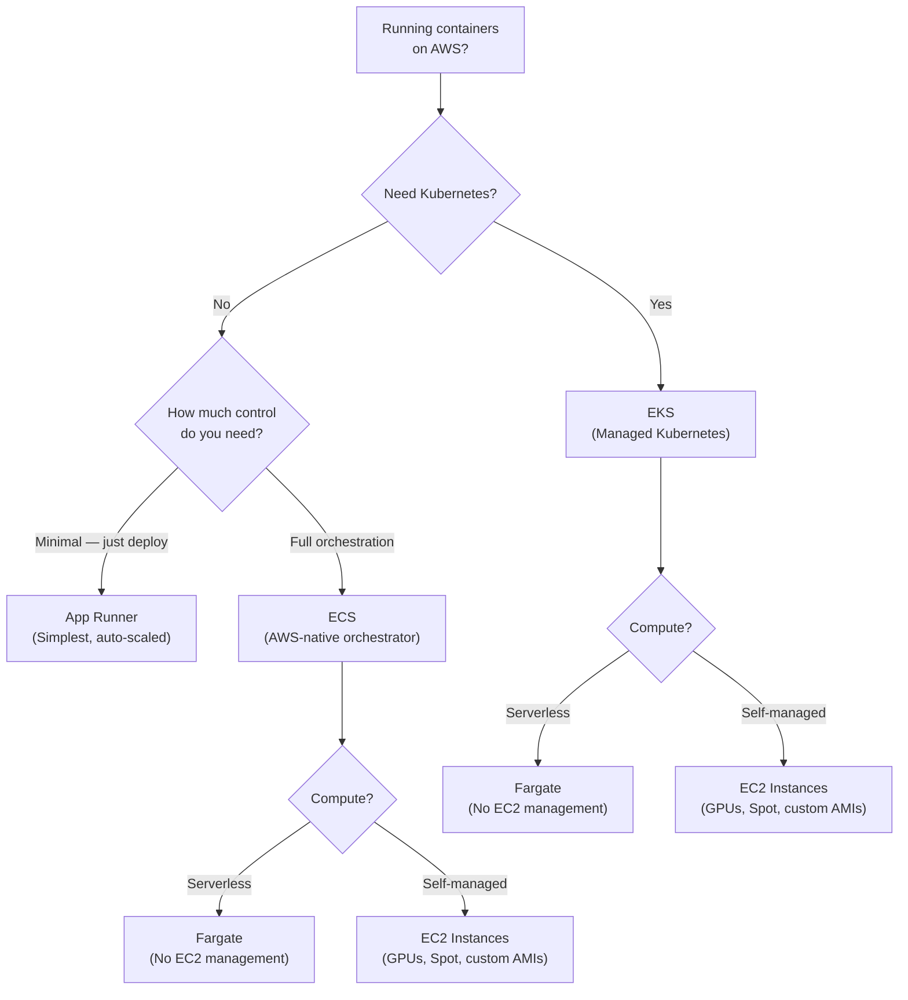
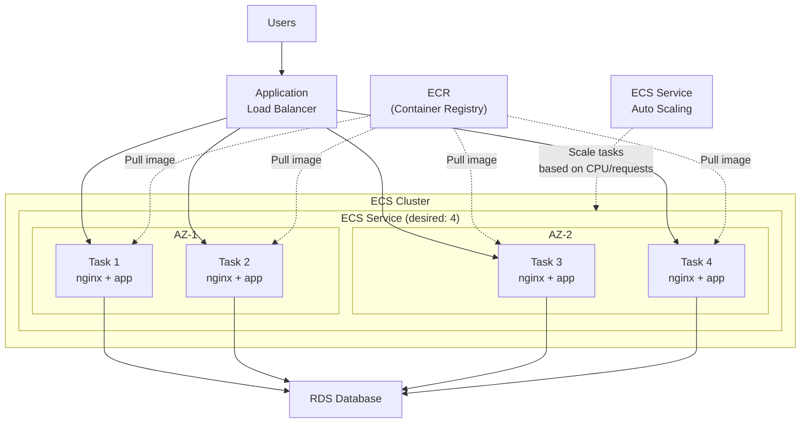
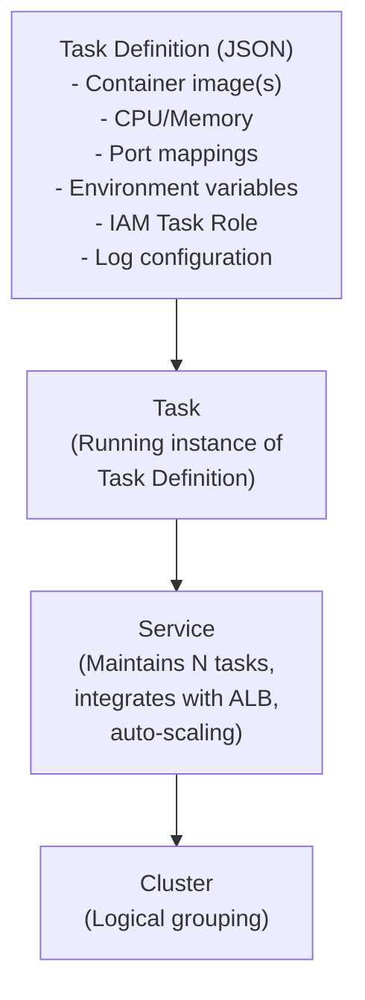
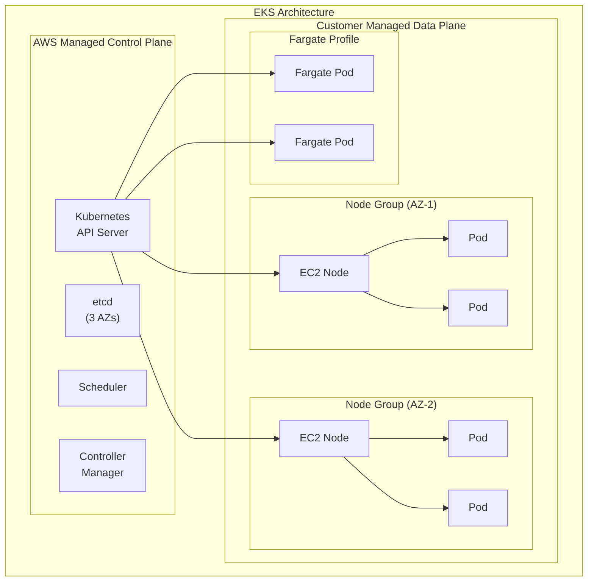
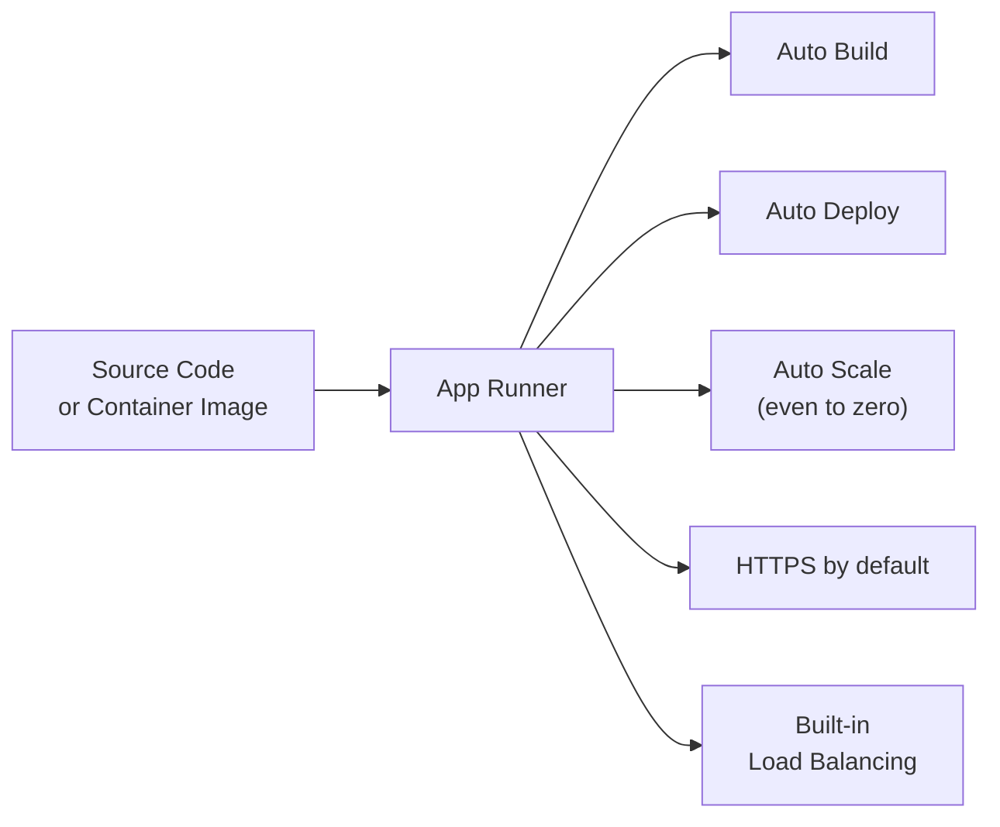

# Containers

## Overview

Containers package application code, dependencies, and configuration into a single portable unit. AWS offers **ECS (Elastic Container Service)** for running containers with AWS-native orchestration, **EKS (Elastic Kubernetes Service)** for Kubernetes, **Fargate** for serverless containers (no EC2 management), **ECR** for container image registry, and **App Runner** for the simplest container deployment experience.

## Key Concepts

| Concept | Description |
|---------|-------------|
| **Container** | Lightweight, portable runtime environment packaging app + dependencies |
| **Container Image** | Read-only template used to create containers (stored in ECR) |
| **Task / Pod** | Smallest deployable unit (ECS Task = Kubernetes Pod) |
| **Service** | Maintains a desired number of running tasks/pods with load balancing |
| **Cluster** | Logical grouping of container instances (EC2 or Fargate) |
| **Orchestrator** | Manages container lifecycle, scaling, networking (ECS or EKS) |

## Architecture Diagram

### Container Service Decision Tree

### Containerized Application on ECS

## Deep Dive

### Amazon ECS (Elastic Container Service)

AWS-native container orchestration — tightly integrated with IAM, ALB, CloudWatch, and other AWS services.

#### ECS Core Components

| Component | Description |
|-----------|-------------|
| **Task Definition** | Blueprint for tasks: images, CPU, memory, ports, IAM role, volumes |
| **Task** | Running instance of a task definition (one or more containers) |
| **Service** | Ensures desired number of tasks are running, integrates with ELB |
| **Cluster** | Logical grouping of tasks/services on EC2 instances or Fargate |

#### ECS Launch Types

| Feature | EC2 Launch Type | Fargate Launch Type |
|---------|----------------|-------------------|
| **You Manage** | EC2 instances, scaling, patching | Nothing (serverless) |
| **Pricing** | Pay for EC2 instances | Pay per vCPU + memory per second |
| **GPU Support** | Yes | No |
| **Spot Instances** | Yes | Yes (Fargate Spot) |
| **Custom AMI** | Yes | No |
| **EBS Volumes** | Yes | Ephemeral storage only (up to 200 GB) |
| **Best For** | Cost optimization, GPU, custom OS | Simplicity, variable workloads |

#### ECS Networking Modes

| Mode | Description | Use Case |
|------|-------------|----------|
| **awsvpc** | Each task gets its own ENI + private IP | **Default for Fargate**, recommended |
| **bridge** | Docker's default bridge networking | Legacy EC2 launch type |
| **host** | Task uses host's network namespace | Maximum network performance |
| **none** | No external network connectivity | Batch processing with no network |

### Amazon EKS (Elastic Kubernetes Service)

Managed Kubernetes — AWS runs the control plane (API server, etcd) across 3 AZs.

#### EKS Node Types

| Type | Description | Use Case |
|------|-------------|----------|
| **Managed Node Groups** | AWS manages EC2 instances, AMI updates, scaling | Default choice |
| **Self-Managed Nodes** | You manage EC2 instances entirely | Custom AMIs, GPUs, Windows |
| **Fargate** | Serverless pods, no nodes to manage | Variable workloads, isolation |
| **Karpenter** | Open-source node provisioning (faster than Cluster Autoscaler) | Cost optimization, mixed instances |

#### ECS vs EKS

| Factor | ECS | EKS |
|--------|-----|-----|
| **Complexity** | Simpler, AWS-native | Complex, Kubernetes expertise needed |
| **Ecosystem** | AWS services only | Vast K8s ecosystem (Helm, Istio, Argo) |
| **Portability** | AWS lock-in | Multi-cloud, on-prem (EKS Anywhere) |
| **Pricing** | No control plane cost | $0.10/hour per cluster (~$73/month) |
| **Best For** | AWS-only shops, simpler workloads | Multi-cloud, K8s expertise, complex microservices |

### AWS Fargate

Serverless compute for containers — no EC2 instances to manage. Works with both ECS and EKS.

| Feature | Detail |
|---------|--------|
| **Pricing** | Per vCPU + GB memory per second |
| **vCPU** | 0.25 to 16 vCPU |
| **Memory** | 0.5 GB to 120 GB |
| **Storage** | Ephemeral, up to 200 GB |
| **Fargate Spot** | Up to 70% discount, can be interrupted |
| **Startup** | Slower than EC2 (pull image each time) |

### Amazon ECR (Elastic Container Registry)

Managed Docker container registry integrated with ECS and EKS.

| Feature | Description |
|---------|-------------|
| **Private Repos** | Per-account, IAM-based access control |
| **Public Repos** | ECR Public Gallery for open-source images |
| **Image Scanning** | Automated vulnerability scanning (Basic or Enhanced with Inspector) |
| **Lifecycle Policies** | Auto-delete old/untagged images to save cost |
| **Cross-Region Replication** | Replicate images to other regions |
| **Immutable Tags** | Prevent image tag overwriting |

### AWS App Runner

Simplest way to deploy containers — provide source code or container image, App Runner handles everything.

| Feature | Detail |
|---------|--------|
| **Input** | Container image or source code (Python, Node.js, Java, Go) |
| **Scaling** | Automatic, including scale to zero |
| **Pricing** | Pay for compute + memory when processing requests |
| **Use Case** | Simple web apps and APIs, internal tools |

## Best Practices

1. **Use Fargate by default** unless you need GPU, custom AMI, or Spot EC2
2. **Use ECS for AWS-native shops**, EKS when you need Kubernetes portability
3. **One container = one process** — don't run multiple services in one container
4. **Use awsvpc networking mode** for ECS (each task gets its own ENI)
5. **Scan images in ECR** — enable automated vulnerability scanning
6. **Use IAM Task Roles** — never pass AWS credentials into containers
7. **Use ECR lifecycle policies** to clean up old images
8. **Set resource limits** (CPU + memory) on every task/pod
9. **Use Fargate Spot** for fault-tolerant workloads (70% savings)
10. **Use App Runner** when you want the simplest deployment experience

## Common Interview Questions

### Q1: When would you choose ECS vs EKS?

**A:** **ECS** when: your team is AWS-centric, you want simpler operations, no Kubernetes expertise, and deep AWS integration (no control plane cost). **EKS** when: you need multi-cloud portability, your team knows Kubernetes, you want the K8s ecosystem (Helm, Istio, ArgoCD, Prometheus), or you're running complex microservices architectures. Key difference: ECS is simpler and cheaper to operate; EKS gives you the full Kubernetes ecosystem but costs $73/month per cluster and requires K8s expertise.

### Q2: What is Fargate and when would you use it?

**A:** Fargate is serverless compute for containers — you define CPU and memory, Fargate handles the infrastructure. Use when: you don't want to manage EC2 instances, workloads are variable, or you want per-second billing. Avoid when: you need GPUs, custom AMIs, persistent local storage, or extreme cost optimization (EC2 Spot is cheaper). Fargate works with both ECS and EKS. Fargate Spot offers up to 70% discount for interruptible workloads.

### Q3: Explain ECS Task Definitions and how they relate to Tasks and Services.

**A:** A **Task Definition** is a JSON blueprint specifying: container images, CPU/memory, port mappings, IAM task role, log configuration, and volumes. A **Task** is a running instance of a Task Definition — it can contain 1+ containers that share network and storage. A **Service** maintains a desired count of tasks, integrates with ALB for load balancing, and enables auto-scaling. Think of it as: Task Definition = class, Task = object, Service = deployment.

### Q4: How do you handle secrets in containers?

**A:** Never embed secrets in images or environment variables. Use: (1) **AWS Secrets Manager** — ECS/EKS natively supports injecting secrets at task/pod launch via `valueFrom`. (2) **AWS Systems Manager Parameter Store** — for non-rotating config values. (3) **IAM Task Roles** (ECS) or **IRSA** (EKS) — instead of passing AWS credentials. (4) For EKS, also consider **External Secrets Operator** or **Secrets Store CSI Driver** for Kubernetes-native secrets management.

### Q5: What is the difference between EC2 and Fargate launch types?

**A:** With **EC2 launch type**, you manage the EC2 instances — choose instance types, handle patching, scaling, and capacity. You get full control: GPU support, custom AMIs, Spot pricing, and EBS volumes. With **Fargate**, AWS manages everything — you just specify CPU/memory per task. Fargate is simpler but more expensive per unit compute and has no GPU support. Common pattern: use Fargate for most services, EC2 for GPU/ML workloads or when optimizing with Spot.

### Q6: How does container networking work in ECS?

**A:** ECS supports 4 networking modes. **awsvpc** (recommended, required for Fargate): each task gets its own ENI with a private IP in your VPC — tasks are treated like EC2 instances for networking. **bridge**: Docker's default bridge, tasks share the host's network via port mapping. **host**: tasks use the host's network directly (one task per port). **none**: no network. Always use awsvpc for production — it enables Security Group per task and VPC integration.

### Q7: How does EKS handle IAM integration?

**A:** EKS uses **IAM Roles for Service Accounts (IRSA)** — a Kubernetes Service Account is annotated with an IAM Role ARN. When a pod runs with that Service Account, it gets temporary IAM credentials for the annotated role via OIDC federation. This provides fine-grained, pod-level IAM access (instead of node-level). It's the equivalent of ECS Task Roles. Always use IRSA instead of passing access keys or using node-level roles.

### Q8: What is Karpenter and how does it compare to Cluster Autoscaler?

**A:** Both auto-scale Kubernetes nodes. **Cluster Autoscaler** watches for pending pods and scales pre-defined node groups (limited instance types). **Karpenter** (open-source by AWS) provisions nodes directly — it evaluates pod requirements and launches the optimal instance type from the full EC2 catalog. Karpenter is faster (seconds vs minutes), more cost-efficient (better instance selection, Spot optimization), and simpler (no node groups to manage). It's the recommended choice for EKS.

### Q9: How do you secure container images?

**A:** (1) **Scan images** in ECR (Basic or Enhanced with Inspector) for CVEs. (2) Use **minimal base images** (distroless, Alpine) to reduce attack surface. (3) **Don't run as root** — set `USER` in Dockerfile. (4) Use **immutable tags** in ECR to prevent overwriting. (5) Sign images with **Sigstore/Cosign** or **Notation** for supply chain integrity. (6) Use **ECR lifecycle policies** to clean up old unpatched images. (7) Integrate scanning into CI/CD — fail builds on critical CVEs.

### Q10: How does auto-scaling work for ECS services?

**A:** ECS Service Auto Scaling uses **Application Auto Scaling** with three policy types: (1) **Target tracking** — maintain CPU/memory at target (e.g., 70% CPU). (2) **Step scaling** — add/remove tasks based on CloudWatch alarm thresholds. (3) **Scheduled** — scale at specific times. For EC2 launch type, you also need **Cluster Auto Scaling** (using a Capacity Provider) to add/remove EC2 instances as tasks demand more resources. Fargate handles compute scaling automatically.

## Latest Updates (2025-2026)

- **ECS Service Connect** provides a built-in service mesh capability for ECS services, enabling service-to-service communication with automatic traffic management, retries, health checks, and observability — without requiring a separate service mesh like App Mesh or Istio.
- **EKS Pod Identity** replaces IRSA (IAM Roles for Service Accounts) as the recommended way to grant AWS permissions to Kubernetes pods. It is simpler to configure (no OIDC provider setup), supports cross-account access natively, and reduces the number of IAM trust policy changes required.
- **EKS Auto Mode** is a fully managed EKS experience where AWS manages the data plane (nodes, scaling, upgrades, security patching) in addition to the control plane. You deploy workloads and EKS handles all infrastructure, similar to Fargate but with the full EKS feature set including GPU support.
- **Fargate Windows containers support** enables running Windows-based container workloads on Fargate, eliminating the need to manage Windows EC2 instances for .NET Framework and other Windows-dependent applications.
- **EKS Anywhere** allows you to run EKS-compatible Kubernetes clusters on your own on-premises infrastructure using VMware vSphere, bare metal, Nutanix, Apache CloudStack, or Snow devices.
- **Bottlerocket OS** is an AWS-built, purpose-built Linux OS for containers that provides improved security (read-only root filesystem, dm-verity, no shell or package manager by default), faster boot times, and atomic updates with automatic rollback.

### Q11: How does ECS Service Connect differ from App Mesh?

**A:** ECS Service Connect is a simpler, integrated service mesh built directly into ECS that requires no additional infrastructure. You enable it in the ECS service definition, and ECS automatically deploys and manages an Envoy sidecar proxy alongside your containers. It provides service discovery (via AWS Cloud Map), client-side load balancing, automatic retries, connection draining, health checks, and per-service traffic metrics in CloudWatch — all without writing proxy configuration. **App Mesh** is a more powerful, standalone service mesh that works across ECS, EKS, EC2, and Fargate with custom Envoy routing rules, traffic splitting, circuit breakers, mTLS, and cross-cluster service discovery. Choose Service Connect for ECS-only workloads that need straightforward service-to-service communication. Choose App Mesh when you need advanced traffic management across heterogeneous compute (ECS + EKS), cross-cluster routing, or fine-grained Envoy configuration.

### Q12: What is EKS Pod Identity and how does it improve on IRSA?

**A:** EKS Pod Identity is the next-generation mechanism for granting AWS IAM permissions to Kubernetes pods. With IRSA, you needed to: create an OIDC provider for each cluster, create IAM roles with trust policies referencing the OIDC provider ARN and namespace/service-account, and annotate Kubernetes service accounts with the role ARN. This was complex and required IAM changes per cluster. EKS Pod Identity simplifies this: you create an IAM role with a simple trust policy that trusts the `pods.eks.amazonaws.com` service principal, then create a Pod Identity Association that maps a Kubernetes service account to the IAM role — no OIDC provider needed. It supports cross-account access natively, works with IAM session tags for attribute-based access control, and supports role chaining. EKS Pod Identity is now the recommended approach; IRSA continues to work for existing clusters.

### Q13: What is EKS Auto Mode and when would you use it?

**A:** EKS Auto Mode is a fully managed EKS experience where AWS manages not just the control plane but also the data plane (compute nodes). AWS handles node provisioning, scaling, OS patching, security updates, and Kubernetes version upgrades automatically. Unlike Fargate (which runs individual pods in isolation), Auto Mode provisions and manages EC2 instances under the hood, supporting features that Fargate does not: GPU workloads, DaemonSets, HostNetwork, and local storage. Think of it as a middle ground between self-managed node groups and Fargate — you get the full EKS feature set without managing any infrastructure. Use Auto Mode when your team wants to focus entirely on deploying workloads and not managing Kubernetes infrastructure, but needs capabilities beyond what Fargate provides. For teams that want fine-grained control over instance types, AMIs, and node configurations, self-managed node groups or Karpenter remain appropriate.

### Q14: What are effective container security scanning strategies on AWS?

**A:** A comprehensive container security scanning strategy operates at multiple stages. **Build-time**: Integrate Amazon ECR image scanning into your CI/CD pipeline. ECR Enhanced Scanning (powered by Amazon Inspector) provides continuous, automatic vulnerability scanning using the CVE database and generates findings in Security Hub. Fail builds that contain critical or high-severity CVEs. **Registry**: Enable ECR immutable tags to prevent tag overwriting (e.g., someone pushing a compromised image with the same "latest" tag). Use ECR lifecycle policies to remove unpatched, old images. **Runtime**: Use Amazon GuardDuty for EKS runtime monitoring, which detects suspicious container behavior (crypto-mining, reverse shells, privilege escalation). For EKS, deploy open-source tools like Falco for runtime security monitoring. **Supply chain**: Use AWS Signer or Sigstore/Cosign to sign container images and enforce signature verification in admission controllers (Kyverno or OPA Gatekeeper) before pods are scheduled.

### Q15: What are sidecar and init container patterns and when do you use each?

**A:** **Init containers** run to completion before the main application container starts. Use them for setup tasks: pre-populating shared volumes with configuration data, waiting for a dependent service to be ready (database migration check), fetching secrets from Vault or Secrets Manager, and running database schema migrations. They run sequentially and the pod only starts when all init containers succeed. **Sidecar containers** run alongside the main container for the lifetime of the pod/task. Common uses include: Envoy proxy for service mesh traffic management, log collection agents (FluentBit shipping logs to CloudWatch or OpenSearch), monitoring agents (CloudWatch agent, Datadog agent), and TLS termination proxies. In ECS, sidecar containers are defined in the same task definition with `essential: false` so the task continues if the sidecar exits. In EKS, native sidecar containers (Kubernetes 1.28+) have explicit lifecycle ordering, ensuring sidecar containers start before and stop after the main container.

### Q16: What is EKS Anywhere and how does it fit into hybrid container strategies?

**A:** EKS Anywhere runs EKS-compatible Kubernetes clusters on your own infrastructure: VMware vSphere, bare metal servers, Nutanix, Apache CloudStack, or AWS Snow devices for edge. It uses the same Kubernetes distribution, tooling, and APIs as EKS in the cloud, enabling consistent operations across environments. Clusters are created and managed using the `eksctl anywhere` CLI, and you can optionally connect them to the AWS console via EKS Connector for centralized visibility. Use EKS Anywhere when: regulatory or data sovereignty requirements mandate on-premises compute, you need to run workloads at the edge with limited connectivity, or you want a consistent Kubernetes platform across cloud and on-premises. The EKS Anywhere Curated Packages provide vetted add-ons (Harbor registry, Emissary ingress, MetalLB, cert-manager). For teams that want full AWS management of on-premises Kubernetes, AWS Outposts with EKS provides a more managed experience but requires Outposts hardware.

### Q17: How do you choose between Istio, App Mesh, and Envoy Gateway for service mesh on EKS?

**A:** **AWS App Mesh** is the AWS-managed service mesh that uses Envoy proxies and integrates with AWS services (X-Ray, CloudWatch, ACM). It is simpler to operate than Istio and works across ECS + EKS, but has a narrower feature set and is tightly coupled to AWS. **Istio** is the most feature-rich open-source service mesh with advanced traffic management (fault injection, circuit breaking, traffic mirroring), security (mTLS, authorization policies), and observability (Kiali, Jaeger integration). It has a steeper learning curve and higher resource overhead but offers maximum flexibility and multi-cloud portability. **Envoy Gateway** is a newer, Kubernetes-native API gateway built on Envoy that implements the Kubernetes Gateway API, providing north-south traffic management with simpler configuration than Istio's full mesh. Choose App Mesh for AWS-centric teams wanting managed simplicity. Choose Istio for complex multi-cluster, multi-cloud mesh requirements. Choose Envoy Gateway when you primarily need ingress/API gateway functionality with the Kubernetes Gateway API.

### Q18: What are the best container logging strategies using FireLens and FluentBit?

**A:** **FireLens** is an ECS-native log router that uses FluentBit (or Fluentd) as a sidecar container to collect, filter, and route logs from your application containers to multiple destinations. In your ECS task definition, set `logDriver: "awsfirelens"` on application containers, and FireLens automatically configures FluentBit to receive their stdout/stderr. FluentBit can then route logs to CloudWatch Logs, S3, OpenSearch, Kinesis Data Firehose, Datadog, Splunk, or any Fluent-compatible destination simultaneously. Key advantages over the default `awslogs` driver: multi-destination routing (send to CloudWatch AND S3), log filtering and enrichment (add metadata, drop noisy logs), and custom parsing (extract structured fields from unstructured logs). For EKS, deploy FluentBit as a DaemonSet that tails log files from each node and ships them to your destinations. Use the aws-for-fluent-bit container image maintained by AWS. Always configure FluentBit's buffer and retry settings to handle destination outages without losing logs.

### Q19: How do you optimize EKS costs using Karpenter and Spot instances?

**A:** Karpenter is the most effective tool for EKS cost optimization because it provisions the right-sized node for pending pods from the entire EC2 catalog. Configure Karpenter NodePools with **Spot instances** as the preferred capacity type and On-Demand as fallback. Enable **consolidation** so Karpenter automatically replaces underutilized nodes with smaller ones or packs workloads more efficiently. Use **multiple instance families** (m5, m6i, m6g, c5, c6i, r5, etc.) to maximize Spot availability and avoid interruptions. Set `topologySpreadConstraints` on pods to distribute across AZs. For workloads that can run on ARM, include Graviton instance types (m6g, c6g, r6g) which are 20-40% cheaper. Implement pod disruption budgets (PDBs) to ensure graceful Spot interruption handling. Use AWS Node Termination Handler or Karpenter's native interruption handling to drain nodes before Spot reclamation. Monitor cost savings through Kubecost or AWS Cost Explorer with EKS cost allocation tags. A well-tuned Karpenter + Spot configuration can reduce compute costs by 60-80% compared to fixed On-Demand node groups.

### Q20: What are ECS Capacity Providers and how do they work?

**A:** Capacity Providers define the compute infrastructure that an ECS service or task uses and how it scales. There are two types: **Fargate Capacity Providers** (FARGATE and FARGATE_SPOT — built-in, no configuration needed) and **Auto Scaling Group (ASG) Capacity Providers** for EC2 launch type. For EC2, you associate an ASG with a Capacity Provider and configure **managed scaling** (target capacity percentage) and **managed termination protection** (prevents scaling in from terminating instances with running tasks). A **Capacity Provider Strategy** on the service specifies the mix: for example, base 2 tasks on FARGATE (guaranteed capacity) and weight 1 FARGATE_SPOT (cost optimization for additional tasks). For EC2, you can mix multiple ASG Capacity Providers to use different instance types. This replaces the old Cluster Auto Scaling approach and provides smoother, more intelligent scaling that respects task placement and draining. Capacity Providers are the recommended way to manage both Fargate and EC2 compute for ECS services.

### Q21: When should you use Bottlerocket vs Amazon Linux for container hosts?

**A:** **Bottlerocket** is AWS's purpose-built container OS designed with a minimal footprint and enhanced security. It has a read-only root filesystem, no SSH server or shell by default (access via SSM Session Manager's admin container), no package manager (reducing attack surface), and uses dm-verity for filesystem integrity verification. Updates are applied as atomic image-based updates with automatic rollback on failure, avoiding the configuration drift that plagues traditional OS patching. **Amazon Linux 2023** is a general-purpose Linux distribution that is more familiar, supports traditional package management (yum/dnf), SSH access, and custom software installation. Choose Bottlerocket for security-focused production container workloads where you want the smallest possible attack surface and reliable automated updates. Choose Amazon Linux when your containers require host-level customization, debugging tools, or when your team needs traditional Linux administration capabilities. Bottlerocket supports both ECS and EKS and is the recommended OS for security-conscious container deployments.

### Q22: How do you build multi-architecture container images for ARM (Graviton) and x86?

**A:** Graviton (ARM) instances offer 20-40% better price-performance than x86 for containerized workloads, but require ARM-compatible container images. Use **Docker Buildx** to create multi-architecture manifests that include both amd64 and arm64 images under a single tag. In your CI/CD pipeline: `docker buildx create --use` to create a builder, then `docker buildx build --platform linux/amd64,linux/arm64 -t myrepo/myapp:latest --push .` to build and push both architectures. ECR stores both variants under the same tag using a manifest list — when a Graviton node pulls the image, Docker automatically selects the arm64 variant. For cross-compilation, use `BUILDPLATFORM` and `TARGETPLATFORM` build args in your Dockerfile to optimize build speed (compile on native x86 builder, target arm64). In EKS, use Karpenter or node selectors with `kubernetes.io/arch` labels to schedule pods on the appropriate architecture. Test thoroughly on both architectures — some native dependencies or libraries may not be available on ARM.

## Deep Dive Notes

### ECS vs EKS Architecture Internals

**ECS Architecture**: ECS uses an agent-based model. The ECS Agent runs on each EC2 instance (for EC2 launch type) and communicates with the ECS control plane to receive task placement instructions, report task status, and manage container lifecycle. The control plane handles scheduling, service discovery, and integrates with ALB/NLB target group registration. Task definitions are ECS-native JSON documents. For Fargate, AWS manages the underlying infrastructure — each task runs in its own Firecracker microVM for isolation. ECS's scheduling is simpler: spread, binpack, or random strategies with constraint expressions.

**EKS Architecture**: EKS runs the Kubernetes control plane (API server, etcd, scheduler, controller manager) as a managed service across 3 AZs. The control plane is not visible in your account — you interact via the Kubernetes API. The data plane (worker nodes) runs in your account. The kubelet on each node communicates with the API server. EKS uses the VPC CNI plugin to assign VPC IP addresses directly to pods, making each pod a first-class VPC citizen. Scheduling uses the full Kubernetes scheduler with affinity, anti-affinity, taints, tolerations, and topology spread constraints. EKS supports the entire Kubernetes ecosystem: Helm charts, CRDs, operators, admission webhooks, and service meshes.

### Container Networking Deep Dive

**ECS awsvpc mode**: Each task gets its own Elastic Network Interface (ENI) with a private IP from the VPC subnet. This means tasks are addressable at the VPC level, can have their own Security Groups, and appear in VPC Flow Logs as individual entities. The limitation is ENI density — each EC2 instance type has a maximum number of ENIs (e.g., m5.large = 3 ENIs = 3 tasks). **ECS ENI trunking** increases this limit by using a trunk ENI with multiple branch ENIs, supporting more tasks per instance.

**EKS VPC CNI**: The Amazon VPC CNI plugin assigns VPC IP addresses to pods directly. Each node pre-allocates a pool of secondary IPs from the subnet, and pods receive IPs from this pool. This means pods can communicate with any VPC resource using native IP routing — no overlay network, no encapsulation overhead. The trade-off is IP address consumption: a cluster with 1000 pods needs 1000 VPC IPs. For large clusters, enable **prefix delegation** mode where the CNI assigns /28 prefixes (16 IPs per prefix) to nodes, dramatically increasing pod density. For clusters requiring more IPs than the VPC can provide, consider **custom networking** (pods use a different subnet/CIDR than nodes) or **Security Groups for Pods** (assign VPC Security Groups to individual pods).

### Container Security Layers

A production container security strategy operates at four layers. **Image Security**: Use minimal base images (distroless, Alpine, or Bottlerocket), scan with ECR Enhanced Scanning (Inspector), sign images with AWS Signer, enforce immutable tags. **Build Security**: Use multi-stage Dockerfile builds to exclude build tools from production images, run as non-root user (`USER` directive), never embed secrets in images. **Runtime Security**: Deploy GuardDuty for EKS/ECS runtime threat detection, use Falco or Sysdig for runtime anomaly detection, enforce read-only root filesystem, drop all Linux capabilities except those explicitly needed. **Network Security**: Use Kubernetes Network Policies (with Calico or VPC CNI network policy support) to restrict pod-to-pod traffic (default-deny with explicit allow rules), use Security Groups for Pods for VPC-level isolation, encrypt all service-to-service traffic with mTLS via service mesh. **Access Control**: Use EKS Pod Identity or IRSA for AWS permissions (never node-level IAM roles), implement RBAC for Kubernetes API access with least-privilege roles, use OPA Gatekeeper or Kyverno for policy enforcement (block privileged containers, require resource limits, enforce image registries).

### Production-Grade EKS Cluster Setup

A production EKS cluster requires careful configuration across multiple dimensions. **Networking**: Use private API server endpoint (disable public access), deploy nodes in private subnets, use VPC CNI with prefix delegation for IP efficiency, enable Security Groups for Pods for sensitive workloads. **Compute**: Use Karpenter for intelligent node provisioning with multiple instance families and Spot integration, set default resource requests and limits via LimitRange, deploy Karpenter NodePools per workload tier (system, general, GPU). **Security**: Enable EKS Pod Identity for AWS access, deploy OPA Gatekeeper for policy enforcement (no privileged containers, mandatory labels, approved registries), enable GuardDuty EKS Runtime Monitoring, encrypt etcd with a customer-managed KMS key, enable audit logging to CloudWatch. **Observability**: Deploy AWS Distro for OpenTelemetry (ADOT) for metrics, traces, and logs. Use Container Insights for CloudWatch dashboards. Deploy FluentBit DaemonSet for centralized logging. Enable Prometheus metrics with Amazon Managed Prometheus (AMP). **Reliability**: Spread pods across AZs with topology spread constraints, set pod disruption budgets on all critical services, use pod anti-affinity to avoid co-locating replicas, configure liveness and readiness probes on every container, enable cluster autoscaling via Karpenter. **GitOps**: Use ArgoCD or Flux for declarative deployment from Git, enabling audit trails, rollback, and multi-cluster consistency.

## Scenario-Based Questions

### S1: Your EKS cluster has 50 pods across 10 nodes. During deployment, some pods fail to schedule with "Insufficient CPU" errors even though nodes show 40% average CPU. What's wrong?

**A:** The issue is **resource requests vs actual usage**. Kubernetes schedules based on requested resources, not actual utilization. If pods request 500m CPU but use 200m, 40% of capacity is "reserved" but unused. (1) **Check requests vs limits** — `kubectl top pods` shows actual usage; compare with `kubectl describe pod` resource requests. (2) **Right-size requests** — reduce CPU requests to match p95 actual usage (e.g., 500m → 250m). (3) **Use VPA (Vertical Pod Autoscaler)** — automatically recommends and adjusts resource requests. (4) **Karpenter** — unlike Cluster Autoscaler, Karpenter provisions right-sized nodes based on pending pod requirements (not just node count). (5) **Compaction** — Karpenter's consolidation feature moves pods to fewer, right-sized nodes and terminates empty ones.

### S2: Your team debates ECS vs EKS for a new project. 5 microservices, no existing Kubernetes expertise. What do you recommend?

**A:** **ECS on Fargate**. Reasoning: (1) No K8s expertise = 3-6 month learning curve for EKS. ECS concepts (task definitions, services) are simpler. (2) Fargate = no node management, no AMI patching, no cluster autoscaling to tune. (3) 5 microservices is not complex enough to justify K8s. (4) ECS integrates natively with ALB, CloudWatch, IAM, and Secrets Manager — less "glue" needed. (5) If you outgrow ECS (need service mesh, custom operators, complex scheduling), migrating to EKS later is straightforward since containers are portable. Choose EKS when: team has K8s expertise, need multi-cloud portability, need K8s ecosystem tools (Istio, ArgoCD, Helm), or running 50+ services.

### S3: A container image deployed to ECS Fargate works locally but crashes immediately in production with "exec format error". What happened?

**A:** **Architecture mismatch** — the image was built for x86 (amd64) but Fargate is running on ARM (Graviton). Or vice versa. (1) Check task definition `runtimePlatform` — does it specify `LINUX/ARM64`? (2) Check how the image was built — if built on an M1/M2 Mac without `--platform linux/amd64`, it's ARM-only. (3) **Fix**: build multi-architecture images with `docker buildx build --platform linux/amd64,linux/arm64`. Push both to ECR. Fargate pulls the correct architecture automatically. (4) **Best practice**: always specify `--platform` in CI/CD builds. Use `docker manifest` to verify image architecture before deploying. (5) To use Graviton Fargate (20% cheaper), ensure all images support ARM64.

## Cheat Sheet

| Concept | Key Facts |
|---------|-----------|
| ECS | AWS-native, no control plane cost, simpler, tightly integrated |
| EKS | Managed K8s, $73/month per cluster, K8s ecosystem, portable |
| Fargate | Serverless containers, per-second billing, max 16 vCPU / 120 GB |
| Fargate Spot | Up to 70% discount, can be interrupted |
| ECR | Container registry, image scanning, lifecycle policies |
| Task Definition | Container blueprint: image, CPU, memory, ports, IAM role |
| Service | Maintains desired task count, ALB integration, auto-scaling |
| awsvpc | Recommended network mode, each task gets its own ENI |
| IRSA | IAM Roles for Service Accounts (EKS pod-level IAM) |
| Karpenter | Faster, smarter node provisioning vs Cluster Autoscaler |
| App Runner | Simplest deployment, auto-scale, code or image |

---

[← Previous: Serverless](../07-serverless/) | [Next: DevOps & Infrastructure →](../09-devops-and-infra/)
