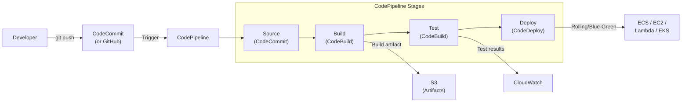
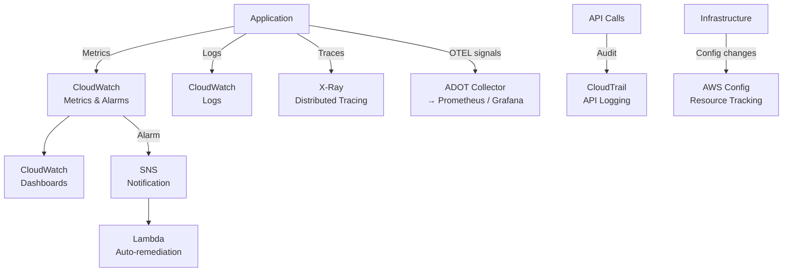
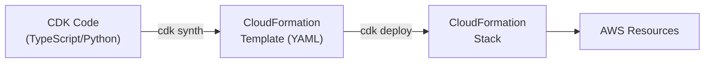
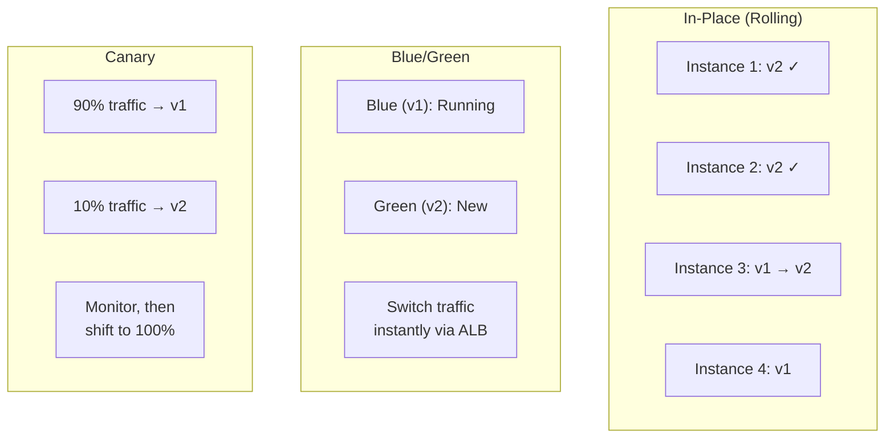
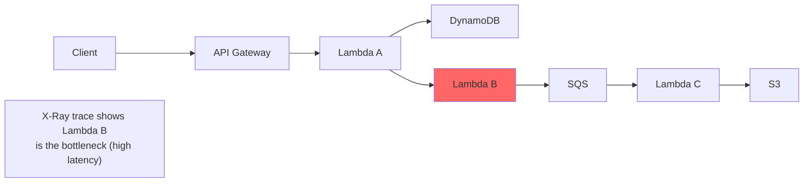
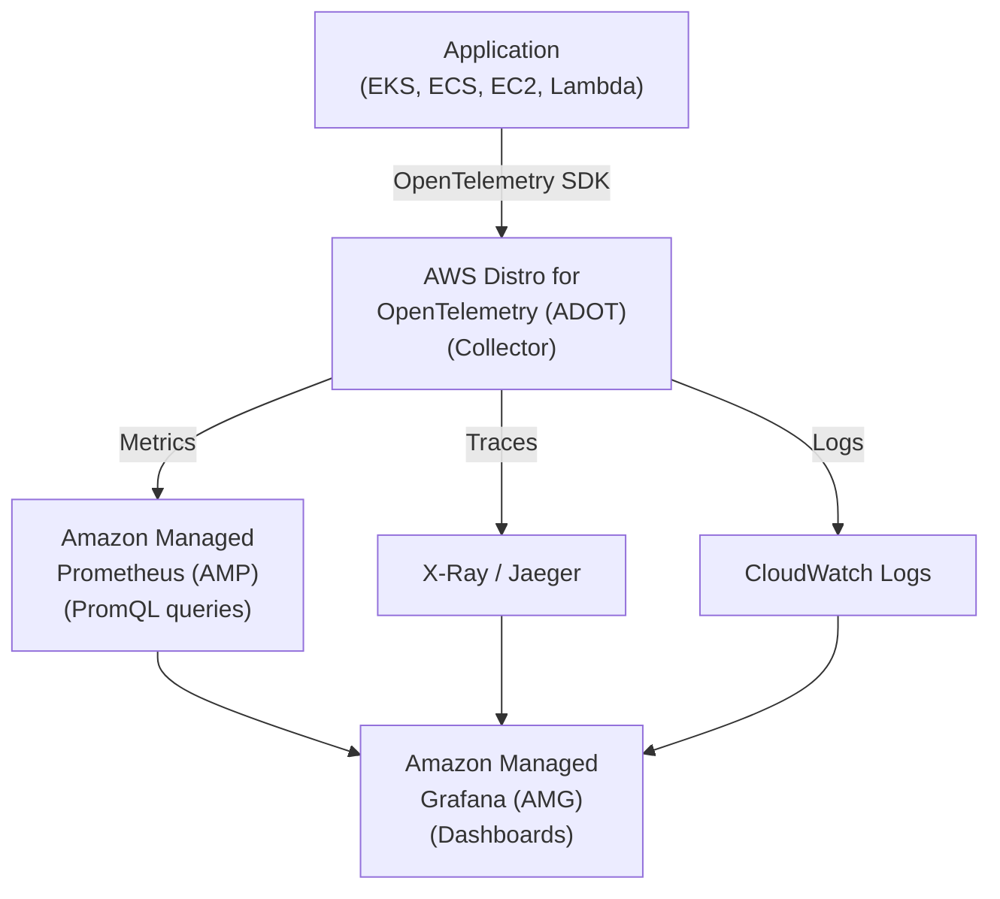
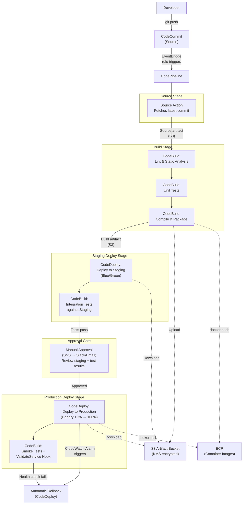

# DevOps & Infrastructure

## Overview

AWS provides a complete DevOps toolchain: **CloudFormation** and **CDK** for Infrastructure as Code, **CodePipeline/CodeBuild/CodeDeploy** for CI/CD, and **CloudWatch/X-Ray/CloudTrail** for monitoring, tracing, and auditing. Understanding IaC and CI/CD pipelines is essential — deployment strategies and observability are key skills to master.

## Key Concepts

| Concept | Description |
|---------|-------------|
| **Infrastructure as Code (IaC)** | Define infrastructure in template files, version-controlled and repeatable |
| **CI/CD** | Continuous Integration / Continuous Delivery — automate build, test, deploy |
| **Observability** | Metrics, logs, and traces to understand system behavior |
| **Deployment Strategy** | How new code rolls out (rolling, blue/green, canary) |

## Architecture Diagram

### CI/CD Pipeline on AWS



### Observability & Governance Stack



## Deep Dive

### AWS CloudFormation

Declarative IaC — define AWS resources in JSON/YAML templates. CloudFormation provisions and manages them as a **stack**.

#### Template Structure

```yaml
AWSTemplateFormatVersion: '2010-09-09'
Description: Example VPC with EC2

Parameters:
  EnvironmentType:
    Type: String
    AllowedValues: [dev, staging, prod]

Mappings:
  InstanceTypeMap:
    dev:
      InstanceType: t3.micro
    prod:
      InstanceType: m6i.large

Conditions:
  IsProd: !Equals [!Ref EnvironmentType, prod]

Resources:
  MyVPC:
    Type: AWS::EC2::VPC
    Properties:
      CidrBlock: 10.0.0.0/16

  MyEC2:
    Type: AWS::EC2::Instance
    Properties:
      InstanceType: !FindInMap [InstanceTypeMap, !Ref EnvironmentType, InstanceType]
      ImageId: ami-0abcdef1234567890

Outputs:
  VPCId:
    Value: !Ref MyVPC
    Export:
      Name: !Sub ${AWS::StackName}-VPCId
```

| Section | Purpose |
|---------|---------|
| **Parameters** | Input values at stack creation (instance type, environment) |
| **Mappings** | Static lookup tables (AMI per region, instance type per env) |
| **Conditions** | Conditional resource creation (create WAF only in prod) |
| **Resources** | AWS resources to create (required section) |
| **Outputs** | Values to export (VPC ID, ALB DNS) for cross-stack references |

#### Key Features

| Feature | Description |
|---------|-------------|
| **Change Sets** | Preview changes before applying |
| **Drift Detection** | Detect manual changes made outside CloudFormation |
| **StackSets** | Deploy stacks across multiple accounts and regions |
| **Nested Stacks** | Reusable template components |
| **Cross-Stack References** | Share outputs between stacks via Export/ImportValue |
| **Rollback** | Automatic rollback on failure |

### AWS CDK (Cloud Development Kit)

Define infrastructure using programming languages (TypeScript, Python, Java, Go, .NET). CDK synthesizes to CloudFormation templates.



| CDK Concept | Description |
|-------------|-------------|
| **App** | Root construct, contains one or more Stacks |
| **Stack** | Maps to a CloudFormation stack |
| **Construct** | Building block (L1 = raw CFN, L2 = opinionated defaults, L3 = patterns) |
| **L1 Constructs** | Direct 1:1 mapping to CloudFormation resources (CfnBucket) |
| **L2 Constructs** | Higher-level with sensible defaults (Bucket with encryption by default) |
| **L3 Constructs** | Multi-resource patterns (ApplicationLoadBalancedFargateService) |

### AWS CI/CD Services

| Service | Purpose |
|---------|---------|
| **CodeCommit** | Managed Git repos (being deprecated — use GitHub/GitLab) |
| **CodeBuild** | Managed build service (compile, test, produce artifacts) |
| **CodeDeploy** | Automated deployments to EC2, ECS, Lambda |
| **CodePipeline** | Orchestrates the full CI/CD workflow |
| **CodeArtifact** | Managed artifact repository (npm, Maven, pip, NuGet) |

#### Deployment Strategies



| Strategy | How It Works | Rollback | Use Case |
|----------|-------------|----------|----------|
| **All-at-once** | Deploy to all targets simultaneously | Redeploy old version | Dev/test |
| **Rolling** | Deploy in batches, one batch at a time | Redeploy | Most production apps |
| **Rolling with extra batch** | Add new instances before removing old | Redeploy | Maintain full capacity |
| **Blue/Green** | Stand up new environment, switch traffic | Switch back instantly | Zero-downtime, instant rollback |
| **Canary** | Route small % to new version, monitor, then shift | Route 100% back | High-risk changes |
| **Linear** | Shift traffic in equal increments over time | Route back | Gradual confidence building |

### Observability & Governance

Modern operations relies on **observability** — the ability to understand a system's internal state from its external outputs (metrics, logs, traces). Monitoring asks "is it broken?" Observability asks "why is it broken?" AWS provides a layered stack: **CloudWatch** for AWS-native metrics/logs, **X-Ray** for distributed tracing, **ADOT + Prometheus + Grafana** for vendor-neutral enterprise observability, and **CloudTrail + Config** for governance and audit.

#### Amazon CloudWatch

| Component | Description |
|-----------|-------------|
| **Metrics** | Numeric data points (CPUUtilization, RequestCount). Custom metrics supported |
| **Alarms** | Trigger actions when metrics cross thresholds (SNS, Auto Scaling, Lambda) |
| **Logs** | Centralized log collection from EC2, Lambda, ECS, etc. |
| **Log Insights** | SQL-like query language for CloudWatch Logs |
| **Dashboards** | Visual monitoring with widgets |
| **Contributor Insights** | Identify top contributors to operational issues |
| **Synthetics** | Canary scripts that simulate user behavior (synthetic monitoring) |
| **RUM** | Real User Monitoring for frontend performance |

**Key Metrics to Know:**

| Service | Important Metrics |
|---------|-----------------|
| EC2 | CPUUtilization, StatusCheckFailed, NetworkIn/Out (NOT memory — need custom agent) |
| ALB | RequestCount, TargetResponseTime, HTTPCode_Target_5XX, HealthyHostCount |
| RDS | CPUUtilization, FreeableMemory, ReadIOPS, DatabaseConnections |
| Lambda | Invocations, Duration, Errors, Throttles, ConcurrentExecutions |
| SQS | ApproximateNumberOfMessagesVisible, ApproximateAgeOfOldestMessage |

#### AWS X-Ray

Distributed tracing for microservices — visualize request flow across services.



| Concept | Description |
|---------|-------------|
| **Trace** | End-to-end request journey across services |
| **Segment** | Data from a single service (timing, metadata) |
| **Subsegment** | Detailed view within a segment (external HTTP call, DB query) |
| **Service Map** | Visual graph of services and their connections |
| **Sampling** | Control what % of requests are traced (reduce cost) |

#### Modern Observability Stack (ADOT, Prometheus, Grafana)

It's important to distinguish **monitoring** (CloudWatch) from **observability** (metrics + logs + traces with open standards). AWS provides managed, vendor-neutral observability tools:



| Service | What It Is | Why It Matters |
|---------|-----------|----------------|
| **AWS Distro for OpenTelemetry (ADOT)** | AWS-supported distribution of the OpenTelemetry collector. Collects metrics, traces, and logs using the open-source OTEL standard | Vendor-neutral — send telemetry to X-Ray, Prometheus, CloudWatch, or third-party tools (Datadog, Splunk) with the same SDK |
| **Amazon Managed Prometheus (AMP)** | Fully managed Prometheus-compatible monitoring. Ingest, store, and query metrics using PromQL | Standard for Kubernetes monitoring. No servers to manage, auto-scales, integrates with existing Prometheus exporters |
| **Amazon Managed Grafana (AMG)** | Fully managed Grafana for dashboards and alerting. Supports 30+ data sources | Unified dashboards across Prometheus, CloudWatch, X-Ray, and third-party sources. SSO via IAM Identity Center |

**When to use what:**
- **CloudWatch** = default for AWS-native monitoring (most services auto-publish metrics)
- **AMP + AMG** = Kubernetes-heavy environments, teams already using Prometheus/Grafana, need for PromQL
- **ADOT** = when you want vendor-neutral instrumentation (swap backends without changing app code)
- **X-Ray** = distributed tracing for serverless and microservices (can also receive OTEL traces via ADOT)

#### AWS CloudTrail

Records every API call in your AWS account — who did what, when, from where.

| Feature | Description |
|---------|-------------|
| **Management Events** | Control plane operations (CreateBucket, RunInstances) — enabled by default |
| **Data Events** | Data plane operations (S3 GetObject, Lambda Invoke) — not default, higher volume |
| **Insights Events** | Detect unusual API activity automatically |
| **Log Delivery** | S3 bucket, CloudWatch Logs, EventBridge |
| **Organization Trail** | Single trail for all accounts in AWS Organizations |

#### AWS Config

Tracks configuration changes to AWS resources over time. Records who changed what and when.

| Feature | Description |
|---------|-------------|
| **Config Rules** | Evaluate if resources comply with desired configuration |
| **Remediation** | Auto-fix non-compliant resources (via SSM Automation) |
| **Conformance Packs** | Collection of Config rules for a compliance framework |
| **Aggregator** | Multi-account, multi-region view |

### CloudWatch Advanced Features

#### CloudWatch Log Insights

A purpose-built query language for searching and analyzing CloudWatch Logs at scale.

```
# Find the 25 most expensive Lambda invocations
fields @timestamp, @duration, @billedDuration, @memorySize, @maxMemoryUsed
| filter @type = "REPORT"
| sort @billedDuration desc
| limit 25

# Count errors by status code in ALB access logs
fields @timestamp, elb_status_code
| filter elb_status_code >= 400
| stats count(*) as errorCount by elb_status_code
| sort errorCount desc
```

| Feature | Detail |
|---------|--------|
| **Query Language** | `fields`, `filter`, `stats`, `sort`, `limit`, `parse`, `display` |
| **Cross-Log-Group** | Query up to 50 log groups simultaneously |
| **Dashboard Integration** | Pin query results directly to CloudWatch Dashboards |

#### CloudWatch Synthetics (Canary Scripts)

| Feature | Detail |
|---------|--------|
| **Purpose** | Proactively monitor endpoints by simulating user behavior on a schedule |
| **Blueprints** | Heartbeat (URL check), API Canary, Broken Link Checker, Visual Monitoring, GUI Workflow |
| **Visual Monitoring** | Compares screenshots against a baseline to detect UI regressions |
| **Metrics** | SuccessPercent and Duration published to CloudWatch |
| **Schedule** | Run every 1-60 minutes |
| **VPC Support** | Canaries can run inside a VPC to monitor private endpoints |

#### Composite Alarms & Anomaly Detection

**Composite Alarms** combine multiple alarm states using boolean logic:

```
# Only page on-call when BOTH conditions are true
ALARM("High-5XX-Rate") AND ALARM("High-Latency-P99")

# Suppress alarms during deployments
ALARM("Error-Rate") AND NOT ALARM("Deployment-In-Progress")
```

**Metric Math** creates new metrics from existing ones:

```
# Error rate as percentage
METRICS("5xxCount") / METRICS("TotalRequests") * 100

# Anomaly detection band
ANOMALY_DETECTION_BAND(METRICS("CPUUtilization"), 2)
```

**Anomaly Detection** uses ML to establish an expected value band based on historical patterns (time of day, day of week, trends). Alarms fire when the metric falls outside the band -- no static threshold needed.

#### Cross-Account Observability

| Feature | Detail |
|---------|--------|
| **Monitoring Account** | Central account that views metrics/logs/traces from source accounts |
| **Setup** | OAM (Observability Access Manager) links source accounts to monitoring account |
| **Shared Data** | CloudWatch Metrics, Logs, X-Ray traces, Application Insights |
| **Use Case** | Central operations team monitors all workload accounts from one dashboard |

### AWS Config Advanced

#### Config Rules Deep Dive

| Rule Type | Description | Example |
|-----------|-------------|---------|
| **AWS Managed** | Pre-built rules (250+ available) | `s3-bucket-server-side-encryption-enabled`, `restricted-ssh` |
| **Custom (Lambda)** | Your Lambda evaluates compliance | "All EC2 instances must have CostCenter tag" |
| **Custom (Guard)** | CloudFormation Guard policy language | Declarative rules without Lambda overhead |
| **Proactive** | Evaluate resources BEFORE creation (CFN hooks) | Block non-compliant CloudFormation deployments |

#### Conformance Packs

Pre-packaged collections of Config rules + remediation actions mapped to compliance frameworks:

| Pack | Rules Included | Use Case |
|------|---------------|----------|
| **CIS AWS Foundations Benchmark** | ~45 rules | General security baseline |
| **PCI-DSS** | ~30 rules | Payment card compliance |
| **HIPAA** | ~50 rules | Healthcare data compliance |
| **NIST 800-53** | ~90 rules | Federal government compliance |
| **Custom** | Your rules | Organization-specific policies |

#### Config Aggregator (Multi-Account/Multi-Region)

| Feature | Detail |
|---------|--------|
| **Purpose** | Centralized compliance view across all accounts and regions |
| **Setup** | Create aggregator in central account, authorize source accounts (or use Organizations) |
| **Advanced Queries** | SQL-like queries across aggregated data (`SELECT ... WHERE ...`) |
| **Dashboard** | Compliance percentage per account, per region, per rule |

### Terraform vs CloudFormation vs CDK

| Feature | CloudFormation | CDK | Terraform |
|---------|---------------|-----|-----------|
| **Language** | YAML/JSON | TypeScript, Python, etc. | HCL |
| **Provider** | AWS only | AWS only (generates CFN) | Multi-cloud |
| **State** | Managed by AWS | Managed by AWS (CFN stack) | Self-managed (S3 + DynamoDB) |
| **Drift Detection** | Built-in | Via CloudFormation | `terraform plan` |
| **Learning Curve** | Medium | Low (if you know the language) | Medium |
| **Ecosystem** | AWS modules | Construct Hub | Terraform Registry |

## Best Practices

1. **Use IaC for everything** — never create resources manually in production
2. **Store IaC templates in Git** with code review before deployment
3. **Use CDK over raw CloudFormation** for better developer experience
4. **Implement CI/CD for infrastructure** — test templates before deploying
5. **Use blue/green deployments** for zero-downtime production deploys
6. **Enable CloudTrail in all regions** — it's your audit trail
7. **Set CloudWatch Alarms** on key metrics (5XX errors, latency, queue depth)
8. **Use X-Ray** for distributed tracing in microservice architectures
9. **Use AWS Config rules** to enforce compliance (encryption, public access)
10. **Don't store secrets in CodeBuild** — use Secrets Manager or Parameter Store

## Knowledge Check

### Q1: What is Infrastructure as Code and why is it important?

**A:** IaC defines infrastructure in version-controlled template files instead of manual console clicks. Benefits: (1) **Reproducibility** — create identical environments. (2) **Version control** — track changes, review, rollback. (3) **Automation** — CI/CD for infrastructure. (4) **Documentation** — the template IS the documentation. (5) **Speed** — provision environments in minutes. On AWS, CloudFormation (YAML) and CDK (TypeScript/Python) are the primary IaC tools. Terraform is the multi-cloud alternative.

### Q2: Explain blue/green vs canary deployments.

**A:** **Blue/Green**: Run two identical environments — Blue (current) and Green (new). After testing Green, switch all traffic instantly via ALB or Route 53. Rollback = switch back. Great for zero-downtime releases. **Canary**: Route a small percentage of traffic (e.g., 10%) to the new version while 90% stays on the old. Monitor error rates and latency. If healthy, gradually shift more traffic. Canary gives more confidence but takes longer. Use blue/green for standard releases; canary for high-risk changes.

### Q3: What is CloudFormation drift detection?

**A:** Drift occurs when someone modifies a resource outside CloudFormation (e.g., manually changing a Security Group rule in the console). Drift detection compares the actual resource configuration with the CloudFormation template and reports differences. Important: drift detection only detects — it doesn't fix. To fix, either update the template to match reality or re-deploy to override manual changes. Prevention: use SCPs to restrict console access to production.

### Q4: How do you monitor a production application on AWS?

**A:** (1) **CloudWatch Metrics** — CPU, memory (via agent), request count, error rates, latency. (2) **CloudWatch Alarms** — alert on thresholds (5XX > 1%, latency > 500ms). (3) **CloudWatch Logs** — centralized application and access logs with Log Insights for querying. (4) **X-Ray** — distributed tracing to find bottlenecks. (5) **CloudTrail** — audit who made changes. (6) **Dashboards** — operational and business KPI visibility. Proactive monitoring catches issues before users report them.

### Q5: What is AWS CDK and how does it relate to CloudFormation?

**A:** CDK lets you define infrastructure using programming languages (TypeScript, Python, Java, Go). CDK code **synthesizes** into CloudFormation templates and deploys via CloudFormation stacks. Advantages over raw CloudFormation: (1) Use loops, conditions, and functions from your language. (2) L2/L3 constructs provide sensible defaults (S3 bucket is encrypted by default). (3) Better IDE support (autocomplete, type checking). (4) Share constructs via Construct Hub. The underlying deployment mechanism is still CloudFormation.

### Q6: Explain CodePipeline stages and how they work together.

**A:** CodePipeline orchestrates CI/CD in stages: (1) **Source** — triggered by code push (CodeCommit, GitHub, S3). (2) **Build** — CodeBuild compiles code, runs unit tests, produces artifacts. (3) **Test** — integration/E2E tests (optional CodeBuild stage). (4) **Deploy** — CodeDeploy deploys to EC2/ECS/Lambda. Each stage has actions that must succeed before the next stage runs. You can add manual approval actions between stages (e.g., before production deployment).

### Q7: What is the difference between CloudWatch, CloudTrail, and AWS Config?

**A:** **CloudWatch** = performance monitoring (metrics, logs, alarms — "what is happening right now"). **CloudTrail** = API audit trail (who did what, when, from where — "who changed this"). **Config** = configuration tracking (what was the resource configuration at any point in time — "how did this resource change over time"). They're complementary: CloudWatch monitors health, CloudTrail provides accountability, Config tracks compliance.

### Q8: How do you manage secrets in CI/CD pipelines?

**A:** (1) **AWS Secrets Manager** — store database passwords, API keys, rotate automatically. CodeBuild can retrieve secrets at build time. (2) **Systems Manager Parameter Store** — simpler key-value store, SecureString type encrypts with KMS. (3) **CodeBuild environment variables** — reference Secrets Manager or Parameter Store ARNs (not plaintext). Never store secrets in: Git repos, Dockerfiles, buildspec.yml plaintext, or Lambda environment variables.

### Q9: What is X-Ray and how does it help debug microservices?

**A:** X-Ray provides distributed tracing — it tracks a request as it flows through multiple services (API Gateway → Lambda → DynamoDB → SQS → Lambda). The Service Map visualizes all services and their connections with latency/error data. When an issue occurs, you can see exactly which service is slow or failing, what SQL query or HTTP call is the bottleneck, and how long each segment took. Critical for debugging in microservice/serverless architectures where a single request touches many services.

### Q10: What are CloudFormation StackSets?

**A:** StackSets deploy CloudFormation stacks across multiple AWS accounts and regions in a single operation. Use cases: (1) Deploy guardrail Config rules to all accounts in an Organization. (2) Enable CloudTrail in every region of every account. (3) Create standardized networking (VPC) across all accounts. StackSets support automatic deployment to new accounts added to an OU. They can use self-managed permissions or service-managed (via AWS Organizations).

### Q11: What is the difference between monitoring and observability? How does AWS support both?

**A:** **Monitoring** = watching predefined metrics and alerting on thresholds ("CPU > 80% → alarm"). CloudWatch excels here. **Observability** = understanding *why* something is broken from external signals (metrics + logs + traces). AWS supports observability through: (1) **X-Ray** for distributed tracing. (2) **ADOT (AWS Distro for OpenTelemetry)** for vendor-neutral instrumentation — one SDK that sends telemetry to X-Ray, Prometheus, CloudWatch, or third-party tools. (3) **Amazon Managed Prometheus (AMP)** for PromQL-based metrics (standard in Kubernetes environments). (4) **Amazon Managed Grafana (AMG)** for unified dashboards across all data sources. For EKS-heavy environments, AMP + AMG + ADOT is the enterprise standard. For serverless, CloudWatch + X-Ray is sufficient.

## Latest Updates (2025-2026)

- **Amazon CodeCatalyst** — Unified DevOps service combining project management, CI/CD pipelines, code repositories, and dev environments in a single experience. Replaces the need to stitch together CodeCommit + CodeBuild + CodePipeline for many teams.
- **CDK for Terraform (CDKTF)** — Use CDK constructs to generate Terraform HCL instead of CloudFormation, enabling multi-cloud IaC with familiar programming languages.
- **CloudFormation Resource Import** — Import existing AWS resources into CloudFormation stacks without re-creating them. Useful for brownfield adoption of IaC.
- **CloudFormation Modules** — Package reusable resource configurations as modules published to the CloudFormation registry for organization-wide reuse.
- **CodeBuild Compute Modes** — New Lambda compute mode for CodeBuild provides faster cold starts and per-second billing for short builds alongside the traditional EC2 compute mode.
- **Application Signals** — CloudWatch Application Signals enables SLO monitoring for applications by automatically discovering services, operations, and dependencies and tracking SLIs like latency and availability.
- **CloudWatch Internet Monitor** — Monitors internet availability and performance between your users and AWS, providing visibility into internet issues impacting your application's reachability.
- **CloudWatch Log Anomaly Detection** — ML-powered anomaly detection for CloudWatch Logs that automatically surfaces unusual patterns without manual rule configuration.
- **CodePipeline V2** — Revamped pipeline type with support for Git tags as triggers, pipeline-level variables, and a new pricing model based on action executions rather than pipeline count.
- **AWS Proton** — Self-service platform for platform engineering teams to publish and manage infrastructure templates that developers consume without needing deep IaC expertise.

### Q12: What is Amazon CodeCatalyst and how does it differ from CodePipeline?

**A:** Amazon CodeCatalyst is a unified DevOps service that provides a complete software development lifecycle experience in a single tool — project management (issues, boards), source repositories, CI/CD workflows, and cloud development environments. CodePipeline, by contrast, is purely a CI/CD orchestration service that handles only the pipeline stages (source, build, test, deploy). CodeCatalyst is designed for teams that want an integrated experience without stitching together separate AWS services, while CodePipeline is better for teams that need fine-grained control over individual pipeline components or are already invested in the separate CodeBuild/CodeDeploy ecosystem. CodeCatalyst also supports blueprints that generate project scaffolding for common application types, making it particularly useful for greenfield projects.

### Q13: How would you implement infrastructure testing strategies on AWS?

**A:** A robust infrastructure testing strategy operates at multiple levels. First, use **static analysis** with tools like `cfn-lint` for CloudFormation templates or `cdk-nag` for CDK code to catch misconfigurations before deployment. Second, use **CDK assertions** in unit tests to validate that synthesized templates contain expected resources, properties, and outputs — for example, verifying that an S3 bucket has encryption enabled. Third, apply **policy-as-code** using Open Policy Agent (OPA) or AWS CloudFormation Guard to enforce organizational policies (e.g., all RDS instances must be encrypted, no public S3 buckets). Fourth, run **integration tests** by deploying to an ephemeral environment and validating real resource behavior. Fifth, use **contract tests** to verify cross-stack references and outputs. This layered approach catches issues progressively, from fast static checks to slower but more thorough integration validation.

### Q14: Explain GitOps on EKS — how would you implement it with ArgoCD or Flux?

**A:** GitOps is a deployment paradigm where a Git repository is the single source of truth for declarative infrastructure and application state. On EKS, you install a GitOps operator (ArgoCD or Flux) inside the cluster that continuously reconciles the cluster state with the desired state in Git. When a developer merges a change to the manifest repository, the operator detects the drift and automatically applies the update. ArgoCD provides a rich UI for visualizing sync status and application health, while Flux is more lightweight and composable with its toolkit approach (source controller, kustomize controller, helm controller). Both support multi-cluster management, Helm charts, and Kustomize overlays. The key advantage over push-based CI/CD is that the cluster self-heals — if someone manually modifies a resource, the operator reverts it to match Git. This also provides a clear audit trail since every change flows through Git pull requests.

### Q15: How do you use AWS AppConfig feature flags for progressive deployments?

**A:** AWS AppConfig (part of Systems Manager) provides feature flags and dynamic configuration that can be deployed independently of code deployments. You define a configuration profile with feature flag values, create a deployment strategy (e.g., linear 20% every 10 minutes), and AppConfig gradually rolls out the configuration change while monitoring CloudWatch alarms. If alarms trigger, AppConfig automatically rolls back the configuration. This decouples feature releases from code deployments — you deploy code with the feature behind a flag, then enable it progressively via AppConfig. AppConfig supports validators (JSON Schema or Lambda function) to ensure configurations are valid before deployment. It integrates with Lambda extensions and SDK caching for low-latency flag evaluation, so your application does not need to call the API on every request.

### Q16: How do you implement canary deployments on ECS using CodeDeploy?

**A:** ECS with CodeDeploy supports canary and linear deployments using blue/green deployment with weighted target groups. You configure an ECS service with a CodeDeploy deployment controller (instead of the default rolling update). CodeDeploy creates a new task set (green) alongside the existing one (blue) behind the same ALB. You define a deployment configuration like `ECSCanary10Percent5Minutes`, which routes 10% of traffic to the new task set for 5 minutes before shifting the remaining 90%. During the canary window, CodeDeploy monitors CloudWatch alarms you specify (5XX errors, latency, custom business metrics). If any alarm triggers, CodeDeploy automatically rolls back by shifting all traffic back to the original task set. You can also configure lifecycle hooks for pre-traffic and post-traffic validation Lambda functions that run automated tests against the new version before and after traffic shifting.

### Q17: What are the rollback strategies for CloudFormation, and how do you handle failed stacks?

**A:** CloudFormation provides several rollback mechanisms. By default, if a stack creation fails, CloudFormation rolls back all resources (automatic rollback). For stack updates, you can use **Change Sets** to preview changes before applying them. If an update fails, CloudFormation rolls back to the previous known good state. You can disable automatic rollback to debug failures by setting `--disable-rollback`. For more control, use **stack policies** to prevent accidental updates to critical resources (e.g., protect the production database from replacement). **Continue Update Rollback** resolves stuck stacks by skipping resources that cannot be restored. For sophisticated rollback scenarios, consider maintaining previous template versions in S3 and using automation (Lambda or Step Functions) to redeploy the last known good template. Stack-level notifications via SNS let you trigger automated remediation when failures occur.

### Q18: Explain the three pillars of observability and how AWS implements each.

**A:** The three pillars are **metrics**, **logs**, and **traces**. **Metrics** are numeric time-series data that quantify system behavior — CloudWatch Metrics captures these from all AWS services, and custom metrics extend this with business KPIs. CloudWatch Alarms trigger automated actions when thresholds are breached. **Logs** are timestamped records of discrete events — CloudWatch Logs centralizes application, access, and system logs with Log Insights providing a SQL-like query language for analysis. **Traces** follow a single request as it traverses multiple services — X-Ray provides distributed tracing with service maps that visualize dependencies and latency bottlenecks. Modern observability goes beyond these three pillars by adding **profiling** (CodeGuru Profiler for runtime performance), **real user monitoring** (CloudWatch RUM for frontend), and **synthetic monitoring** (CloudWatch Synthetics for proactive testing). The key insight is that these signals are most powerful when correlated — CloudWatch now supports cross-signal correlation where you can jump from an alarm to related logs to the specific trace that caused the issue.

### Q19: How do you define and monitor SLOs, SLIs, and SLAs on AWS?

**A:** **SLAs** are contractual commitments to customers (e.g., 99.9% monthly uptime). **SLOs** are internal targets stricter than SLAs, providing a buffer (e.g., 99.95% availability target). **SLIs** are the actual measurements that feed SLOs (e.g., percentage of HTTP requests returning 2xx within 500ms). On AWS, **CloudWatch Application Signals** now automates SLO monitoring by discovering your services and tracking SLIs for latency and availability. You define SLO targets, and Application Signals calculates error budgets — the amount of unreliability you can tolerate before breaching the SLO. When the error budget burns too fast, it triggers alarms. For custom SLOs, you create CloudWatch metrics for your SLIs, use metric math to calculate compliance percentages, and set alarms on burn rates. The error budget model is critical for balancing reliability and feature velocity — when the error budget is healthy, teams can deploy faster; when it is low, teams focus on stability.

### Q20: How does AWS Systems Manager Incident Manager work for incident response?

**A:** Incident Manager provides a structured incident response workflow. You define **response plans** that specify escalation paths, engagement contacts, runbooks, and chat channels. When a CloudWatch alarm or EventBridge event triggers an incident, Incident Manager automatically pages the on-call engineer (via SMS, phone, or email), creates an OpsItem for tracking, opens a chat channel, and starts the associated SSM Automation runbook for automated remediation. During the incident, the service tracks a timeline of actions and provides a post-incident analysis template for blameless retrospectives. It integrates with PagerDuty and ServiceNow for organizations already using those tools. The key value is reducing mean time to resolution (MTTR) by automating the manual coordination steps that typically slow down incident response.

### Q21: What are CloudWatch Synthetics canaries and how do you use them?

**A:** CloudWatch Synthetics canaries are configurable scripts (written in Node.js or Python) that run on a schedule to monitor your application endpoints and workflows. They simulate user actions — loading a page, following a multi-step workflow, checking an API response — and capture screenshots, HAR files, and response metrics. You can create canaries from blueprints (heartbeat monitor, API canary, visual monitor, broken link checker) or write custom scripts. Canaries run in Lambda behind the scenes and report availability and latency metrics to CloudWatch, where you can set alarms. Visual monitoring canaries compare screenshots against a baseline to detect UI regressions. The primary use case is proactive monitoring — detecting that your login flow is broken before customers report it. They complement real user monitoring (RUM) by providing consistent synthetic baselines that are not affected by user variability.

### Q22: Explain the immutable infrastructure pattern and how to implement it on AWS.

**A:** Immutable infrastructure means you never patch or modify running servers. Instead, you build a new AMI or container image with changes, deploy it alongside the existing infrastructure, shift traffic, and terminate the old instances. On AWS, implement this pattern with a pipeline: CodeBuild creates a golden AMI using EC2 Image Builder (or builds a Docker image pushed to ECR), the AMI/image is tested in a staging environment, then CodeDeploy or an ASG update replaces instances using a blue/green strategy. For EC2, use launch templates referencing the new AMI and perform a rolling replacement of the ASG. For containers, push the new image to ECR and update the ECS task definition or EKS deployment. The benefits are significant: eliminates configuration drift (every instance is identical), simplifies rollback (revert to the previous AMI/image), improves security (no SSH access needed, no in-place patching), and enables reliable horizontal scaling since every new instance starts from the same known-good image. This pattern pairs naturally with GitOps and infrastructure as code.

### Q23: Explain AWS CloudTrail in depth — what does it log, and how does it differ from CloudWatch?

**A:** AWS CloudTrail is the audit backbone of your AWS account. It records every API call — who made the call, from what IP address, when, and what the request/response looked like. CloudTrail captures three categories of events: (1) **Management events** (control plane) are enabled by default and log operations like `CreateBucket`, `RunInstances`, `AttachRolePolicy` — anything that creates, modifies, or deletes AWS resources or configures account settings. (2) **Data events** (data plane) log high-volume resource-level operations such as `S3:GetObject`, `S3:PutObject`, `Lambda:Invoke`, and DynamoDB item-level activity. These are not enabled by default because of their volume and cost. (3) **Insight events** use machine learning to detect unusual API activity patterns, like a sudden spike in `TerminateInstances` calls or unexpected `AuthorizeSecurityGroupIngress` bursts, and generate findings. For multi-account governance, an **organization trail** created from the management account automatically applies to every account in the organization — every API call across all member accounts lands in a single S3 bucket. CloudTrail supports **log file integrity validation** using SHA-256 hashing and digital signing, allowing you to verify that log files have not been tampered with after delivery. **CloudTrail Lake** is a managed data lake that lets you run SQL-based queries directly on your CloudTrail events without needing Athena or a separate analytics pipeline — ideal for security investigations. For integration, CloudTrail delivers logs to S3 for long-term archival, streams to CloudWatch Logs for real-time metric filters and alarms (e.g., alarm on root user login), and publishes to EventBridge for event-driven automation (e.g., trigger a Lambda to revert unauthorized Security Group changes). The key distinction from CloudWatch: CloudWatch answers "how is my system performing?" (metrics, logs, alarms), while CloudTrail answers "who did what in my account?" (API audit trail). CloudWatch is operational monitoring; CloudTrail is security auditing and compliance.

### Q24: What is AWS Config, and how does it differ from CloudTrail?

**A:** AWS Config continuously records the configuration state of your AWS resources over time and evaluates them against desired-state rules. It answers the question "what does my resource look like right now, and has it ever been non-compliant?" Config has two core functions: **configuration recording** captures every resource's configuration as a configuration item (CI) whenever it changes — for example, recording that a Security Group was modified to allow 0.0.0.0/0 on port 22, including who changed it and the before/after state. **Compliance evaluation** uses Config Rules to assess whether resources meet your policies. Config Rules come in two types: **AWS managed rules** are pre-built and cover common scenarios like `s3-bucket-server-side-encryption-enabled`, `restricted-ssh`, `rds-instance-public-access-check`, and `encrypted-volumes`. **Custom rules** are backed by Lambda functions you write, enabling bespoke policies like "all EC2 instances must have a CostCenter tag" or "all Lambda functions must use a VPC." **Conformance packs** bundle multiple Config Rules into a single deployable unit mapped to a compliance framework (PCI-DSS, HIPAA, CIS Benchmarks). When Config detects a non-compliant resource, it can trigger **remediation actions** — either **manual** (notify via SNS for human review) or **automatic** (invoke an SSM Automation document to fix the issue, such as automatically enabling encryption on an unencrypted S3 bucket or revoking an overly permissive Security Group rule). **Aggregators** provide a multi-account, multi-region compliance dashboard by collecting Config data from all accounts in an organization into a single aggregator account. The critical distinction between Config and CloudTrail: CloudTrail records **API activity** (who called `DeleteBucket` at 3:42pm), while Config records **resource configuration state** (at 3:42pm, this bucket's configuration changed from X to Y, and it is now non-compliant with rule Z). CloudTrail is the forensic audit log; Config is the continuous compliance engine. They are complementary — CloudTrail tells you who made a change, Config tells you what the change meant for your resource state and compliance posture.

### Q25: When would you use CloudFormation nested stacks vs cross-stack references vs stack sets?

**A:** These three CloudFormation patterns solve different organizational problems. **Nested stacks** embed one stack template inside another using `AWS::CloudFormation::Stack`. Use them for **component reuse** — for example, a standard VPC template nested inside every application stack, or a common ALB+Target Group template reused across services. The parent stack manages the lifecycle of all nested stacks as a single unit, so they are created, updated, and deleted together. The trade-off is that nested stacks are tightly coupled to the parent. **Cross-stack references** use `Outputs` with `Export` in one stack and `Fn::ImportValue` in another to share values between independent stacks. Use them when stacks have **different lifecycles** — for example, a networking team manages the VPC stack and exports the VPC ID and subnet IDs, while application teams import those values into their own stacks. The stacks are independently deployable, but the exported value cannot be changed or deleted while another stack references it, which can create update constraints. **Stack sets** deploy stacks across **multiple AWS accounts and regions** in a single operation. Use them for organizational governance — deploying Config Rules, CloudTrail, GuardDuty enablement, or IAM baseline roles across every account in an AWS Organization. Stack sets with Organizations integration support automatic deployment to new accounts added to an OU. Stack sets also support **concurrent deployment** across regions and **failure tolerance** settings. Additionally, **drift detection** works across all three patterns — you can detect drift on nested stacks, individual stacks using cross-stack references, and stacks deployed by stack sets to identify manual changes. The decision framework: same lifecycle and component reuse = nested stacks, different lifecycles and value sharing = cross-stack references, multi-account/region governance = stack sets.

### Q26: Explain cfn-init, CreationPolicy, and DependsOn in CloudFormation.

**A:** These CloudFormation features provide fine-grained control over resource provisioning and ordering. **cfn-init** is a helper script that runs on EC2 instances to perform configuration tasks defined in the `AWS::CloudFormation::Init` metadata section of the template. Unlike User Data (which is a raw bash script that runs once at launch), cfn-init is **declarative and idempotent** — you define packages to install, files to create, services to enable, and commands to run, and cfn-init ensures the desired state is achieved. cfn-init supports config sets for ordering multiple configuration blocks. **cfn-signal** and **CreationPolicy** work together to tell CloudFormation whether an instance initialized successfully. Without CreationPolicy, CloudFormation marks an EC2 instance as CREATE_COMPLETE as soon as it launches, even if the application is still installing. With a CreationPolicy, CloudFormation waits for a success signal from cfn-signal (up to a configurable timeout) before marking the resource as complete. If the signal is not received, CloudFormation rolls back. This prevents deployments where instances are "running" but the application failed to start. **cfn-hup** is a daemon that detects changes to the CloudFormation metadata and re-runs cfn-init when the template is updated — enabling in-place configuration updates without replacing the instance. **DependsOn** declares explicit ordering between resources. CloudFormation usually infers dependencies automatically from `Ref` and `GetAtt`, but DependsOn is needed when there is an implicit dependency CloudFormation cannot detect — for example, an application on EC2 that needs a NAT Gateway to be ready before it can download packages, but there is no direct reference between the two resources. **Deletion policies** control what happens when a resource is removed from a stack: `Delete` (default — remove the resource), `Retain` (keep the resource but remove it from CloudFormation management), and `Snapshot` (take a final snapshot before deletion — supported for RDS, EBS, and similar resources). Finally, **stack roles** enforce least privilege by specifying an IAM role that CloudFormation assumes to create resources, rather than using the deployer's permissions — this allows developers to deploy stacks without giving them direct permissions to create IAM roles or other sensitive resources.

### Q27: What are CloudFormation custom resources and when would you use them?

**A:** Custom resources extend CloudFormation beyond its native resource types by invoking your own logic during stack create, update, and delete operations. You use them when CloudFormation does not natively support a resource (e.g., a third-party SaaS configuration), when you need to call an external API during provisioning, or when you need to perform a data lookup at deployment time. **Lambda-backed custom resources** (`Custom::MyResource` or `AWS::CloudFormation::CustomResource` with `ServiceToken` pointing to a Lambda ARN) are the most common pattern. CloudFormation sends a JSON event to the Lambda containing the request type (Create, Update, Delete), the resource properties, and a pre-signed S3 URL for the response. The Lambda performs its work and sends a response to the pre-signed URL with a status of `SUCCESS` or `FAILED`, along with optional output data. The **cfn-response module** (available in the Python and Node.js Lambda runtimes) simplifies sending this response. **SNS-backed custom resources** use an SNS topic as the ServiceToken, allowing custom resource logic to live outside Lambda (e.g., an on-premises system subscribing to the topic). Common use cases include: (1) **AMI lookup** — a custom resource that queries the latest Amazon Linux AMI ID at deploy time, ensuring the template always uses the current AMI without hardcoding. (2) **ACM certificate validation** — creating Route 53 DNS records for ACM certificate domain validation during stack creation. (3) **Cleanup tasks** — emptying an S3 bucket on stack deletion (CloudFormation cannot delete a non-empty bucket). (4) **External API calls** — registering a service in a third-party service mesh or DNS provider. (5) **Cross-account operations** — performing actions in another AWS account during stack provisioning. A critical implementation detail: the Lambda must always send a response to the pre-signed URL, even on failure. If the Lambda crashes without responding, CloudFormation waits for the timeout (up to 1 hour) before failing the stack, which can leave stacks stuck in `CREATE_IN_PROGRESS`. Always wrap Lambda logic in a try/catch that sends a FAILED response on error.

### Q28: Explain AWS CodeBuild in detail — how is a build project structured?

**A:** AWS CodeBuild is a fully managed build service that compiles source code, runs tests, and produces deployable artifacts. There are no build servers to manage — CodeBuild spins up a fresh container for every build and tears it down when finished. The build is defined in a **buildspec.yml** file at the root of your source repository. The buildspec has four phases: (1) **install** — install build dependencies, runtime versions (e.g., `runtime-versions: java: corretto17`), and tools. (2) **pre_build** — commands that run before the build, such as logging into ECR (`docker login`), fetching parameters from SSM, or running linting. (3) **build** — the core build commands (compile, `docker build`, `npm run build`). (4) **post_build** — commands that run after the build, such as pushing a Docker image to ECR, generating reports, or notifying Slack. Each phase can define `on-failure: ABORT` or `CONTINUE`. The buildspec also defines **artifacts** (files to upload to S3 or pass to CodePipeline), **cache** (paths to cache between builds for faster subsequent runs), and **reports** (test and coverage report groups). Build environments use either **curated images** (AWS-managed images for common runtimes like Amazon Linux with Java, Python, Node.js, Go, .NET) or **custom Docker images** from ECR or Docker Hub. CodeBuild supports two caching strategies: **S3 caching** persists dependencies across builds (e.g., Maven `.m2` directory or `node_modules`), and **local caching** keeps files on the build host between builds in the same fleet (fastest but only available with reserved capacity). For builds that need to access private resources like RDS or ElastiCache, CodeBuild supports **VPC access** — the build container runs within your VPC with a specified security group and subnet, enabling it to reach private endpoints. CodeBuild integrates tightly with CodePipeline as a build or test action, but it can also run standalone builds triggered by webhooks from GitHub or CodeCommit.

### Q29: How does AWS CodeDeploy work, and what is the AppSpec file?

**A:** AWS CodeDeploy automates application deployments to EC2 instances, on-premises servers, ECS services, and Lambda functions. It supports two primary deployment types for EC2: **in-place deployment** updates the application on existing instances (stopping the app, deploying new code, restarting), and **blue/green deployment** provisions a new set of instances, deploys to them, shifts traffic via an ALB, and terminates the old instances. A **deployment group** defines the target instances (identified by tags or an Auto Scaling Group), the deployment configuration, the load balancer, and rollback settings. The **AppSpec file** (appspec.yml for EC2/on-premises, appspec.yaml for ECS/Lambda) defines what to deploy and which lifecycle hooks to run. For EC2 deployments, the AppSpec specifies files to copy, permissions to set, and hooks. The hooks execute in order: **BeforeInstall** (pre-deployment tasks like decrypting files or creating backups), **AfterInstall** (post-copy configuration like setting file permissions or running database migrations), **ApplicationStart** (start the application and its services), and **ValidateService** (verify the deployment was successful by running health checks). Additional hooks include `ApplicationStop`, `BeforeBlockTraffic`, and `AfterAllowTraffic`. **Deployment configurations** control the rollout speed: `OneAtATime` (safest, one instance at a time), `HalfAtATime` (50% at once), `AllAtOnce` (fastest, all instances simultaneously), or custom configurations specifying an exact minimum healthy percentage. CodeDeploy supports **automatic rollback** if deployment fails or if a specified CloudWatch alarm triggers during deployment. For **Lambda deployments**, CodeDeploy manages traffic shifting between Lambda function versions using aliases — supporting canary (10% then 100%), linear (equal increments), and all-at-once configurations. For **ECS deployments**, CodeDeploy performs blue/green deployments by creating a new task set, shifting traffic via ALB listener rules, and supporting pre-traffic and post-traffic validation hooks using Lambda test functions.

### Q30: Describe AWS CodePipeline's advanced features — cross-account, cross-region, and approval gates.

**A:** CodePipeline orchestrates CI/CD as a series of **stages**, each containing one or more **actions** that run sequentially or in parallel. Each action produces or consumes **artifacts** stored in an S3 artifact bucket. Action types include: **Source** (CodeCommit, GitHub, S3, ECR), **Build** (CodeBuild, Jenkins), **Test** (CodeBuild, third-party tools), **Deploy** (CodeDeploy, CloudFormation, ECS, S3, Elastic Beanstalk), **Approval** (manual human approval via SNS notification), and **Invoke** (Lambda function for custom logic). **Manual approval actions** pause the pipeline and send a notification (typically via SNS to email or Slack) requiring a human to approve or reject before the pipeline proceeds — essential for production deployment gates. Approvers can include a URL to review (e.g., a staging environment) and comments. **Cross-account deployments** allow a pipeline in Account A to deploy resources in Account B. This requires: an S3 artifact bucket with a KMS key accessible by both accounts, a cross-account IAM role in Account B that the pipeline assumes, and a bucket policy granting Account B access to the artifacts. This pattern is standard for organizations with separate dev/staging/prod accounts. **Cross-region deployments** enable a single pipeline to deploy to multiple AWS regions — CodePipeline replicates artifacts to regional S3 buckets and triggers actions in each target region. Use this for multi-region active-active architectures. **Pipeline triggers** determine what starts the pipeline: **CloudWatch Events / EventBridge rules** (default for CodeCommit, detecting push events), **webhooks** (for GitHub.com integration), and **CodeStar Connections** (the modern approach for GitHub, GitLab, and Bitbucket, providing OAuth-based repository access). CodePipeline V2 adds support for Git tag triggers, pipeline-level variables, and filtering on file paths so a monorepo can trigger different pipelines for different directories.

### Q31: Take a deep dive into AWS X-Ray — how does distributed tracing work, and when would you use ADOT instead?

**A:** X-Ray tracks requests as they flow through distributed systems by building a complete picture of each request's journey. A **trace** represents one end-to-end request and is identified by a unique trace ID propagated via HTTP headers (`X-Amzn-Trace-Id`). Each service that handles the request generates a **segment** containing timing data, the service name, the request/response details, and any errors or faults. Within a segment, **subsegments** capture granular details about downstream calls — an HTTP call to another service, a SQL query to RDS, or a read from DynamoDB. The **X-Ray daemon** is a process that runs alongside your application (as a sidecar container in ECS, a DaemonSet in EKS, or a background process on EC2) and collects segments from the SDK, batches them, and sends them to the X-Ray API. **Sampling rules** control what percentage of requests are traced to manage cost — the default rule traces the first request each second and 5% of additional requests. You can create custom sampling rules to trace 100% of requests with errors or to a specific API endpoint. The **service map** is an automatically generated visual graph showing all services and their connections, with color-coded health indicators (green = healthy, yellow = errors, red = faults) and latency histograms. **Annotations** are indexed key-value pairs (e.g., `customer_tier=premium`) that can be used to filter traces in the console — essential for debugging production issues for specific users or tenants. **Metadata** are non-indexed key-value pairs for storing additional data (large payloads, debug info) that are visible in trace details but not searchable. The **X-Ray SDK** integrates with your application code to automatically instrument incoming HTTP requests, outgoing HTTP calls, and AWS SDK calls. For Lambda and API Gateway, X-Ray integration is a simple configuration toggle — no SDK needed for basic tracing. For ECS, you run the X-Ray daemon as a sidecar container in the task definition. **AWS Distro for OpenTelemetry (ADOT)** is the preferred alternative to the X-Ray SDK for new instrumentation. ADOT uses the vendor-neutral OpenTelemetry standard, meaning you instrument once and can send traces to X-Ray, Jaeger, Zipkin, or third-party backends (Datadog, New Relic) by changing the collector configuration — no code changes. ADOT also collects metrics and logs alongside traces, providing a unified instrumentation layer. Use the X-Ray SDK when you need X-Ray-specific features (like annotations with X-Ray-native filtering) or are maintaining existing X-Ray-instrumented code. Use ADOT for new projects, multi-vendor environments, or when you want a single SDK for metrics, logs, and traces.

### Q32: How would you design a comprehensive observability strategy on AWS?

**A:** A comprehensive observability strategy is built on the three pillars — **metrics**, **logs**, and **traces** — and ensures they are correlated for rapid root-cause analysis. **Metrics** (CloudWatch Metrics) provide the real-time pulse of your system: set alarms on key indicators like error rates, latency percentiles (p99, not just average), queue depth, and saturation metrics. Use **custom metrics** for business KPIs (orders per minute, payment failures). **Logs** (CloudWatch Logs) capture the detail needed for investigation: adopt **structured logging** (JSON format) with consistent fields across all services — request ID, trace ID, user ID, service name, log level — so Log Insights queries can filter and correlate efficiently. Avoid unstructured text logs that require regex parsing. **Traces** (X-Ray or ADOT) reveal the end-to-end request flow and identify which service in a chain is causing latency or errors. Beyond the three pillars, use **CloudWatch Contributor Insights** to automatically identify top-N contributors to operational issues — for example, which API key is responsible for the most throttled requests, or which IP address is generating the most 5XX errors. **CloudWatch Application Signals** automatically discovers your instrumented services, tracks SLIs (latency, availability, error rate), and enables SLO-based monitoring with error budgets — answering "are we meeting our reliability targets?" rather than just "did a metric cross a threshold." Build **SLIs** as CloudWatch metrics or metric math expressions that represent user-facing reliability (e.g., percentage of requests completing under 200ms), set **SLOs** as targets on those SLIs (e.g., 99.9% of requests under 200ms over 30 days), and alarm on error budget burn rate rather than raw thresholds. **Composite alarms** combine multiple alarm states using boolean logic (AND, OR, NOT) to reduce alarm noise — for example, only page the on-call engineer when BOTH the error rate alarm AND the latency alarm are in ALARM state, avoiding false positives from transient single-metric spikes. The overall strategy should layer as follows: Contributor Insights and Application Signals for automated discovery and trending, CloudWatch Alarms and composite alarms for alerting, Log Insights and structured logs for investigation, X-Ray traces for pinpointing root cause, and Dashboards for operational and executive visibility. Instrument with ADOT where possible for vendor-neutral telemetry, and use Managed Grafana (AMG) if your team needs unified dashboards across Prometheus, CloudWatch, and X-Ray data sources.

## Deep Dive Notes

### CI/CD Pipeline Architecture

Full AWS-native CI/CD pipeline with approval gates, artifact management, and deployment strategies:



**Key design decisions:**
- EventBridge (not polling) triggers the pipeline on CodeCommit push events for lower latency
- Lint and static analysis run first to fail fast on code quality issues
- Build artifacts stored in S3 with KMS encryption and passed between stages
- Staging deployment uses blue/green for quick validation; production uses canary for safety
- Manual approval gate between staging and production requires human review
- CloudWatch Alarms on error rate and latency feed into CodeDeploy for automatic rollback
- Container images pushed to ECR with commit SHA tags for immutability

### CloudTrail vs Config vs CloudWatch

| Aspect | CloudTrail | AWS Config | CloudWatch |
|--------|-----------|------------|------------|
| **What It Records** | API calls (who did what, when, from where) | Resource configuration state over time | Metrics, logs, and events from AWS services and applications |
| **Trigger Type** | Every API call (management events by default; data events opt-in) | Configuration change to a recorded resource | Metric threshold breach, log pattern match, scheduled rule |
| **Primary Use Case** | Security auditing, forensic investigation, compliance proof | Continuous compliance evaluation, configuration drift detection | Performance monitoring, operational alerting, log analysis |
| **Data Retention** | 90 days in console (free); unlimited in S3; queryable in CloudTrail Lake | Configuration history retained as long as Config is enabled; snapshots delivered to S3 | Metrics: 15 months (resolution-dependent); Logs: configurable retention (1 day to indefinite) |
| **Key Question Answered** | "Who changed this Security Group at 3:42pm?" | "Is this Security Group compliant with our policy, and what did it look like before the change?" | "Is my application healthy right now? What is the error rate?" |
| **Multi-Account** | Organization trail (single trail for all accounts) | Aggregator (collect compliance data from all accounts) | Cross-account dashboards and metric sharing |
| **Automation** | EventBridge rules react to specific API calls | Remediation actions via SSM Automation documents | Alarms trigger SNS, Auto Scaling, Lambda, or Incident Manager |
| **Cost Model** | Free for management events (1 copy); data events and CloudTrail Lake charged per event | Per configuration item recorded + per rule evaluation | Per metric, per log GB ingested, per alarm, per query |

**When to use them together:**
1. **Unauthorized change detection**: CloudTrail detects an API call that modifies a Security Group → EventBridge routes the event → Lambda checks if the change is authorized → if not, Config evaluates the new configuration against rules → Config triggers SSM remediation to revert the change → CloudWatch alarm notifies the security team.
2. **Compliance audit**: Config provides continuous resource compliance status (current and historical), CloudTrail provides the audit trail of who made each change, and CloudWatch provides the operational context of what impact the change had on system behavior.

### GitOps on AWS: Flux vs ArgoCD

GitOps establishes a Git repository as the single source of truth for declarative infrastructure. Both Flux and ArgoCD are CNCF projects that implement the GitOps pattern on Kubernetes.

| Aspect | ArgoCD | Flux |
|--------|--------|------|
| **Architecture** | Server-based with UI dashboard | Toolkit of composable controllers |
| **UI** | Rich web UI for visualization, diffs, sync status | No built-in UI (use Weave GitOps or Grafana) |
| **Multi-Cluster** | ApplicationSets for templated multi-cluster | Kustomize controller with cluster API |
| **Helm Support** | Native Helm chart rendering | Helm controller as separate component |
| **Notifications** | Built-in notification controller | Notification controller (alerts to Slack, Teams) |
| **RBAC** | Built-in RBAC with SSO/OIDC integration | Delegates to Kubernetes RBAC |
| **Image Updates** | Argo Image Updater (separate project) | Image automation controllers (built-in) |
| **Best For** | Teams wanting visibility and a UI-driven experience | Teams wanting lightweight, composable automation |

**AWS-Specific Considerations:**
- Store manifests in CodeCommit or GitHub; both operators support both
- Use IRSA (IAM Roles for Service Accounts) for the operator to access ECR, S3, or Secrets Manager
- Seal secrets with SealedSecrets or use AWS Secrets Manager with External Secrets Operator
- Use AWS ALB Ingress Controller with the GitOps operator for ingress management
- Monitor GitOps sync status with CloudWatch Container Insights and Prometheus metrics

### CDK Best Practices

**Construct Levels:**
- **L1 (Cfn)** — Use only when L2 does not exist yet for a new AWS service or you need a property not exposed by L2
- **L2 (Curated)** — Default choice for most resources; provides secure defaults (encryption on, public access blocked) and helper methods (.grantRead, .addToPolicy)
- **L3 (Patterns)** — Use for well-known multi-resource patterns (ApplicationLoadBalancedFargateService). Beware of inflexibility — if you need heavy customization, compose L2 constructs yourself

**Testing CDK Code:**
```typescript
// Snapshot test — detect unintended changes
test('snapshot', () => {
  const app = new cdk.App();
  const stack = new MyStack(app, 'TestStack');
  expect(Template.fromStack(stack)).toMatchSnapshot();
});

// Fine-grained assertion — verify specific resources
test('S3 bucket is encrypted', () => {
  const template = Template.fromStack(stack);
  template.hasResourceProperties('AWS::S3::Bucket', {
    BucketEncryption: {
      ServerSideEncryptionConfiguration: [
        { ServerSideEncryptionByDefault: { SSEAlgorithm: 'aws:kms' } }
      ]
    }
  });
});

// Validation test — verify resource counts
test('creates exactly 2 Lambda functions', () => {
  template.resourceCountIs('AWS::Lambda::Function', 2);
});
```

**CDK CI/CD Pipeline:**
1. Use `cdk-pipelines` (CDK Pipelines module) to define a self-mutating pipeline — the pipeline updates itself when the CDK code changes
2. Add a `ShellStep` for running tests (`npm test`, `cdk synth`) before deployment
3. Deploy through stages (Dev → Staging → Prod) with manual approval gates before production
4. Use `cdk diff` in the pipeline to generate change reports for reviewers
5. Store `cdk.context.json` in Git to ensure deterministic synthesis across environments

### Observability Strategy: SLIs, SLOs, and Error Budgets

**Defining Good SLIs:**
- **Availability SLI** = (successful requests / total requests) over a time window
- **Latency SLI** = proportion of requests faster than a threshold (e.g., 95% of requests < 200ms)
- **Quality SLI** = proportion of responses that are complete and correct (not degraded)
- **Freshness SLI** = proportion of data updated within the expected interval

**Setting SLOs:**
1. Start with historical data — what has the service actually achieved in the past 30 days?
2. Set SLOs slightly below historical performance to create a meaningful error budget
3. Typical targets: 99.9% availability (43 min/month downtime), 99% latency under 200ms
4. Review SLOs quarterly — raise them as the system matures

**Error Budget Model:**
- Error budget = 1 - SLO target (e.g., 99.9% SLO = 0.1% error budget = ~43 minutes/month)
- Track burn rate: how fast are you consuming the error budget?
- Fast burn (>1x normal) = alert the on-call engineer
- Slow burn (1-3x normal) = create a ticket for investigation
- Budget exhausted = freeze feature releases, focus on reliability

**AWS Implementation:**
- CloudWatch Application Signals for automatic SLI/SLO tracking on instrumented services
- CloudWatch Metric Math for custom SLI calculations
- CloudWatch Composite Alarms for multi-signal burn rate alerts
- Grafana dashboards (via AMG) for error budget visualization
- Incident Manager triggered when error budget burn rate exceeds thresholds

### Deployment Pipeline Security

A secure deployment pipeline implements checks at every stage to prevent vulnerable or non-compliant code from reaching production.

| Stage | Security Check | AWS Tool |
|-------|---------------|----------|
| **Pre-Commit** | Secrets scanning, linting | git-secrets, cfn-lint, cdk-nag |
| **Source** | Dependency vulnerability scanning (SCA) | CodeGuru Security, Dependabot, Snyk |
| **Build** | Static Application Security Testing (SAST) | CodeGuru Security, SonarQube in CodeBuild |
| **Build** | Container image scanning | ECR Enhanced Scanning (Inspector), Trivy |
| **Build** | Software Bill of Materials (SBOM) | Inspector SBOM export, Syft |
| **Test** | Dynamic Application Security Testing (DAST) | OWASP ZAP in CodeBuild, Burp Suite |
| **Test** | Infrastructure policy validation | CloudFormation Guard, OPA, Checkov |
| **Deploy** | Runtime protection | GuardDuty, Inspector continuous scanning |
| **Post-Deploy** | Configuration compliance | AWS Config rules, Security Hub |

**Key Principles:**
1. **Shift left** — catch security issues as early as possible (pre-commit > build > deploy > runtime)
2. **Fail the pipeline** on critical and high vulnerabilities — do not allow deployment
3. **Sign artifacts** — use CodeSigner or Sigstore/cosign for container images to ensure provenance
4. **Least privilege** — CodeBuild roles should have only the permissions needed for the build, not admin access
5. **Secrets isolation** — never pass secrets as plaintext environment variables; reference Secrets Manager ARNs
6. **Immutable artifacts** — once an image is built, tag it with the commit SHA; never overwrite tags like "latest" in production pipelines

## Real-World Scenarios

### S1: A CloudFormation stack update fails and gets stuck in UPDATE_ROLLBACK_FAILED. How do you recover?

**A:** This is one of the most dreaded CFN states. (1) **Identify the failing resource** — check stack events for the resource that failed rollback. Common causes: resource was manually deleted outside CFN, IAM permissions changed, or a resource dependency was modified. (2) **ContinueUpdateRollback with skip** — `aws cloudformation continue-update-rollback --stack-name X --resources-to-skip ResourceLogicalId`. This tells CFN to skip the problematic resource and continue rolling back everything else. (3) **Fix the underlying issue** — if the resource was deleted, recreate it manually with the same physical ID, then retry the rollback. (4) **Last resort** — delete the stack with `--retain-resources` for the problematic resource, then import it into a new stack. **Prevention**: never modify CFN-managed resources manually. Use drift detection to catch manual changes early.

### S2: Your team pushes code to production and the deploy breaks the app. The rollback takes 30 minutes. How do you reduce rollback time to under 1 minute?

**A:** (1) **Blue-green with ALB** — maintain two target groups. Deploy to green, smoke test, then switch ALB weighted routing from blue to green. Rollback = flip the weight back (seconds). (2) **Canary with CodeDeploy** — deploy to 10% of traffic, auto-rollback on CloudWatch alarm (error rate > 1%). Rollback is automatic and fast. (3) **Container image immutability** — tag images with git SHA, not "latest". Rollback = `kubectl set image deployment/X container=image:previous-sha` (seconds). (4) **Feature flags** — deploy code but control activation via AWS AppConfig. Rollback = toggle the flag off (instant, no deploy needed). (5) **Database migrations** — use expand/contract pattern so rollback never requires schema changes. **The key insight**: rollback should never require a new deployment — it should be a routing or configuration change.

### S3: CloudWatch shows your application has occasional latency spikes but you can't correlate them to any single service. How do you find the root cause?

**A:** This is a distributed tracing problem. (1) **Enable X-Ray** — instrument all services (Lambda, ECS, API Gateway). X-Ray shows a service map with latency percentiles per hop. (2) **Trace the p99** — filter traces by duration >2s to see only slow requests. X-Ray shows exactly which downstream call caused the delay. (3) **Common culprits**: cold starts (Lambda), connection pool exhaustion (RDS), DNS resolution spikes, or a downstream service with no timeout set. (4) **CloudWatch ServiceLens** — correlates X-Ray traces with CloudWatch metrics and logs in one view. (5) **Contributor Insights** — enable on DynamoDB or CloudWatch Logs to find the top contributors to latency (which API, which customer, which partition key). (6) **Synthetic monitoring** — CloudWatch Synthetics canaries run every 5 min to establish a baseline and alert on degradation before users notice.

## Cheat Sheet

| Concept | Key Facts |
|---------|-----------|
| CloudFormation | YAML/JSON IaC, stacks, change sets, drift detection, rollback |
| CDK | IaC in TypeScript/Python, synthesizes to CloudFormation |
| CDK Constructs | L1 (raw CFN), L2 (opinionated), L3 (patterns) |
| CodePipeline | Orchestrates CI/CD: Source → Build → Test → Deploy |
| CodeBuild | Managed build, uses buildspec.yml |
| CodeDeploy | Deployments to EC2/ECS/Lambda (rolling, blue/green, canary) |
| Blue/Green | Two environments, instant traffic switch, instant rollback |
| Canary | Small % traffic to new version, monitor, then shift |
| CloudWatch | Metrics, logs, alarms, dashboards |
| X-Ray | Distributed tracing, service map, segments |
| ADOT | OpenTelemetry collector, vendor-neutral, send to X-Ray/Prometheus/CloudWatch |
| Managed Prometheus (AMP) | Managed PromQL metrics, auto-scales, standard for EKS monitoring |
| Managed Grafana (AMG) | Managed dashboards, 30+ data sources, SSO with Identity Center |
| CloudTrail | API audit log, who did what |
| AWS Config | Resource configuration tracking, compliance rules |
| CloudTrail (deep) | Management events (default), data events (opt-in, high volume), insight events (anomaly detection), organization trail, CloudTrail Lake (SQL queries), log file integrity validation, 90-day free lookup |
| AWS Config (deep) | Configuration recording, managed + custom Lambda rules, conformance packs, auto-remediation via SSM, aggregators for multi-account, evaluates state not API calls |
| CodeBuild (deep) | buildspec.yml (install → pre_build → build → post_build), curated + custom Docker images, S3/local caching, VPC access for private resources, artifacts to S3 |
| CodeDeploy (deep) | AppSpec file, hooks (BeforeInstall → AfterInstall → ApplicationStart → ValidateService), in-place vs blue/green, OneAtATime/HalfAtATime/AllAtOnce, auto-rollback on alarm, Lambda/ECS support |
| X-Ray (deep) | Traces → segments → subsegments, X-Ray daemon (sidecar), sampling rules, annotations (indexed) vs metadata (not indexed), service map, ADOT preferred for new projects |
| cfn-init | Declarative EC2 config (packages, files, services), idempotent unlike User Data, cfn-signal + CreationPolicy for success confirmation, cfn-hup for update detection |
| Custom Resources | Lambda-backed (or SNS-backed), extend CFN beyond native resources, must respond SUCCESS/FAILED to pre-signed S3 URL, cfn-response module, use for AMI lookup/cleanup/external APIs |
| Stack Sets | Deploy stacks across multiple accounts + regions, Organizations integration for auto-deploy to new accounts, concurrent deployment, failure tolerance settings |
| CloudWatch Log Insights | Query language: fields, filter, stats, parse, sort, limit. Cross-log-group queries (up to 50) |
| CloudWatch Synthetics | Canary scripts (Node.js/Python) on schedule. Blueprints: heartbeat, API, visual, GUI workflow |
| Composite Alarms | AND/OR/NOT logic. Reduce alert fatigue. Suppress child alarm actions |
| Anomaly Detection | ML model, configurable band width, no static thresholds needed |
| Cross-Account Observability | OAM links source accounts to monitoring account. Share metrics, logs, traces |
| Config Rules (advanced) | Managed (250+), Custom Lambda, Custom Guard, Proactive (pre-creation via CFN hooks) |
| Conformance Packs | Bundled Config rules for compliance frameworks (CIS, PCI, HIPAA, NIST) |
| Config Aggregator | Multi-account/multi-region compliance view. SQL-like advanced queries |

---

[← Previous: Containers](../08-containers/) | [Next: Data & Analytics →](../10-data-and-analytics/)
