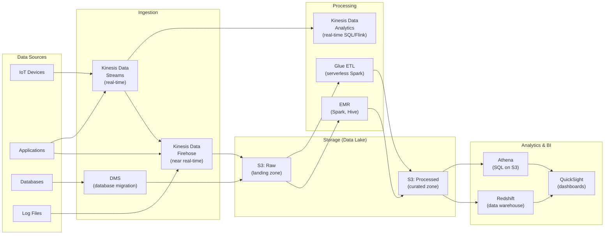
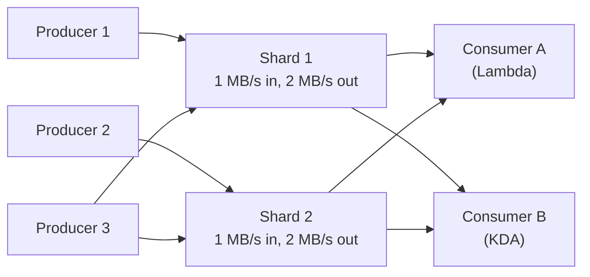
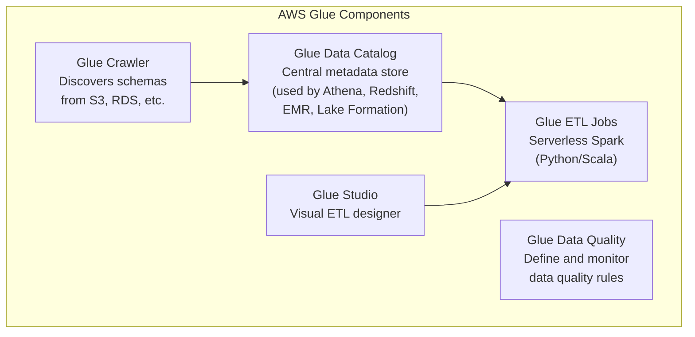
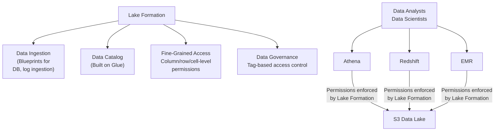

# Data & Analytics

## Overview

AWS provides a comprehensive data analytics stack: **Kinesis** for real-time streaming, **Athena** for serverless SQL queries on S3, **Glue** for ETL and data cataloging, **Lake Formation** for building data lakes, **EMR** for big data processing (Spark, Hadoop), and **QuickSight** for business intelligence dashboards. Interviews often test your ability to design end-to-end data pipelines.

## Key Concepts

| Concept | Description |
|---------|-------------|
| **Data Lake** | Centralized repository storing structured and unstructured data at any scale (usually S3) |
| **ETL** | Extract, Transform, Load — move and transform data between systems |
| **Streaming** | Process data in real-time as it arrives (Kinesis) |
| **Batch** | Process accumulated data on a schedule (Glue, EMR) |
| **Data Catalog** | Metadata repository describing datasets (schemas, locations, formats) |

## Architecture Diagram

### End-to-End Data Analytics Pipeline



## Deep Dive

### Amazon Kinesis

Suite of services for real-time streaming data.

#### Kinesis Data Streams



| Feature | Detail |
|---------|--------|
| **Shards** | Unit of capacity: 1 MB/s in, 2 MB/s out per shard |
| **Retention** | 24 hours default, up to 365 days |
| **Consumers** | Lambda, KCL (Kinesis Client Library), Kinesis Data Analytics |
| **Enhanced Fan-Out** | 2 MB/s per shard per consumer (dedicated throughput) |
| **Ordering** | Ordered within a shard (use partition key for related records) |
| **On-Demand Mode** | Auto-scale shards, no capacity planning |

#### Kinesis Data Firehose

| Feature | Detail |
|---------|--------|
| **Purpose** | Load streaming data to destinations (near real-time, 60s buffer) |
| **Destinations** | S3, Redshift, OpenSearch, Splunk, HTTP endpoint |
| **Transform** | Invoke Lambda to transform records in-flight |
| **Compression** | GZIP, Snappy, Zip |
| **Format Conversion** | JSON → Parquet/ORC (using Glue Data Catalog schema) |
| **No Management** | Fully managed, auto-scales, no shards to manage |

#### Kinesis Data Streams vs Firehose

| Feature | Data Streams | Firehose |
|---------|-------------|----------|
| **Latency** | ~200 ms (real-time) | 60 seconds minimum buffer |
| **Management** | Manage shards (or use on-demand) | Fully managed |
| **Consumers** | Custom (Lambda, KCL, KDA) | Fixed destinations (S3, Redshift, etc.) |
| **Retention** | 1-365 days | No retention (deliver immediately) |
| **Replay** | Yes (read from any point) | No |
| **Use Case** | Real-time processing, custom consumers | ETL to storage/analytics destinations |

### Amazon Athena

Serverless SQL query engine for S3 data. No infrastructure to manage — pay $5 per TB scanned.

| Feature | Detail |
|---------|--------|
| **Engine** | Based on Presto/Trino |
| **Formats** | CSV, JSON, Parquet, ORC, Avro |
| **Performance** | Use Parquet/ORC (columnar) for 30-90% cost reduction |
| **Partitioning** | Organize S3 data by date/region to skip irrelevant data |
| **Federated Query** | Query RDS, DynamoDB, Redshift, and other sources via connectors |
| **CTAS** | Create Table As Select — transform and store results in S3 |

#### Cost Optimization Tips
1. Use columnar formats (Parquet/ORC) — scan less data
2. Partition data (e.g., `s3://bucket/year=2024/month=01/`)
3. Compress files (GZIP, Snappy, LZ4)
4. Use larger files (128 MB+) — avoid many small files

### AWS Glue

Serverless ETL service with a data catalog.



| Component | Description |
|-----------|-------------|
| **Crawler** | Scans data sources, infers schema, populates Data Catalog |
| **Data Catalog** | Central metadata repository — tables, schemas, partitions. Used by Athena, Redshift Spectrum, EMR |
| **ETL Jobs** | Serverless Apache Spark jobs for data transformation |
| **Glue Studio** | Visual drag-and-drop ETL job designer |
| **Data Quality** | Define rules (completeness, uniqueness) and monitor |
| **Glue Streaming** | Process streaming data from Kinesis/Kafka with Spark Structured Streaming |

### AWS Lake Formation

Build, secure, and manage data lakes on S3.



| Feature | Description |
|---------|-------------|
| **Blueprints** | Pre-built ingestion workflows (DB → S3, CloudTrail → S3) |
| **Fine-Grained Access** | Column-level, row-level, cell-level permissions |
| **Tag-Based Access** | Assign tags to data, grant access by tag (LF-Tags) |
| **Cross-Account** | Share data lake tables across AWS accounts |
| **Governed Tables** | ACID transactions on S3 data |

### Amazon EMR (Elastic MapReduce)

Managed big data platform for Hadoop, Spark, Hive, Presto, HBase.

| Feature | Detail |
|---------|--------|
| **Frameworks** | Spark, Hadoop, Hive, Presto, HBase, Flink |
| **Deployment** | EC2 clusters, EKS, or Serverless |
| **EMR Serverless** | Run Spark/Hive without managing clusters |
| **Storage** | HDFS (cluster), S3 (decoupled, recommended) |
| **Spot Instances** | Use Spot for task nodes (up to 90% savings) |
| **Use Case** | Large-scale ETL, ML training, log analysis |

#### Glue ETL vs EMR

| Factor | Glue | EMR |
|--------|------|-----|
| **Management** | Fully serverless | Manage clusters (or use Serverless) |
| **Complexity** | Simple-medium ETL | Complex, custom frameworks |
| **Cost** | Pay per DPU-hour | Pay for EC2 (Spot available) |
| **Flexibility** | Spark (Python/Scala) | Spark, Hadoop, Hive, Presto, Flink |
| **Best For** | Standard ETL jobs | Heavy data engineering, ML on big data |

### Amazon QuickSight

Serverless BI service for creating interactive dashboards.

| Feature | Detail |
|---------|--------|
| **Data Sources** | S3, RDS, Redshift, Athena, DynamoDB, on-prem databases |
| **SPICE** | In-memory calculation engine for fast dashboards |
| **ML Insights** | Anomaly detection, forecasting, natural language queries |
| **Embedding** | Embed dashboards in applications |
| **Row-Level Security** | Restrict data visibility per user/group |
| **Pricing** | Per-user (Author: $24/month, Reader: $0.30/session) |

### Other Analytics Services

| Service | Description |
|---------|-------------|
| **Amazon OpenSearch** | Search and log analytics (successor to Elasticsearch) |
| **Amazon MSK** | Managed Apache Kafka for streaming |
| **AWS Data Pipeline** | Legacy ETL orchestration (use Glue/Step Functions instead) |
| **Amazon Managed Grafana** | Managed Grafana dashboards for operational metrics |

## Best Practices

1. **Use S3 as your data lake foundation** — decouple storage from compute
2. **Store data in Parquet/ORC** format for cost-effective querying
3. **Partition data** by date, region, or other frequently filtered columns
4. **Use Glue Data Catalog** as the central metadata store for all analytics services
5. **Start with Athena** for ad-hoc queries before investing in Redshift
6. **Use Kinesis Firehose** for simple streaming-to-storage pipelines
7. **Use Kinesis Data Streams** only when you need real-time custom processing
8. **Use Lake Formation** for data governance and fine-grained access control
9. **Use EMR Serverless or Glue** instead of managing EMR clusters when possible
10. **Compress and use larger files** in S3 to reduce Athena and Spark scan costs

## Common Interview Questions

### Q1: How would you design a real-time data analytics pipeline?

**A:** Data sources → **Kinesis Data Streams** (real-time ingestion with shards). For real-time analytics: **Kinesis Data Analytics** (Apache Flink) processes streams with SQL or Java. For storage: **Kinesis Data Firehose** buffers and delivers to S3 (Parquet format via Glue schema). For batch analytics on stored data: **Athena** queries S3 directly. **QuickSight** dashboards visualize both real-time and batch results. Use **Glue Data Catalog** as the central schema registry.

### Q2: What is the difference between Kinesis Data Streams and Firehose?

**A:** **Data Streams** = real-time (~200ms), you manage shards, custom consumers (Lambda, KCL), data retained 1-365 days, supports replay. **Firehose** = near real-time (60s buffer minimum), fully managed, fixed destinations (S3, Redshift, OpenSearch), no retention/replay, can transform data with Lambda and convert to Parquet. Use Data Streams when you need real-time processing or custom consumers. Use Firehose when you just need to deliver data to storage.

### Q3: When would you use Athena vs Redshift?

**A:** **Athena** = serverless, pay per query ($5/TB scanned), no infrastructure, great for ad-hoc queries and infrequent analysis. **Redshift** = provisioned cluster, pay per hour, optimized for complex joins and aggregations on petabytes, great for frequent dashboards and BI. Start with Athena; move to Redshift when query frequency and complexity justify the cost. You can use both: Athena for ad-hoc, Redshift for production dashboards, Redshift Spectrum to query S3 from Redshift.

### Q4: What is AWS Glue Data Catalog and why is it important?

**A:** The Glue Data Catalog is a centralized metadata repository — it stores table definitions (schemas, locations, formats, partitions) for data in S3, RDS, and other sources. It's the backbone of the analytics ecosystem: **Athena**, **Redshift Spectrum**, **EMR**, and **Lake Formation** all use it to understand data. Without it, every tool would need its own schema definitions. Glue Crawlers auto-discover schemas and populate the catalog.

### Q5: How do you optimize Athena query costs?

**A:** (1) **Columnar formats** (Parquet/ORC) — scan only needed columns, 30-90% less data. (2) **Partition data** — `WHERE year=2024` skips irrelevant partitions. (3) **Compress files** (GZIP, Snappy). (4) **Use larger files** (128 MB+) — avoids overhead of many small files. (5) **Use CTAS/INSERT INTO** to pre-aggregate frequently queried data. (6) **Use LIMIT** for exploration. (7) **Select specific columns**, never `SELECT *`. These techniques can reduce costs from $5/TB to pennies.

### Q6: What is Lake Formation and how does it differ from just using S3 + Glue?

**A:** Lake Formation adds data governance on top of S3 + Glue. Key additions: (1) **Fine-grained access control** — column-level, row-level, cell-level permissions (S3 policies are bucket/prefix-level). (2) **Tag-based access** — label data with tags, grant access by tag. (3) **Cross-account sharing** — share data securely across accounts. (4) **Governed tables** — ACID transactions on S3. Use Lake Formation when you need access control more granular than S3 bucket policies, especially in multi-team or multi-account environments.

### Q7: How would you migrate a data warehouse from on-premises to AWS?

**A:** (1) Use **AWS DMS** to replicate data from on-prem database to S3 or directly to Redshift. (2) Use **AWS SCT** (Schema Conversion Tool) to convert schema and stored procedures. (3) Land raw data in S3 as a data lake. (4) Use **Glue ETL** to transform and load into Redshift. (5) Validate with **Athena** queries against both sources. (6) Set up **Glue Data Catalog** for all datasets. (7) Build **QuickSight** dashboards. (8) Run parallel for validation before cutover.

### Q8: When would you use EMR vs Glue for ETL?

**A:** **Glue** for standard ETL: serverless, no cluster management, visual editor, integrates with Data Catalog. Good for typical data transformations. **EMR** for complex/heavy workloads: need Spark, Hive, Presto, Flink; custom libraries; ML training on big data; existing Hadoop workloads. EMR gives more control and is cheaper at scale (Spot EC2). Use Glue as default; escalate to EMR when Glue's Spark runtime is insufficient or cost-prohibitive at large scale.

### Q9: What is the difference between batch and stream processing?

**A:** **Batch**: Process data in large chunks on a schedule (hourly/daily). High throughput, higher latency. Tools: Glue ETL, EMR, Athena. Use for: reports, data warehouse loading, historical analysis. **Stream**: Process data record-by-record as it arrives. Low latency (ms to seconds). Tools: Kinesis, Kinesis Analytics (Flink), Lambda. Use for: real-time dashboards, fraud detection, alerting. Most architectures use both: stream for real-time alerts + batch for deep analytics (Lambda Architecture).

### Q10: How does Amazon MSK compare to Kinesis?

**A:** **MSK** = Managed Apache Kafka. Open-source, massive ecosystem, complex but flexible, you manage topics/partitions/consumer groups. **Kinesis** = AWS-native, simpler, tightly integrated with Lambda/Firehose/Analytics, less operational overhead. Use MSK when: you have existing Kafka expertise, need Kafka-specific features (log compaction, Kafka Connect ecosystem), or want portability. Use Kinesis when: you want simplicity, tight AWS integration, and don't need Kafka-specific features.

## Latest Updates (2025-2026)

- **AWS Glue 4.0** — Upgraded to Apache Spark 3.3 with improved performance, Python 3.10 support, and new data lake framework integrations (Apache Iceberg, Apache Hudi, Delta Lake natively supported).
- **Zero-ETL Integrations** — Aurora MySQL/PostgreSQL can now replicate directly to Redshift without any ETL pipeline, enabling near real-time analytics on transactional data. DynamoDB zero-ETL integration to Redshift and OpenSearch also available.
- **Amazon Redshift Serverless** — Run analytics workloads without provisioning or managing data warehouse clusters. Automatically scales compute based on query complexity and concurrency. Pay only for compute used.
- **Amazon OpenSearch Serverless** — Serverless deployment option for OpenSearch that automatically provisions and scales compute resources. Supports two collection types: time-series (logs) and vector search (ML embeddings).
- **Athena for Apache Spark** — Run Apache Spark workloads interactively in Athena notebooks without managing Spark infrastructure. Useful for data scientists who need Spark but not full EMR.
- **AWS Clean Rooms** — Privacy-preserving analytics service that lets multiple parties analyze their combined datasets without sharing raw data. Supports configurable analysis rules, differential privacy, and cryptographic computing.
- **Amazon DataZone** — Data management service for cataloging, discovering, sharing, and governing data across organizational boundaries with a business-friendly data portal.
- **Apache Iceberg on AWS** — First-class support across Athena, EMR, Glue, and Redshift for Apache Iceberg table format, enabling ACID transactions, time travel, and schema evolution on S3 data lakes.
- **Redshift Streaming Ingestion** — Native ingestion from Kinesis Data Streams and MSK directly into Redshift materialized views, eliminating the need for staging in S3.
- **Glue Data Quality** — Define data quality rules (completeness, uniqueness, freshness) using DQDL (Data Quality Definition Language) and automatically evaluate them during Glue ETL jobs.

### Q11: What are Zero-ETL integrations and when should you use them?

**A:** Zero-ETL integrations allow transactional databases to replicate data directly to analytics services without building ETL pipelines. Aurora MySQL/PostgreSQL zero-ETL to Redshift continuously replicates data with near real-time latency, automatically creating tables in Redshift that mirror Aurora schemas. DynamoDB zero-ETL to Redshift and DynamoDB zero-ETL to OpenSearch work similarly. Use zero-ETL when you need near real-time analytics on operational data and want to eliminate the complexity of maintaining Kinesis/Glue/Firehose pipelines between source and destination. However, zero-ETL is not a replacement for all ETL — it replicates raw data without transformation. If you need data cleansing, enrichment, aggregation, or combining multiple sources, you still need a proper ETL layer. Zero-ETL is ideal for operational analytics dashboards where teams need fresh data with minimal engineering effort.

### Q12: How does Amazon Redshift Serverless compare to provisioned Redshift?

**A:** Provisioned Redshift requires you to select a node type and cluster size, paying per hour regardless of utilization. You manage scaling (resize operations), concurrency scaling, and capacity planning. Redshift Serverless eliminates all of this — you specify a base capacity in RPUs (Redshift Processing Units) and the service scales compute automatically based on query complexity and concurrency. You pay only for compute time when queries run. Serverless is ideal for variable or unpredictable workloads, development environments, and teams that do not want to manage infrastructure. Provisioned is better for steady-state high-concurrency production workloads where costs are predictable and Reserved Instance pricing provides savings. Both support the same SQL, BI tool integrations, and features like Redshift Spectrum, ML, and data sharing. Many organizations use Serverless for dev/test and provisioned for production.

### Q13: How would you implement a data mesh architecture on AWS?

**A:** Data mesh is an organizational and architectural paradigm that treats data as a product owned by domain teams rather than a centralized data team. On AWS, each domain team owns their data pipeline and publishes data products. Implementation: (1) Each domain has its own AWS account with S3 data lake, Glue catalog, and ETL jobs they manage. (2) **Lake Formation** provides the federated governance layer — cross-account sharing with fine-grained access control using LF-Tags. (3) **Amazon DataZone** serves as the data marketplace where producers publish data products with descriptions, schemas, and SLAs, and consumers discover and subscribe. (4) **Glue Data Catalog** in each account provides local metadata, with Lake Formation enabling cross-account catalog sharing. (5) Data quality is enforced at the producer level using Glue Data Quality rules as contractual obligations. The central platform team provides self-service infrastructure (CDK constructs, account templates) and governance policies, but each domain team owns their data end-to-end.

### Q14: Compare OpenSearch Serverless vs provisioned OpenSearch.

**A:** Provisioned OpenSearch requires selecting instance types and counts for data, master, and UltraWarm nodes. You manage storage (EBS volumes), scaling (blue/green deployment for changes), and cluster health. OpenSearch Serverless removes all cluster management — you create a collection (time-series for logs/metrics or vector search for ML) and the service automatically scales compute and storage. You pay for OCUs (OpenSearch Compute Units) consumed. Serverless is ideal for variable log ingestion rates, new projects where sizing is unknown, or teams without OpenSearch operational expertise. Provisioned is better for steady high-volume workloads where Reserved Instances reduce costs, when you need full feature control (custom plugins, advanced configurations), or for very large clusters where Serverless costs exceed provisioned. One key difference: Serverless collections do not support all OpenSearch features — check compatibility for cross-cluster replication, alerting plugins, and certain aggregation types.

### Q15: How does Athena for Apache Spark differ from EMR, and when would you use it?

**A:** Athena Spark provides interactive Spark notebooks within the Athena console without managing any Spark infrastructure. Sessions start in under a second, making it ideal for interactive data exploration, quick prototyping, and data science workflows. EMR (including EMR Serverless) is designed for large-scale production Spark workloads with full control over Spark configurations, libraries, and cluster sizing. Use Athena Spark when a data analyst or scientist needs to run ad-hoc PySpark for data wrangling, feature engineering, or ML prototyping. Use EMR when you need production ETL jobs, custom Spark configurations, long-running clusters, or advanced frameworks beyond Spark (Hive, Presto, Flink, HBase). Athena Spark integrates natively with the Glue Data Catalog and Lake Formation permissions, making it easy to query governed data lakes with Spark syntax.

### Q16: What is AWS Clean Rooms and what problem does it solve?

**A:** AWS Clean Rooms enables multiple organizations (or business units) to analyze their combined datasets without exposing the underlying raw data to each other. For example, an advertiser and a publisher can match their customer lists to measure campaign effectiveness without either party seeing the other's customer data. You create a collaboration and configure analysis rules that restrict what queries can be run — for instance, only aggregations with a minimum group size (no individual-level results). Clean Rooms supports configurable analysis rules (aggregation constraints, list outputs with restrictions), differential privacy (mathematically provable privacy guarantees via noise injection), and cryptographic computing (analyze encrypted data without decrypting it). This is critical for industries like healthcare, financial services, and advertising where data sharing is necessary but privacy regulations (HIPAA, GDPR) restrict raw data exchange.

### Q17: How do you implement data quality monitoring in a data lake?

**A:** Data quality should be treated as a continuous concern, not an afterthought. On AWS, use **Glue Data Quality** to define rules using DQDL (Data Quality Definition Language) — rules like `ColumnValues "email" matches "[a-z]+@[a-z]+\\.com"`, `Completeness "customer_id" > 0.99`, or `Uniqueness "order_id" = 1.0`. Embed these rules in Glue ETL jobs so they execute automatically during pipeline runs. Configure actions on failure: quarantine bad records to a separate S3 prefix for investigation, send SNS notifications, or halt the pipeline. Beyond Glue, implement quality gates at each zone boundary — validate data completeness and schema when moving from raw to curated zones. Use CloudWatch dashboards to track data quality metrics over time. For advanced scenarios, use Great Expectations (open source) running on EMR or Glue for more expressive quality checks. Treating data quality as code (version-controlled rules) and testing it in CI/CD is the modern best practice.

### Q18: Describe the data lakehouse architecture and how to implement it with Apache Iceberg on AWS.

**A:** The data lakehouse combines the flexibility and cost-effectiveness of data lakes (S3) with the ACID transactions, schema enforcement, and performance of data warehouses. Apache Iceberg is the open table format that enables this — it adds a metadata layer on top of Parquet files in S3 that provides: (1) **ACID transactions** — concurrent readers and writers without corruption. (2) **Time travel** — query data as of any previous snapshot. (3) **Schema evolution** — add, rename, or drop columns without rewriting data. (4) **Partition evolution** — change partitioning strategy without rewriting data. On AWS, Iceberg is natively supported in Athena, Glue ETL, EMR, and Redshift Spectrum. Implementation: create Iceberg tables via Athena or Spark, store data in S3 as Parquet, and register metadata in the Glue Data Catalog. Glue ETL jobs handle MERGE/UPSERT operations using Iceberg's merge-on-read or copy-on-write strategies. This architecture often replaces the need for Redshift for many workloads, as Athena querying Iceberg tables on S3 provides warehouse-like capabilities at data lake costs.

### Q19: How would you build a real-time analytics system using Apache Flink on Kinesis?

**A:** Use **Kinesis Data Streams** for ingestion (or MSK if the team prefers Kafka), and **Amazon Managed Service for Apache Flink** (formerly Kinesis Data Analytics for Flink) for stream processing. Flink applications define dataflow graphs with operators for filtering, mapping, windowing, and joining streams. For real-time analytics, use tumbling windows (fixed intervals, e.g., 1-minute aggregations), sliding windows (overlapping intervals for moving averages), or session windows (activity-based grouping). Flink maintains state using RocksDB with automatic checkpointing to S3 for exactly-once processing guarantees. Output results to DynamoDB for low-latency serving, Firehose for S3 archival, or OpenSearch for real-time search and dashboards. A key advantage of Flink over Kinesis Data Analytics SQL is the ability to handle complex event processing (CEP) — pattern detection like "alert when a user fails login 5 times within 10 minutes." Flink also supports enrichment joins against reference data in S3 or DynamoDB.

### Q20: How does Lake Formation implement data governance at scale?

**A:** Lake Formation provides centralized governance for data lakes through several mechanisms. **Fine-grained access control** allows permissions at the database, table, column, row, and even cell level — far more granular than S3 bucket policies. **LF-Tags** enable tag-based access control where you tag data with attributes (e.g., `sensitivity=pii`, `domain=finance`) and grant permissions by tag, so new tables automatically inherit appropriate permissions. **Cross-account sharing** lets you share specific tables or columns with other AWS accounts without copying data. **Data filters** restrict which rows specific users can see (e.g., "marketing team sees only marketing data"). For auditing, Lake Formation logs all data access through CloudTrail integration. The governed tables feature supports ACID transactions on S3. At scale, Lake Formation works with AWS Organizations to share governance policies across hundreds of accounts. The combination of LF-Tags and DataZone provides a complete data governance framework where producers register data products and consumers request access through self-service workflows.

### Q21: What are the detailed trade-offs between streaming and batch processing architectures?

**A:** The choice is rarely binary — most production systems use both (Lambda or Kappa architecture). **Batch advantages**: higher throughput (process millions of records efficiently), simpler error handling (reprocess the entire batch), easier to reason about completeness (all data for a day is present), and lower cost (Glue Spot pricing, off-peak scheduling). **Streaming advantages**: low-latency insights (seconds vs hours), continuous processing (no scheduling), natural fit for event-driven architectures, and fresher data. **Batch challenges**: staleness (dashboards show yesterday's data), complex backfill operations, and scheduling dependencies. **Streaming challenges**: exactly-once semantics are hard, late-arriving data requires watermarking strategies, state management adds complexity, and debugging is harder than batch jobs. On AWS, the **Lambda architecture** uses Kinesis for the speed layer (real-time approximate results) and Glue/EMR for the batch layer (accurate historical results). The **Kappa architecture** uses only streaming (Flink) and reprocesses by replaying the stream — simpler but requires Kinesis extended retention (up to 365 days) or MSK with long retention.

### Q22: How would you implement event sourcing patterns on AWS?

**A:** Event sourcing stores every state change as an immutable event rather than overwriting the current state. On AWS, implement the event store using **Kinesis Data Streams** (for real-time event flow) backed by **DynamoDB** (for durable, indexed event storage with the event stream as the partition key and timestamp as the sort key). Each command produces events that are published to Kinesis and persisted to DynamoDB. Consumer applications (Lambda, ECS, or Flink) process events to build read-optimized projections — for example, materializing a "current account balance" view in DynamoDB or ElastiCache from the stream of debit/credit events. **EventBridge** can route specific event types to different consumers. For snapshots (to avoid replaying all events), periodically write the current aggregate state to S3 or DynamoDB. Key considerations: events are immutable (never delete or update), schema evolution must be handled carefully (use a schema registry like Glue Schema Registry), and eventual consistency between the event store and projections must be acceptable to the business. This pattern pairs naturally with CQRS (Command Query Responsibility Segregation).

## Deep Dive Notes

### Data Lakehouse Architecture with Apache Iceberg

The data lakehouse eliminates the traditional two-tier architecture (data lake + data warehouse) by adding transaction support and performance optimizations directly on the data lake.

**Iceberg Table Format Internals:**
```
S3 Bucket
├── metadata/
│   ├── v1.metadata.json      (table schema, partition spec, snapshot list)
│   ├── v2.metadata.json      (updated after writes)
│   ├── snap-123.avro         (snapshot manifest list)
│   └── manifest-456.avro     (list of data files with column stats)
├── data/
│   ├── part-00001.parquet    (actual data files)
│   ├── part-00002.parquet
│   └── ...
```

| Feature | Iceberg | Hive Tables | Delta Lake |
|---------|---------|-------------|------------|
| **ACID Transactions** | Yes (optimistic concurrency) | No | Yes |
| **Time Travel** | Yes (snapshot-based) | No | Yes (log-based) |
| **Schema Evolution** | Full (add, drop, rename, reorder) | Limited (add only) | Add, rename, reorder |
| **Partition Evolution** | Yes (change without rewrite) | No (must rewrite) | No (must rewrite) |
| **Hidden Partitioning** | Yes (users don't specify partition in queries) | No | No |
| **AWS Support** | Athena, EMR, Glue, Redshift | Athena, EMR, Glue | EMR, Glue |
| **Open Standard** | Apache Foundation | Apache Foundation | Linux Foundation |

**Best Practices:**
1. Use **copy-on-write** for read-heavy workloads (fewer, larger files) and **merge-on-read** for write-heavy workloads (faster writes, reads merge delete files)
2. Schedule **compaction** (Glue ETL or EMR) to merge small files and apply deletes
3. Use **Iceberg's hidden partitioning** — partition by `days(timestamp)` so users do not need to include partition predicates in queries
4. Configure **snapshot expiration** to clean old metadata and avoid unbounded growth
5. Register Iceberg tables in **Glue Data Catalog** for cross-service discoverability

### Data Mesh Implementation on AWS

Data mesh is built on four principles: domain ownership, data as a product, self-serve data platform, and federated computational governance.

**Architecture per Domain (AWS Account):**
```
Domain Account (e.g., "Orders Domain")
├── S3: Raw + Curated data
├── Glue Data Catalog: Domain-local tables
├── Glue ETL Jobs: Domain-owned pipelines
├── Glue Data Quality: Domain-defined quality rules
├── Lake Formation: Permissions on domain data
└── DataZone: Published data products
```

**Central Platform Account:**
```
Platform Account
├── DataZone: Data marketplace portal
├── Lake Formation: Cross-account governance (LF-Tags)
├── CDK Constructs: Self-service infrastructure templates
├── CloudWatch: Cross-account monitoring dashboards
└── Config Rules: Compliance enforcement
```

**Implementation Steps:**
1. **Account-per-domain** — Each business domain (orders, customers, inventory) gets an AWS account with standard data infrastructure provisioned via CDK
2. **Data product contracts** — Each domain defines output ports (Glue catalog tables) with schema, SLAs (freshness, completeness), and quality rules
3. **Discovery** — DataZone provides the catalog where consumers search for data products, view documentation, and request access
4. **Governance** — Lake Formation LF-Tags flow across accounts; central team defines tag taxonomies (`pii`, `confidential`, `public`) and domains tag their data
5. **Self-serve platform** — Platform team publishes CDK constructs for common patterns (Kinesis ingestion, Glue ETL, Athena workgroup) so domain teams build without reinventing infrastructure

### Streaming Architectures: Kinesis vs MSK vs Flink

| Feature | Kinesis Data Streams | Amazon MSK | Managed Flink |
|---------|---------------------|------------|---------------|
| **Protocol** | AWS-proprietary API | Apache Kafka protocol | Apache Flink |
| **Purpose** | Stream ingestion + consumption | Stream ingestion + consumption | Stream processing |
| **Ordering** | Per shard (partition key) | Per partition (key) | Inherits from source |
| **Throughput** | 1 MB/s per shard (or on-demand) | Depends on broker count/size | Depends on KPU allocation |
| **Retention** | 24h default, up to 365 days | Unlimited (disk-based) | N/A (stateful processing) |
| **Consumer Model** | KCL, Lambda, Enhanced Fan-Out | Consumer groups (standard Kafka) | Dataflow application |
| **Ecosystem** | AWS-native (Lambda, Firehose) | Kafka Connect, Schema Registry, ksqlDB | SQL or Java/Python API |
| **Cost Model** | Per shard-hour + PUT payload | Per broker-hour + storage | Per KPU-hour |
| **Best For** | AWS-native streaming, serverless | Kafka ecosystem, portability, high volume | Complex event processing, windowing |

**When to combine them:**
- **Kinesis + Flink**: AWS-native real-time analytics — Kinesis for ingestion, Flink for complex processing (windowed aggregations, pattern detection, enrichment joins)
- **MSK + Flink**: Kafka ecosystem with Flink processing — good for teams with Kafka expertise who need complex stream processing
- **Kinesis + Firehose**: Simple streaming ETL — Kinesis for ingestion, Firehose for S3/Redshift delivery with optional Lambda transformation
- **MSK + MSK Connect**: Kafka-native ETL — use Kafka Connect connectors to sink data to S3, Redshift, OpenSearch

### Data Governance and Lineage

Data governance on AWS spans access control, auditing, quality, and lineage.

| Concern | AWS Service | How It Helps |
|---------|------------|--------------|
| **Access Control** | Lake Formation | Column/row/cell-level permissions, LF-Tags |
| **Data Catalog** | Glue Data Catalog + DataZone | Schema discovery, business metadata, data marketplace |
| **Data Quality** | Glue Data Quality | Rule-based quality checks in ETL pipelines |
| **Auditing** | CloudTrail + Lake Formation | Who accessed what data, when |
| **Encryption** | KMS + S3 SSE | Encryption at rest (SSE-KMS, SSE-S3) and in transit (TLS) |
| **Compliance** | AWS Config + Macie | Detect non-compliant resources, discover PII in S3 |
| **Data Lineage** | Glue (manual), DataZone (visual) | Track data from source through transformations to consumption |

**Implementing Data Lineage on AWS:**
- **Glue ETL** automatically tracks lineage for jobs it runs — input datasets, transformations, output datasets
- **DataZone** provides a lineage visualization across data products
- For custom lineage, instrument pipelines with OpenLineage (open standard) and send lineage events to a metadata store
- Use **Glue Schema Registry** for schema versioning — track how schemas evolve over time
- Tag data with classification (PII, sensitive, public) using **Macie** for automated discovery or **Lake Formation LF-Tags** for manual classification

## Cheat Sheet

| Concept | Key Facts |
|---------|-----------|
| Kinesis Data Streams | Real-time, manage shards, 1 MB/s in per shard, 1-365 day retention |
| Kinesis Firehose | Near real-time (60s), fully managed, delivers to S3/Redshift/OpenSearch |
| Kinesis Analytics | Real-time SQL or Apache Flink on streams |
| Athena | Serverless SQL on S3, $5/TB scanned, use Parquet to save |
| Glue | Serverless ETL (Spark), Data Catalog, Crawlers |
| Glue Data Catalog | Central metadata store used by Athena, Redshift, EMR |
| Lake Formation | Data governance, column/row-level security, tag-based access |
| EMR | Managed Spark/Hadoop/Hive, use Spot for cost savings |
| EMR Serverless | Run Spark/Hive without clusters |
| Redshift | Columnar data warehouse, petabyte-scale, Spectrum queries S3 |
| QuickSight | Serverless BI, SPICE engine, ML insights |
| MSK | Managed Kafka, open-source ecosystem |

---

[← Previous: DevOps & Infrastructure](../09-devops-and-infra/) | [Next: Architecture Scenarios →](../11-architecture-scenarios/)
