# Architecture Scenarios

Real-world system design problems that test your AWS architecture skills. Each scenario includes a problem statement, requirements, architecture diagram, solution walkthrough, and trade-offs.

---

## Scenario 1: Highly Available 3-Tier Web Application

### Problem
Design a scalable, highly available web application that serves millions of users with minimal downtime.

### Requirements
- 99.99% availability
- Auto-scale based on demand
- Secure architecture with defense in depth
- Database failover under 60 seconds

### Architecture

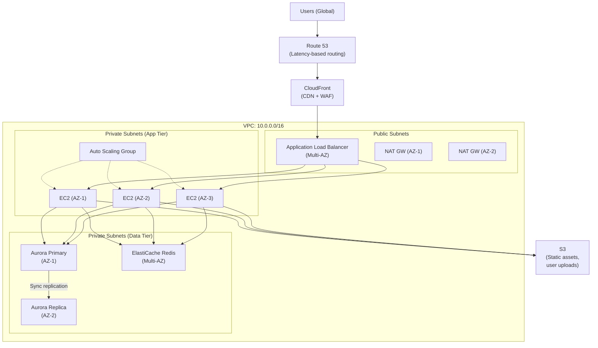
```mermaid
graph TB
    USERS["Users (Global)"] --> R53["Route 53<br/>(Latency-based routing)"]
    R53 --> CF["CloudFront<br/>(CDN + WAF)"]
    CF --> ALB["Application Load Balancer<br/>(Multi-AZ)"]

    subgraph VPC["VPC: 10.0.0.0/16"]
        subgraph "Public Subnets"
            ALB
            NAT1["NAT GW (AZ-1)"]
            NAT2["NAT GW (AZ-2)"]
        end

        subgraph "Private Subnets (App Tier)"
            ASG["Auto Scaling Group"]
            EC2A["EC2 (AZ-1)"]
            EC2B["EC2 (AZ-2)"]
            EC2C["EC2 (AZ-3)"]
            ASG -.-> EC2A & EC2B & EC2C
        end

        subgraph "Private Subnets (Data Tier)"
            AURORA["Aurora Primary<br/>(AZ-1)"]
            AURORA_R["Aurora Replica<br/>(AZ-2)"]
            REDIS["ElastiCache Redis<br/>(Multi-AZ)"]
        end

        ALB --> EC2A & EC2B & EC2C
        EC2A & EC2B & EC2C --> REDIS
        EC2A & EC2B & EC2C --> AURORA
        AURORA -->|"Sync replication"| AURORA_R
    end

    EC2A & EC2B & EC2C --> S3["S3<br/>(Static assets,<br/>user uploads)"]
```

### Solution Walkthrough

1. **DNS & CDN**: Route 53 with latency-based routing. CloudFront caches static content at 400+ edge locations and integrates with AWS WAF for Layer 7 protection.

2. **Web Tier**: ALB distributes traffic across AZs. WAF rules block SQL injection, XSS, and rate-limit abusive IPs.

3. **App Tier**: EC2 in an Auto Scaling Group across 3 AZs. Target tracking policy maintains 60% CPU utilization. Use Graviton instances for 40% better price-performance.

4. **Caching**: ElastiCache Redis (Multi-AZ) caches database queries and sessions. Reduces database load by 80%+.

5. **Database**: Aurora PostgreSQL with Multi-AZ replica. Auto-failover < 30 seconds. Up to 15 read replicas for read scaling.

6. **Storage**: S3 for static assets and user uploads. CloudFront serves S3 content via Origin Access Control.

### Key Decisions
| Decision | Choice | Why |
|----------|--------|-----|
| DB Engine | Aurora over RDS | Faster failover, better replication, auto-scaling storage |
| Cache | Redis over Memcached | Persistence, replication, complex data types |
| Compute | EC2 over Fargate | More instance type flexibility, Spot for cost savings |
| CDN | CloudFront + WAF | Integrated security, global edge locations |

---

## Scenario 2: Serverless Real-Time Data Pipeline

### Problem
Design a real-time data pipeline that ingests clickstream data from a web application, processes it, and makes it available for both real-time dashboards and batch analytics.

### Requirements
- Handle 100,000 events per second
- Real-time dashboard updates (< 5 second latency)
- Historical analytics on stored data
- Cost-effective storage with query optimization

### Architecture

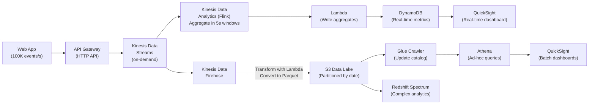
```mermaid
graph LR
    WEB["Web App<br/>(100K events/s)"] --> APIGW["API Gateway<br/>(HTTP API)"]
    APIGW --> KDS["Kinesis Data<br/>Streams<br/>(on-demand)"]

    KDS --> KDA["Kinesis Data<br/>Analytics (Flink)<br/>Aggregate in 5s windows"]
    KDS --> KDF["Kinesis Data<br/>Firehose"]

    KDA --> LAMBDA_RT["Lambda<br/>(Write aggregates)"]
    LAMBDA_RT --> DDB["DynamoDB<br/>(Real-time metrics)"]
    DDB --> QS_RT["QuickSight<br/>(Real-time dashboard)"]

    KDF -->|"Transform with Lambda<br/>Convert to Parquet"| S3["S3 Data Lake<br/>(Partitioned by date)"]

    S3 --> GLUE["Glue Crawler<br/>(Update catalog)"]
    GLUE --> ATHENA["Athena<br/>(Ad-hoc queries)"]
    S3 --> RS["Redshift Spectrum<br/>(Complex analytics)"]
    ATHENA --> QS_BATCH["QuickSight<br/>(Batch dashboards)"]
```

### Solution Walkthrough

1. **Ingestion**: API Gateway HTTP API receives events. Kinesis Data Streams (on-demand mode) handles variable throughput without shard management.

2. **Real-Time Path**: Kinesis Data Analytics (Apache Flink) aggregates events in 5-second tumbling windows (page views, clicks by category). Lambda writes aggregates to DynamoDB for the real-time dashboard.

3. **Batch Path**: Kinesis Firehose buffers events, invokes Lambda to enrich data, converts to Parquet using Glue Data Catalog schema, and delivers to S3 partitioned by `year/month/day/hour`.

4. **Analytics**: Athena for ad-hoc SQL queries on S3. Redshift Spectrum for complex joins and historical analysis. QuickSight dashboards connect to both DynamoDB (real-time) and Athena (batch).

5. **Cost Optimization**: Parquet format reduces Athena scan costs by 90%. S3 Intelligent-Tiering for older data. Kinesis on-demand eliminates over-provisioning.

---

## Scenario 3: Microservices Migration from Monolith

### Problem
Migrate a monolithic e-commerce application to a microservices architecture on AWS. The monolith handles user management, product catalog, orders, payments, and notifications.

### Requirements
- Gradual migration (strangler fig pattern)
- Independent scaling per service
- Loose coupling between services
- Zero downtime during migration

### Architecture

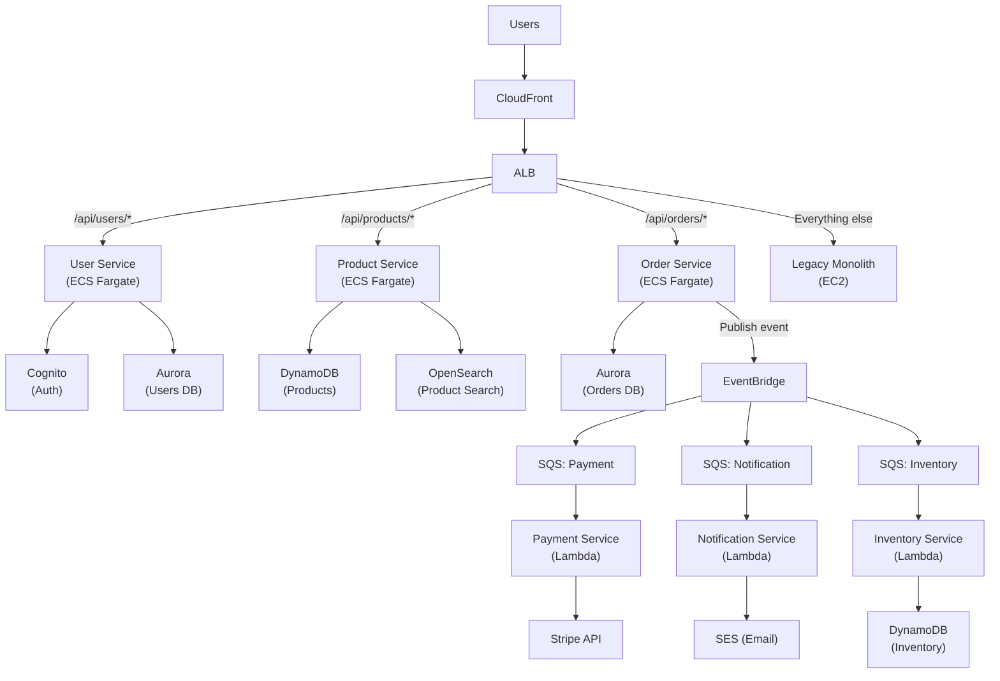
```mermaid
graph TB
    USERS["Users"] --> CF2["CloudFront"] --> ALB2["ALB"]

    ALB2 -->|"/api/users/*"| USER_SVC["User Service<br/>(ECS Fargate)"]
    ALB2 -->|"/api/products/*"| PROD_SVC["Product Service<br/>(ECS Fargate)"]
    ALB2 -->|"/api/orders/*"| ORDER_SVC["Order Service<br/>(ECS Fargate)"]
    ALB2 -->|"Everything else"| MONOLITH["Legacy Monolith<br/>(EC2)"]

    USER_SVC --> COGNITO["Cognito<br/>(Auth)"]
    USER_SVC --> RDS_USERS["Aurora<br/>(Users DB)"]

    PROD_SVC --> DDB_PROD["DynamoDB<br/>(Products)"]
    PROD_SVC --> ES["OpenSearch<br/>(Product Search)"]

    ORDER_SVC --> RDS_ORDERS["Aurora<br/>(Orders DB)"]
    ORDER_SVC -->|"Publish event"| EB["EventBridge"]

    EB --> SQS_PAY["SQS: Payment"]
    EB --> SQS_NOTIFY["SQS: Notification"]
    EB --> SQS_INVENTORY["SQS: Inventory"]

    SQS_PAY --> PAY_SVC["Payment Service<br/>(Lambda)"]
    SQS_NOTIFY --> NOTIFY_SVC["Notification Service<br/>(Lambda)"]
    SQS_INVENTORY --> INV_SVC["Inventory Service<br/>(Lambda)"]

    PAY_SVC --> STRIPE["Stripe API"]
    NOTIFY_SVC --> SES["SES (Email)"]
    INV_SVC --> DDB_INV["DynamoDB<br/>(Inventory)"]
```

### Solution Walkthrough

1. **Strangler Fig Pattern**: ALB routes requests by path. New services handle their endpoints; unmatched paths fall through to the monolith. Gradually migrate paths until the monolith is empty.

2. **Service Design**: Each microservice owns its data (database per service pattern). User Service + Orders → Aurora (need ACID). Products + Inventory → DynamoDB (need scale). Payment + Notification → Lambda (event-driven, stateless).

3. **Communication**: Synchronous (ALB routing) for user-facing APIs. Asynchronous (EventBridge + SQS) for inter-service events. "Order Created" event fans out to payment, notification, and inventory services independently.

4. **Database Strategy**: Each service has its own database — no shared database. Use DMS to migrate data from monolith's single database to per-service databases.

5. **Observability**: X-Ray traces requests across all services. CloudWatch for metrics and logs. Centralized logging with CloudWatch Logs Insights.

---

## Scenario 4: Multi-Region Disaster Recovery

### Problem
Design a disaster recovery strategy for a critical application that requires RPO < 1 minute and RTO < 5 minutes.

### Requirements
- Active-passive across two regions
- Automatic failover
- Data consistency across regions
- Cost-effective (don't run full capacity in standby)

### Architecture

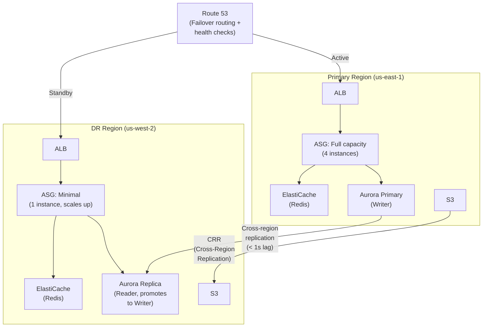
```mermaid
graph TB
    R53["Route 53<br/>(Failover routing +<br/>health checks)"]

    subgraph PRIMARY["Primary Region (us-east-1)"]
        ALB_P["ALB"]
        ASG_P["ASG: Full capacity<br/>(4 instances)"]
        AURORA_P["Aurora Primary<br/>(Writer)"]
        REDIS_P["ElastiCache<br/>(Redis)"]
        S3_P["S3"]

        ALB_P --> ASG_P
        ASG_P --> AURORA_P
        ASG_P --> REDIS_P
    end

    subgraph DR["DR Region (us-west-2)"]
        ALB_DR["ALB"]
        ASG_DR["ASG: Minimal<br/>(1 instance, scales up)"]
        AURORA_DR["Aurora Replica<br/>(Reader, promotes<br/>to Writer)"]
        REDIS_DR["ElastiCache<br/>(Redis)"]
        S3_DR["S3"]

        ALB_DR --> ASG_DR
        ASG_DR --> AURORA_DR
        ASG_DR --> REDIS_DR
    end

    R53 -->|"Active"| ALB_P
    R53 -->|"Standby"| ALB_DR
    AURORA_P -->|"Cross-region<br/>replication<br/>(< 1s lag)"| AURORA_DR
    S3_P -->|"CRR<br/>(Cross-Region<br/>Replication)"| S3_DR
```

### Solution Walkthrough

1. **DNS Failover**: Route 53 failover routing with health checks on the primary ALB. If health checks fail, traffic automatically routes to the DR region.

2. **Database DR**: Aurora Global Database replicates from primary to DR with < 1 second lag (RPO < 1 min). On failover, the DR replica promotes to writer in < 1 minute.

3. **Compute Scaling**: DR runs minimal capacity (1 instance) to save cost. ASG configured with large max capacity. On failover, ASG scales up to match demand. Pre-warm with Predictive Scaling policies.

4. **Data Replication**: S3 Cross-Region Replication for objects. ElastiCache Global Datastore for Redis replication. Secrets Manager replicates secrets to DR region.

5. **Automation**: Lambda function triggered by Route 53 health check failure. Promotes Aurora replica, updates DynamoDB Global Table endpoints, and triggers ASG scaling in DR region.

### DR Strategy Comparison

| Strategy | RTO | RPO | Cost | Description |
|----------|-----|-----|------|-------------|
| **Backup & Restore** | Hours | Hours | $ | Restore from backups (S3, snapshots) |
| **Pilot Light** | 10-30 min | Minutes | $$ | Core services running, scale up on failover |
| **Warm Standby** | Minutes | Seconds | $$$ | Scaled-down copy running, scale up on failover |
| **Active-Active** | Seconds | Zero | $$$$ | Full capacity in both regions, traffic split |

---

## Scenario 5: CI/CD Pipeline for Containerized Apps on EKS

### Problem
Design a CI/CD pipeline that builds, tests, and deploys containerized applications to Amazon EKS with progressive delivery.

### Requirements
- Automated build and test on every push
- Container image scanning for vulnerabilities
- Canary deployment with automatic rollback
- Multi-environment (dev, staging, prod)

### Architecture

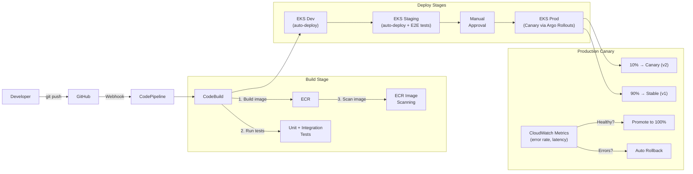
```mermaid
graph LR
    DEV["Developer"] -->|"git push"| GH["GitHub"]
    GH -->|"Webhook"| CP["CodePipeline"]

    subgraph "Build Stage"
        CB["CodeBuild"]
        CB -->|"1. Build image"| ECR["ECR"]
        CB -->|"2. Run tests"| TEST["Unit + Integration<br/>Tests"]
        ECR -->|"3. Scan image"| SCAN["ECR Image<br/>Scanning"]
    end

    subgraph "Deploy Stages"
        DEV_EKS["EKS Dev<br/>(auto-deploy)"]
        STG_EKS["EKS Staging<br/>(auto-deploy + E2E tests)"]
        APPROVAL["Manual<br/>Approval"]
        PROD_EKS["EKS Prod<br/>(Canary via Argo Rollouts)"]
    end

    CP --> CB
    CB --> DEV_EKS --> STG_EKS --> APPROVAL --> PROD_EKS

    subgraph "Production Canary"
        CANARY["10% → Canary (v2)"]
        STABLE["90% → Stable (v1)"]
        CW2["CloudWatch Metrics<br/>(error rate, latency)"]
        CW2 -->|"Healthy?"| PROMOTE["Promote to 100%"]
        CW2 -->|"Errors?"| ROLLBACK["Auto Rollback"]
    end

    PROD_EKS --> CANARY & STABLE
```

### Solution Walkthrough

1. **Source**: GitHub webhook triggers CodePipeline on push to main branch.

2. **Build**: CodeBuild builds Docker image, runs unit tests, pushes to ECR. ECR Enhanced Scanning (Inspector) checks for CVEs. Pipeline fails if critical vulnerabilities found.

3. **Dev Deploy**: Auto-deploy to EKS dev namespace using `kubectl apply` or Helm in CodeBuild.

4. **Staging Deploy**: Deploy to staging, run E2E test suite (Selenium/Playwright) in CodeBuild. Staging mirrors production configuration.

5. **Production Deploy**: Manual approval gate. Argo Rollouts manages canary deployment — 10% traffic to new version, monitor CloudWatch metrics (5XX rate, p99 latency) for 10 minutes. Auto-promote if healthy, auto-rollback if metrics degrade.

6. **Observability**: X-Ray traces across services. CloudWatch Container Insights for EKS metrics. Slack notifications via SNS on pipeline events.

---

## Scenario 6: Cost-Optimized Data Lake

### Problem
Design a data lake that ingests data from multiple sources, enables analytics for different teams, and minimizes storage and query costs.

### Requirements
- Ingest from databases, APIs, and streaming sources
- Query costs under $500/month for 50 analysts
- Fine-grained access control (teams see only their data)
- Data quality monitoring

### Architecture

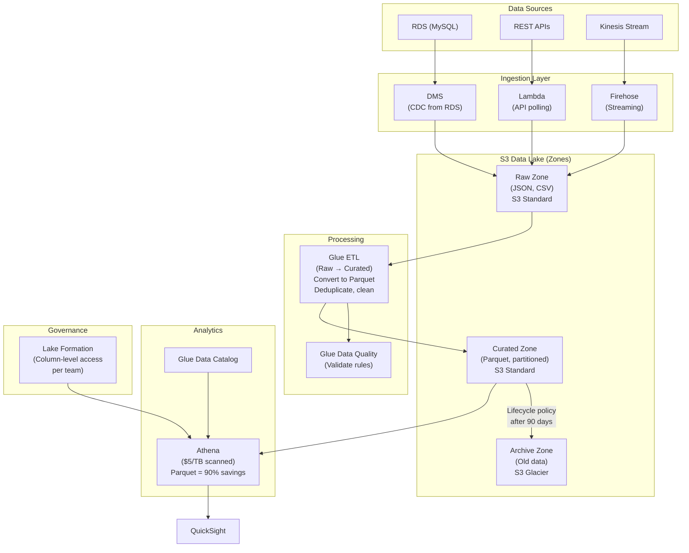
```mermaid
graph TB
    subgraph "Data Sources"
        RDS_SRC["RDS (MySQL)"]
        API_SRC["REST APIs"]
        STREAM["Kinesis Stream"]
    end

    subgraph "Ingestion Layer"
        DMS2["DMS<br/>(CDC from RDS)"]
        LAMBDA_API["Lambda<br/>(API polling)"]
        FIREHOSE["Firehose<br/>(Streaming)"]
    end

    RDS_SRC --> DMS2
    API_SRC --> LAMBDA_API
    STREAM --> FIREHOSE

    subgraph "S3 Data Lake (Zones)"
        RAW["Raw Zone<br/>(JSON, CSV)<br/>S3 Standard"]
        CURATED["Curated Zone<br/>(Parquet, partitioned)<br/>S3 Standard"]
        ARCHIVE["Archive Zone<br/>(Old data)<br/>S3 Glacier"]
    end

    DMS2 & LAMBDA_API & FIREHOSE --> RAW

    subgraph "Processing"
        GLUE_ETL["Glue ETL<br/>(Raw → Curated)<br/>Convert to Parquet<br/>Deduplicate, clean"]
        GLUE_DQ["Glue Data Quality<br/>(Validate rules)"]
    end

    RAW --> GLUE_ETL --> CURATED
    GLUE_ETL --> GLUE_DQ

    subgraph "Analytics"
        ATHENA_Q["Athena<br/>($5/TB scanned)<br/>Parquet = 90% savings"]
        CATALOG["Glue Data Catalog"]
    end

    subgraph "Governance"
        LF["Lake Formation<br/>(Column-level access<br/>per team)"]
    end

    CURATED --> ATHENA_Q --> QS2["QuickSight"]
    CATALOG --> ATHENA_Q
    LF --> ATHENA_Q

    CURATED -->|"Lifecycle policy<br/>after 90 days"| ARCHIVE
```

### Cost Optimization Details

| Technique | Impact |
|-----------|--------|
| Parquet format | Reduces Athena scan 10x vs CSV |
| Partitioning by date + team | Skips irrelevant data |
| S3 Intelligent-Tiering | Saves 40% on infrequently accessed data |
| Lifecycle to Glacier | Archive after 90 days |
| QuickSight SPICE | Cache results, avoid repeated scans |
| Athena workgroups | Set per-team query cost limits |

---

## Scenario 7: Secure Multi-Account AWS Organization

### Problem
Design an AWS account structure for a company with 100+ engineers across development, staging, and production environments with strict security and compliance requirements.

### Architecture

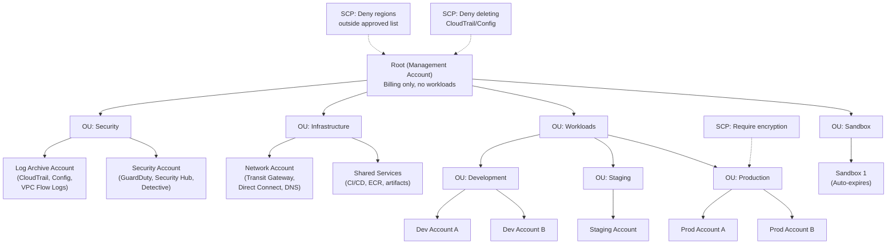
```mermaid
graph TD
    ROOT["Root (Management Account)<br/>Billing only, no workloads"]

    ROOT --> SEC_OU["OU: Security"]
    ROOT --> INFRA_OU["OU: Infrastructure"]
    ROOT --> WORKLOAD_OU["OU: Workloads"]
    ROOT --> SANDBOX_OU["OU: Sandbox"]

    SEC_OU --> LOG_ACC["Log Archive Account<br/>(CloudTrail, Config,<br/>VPC Flow Logs)"]
    SEC_OU --> SECURITY_ACC["Security Account<br/>(GuardDuty, Security Hub,<br/>Detective)"]

    INFRA_OU --> NETWORK_ACC["Network Account<br/>(Transit Gateway,<br/>Direct Connect, DNS)"]
    INFRA_OU --> SHARED_ACC["Shared Services<br/>(CI/CD, ECR, artifacts)"]

    WORKLOAD_OU --> DEV_OU["OU: Development"]
    WORKLOAD_OU --> STG_OU["OU: Staging"]
    WORKLOAD_OU --> PROD_OU["OU: Production"]

    DEV_OU --> DEV_A["Dev Account A"]
    DEV_OU --> DEV_B["Dev Account B"]
    STG_OU --> STG_A["Staging Account"]
    PROD_OU --> PROD_A["Prod Account A"]
    PROD_OU --> PROD_B["Prod Account B"]

    SANDBOX_OU --> SAND1["Sandbox 1<br/>(Auto-expires)"]

    SCP1["SCP: Deny regions<br/>outside approved list"] -.-> ROOT
    SCP2["SCP: Deny deleting<br/>CloudTrail/Config"] -.-> ROOT
    SCP3["SCP: Require encryption"] -.-> PROD_OU
```

### Key Design Decisions

1. **Account per environment**: Dev, Staging, Prod in separate accounts — blast radius isolation.
2. **Centralized logging**: Dedicated Log Archive account with immutable S3 buckets (Object Lock).
3. **Network hub**: Transit Gateway in the Network account connects all VPCs; no direct peering.
4. **SSO**: IAM Identity Center for federated access; permission sets per role per account.
5. **SCPs**: Guardrails at the OU level — deny unapproved regions, require encryption, prevent disabling logging.
6. **Sandbox**: Time-limited accounts for experimentation, auto-cleaned by Lambda.

---

## Scenario 8: Global Content Delivery System

### Problem
Design a system that delivers dynamic and static content to users worldwide with sub-100ms latency for static content and sub-500ms for dynamic API calls.

### Architecture

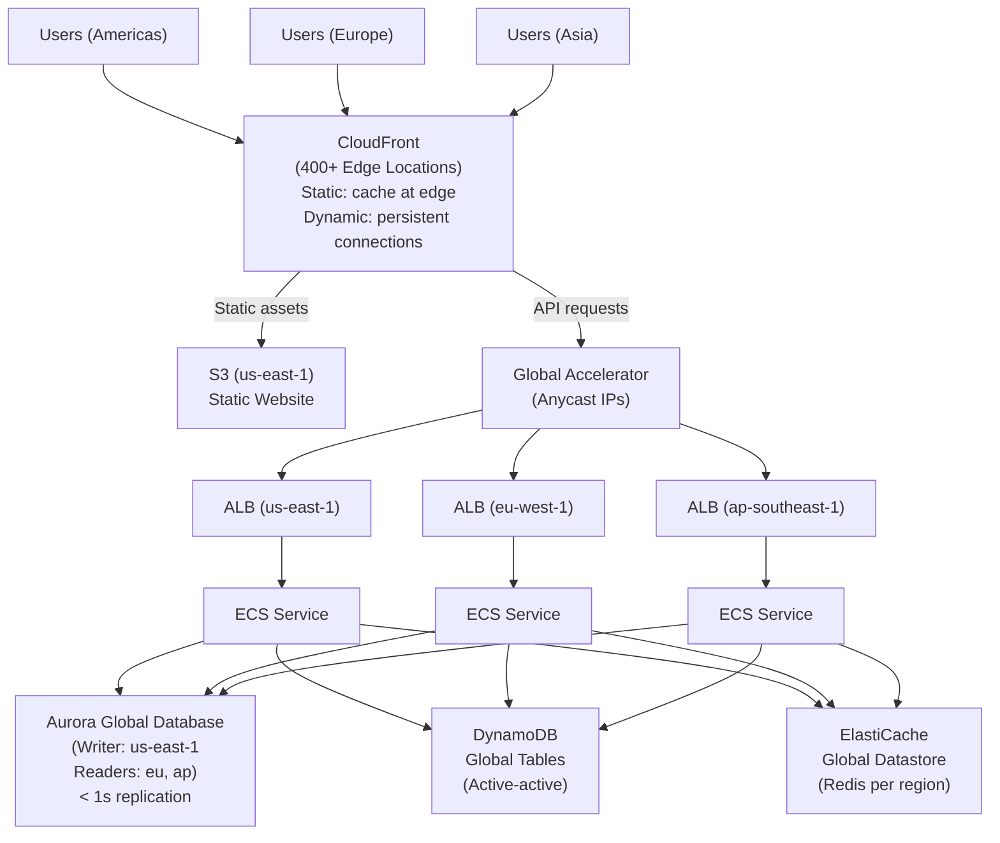
```mermaid
graph TB
    USER_US["Users (Americas)"]
    USER_EU["Users (Europe)"]
    USER_AS["Users (Asia)"]

    USER_US & USER_EU & USER_AS --> CF3["CloudFront<br/>(400+ Edge Locations)<br/>Static: cache at edge<br/>Dynamic: persistent connections"]

    CF3 -->|"Static assets"| S3_STATIC["S3 (us-east-1)<br/>Static Website"]
    CF3 -->|"API requests"| GA["Global Accelerator<br/>(Anycast IPs)"]

    GA --> ALB_US["ALB (us-east-1)"]
    GA --> ALB_EU["ALB (eu-west-1)"]
    GA --> ALB_AS["ALB (ap-southeast-1)"]

    ALB_US --> ECS_US["ECS Service"]
    ALB_EU --> ECS_EU["ECS Service"]
    ALB_AS --> ECS_AS["ECS Service"]

    ECS_US & ECS_EU & ECS_AS --> AURORA_GLOBAL["Aurora Global Database<br/>(Writer: us-east-1<br/>Readers: eu, ap)<br/>< 1s replication"]

    ECS_US & ECS_EU & ECS_AS --> DDB_GLOBAL["DynamoDB<br/>Global Tables<br/>(Active-active)"]

    ECS_US & ECS_EU & ECS_AS --> REDIS_GLOBAL["ElastiCache<br/>Global Datastore<br/>(Redis per region)"]
```

### Solution Walkthrough

1. **Static Content**: CloudFront caches at 400+ edge locations. TTL-based cache invalidation. S3 origin with Origin Access Control.

2. **Dynamic API**: Global Accelerator provides 2 anycast IPs that route users to the nearest healthy region via AWS backbone. Persistent TCP connections reduce latency.

3. **Compute**: ECS Fargate services in 3 regions. Independent auto-scaling per region based on local traffic.

4. **Database**: Aurora Global Database for relational data — writer in us-east-1, read replicas in EU and AP (< 1s replication). DynamoDB Global Tables for session/cart data — active-active writes anywhere.

5. **Caching**: ElastiCache Global Datastore replicates Redis across regions. Each region reads from local cache for sub-ms latency.

---

## Scenario 9: Multi-Tenant SaaS Architecture

### Problem
Design a SaaS platform that serves hundreds of tenants with varying sizes, from small free-tier users to large enterprise customers requiring dedicated resources.

### Requirements
- Tenant isolation (data and compute)
- Per-tenant billing and usage tracking
- Automated tenant onboarding (self-service signup to working environment in < 5 minutes)
- Support both shared (pool) and dedicated (silo) models based on tenant tier
- Scale from 10 to 10,000 tenants

### Architecture

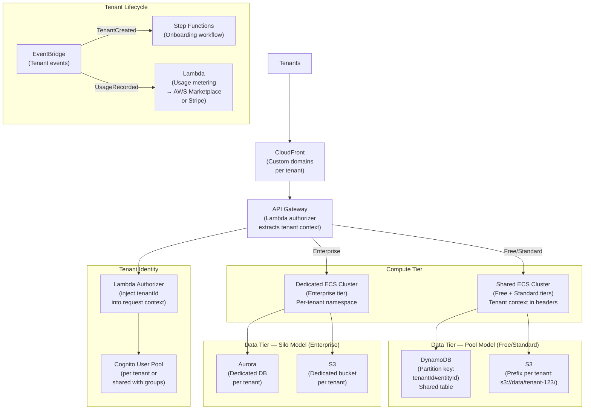
```mermaid
graph TB
    TENANTS["Tenants"] --> CF_SAAS["CloudFront<br/>(Custom domains<br/>per tenant)"]
    CF_SAAS --> APIGW_SAAS["API Gateway<br/>(Lambda authorizer<br/>extracts tenant context)"]

    subgraph "Tenant Identity"
        COGNITO["Cognito User Pool<br/>(per tenant or<br/>shared with groups)"]
        AUTHORIZER["Lambda Authorizer<br/>(inject tenantId<br/>into request context)"]
    end

    APIGW_SAAS --> AUTHORIZER
    AUTHORIZER --> COGNITO

    subgraph "Compute Tier"
        SHARED_ECS["Shared ECS Cluster<br/>(Free + Standard tiers)<br/>Tenant context in headers"]
        SILO_ECS["Dedicated ECS Cluster<br/>(Enterprise tier)<br/>Per-tenant namespace"]
    end

    APIGW_SAAS -->|"Free/Standard"| SHARED_ECS
    APIGW_SAAS -->|"Enterprise"| SILO_ECS

    subgraph "Data Tier — Pool Model (Free/Standard)"
        DDB_POOL["DynamoDB<br/>(Partition key:<br/>tenantId#entityId)<br/>Shared table"]
        S3_POOL["S3<br/>(Prefix per tenant:<br/>s3://data/tenant-123/)"]
    end

    subgraph "Data Tier — Silo Model (Enterprise)"
        AURORA_SILO["Aurora<br/>(Dedicated DB<br/>per tenant)"]
        S3_SILO["S3<br/>(Dedicated bucket<br/>per tenant)"]
    end

    SHARED_ECS --> DDB_POOL & S3_POOL
    SILO_ECS --> AURORA_SILO & S3_SILO

    subgraph "Tenant Lifecycle"
        EB_SAAS["EventBridge<br/>(Tenant events)"]
        SF_ONBOARD["Step Functions<br/>(Onboarding workflow)"]
        BILLING["Lambda<br/>(Usage metering<br/>→ AWS Marketplace<br/>or Stripe)"]
    end

    EB_SAAS -->|"TenantCreated"| SF_ONBOARD
    EB_SAAS -->|"UsageRecorded"| BILLING
```

### Solution Walkthrough

1. **Tenant Identity**: Each tenant can have a Cognito User Pool (silo) or share a User Pool with tenant-specific groups (pool). A Lambda authorizer on API Gateway extracts the `tenantId` from the JWT token and injects it into the request context, ensuring every downstream service knows the tenant.

2. **Tenant Routing**: API Gateway routes requests based on tenant tier. Free and Standard tier tenants share compute and data resources (pool model). Enterprise tenants get dedicated ECS services and databases (silo model). This tiering is stored in a tenant metadata table in DynamoDB.

3. **Data Isolation — Pool Model**: DynamoDB with composite keys (`tenantId#entityId` as partition key) ensures tenant data is logically isolated. IAM policies and DynamoDB fine-grained access control prevent cross-tenant data access. S3 uses prefix-based isolation with bucket policies scoped to the tenant prefix.

4. **Data Isolation — Silo Model**: Enterprise tenants get a dedicated Aurora database and S3 bucket. These are provisioned automatically by the onboarding workflow and destroyed during offboarding.

5. **Tenant Onboarding**: When a new tenant signs up, an EventBridge event triggers a Step Functions workflow that: creates the Cognito user pool/group, provisions data resources (DynamoDB items or Aurora database), configures IAM policies, sets up DNS (custom domain via Route 53), and sends a welcome email via SES.

6. **Billing & Metering**: Every API call emits a usage event to EventBridge. A Lambda function aggregates usage per tenant per hour and writes to a billing DynamoDB table. For AWS Marketplace SaaS listings, usage is reported via the Marketplace Metering API. For self-managed billing, aggregate data feeds into Stripe.

### Key Decisions
| Decision | Choice | Why |
|----------|--------|-----|
| Pool vs Silo | Tiered approach | Balances cost (pool for small) with isolation (silo for enterprise) |
| Tenant context | JWT + Lambda authorizer | Consistent tenant injection without app code changes |
| Onboarding | Step Functions | Complex multi-step workflow with error handling and rollback |
| Data isolation (pool) | DynamoDB partition key | Natural tenant isolation at the database level |

---

## Scenario 10: Real-Time IoT Analytics Platform

### Problem
Design a platform that ingests telemetry data from millions of IoT devices, processes it in real-time for alerting, and stores it for historical analytics and device management.

### Requirements
- Support 5 million connected devices, each sending data every 30 seconds
- Real-time alerting on anomalous readings (< 5 second latency)
- Historical analytics on months of telemetry data
- Device state management (last known state, connectivity status)
- Secure device communication (mutual TLS)

### Architecture

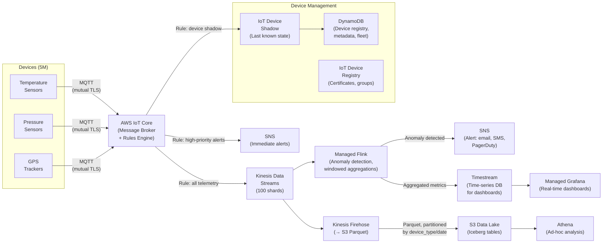
```mermaid
graph LR
    subgraph "Devices (5M)"
        SENSOR1["Temperature<br/>Sensors"]
        SENSOR2["Pressure<br/>Sensors"]
        SENSOR3["GPS<br/>Trackers"]
    end

    SENSOR1 & SENSOR2 & SENSOR3 -->|"MQTT<br/>(mutual TLS)"| IOTCORE["AWS IoT Core<br/>(Message Broker<br/>+ Rules Engine)"]

    IOTCORE -->|"Rule: all telemetry"| KDS_IOT["Kinesis Data<br/>Streams<br/>(100 shards)"]
    IOTCORE -->|"Rule: device shadow"| SHADOW["IoT Device<br/>Shadow<br/>(Last known state)"]
    IOTCORE -->|"Rule: high-priority alerts"| SNS_IOT["SNS<br/>(Immediate alerts)"]

    KDS_IOT --> FLINK_IOT["Managed Flink<br/>(Anomaly detection,<br/>windowed aggregations)"]
    KDS_IOT --> FIREHOSE_IOT["Kinesis Firehose<br/>(→ S3 Parquet)"]

    FLINK_IOT -->|"Anomaly detected"| SNS_ALERT["SNS<br/>(Alert: email, SMS,<br/>PagerDuty)"]
    FLINK_IOT -->|"Aggregated metrics"| TIMESTREAM["Timestream<br/>(Time-series DB<br/>for dashboards)"]

    FIREHOSE_IOT -->|"Parquet, partitioned<br/>by device_type/date"| S3_IOT["S3 Data Lake<br/>(Iceberg tables)"]

    S3_IOT --> ATHENA_IOT["Athena<br/>(Ad-hoc analysis)"]
    TIMESTREAM --> GRAFANA_IOT["Managed Grafana<br/>(Real-time dashboards)"]

    subgraph "Device Management"
        SHADOW --> DDB_DEVICE["DynamoDB<br/>(Device registry,<br/>metadata, fleet)"]
        REGISTRY["IoT Device<br/>Registry<br/>(Certificates, groups)"]
    end
```

### Solution Walkthrough

1. **Device Communication**: AWS IoT Core handles MQTT connections with mutual TLS authentication. Each device has an X.509 certificate provisioned via IoT Device Provisioning. IoT Core scales to millions of concurrent connections.

2. **Ingestion & Routing**: IoT Rules Engine routes messages based on topic and content. All telemetry goes to Kinesis Data Streams for processing. High-priority alerts (e.g., temperature > critical threshold) route directly to SNS for immediate notification. Device state updates go to IoT Device Shadow.

3. **Real-Time Processing**: Managed Apache Flink processes the Kinesis stream with sliding windows for anomaly detection — comparing current readings against rolling averages to detect deviations. Aggregated metrics (average temperature per building per minute) write to Amazon Timestream for time-series dashboards.

4. **Historical Storage**: Kinesis Firehose converts telemetry to Parquet format (using Glue Data Catalog schema) and delivers to S3 partitioned by `device_type/year/month/day`. Apache Iceberg table format enables time travel queries and efficient upserts. Athena provides SQL analytics on historical data.

5. **Device Management**: IoT Device Shadow stores the last reported and desired state for each device (even when offline). DynamoDB serves as the device registry with metadata, fleet grouping, and firmware version tracking. IoT Jobs manages over-the-air (OTA) firmware updates.

6. **Dashboards**: Managed Grafana connects to Timestream for real-time operational dashboards (fleet health, anomaly rates) and Athena for historical trend analysis.

### Key Decisions
| Decision | Choice | Why |
|----------|--------|-----|
| Ingestion | IoT Core + Kinesis | IoT Core handles MQTT/TLS at scale; Kinesis decouples processing |
| Real-time DB | Timestream | Purpose-built for time-series with automatic tiering and fast queries |
| Historical storage | S3 + Iceberg + Athena | Cost-effective, ACID transactions, time travel |
| Anomaly detection | Managed Flink | Complex windowed processing with exactly-once semantics |

---

## Scenario 11: Healthcare Application (HIPAA Compliant)

### Problem
Design a healthcare application that stores and processes Protected Health Information (PHI) while maintaining full HIPAA compliance, providing an audit trail, and ensuring data is encrypted at every layer.

### Requirements
- HIPAA compliance (BAA with AWS required)
- PHI must be encrypted at rest and in transit everywhere
- Complete audit trail of all data access
- Data retention for 7 years with immutability
- Access control: role-based (doctors, nurses, admins, patients)
- 99.99% availability for the patient portal

### Architecture

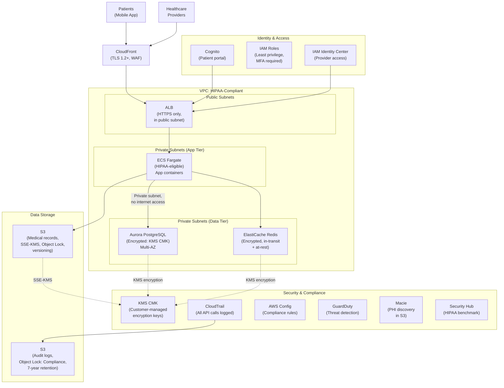
```mermaid
graph TB
    PATIENTS["Patients<br/>(Mobile App)"] --> CF_HC["CloudFront<br/>(TLS 1.2+, WAF)"]
    DOCTORS["Healthcare<br/>Providers"] --> CF_HC

    CF_HC --> ALB_HC["ALB<br/>(HTTPS only,<br/>in public subnet)"]

    subgraph VPC_HC["VPC: HIPAA-Compliant"]
        subgraph "Public Subnets"
            ALB_HC
        end

        subgraph "Private Subnets (App Tier)"
            ECS_HC["ECS Fargate<br/>(HIPAA-eligible)<br/>App containers"]
        end

        subgraph "Private Subnets (Data Tier)"
            AURORA_HC["Aurora PostgreSQL<br/>(Encrypted: KMS CMK)<br/>Multi-AZ"]
            REDIS_HC["ElastiCache Redis<br/>(Encrypted, in-transit<br/>+ at-rest)"]
        end

        ECS_HC -->|"Private subnet,<br/>no internet access"| AURORA_HC
        ECS_HC --> REDIS_HC
        ALB_HC --> ECS_HC
    end

    subgraph "Security & Compliance"
        KMS_HC["KMS CMK<br/>(Customer-managed<br/>encryption keys)"]
        CT_HC["CloudTrail<br/>(All API calls logged)"]
        CONFIG_HC["AWS Config<br/>(Compliance rules)"]
        GD_HC["GuardDuty<br/>(Threat detection)"]
        MACIE_HC["Macie<br/>(PHI discovery<br/>in S3)"]
        SH_HC["Security Hub<br/>(HIPAA benchmark)"]
    end

    subgraph "Data Storage"
        S3_HC["S3<br/>(Medical records,<br/>SSE-KMS, Object Lock,<br/>versioning)"]
        S3_LOGS["S3<br/>(Audit logs,<br/>Object Lock: Compliance,<br/>7-year retention)"]
    end

    ECS_HC --> S3_HC
    CT_HC --> S3_LOGS

    subgraph "Identity & Access"
        COGNITO_HC["Cognito<br/>(Patient portal)"]
        IAM_HC["IAM Roles<br/>(Least privilege,<br/>MFA required)"]
        SSO_HC["IAM Identity Center<br/>(Provider access)"]
    end

    COGNITO_HC --> ALB_HC
    SSO_HC --> ALB_HC

    AURORA_HC -.->|"KMS encryption"| KMS_HC
    S3_HC -.->|"SSE-KMS"| KMS_HC
    REDIS_HC -.->|"KMS encryption"| KMS_HC
```

### Solution Walkthrough

1. **BAA Prerequisite**: Sign a Business Associate Agreement (BAA) with AWS. Only use HIPAA-eligible services (Aurora, S3, ECS Fargate, Lambda, KMS, CloudTrail, etc.). AWS publishes the list of eligible services.

2. **Encryption Everywhere**: All data encrypted at rest using customer-managed KMS CMKs (not AWS-managed) for full key control. Aurora, S3, EBS, ElastiCache, and SQS all use KMS encryption. All data in transit uses TLS 1.2+. CloudFront enforces HTTPS-only. VPC endpoints eliminate data traversing the public internet.

3. **Network Isolation**: Application and data tiers in private subnets with no internet access. VPC endpoints (Interface endpoints) for AWS services (S3, KMS, STS, CloudWatch). Security Groups restrict traffic to minimum necessary ports. NACLs provide additional defense-in-depth.

4. **Audit Trail**: CloudTrail logs every API call to S3 with Object Lock (Compliance mode) and a 7-year retention policy — logs cannot be deleted even by root. AWS Config rules continuously evaluate compliance (encryption enabled, public access blocked, logging enabled). VPC Flow Logs capture network traffic for forensic analysis.

5. **Access Control**: Cognito for patient self-service (MFA required). IAM Identity Center with SAML federation for healthcare providers (role-based: doctor, nurse, admin). IAM policies enforce least privilege. CloudTrail Data Events log every S3 object access and DynamoDB read.

6. **Data Protection**: S3 Object Lock (Compliance mode) prevents deletion of medical records. S3 Versioning preserves all versions. Macie automatically discovers and classifies PHI in S3 buckets. DLP policies prevent accidental exposure.

7. **Monitoring**: Security Hub runs the HIPAA benchmark to identify non-compliant resources. GuardDuty detects anomalous access patterns. CloudWatch Alarms on authentication failures, unauthorized access attempts, and configuration changes.

### Key Decisions
| Decision | Choice | Why |
|----------|--------|-----|
| Encryption keys | Customer-managed CMK | Required for full control, key rotation auditing |
| Log retention | S3 Object Lock Compliance | Meets 7-year retention; even root cannot delete |
| Compute | ECS Fargate | HIPAA-eligible, no server management, no SSH access |
| PHI discovery | Macie | Automated PII/PHI detection in S3 |

---

## Scenario 12: Event-Driven E-Commerce Order Processing

### Problem
Design an order processing system for an e-commerce platform that handles flash sales (100x normal traffic), processes payments reliably with exactly-once semantics, and provides real-time order status updates to customers.

### Requirements
- Handle flash sales: 100x spike (from 100 to 10,000 orders/second)
- Exactly-once payment processing (never double-charge)
- Eventual consistency acceptable for non-payment operations
- Real-time order status updates (WebSocket)
- Saga pattern for distributed transaction (order → payment → inventory → shipping)

### Architecture

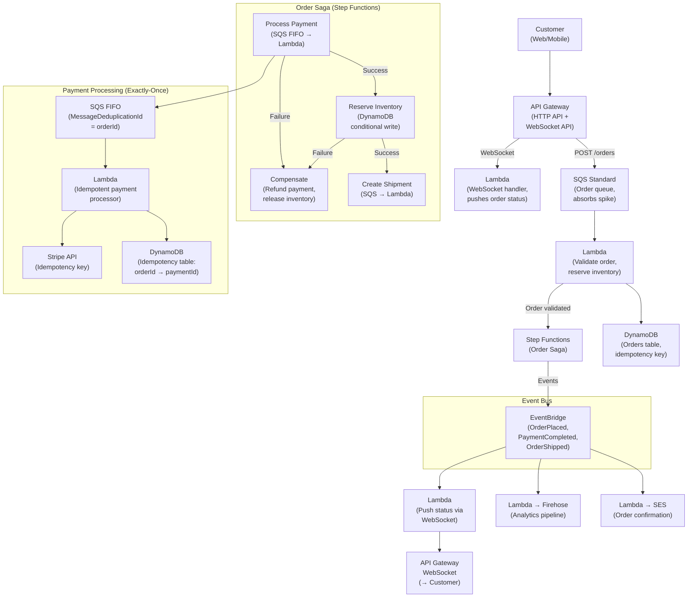
```mermaid
graph TB
    CUSTOMER["Customer<br/>(Web/Mobile)"] --> APIGW_EC["API Gateway<br/>(HTTP API +<br/>WebSocket API)"]

    APIGW_EC -->|"POST /orders"| SQS_ORDER["SQS Standard<br/>(Order queue,<br/>absorbs spike)"]
    APIGW_EC -->|"WebSocket"| LAMBDA_WS["Lambda<br/>(WebSocket handler,<br/>pushes order status)"]

    SQS_ORDER --> LAMBDA_PROC["Lambda<br/>(Validate order,<br/>reserve inventory)"]
    LAMBDA_PROC --> DDB_ORDER["DynamoDB<br/>(Orders table,<br/>idempotency key)"]

    LAMBDA_PROC -->|"Order validated"| SF_SAGA["Step Functions<br/>(Order Saga)"]

    subgraph "Order Saga (Step Functions)"
        PAY_STEP["Process Payment<br/>(SQS FIFO →<br/>Lambda)"]
        INV_STEP["Reserve Inventory<br/>(DynamoDB<br/>conditional write)"]
        SHIP_STEP["Create Shipment<br/>(SQS → Lambda)"]
        COMPENSATE["Compensate<br/>(Refund payment,<br/>release inventory)"]

        PAY_STEP -->|"Success"| INV_STEP
        INV_STEP -->|"Success"| SHIP_STEP
        PAY_STEP -->|"Failure"| COMPENSATE
        INV_STEP -->|"Failure"| COMPENSATE
    end

    subgraph "Payment Processing (Exactly-Once)"
        SQS_FIFO["SQS FIFO<br/>(MessageDeduplicationId<br/>= orderId)"]
        LAMBDA_PAY["Lambda<br/>(Idempotent payment<br/>processor)"]
        DDB_IDEM["DynamoDB<br/>(Idempotency table:<br/>orderId → paymentId)"]
        STRIPE_EC["Stripe API<br/>(Idempotency key)"]
    end

    PAY_STEP --> SQS_FIFO --> LAMBDA_PAY
    LAMBDA_PAY --> DDB_IDEM
    LAMBDA_PAY --> STRIPE_EC

    subgraph "Event Bus"
        EB_EC["EventBridge<br/>(OrderPlaced,<br/>PaymentCompleted,<br/>OrderShipped)"]
    end

    SF_SAGA -->|"Events"| EB_EC
    EB_EC --> LAMBDA_EMAIL["Lambda → SES<br/>(Order confirmation)"]
    EB_EC --> LAMBDA_ANALYTICS["Lambda → Firehose<br/>(Analytics pipeline)"]
    EB_EC --> LAMBDA_WS2["Lambda<br/>(Push status via<br/>WebSocket)"]

    LAMBDA_WS2 --> APIGW_WS["API Gateway<br/>WebSocket<br/>(→ Customer)"]
```

### Solution Walkthrough

1. **Absorbing Traffic Spikes**: API Gateway receives order requests and immediately publishes to an SQS Standard queue. This decouples the customer-facing API from processing — during a flash sale, the queue absorbs the spike while Lambda processes at a controlled concurrency (reserved concurrency prevents overwhelming downstream services). Customers receive an immediate "order received" response with an orderId.

2. **Order Validation**: Lambda consumes from SQS, validates the order (product exists, price correct, customer verified), and writes to DynamoDB with a conditional write (prevents duplicate orders using an idempotency key). Valid orders trigger the Step Functions saga.

3. **Saga Pattern**: Step Functions orchestrates the distributed transaction as a saga. Each step (payment, inventory, shipping) is an independent operation. If any step fails, Step Functions executes compensating transactions — refund the payment, release the inventory reservation. This replaces traditional distributed transactions (2PC) with an eventually consistent but reliable pattern.

4. **Exactly-Once Payments**: SQS FIFO queue with `MessageDeduplicationId` set to the orderId ensures each order is processed once. The Lambda payment processor checks DynamoDB for an existing payment record before charging. Stripe's idempotency key (set to orderId) prevents double-charges even if the Lambda retries. This three-layer defense (FIFO dedup, DynamoDB conditional write, Stripe idempotency) guarantees exactly-once payment processing.

5. **Event-Driven Side Effects**: Every state change emits an event to EventBridge. Downstream consumers react independently: SES sends confirmation emails, Firehose streams order data to S3 for analytics, and a Lambda function pushes real-time status updates through the API Gateway WebSocket connection.

6. **Real-Time Order Tracking**: API Gateway WebSocket API maintains persistent connections with customers. When an order status changes (confirmed, paid, shipped), a Lambda function pushes the update through the WebSocket. Connection IDs are stored in DynamoDB, keyed by customerId.

### Key Decisions
| Decision | Choice | Why |
|----------|--------|-----|
| Spike absorption | SQS Standard queue | Unlimited throughput, decouples API from processing |
| Payment ordering | SQS FIFO | Exactly-once delivery per orderId, prevents double-processing |
| Distributed transaction | Step Functions saga | Reliable compensation, visual debugging, built-in retry |
| Exactly-once payment | 3-layer idempotency | FIFO + DynamoDB conditional write + Stripe idempotency key |
| Real-time updates | WebSocket API | Push-based, lower latency than polling |

---

---

## Scenario 13: Production Database at 95% CPU — Troubleshooting Runbook

### Problem Statement
Your production Aurora MySQL cluster's writer instance is at 95% CPU. Application response times have tripled. The on-call page fires at 2 AM. Walk through your investigation and resolution.

### Investigation Flow

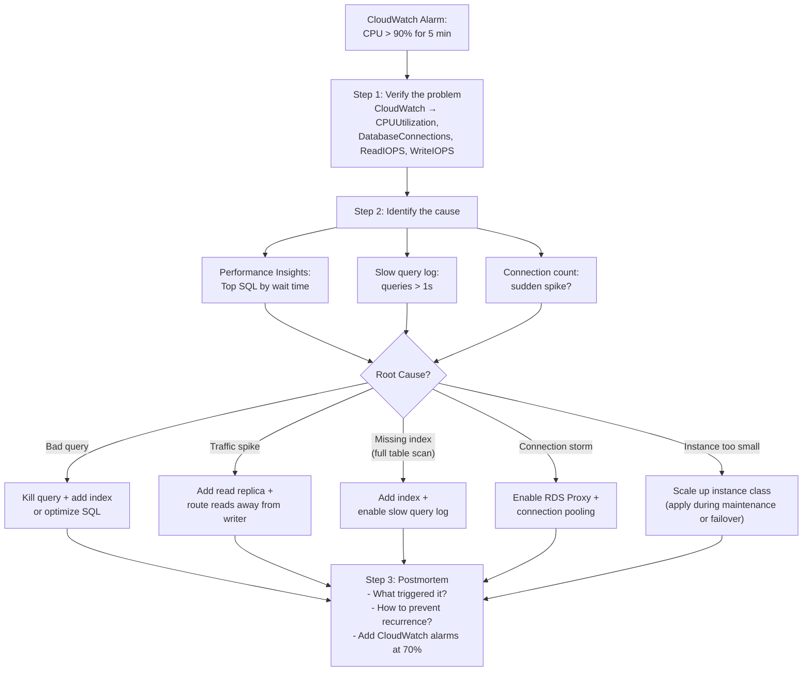
```mermaid
flowchart TD
    ALERT["CloudWatch Alarm:<br/>CPU > 90% for 5 min"]
    ALERT --> VERIFY["Step 1: Verify the problem<br/>CloudWatch → CPUUtilization,<br/>DatabaseConnections, ReadIOPS, WriteIOPS"]

    VERIFY --> IDENTIFY["Step 2: Identify the cause"]
    IDENTIFY --> PI["Performance Insights:<br/>Top SQL by wait time"]
    IDENTIFY --> SLOW["Slow query log:<br/>queries > 1s"]
    IDENTIFY --> CONN["Connection count:<br/>sudden spike?"]

    PI --> CAUSE{Root Cause?}
    SLOW --> CAUSE
    CONN --> CAUSE

    CAUSE -->|"Bad query"| FIX_QUERY["Kill query + add index<br/>or optimize SQL"]
    CAUSE -->|"Traffic spike"| FIX_TRAFFIC["Add read replica +<br/>route reads away from writer"]
    CAUSE -->|"Missing index<br/>(full table scan)"| FIX_INDEX["Add index +<br/>enable slow query log"]
    CAUSE -->|"Connection storm"| FIX_CONN["Enable RDS Proxy +<br/>connection pooling"]
    CAUSE -->|"Instance too small"| FIX_SIZE["Scale up instance class<br/>(apply during maintenance or failover)"]

    FIX_QUERY --> POSTMORTEM["Step 3: Postmortem<br/>- What triggered it?<br/>- How to prevent recurrence?<br/>- Add CloudWatch alarms at 70%"]
    FIX_TRAFFIC --> POSTMORTEM
    FIX_INDEX --> POSTMORTEM
    FIX_CONN --> POSTMORTEM
    FIX_SIZE --> POSTMORTEM
```

### Key Decisions
| Decision | Choice | Why |
|----------|--------|-----|
| First diagnostic tool | Performance Insights | Shows top SQL by wait time without SSH access |
| Immediate mitigation | Kill long-running query / add replica | Buys time before root cause fix |
| Long-term fix | RDS Proxy + read replicas + query optimization | Addresses all common causes |
| Prevention | CloudWatch alarm at 70%, slow query log always on | Early warning before 95% crisis |

---

## Scenario 14: Zero-Downtime Migration from EC2 to EKS

### Problem Statement
Your company runs 15 microservices on EC2 instances behind an ALB. You need to migrate to EKS without any downtime or customer impact. Design the migration strategy.

### Architecture — Phased Migration

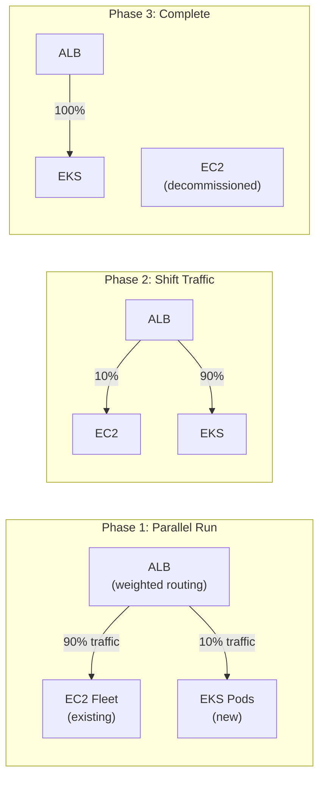
```mermaid
flowchart LR
    subgraph "Phase 1: Parallel Run"
        ALB["ALB<br/>(weighted routing)"]
        ALB -->|"90% traffic"| EC2["EC2 Fleet<br/>(existing)"]
        ALB -->|"10% traffic"| EKS["EKS Pods<br/>(new)"]
    end

    subgraph "Phase 2: Shift Traffic"
        ALB2["ALB"]
        ALB2 -->|"10%"| EC2_2["EC2"]
        ALB2 -->|"90%"| EKS_2["EKS"]
    end

    subgraph "Phase 3: Complete"
        ALB3["ALB"]
        ALB3 -->|"100%"| EKS_3["EKS"]
        EC2_3["EC2<br/>(decommissioned)"]
    end
```

### Migration Steps

1. **Containerize one service at a time** — start with the least critical service. Create Dockerfile, test locally, push to ECR.
2. **Deploy to EKS alongside EC2** — both targets registered in the same ALB target group with weighted routing.
3. **Canary traffic (10%)** — route 10% to EKS, monitor latency, error rates, and resource usage for 48 hours.
4. **Shift to 50/50** — if metrics match, increase EKS traffic. Compare CloudWatch dashboards side-by-side.
5. **Full cutover (100% to EKS)** — keep EC2 instances running but receiving no traffic for 24 hours (instant rollback).
6. **Decommission EC2** — terminate instances, clean up AMIs, security groups, and IAM roles.
7. **Repeat for next service** — migrate one service per sprint using the same pattern.

### Key Decisions
| Decision | Choice | Why |
|----------|--------|-----|
| Migration pattern | Strangler fig with weighted ALB | Zero downtime, instant rollback |
| Service order | Least critical first | Learn the process on low-risk services |
| Traffic shift speed | 10% → 50% → 100% over 1 week per service | Time to catch issues at each stage |
| Rollback strategy | Keep EC2 running 24h after cutover | One ALB weight change to roll back |

---

## Scenario 15: Lambda Function Intermittent Timeouts — Debugging

### Problem Statement
A Lambda function processing SQS messages is timing out intermittently (~5% of invocations). The function normally completes in 2 seconds but occasionally hits the 30-second timeout. Diagnose and fix it.

### Debugging Flow

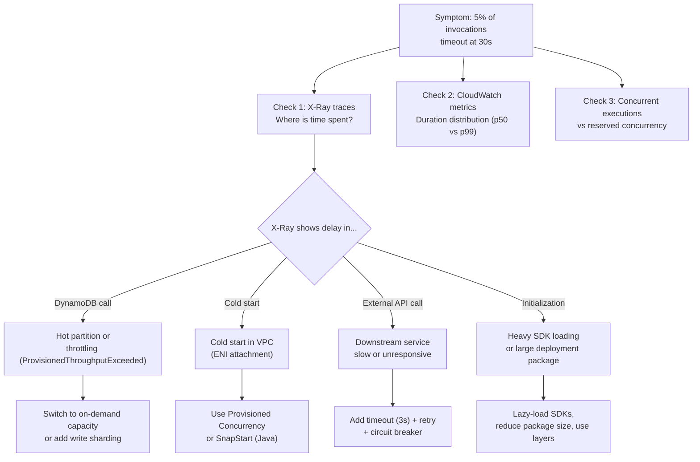
```mermaid
flowchart TD
    SYMPTOM["Symptom: 5% of invocations<br/>timeout at 30s"]

    SYMPTOM --> CHECK1["Check 1: X-Ray traces<br/>Where is time spent?"]
    SYMPTOM --> CHECK2["Check 2: CloudWatch metrics<br/>Duration distribution (p50 vs p99)"]
    SYMPTOM --> CHECK3["Check 3: Concurrent executions<br/>vs reserved concurrency"]

    CHECK1 --> XRAY_RESULT{X-Ray shows delay in...}

    XRAY_RESULT -->|"DynamoDB call"| CAUSE_DDB["Hot partition or<br/>throttling (ProvisionedThroughputExceeded)"]
    XRAY_RESULT -->|"Cold start"| CAUSE_COLD["Cold start in VPC<br/>(ENI attachment)"]
    XRAY_RESULT -->|"External API call"| CAUSE_API["Downstream service<br/>slow or unresponsive"]
    XRAY_RESULT -->|"Initialization"| CAUSE_INIT["Heavy SDK loading<br/>or large deployment package"]

    CAUSE_DDB --> FIX_DDB["Switch to on-demand capacity<br/>or add write sharding"]
    CAUSE_COLD --> FIX_COLD["Use Provisioned Concurrency<br/>or SnapStart (Java)"]
    CAUSE_API --> FIX_API["Add timeout (3s) + retry<br/>+ circuit breaker"]
    CAUSE_INIT --> FIX_INIT["Lazy-load SDKs,<br/>reduce package size, use layers"]
```

### Resolution Strategy

| Cause | Fix | Prevention |
|-------|-----|-----------|
| Cold starts (VPC) | Provisioned Concurrency (5-10 instances) | Costs ~$15/month per instance but eliminates cold starts |
| Downstream timeout | Set HTTP timeout to 5s, retry 2x with backoff | Never use default SDK timeout (infinite in some SDKs) |
| DynamoDB throttling | On-demand mode or increase provisioned WCU | CloudWatch alarm on ThrottledRequests |
| Large package | Use Lambda Layers, remove unused dependencies | Keep deployment package under 50 MB |
| SQS batch too large | Reduce batch size from 10 to 5 | Ensure batch window × batch size < timeout |

---

## Scenario 16: S3 Cost Spike Investigation — 40% Increase

### Problem Statement
Your AWS bill shows S3 costs jumped 40% month-over-month. No new features were launched. Investigate and optimize.

### Investigation Runbook

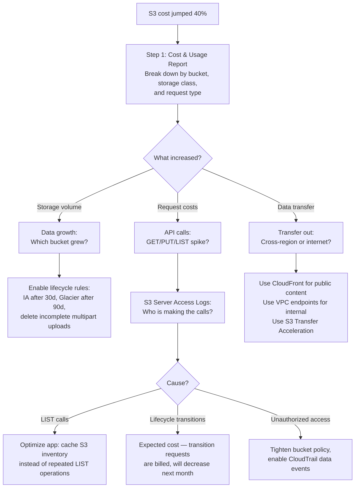
```mermaid
flowchart TD
    SPIKE["S3 cost jumped 40%"]

    SPIKE --> CUR["Step 1: Cost & Usage Report<br/>Break down by bucket, storage class,<br/>and request type"]

    CUR --> STORAGE_COST{What increased?}

    STORAGE_COST -->|"Storage volume"| VOL["Data growth:<br/>Which bucket grew?"]
    STORAGE_COST -->|"Request costs"| REQ["API calls:<br/>GET/PUT/LIST spike?"]
    STORAGE_COST -->|"Data transfer"| XFER["Transfer out:<br/>Cross-region or internet?"]

    VOL --> VOL_FIX["Enable lifecycle rules:<br/>IA after 30d, Glacier after 90d,<br/>delete incomplete multipart uploads"]
    REQ --> REQ_INVESTIGATE["S3 Server Access Logs:<br/>Who is making the calls?"]
    XFER --> XFER_FIX["Use CloudFront for public content<br/>Use VPC endpoints for internal<br/>Use S3 Transfer Acceleration"]

    REQ_INVESTIGATE --> REQ_CAUSE{Cause?}
    REQ_CAUSE -->|"LIST calls"| LIST_FIX["Optimize app: cache S3 inventory<br/>instead of repeated LIST operations"]
    REQ_CAUSE -->|"Lifecycle transitions"| TRANS_FIX["Expected cost — transition requests<br/>are billed, will decrease next month"]
    REQ_CAUSE -->|"Unauthorized access"| AUTH_FIX["Tighten bucket policy,<br/>enable CloudTrail data events"]
```

### Common S3 Cost Traps

| Trap | Why It's Expensive | Fix |
|------|-------------------|-----|
| No lifecycle rules | Data stays in Standard forever | Move to IA (30d), Glacier (90d), delete (365d) |
| Incomplete multipart uploads | Orphaned parts accumulate silently | Lifecycle rule: abort incomplete uploads after 7 days |
| Frequent LIST operations | $5 per million LIST requests | Cache inventory results, use S3 Inventory for bulk listing |
| Cross-region replication without lifecycle | Replicated data also needs lifecycle rules | Apply matching lifecycle rules to destination bucket |
| Versioning without expiration | Old versions accumulate | Lifecycle: expire noncurrent versions after 30 days |
| Intelligent-Tiering monitoring fee | $0.0025 per 1,000 objects/month | Only use for objects > 128 KB with unpredictable access |

---

## Scenario 17: Automated Incident Response — Security Breach Detection

### Problem Statement
Design an automated incident response system that detects, contains, and notifies when a potential security breach occurs (compromised IAM credentials, unauthorized API calls, or data exfiltration).

### Architecture

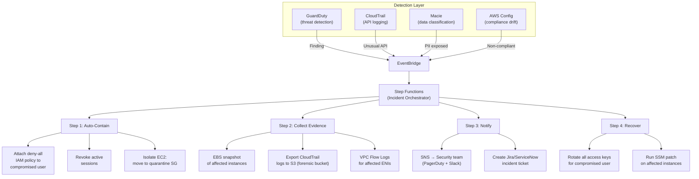
```mermaid
flowchart TB
    subgraph "Detection Layer"
        GD["GuardDuty<br/>(threat detection)"]
        CT["CloudTrail<br/>(API logging)"]
        MACIE["Macie<br/>(data classification)"]
        CONFIG["AWS Config<br/>(compliance drift)"]
    end

    GD -->|"Finding"| EB["EventBridge"]
    CT -->|"Unusual API"| EB
    MACIE -->|"PII exposed"| EB
    CONFIG -->|"Non-compliant"| EB

    EB --> SF["Step Functions<br/>(Incident Orchestrator)"]

    SF --> CONTAIN["Step 1: Auto-Contain"]
    CONTAIN --> ISOLATE["Attach deny-all<br/>IAM policy to<br/>compromised user"]
    CONTAIN --> REVOKE["Revoke active<br/>sessions"]
    CONTAIN --> SG["Isolate EC2:<br/>move to quarantine SG"]

    SF --> COLLECT["Step 2: Collect Evidence"]
    COLLECT --> SNAP["EBS snapshot<br/>of affected instances"]
    COLLECT --> LOGS["Export CloudTrail<br/>logs to S3 (forensic bucket)"]
    COLLECT --> FLOW["VPC Flow Logs<br/>for affected ENIs"]

    SF --> NOTIFY["Step 3: Notify"]
    NOTIFY --> SNS_SEC["SNS → Security team<br/>(PagerDuty + Slack)"]
    NOTIFY --> TICKET["Create Jira/ServiceNow<br/>incident ticket"]

    SF --> RECOVER["Step 4: Recover"]
    RECOVER --> ROTATE["Rotate all access keys<br/>for compromised user"]
    RECOVER --> PATCH["Run SSM patch<br/>on affected instances"]
```

### Key Decisions
| Decision | Choice | Why |
|----------|--------|-----|
| Detection | GuardDuty + CloudTrail + Macie | Multi-layer: threats, API anomalies, data exposure |
| Automation trigger | EventBridge → Step Functions | Serverless, visual workflow, built-in retry |
| Auto-containment | Deny-all IAM policy (not delete) | Preserves evidence; deletion destroys audit trail |
| Evidence preservation | EBS snapshots + CloudTrail export to locked S3 | Immutable evidence for forensic investigation |
| Notification | SNS → PagerDuty + Slack + ticket creation | Ensures human review of automated actions |

---

## Scenario 18: Design a Multi-Account CI/CD Pipeline for 10 Microservices

### Problem Statement
Your organization has 10 microservices across 4 AWS accounts (dev, staging, prod, shared-services). Design a CI/CD pipeline that deploys all services with proper isolation, approval gates, and rollback capability.

### Architecture

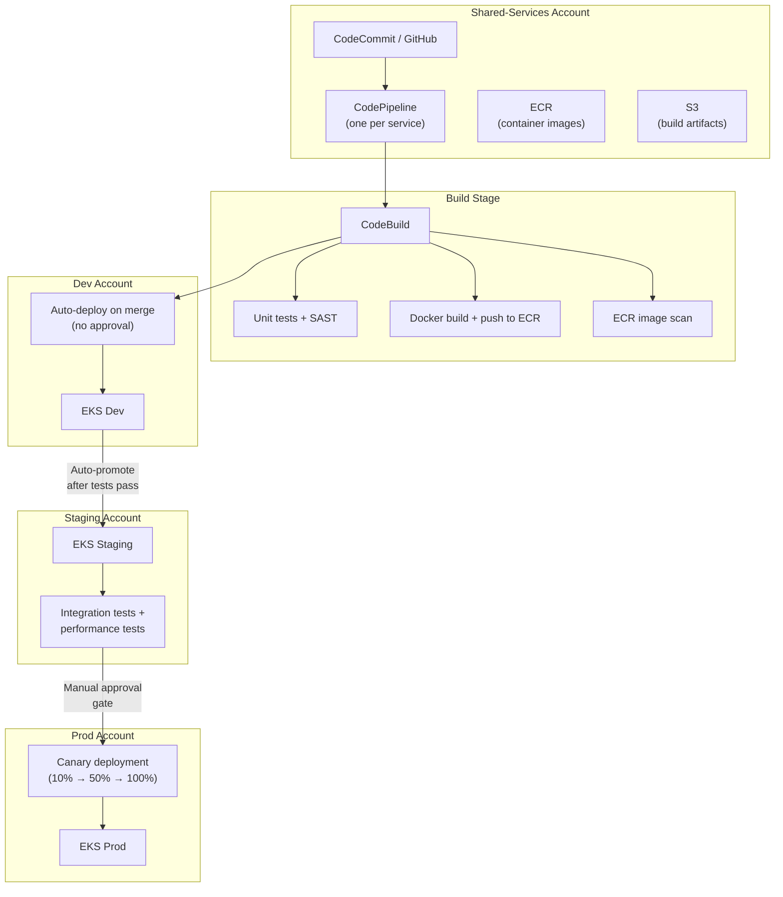
```mermaid
flowchart TB
    subgraph "Shared-Services Account"
        REPO["CodeCommit / GitHub"]
        PIPE["CodePipeline<br/>(one per service)"]
        ECR["ECR<br/>(container images)"]
        ARTIFACTS["S3<br/>(build artifacts)"]
    end

    subgraph "Build Stage"
        CB["CodeBuild"]
        CB --> TEST["Unit tests + SAST"]
        CB --> BUILD["Docker build + push to ECR"]
        CB --> SCAN["ECR image scan"]
    end

    subgraph "Dev Account"
        DEV_EKS["EKS Dev"]
        DEV_DEPLOY["Auto-deploy on merge<br/>(no approval)"]
    end

    subgraph "Staging Account"
        STG_EKS["EKS Staging"]
        STG_TEST["Integration tests +<br/>performance tests"]
    end

    subgraph "Prod Account"
        PROD_EKS["EKS Prod"]
        PROD_CANARY["Canary deployment<br/>(10% → 50% → 100%)"]
    end

    REPO --> PIPE --> CB
    CB --> DEV_DEPLOY --> DEV_EKS
    DEV_EKS -->|"Auto-promote<br/>after tests pass"| STG_EKS
    STG_EKS --> STG_TEST
    STG_TEST -->|"Manual approval<br/>gate"| PROD_CANARY --> PROD_EKS
```

### Cross-Account Access Pattern

| Component | Account | Access Method |
|-----------|---------|---------------|
| CodePipeline | Shared-services | Assumes cross-account IAM roles in each target account |
| ECR images | Shared-services | Resource-based policy allows pull from dev/staging/prod |
| KMS (artifact encryption) | Shared-services | Key policy grants decrypt to target account roles |
| EKS deployment | Each target account | CodeBuild assumes role → kubectl apply |
| Approval gate | Prod account | SNS notification → manual approval in CodePipeline console |

### Rollback Strategy
1. **Dev/Staging**: Automatic rollback via Kubernetes rolling update (readiness probe fails → rollback)
2. **Prod canary**: CloudWatch alarm on error rate → automatic rollback to previous version
3. **Emergency**: One-click rollback in CodePipeline to redeploy last known good artifact

---

## Scenario 19: Diagnosing and Fixing DynamoDB Throttling in Production

### Problem Statement
Your DynamoDB table is experiencing intermittent `ProvisionedThroughputExceededException` errors during business hours despite auto-scaling being enabled. Orders are being dropped. Investigate and resolve.

### Investigation Flow

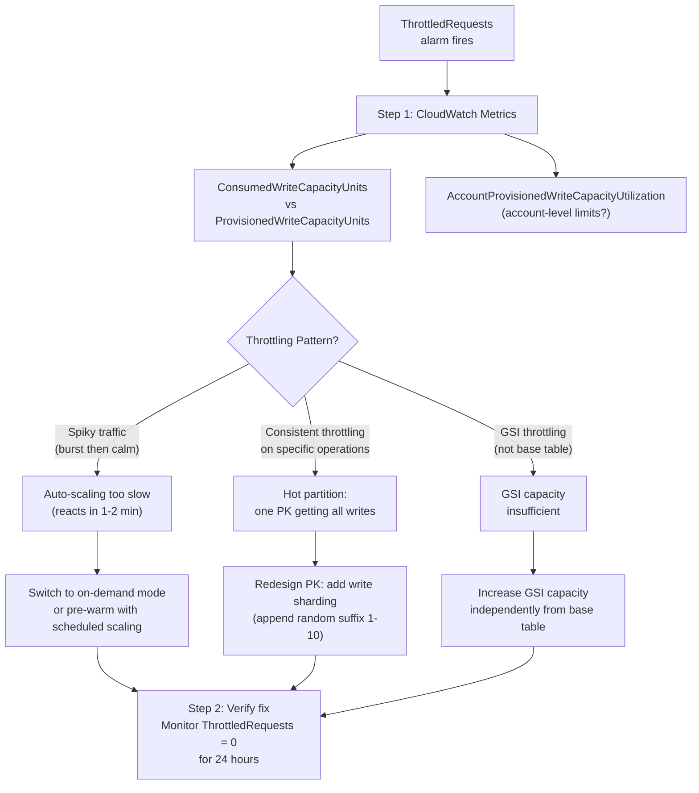
```mermaid
flowchart TD
    THROTTLE["ThrottledRequests<br/>alarm fires"]

    THROTTLE --> METRICS["Step 1: CloudWatch Metrics"]
    METRICS --> CONSUMED["ConsumedWriteCapacityUnits<br/>vs ProvisionedWriteCapacityUnits"]
    METRICS --> ACCOUNT["AccountProvisionedWriteCapacityUtilization<br/>(account-level limits?)"]

    CONSUMED --> PATTERN{Throttling Pattern?}

    PATTERN -->|"Spiky traffic<br/>(burst then calm)"| CAUSE_BURST["Auto-scaling too slow<br/>(reacts in 1-2 min)"]
    PATTERN -->|"Consistent throttling<br/>on specific operations"| CAUSE_HOT["Hot partition:<br/>one PK getting all writes"]
    PATTERN -->|"GSI throttling<br/>(not base table)"| CAUSE_GSI["GSI capacity<br/>insufficient"]

    CAUSE_BURST --> FIX_BURST["Switch to on-demand mode<br/>or pre-warm with scheduled scaling"]
    CAUSE_HOT --> FIX_HOT["Redesign PK: add write sharding<br/>(append random suffix 1-10)"]
    CAUSE_GSI --> FIX_GSI["Increase GSI capacity<br/>independently from base table"]

    FIX_BURST --> VERIFY["Step 2: Verify fix<br/>Monitor ThrottledRequests = 0<br/>for 24 hours"]
    FIX_HOT --> VERIFY
    FIX_GSI --> VERIFY
```

### Hot Partition Deep Dive

| Symptom | Cause | Fix |
|---------|-------|-----|
| One partition throttled, others idle | Low-cardinality PK (e.g., `status=PENDING`) | Redesign PK to high cardinality |
| Writes spike on single item | Popular product or viral content | Write sharding: `PRODUCT#123#<random(1-10)>` |
| GSI throttled but base table fine | GSI PK has lower cardinality than base | Add GSI with better key distribution |
| Auto-scaling not keeping up | Traffic spikes faster than 1-2 min scaling | On-demand mode or scheduled pre-scaling before known events |

---

## Scenario 20: Recovering from an Accidental Production Deletion

### Problem Statement
An engineer accidentally deleted a critical DynamoDB table in production. The table had 50 million items. Design the recovery process and then implement safeguards to prevent it from happening again.

### Recovery Flow

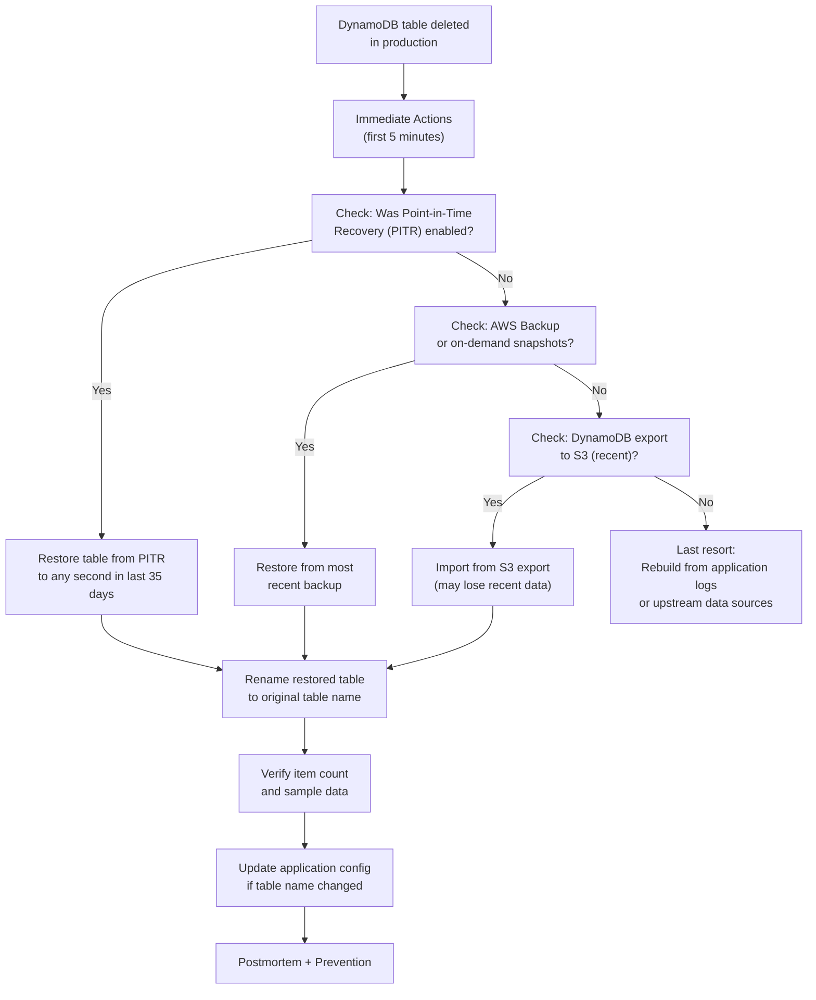
```mermaid
flowchart TD
    DELETED["DynamoDB table deleted<br/>in production"]

    DELETED --> IMMEDIATE["Immediate Actions<br/>(first 5 minutes)"]
    IMMEDIATE --> CHECK_PITR["Check: Was Point-in-Time<br/>Recovery (PITR) enabled?"]

    CHECK_PITR -->|"Yes"| PITR_RESTORE["Restore table from PITR<br/>to any second in last 35 days"]
    CHECK_PITR -->|"No"| CHECK_BACKUP["Check: AWS Backup<br/>or on-demand snapshots?"]

    CHECK_BACKUP -->|"Yes"| BACKUP_RESTORE["Restore from most<br/>recent backup"]
    CHECK_BACKUP -->|"No"| CHECK_EXPORT["Check: DynamoDB export<br/>to S3 (recent)?"]

    CHECK_EXPORT -->|"Yes"| IMPORT_S3["Import from S3 export<br/>(may lose recent data)"]
    CHECK_EXPORT -->|"No"| LAST_RESORT["Last resort:<br/>Rebuild from application logs<br/>or upstream data sources"]

    PITR_RESTORE --> RENAME["Rename restored table<br/>to original table name"]
    BACKUP_RESTORE --> RENAME
    IMPORT_S3 --> RENAME

    RENAME --> VERIFY_DATA["Verify item count<br/>and sample data"]
    VERIFY_DATA --> RECONNECT["Update application config<br/>if table name changed"]
    RECONNECT --> POSTMORTEM["Postmortem + Prevention"]
```

### Prevention Safeguards

| Safeguard | Implementation | What It Prevents |
|-----------|---------------|-----------------|
| **Deletion protection** | `DeletionProtectionEnabled: true` on all prod tables | Accidental `DeleteTable` API calls |
| **SCP (Service Control Policy)** | Deny `dynamodb:DeleteTable` in prod account for all non-admin roles | Unauthorized deletion even with IAM permissions |
| **AWS Backup** | Daily automated backups with 35-day retention | Data loss if PITR was disabled |
| **PITR always on** | Enable Point-in-Time Recovery on every production table | Granular recovery to any second |
| **CloudTrail alarm** | EventBridge rule on `DeleteTable` API → SNS alert → auto-restore Lambda | Immediate detection and automated recovery |
| **Terraform/IaC** | `prevent_destroy = true` lifecycle rule | Prevents accidental deletion via IaC |

---

## Scenario 21: Designing a Blue-Green Deployment for a Stateful Application

### Problem Statement
Your application runs on EC2 behind an ALB with an Aurora database. You need to deploy a database schema change and application update together with zero downtime and instant rollback.

### Architecture

```mermaid
flowchart TB
    subgraph "Blue (Current — v1)"
        ALB_BLUE["Target Group: Blue"]
        EC2_BLUE["EC2 Fleet (v1)"]
        AURORA_BLUE["Aurora Writer<br/>(schema v1)"]
    end

    subgraph "Green (New — v2)"
        ALB_GREEN["Target Group: Green"]
        EC2_GREEN["EC2 Fleet (v2)"]
    end

    ALB["ALB<br/>(weighted routing)"]
    ALB -->|"100%"| ALB_BLUE
    ALB -->|"0%"| ALB_GREEN

    AURORA_BLUE --> REPLICA["Aurora Read Replica<br/>(promoted for green)"]
    EC2_GREEN --> REPLICA

    style ALB_GREEN fill:#90EE90
    style EC2_GREEN fill:#90EE90
```

### Deployment Steps

1. **Expand schema** — add new columns/tables (backward-compatible). Both v1 and v2 app code must work with the new schema. Never rename or delete columns in this step.
2. **Deploy green fleet** — launch v2 EC2 instances registered to green target group. They connect to the same Aurora cluster.
3. **Smoke test green** — send synthetic traffic to green target group directly (ALB listener rule on a test header).
4. **Shift traffic** — change ALB weighted routing: 10% green → 50% → 100%. Monitor error rates at each step.
5. **Drain blue** — once green is at 100% and stable for 1 hour, deregister blue instances.
6. **Contract schema** — after all traffic is on v2 and no rollback needed (typically 1 week), remove old columns/tables.

### Rollback Plan
- **Before schema contraction**: flip ALB weight back to 100% blue — instant rollback, database is backward-compatible.
- **After schema contraction**: restore from Aurora PITR backup (minutes, not instant). This is why step 6 waits a full week.

---

## Scenario 22: Handling a Region-Level Outage — Incident Playbook

### Problem Statement
AWS us-east-1 experiences a major outage affecting EC2, RDS, and several managed services. Your primary application runs in us-east-1 with warm standby in us-west-2. Walk through the incident response.

### Incident Timeline

```mermaid
flowchart TD
    T0["T+0 min: PagerDuty alert<br/>Route 53 health checks failing"]
    T0 --> T2["T+2 min: Confirm outage<br/>Check AWS Health Dashboard +<br/>cross-verify with us-west-2"]
    T2 --> T5["T+5 min: Decision — FAILOVER<br/>Incident Commander approves"]
    T5 --> T7["T+5-10 min: Execute failover"]

    T7 --> DNS["Route 53: activate<br/>failover routing to us-west-2"]
    T7 --> DB["Aurora Global DB:<br/>promote us-west-2 to writer"]
    T7 --> SCALE["ASG in us-west-2:<br/>scale to full capacity"]

    DNS --> T15["T+15 min: Verify DR region"]
    DB --> T15
    SCALE --> T15

    T15 --> SMOKE["Run smoke tests<br/>against us-west-2"]
    SMOKE --> T20["T+20 min: Confirm recovery<br/>Application serving from us-west-2"]

    T20 --> MONITOR["Monitor for 24-48 hours<br/>until us-east-1 recovers"]
    MONITOR --> FAILBACK["Failback procedure:<br/>re-establish replication,<br/>shift traffic back"]
```

### Failover Checklist

| Step | Action | Owner | Expected Time |
|------|--------|-------|---------------|
| 1 | Confirm outage (not a blip) | On-call SRE | 2 minutes |
| 2 | Page Incident Commander | PagerDuty auto-escalation | 1 minute |
| 3 | Approve failover decision | Incident Commander | 2 minutes |
| 4 | Execute Route 53 failover | SRE (or automated) | 1 minute |
| 5 | Promote Aurora Global DB | SRE via runbook | 1-2 minutes |
| 6 | Scale up DR compute | Auto (EventBridge trigger) | 3-5 minutes |
| 7 | Verify and smoke test | SRE + QA | 5 minutes |
| 8 | Communicate to stakeholders | Incident Commander | Ongoing |
| **Total** | | | **~15-20 minutes** |

---

## Scenario 23: Optimizing a $50K/month AWS Bill

### Problem Statement
Your organization spends $50K/month on AWS. Leadership wants a 30% reduction without impacting performance. Design an optimization plan.

### Cost Breakdown Analysis

```mermaid
pie title Typical AWS Cost Breakdown
    "EC2/EKS Compute" : 40
    "RDS/Aurora" : 20
    "S3 Storage" : 10
    "Data Transfer" : 10
    "Lambda/Serverless" : 8
    "Other" : 12
```

### Optimization Playbook

| Category | Savings | Action | Effort |
|----------|---------|--------|--------|
| **EC2 right-sizing** | 15-30% of compute | Use Compute Optimizer recommendations, downsize over-provisioned instances | Low |
| **Savings Plans** | 20-40% of compute | Commit to 1-year Compute Savings Plan for baseline usage | Low |
| **Graviton migration** | 20% of compute | Migrate to Graviton (arm64) instances — same performance, 20% cheaper | Medium |
| **S3 lifecycle rules** | 30-60% of storage | IA after 30d, Glacier after 90d, abort incomplete uploads | Low |
| **Aurora right-sizing** | 15-25% of database | Scale down dev/staging to t3.medium, use Aurora Serverless v2 for variable workloads | Medium |
| **Reserved DB instances** | 30-40% of database | 1-year reserved instances for prod Aurora | Low |
| **Data transfer** | 20-40% of transfer | CloudFront for public content, VPC endpoints for S3/DynamoDB | Medium |
| **Dev/staging schedules** | 60-70% of non-prod | Shut down non-prod evenings/weekends via Instance Scheduler | Low |
| **Unused resources** | 5-10% total | Delete unattached EBS volumes, unused EIPs, old snapshots | Low |

### Expected Savings (on $50K/month)

| Optimization | Monthly Savings |
|-------------|----------------|
| Right-sizing + Graviton | $6,000 |
| Savings Plans (compute) | $4,000 |
| Non-prod scheduling | $3,000 |
| S3 lifecycle + cleanup | $1,500 |
| Data transfer optimization | $1,000 |
| Unused resource cleanup | $500 |
| **Total** | **$16,000 (32%)** |

---

## Scenario Summary

| Scenario | Key Services | Key Pattern |
|----------|-------------|-------------|
| 3-Tier Web App | ALB, ASG, Aurora, ElastiCache, CloudFront | Multi-AZ, auto-scaling |
| Real-Time Pipeline | Kinesis, Firehose, Flink, Athena, S3 | Lambda architecture (stream + batch) |
| Microservices Migration | ECS, EventBridge, SQS, ALB | Strangler fig, event-driven |
| Multi-Region DR | Aurora Global, Route 53, S3 CRR | Warm standby, DNS failover |
| EKS CI/CD | CodePipeline, CodeBuild, EKS, ECR | Canary deployment, progressive delivery |
| Data Lake | S3, Glue, Athena, Lake Formation | Zone-based architecture, columnar storage |
| Multi-Account | Organizations, SSO, SCPs, CloudTrail | Account-per-environment, hub-and-spoke |
| Global Content | CloudFront, Global Accelerator, Aurora Global | Multi-region active, edge caching |
| Multi-Tenant SaaS | API Gateway, Cognito, DynamoDB, Step Functions | Pool/silo isolation, per-tenant routing |
| IoT Analytics | IoT Core, Kinesis, Flink, Timestream, S3 | Edge ingestion, stream + batch analytics |
| Healthcare (HIPAA) | KMS, CloudTrail, Config, Aurora, S3 Object Lock | Encryption everywhere, immutable audit trail |
| E-Commerce Orders | SQS, Step Functions, EventBridge, DynamoDB | Saga pattern, exactly-once payment, event-driven |
| **DB CPU Troubleshooting** | **Aurora, Performance Insights, CloudWatch** | **Investigate → Identify → Fix → Prevent** |
| **EC2 to EKS Migration** | **EKS, ALB, ECR, CodePipeline** | **Strangler fig, weighted routing, canary** |
| **Lambda Timeout Debugging** | **Lambda, X-Ray, CloudWatch, SQS** | **Trace → Identify bottleneck → Fix → Monitor** |
| **S3 Cost Investigation** | **S3, CUR, CloudWatch, Lifecycle** | **CUR analysis → Root cause → Lifecycle rules** |
| **Security Incident Response** | **GuardDuty, EventBridge, Step Functions** | **Detect → Contain → Collect → Notify → Recover** |
| **Multi-Account CI/CD** | **CodePipeline, CodeBuild, EKS, ECR** | **Cross-account roles, canary deploy, approval gates** |
| **DynamoDB Throttling** | **DynamoDB, CloudWatch, Auto Scaling** | **Metrics → Pattern → Hot partition fix** |
| **Accidental Deletion Recovery** | **DynamoDB, PITR, AWS Backup, SCP** | **Restore → Verify → Prevent recurrence** |
| **Blue-Green with Schema Change** | **ALB, EC2, Aurora** | **Expand-contract schema, weighted routing** |
| **Region Outage Playbook** | **Route 53, Aurora Global, ASG** | **Detect → Decide → Failover → Verify** |
| **Cost Optimization** | **Compute Optimizer, CUR, Savings Plans** | **Analyze → Right-size → Commit → Schedule** |

---

[← Previous: Data & Analytics](../10-data-and-analytics/) | [Next: Design Patterns & Frameworks →](../12-design-patterns-and-frameworks/)
