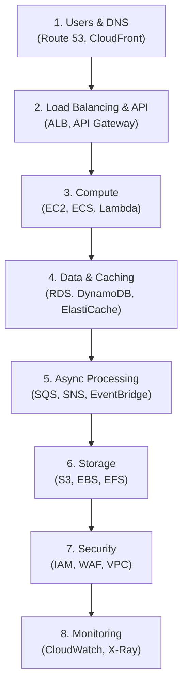

# Design Patterns & Architecture Frameworks

## Architecture Decision Framework

### The STAR-A Framework for Architecture Design

A structured approach for thinking through any AWS architecture:

| Step | What to Do | Example |
|------|-----------|---------|
| **S — Situation** | Define the problem and clarify requirements | "We need a system that handles 10K requests/sec with 99.99% availability..." |
| **T — Trade-offs** | Identify key trade-offs upfront | "The main trade-off here is cost vs latency. We could use multi-region for lowest latency, but single-region with CloudFront is more cost-effective..." |
| **A — Architecture** | Walk through your design layer by layer | "Starting from the user: Route 53 → CloudFront → ALB → ECS Fargate → Aurora..." |
| **R — Reasoning** | Explain WHY you chose each service | "I chose Aurora over RDS because we need < 30s failover and up to 15 read replicas..." |
| **A — Alternatives** | Document what you considered and rejected | "We could use DynamoDB here, but the relational data model with joins makes Aurora a better fit..." |

### Layer-by-Layer Approach

When designing an architecture, work through these layers in order:

## Common Architecture Patterns

### Pattern 1: "How would you design...?"

This is a system design question. Use STAR-A.

**Approach:**
- Ask clarifying questions first (scale, budget, compliance)
- State your assumptions
- Start simple, then add complexity
- Sketch the diagram
- Discuss trade-offs for every major decision

### Pattern 2: "What is the difference between X and Y?"

**Structure your answer:**
1. One-line summary of each service
2. Key differences in a comparison
3. When to use each (use case-driven)

**Example**: "What is the difference between SQS and SNS?"
> "SQS is a message queue — one producer, one consumer group, messages persist until processed. SNS is pub/sub — one message fans out to many subscribers. Use SQS for decoupling and retry; use SNS when multiple systems need to react to the same event. They're often used together: publish to SNS, which fans out to multiple SQS queues."

### Pattern 3: "How would you troubleshoot...?"

**Follow this framework:**
1. **Identify** — What symptoms are visible? (errors, latency, failures)
2. **Isolate** — Which component is the issue? (check metrics, logs, traces)
3. **Diagnose** — What's the root cause? (resource limits, misconfiguration, code bug)
4. **Fix** — What's the solution? (short-term fix + long-term prevention)
5. **Prevent** — How do we avoid this? (monitoring, alarms, automation)

### Pattern 4: "How would you migrate...?"

**Structure:**
1. **Assess** — Current state, dependencies, constraints
2. **Plan** — Migration strategy (rehost, replatform, refactor)
3. **Execute** — Tools (DMS, SCT, Snow Family), phased approach
4. **Validate** — Testing, data consistency, performance comparison
5. **Optimize** — Cost optimization, leverage cloud-native services

### Pattern 5: "How would you secure...?"

**Cover these dimensions:**
1. **Identity** — IAM, least privilege, MFA
2. **Network** — VPC, Security Groups, NACLs, PrivateLink
3. **Data** — Encryption at rest (KMS) and in transit (TLS)
4. **Application** — WAF, Shield, input validation
5. **Monitoring** — CloudTrail, GuardDuty, Config rules
6. **Compliance** — SCPs, Organizations, automated remediation

## Must-Know Comparison Table

| Scenario | Choose This | Not This |
|----------|------------|----------|
| Need SQL + high availability | **Aurora** | RDS (slower failover) |
| Need NoSQL at any scale | **DynamoDB** | MongoDB on EC2 |
| Simple caching | **ElastiCache Redis** | Memcached (less features) |
| HTTP API backend | **API Gateway HTTP API** | REST API (more expensive) |
| Container orchestration (AWS-only) | **ECS** | EKS (more complex) |
| Need Kubernetes | **EKS** | ECS (not K8s) |
| Serverless containers | **Fargate** | EC2 launch type (more ops) |
| Stream to S3 | **Kinesis Firehose** | Data Streams (more complex) |
| Real-time stream processing | **Kinesis Data Streams** | Firehose (60s latency) |
| Ad-hoc SQL on S3 | **Athena** | Redshift (over-provisioned) |
| Heavy BI analytics | **Redshift** | Athena (not optimized) |
| Simple ETL | **Glue** | EMR (over-engineered) |
| IaC (AWS only) | **CDK** | Raw CloudFormation |
| IaC (multi-cloud) | **Terraform** | CDK (AWS only) |
| Global DNS | **Route 53** | Third-party DNS |
| File storage (Linux) | **EFS** | FSx Windows |
| File storage (Windows) | **FSx for Windows** | EFS (Linux only) |

## Key Numbers to Remember

| Metric | Value |
|--------|-------|
| S3 durability | 99.999999999% (11 nines) |
| S3 max object size | 5 TB (multipart upload required > 5 GB) |
| EC2 max Spot discount | Up to 90% |
| Lambda max timeout | 15 minutes |
| Lambda max memory | 10 GB |
| Lambda default concurrency | 1,000 per region |
| API Gateway default throttle | 10,000 req/s |
| SQS message max size | 256 KB |
| SQS FIFO throughput | 300 msg/s (3,000 batched) |
| SQS max retention | 14 days |
| DynamoDB max item size | 400 KB |
| Aurora max storage | 128 TB |
| Aurora max read replicas | 15 |
| RDS max read replicas | 5 |
| Aurora failover time | < 30 seconds |
| RDS Multi-AZ failover | 60-120 seconds |
| CloudFront edge locations | 400+ |
| VPC reserved IPs per subnet | 5 |
| EBS gp3 max IOPS | 16,000 |
| EBS io2 Block Express max IOPS | 256,000 |
| Kinesis shard in/out | 1 MB/s in, 2 MB/s out |
| EKS control plane cost | $0.10/hour (~$73/month) |

## Advanced System Design Patterns

These patterns frequently appear in real-world AWS architectures. Know when to apply each and how to implement it with AWS services.

### CQRS (Command Query Responsibility Segregation)

**Pattern:** Separate the write model (commands) from the read model (queries). Writes go to a normalized database optimized for consistency; reads go to denormalized views optimized for query performance.

**AWS Implementation:**
- **Write side**: API Gateway → Lambda → DynamoDB or Aurora (source of truth)
- **Event propagation**: DynamoDB Streams or Aurora CDC → Lambda → updates read models
- **Read side**: DynamoDB (denormalized), ElastiCache (for hot data), or OpenSearch (for search)
- **When to use**: When read and write patterns differ dramatically (e.g., 95% reads, complex queries on write-optimized data), when you need independent scaling of reads and writes

### Event Sourcing

**Pattern:** Store every state change as an immutable event rather than overwriting the current state. The current state is derived by replaying events.

**AWS Implementation:**
- **Event store**: DynamoDB (partition key = aggregate ID, sort key = timestamp/version) or Kinesis for streaming
- **Event bus**: EventBridge for routing events to consumers
- **Projections**: Lambda functions that consume events and build read-optimized views
- **Snapshots**: Periodic state snapshots in S3 to avoid replaying all events
- **When to use**: Audit-heavy systems (financial, healthcare), when you need temporal queries ("what was the state at time X"), when the event history itself has business value

### Saga Pattern

**Pattern:** Manage distributed transactions across microservices using a sequence of local transactions. Each step has a compensating action for rollback.

**AWS Implementation:**
- **Orchestration (preferred)**: Step Functions coordinates the saga — each state calls a service, failure triggers compensating states
- **Choreography**: EventBridge connects services — each service emits events that trigger the next step, and failure events trigger compensation
- **When to use**: Multi-service operations that must be atomic (order → payment → inventory → shipping), when 2PC (two-phase commit) is not feasible across microservices

### Circuit Breaker

**Pattern:** Prevent cascading failures by stopping calls to a failing service. States: Closed (normal), Open (failing, return error immediately), Half-Open (test with limited traffic).

**AWS Implementation:**
- **Application-level**: Libraries like Hystrix (Java) or resilience4j in your ECS/EKS service code
- **AWS-native**: API Gateway throttling + Lambda destinations for failure handling
- **Service mesh**: App Mesh with Envoy proxy provides circuit breaking as sidecar configuration
- **When to use**: Synchronous service-to-service calls where a downstream dependency can fail or become slow

### Bulkhead

**Pattern:** Isolate components so that failure in one does not affect others. Like bulkheads in a ship — one compartment floods without sinking the vessel.

**AWS Implementation:**
- **Separate SQS queues** per workload type (so a spike in one does not starve others)
- **Separate Lambda reserved concurrency** per function (one function cannot consume all concurrency)
- **Separate ECS services** with independent Auto Scaling (one service scaling does not impact another)
- **Separate AWS accounts** per blast radius boundary (production account failure does not impact dev)
- **When to use**: Multi-tenant systems, systems with mixed-criticality workloads

### Throttling

**Pattern:** Limit the rate of requests to protect downstream services from being overwhelmed.

**AWS Implementation:**
- **API Gateway**: Usage plans with API keys, per-method throttling, account-level throttling (10,000 req/s default)
- **SQS**: Natural throttling — queue absorbs bursts, consumers process at their own rate
- **Lambda reserved concurrency**: Caps the number of concurrent executions
- **WAF rate-based rules**: Block IPs exceeding a request rate threshold
- **When to use**: Public APIs, multi-tenant services, protecting databases from traffic spikes

### Cache-Aside (Lazy Loading)

**Pattern:** Application checks the cache first. On cache miss, reads from the database, stores in cache, and returns. Cache is populated on demand.

**AWS Implementation:**
- **Cache**: ElastiCache Redis or DAX (for DynamoDB)
- **Application logic**: Lambda or ECS checks Redis → on miss, queries Aurora/DynamoDB → writes result to Redis with TTL
- **Cache invalidation**: TTL-based expiration, or event-driven invalidation (DynamoDB Streams → Lambda → delete cache key)
- **When to use**: Read-heavy workloads, data that can tolerate slight staleness, expensive database queries
- **Complement with write-through**: On writes, update both the database and cache to keep frequently updated data fresh

### Materialized View

**Pattern:** Pre-compute and store query results so that reads are fast. The view is updated asynchronously when source data changes.

**AWS Implementation:**
- **Source**: DynamoDB or Aurora
- **Change detection**: DynamoDB Streams or Aurora CDC (via DMS)
- **Processing**: Lambda or Glue ETL transforms and writes to the materialized view
- **View storage**: DynamoDB (different table structure), Redshift (aggregate views), OpenSearch (search views)
- **When to use**: Complex aggregations queried frequently, dashboard data, when join operations are too expensive at query time

### Backends for Frontends (BFF)

**Pattern:** Create a separate backend service for each frontend type (web, mobile, IoT) to provide exactly the data and format each client needs.

**AWS Implementation:**
- **Web BFF**: Lambda behind API Gateway HTTP API — returns full payloads with hypermedia links
- **Mobile BFF**: Lambda behind API Gateway — returns minimal payloads, supports pagination, optimized for bandwidth
- **BFF calls microservices**: Each BFF aggregates data from shared backend microservices (ECS) via internal ALB
- **AppSync**: GraphQL as an alternative to multiple BFFs — each client queries exactly the fields it needs
- **When to use**: When web and mobile clients need very different data shapes, when you want to avoid over-fetching or under-fetching

### Strangler Fig

**Pattern:** Gradually replace a legacy system by routing traffic to new services while the old system continues to run. Named after the strangler fig vine that grows around a tree.

**AWS Implementation:**
- **Routing**: ALB path-based routing — new paths go to ECS/Lambda, unmatched paths go to the legacy monolith on EC2
- **Data migration**: DMS replicates data from the monolith's database to new per-service databases
- **Feature parity**: Migrate one feature at a time, validate with canary traffic, then cut over fully
- **Decommission**: Once all paths are migrated, shut down the monolith
- **When to use**: Any monolith-to-microservices migration where rewriting from scratch is too risky

## AWS Services Quick Reference

A comprehensive reference of AWS services organized by category.

### Compute

| Service | One-Line Description |
|---------|---------------------|
| **EC2** | Virtual machines with full OS control; choose instance type, AMI, and placement |
| **Lambda** | Serverless functions triggered by events; pay per invocation, max 15 min timeout |
| **ECS** | Container orchestration with AWS-native task definitions and service discovery |
| **EKS** | Managed Kubernetes control plane for teams needing K8s API compatibility |
| **Fargate** | Serverless compute engine for ECS and EKS; no server management |
| **Lightsail** | Simplified compute with bundled pricing for small apps and dev environments |
| **Batch** | Run batch computing jobs on managed EC2 or Fargate fleets |
| **App Runner** | Fully managed container service from source code or image; simplest deployment model |
| **Outposts** | Run AWS infrastructure on-premises for low-latency or data residency needs |

### Storage

| Service | One-Line Description |
|---------|---------------------|
| **S3** | Object storage with 11 nines durability, lifecycle policies, and 7 storage classes |
| **EBS** | Block storage volumes attached to EC2; gp3 (general), io2 (high IOPS), st1/sc1 (throughput) |
| **EFS** | Managed NFS file system for Linux workloads; scales automatically |
| **FSx for Windows** | Managed Windows file shares (SMB protocol) with Active Directory integration |
| **FSx for Lustre** | High-performance file system for HPC and ML workloads; integrates with S3 |
| **S3 Glacier** | Archive storage classes for long-term retention at very low cost |
| **Storage Gateway** | Hybrid storage bridging on-premises and cloud (File, Volume, Tape) |
| **Snow Family** | Physical devices for offline data transfer: Snowcone, Snowball Edge, Snowmobile |

### Database

| Service | One-Line Description |
|---------|---------------------|
| **RDS** | Managed relational databases (MySQL, PostgreSQL, Oracle, SQL Server, MariaDB) |
| **Aurora** | AWS-optimized relational DB; 5x MySQL / 3x PostgreSQL performance, 128 TB storage |
| **DynamoDB** | Serverless NoSQL key-value/document store; single-digit ms latency at any scale |
| **ElastiCache** | Managed Redis or Memcached for in-memory caching and session management |
| **Neptune** | Graph database for relationship-heavy data (social networks, fraud detection) |
| **DocumentDB** | MongoDB-compatible managed document database |
| **Keyspaces** | Managed Apache Cassandra-compatible wide-column database |
| **Timestream** | Serverless time-series database for IoT and operational metrics |
| **MemoryDB** | Redis-compatible in-memory database with Multi-AZ durability |
| **QLDB** | Immutable, cryptographically verifiable ledger database |

### Networking

| Service | One-Line Description |
|---------|---------------------|
| **VPC** | Isolated virtual network with subnets, route tables, internet/NAT gateways |
| **Route 53** | DNS service with health checks and routing policies (latency, geo, failover, weighted) |
| **CloudFront** | CDN with 400+ edge locations; caches content and integrates with WAF |
| **ALB** | Layer 7 load balancer; path/host routing, WebSocket, gRPC support |
| **NLB** | Layer 4 load balancer; ultra-low latency, static IPs, millions of req/s |
| **Global Accelerator** | Anycast IPs that route users to the nearest AWS region via the AWS backbone |
| **Transit Gateway** | Hub-and-spoke network connecting VPCs and on-premises networks |
| **Direct Connect** | Dedicated private network connection from on-premises to AWS |
| **PrivateLink** | Access AWS services or third-party services privately without internet |
| **API Gateway** | Managed API endpoints (REST, HTTP, WebSocket) with auth, throttling, and caching |

### Security & Identity

| Service | One-Line Description |
|---------|---------------------|
| **IAM** | Users, roles, policies, and groups for access management; always use least privilege |
| **IAM Identity Center** | SSO for multiple AWS accounts with SAML/OIDC federation |
| **Cognito** | User authentication and authorization for web/mobile apps (User Pools + Identity Pools) |
| **KMS** | Create and manage encryption keys; integrates with nearly every AWS service |
| **Secrets Manager** | Store and auto-rotate secrets (DB passwords, API keys) |
| **Certificate Manager** | Free TLS/SSL certificates for ALB, CloudFront, API Gateway |
| **WAF** | Web application firewall; rules for SQL injection, XSS, rate limiting |
| **Shield** | DDoS protection; Standard (free) and Advanced (dedicated response team) |
| **GuardDuty** | ML-powered threat detection from CloudTrail, VPC Flow Logs, DNS logs |
| **Security Hub** | Aggregated security findings with compliance benchmarks (CIS, PCI, HIPAA) |
| **Inspector** | Automated vulnerability scanning for EC2, Lambda, and container images |
| **Macie** | ML-powered PII/PHI discovery and classification in S3 |

### Application Integration

| Service | One-Line Description |
|---------|---------------------|
| **SQS** | Managed message queue; Standard (at-least-once) or FIFO (exactly-once, ordered) |
| **SNS** | Pub/sub messaging; fan-out to SQS, Lambda, HTTP, email, SMS |
| **EventBridge** | Serverless event bus; route events by rules to 20+ targets; schema registry |
| **Step Functions** | Visual workflow orchestration; Standard (long-running) or Express (high-volume) |
| **AppSync** | Managed GraphQL and Pub/Sub APIs with real-time subscriptions |
| **MQ** | Managed Apache ActiveMQ and RabbitMQ for legacy message broker migration |

### Analytics & Data

| Service | One-Line Description |
|---------|---------------------|
| **Athena** | Serverless SQL queries on S3; $5/TB scanned; use Parquet for cost savings |
| **Redshift** | Petabyte-scale columnar data warehouse; Spectrum queries S3 external data |
| **Glue** | Serverless ETL (Spark), Data Catalog (metadata), Crawlers (schema discovery) |
| **Kinesis Data Streams** | Real-time streaming ingestion; 1 MB/s per shard, 200ms latency |
| **Kinesis Firehose** | Near real-time delivery to S3, Redshift, OpenSearch; fully managed |
| **MSK** | Managed Apache Kafka for streaming; open-source ecosystem compatibility |
| **EMR** | Managed Spark, Hadoop, Hive, Presto, Flink clusters (or Serverless) |
| **QuickSight** | Serverless BI dashboards with SPICE engine and ML insights |
| **OpenSearch** | Managed search and log analytics (Elasticsearch-compatible) |
| **Lake Formation** | Data lake governance with column/row/cell-level permissions and LF-Tags |
| **DataZone** | Data management portal for cataloging, discovering, and sharing data products |
| **Clean Rooms** | Privacy-preserving analytics across organizations without sharing raw data |

### DevOps & Management

| Service | One-Line Description |
|---------|---------------------|
| **CloudFormation** | IaC in YAML/JSON; stacks, change sets, drift detection, StackSets |
| **CDK** | IaC in TypeScript/Python/Java/Go; synthesizes to CloudFormation |
| **CodePipeline** | CI/CD orchestration: source, build, test, deploy stages |
| **CodeBuild** | Managed build service; compiles, tests, produces artifacts |
| **CodeDeploy** | Automated deployments to EC2, ECS, Lambda (rolling, blue/green, canary) |
| **CodeCatalyst** | Unified DevOps: repos, CI/CD, issues, dev environments in one service |
| **CloudWatch** | Metrics, logs, alarms, dashboards, Synthetics canaries, RUM, Application Signals |
| **X-Ray** | Distributed tracing with service maps for microservices debugging |
| **CloudTrail** | API audit log: who did what, when, from where; management + data events |
| **Config** | Track resource configuration changes; compliance rules; auto-remediation |
| **Systems Manager** | Fleet management, patching, Parameter Store, Session Manager, Incident Manager |

---

[← Previous: Architecture Scenarios](../11-architecture-scenarios/) | [Next: Cognito & App Security →](../13-cognito-and-app-security/)
