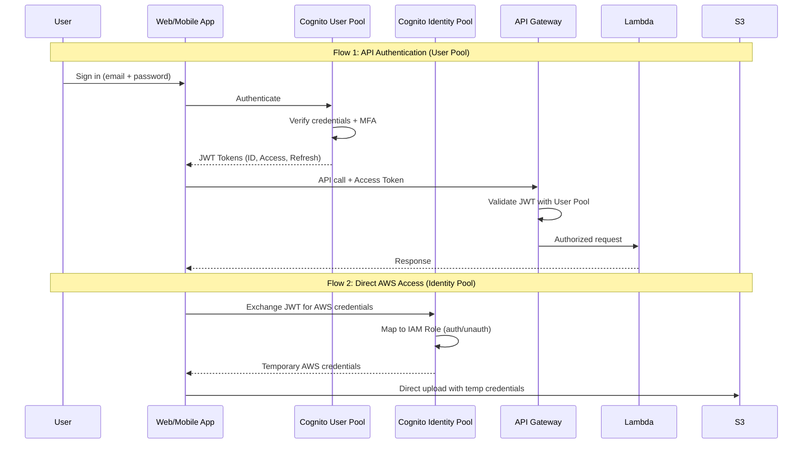
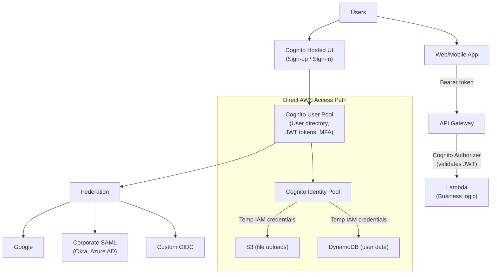
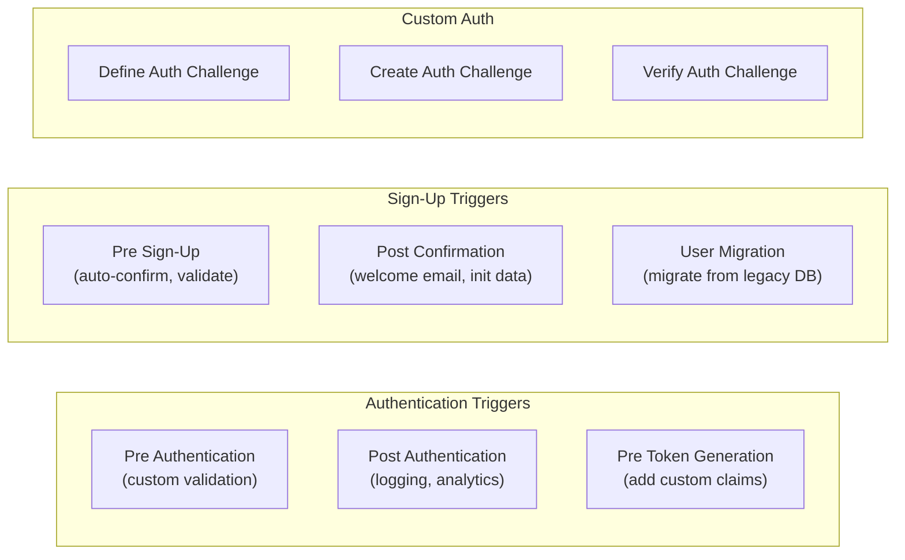
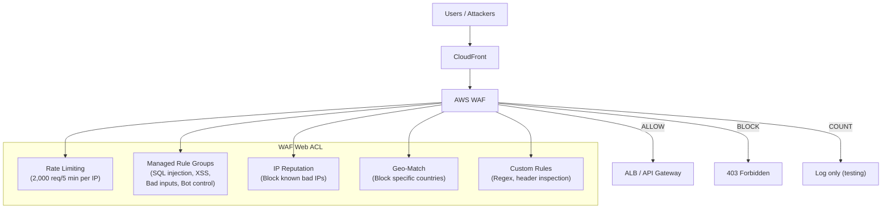

# Cognito & Application Security

## Overview

**Amazon Cognito** provides authentication, authorization, and user management for web and mobile apps. Users can sign in directly with a username and password, or through a third party like Google, Facebook, or corporate SAML/OIDC identity providers. Cognito is the missing piece in serverless architectures — it handles auth so your Lambda functions don't have to.

This section also covers **AWS WAF**, **AWS Shield**, and **AWS Firewall Manager** — the application-layer security services that protect your APIs and web apps from attacks.

## Key Concepts

| Concept | Description |
|---------|-------------|
| **User Pool** | User directory — handles sign-up, sign-in, MFA, password policies, and token issuance (JWT) |
| **Identity Pool** | Grants temporary AWS credentials to users (authenticated or guest) for direct AWS service access |
| **JWT Tokens** | Cognito issues ID Token (user info), Access Token (authorization), and Refresh Token (renew session) |
| **Hosted UI** | Pre-built, customizable sign-in/sign-up pages hosted by Cognito |
| **Federation** | Sign in via external IdPs — Google, Facebook, Apple, SAML 2.0, OIDC |

## Architecture Diagram

### Cognito Authentication Flow



### Cognito + API Gateway + Lambda Architecture



## Deep Dive

### Cognito User Pools

| Feature | Detail |
|---------|--------|
| **Sign-Up/Sign-In** | Email, phone, username. Custom attributes supported |
| **MFA** | SMS, TOTP (authenticator app), or both. Can be required or optional |
| **Password Policy** | Min length, require uppercase/lowercase/numbers/symbols |
| **Email/Phone Verification** | Built-in verification flow via SES or SNS |
| **Lambda Triggers** | Hook into auth flow: pre-sign-up, post-confirmation, pre-token generation, custom auth challenge, migrate user |
| **Advanced Security** | Adaptive authentication (risk-based), compromised credential detection, IP-based blocking |
| **Token Expiration** | ID/Access Token: 5 min to 1 day (default 1 hour). Refresh Token: 1 day to 3,650 days (default 30 days) |
| **Hosted UI** | Built-in OAuth 2.0/OIDC-compliant sign-in pages with custom domain support |
| **Groups** | Assign users to groups, map groups to IAM roles, use for RBAC |

### Cognito User Pool Lambda Triggers



### Cognito Identity Pools (Federated Identities)

Identity Pools grant temporary AWS credentials to users. Key concepts:

| Feature | Detail |
|---------|--------|
| **Authenticated Role** | IAM role for users who signed in via User Pool or external IdP |
| **Unauthenticated Role** | IAM role for guest users (optional, restricted permissions) |
| **Role Mapping** | Map User Pool groups or IdP claims to different IAM roles |
| **Fine-Grained Access** | Use `${cognito-identity.amazonaws.com:sub}` in IAM policies for user-level S3 folders |

#### Per-User S3 Access Example

```json
{
  "Effect": "Allow",
  "Action": ["s3:GetObject", "s3:PutObject"],
  "Resource": "arn:aws:s3:::my-bucket/${cognito-identity.amazonaws.com:sub}/*"
}
```

### User Pool vs Identity Pool

| Feature | User Pool | Identity Pool |
|---------|-----------|---------------|
| **Purpose** | Authentication (who are you?) | Authorization (what can you access?) |
| **Output** | JWT tokens (ID, Access, Refresh) | Temporary AWS credentials (AccessKey, SecretKey, SessionToken) |
| **Use Case** | Sign-in, MFA, user management | Direct S3/DynamoDB access from client |
| **Works With** | API Gateway, ALB | S3, DynamoDB, any AWS service |
| **Federation** | Google, Facebook, SAML, OIDC | Cognito User Pool, external IdPs |

### AWS WAF (Web Application Firewall) — Deep Dive



| Feature | Detail |
|---------|--------|
| **Web ACL** | Set of rules evaluated in priority order. Attach to CloudFront, ALB, API Gateway, AppSync, or Cognito User Pool |
| **Managed Rules** | AWS and Marketplace rule groups (OWASP Top 10, Bot Control, Account Takeover Prevention) |
| **Rate-Based Rules** | Block IPs exceeding a threshold (e.g., 2,000 requests per 5 minutes) |
| **Bot Control** | Detect and manage bot traffic (verified bots vs scrapers) |
| **Account Takeover Prevention (ATP)** | Detect credential stuffing on login pages |
| **Fraud Control** | Detect fake account creation |
| **Logging** | Send logs to S3, CloudWatch Logs, or Kinesis Data Firehose |
| **Pricing** | $5/Web ACL/month + $1/rule/month + $0.60/million requests |

### AWS Shield

| Tier | Protection | Cost |
|------|-----------|------|
| **Shield Standard** | Automatic DDoS protection for all AWS resources (Layer 3/4). Free. | Free |
| **Shield Advanced** | Enhanced DDoS protection, real-time metrics, 24/7 DDoS Response Team (DRT), cost protection (won't charge for DDoS-induced scaling). Covers CloudFront, ALB, NLB, Elastic IP, Global Accelerator, Route 53. | $3,000/month + data transfer |

### AWS Firewall Manager

Centrally manage security rules across multiple accounts in AWS Organizations:

| Feature | Description |
|---------|-------------|
| **WAF Policies** | Deploy WAF rules across all accounts/resources |
| **Shield Advanced** | Enable Shield Advanced across all accounts |
| **Security Groups** | Audit and enforce Security Group rules org-wide |
| **Network Firewall** | Manage VPC-level firewall rules centrally |
| **Route 53 Resolver DNS Firewall** | Block DNS queries to malicious domains |

## Best Practices

1. **Use Cognito User Pool + API Gateway** as default auth for serverless APIs
2. **Always enable MFA** — at minimum optional, required for admin users
3. **Use Hosted UI** for production — it handles OWASP auth vulnerabilities for you
4. **Use Lambda triggers** for custom logic (don't rebuild auth flows from scratch)
5. **Prefer Identity Pool** over embedding AWS credentials for client-side AWS access
6. **Use WAF Managed Rules** — AWS Managed Rules cover OWASP Top 10 out of the box
7. **Enable WAF rate limiting** on all public APIs (start with 2,000 req/5 min)
8. **Use Shield Advanced** for business-critical applications exposed to the internet
9. **Use Firewall Manager** in multi-account Organizations for consistent security
10. **Store sensitive config in Cognito app client secrets** — never hardcode client secrets in frontend code

## Common Interview Questions

### Q1: What is the difference between Cognito User Pool and Identity Pool?

**A:** **User Pool** = authentication. It's a user directory where users sign up/in and get JWT tokens. Use it with API Gateway or ALB to authenticate API calls. **Identity Pool** = authorization for AWS services. It exchanges tokens (from User Pool or external IdPs) for temporary AWS credentials so clients can directly access S3, DynamoDB, etc. They're often used together: User Pool authenticates the user, Identity Pool grants AWS resource access.

### Q2: How would you implement authentication for a serverless web app?

**A:** CloudFront serves the React/Angular frontend from S3. User signs in via Cognito Hosted UI (supports email/password + Google/SAML). Cognito returns JWT tokens. Frontend sends the Access Token in the `Authorization` header to API Gateway. API Gateway validates the JWT using a Cognito Authorizer (zero custom code). Lambda receives the verified request with user claims. For file uploads, use Identity Pool to get temporary S3 credentials for direct client-to-S3 uploads.

### Q3: How does Cognito federation work with corporate SAML?

**A:** Configure the corporate IdP (Okta, Azure AD) as a SAML 2.0 identity provider in the Cognito User Pool. When a user clicks "Sign in with SSO", Cognito redirects to the corporate login page. After authentication, the IdP sends a SAML assertion to Cognito. Cognito validates the assertion, creates/links the user in the User Pool, and issues standard JWT tokens. The app uses the same JWT flow — it doesn't need to understand SAML.

### Q4: What is the difference between AWS WAF and AWS Shield?

**A:** **WAF** = Layer 7 (application layer) protection. Inspects HTTP/HTTPS requests and blocks based on rules (SQL injection, XSS, IP reputation, rate limiting, geo-blocking). You define rules in a Web ACL. **Shield** = Layer 3/4 (network layer) DDoS protection. Standard is free and automatic. Advanced adds real-time metrics, DDoS Response Team, and cost protection. Use both together: Shield protects against volumetric/protocol DDoS, WAF protects against application-layer attacks.

### Q5: How do you implement RBAC (Role-Based Access Control) with Cognito?

**A:** Create groups in the Cognito User Pool (e.g., `admin`, `editor`, `viewer`). Assign users to groups. Two approaches: (1) **API-level RBAC** — the `cognito:groups` claim is included in the JWT token. Lambda checks the group and allows/denies actions. (2) **AWS resource-level RBAC** — map Cognito groups to different IAM roles via Identity Pool. Admins get a role with full DynamoDB access; viewers get read-only. The mapping is configured in the Identity Pool settings.

### Q6: How does WAF rate limiting work?

**A:** Create a rate-based rule in the WAF Web ACL. Specify a threshold (e.g., 2,000 requests per 5-minute window) and a scope (per IP, per IP + header, per forwarded IP). When an IP exceeds the limit, WAF blocks subsequent requests until the rate drops below the threshold. Use for: API abuse prevention, login brute-force protection, scraping mitigation. Combine with Bot Control managed rules for more sophisticated detection.

### Q7: When would you use Cognito vs IAM Identity Center?

**A:** **Cognito** = customer-facing (B2C) and application authentication. Users are your app's end users (customers, patients, students). Integrates with API Gateway and ALB. **IAM Identity Center** = workforce (B2B/internal) authentication. Users are your employees accessing AWS Console, CLI, and internal apps. Integrates with AWS Organizations and provides SSO across all AWS accounts. Rule: Cognito for your app's users, Identity Center for your company's employees.

### Q8: How do you protect an API Gateway from DDoS and abuse?

**A:** Layer the defenses: (1) **CloudFront** in front of API Gateway — absorbs volumetric attacks at edge. (2) **Shield Standard** (automatic) protects against L3/L4 DDoS. (3) **WAF Web ACL** on CloudFront or API Gateway — rate limiting, IP reputation, managed rules for SQL injection/XSS. (4) **API Gateway throttling** — 10,000 req/s default, configure per-method limits. (5) **API keys + Usage Plans** — quota per client for partner APIs. (6) **Cognito authorization** — reject unauthenticated requests before they hit Lambda.

## Latest Updates (2025-2026)

| Update | Description |
|--------|-------------|
| **Cognito Managed Login** | New hosted UI experience replacing the classic Hosted UI with improved branding, customizable CSS, and support for modern authentication flows out of the box |
| **Cognito Passwordless Auth** | Native support for passkeys and WebAuthn (FIDO2), enabling biometric and hardware-key sign-in without passwords |
| **Amazon Verified Permissions** | Fine-grained authorization service using the **Cedar** policy language to define and evaluate permissions outside application code |
| **WAF Bot Control ATP Enhancements** | Account Takeover Prevention now includes improved credential stuffing detection, silent browser challenges, and token-based session tracking |
| **WAF Fraud Control ACFP** | Account Creation Fraud Prevention detects and blocks fake account sign-ups using behavioral analysis, CAPTCHA integration, and risk scoring |

### Q9: How does passwordless authentication work with Cognito?

**A:** Cognito now supports FIDO2/WebAuthn passkeys as a first-class authentication method. Users register a passkey (biometric on phone/laptop or a hardware security key), and Cognito stores the public key credential. During sign-in, the client initiates a WebAuthn challenge, the authenticator signs it with the private key, and Cognito verifies the signature. This eliminates passwords entirely, preventing phishing and credential stuffing. You enable passkeys in the User Pool authentication settings and use the Cognito Managed Login UI, which natively renders the passkey flow. Combine with device tracking for additional trust signals.

### Q10: What is Amazon Verified Permissions and how do you use it for fine-grained authorization?

**A:** Verified Permissions is a managed authorization service that lets you define access policies using the **Cedar** policy language. Instead of embedding authorization logic in your Lambda functions, you externalize it: your application sends an authorization request (principal, action, resource, context) to Verified Permissions, and it evaluates the Cedar policies to return Allow or Deny. Cedar supports RBAC, ABAC, and relationship-based access control (ReBAC). You model your application's entities (users, documents, folders) in a schema, write policies like `permit(principal in Group::"editors", action == Action::"edit", resource in Folder::"shared")`, and the service evaluates them in milliseconds. This decouples authorization from code and provides centralized, auditable policy management.

### Q11: How does machine-to-machine authentication work with Cognito?

**A:** For service-to-service communication (no human user), Cognito supports the **OAuth 2.0 client credentials** grant. You create an app client in the User Pool with a client ID and client secret, define resource servers with custom scopes (e.g., `api.myapp.com/read`, `api.myapp.com/write`), and the calling service requests an access token from the Cognito token endpoint using its credentials. The token contains the granted scopes but no user identity claims. API Gateway validates the token using a Cognito authorizer and checks the scopes. This pattern is used for microservice-to-microservice calls, backend batch jobs calling APIs, and third-party partner integrations.

### Q12: How do you set up custom domains and branding for Cognito?

**A:** Cognito supports custom domains for the Hosted UI/Managed Login. You can use an AWS-provided domain (`myapp.auth.us-east-1.amazoncognito.com`) or a custom domain (`auth.myapp.com`) backed by an ACM certificate in us-east-1. With Managed Login (the new hosted UI), you can customize the CSS, logos, colors, and layout of the sign-in/sign-up pages directly in the console or via API, without deploying a custom UI. For complete control, you can build a fully custom UI using the Cognito API or Amplify libraries while still using Cognito as the backend. Custom domains are important for brand trust — users should see your domain, not `amazoncognito.com`.

### Q13: How do you customize tokens with the pre-token generation trigger?

**A:** The pre-token generation Lambda trigger fires before Cognito issues tokens and allows you to modify claims. Use cases: (1) Add custom claims to the ID token — e.g., `tenant_id`, `subscription_tier`, `permissions` fetched from DynamoDB. (2) Suppress claims you don't want exposed. (3) Add group overrides — dynamically assign group-based roles at token generation time. The Lambda receives the user attributes and group memberships, and returns modified claims. The V2 trigger event (available since Cognito feature updates) supports customizing both the ID token and the access token. This is critical for multi-tenant apps where tenant context must be embedded in the token for downstream services.

### Q14: What are the multi-tenancy patterns with Cognito?

**A:** There are three primary patterns: (1) **User Pool per tenant** — strongest isolation, separate user directories, different auth settings per tenant. Operationally complex at scale (service quotas, management overhead). (2) **Single User Pool with custom attributes** — one pool, `custom:tenant_id` attribute on each user. Use the pre-token trigger to inject tenant claims. Simpler to manage but relies on application-layer isolation. (3) **Single User Pool with groups per tenant** — create a Cognito group per tenant and use group-based RBAC for resource access. For most SaaS applications, pattern 2 with Verified Permissions for authorization provides the best balance of simplicity and security. Always enforce tenant isolation in your data layer (DynamoDB leading key, S3 prefix, or RLS in Aurora).

### Q15: What are the key WAF managed rule groups and when do you use each?

**A:** AWS provides several critical managed rule groups: **AWSManagedRulesCommonRuleSet** (baseline — blocks common threats like SQL injection, XSS, and bad bots; enable on every Web ACL). **AWSManagedRulesSQLiRuleSet** (deep SQL injection detection for database-backed APIs). **AWSManagedRulesKnownBadInputsRuleSet** (blocks Log4j, SSRF, and known exploit patterns). **AWSManagedRulesBotControlRuleSet** (identifies and manages bot traffic — verified bots like Googlebot are allowed, scrapers are blocked or challenged). **AWSManagedRulesATPRuleSet** (Account Takeover Prevention — detects credential stuffing on login endpoints). **AWSManagedRulesACFPRuleSet** (Account Creation Fraud Prevention — blocks fake sign-ups). Start with CommonRuleSet + BotControl in COUNT mode, review logs, then switch to BLOCK.

### Q16: How do you secure APIs against the OWASP API Top 10?

**A:** Address each risk: (1) **Broken Object Level Auth** — validate ownership in Lambda, use Verified Permissions, never trust client-provided IDs alone. (2) **Broken Authentication** — use Cognito with MFA, rate-limit login endpoints with WAF. (3) **Excessive Data Exposure** — return only necessary fields in responses. (4) **Lack of Rate Limiting** — WAF rate-based rules + API Gateway throttling + usage plans. (5) **Broken Function Level Auth** — separate authorizers per API method, check scopes. (6) **Mass Assignment** — validate and whitelist input fields in Lambda. (7) **Security Misconfiguration** — enable WAF logging, restrict CORS, use HTTPS-only. (8) **Injection** — WAF SQLi/XSS rules + input validation. Use WAF as the first layer, Cognito for authentication, and application-level checks for authorization.

### Q17: How do you implement API key rotation without downtime?

**A:** Use API Gateway usage plans with multiple API keys: (1) Create a new API key and associate it with the same usage plan. (2) Distribute the new key to consumers with a transition period where both old and new keys are active. (3) Monitor CloudWatch metrics for the old key's usage (`Count` per key). (4) Once the old key shows zero traffic, delete it. For automated rotation: use Secrets Manager to store the API key, a Lambda rotation function to create new keys via the API Gateway API, and notify consumers via SNS or parameter store. For machine-to-machine auth, prefer Cognito client credentials over API keys — they support OAuth scopes and can be rotated independently by each client.

### Q18: How would you implement defense-in-depth for a web application?

**A:** Layer security at every tier: (1) **Edge** — CloudFront with WAF Web ACL (managed rules, rate limiting, geo-blocking, bot control). Shield Advanced for DDoS. (2) **Network** — private subnets for compute, NACLs as stateless backup, Security Groups as primary firewall. VPC endpoints for AWS services. (3) **Authentication** — Cognito with MFA, adaptive authentication (risk-based challenges), compromised credential detection. (4) **Authorization** — API Gateway authorizers, Verified Permissions for fine-grained ABAC/RBAC. (5) **Application** — input validation, output encoding, parameterized queries. (6) **Data** — encryption at rest (KMS), in transit (TLS 1.2+), field-level encryption for sensitive data. (7) **Monitoring** — CloudTrail for API audit, WAF logs to S3, GuardDuty for threat detection, Security Hub for posture management. No single layer is sufficient — the principle is that if one layer fails, the next layer catches the threat.

## Deep Dive Notes

### Zero-Trust Application Architecture

Zero-trust means "never trust, always verify" — every request is authenticated and authorized regardless of network location. On AWS, implement zero-trust by: (1) **Authenticate every request** — Cognito tokens validated at API Gateway, not just at the perimeter. (2) **Authorize at the resource level** — use Verified Permissions to check policies per action, not just per endpoint. (3) **Encrypt everything** — TLS 1.2+ in transit, KMS at rest, even within the VPC. (4) **Minimize blast radius** — least-privilege IAM roles per Lambda function, per-tenant data isolation. (5) **Continuous verification** — adaptive authentication re-challenges users when risk signals change (new device, unusual location). (6) **Assume breach** — GuardDuty, Security Hub, and CloudTrail continuously monitor for compromised credentials or unusual API patterns. The key shift from perimeter security: the network is not a trust boundary.

### OAuth 2.0 / OIDC Flows Explained

| Flow | When to Use | How It Works |
|------|-------------|--------------|
| **Authorization Code + PKCE** | Single-page apps, mobile apps (most common) | App redirects to Cognito Hosted UI, user authenticates, Cognito returns an authorization code, app exchanges code for tokens using a code verifier (PKCE prevents interception) |
| **Authorization Code** | Server-side web apps (confidential clients) | Same as above, but the server exchanges the code using a client secret (stored securely server-side) |
| **Client Credentials** | Machine-to-machine (no user) | Service sends client ID + secret directly to the token endpoint, receives an access token with scopes (no ID token, no refresh token) |
| **Implicit (Legacy)** | Deprecated — avoid | Tokens returned directly in the redirect URL. Vulnerable to token leakage. Replaced by Authorization Code + PKCE |

PKCE (Proof Key for Code Exchange) is now required for all public clients (SPAs, mobile). Cognito supports all these flows. Configure the allowed OAuth flows and scopes in the app client settings.

### WAF Rule Priority and Evaluation Order

WAF rules in a Web ACL are evaluated in **priority order** (lowest number first). Key principles: (1) Put rate-based rules first — block abusive IPs before evaluating expensive regex rules. (2) Put IP-based allow/block lists second — known good/bad IPs should be handled early. (3) Managed rule groups in the middle — CommonRuleSet, BotControl, ATP. (4) Custom rules last — application-specific logic. Each rule has a **WCU (Web ACL Capacity Unit)** cost. The default Web ACL limit is 1,500 WCUs. Managed rules consume: CommonRuleSet = 700 WCUs, BotControl = 50 WCUs (common) or 750 WCUs (targeted). A rule can have three actions: ALLOW, BLOCK, or COUNT (log only, for testing). Use COUNT mode first for new rules, monitor false positives in WAF logs, then switch to BLOCK.

### Cognito Advanced Security Features

Cognito Advanced Security (add-on) provides: (1) **Adaptive Authentication** — risk-based MFA challenges. Cognito evaluates each sign-in for risk signals (new device, unusual location, impossible travel, known bad IP). Low risk = allow. Medium risk = challenge (MFA). High risk = block. This reduces friction for trusted users while protecting against attacks. (2) **Compromised Credential Detection** — Cognito checks username/password combinations against a database of known leaked credentials (from public breaches). If a match is found, the user is forced to change their password. (3) **Advanced security metrics** — CloudWatch metrics for risk levels, compromised credentials, and adaptive authentication events. Enable advanced security in the User Pool settings. It adds $0.050 per MAU (monthly active user) to the cost.

## Scenario-Based Questions

### S1: Your API is getting hit by credential stuffing attacks — thousands of login attempts per minute with leaked username/password pairs. How do you defend?

**A:** Multi-layer defense: (1) **WAF rate limiting** — attach WAF to API Gateway/ALB with a rate-based rule (e.g., max 100 requests per IP per 5 min on `/login`). (2) **Cognito Advanced Security** — enable adaptive authentication. Cognito detects anomalous sign-ins (new device, impossible travel) and challenges with MFA or blocks. (3) **Compromised credential check** — Cognito checks passwords against known breach databases and forces password change. (4) **CAPTCHA** — AWS WAF CAPTCHA action on the login endpoint after 3 failed attempts. (5) **Account lockout** — Cognito custom Lambda trigger (Pre Authentication) that checks DynamoDB for failed attempt count and blocks after 5 failures for 30 min. (6) **Long-term** — enforce MFA for all users, implement passwordless auth (WebAuthn/passkeys via Cognito).

### S2: You need to add authentication to a React SPA that calls a serverless API. Users should be able to sign in with Google, Apple, and email/password. Design the auth flow.

**A:** Use **Cognito User Pool + Identity Pool**. (1) **User Pool** — enable Google and Apple as social identity providers, plus email/password sign-up. Cognito handles OAuth flows, token issuance, and user management. (2) **Hosted UI or Amplify** — use Cognito's hosted UI for login (quick) or Amplify UI components in React (customizable). (3) **Token flow** — after login, Cognito returns ID token + access token + refresh token. Store tokens in memory (not localStorage — XSS risk). (4) **API Gateway** — attach a Cognito authorizer. API Gateway validates the JWT on every request (no Lambda needed for auth). (5) **Identity Pool** — if the SPA needs direct AWS access (e.g., S3 uploads), exchange Cognito tokens for temporary AWS credentials via Identity Pool. (6) **Token refresh** — use the refresh token (30 days) to get new access tokens (1 hour) silently.

### S3: A WAF rule is blocking legitimate users in a specific country. How do you investigate and fix without disabling security?

**A:** (1) **WAF logs** — enable logging to S3 via Kinesis Firehose. Filter for BLOCK actions from the affected country's IP ranges. Identify which rule is triggering (rule ID in the log). (2) **Common cause** — a geo-match rule blocking the country, or a rate-based rule triggered by a corporate proxy (many users behind one IP). (3) **Fix for geo-block** — if the rule is intentional, create a scope-down statement that exempts authenticated users (check for a valid auth header). (4) **Fix for rate-limit** — increase the rate threshold for known corporate IP ranges using an IP set exception. (5) **Use WAF count mode** — switch the rule from BLOCK to COUNT temporarily. Monitor for 24 hours. Refine the rule to reduce false positives, then re-enable BLOCK. (6) **Long-term** — use WAF Bot Control managed rule group which distinguishes legitimate bots/users from attackers more accurately.

## Cheat Sheet

| Concept | Key Facts |
|---------|-----------|
| User Pool | User directory, sign-up/in, JWT tokens, MFA, federation |
| Identity Pool | Exchange tokens for temporary AWS credentials |
| JWT Tokens | ID Token (user info), Access Token (auth), Refresh Token (renew) |
| Token Expiry | Access/ID: 5 min–1 day (default 1 hr), Refresh: 1–3,650 days |
| Lambda Triggers | 8 trigger points in auth flow (pre-signup, post-confirm, pre-token, etc.) |
| Hosted UI | Pre-built OAuth 2.0 login pages, custom domain support |
| WAF | Layer 7, Web ACLs, managed rules, rate limiting, bot control |
| Shield Standard | Free, automatic L3/L4 DDoS protection |
| Shield Advanced | $3,000/month, DRT, cost protection, real-time metrics |
| Firewall Manager | Centrally manage WAF/Shield/SG across Organizations |
| Cognito vs Identity Center | Cognito = app users (B2C), Identity Center = employees (B2B) |
| Verified Permissions | Fine-grained auth with Cedar policy language, RBAC/ABAC/ReBAC |
| Passwordless Auth | Passkeys/WebAuthn (FIDO2), biometric sign-in, phishing resistant |
| Managed Login | New hosted UI with improved branding and customization |
| WAF ACFP | Account Creation Fraud Prevention — block fake sign-ups |
| Client Credentials | Machine-to-machine OAuth flow, scopes-based, no user context |

---

[← Previous: Interview Tips](../12-interview-tips/) | [Next: Cloud Migration →](../14-cloud-migration/)
