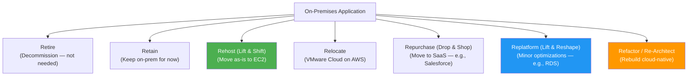
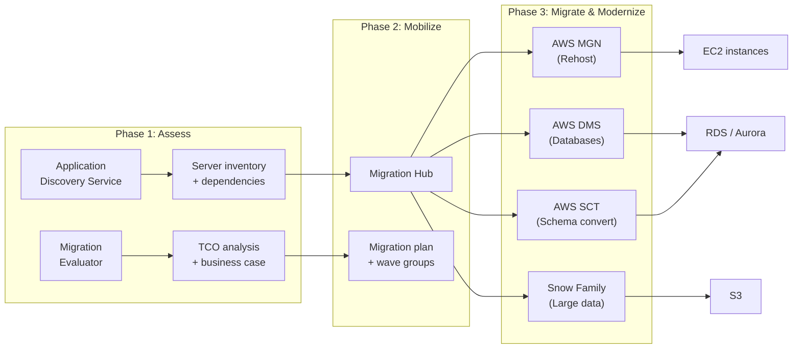
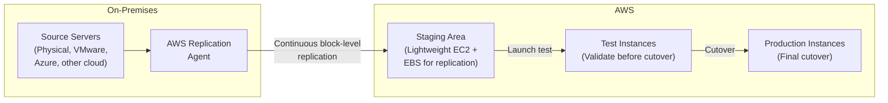
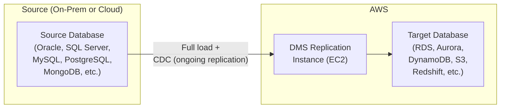
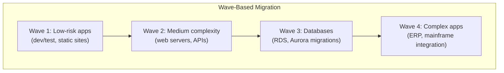

# Cloud Migration

## Overview

Cloud migration is one of the most important skills for AWS architects. AWS provides a structured approach — the **7 Rs of Migration** — along with a suite of tools: **AWS Migration Hub** for tracking, **AWS DMS** for database migration, **AWS SCT** for schema conversion, and **AWS Application Discovery Service** for assessment.

## Key Concepts

| Concept | Description |
|---------|-------------|
| **7 Rs** | Seven migration strategies: Retire, Retain, Rehost, Relocate, Repurchase, Replatform, Refactor |
| **Migration Hub** | Central dashboard to track migration progress across AWS tools |
| **DMS** | Database Migration Service — migrate databases with minimal downtime |
| **SCT** | Schema Conversion Tool — convert database schemas between engines |
| **Application Discovery** | Discover on-premises servers, dependencies, and utilization |
| **MAP** | Migration Acceleration Program — AWS funding and methodology for large migrations |

## Architecture Diagram

### The 7 Rs of Migration

### Migration Journey

## Deep Dive

### The 7 Rs — Detailed

| Strategy | What Happens | Effort | Cost Saving | Example |
|----------|-------------|--------|-------------|---------|
| **Retire** | Decommission apps no longer needed | None | Immediate savings | Legacy app nobody uses |
| **Retain** | Keep on-prem (not ready to migrate) | None | None | Mainframe with deep dependencies |
| **Rehost** (Lift & Shift) | Move as-is to EC2 using AWS MGN | Low | 10-30% | Web server → EC2 |
| **Relocate** | Move VMware VMs to VMware Cloud on AWS | Low | Moderate | VMware datacenter → VMC on AWS |
| **Repurchase** (Drop & Shop) | Replace with SaaS product | Medium | Varies | On-prem CRM → Salesforce |
| **Replatform** (Lift & Reshape) | Minor cloud optimizations during migration | Medium | 30-50% | MySQL on EC2 → RDS MySQL |
| **Refactor** (Re-Architect) | Rebuild using cloud-native services | High | 50-80% | Monolith → Lambda + DynamoDB + SQS |

### AWS Application Migration Service (AWS MGN)

The primary tool for **rehosting** (lift and shift). Successor to CloudEndure Migration.

| Feature | Detail |
|---------|--------|
| **Replication** | Continuous block-level replication (not snapshot-based) |
| **Downtime** | Minutes during final cutover |
| **Supported Sources** | Physical, VMware, Hyper-V, Azure, GCP, other clouds |
| **OS Support** | Windows Server 2003+, most Linux distributions |
| **Testing** | Non-disruptive test launches without affecting source |
| **Automation** | Post-launch actions (install agents, run scripts) |
| **Cost** | Free for 90 days per server. Pay only for staging EC2/EBS |

### AWS Database Migration Service (DMS)

| Feature | Detail |
|---------|--------|
| **Homogeneous** | Same engine → same engine (MySQL → RDS MySQL). No schema conversion needed |
| **Heterogeneous** | Different engines (Oracle → Aurora PostgreSQL). Use SCT first for schema conversion |
| **Full Load** | Migrate all existing data |
| **CDC (Change Data Capture)** | Replicate ongoing changes after full load (near-zero downtime) |
| **Supported Sources** | Oracle, SQL Server, MySQL, PostgreSQL, MongoDB, SAP, IBM Db2, Azure SQL, S3 |
| **Supported Targets** | RDS, Aurora, DynamoDB, S3, Redshift, OpenSearch, Kinesis, DocumentDB, Neptune |
| **DMS Serverless** | Auto-scales replication capacity, no instance management |
| **Validation** | Validates data migration completeness (row counts, checksums) |

### AWS Schema Conversion Tool (SCT)

| Feature | Detail |
|---------|--------|
| **Purpose** | Convert database schemas and stored procedures between engines |
| **Common Conversions** | Oracle → Aurora PostgreSQL, SQL Server → Aurora MySQL, Oracle → DynamoDB |
| **Assessment Report** | Shows conversion complexity (% auto-converted vs manual effort) |
| **Application Conversion** | Also converts embedded SQL in application code |
| **DMS Integration** | SCT converts schema first, then DMS migrates data |

### Migration Hub

| Feature | Description |
|---------|-------------|
| **Discovery** | Integrates with Application Discovery Service and partner tools |
| **Tracking** | Track migration status across MGN, DMS, and partner tools |
| **Strategy Recommendations** | Recommends migration strategy per application |
| **Refactor Spaces** | Manage incremental refactoring (strangler fig pattern) |

### AWS Snow Family (for Data Migration)

| Device | Capacity | Use Case |
|--------|----------|----------|
| **Snowcone** | 8 TB HDD / 14 TB SSD | Edge computing + small data transfer |
| **Snowball Edge Storage Optimized** | 80 TB usable | Large-scale data transfer |
| **Snowball Edge Compute Optimized** | 28 TB usable + 104 vCPUs | Edge computing with local processing |
| **Snowmobile** | 100 PB | Exabyte-scale data center migration |

**Rule of thumb**: If network transfer takes > 1 week, use Snow Family.

### Large-Scale Migration Patterns

## Best Practices

1. **Start with Retire and Retain** — eliminate 10-30% of apps before migrating anything
2. **Rehost first, optimize later** — get to cloud quickly, then replatform/refactor
3. **Use DMS with CDC** for near-zero-downtime database migration
4. **Run parallel environments** during database migration for validation
5. **Use SCT assessment** before heterogeneous migration to estimate effort
6. **Migrate in waves** — group related apps, start with low-risk applications
7. **Use Migration Hub** to track progress across all tools
8. **Test extensively** — use MGN's test launch feature before cutover
9. **Plan network connectivity first** — VPN or Direct Connect to AWS before migration
10. **Use Snow Family** when data volume makes network transfer impractical (> 10 TB)

## Knowledge Check

### Q1: Explain the 7 Rs of cloud migration.

**A:** (1) **Retire** — decommission unused apps. (2) **Retain** — keep on-prem for now (not ready). (3) **Rehost** (lift & shift) — move as-is to EC2 using AWS MGN. (4) **Relocate** — VMware to VMware Cloud on AWS. (5) **Repurchase** — replace with SaaS (on-prem CRM → Salesforce). (6) **Replatform** — minor optimizations during move (MySQL on EC2 → RDS). (7) **Refactor** — rebuild cloud-native (monolith → Lambda + DynamoDB). Start with rehost for speed; refactor for max cloud benefit.

### Q2: How would you migrate a production Oracle database to Aurora PostgreSQL?

**A:** This is a heterogeneous migration (different engines). Steps: (1) Use **AWS SCT** to convert the Oracle schema (tables, views, stored procedures) to PostgreSQL syntax. SCT generates an assessment report showing auto-converted vs manual items. (2) Fix manually flagged items. (3) Apply converted schema to Aurora PostgreSQL. (4) Use **AWS DMS** with full load to migrate existing data. (5) Enable **CDC (Change Data Capture)** on DMS for ongoing replication. (6) Run parallel for validation — compare row counts, run application tests against both. (7) During a maintenance window, stop writes to Oracle, let CDC catch up, switch application connection string to Aurora.

### Q3: What is the difference between AWS MGN and AWS DMS?

**A:** **AWS MGN** (Application Migration Service) = server migration. Replicates entire servers (OS, apps, data) from on-prem to EC2 using continuous block-level replication. For **lift and shift**. **AWS DMS** = database migration. Replicates database contents (tables, data) from source to target database. Supports different database engines. They're complementary: use MGN for app servers, DMS for databases. For a web app migration, MGN moves the web/app servers, DMS moves the database to RDS.

### Q4: How do you achieve near-zero downtime during database migration?

**A:** Use **DMS with CDC**: (1) Start with a **full load** — DMS copies all existing data from source to target while the source remains live. (2) Enable **CDC** — DMS continuously captures changes on the source and applies them to the target. (3) Monitor replication lag until it's near zero. (4) During a brief maintenance window (minutes), stop application writes, let CDC catch up, switch the application connection string to the new target. Total downtime: minutes, not hours.

### Q5: When would you choose Rehost vs Replatform vs Refactor?

**A:** **Rehost** when: you need to migrate quickly (datacenter lease expiring), don't want to change the app, want cloud benefits fast. **Replatform** when: you can make minor optimizations without changing core architecture (MySQL on EC2 → RDS, Apache → ALB). **Refactor** when: you want maximum cloud benefits, the app needs modernization anyway, or you need features like auto-scaling and serverless. Common pattern: rehost everything first to meet a deadline, then replatform databases to managed services, then gradually refactor high-value apps.

### Q6: How does AWS Application Discovery Service work?

**A:** Two modes: (1) **Agentless Discovery** — deploys a virtual appliance in your VMware vCenter, collects VM inventory, utilization, and performance data without installing anything on servers. (2) **Agent-based Discovery** — installs an agent on each server, collects detailed data including running processes, network connections, and dependencies. Agent-based gives richer data for dependency mapping. Data feeds into **Migration Hub** for tracking and **Migration Evaluator** for building a business case (TCO analysis).

### Q7: How would you migrate 100 TB of data to AWS?

**A:** At 1 Gbps network speed, 100 TB takes ~10 days. Options: (1) **AWS Snowball Edge** — order 2 devices (80 TB each), copy data locally, ship to AWS, AWS uploads to S3. Total time: ~1 week including shipping. (2) **AWS DataSync** — over Direct Connect for ongoing sync (if DX already exists). (3) **S3 Transfer Acceleration** — for geographically distributed uploads. For 100 TB, Snowball Edge is the most practical. For ongoing replication after initial load, use DataSync or DMS CDC.

### Q8: What is the Strangler Fig pattern for migration?

**A:** Incrementally replace a monolith by routing requests to new microservices while the monolith still handles everything else. Named after the strangler fig tree that grows around and eventually replaces its host. Implementation: (1) ALB routes requests by path — `/api/users/*` → new User Service on ECS; everything else → monolith on EC2. (2) Gradually migrate more paths to new services. (3) When all paths are migrated, decommission the monolith. AWS Migration Hub Refactor Spaces provides managed infrastructure for this pattern.

### Q9: What is AWS DataSync and when do you use it?

**A:** DataSync is a managed data transfer service for moving large datasets between on-premises storage and AWS (S3, EFS, FSx). It handles scheduling, integrity validation, bandwidth throttling, and encryption in transit. Runs over Direct Connect or internet. Supports NFS, SMB, HDFS, and self-managed object storage. Use it for: ongoing data replication (not one-time — that's Snow Family), hybrid cloud storage synchronization, and data lake ingestion. Transfer speeds up to 10 Gbps per agent.

### Q10: How do you build a business case for cloud migration?

**A:** (1) Use **AWS Migration Evaluator** (formerly TSO Logic) — install a collector on-prem that analyzes server utilization for 2-4 weeks. It generates a TCO comparison: current on-prem cost vs projected AWS cost. (2) Factor in: hardware refresh cycles, datacenter lease, ops staff savings, licensing changes. (3) Estimate per-app migration effort using Application Discovery data. (4) Build a **wave plan** — quick wins first (10-20 apps), then increasing complexity. (5) Account for cloud-native savings post-migration (Reserved Instances, auto-scaling, managed services). Typical savings: 30-60% on infrastructure alone.

## Latest Updates (2025-2026)

| Update | Description |
|--------|-------------|
| **AWS MGN Enhancements** | Application-level grouping for coordinated server cutover, automated post-launch testing with custom scripts, and wave-based orchestration improvements |
| **DMS Serverless** | Fully managed, auto-scaling replication with no instance provisioning — DMS automatically provisions and scales capacity based on workload |
| **DMS Fleet Advisor** | Discovery and analysis tool that inventories on-premises databases, assesses migration complexity, and recommends target engines and DMS configurations |
| **AWS Mainframe Modernization** | Managed service for migrating and modernizing mainframe workloads — supports replatform (Micro Focus) and refactor (Blu Age) patterns |
| **Transfer Family for SFTP/AS2** | Fully managed file transfer service supporting SFTP, FTPS, FTP, and AS2 protocols with direct integration to S3 and EFS — replaces self-managed file transfer servers |

### Q11: What are the mainframe modernization strategies on AWS?

**A:** AWS Mainframe Modernization supports two patterns: (1) **Replatform** — use the Micro Focus runtime to run existing COBOL/JCL/CICS applications on AWS with minimal code changes. The mainframe programs execute on managed compute (EC2 or containers) with a compatibility layer. Fast migration, but you retain legacy code. (2) **Refactor** — use Blu Age to automatically convert COBOL/PL1 to modern Java applications. The converted code runs natively on AWS services (ECS, RDS). More effort upfront, but you get a maintainable modern codebase. Start with an assessment using the Mainframe Modernization service — it analyzes your mainframe inventory, maps dependencies, and recommends the best pattern per application. Most large organizations use a combination: replatform the stable systems, refactor the high-value applications.

### Q12: What are database migration rollback strategies?

**A:** Always plan for rollback before cutting over: (1) **Reverse DMS replication** — before cutover, set up a DMS task replicating from the new target back to the original source. If rollback is needed, applications switch back to the original database with minimal data loss. (2) **Point-in-time snapshots** — take a snapshot of the target database right before cutover; rollback by restoring the source from its own backup. (3) **Blue-green databases** — keep the source database running (read-only) for a soak period (1-2 weeks) after cutover. Only decommission once the new database is proven stable. (4) **Application-level fallback** — use feature flags to switch the connection string back to the source database. The critical principle: never decommission the source database until the soak period passes with no issues.

### Q13: What are hybrid cloud patterns during migration?

**A:** During migration, you typically run hybrid for months or years: (1) **Connectivity** — establish AWS Direct Connect (dedicated) or Site-to-Site VPN for private, low-latency connectivity between on-premises and AWS. (2) **DNS split-horizon** — Route 53 resolves services to either on-prem or AWS depending on where they live. Migrate DNS entries as services move. (3) **Active Directory extension** — extend on-prem AD to AWS using AD Connector or AWS Managed Microsoft AD for unified identity. (4) **Shared databases** — during transition, some apps on AWS connect back to on-prem databases via VPN/DX (high latency — temporary only). (5) **API gateway pattern** — expose on-prem services via API Gateway with VPC Link to NLB, routing to on-prem via DX. This allows cloud-native services to consume legacy APIs while migration proceeds.

### Q14: How do you validate data integrity post-migration?

**A:** Multi-layer validation: (1) **DMS validation** — enable the built-in data validation task that compares row counts and checksums between source and target tables, reporting mismatches. (2) **Application-level testing** — run the same queries against both databases and compare results (select critical reports, aggregations, and edge cases). (3) **Row count reconciliation** — automated scripts comparing table row counts across all tables. (4) **Checksum comparison** — compute MD5/SHA checksums on key columns for randomly sampled rows. (5) **Referential integrity checks** — verify foreign key relationships are intact in the target. (6) **Performance baseline comparison** — run the same query workload against the target and compare execution times. For large migrations, build a validation pipeline that runs continuously during the CDC phase and reports drift in a dashboard.

### Q15: How do you execute migration at scale (1,000+ servers)?

**A:** Large-scale migration requires factory-model execution: (1) **Discovery** — Application Discovery Service (agent-based for dependency mapping) + Migration Evaluator for business case. (2) **Wave planning** — group servers into waves of 20-50 based on application dependencies and risk. Low-risk, independent apps go first. (3) **Automation** — AWS MGN with launch templates, post-launch automation scripts (install agents, join domain, register with load balancer). Build a repeatable runbook per application pattern. (4) **Dedicated migration factory** — a team with defined roles: wave planner, migration engineer, app owner, cutover coordinator. (5) **Parallel execution** — run 3-5 waves simultaneously once the factory process is proven. (6) **Migration Hub** — central dashboard tracking all waves. (7) **MAP funding** — AWS Migration Acceleration Program provides credits, training, and professional services for large migrations. Typical pace after ramp-up: 100-200 servers per month.

### Q16: How do you handle license optimization during migration?

**A:** Licensing is a major cost factor: (1) **License-included** — use AWS-provided licenses (e.g., RDS for SQL Server with license included, Amazon Linux instead of RHEL). Simpler but may cost more per hour. (2) **BYOL (Bring Your Own License)** — use your existing licenses on EC2 Dedicated Hosts or Dedicated Instances. Required for some Oracle and SQL Server license agreements. (3) **License conversion** — migrate from commercial databases (Oracle, SQL Server) to open-source (Aurora PostgreSQL, Aurora MySQL) using SCT + DMS. Eliminates license cost entirely. (4) **AWS License Manager** — tracks license usage across accounts, enforces license rules, and provides compliance reporting. (5) **Windows optimization** — consider converting Windows workloads to Linux where possible (significant license savings). Always engage your license compliance team early — Oracle and Microsoft audits post-migration are common.

### Q17: How do you handle disaster recovery during migration (protecting both environments)?

**A:** The migration period is the highest-risk window because you have partially migrated state: (1) **Never decommission on-premises before validation** — maintain source environment throughout the migration and soak period. (2) **Backup both sides** — AWS Backup for cloud resources, existing backup solution for on-premises. (3) **DR runbook for each phase** — define rollback procedures for mid-migration failure (which systems go back to on-prem, which stay on AWS). (4) **DNS-based failover** — Route 53 health checks can route traffic back to on-prem if AWS-side services fail during migration. (5) **DMS CDC keeps databases in sync** — if the cloud database fails, the on-prem source is still current. (6) **Communication plan** — stakeholders need to know the rollback trigger criteria and decision-making chain. Test the rollback procedure during each wave's test launch phase.

### Q18: What are application dependency mapping strategies?

**A:** Understanding dependencies before migration prevents broken applications: (1) **Agent-based discovery** — AWS Application Discovery Agent captures running processes, network connections (TCP), and inter-server communication patterns. This gives you a dependency graph. (2) **Agentless discovery** — VMware connector discovers VMs and basic resource data but lacks network dependency detail. (3) **Network flow analysis** — VPC Flow Logs (or on-prem equivalent) reveal which servers communicate. (4) **CMDB integration** — many organizations maintain a Configuration Management Database (ServiceNow, BMC) that can supplement discovery data. (5) **Application owner discussions** — automated discovery misses some dependencies (batch jobs, file shares, DNS lookups). Always validate with the application team. (6) **Visualization** — Migration Hub provides a dependency map. Third-party tools like Cloudamize and RISC Networks offer richer visualization. The goal is to identify "move groups" — sets of servers that must migrate together.

## Deep Dive Notes

### Large-Scale Migration Playbook (Assess, Mobilize, Migrate, Optimize)

**Phase 1: Assess (4-8 weeks)** — Deploy Application Discovery agents, run Migration Evaluator for TCO analysis, build the business case. Deliverables: server inventory with dependencies, TCO comparison, executive recommendation. Key question: "What are the 7 Rs for each application?"

**Phase 2: Mobilize (6-12 weeks)** — Establish the landing zone (multi-account structure with Control Tower), set up Direct Connect or VPN, build the migration factory team and runbooks, train staff. Deliverables: landing zone, connectivity, migration patterns documented, first pilot wave (5-10 apps) completed. Key question: "Is the foundation ready?"

**Phase 3: Migrate (6-18 months)** — Execute waves. Each wave follows: plan → test launch → validate → cutover → soak → decommission source. Automate everything possible. Use MGN for servers, DMS for databases, DataSync for file shares. Track progress in Migration Hub. Key question: "Are we on pace?"

**Phase 4: Optimize (Ongoing)** — Right-size with Compute Optimizer, purchase Savings Plans, modernize (replatform to managed services, refactor to serverless). This phase is where the real cloud value emerges. Key question: "How do we realize the cloud business case?"

### Database Migration Anti-Patterns

| Anti-Pattern | Why It Fails | Better Approach |
|-------------|--------------|-----------------|
| **Big-bang cutover** | Single point of failure, no rollback, extended downtime | Use DMS CDC for continuous sync, brief final cutover |
| **Skipping SCT assessment** | Hidden stored procedure complexity causes post-migration failures | Always run SCT assessment first, plan for manual conversion |
| **No parallel run period** | Bugs in converted code discovered in production | Run source and target in parallel for 1-2 weeks |
| **Ignoring collation/character set differences** | Data corruption for non-ASCII text (accents, CJK) | Test with production data samples, verify character encoding |
| **Migrating without indexing strategy** | Target performs poorly because indexes were not optimized for the new engine | Re-evaluate indexes for the target engine (Oracle vs PostgreSQL indexes differ) |
| **No rollback plan** | If migration fails, there is no path back | Set up reverse DMS replication before cutover |

### Hybrid Connectivity Setup Before Migration

Before migrating a single server, network connectivity must be established:

| Component | Purpose | Key Details |
|-----------|---------|-------------|
| **AWS Direct Connect** | Dedicated private link (1/10/100 Gbps) | 2-4 week lead time, use VPN as backup |
| **Site-to-Site VPN** | Encrypted tunnel over internet | Quick to set up, limited to ~1.25 Gbps per tunnel (use ECMP for more) |
| **Transit Gateway** | Central hub connecting VPCs, VPNs, and DX | Required for multi-VPC architectures |
| **DNS Resolution** | Resolve names across environments | Route 53 Resolver endpoints (inbound + outbound) |
| **Active Directory** | Unified identity across hybrid | AD Connector or AWS Managed Microsoft AD |
| **Firewall Rules** | Allow migration traffic | SSM Agent (443), DMS (source DB port), MGN replication (1500) |

### Post-Migration Optimization Strategies

After migration, the real cost savings begin: (1) **Right-sizing** — Compute Optimizer analyzes 14+ days of CloudWatch data and recommends smaller or different instance families. Most lift-and-shift instances are over-provisioned because on-prem sizing was conservative. (2) **Graviton migration** — ARM-based instances offer up to 40% better price-performance. Recompile applications (most languages work without changes) and switch instance families (m5 to m7g). (3) **Managed services** — move self-managed databases to RDS/Aurora, self-managed Kafka to MSK, self-managed Redis to ElastiCache. Reduces operational burden and often costs less. (4) **Savings Plans** — after 1-3 months of stable usage, purchase Compute Savings Plans for the baseline. (5) **Serverless evaluation** — identify candidates for Lambda, Fargate, or Aurora Serverless. (6) **Storage optimization** — S3 Intelligent-Tiering for data lakes, GP3 EBS volumes (cheaper than GP2 for most workloads).

## Real-World Scenarios

### S1: Your company has 200 on-premises servers. Leadership wants everything in AWS within 6 months. How do you plan this?

**A:** (1) **Discovery (Month 1)** — deploy AWS Application Discovery Agent on all servers. Collect CPU, memory, network, and dependency data for 2-4 weeks. Use Migration Hub to visualize dependencies. (2) **Assess and categorize (Month 2)** — apply the 7 Rs: rehost (lift-and-shift) the bulk (~70%), replatform some (move SQL Server to RDS), refactor critical ones, retire unused servers, and retain ones with compliance constraints. (3) **Build landing zone (Month 2)** — Control Tower sets up multi-account structure (prod, staging, dev, shared-services) with SCPs and guardrails. (4) **Wave planning (Month 3-6)** — migrate in waves of 20-30 servers. Start with low-risk, independent servers. Use AWS MGN (Application Migration Service) for rehosting. DMS for databases. Test each wave in staging before cutover. (5) **Cutover** — DNS cutover during maintenance windows. Keep on-prem running 2 weeks for rollback. (6) **Optimize (Post-migration)** — right-size with Compute Optimizer, Graviton migration, Savings Plans.

### S2: You're migrating a 5TB Oracle database to Aurora PostgreSQL. The application can't afford more than 1 hour of downtime. How?

**A:** (1) **Schema conversion** — AWS SCT (Schema Conversion Tool) converts Oracle schemas, stored procedures, and functions to PostgreSQL syntax. Review and fix incompatibilities manually (Oracle-specific features like CONNECT BY, packages). (2) **Full load** — AWS DMS replicates the full 5TB from Oracle to Aurora PostgreSQL. This takes 6-12 hours but runs while the app is live. (3) **CDC (Change Data Capture)** — DMS continues replicating changes in real-time after the full load. Source and target stay in sync. (4) **Application testing** — run the application against Aurora in parallel (dual-write or read-compare) for 1-2 weeks. Catch query incompatibilities. (5) **Cutover (< 1 hour)** — stop writes to Oracle, wait for DMS to drain remaining changes (minutes), switch application connection string to Aurora, verify, resume traffic. (6) **Rollback plan** — keep DMS replicating Aurora → Oracle for 1 week so you can switch back if needed.

### S3: After migrating 50 EC2 instances from on-prem, the team reports performance is worse on AWS. How do you investigate?

**A:** Common post-migration issue — usually wrong instance sizing. (1) **Right-size** — on-prem VMs were likely over-provisioned. AWS instances may be under-provisioned if you did a 1:1 vCPU mapping (on-prem vCPUs ≠ AWS vCPUs). Check CPU, memory, and network metrics in CloudWatch. (2) **EBS type** — if on-prem used local SSD (NVMe), but you chose gp2 EBS, IOPS could be 10x lower. Switch to gp3 (3,000 IOPS base) or io2 for high-IOPS workloads. (3) **Network** — if the app talks to on-prem systems via VPN, latency is 20-50ms per call vs <1ms on-prem. Solution: migrate dependent services together, or use Direct Connect. (4) **Placement** — if tightly coupled services ended up in different AZs, cross-AZ latency (1-2ms) adds up. Use placement groups or same-AZ placement. (5) **Disk I/O** — EBS throughput limits are per-volume. Check CloudWatch VolumeReadOps/VolumeWriteOps for throttling.

## Cheat Sheet

| Concept | Key Facts |
|---------|-----------|
| 7 Rs | Retire, Retain, Rehost, Relocate, Repurchase, Replatform, Refactor |
| AWS MGN | Lift & shift, continuous block replication, minutes downtime, free 90 days |
| DMS | Database migration, full load + CDC, supports 20+ engines, near-zero downtime |
| DMS Serverless | Auto-scales replication, no instance to manage |
| SCT | Schema conversion between engines, assessment report, application SQL conversion |
| Migration Hub | Central tracking for all migration tools |
| Application Discovery | Agentless (VMware) or agent-based, dependency mapping |
| Migration Evaluator | TCO analysis, on-prem cost vs AWS projection |
| Snow Family | Physical data transfer: Snowcone (14 TB), Snowball Edge (80 TB), Snowmobile (100 PB) |
| DataSync | Managed transfer to S3/EFS/FSx, up to 10 Gbps, ongoing replication |
| Strangler Fig | Incrementally replace monolith via ALB path routing |
| DMS Fleet Advisor | Discover on-prem databases, assess complexity, recommend targets |
| Mainframe Modernization | Replatform (Micro Focus) or refactor (Blu Age) mainframe workloads |
| Transfer Family | Managed SFTP/FTPS/FTP/AS2 with S3 and EFS backend |
| Migration Factory | Wave-based execution model for large-scale (1,000+) server migrations |

---

[← Previous: Cognito & App Security](../13-cognito-and-app-security/) | [Next: Cost Optimization →](../15-cost-optimization/)
