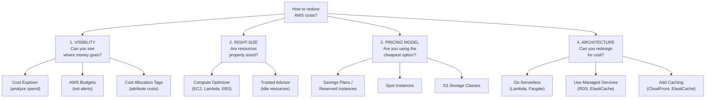
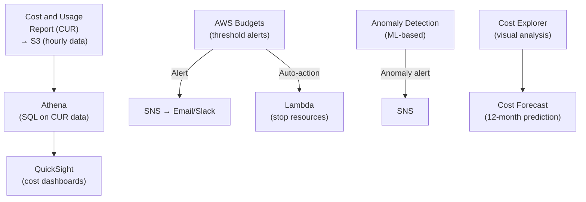
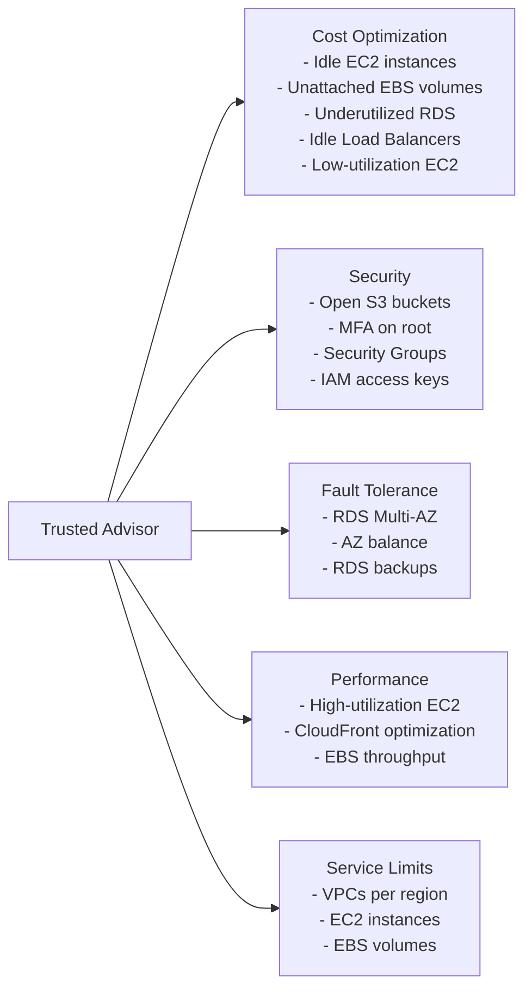
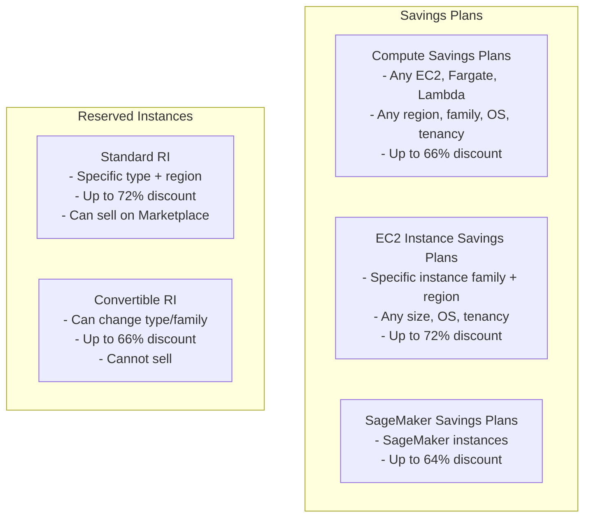
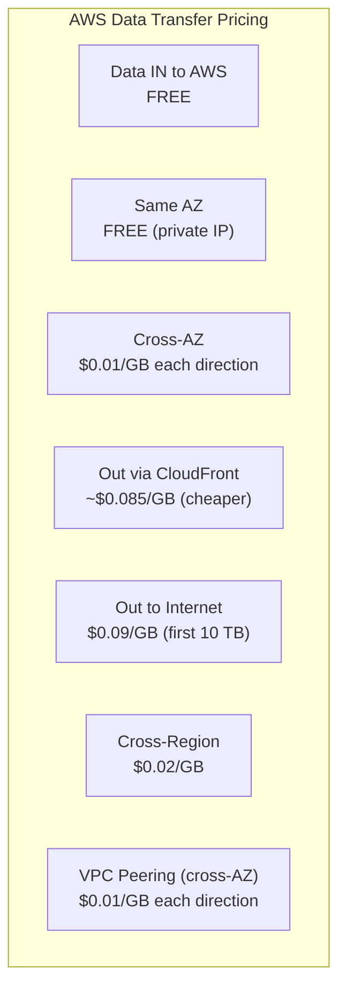

# Cost Optimization

## Overview

Understanding cost optimization is essential for any AWS architect. AWS provides a suite of cost management tools: **AWS Cost Explorer** for analysis, **AWS Budgets** for alerts, **AWS Trusted Advisor** for recommendations, **AWS Compute Optimizer** for right-sizing, and **Savings Plans / Reserved Instances** for commitment discounts. Understanding pricing models and optimization strategies is what distinguishes great architects.

## Key Concepts

| Concept | Description |
|---------|-------------|
| **Pay-as-you-go** | Default pricing — pay for what you use, per second/hour/GB |
| **Reserved Capacity** | Commit for 1-3 years for up to 72% discount (RDS, EC2, Redshift) |
| **Savings Plans** | Commit to $/hour spend for 1-3 years, flexible across instance types |
| **Spot Pricing** | Bid on spare capacity for up to 90% discount (can be interrupted) |
| **Right-Sizing** | Match instance type to actual workload requirements |
| **TCO** | Total Cost of Ownership — compare cloud cost to on-premises |

## Architecture Diagram

### Cost Optimization Decision Framework

### Cost Monitoring Architecture

## Deep Dive

### AWS Cost Explorer

| Feature | Detail |
|---------|--------|
| **Time Range** | Last 12 months of historical data, 12-month forecast |
| **Granularity** | Monthly, daily, hourly (hourly requires opt-in) |
| **Filters** | Service, account, region, instance type, tag, usage type |
| **Group By** | Service, account, tag, instance type, purchase option |
| **Savings Plans Recommendations** | Suggests optimal commitment based on historical usage |
| **Reserved Instance Recommendations** | Coverage and utilization reports |
| **Cost Forecast** | ML-based 12-month spend prediction |
| **Cost** | Free for standard views. $0.01 per API request |

### AWS Budgets

| Feature | Detail |
|---------|--------|
| **Budget Types** | Cost, Usage, Savings Plans coverage, Reservation utilization |
| **Alert Thresholds** | Percentage or absolute amount (e.g., alert at 80%, 100%, 120%) |
| **Notifications** | Email, SNS, Slack (via Chatbot) |
| **Budget Actions** | Auto-apply IAM policy (deny access), stop EC2 instances, apply SCP |
| **Cost** | First 2 budgets free, then $0.02/budget/day |
| **Forecasted Alerts** | Alert when forecasted spend will exceed budget |

### AWS Trusted Advisor

| Tier | Checks Available |
|------|-----------------|
| **Basic / Developer** | 7 core checks (S3 bucket permissions, Security Groups, IAM, MFA, EBS snapshots, RDS snapshots, service limits) |
| **Business / Enterprise Support** | All 100+ checks including cost optimization, performance, fault tolerance |

### AWS Compute Optimizer

| Feature | Detail |
|---------|--------|
| **Analyzes** | EC2, Auto Scaling Groups, Lambda, EBS, ECS on Fargate |
| **Data Source** | CloudWatch metrics (14 days minimum, 93 days recommended) |
| **Recommendations** | Right-size, downsize, or change instance family |
| **Savings Estimate** | Monthly dollar savings per recommendation |
| **Enhanced** | Opt-in for 3-month analysis + GPU/memory metrics |
| **Cost** | Free for standard, paid for Enhanced Infrastructure Metrics |

### Savings Plans vs Reserved Instances

| Feature | Savings Plans | Reserved Instances |
|---------|--------------|-------------------|
| **Flexibility** | High (Compute SP covers EC2, Fargate, Lambda) | Low (locked to instance type) |
| **Max Discount** | 66% (Compute SP), 72% (EC2 SP) | 72% (Standard RI) |
| **Payment Options** | All Upfront, Partial Upfront, No Upfront | Same |
| **Term** | 1 or 3 years | 1 or 3 years |
| **Marketplace** | Cannot resell | Standard RI can be resold |
| **Recommendation** | **Preferred** — simpler, more flexible | Legacy — use for specific cases |

### S3 Cost Optimization

| Strategy | Impact |
|----------|--------|
| **Lifecycle Policies** | Auto-transition: Standard → IA (30 days) → Glacier (90 days) → Deep Archive (180 days) |
| **Intelligent-Tiering** | Auto-moves data between tiers based on access (no retrieval fees) |
| **S3 Analytics** | Analyze access patterns to set optimal lifecycle rules |
| **Delete Incomplete Multipart Uploads** | Lifecycle rule to clean up after 7 days |
| **Compress Before Upload** | GZIP/LZ4 reduces storage and transfer costs |
| **Requester Pays** | Shift data transfer costs to the requester |
| **S3 Storage Lens** | Dashboard for storage metrics and cost across all buckets |

### EC2 Cost Optimization Strategies

| Strategy | Savings | Effort |
|----------|---------|--------|
| **Right-sizing** (Compute Optimizer) | 10-30% | Low |
| **Graviton instances** (ARM-based) | Up to 40% | Low-Medium |
| **Savings Plans** (Compute SP) | Up to 66% | Low |
| **Spot Instances** (fault-tolerant workloads) | Up to 90% | Medium |
| **Scheduling** (stop dev/test off-hours) | 65% | Low |
| **Auto Scaling** (scale to demand) | 20-50% | Medium |
| **Containerization** (ECS/EKS — better packing) | 20-40% | High |

### Data Transfer Costs

**Key rules:**
- Data **into** AWS is always free
- Same-AZ traffic with private IP is free
- Cross-AZ costs $0.01/GB each way (adds up fast!)
- Use CloudFront for internet egress (cheaper than direct)
- Use VPC endpoints to avoid NAT Gateway data processing fees ($0.045/GB)

### Cost Allocation Tags

| Tag Type | Description |
|----------|-------------|
| **AWS-Generated** | Auto-tagged (e.g., `aws:createdBy`). Must activate in Billing console |
| **User-Defined** | Custom tags you create (e.g., `Environment:prod`, `Team:backend`, `Project:phoenix`) |

**Best practice**: Tag everything with at least `Environment`, `Team`, `Project`, and `CostCenter`.

## Best Practices

1. **Enable Cost Explorer and set up Budgets on Day 1** — don't wait for a surprise bill
2. **Use Cost Allocation Tags** — you can't optimize what you can't attribute
3. **Review Compute Optimizer monthly** — right-size before buying commitments
4. **Buy Compute Savings Plans** (not RIs) — more flexible, similar discounts
5. **Use Spot for fault-tolerant workloads** — CI/CD runners, batch processing, dev/test
6. **Schedule non-production environments** — stop dev/test instances nights and weekends
7. **Use S3 Intelligent-Tiering** for unpredictable access patterns
8. **Use VPC endpoints** to avoid NAT Gateway data processing charges
9. **Use CloudFront** for internet egress — cheaper than direct and faster
10. **Delete unused resources** — unattached EBS volumes, old snapshots, idle load balancers, unused Elastic IPs

## Knowledge Check

### Q1: How would you reduce AWS costs for a company spending $100K/month?

**A:** Systematic approach: (1) **Visibility** — enable Cost Explorer, activate tags, set up Budgets. Identify top-5 cost drivers. (2) **Quick wins** — delete unused resources (Trusted Advisor finds idle EC2, unattached EBS, idle LBs). Schedule dev/test off-hours (65% savings). (3) **Right-size** — Compute Optimizer recommends smaller instances for over-provisioned workloads (10-30% savings). (4) **Commit** — buy Compute Savings Plans for steady-state workloads (up to 66% savings on baseline). (5) **Architecture** — use Spot for fault-tolerant workloads, add caching to reduce compute, move to serverless where appropriate. Typical savings: 30-60%.

### Q2: Explain Savings Plans vs Reserved Instances.

**A:** Both offer discounts for commitment (1-3 years). **Savings Plans** commit to a $/hour spend — Compute SP covers EC2, Fargate, and Lambda across any region/family/OS (up to 66% discount). EC2 Instance SP is locked to a family + region but gives up to 72%. **Reserved Instances** commit to a specific instance type — Standard RI gives up to 72% but is inflexible; Convertible RI allows changes but caps at 66%. **Recommendation**: Use Compute Savings Plans by default — nearly the same discount as RIs with much more flexibility. Use EC2 Instance SP when you're certain about your instance family.

### Q3: What is AWS Trusted Advisor and what does it check?

**A:** Trusted Advisor is an automated best-practice audit across 5 categories: (1) **Cost Optimization** — idle EC2, underutilized RDS, unattached EBS, idle LBs. (2) **Security** — open S3 buckets, root MFA, overly permissive Security Groups. (3) **Fault Tolerance** — RDS Multi-AZ, AZ balance, EBS snapshots. (4) **Performance** — over-utilized EC2, CloudFront config. (5) **Service Limits** — approaching resource quotas. Basic/Developer support gets 7 core security checks. Business/Enterprise support gets all 100+ checks. Can trigger auto-remediation via EventBridge + Lambda.

### Q4: How do you optimize data transfer costs?

**A:** (1) Use **VPC endpoints** (Gateway for S3/DynamoDB — free, Interface for other services) to avoid NAT Gateway data processing ($0.045/GB). (2) Use **CloudFront** for internet egress — cheaper per GB than direct. (3) Keep traffic in the same AZ when possible (free with private IPs). (4) Compress data before transfer. (5) Use S3 Transfer Acceleration only when justified. (6) For large cross-region transfers, batch during off-peak. (7) Use **PrivateLink** for inter-VPC traffic instead of peering (if sending to services). NAT Gateway costs are the #1 surprise on bills — audit first.

### Q5: How would you implement cost governance in a multi-account organization?

**A:** (1) **AWS Budgets** on every account with alerts at 80%, 100%, 120%. (2) **Budget Actions** auto-apply restrictive IAM policy if an account exceeds budget. (3) **Cost Allocation Tags** enforced by SCP (deny resource creation without required tags). (4) **Consolidated billing** via Organizations for aggregated discounts. (5) **Savings Plans** purchased at the management account level (shared across Organization). (6) **Service Quotas** to limit expensive services in sandbox accounts. (7) **Monthly cost review meetings** using Cost Explorer dashboards.

### Q6: When would you use Spot Instances and how do you handle interruptions?

**A:** Use Spot for fault-tolerant, stateless workloads: CI/CD runners, batch processing, data processing, dev/test, containerized microservices. Handling interruptions: (1) **Diversify** — Spot Fleet across 10+ instance types and 3+ AZs. (2) **Capacity-optimized allocation** — launch in pools with most available capacity. (3) **Graceful handling** — EventBridge catches the 2-minute warning, Lambda drains connections. (4) **Fallback** — Auto Scaling Group with mixed instances (70% Spot, 30% On-Demand). Never use Spot for: single-instance databases, stateful workloads, or anything that can't tolerate interruption.

### Q7: How does Compute Optimizer work?

**A:** Compute Optimizer analyzes CloudWatch metrics (CPU, memory, network, disk) for at least 14 days (93 days recommended) and recommends optimal instance types. It covers EC2, ASG, Lambda, EBS, and ECS on Fargate. For each resource, it shows: current config, recommended config, estimated monthly savings, and a risk level (low/medium/high — based on how close the recommendation is to workload peaks). Always review recommendations with the workload owner — a CPU-optimized instance might be right even if average CPU is low.

### Q8: What is the AWS Cost and Usage Report (CUR)?

**A:** CUR is the most detailed billing dataset — hourly or daily line items for every AWS resource with full tag, pricing, and usage breakdowns. It's delivered to an S3 bucket in CSV or Parquet format. Use Athena to query it directly (SQL). Use QuickSight to build custom cost dashboards. CUR is more granular than Cost Explorer — it's the source of truth for chargeback, showback, and custom cost analytics. Enable Parquet format and hourly granularity for the richest analysis.

### Q9: How do you prevent unexpected AWS bills?

**A:** (1) **AWS Budgets** with forecasted alerts — know before you overspend. (2) **Cost Anomaly Detection** — ML flags unusual spending patterns. (3) **Budget Actions** — auto-restrict IAM if budget exceeded. (4) **SCPs** — deny expensive services (e.g., deny p4d.24xlarge in sandbox). (5) **Billing alarm** in CloudWatch (legacy but still useful). (6) **Monthly review cadence** — check Cost Explorer weekly during ramp-up. (7) **Tag enforcement** — require cost allocation tags to identify ownership. (8) **Free tier alerts** — enable in Billing preferences for new accounts.

### Q10: What is the difference between Cost Explorer, CUR, and Trusted Advisor for cost?

**A:** **Cost Explorer** = visual analysis and forecasting. Pre-built dashboards for spend by service, account, tag. Good for "where is money going?" and "what will next month cost?" **CUR (Cost and Usage Report)** = raw billing data. Line-item detail in S3. Query with Athena. Good for chargeback, custom analytics, and deep investigation. **Trusted Advisor** = actionable recommendations. Finds waste (idle EC2, unattached EBS, low-utilization instances). Good for "what should I turn off?" Use all three: Trusted Advisor for quick wins, Cost Explorer for trends, CUR for detailed analysis.

## Latest Updates (2025-2026)

| Update | Description |
|--------|-------------|
| **AWS Billing Conductor** | Create custom pricing rules and billing groups to generate pro forma billing reports for showback/chargeback — useful for resellers and internal business units |
| **Cost Optimization Hub** | Centralized console aggregating cost optimization recommendations from Compute Optimizer, Trusted Advisor, S3 analytics, and more into a single prioritized view |
| **Split Cost Allocation** | Allocate shared container and serverless costs (ECS, EKS, Lambda) to individual tenants, teams, or workloads using split cost allocation data |
| **Savings Plans for SageMaker** | SageMaker Savings Plans offer up to 64% discount on SageMaker ML instance usage with 1-3 year commitments |

### Q11: What is the FinOps framework and how do you implement it on AWS?

**A:** FinOps (Financial Operations) is a cultural practice that brings financial accountability to cloud spending. The framework has three phases: (1) **Inform** — give teams visibility into their costs. Implement cost allocation tags, CUR + Athena dashboards, and Cost Explorer access for all teams. Everyone should see what they spend. (2) **Optimize** — act on the data. Right-size instances, purchase Savings Plans, delete waste, use Spot, move to serverless. (3) **Operate** — build continuous governance. Budget alerts, automated enforcement (SCPs to deny expensive instances, Lambda to stop untagged resources), monthly review cadences. On AWS, this maps to: Cost Allocation Tags + CUR (Inform), Compute Optimizer + Savings Plans + Spot (Optimize), Budgets + SCPs + automation (Operate). FinOps is not a one-time project — it is a continuous operating model.

### Q12: What is the difference between chargeback and showback models?

**A:** **Chargeback** directly charges business units for their actual AWS consumption — the cost appears on their P&L. Requires accurate cost allocation (tags, split cost allocation for shared resources), billing rules, and often AWS Billing Conductor to generate per-unit invoices. Used by: mature organizations, internal cloud platforms, MSPs/resellers. **Showback** shows teams their costs without actually billing them — it's informational and drives accountability through transparency. Easier to implement (Cost Explorer filtered by team tag). Used by: organizations starting their FinOps journey, companies with centralized IT budgets. Most organizations start with showback to build awareness, then graduate to chargeback as tagging and allocation mature.

### Q13: How do you build a cloud financial management practice?

**A:** Build progressively: (1) **Foundation** — enable Cost Explorer, activate cost allocation tags (enforce via SCP), deploy CUR to S3, create basic Budgets per account. (2) **Visibility** — build cost dashboards (CUR + Athena + QuickSight), implement anomaly detection, establish cost-per-team and cost-per-environment views. (3) **Optimization** — monthly right-sizing reviews (Compute Optimizer), Savings Plans purchasing (quarterly cadence), Spot adoption for fault-tolerant workloads, storage lifecycle policies. (4) **Governance** — Budget Actions for enforcement, SCPs to restrict expensive instance types in non-production, automated shutdown of dev/test off-hours. (5) **Culture** — FinOps lead role, monthly cost review meetings with engineering leads, cost KPIs in team dashboards, gamification (team cost reduction leaderboards). The goal is to make cost a first-class engineering metric alongside performance and reliability.

### Q14: How do you optimize costs for EKS workloads?

**A:** EKS cost optimization combines three strategies: (1) **Karpenter** — the Kubernetes-native node provisioner that replaces Cluster Autoscaler. Karpenter selects the optimal instance type from dozens of options based on pod requirements, consolidates underutilized nodes, and responds to scheduling needs in seconds (not minutes). (2) **Spot Instances** — configure Karpenter to prefer Spot nodes for fault-tolerant workloads. Use node affinity to pin stateful workloads to On-Demand and stateless workloads to Spot. Diversify across 15+ instance types for Spot capacity. (3) **Graviton (ARM)** — Graviton3/4 instances deliver up to 40% better price-performance. Build multi-arch container images and let Karpenter schedule on Graviton when available. Combined effect: Karpenter right-sizes nodes (20-30% savings), Spot provides 60-70% discount on eligible workloads, and Graviton adds another 20-40% savings. Additionally, use Kubernetes resource requests and limits properly — over-provisioned pods waste node capacity.

### Q15: How do you approach reserved capacity planning?

**A:** Follow a data-driven methodology: (1) **Baseline analysis** — use Cost Explorer's Savings Plans Recommendations, which analyze 7-30-60 days of historical usage to suggest optimal commitment levels. (2) **Coverage strategy** — commit Savings Plans for only the steady-state baseline (e.g., 60-70% of average usage). Cover the rest with On-Demand and Spot. (3) **Term selection** — 1-year No Upfront for workloads with uncertain growth, 3-year All Upfront for stable core infrastructure (maximum discount). (4) **Review cadence** — quarterly review of utilization and coverage reports in Cost Explorer. Adjust commitments as usage changes. (5) **Layered approach** — Compute Savings Plans as the base layer (most flexible), EC2 Instance Savings Plans for known stable workloads (higher discount). (6) **Organization-level** — purchase at the management account for shared benefit across all accounts (consolidated billing discount sharing).

### Q16: What is the cost impact of multi-AZ vs multi-region?

**A:** Multi-AZ is relatively affordable: cross-AZ data transfer is $0.01/GB each direction, and services like RDS Multi-AZ and Aurora automatically replicate at no extra data transfer cost (built into the service price). The primary cost is running duplicate instances in a second AZ. Multi-region is significantly more expensive: cross-region data transfer is $0.02/GB, you must run full infrastructure in each region, and services like Aurora Global Database add read replica costs in the secondary region. Rule of thumb: Multi-AZ adds ~20-40% cost for high availability within a region (and is almost always worth it). Multi-region adds 100-200%+ cost for geographic disaster recovery or low-latency global access. Use multi-AZ for HA (always), multi-region only when business requirements demand it (compliance, global users, RTO < 1 hour).

### Q17: How do you handle dev/test cost sprawl?

**A:** Dev/test environments often exceed production costs due to lack of governance: (1) **Scheduling** — AWS Instance Scheduler or Lambda stops dev/test instances outside business hours (6 PM to 8 AM + weekends = 65% savings). (2) **Smaller instances** — enforce smaller instance types in non-production via SCPs (deny anything larger than m5.xlarge). (3) **Spot for everything** — dev/test workloads are interruptible by definition. Use Spot for EC2 and EKS dev nodes. (4) **Shared environments** — consolidate multiple developers into shared dev clusters instead of per-developer environments. (5) **TTL (time-to-live)** — tag resources with an expiration date, Lambda function auto-deletes expired resources. (6) **Sandbox guardrails** — AWS Budgets with auto-stop actions, SCPs restricting service usage, Service Quotas limiting instance counts. (7) **Ephemeral environments** — spin up environments on demand (CI/CD creates and destroys per PR), rather than running persistent dev environments.

### Q18: How do you automate cost optimization with Lambda?

**A:** Common Lambda-based automations: (1) **Stop idle resources** — EventBridge scheduled rule triggers Lambda to stop EC2 instances tagged `Schedule:business-hours` outside business hours. (2) **Delete old snapshots** — Lambda scans EBS snapshots older than 30 days without a `Retain:true` tag and deletes them. (3) **Right-sizing alerts** — Lambda queries Compute Optimizer API weekly and sends Slack notifications for instances with > 30% potential savings. (4) **Unattached resource cleanup** — Lambda finds and reports unattached EBS volumes, unused Elastic IPs, and idle load balancers. (5) **Tag enforcement** — EventBridge detects new resource creation, Lambda checks for required tags, notifies the owner and applies a default tag if missing. (6) **Reserved/Spot coverage reporting** — Lambda calculates the percentage of spend covered by Savings Plans and alerts if coverage drops below target. All these automations run on a schedule (EventBridge Scheduler) with minimal cost (Lambda free tier covers most).

## Deep Dive Notes

### FinOps on AWS (Inform, Optimize, Operate)

**Inform Phase** — The goal is to answer "Where is the money going?" Tools: Cost Allocation Tags (enforce `Team`, `Environment`, `Project`, `CostCenter` on all resources), Cost and Usage Report delivered hourly to S3 in Parquet format, Athena for SQL queries on CUR data, QuickSight for visual dashboards shared with stakeholders. Critical: if you cannot attribute a cost, you cannot optimize it. The single biggest FinOps failure is poor tagging — start with an SCP that denies resource creation without required tags.

**Optimize Phase** — Act on the data: Right-sizing (Compute Optimizer for EC2/Lambda/EBS, Cost Optimization Hub for centralized view), commitment discounts (Compute Savings Plans for baseline, Spot for variable), architectural optimization (serverless, caching, data transfer reduction). Prioritize by dollar impact: a 10% saving on a $50K/month service matters more than 50% on a $500/month service.

**Operate Phase** — Build continuous governance: AWS Budgets with actions (auto-restrict if exceeded), anomaly detection (ML-based alerts on unusual spend), monthly FinOps reviews with engineering leads (review top-10 cost changes, action items, Savings Plans utilization), quarterly commitment renewals, annual architecture cost reviews. The operate phase is where FinOps becomes a muscle, not a project.

### Unit Economics and Cost Per Transaction

Move beyond "total AWS spend" to **unit economics** — cost per transaction, cost per user, cost per API call. This connects cloud cost to business value. To calculate: (1) Use CUR data to calculate total cost for a service (e.g., the order processing API). (2) Use CloudWatch metrics to count transactions (API Gateway request count). (3) Divide: $5,000/month / 10 million requests = $0.0005 per request. Track this over time — it should decrease as you optimize and scale. Unit economics enables conversations like "this feature costs $0.02 per user/month — is that acceptable?" rather than "our bill went up $10K." Build unit cost dashboards in QuickSight with CUR data joined to application metrics.

### Building Cost Dashboards with CUR + Athena + QuickSight

Step-by-step: (1) Enable CUR in Billing console — deliver hourly, Parquet format, to a dedicated S3 bucket. (2) Create an Athena table over the CUR data using the CloudFormation template AWS provides (auto-partitions by month). (3) Write Athena queries: `SELECT line_item_product_code, SUM(line_item_unblended_cost) FROM cur WHERE month='2025-03' GROUP BY 1 ORDER BY 2 DESC` for cost by service. (4) Create QuickSight datasets connected to Athena. (5) Build dashboards: cost by service (pie chart), cost trend (line chart), cost by team tag (bar chart), top-10 most expensive resources (table). (6) Schedule email reports to stakeholders. (7) Add SPICE refresh on a daily schedule for fast dashboard loads. AWS also provides the **Cloud Intelligence Dashboards** — open-source QuickSight dashboard templates (CUDOS, CID, KPI) that visualize CUR data with pre-built analyses.

### Organizational Cost Governance Maturity Model

| Level | Name | Characteristics |
|-------|------|----------------|
| **Level 0** | Reactive | No visibility, surprise bills, no tagging, no budgets |
| **Level 1** | Informed | Cost Explorer enabled, basic budgets, some tagging |
| **Level 2** | Optimized | Right-sizing done, Savings Plans purchased, dev/test scheduling, CUR dashboards |
| **Level 3** | Governed | SCPs enforce tagging, Budget Actions auto-restrict, anomaly detection, monthly reviews |
| **Level 4** | FinOps-Driven | Unit economics tracked, cost KPIs per team, automated optimization, FinOps lead role, continuous improvement culture |

Most organizations are at Level 1-2. The goal is Level 3-4 where cost is a first-class engineering concern. The transition from Level 2 to Level 3 requires executive sponsorship, a dedicated FinOps practice, and tooling automation.

## Real-World Scenarios

### S1: Your AWS bill is $80K/month and leadership demands a 25% reduction in 30 days. Where do you start?

**A:** Focus on the **three biggest quick wins** (no architectural changes): (1) **Non-production scheduling** — shut down dev/staging EC2, RDS, and EKS nodes evenings/weekends with Instance Scheduler. Saves 65% of non-prod compute (~$8K/month if non-prod is 20% of spend). (2) **Unused resources** — delete unattached EBS volumes, unused Elastic IPs ($3.60/month each), old snapshots, idle load balancers. AWS Trusted Advisor lists these. Typically saves 5-10% (~$5K). (3) **Savings Plans** — purchase 1-year Compute Savings Plan covering 70% of steady-state EC2/Fargate/Lambda usage. Saves 20-30% on committed compute (~$7K). Total: ~$20K/month (25%). For the next phase: right-size with Compute Optimizer, migrate to Graviton, optimize S3 lifecycle rules.

### S2: Your S3 costs quadrupled after enabling versioning for compliance. How do you manage costs without disabling versioning?

**A:** Versioning is required for compliance, but noncurrent versions accumulate silently. (1) **Lifecycle rule for noncurrent versions** — expire noncurrent versions after 30-90 days (compliance-approved retention period). This is the #1 fix. (2) **Transition noncurrent to cheaper storage** — move noncurrent versions to Glacier Instant Retrieval after 7 days (68% cheaper, still accessible). (3) **Abort incomplete multipart uploads** — add lifecycle rule to clean up after 7 days. (4) **S3 Inventory** — run weekly to analyze storage distribution by version and storage class. (5) **S3 Storage Lens** — dashboard showing cost breakdown by bucket, prefix, storage class, and version status. (6) **Delete markers** — lifecycle rule to remove expired delete markers (they're zero-byte but counted as objects).

### S3: Your team uses 50 different Lambda functions. The serverless bill is $15K/month and growing. How do you optimize?

**A:** (1) **Memory/power tuning** — use AWS Lambda Power Tuning (Step Functions tool) on each function. Many are over-allocated. Reducing memory from 1024MB to 512MB halves cost if execution time doesn't increase significantly. (2) **ARM64/Graviton** — change architecture from x86 to arm64. 20% cheaper per ms, often faster. One-line change in the function config. (3) **Duration optimization** — profile with X-Ray. Common wins: lazy-load SDKs, connection reuse (keep DB connections outside handler), reduce package size for faster cold starts. (4) **Provisioned Concurrency audit** — if set but usage is low, you're paying for idle. Only use for latency-sensitive functions. (5) **Batch processing** — if functions process SQS messages one-by-one, increase batch size to 10. One invocation processes 10 messages instead of 10 invocations. (6) **Step Functions Express** — if using Standard workflows for short tasks, Express is 10-20x cheaper.

## Cheat Sheet

| Concept | Key Facts |
|---------|-----------|
| Cost Explorer | 12-month history, forecasting, SP/RI recommendations, free |
| AWS Budgets | Cost/usage alerts, auto-actions, first 2 free |
| Trusted Advisor | 5 categories, 7 free checks, 100+ with Business/Enterprise |
| Compute Optimizer | Right-size EC2/Lambda/EBS/ECS, needs 14+ days CloudWatch data |
| Compute Savings Plans | Flexible (EC2, Fargate, Lambda), up to 66%, 1-3 year term |
| EC2 Instance SP | Family + region locked, up to 72%, 1-3 year term |
| Spot Instances | Up to 90% discount, 2-min interruption warning, fault-tolerant only |
| Data Transfer IN | Always free |
| Cross-AZ Transfer | $0.01/GB each direction |
| NAT Gateway Processing | $0.045/GB — use VPC endpoints instead |
| CloudFront Egress | Cheaper than direct internet egress |
| CUR | Most detailed billing data, S3 delivery, query with Athena |
| Cost Anomaly Detection | ML-based unusual spend alerts |
| Cost Allocation Tags | Tag everything: Environment, Team, Project, CostCenter |
| Billing Conductor | Custom pricing rules, pro forma billing, showback/chargeback |
| Cost Optimization Hub | Centralized recommendations across all AWS cost tools |
| Split Cost Allocation | Attribute shared ECS/EKS/Lambda costs to tenants or teams |
| FinOps | Inform → Optimize → Operate, continuous cloud financial management |
| Unit Economics | Cost per transaction/user — connects cloud spend to business value |

---

[← Previous: Cloud Migration](../14-cloud-migration/) | [Next: Systems Manager →](../16-systems-manager/)
