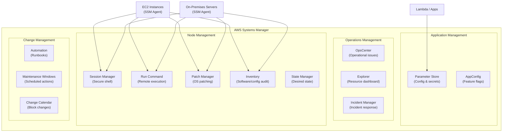
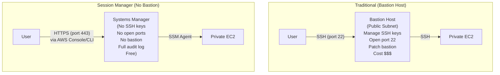
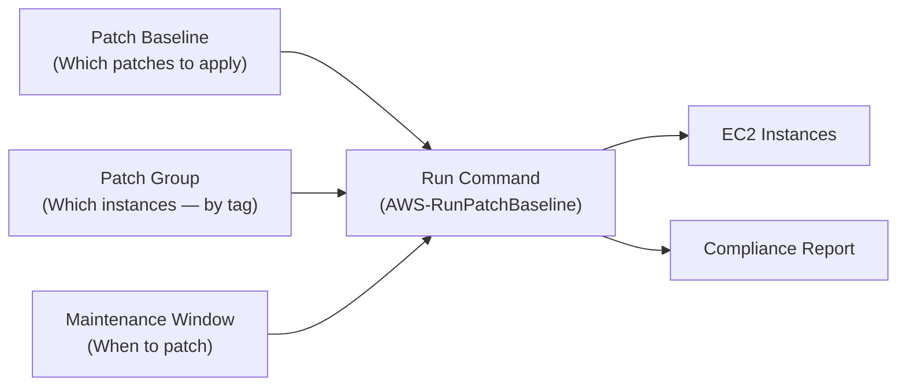
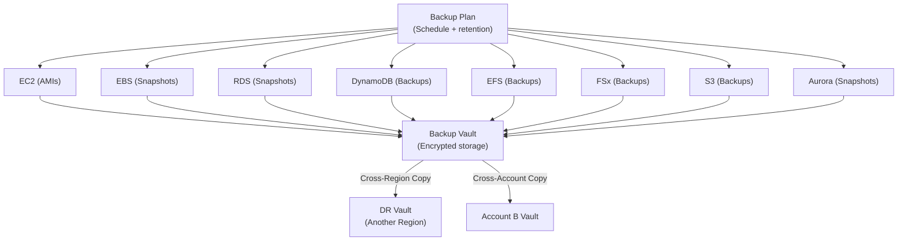

# Systems Manager & Operational Tools

## Overview

**AWS Systems Manager (SSM)** is a suite of operational tools for managing EC2 instances, on-premises servers, and other AWS resources at scale. It solves real operational pain: **Parameter Store** for configuration, **Session Manager** for secure shell access (no SSH keys!), **Patch Manager** for patching, and **Run Command** for remote execution. This section also covers **AWS Backup** for centralized backup management.

## Key Concepts

| Concept | Description |
|---------|-------------|
| **SSM Agent** | Pre-installed on Amazon Linux 2/2023 and Windows AMIs. Required for SSM features |
| **Managed Instance** | Any EC2 instance or on-premises server registered with SSM |
| **Parameter Store** | Centralized config/secret storage (key-value pairs) |
| **Session Manager** | Browser-based shell access — no SSH, no bastion, no open ports |
| **Run Command** | Execute commands on managed instances remotely at scale |
| **Patch Manager** | Automate OS and application patching |
| **Automation** | Runbooks for common tasks (stop instance, create AMI, remediate) |

## Architecture Diagram

### Systems Manager Overview



### Session Manager vs Bastion Host



## Deep Dive

### Parameter Store

Centralized configuration management — store database URLs, feature flags, API endpoints, and secrets.

| Feature | Detail |
|---------|--------|
| **Types** | `String`, `StringList`, `SecureString` (encrypted with KMS) |
| **Hierarchy** | Path-based: `/app/prod/db-host`, `/app/dev/db-host` |
| **Tiers** | Standard (free, 10,000 params, 4 KB max) or Advanced (charges, 100,000 params, 8 KB max) |
| **Versioning** | Every update creates a new version, can reference specific versions |
| **Policies** | Expiration (auto-delete), ExpirationNotification, NoChangeNotification |
| **Integration** | Lambda, ECS, CloudFormation, CodeBuild, EC2 User Data natively reference parameters |
| **Cross-Account** | Share parameters across accounts via resource policies |

#### Parameter Store vs Secrets Manager

| Feature | Parameter Store | Secrets Manager |
|---------|----------------|-----------------|
| **Cost** | Free (Standard tier) | $0.40/secret/month + $0.05/10K API calls |
| **Rotation** | Manual (Lambda trigger) | Built-in automatic rotation |
| **Max Size** | 8 KB (Advanced) | 64 KB |
| **Cross-Account** | Resource policies | Resource policies |
| **Best For** | Config values, non-rotating secrets, feature flags | Database credentials, API keys that need rotation |

**Rule of thumb**: Use Parameter Store for configuration. Use Secrets Manager for credentials that need automatic rotation (RDS passwords, API keys).

### Session Manager

| Feature | Detail |
|---------|--------|
| **Access** | AWS Console (browser), AWS CLI, or SSH over SSM |
| **No Open Ports** | No port 22/3389 needed. No Security Group changes |
| **No SSH Keys** | IAM-based access control |
| **Audit** | Every session logged to CloudWatch Logs or S3 |
| **Encryption** | Session data encrypted with KMS |
| **Port Forwarding** | Forward local ports to private resources (RDS, internal apps) |
| **On-Premises** | Works with on-premises servers registered with SSM |
| **Cost** | Free |

#### Session Manager IAM Policy

```json
{
  "Effect": "Allow",
  "Action": [
    "ssm:StartSession"
  ],
  "Resource": [
    "arn:aws:ec2:*:*:instance/*"
  ],
  "Condition": {
    "StringLike": {
      "ssm:resourceTag/Environment": "dev"
    }
  }
}
```

### Run Command

| Feature | Detail |
|---------|--------|
| **Purpose** | Execute commands on managed instances without SSH |
| **Documents** | Predefined (AWS-RunShellScript, AWS-RunPowerShellScript) or custom |
| **Targeting** | By instance ID, tag, resource group, or all managed instances |
| **Rate Control** | Concurrency limits and error thresholds |
| **Output** | S3 bucket or CloudWatch Logs |
| **Integration** | EventBridge triggers, maintenance windows, automation |

### Patch Manager



| Feature | Detail |
|---------|--------|
| **Patch Baselines** | Define which patches are approved (auto-approve after N days, classify by severity) |
| **Patch Groups** | Tag-based grouping (e.g., `PatchGroup: prod-web-servers`) |
| **Maintenance Windows** | Schedule patching (e.g., Sunday 2 AM, max 2 hours) |
| **Compliance** | Dashboard showing patched vs non-compliant instances |
| **Supported OS** | Amazon Linux, Ubuntu, RHEL, SUSE, CentOS, Windows Server |
| **On-Premises** | Works with registered on-prem servers |

### Automation (Runbooks)

| Feature | Detail |
|---------|--------|
| **Purpose** | Automate common operational tasks with multi-step workflows |
| **Pre-Built** | 100+ AWS-provided runbooks (restart instance, create AMI, enable S3 encryption) |
| **Custom** | Write your own in YAML/JSON |
| **Approval** | Manual approval steps in workflows |
| **Integration** | Triggered by EventBridge, Config rules, or manual execution |
| **Cross-Account** | Execute runbooks across accounts in Organizations |
| **Use Cases** | Auto-remediate Config violations, create golden AMIs, rotate credentials |

### AWS Backup



| Feature | Detail |
|---------|--------|
| **Backup Plans** | Schedules (daily, weekly, monthly), retention policies, lifecycle to cold storage |
| **Supported Services** | EC2, EBS, RDS, Aurora, DynamoDB, EFS, FSx, S3, DocumentDB, Neptune, SAP HANA |
| **Vault Lock** | WORM — prevents deletion of backups (compliance) |
| **Cross-Region** | Copy backups to another region for DR |
| **Cross-Account** | Share backups with other accounts in Organizations |
| **Audit Manager** | Track backup compliance with frameworks |
| **Cost** | Pay for backup storage + data transfer |

## Best Practices

1. **Use Session Manager instead of bastion hosts** — no SSH keys, no open ports, full audit
2. **Store all configuration in Parameter Store** — never hardcode in application code
3. **Use Secrets Manager** for credentials that need rotation (RDS passwords, API keys)
4. **Enable Patch Manager** with maintenance windows for all production instances
5. **Use Automation runbooks** for auto-remediation of Config rule violations
6. **Enable AWS Backup** across all accounts with cross-region copies for DR
7. **Use Vault Lock** for compliance — prevents backup deletion
8. **Tag instances with PatchGroup** tags for organized patch management
9. **Log all Session Manager sessions** to S3 and CloudWatch for audit
10. **Use SSM Inventory** to track installed software and OS configurations

## Knowledge Check

### Q1: What is AWS Systems Manager and why is it important?

**A:** Systems Manager is a suite of tools for managing EC2 instances and on-prem servers at scale. Key capabilities: **Parameter Store** (centralized config), **Session Manager** (secure shell without SSH), **Run Command** (remote execution), **Patch Manager** (automated patching), **Automation** (runbooks). It's important because it eliminates bastion hosts, SSH key management, and manual patching — three major operational pain points. Requires the SSM Agent (pre-installed on Amazon Linux 2/2023 and Windows).

### Q2: How does Session Manager work and why is it better than SSH?

**A:** Session Manager creates a secure, audited shell session through HTTPS (port 443) — no SSH port needed, no keys to manage, no bastion host to maintain. The SSM Agent on the instance communicates outbound to the SSM service. IAM controls who can access which instances (tag-based policies). Every keystroke is logged to CloudWatch Logs or S3 for audit. Port forwarding tunnels local ports to private resources. It's better because: zero attack surface (no open ports), centralized auth (IAM), full audit trail, and it's free.

### Q3: What is the difference between Parameter Store and Secrets Manager?

**A:** **Parameter Store** is free (Standard tier), supports hierarchical config (`/app/prod/db-host`), stores strings, string lists, and encrypted strings (SecureString via KMS). Best for: application configuration, feature flags, non-rotating secrets. **Secrets Manager** costs $0.40/secret/month, supports automatic rotation with built-in Lambda functions for RDS, Redshift, and DocumentDB. Best for: database credentials and API keys that need rotation. Use both: Parameter Store for config values, Secrets Manager for credentials.

### Q4: How do you automate OS patching across 500 EC2 instances?

**A:** (1) Ensure SSM Agent is running on all instances. (2) Create **Patch Baselines** — define which patches to approve (e.g., auto-approve critical patches after 3 days). (3) Tag instances with `PatchGroup` values (e.g., `prod-web`, `prod-db`). (4) Create **Maintenance Windows** — schedule patching (e.g., prod: Sunday 2 AM). (5) Patch Manager runs `AWS-RunPatchBaseline` during the window. (6) Review **Compliance Dashboard** for results. (7) Set up CloudWatch Alarms for non-compliant instances. Use different schedules for dev (weekly, auto-apply) vs prod (bi-weekly, with approval).

### Q5: How does AWS Backup differ from service-native backups?

**A:** Service-native backups (RDS automated backups, EBS snapshots) are per-service — you manage each separately. **AWS Backup** provides a single centralized console across all services: define backup plans (schedule + retention) once, apply to any resource by tag. Key advantages: (1) Cross-region and cross-account copies for DR. (2) **Vault Lock** for WORM compliance. (3) **Backup Audit Manager** for compliance reporting. (4) Consistent policy across all services. Use AWS Backup for production environments; service-native backups are fine for dev/test.

### Q6: How do you use SSM Automation for auto-remediation?

**A:** Example: AWS Config rule detects an EBS volume is unencrypted. (1) Config triggers an EventBridge event. (2) EventBridge invokes an SSM Automation runbook (e.g., `AWS-EnableEbsEncryptionByDefault`). (3) The runbook creates an encrypted copy of the volume, swaps it, and deletes the unencrypted one. Pre-built runbooks cover 100+ scenarios: restart instances, enable S3 encryption, update Security Groups, create golden AMIs. Custom runbooks use YAML with steps, approvals, and error handling.

### Q7: How does SSM Run Command differ from SSH?

**A:** Run Command executes commands on managed instances without SSH. Advantages: (1) **No ports** — runs via SSM Agent (outbound HTTPS). (2) **Scale** — target hundreds of instances by tag. (3) **Rate control** — limit concurrency and error thresholds. (4) **Audit** — output to S3/CloudWatch, execution history in SSM. (5) **IAM auth** — no SSH keys. (6) **Cross-platform** — same interface for Linux and Windows. Use it for: collecting logs, restarting services, deploying config files, running health checks at scale.

### Q8: What is SSM AppConfig and when would you use it?

**A:** AppConfig manages application configuration and feature flags with safety controls. Unlike Parameter Store (static config), AppConfig supports: (1) **Gradual rollout** — deploy config changes to 10%, then 50%, then 100%. (2) **Validators** — JSON Schema or Lambda to validate before deployment. (3) **Rollback** — automatic rollback if CloudWatch alarms fire. (4) **Feature flags** — toggle features on/off without redeploying. Use when: you need controlled config rollout with safety guardrails. Use Parameter Store when: config changes are simple and don't need gradual deployment.

## Latest Updates (2025-2026)

| Update | Description |
|--------|-------------|
| **SSM Quick Setup Improvements** | Simplified configuration of SSM features (Session Manager, Patch Manager, Inventory) across multiple accounts and regions with a single setup wizard |
| **Change Manager** | Managed change request and approval workflow integrated with SSM Automation — enforces change calendar, requires approvals, and provides audit trail |
| **Application Manager** | Unified view of application health, resources, and operations — groups resources by application and provides a single-pane dashboard |
| **Default Host Management** | Automatically configures all EC2 instances in an account/region as managed nodes without manually installing SSM Agent or attaching instance profiles |
| **Fleet Management for Hybrid Nodes** | Enhanced hybrid activation for on-premises and multi-cloud servers — improved registration, tagging, and management of non-EC2 nodes |

### Q9: How does SSM Change Manager compare to manual change control?

**A:** Change Manager replaces ad-hoc change processes (email approvals, Jira tickets, manual runbooks) with an integrated, automated workflow. You define change templates (what automation runs, who approves, what calendar windows are allowed), users submit change requests, designated approvers approve/reject in the SSM console or via SNS notification, and approved changes execute as SSM Automation runbooks during the allowed maintenance window. Benefits over manual: (1) Audit trail — every change is logged with who requested, who approved, and what happened. (2) Calendar enforcement — changes are blocked during freeze periods automatically. (3) Rollback — automation runbooks include rollback steps. (4) Multi-account — works across Organizations. This brings ITIL-style change management directly into the operational tool, eliminating the gap between "approved" and "executed."

### Q10: How do you manage hybrid environments with SSM fleet management?

**A:** SSM supports non-EC2 nodes (on-premises servers, VMs in other clouds) via **hybrid activations**. You create an activation in SSM (generates an activation code and ID), install the SSM Agent on the on-premises server, and register it using the activation. The server appears as a managed instance with a `mi-` prefix. From there, it supports Session Manager, Run Command, Patch Manager, Inventory, and State Manager — the same capabilities as EC2. For fleet management: (1) Tag hybrid nodes consistently (e.g., `Location:datacenter-1`, `OS:rhel-8`). (2) Use Resource Groups to organize by location or function. (3) Patch Manager baselines work identically for hybrid nodes. (4) Default Host Management Configuration now extends to hybrid nodes, simplifying onboarding. The key networking requirement: hybrid nodes must have outbound HTTPS (443) access to SSM service endpoints (directly or via VPN/DX).

### Q11: How do you implement a golden AMI pipeline with SSM?

**A:** A golden AMI pipeline produces hardened, patched, pre-configured AMIs: (1) **Start with a base AMI** (Amazon Linux 2023 or Windows Server). (2) **SSM Automation runbook** (custom or `AWS-UpdateLinuxAmi`) launches an instance from the base AMI. (3) **Run Command** installs required software (monitoring agents, security tools, company packages) via SSM Distributor or shell commands. (4) **Patch Manager** applies the latest OS patches. (5) **Inspector** scans for vulnerabilities. (6) **Automation** creates a new AMI, tags it with version and date, and shares it with target accounts. (7) **EventBridge schedule** triggers this monthly. (8) **EC2 Image Builder** (alternative) provides a visual pipeline for the same workflow. Store the AMI ID in Parameter Store (`/golden-ami/amazon-linux/latest`) so Auto Scaling Groups and Launch Templates always reference the latest version.

### Q12: How does SSM Distributor work for software packages?

**A:** Distributor is a package management feature within SSM for deploying software to managed instances. You create a package (ZIP with install/uninstall scripts + binaries), upload it to Distributor, and deploy it via Run Command or State Manager. AWS provides pre-built packages for common agents (CloudWatch Agent, Inspector Agent, CodeDeploy Agent). For custom packages: bundle your software with install scripts (Bash/PowerShell), create a manifest, and publish to Distributor. Deploy at scale using tag-based targeting. Distributor handles versioning — you can roll out v2 while v1 is running and roll back if needed. Combined with State Manager, you can ensure specific packages remain installed (desired state enforcement). This replaces tools like Ansible for software distribution when you are already invested in the SSM ecosystem.

### Q13: How does State Manager enforce desired state configuration?

**A:** State Manager applies a configuration (SSM document/association) to managed instances on a recurring schedule to ensure compliance. Example: you create an association that runs `AWS-GatherSoftwareInventory` every 30 minutes, or one that runs a custom document ensuring the CloudWatch Agent is installed and running. If an instance drifts from the desired state (someone uninstalls the agent), State Manager automatically re-applies the configuration at the next scheduled interval. Use cases: (1) Ensure security agents are always installed. (2) Enforce OS configurations (NTP, DNS, sysctl settings). (3) Apply registry settings on Windows servers. (4) Maintain file content (push config files). State Manager associations are evaluated as compliant/non-compliant in the SSM Compliance dashboard, giving you a fleet-wide compliance view.

### Q14: How does Incident Manager work for on-call and incident response?

**A:** Incident Manager provides automated incident response integrated with SSM: (1) **Response plans** define what happens when an incident occurs — which runbook to execute, who to page, which chat channel to activate. (2) **On-call schedules** and **escalation plans** route to the right person (supports PagerDuty-style rotation). (3) **CloudWatch Alarms or EventBridge rules** trigger the response plan automatically. (4) The incident creates a timeline, links related CloudWatch metrics and runbooks, and tracks action items. (5) **Post-incident analysis** generates a structured review document with timeline, impact, and follow-up items. This replaces third-party incident management tools for teams deeply integrated with AWS. Key advantage: the runbook that remediates the incident (SSM Automation) is embedded directly in the incident workflow.

### Q15: How does OpsCenter help with operational insights?

**A:** OpsCenter aggregates operational issues (OpsItems) from across AWS services into a single console. OpsItems are automatically created by: CloudWatch Alarms, Config non-compliant rules, SSM Automation failures, Incident Manager incidents, Security Hub findings, and custom sources via API. Each OpsItem includes: related resources, CloudWatch metrics/logs, similar past issues, and runbook suggestions. You can run SSM Automation runbooks directly from an OpsItem to remediate. OpsCenter integrates with Amazon Q (AI) to provide natural language explanations of issues and recommended actions. For organizations, OpsCenter supports a delegated administrator model — a central operations team sees OpsItems from all accounts.

### Q16: How do you build compliance reporting across a hybrid fleet?

**A:** Combine multiple SSM features: (1) **SSM Inventory** — auto-collects installed software, OS version, network config, Windows roles, custom metadata from all managed instances (EC2 + hybrid). Sync inventory to S3, query with Athena. (2) **Patch Manager Compliance** — shows which instances are patched vs non-compliant, broken down by severity. (3) **State Manager Compliance** — shows which associations are compliant vs drifted. (4) **AWS Config** — evaluates instances against Config rules (e.g., SSM Agent running, required tags present). (5) **Aggregate** — use SSM Explorer for a multi-account, multi-region compliance dashboard. Export to S3 and build QuickSight dashboards for executives. (6) **Remediate** — non-compliant resources trigger EventBridge events that invoke SSM Automation runbooks for auto-remediation. This gives you a continuous compliance posture across your entire fleet, not a point-in-time snapshot.

## Deep Dive Notes

### SSM Architecture and Agent Communication

The SSM Agent is the foundation of all SSM capabilities. It runs as a service on managed instances and communicates **outbound** to the SSM service endpoint over HTTPS (port 443). There is no inbound connectivity required — this is why Session Manager eliminates the need for open SSH ports. The communication flow: (1) Agent polls the SSM service for pending commands (Run Command) or session requests (Session Manager). (2) For Session Manager, a WebSocket connection is established through the SSM service. (3) The agent executes commands locally and reports results back. For instances in private subnets without internet access, you need either: (a) NAT Gateway (costs data processing fees), or (b) **VPC endpoints** for `ssm`, `ssmmessages`, and `ec2messages` services (recommended — keeps traffic private and avoids NAT costs). The agent is pre-installed on Amazon Linux 2, Amazon Linux 2023, and Windows Server AMIs. For other OS, install via RPM/DEB package or use the hybrid activation installer.

### Building an Automated Remediation Pipeline (Config + EventBridge + SSM Automation)

This is a foundational operations pattern: (1) **AWS Config** evaluates resources against rules (e.g., `ec2-instance-no-public-ip`, `ebs-volume-encrypted`, `required-tags`). (2) When a resource becomes non-compliant, Config publishes an event to **EventBridge**. (3) EventBridge invokes an **SSM Automation** runbook. (4) The runbook remediates the issue (e.g., encrypts the EBS volume, adds the missing tag, removes the public IP). Example flow for unencrypted EBS:

- Config rule `encrypted-volumes` detects unencrypted volume
- EventBridge event: `{"source": "aws.config", "detail-type": "Config Rules Compliance Change"}`
- EventBridge target: SSM Automation document `Custom-EncryptEBSVolume`
- Runbook: creates encrypted snapshot, creates encrypted volume from snapshot, swaps volume on instance, deletes unencrypted volume

Build a library of remediation runbooks for your organization's Config rules. Tag them with the rule they remediate. Track remediation success/failure in OpsCenter.

### Operational Maturity Model with SSM

| Level | Name | SSM Features Used |
|-------|------|-------------------|
| **Level 0** | Manual | SSH into each instance, manual patching, config in code |
| **Level 1** | Centralized Access | Session Manager replaces bastion hosts, Parameter Store for config |
| **Level 2** | Automated Ops | Patch Manager on schedule, Run Command for fleet operations, Inventory collection |
| **Level 3** | Desired State | State Manager enforces configurations, Automation runbooks for common tasks, Compliance dashboard |
| **Level 4** | Self-Healing | Config + EventBridge + Automation for auto-remediation, Incident Manager for automated response, OpsCenter for operational intelligence |

Most teams are at Level 1-2. Level 3-4 requires investment in runbook development and testing but dramatically reduces operational toil and incident response time.

### SSM in Multi-Account Organizations

For enterprise deployments: (1) **Resource Data Sync** — aggregate Inventory and Compliance data from all accounts into a central S3 bucket for unified reporting. (2) **Automation cross-account execution** — run runbooks in member accounts from the management account using delegated administration. (3) **Parameter Store cross-account sharing** — share parameters via resource policies (e.g., central account shares `/shared/golden-ami-id` with all member accounts). (4) **Patch Manager central configuration** — define patch baselines in the central account, apply across all accounts via Quick Setup. (5) **Change Manager delegation** — operations team in the central account approves changes across member accounts. (6) **Explorer** — multi-account, multi-region operational dashboard. Use AWS Organizations OUs to scope SSM policies — e.g., production OU has strict change calendar, development OU has relaxed patching schedule.

## Real-World Scenarios

### S1: You have 500 EC2 instances across 3 accounts and need to patch all of them within a 4-hour maintenance window. How?

**A:** Use **SSM Patch Manager with maintenance windows**. (1) **Patch baselines** — create custom baselines per OS (Amazon Linux, Windows). Define auto-approve rules (e.g., critical patches auto-approved after 3 days, security patches immediately). (2) **Patch groups** — tag instances by group (web-servers, db-servers). Each group can have different baselines and schedules. (3) **Maintenance window** — schedule for Saturday 2-6 AM. Use `AWS-RunPatchBaseline` document with `Operation: Install`. (4) **Concurrency control** — set `MaxConcurrency: 20%` and `MaxErrors: 10%`. This patches 20% of instances simultaneously and stops if >10% fail (prevents fleet-wide outage). (5) **Pre/post scripts** — add `AWS-RunShellScript` steps to drain ALB connections before patching and re-register after. (6) **Compliance** — after patching, SSM Compliance dashboard shows patch status across all 500 instances. Alert on non-compliant instances.

### S2: An EC2 instance in a private subnet with no SSH key is unresponsive. How do you access it to debug?

**A:** **SSM Session Manager** — no SSH, no bastion, no inbound security group rules needed. (1) Check the instance has the SSM Agent running (pre-installed on Amazon Linux 2, Windows). (2) Instance needs an IAM role with `AmazonSSMManagedInstanceCore` policy. (3) Instance needs outbound HTTPS (443) to SSM endpoints (via NAT Gateway or VPC endpoints). (4) `aws ssm start-session --target i-xxxxx` — opens a shell in the browser or terminal. (5) If Session Manager doesn't connect: check SSM Agent logs (`/var/log/amazon/ssm/`), verify the instance appears in SSM Fleet Manager, check VPC endpoints if no NAT. (6) **Alternative**: SSM Run Command — `aws ssm send-command --document-name AWS-RunShellScript --parameters commands=["cat /var/log/syslog"]` to run a diagnostic command without interactive access.

### S3: Your team stores database passwords in environment variables on EC2 instances. Security audit flagged this. How do you fix?

**A:** Migrate to **SSM Parameter Store (SecureString)** or **Secrets Manager**. (1) **Store secrets** — `aws ssm put-parameter --name /prod/db/password --type SecureString --value "xxx"` (encrypted with KMS). (2) **Application retrieval** — application calls `ssm:GetParameter` at startup instead of reading environment variables. Cache the value for the session (don't call SSM on every DB query). (3) **IAM** — EC2 instance role gets `ssm:GetParameter` permission scoped to `/prod/db/*`. No other role can read it. (4) **Rotation** — use Secrets Manager if you need automatic rotation (Lambda rotates the DB password every 30 days). SSM Parameter Store doesn't have built-in rotation. (5) **Remove old secrets** — delete environment variables from launch templates/user data. Check no passwords in code repos (git-secrets scan). (6) **Audit** — CloudTrail logs every `GetParameter` call. Set up CloudWatch alarm on unauthorized access attempts.

## Cheat Sheet

| Concept | Key Facts |
|---------|-----------|
| SSM Agent | Pre-installed on Amazon Linux 2/2023 and Windows AMIs |
| Parameter Store | Free tier (10K params, 4 KB), hierarchical paths, SecureString with KMS |
| Secrets Manager | $0.40/secret/month, automatic rotation for RDS/Redshift |
| Session Manager | Secure shell via HTTPS, no SSH/ports/bastion, IAM auth, free, fully audited |
| Run Command | Remote execution at scale, tag-based targeting, rate control |
| Patch Manager | Patch baselines + patch groups + maintenance windows = automated patching |
| Automation | 100+ pre-built runbooks, auto-remediation, cross-account |
| AWS Backup | Centralized backup, cross-region/account, Vault Lock for WORM |
| AppConfig | Feature flags and config with gradual rollout and auto-rollback |
| Inventory | Track installed software, OS configs, custom metadata |
| Change Manager | Change request workflow with approvals, calendar enforcement, audit trail |
| Incident Manager | Automated incident response, on-call schedules, post-incident analysis |
| OpsCenter | Aggregated operational issues, runbook integration, AI-assisted insights |
| State Manager | Desired state enforcement via scheduled associations |
| Default Host Management | Auto-configure all EC2 as managed nodes, no manual setup |
| Quick Setup | One-click SSM feature deployment across accounts and regions |

---

[← Previous: Cost Optimization](../15-cost-optimization/) | [Next: AI & ML Services →](../17-ai-ml-services/)
