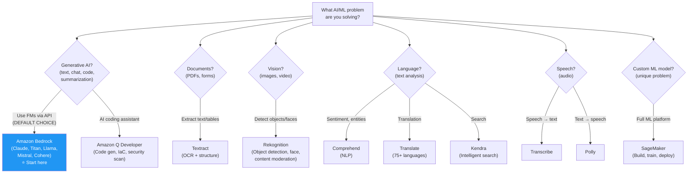
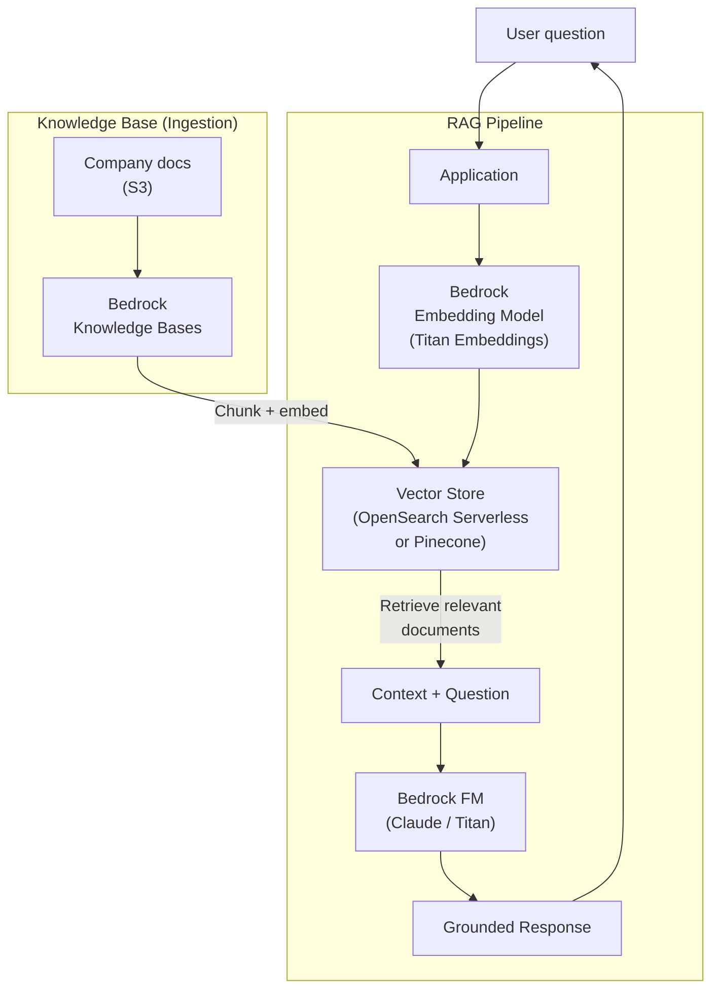
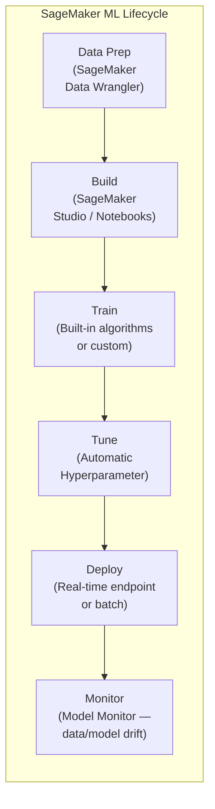
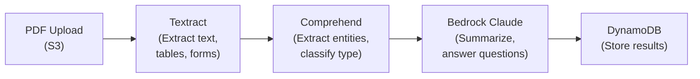
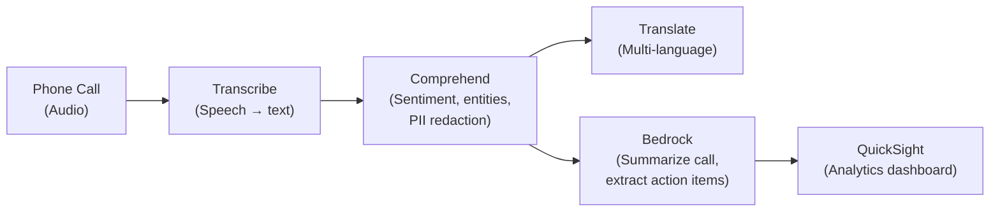

# AI & ML Services

## Overview

Generative AI is the dominant interview topic for 2025-2026. **Amazon Bedrock** is the service you must know — it provides serverless access to foundation models (Anthropic Claude, Amazon Titan, Meta Llama, Mistral) via a simple API, with built-in RAG, guardrails, and agents. No ML expertise required. For custom ML workflows (training your own models, unique prediction tasks), **Amazon SageMaker** remains the full-featured ML platform. AWS also offers **Amazon Q Developer** for AI-assisted coding and IaC generation, plus pre-built AI services like **Rekognition** (vision), **Comprehend** (NLP), **Transcribe** (speech-to-text), and **Textract** (document processing) that require zero ML knowledge.

**Interview priority**: Bedrock (high) > Pre-built AI services (medium) > SageMaker (for ML-specific roles) > Q Developer (for DevOps roles).

## Key Concepts

| Concept | Description |
|---------|-------------|
| **Foundation Model (FM)** | Large pre-trained model (Claude, GPT, Llama) — fine-tune or use as-is |
| **Inference** | Using a trained model to make predictions |
| **Training** | Teaching a model from data (custom models) |
| **Fine-Tuning** | Adapting a pre-trained model with your domain data |
| **RAG** | Retrieval-Augmented Generation — ground LLM responses with your data |
| **Pre-Built AI** | AWS services that wrap trained models behind simple APIs |

## Architecture Diagram

### AI/ML Service Decision Tree

### Generative AI Architecture with Bedrock (RAG Pattern)

## Deep Dive

### Amazon Bedrock

Fully managed service for building generative AI applications using foundation models.

| Feature | Detail |
|---------|--------|
| **Available Models** | Anthropic Claude (3.5/4), Amazon Titan, Meta Llama, Mistral, Cohere, Stability AI |
| **API Access** | Simple API call — no infrastructure to manage |
| **Knowledge Bases** | RAG with your data in S3, auto-chunking, embedding, and retrieval |
| **Agents** | Multi-step task execution with tool use (call APIs, query DBs) |
| **Guardrails** | Content filtering, PII redaction, denied topics, hallucination detection |
| **Fine-Tuning** | Custom models trained on your data (Titan, Llama, Cohere) |
| **Model Evaluation** | Compare models on your task with automatic and human evaluation |
| **Pricing** | On-Demand (per input/output token) or Provisioned Throughput |
| **Data Privacy** | Your data is not used to train base models. Encrypted at rest and in transit |

### Amazon SageMaker

End-to-end ML platform for building, training, and deploying custom models.

| Feature | Detail |
|---------|--------|
| **Studio** | Web IDE for ML development (notebooks, experiments, pipelines) |
| **Built-in Algorithms** | 17+ algorithms (XGBoost, Linear Learner, K-Means, Object Detection) |
| **Training** | Managed training on any instance type (including GPU: p4d, p5) |
| **Inference** | Real-time endpoints, serverless inference, batch transform, async inference |
| **SageMaker Serverless** | Auto-scaling inference endpoint, pay per use, scales to zero |
| **Data Wrangler** | Visual data preparation and feature engineering |
| **Pipelines** | CI/CD for ML workflows |
| **Model Monitor** | Detect data drift and model quality degradation |
| **JumpStart** | Pre-trained models and solutions (200+ models, one-click deploy) |
| **Canvas** | No-code ML for business analysts |

#### SageMaker Deployment Options

| Option | Latency | Use Case |
|--------|---------|----------|
| **Real-Time Endpoint** | Milliseconds | Interactive applications, APIs |
| **Serverless Inference** | Cold start + ms | Intermittent traffic, cost-sensitive |
| **Batch Transform** | Minutes | Process large datasets offline |
| **Async Inference** | Seconds-minutes | Large payloads (video, documents) |

### Pre-Built AI Services

| Service | What It Does | Example Use Case |
|---------|-------------|-----------------|
| **Rekognition** | Image/video analysis — object detection, face detection, content moderation, celebrity recognition, text in images | Verify identity, moderate user uploads |
| **Comprehend** | NLP — sentiment analysis, entity extraction, language detection, topic modeling, PII detection | Analyze customer reviews, extract entities from documents |
| **Translate** | Real-time text translation across 75+ languages | Multilingual app, translate user content |
| **Transcribe** | Speech-to-text with speaker identification, custom vocabulary | Meeting transcriptions, call center analytics |
| **Polly** | Text-to-speech with natural voices (neural TTS), SSML support | Voice interfaces, accessibility, audiobooks |
| **Textract** | OCR + structure extraction from PDFs — tables, forms, key-value pairs | Invoice processing, loan applications |
| **Kendra** | Intelligent enterprise search using NLP (not keyword matching) | Internal knowledge base, customer support |
| **Lex** | Build conversational chatbots (powers Alexa) | Customer service bot, order tracking |
| **Personalize** | Real-time personalization and recommendations | Product recommendations, content feeds |
| **Forecast** | Time-series forecasting using ML | Demand planning, capacity forecasting |
| **Fraud Detector** | ML-based fraud detection | Online payment fraud, fake accounts |

### Amazon Bedrock vs SageMaker

| Factor | Bedrock | SageMaker |
|--------|---------|-----------|
| **Purpose** | Use foundation models (generative AI) | Build/train/deploy custom models |
| **ML Expertise** | None required | Data science skills needed |
| **Models** | Pre-trained FMs (Claude, Titan, Llama) | Custom or JumpStart models |
| **Infrastructure** | Fully managed (no instances) | Manage training/inference instances |
| **Best For** | Chat, summarization, RAG, content generation | Custom prediction, classification, recommendation |
| **Fine-Tuning** | Limited (supported FMs only) | Full control over training |
| **Cost Model** | Per token (input/output) | Per instance-hour |

### Amazon Q Developer (formerly CodeWhisperer)

AI-powered assistant for software development, integrated into IDEs and the AWS Console.

| Feature | Detail |
|---------|--------|
| **Code Generation** | AI code suggestions in IDE (VS Code, JetBrains, CLI) — supports 15+ languages |
| **Code Transformation** | Upgrade Java 8/11 → Java 17, .NET Framework → .NET Core automatically |
| **Chat** | Ask questions about your codebase, AWS services, architecture |
| **Security Scanning** | Detects vulnerabilities in code (OWASP, CWE) with suggested fixes |
| **IaC Generation** | Generate CloudFormation / CDK / Terraform from natural language |
| **Console Integration** | Q in AWS Console — troubleshoot errors, explain billing, generate CLI commands |
| **Agents** | Autonomous tasks: `/dev` implements features across files, `/test` generates unit tests |
| **Pricing** | Free tier (individual), Pro ($19/user/month with admin controls and org policies) |

#### Amazon Q vs Bedrock

| Factor | Amazon Q Developer | Amazon Bedrock |
|--------|-------------------|----------------|
| **Purpose** | AI coding assistant for developers | API for building GenAI apps |
| **Users** | Developers writing code | Applications serving end-users |
| **Integration** | IDE, CLI, AWS Console | Application code via API |
| **Customization** | Learns from your codebase (Enterprise) | RAG, fine-tuning, guardrails |
| **Use Case** | "Help me write this Lambda function" | "Build a customer-facing chatbot" |

### Common AI/ML Architecture Patterns

#### Pattern 1: Intelligent Document Processing

#### Pattern 2: Call Center Analytics

## Best Practices

1. **Start with pre-built AI services** (Rekognition, Comprehend, Textract) before building custom models
2. **Use Bedrock for generative AI** — don't self-host LLMs unless you have a specific reason
3. **Implement RAG** (Knowledge Bases) to ground LLM responses in your data and reduce hallucinations
4. **Use Bedrock Guardrails** to filter harmful content, redact PII, and enforce topic boundaries
5. **Use SageMaker only for custom ML** — when pre-built services and foundation models don't solve your problem
6. **Use SageMaker Serverless Inference** for intermittent workloads to avoid paying for idle endpoints
7. **Monitor model performance** — use SageMaker Model Monitor for drift detection
8. **Encrypt everything** — Bedrock and SageMaker support KMS encryption at rest and in transit
9. **Keep humans in the loop** — use confidence thresholds and escalate to humans below threshold
10. **Use VPC endpoints** for Bedrock/SageMaker to keep inference traffic private

## Common Interview Questions

### Q1: When would you use Bedrock vs SageMaker?

**A:** **Bedrock** when you need generative AI capabilities: text generation, summarization, chat, code generation, RAG over your documents. No ML expertise needed — it's an API call. **SageMaker** when you need custom ML models for specific prediction tasks: fraud detection with your proprietary features, demand forecasting on your sales data, custom image classification for your domain. Think of Bedrock as "use pre-trained AI" and SageMaker as "build custom AI." Most companies use both: Bedrock for GenAI features, SageMaker for specific ML models.

### Q2: What is RAG and how does it work on AWS?

**A:** RAG (Retrieval-Augmented Generation) grounds LLM responses in your data. Flow: (1) Ingest your documents (PDFs, docs) into S3. (2) **Bedrock Knowledge Bases** chunks documents and creates embeddings stored in a vector database (OpenSearch Serverless, Pinecone, or Aurora PostgreSQL with pgvector). (3) When a user asks a question, the question is embedded and searched against the vector store. (4) Top matching chunks are retrieved and sent as context to the FM (Claude/Titan) along with the question. (5) The FM generates an answer grounded in your documents. This reduces hallucinations and keeps responses current without retraining.

### Q3: How would you build an intelligent document processing pipeline?

**A:** S3 trigger on PDF upload → **Textract** extracts text, tables, and form key-value pairs → **Comprehend** classifies document type (invoice, contract, receipt) and extracts entities (dates, amounts, names) → **Bedrock Claude** summarizes content and answers questions about the document → store structured data in DynamoDB, original in S3. Add a review UI for low-confidence extractions. Use Step Functions to orchestrate the pipeline. This replaces manual data entry for insurance claims, loan applications, invoice processing.

### Q4: What is the difference between Rekognition, Textract, and Comprehend?

**A:** **Rekognition** = computer vision. Analyzes images and video — object detection, face detection/comparison, content moderation, celebrity recognition, text in images. **Textract** = document intelligence. Extracts text, tables, forms, and structured data from scanned documents and PDFs. Goes beyond OCR by understanding document structure. **Comprehend** = natural language processing. Analyzes text — sentiment, entities, key phrases, language detection, PII, topic modeling. Use Rekognition for images, Textract for documents, Comprehend for text analysis.

### Q5: How do you ensure AI/ML data privacy on AWS?

**A:** (1) **Bedrock data isolation** — your data is not used to train base models, encrypted in transit (TLS) and at rest (KMS). (2) **VPC endpoints** — keep API calls to Bedrock/SageMaker on private network. (3) **Guardrails** — PII redaction to prevent sensitive data in prompts/responses. (4) **SageMaker** — training instances run in your VPC, data encrypted in S3. (5) **IAM policies** — restrict who can invoke models. (6) **CloudTrail** — audit all API calls. (7) **PrivateLink** — access Bedrock without internet. AWS GenAI services are designed to not use customer data for model improvement.

### Q6: What are Bedrock Guardrails?

**A:** Guardrails add safety controls to Bedrock applications: (1) **Content filters** — block harmful content (hate, violence, sexual, insults) with configurable thresholds. (2) **Denied topics** — block specific topics (e.g., "don't discuss competitors"). (3) **Word filters** — block specific words/phrases. (4) **PII detection** — identify and redact PII (names, SSNs, emails) in inputs and outputs. (5) **Contextual grounding** — detect hallucinations by checking responses against source documents. Apply Guardrails to any Bedrock model invocation with a single config.

### Q7: When would you use SageMaker JumpStart vs building from scratch?

**A:** **JumpStart** provides 200+ pre-trained models (Llama, Stable Diffusion, Hugging Face models) that you deploy with one click or fine-tune with your data. Use it when: a pre-trained model exists for your task, you want fast time-to-value, or you need a starting point for fine-tuning. **Build from scratch** when: your problem is unique (proprietary data, novel architecture), you need full control over the training process, or pre-trained models don't meet accuracy requirements. Most teams: start with JumpStart, only build custom when necessary.

### Q8: How would you architect a real-time fraud detection system?

**A:** (1) Transaction data streams through **Kinesis Data Streams**. (2) **Lambda** enriches each transaction with user history from DynamoDB. (3) **SageMaker real-time endpoint** (XGBoost model trained on historical fraud data) scores each transaction in < 100ms. (4) High-risk scores trigger Step Functions workflow: hold transaction, send to human review queue (SQS). (5) **SageMaker Model Monitor** detects data drift (fraud patterns change). (6) Retrain pipeline triggers automatically when drift exceeds threshold. Use SageMaker Pipelines for CI/CD of the ML model.

### Q9: What is Amazon Q Developer and how does it fit into a DevOps workflow?

**A:** Amazon Q Developer is an AI coding assistant embedded in IDEs (VS Code, JetBrains), the CLI, and the AWS Console. For DevOps workflows: (1) **Code generation** — write Lambda functions, CDK constructs, and Dockerfiles from natural language prompts. (2) **IaC generation** — describe infrastructure in English, get CloudFormation/Terraform code. (3) **Security scanning** — detects OWASP vulnerabilities in code during development, before it reaches CI/CD. (4) **Code transformation** — automated Java/Python/.NET upgrades across entire codebases. (5) **Troubleshooting** — ask Q in the AWS Console to explain CloudWatch errors or billing spikes. It's not a replacement for Bedrock — Q is for developers building on AWS, Bedrock is for building AI-powered applications.

## Latest Updates (2025-2026)

| Update | Description |
|--------|-------------|
| **Bedrock Agents with Tool Use** | Agents now support multi-step reasoning with tool use — the agent plans, invokes APIs (action groups), queries knowledge bases, and iterates until the task is complete |
| **Bedrock Flows** | Visual workflow builder for chaining Bedrock prompts, knowledge base queries, Lambda functions, and conditional logic into reusable AI pipelines |
| **Bedrock Model Distillation** | Transfer knowledge from a large teacher model to a smaller, cheaper student model — reduces inference cost while maintaining quality for your specific use case |
| **Amazon Nova Models** | Amazon's own foundation model family: Nova Micro (text-only, fastest/cheapest), Nova Lite (multimodal, low-cost), Nova Pro (multimodal, balanced), Nova Premier (most capable, complex reasoning) |
| **SageMaker HyperPod** | Purpose-built infrastructure for training large foundation models — automated cluster management, fault tolerance, and checkpointing across hundreds of GPUs |
| **SageMaker Unified Studio** | Single IDE combining SageMaker Studio, data analytics, and Bedrock development — unifying the ML and GenAI development experience |

### Q10: What is the Amazon Nova model family and when do you use each model?

**A:** Amazon Nova is AWS's own foundation model family available in Bedrock: (1) **Nova Micro** — text-only, fastest response time, lowest cost. Use for: simple classification, text summarization, chatbots with straightforward queries. (2) **Nova Lite** — multimodal (text + image + video input), low cost. Use for: document understanding, image analysis, video summarization where cost matters. (3) **Nova Pro** — multimodal, balanced capability and cost. Use for: complex reasoning, RAG with nuanced queries, multi-step tasks, production applications needing quality and speed. (4) **Nova Premier** — most capable, best for complex reasoning and agentic workflows. Use for: teacher model for distillation, hard reasoning tasks, high-quality content generation. The naming follows a size/capability spectrum. Start with Nova Micro or Lite for cost-sensitive use cases, upgrade to Pro for production, and use Premier for the hardest tasks or as a distillation teacher.

### Q11: When would you use Bedrock Agents vs Step Functions for orchestration?

**A:** **Bedrock Agents** excel at tasks requiring natural language understanding, dynamic reasoning, and flexible tool use. The agent decides which actions to take based on the user's intent — you define action groups (Lambda functions), and the agent plans which to call and in what order. Great for: customer service bots, research assistants, and tasks where the steps are not predetermined. **Step Functions** are deterministic — you define the exact workflow (states, transitions, error handling) in ASL. Great for: data pipelines, order processing, and any workflow where the steps are known in advance. Use Bedrock Agents when the user's request is open-ended and the AI needs to reason about what to do. Use Step Functions when the workflow is predictable and you need guaranteed execution order, retry logic, and error handling. You can combine both: a Bedrock Agent action group that triggers a Step Functions workflow for a structured sub-task.

### Q12: How do you evaluate models on Bedrock (automatic vs human evaluation)?

**A:** Bedrock Model Evaluation supports two approaches: (1) **Automatic evaluation** — you provide a dataset of prompts with reference answers. Bedrock runs each prompt against one or more models and scores responses using built-in metrics (ROUGE for summarization, accuracy for Q&A, toxicity scores). Use this for: initial model selection, regression testing after fine-tuning, comparing models at scale. (2) **Human evaluation** — Bedrock presents model outputs to human reviewers who rate them on dimensions you define (helpfulness, accuracy, harmlessness, style). Use this for: subjective quality assessment, final model selection for production, evaluating nuanced tasks where automated metrics fall short. Best practice: start with automatic evaluation to narrow the field (e.g., from 5 models to 2), then use human evaluation for the final selection. Always evaluate on YOUR data, not generic benchmarks.

### Q13: When should you use fine-tuning vs RAG?

**A:** **RAG** (Retrieval-Augmented Generation) is the default choice for most use cases. Use RAG when: your data changes frequently (product catalog, documentation), you need citations and source attribution, you want to avoid retraining costs, and accuracy must be grounded in specific documents. RAG retrieves relevant chunks from your knowledge base at query time and includes them in the prompt context. **Fine-tuning** modifies the model's weights using your training data. Use fine-tuning when: you need the model to adopt a specific tone/style (brand voice), learn domain-specific terminology or formats, or perform a specialized task that RAG context alone cannot teach. Fine-tuning is more expensive (training cost + custom model hosting) and the data is baked in (goes stale). Most production applications use RAG. Fine-tune only when RAG alone does not meet quality requirements, and consider combining both: fine-tune for style, RAG for factual grounding.

### Q14: What are responsible AI practices on AWS?

**A:** AWS provides multiple layers for responsible AI: (1) **Bedrock Guardrails** — content filtering (block harmful content by category and threshold), denied topics, word filters, PII redaction, and contextual grounding checks (hallucination detection). (2) **SageMaker Clarify** — detect bias in training data and model predictions, generate feature importance explanations (SHAP values). (3) **Model Cards** — document model intended use, limitations, performance metrics, and ethical considerations. (4) **Human review workflows** — use Amazon A2I (Augmented AI) to route low-confidence predictions to human reviewers. (5) **Audit trail** — CloudTrail logs all Bedrock API calls, model invocations can be logged for review. Responsible AI framework dimensions: **fairness** (is the model biased?), **explainability** (why did it produce this output?), **privacy** (is PII protected?), **safety** (does it produce harmful content?), **governance** (who controls what models are used?).

### Q15: How do you optimize costs for Bedrock?

**A:** Several strategies: (1) **Model selection** — use the smallest model that meets quality requirements. Nova Micro is ~10x cheaper than Claude Opus. Evaluate with your actual prompts before committing. (2) **Prompt engineering** — shorter, more precise prompts reduce input token costs. Use few-shot examples judiciously — each example adds tokens. (3) **Prompt caching** — Bedrock caches repeated prompt prefixes (system prompts, few-shot examples). Structure prompts so the static portion is at the beginning. (4) **Model distillation** — use a capable model (Nova Premier, Claude) to generate training data, then distill to a smaller, cheaper model for production. (5) **Provisioned Throughput** — for sustained, high-volume workloads, provisioned throughput is cheaper than on-demand per-token pricing. (6) **Batch inference** — for non-real-time tasks (document processing, content generation), batch inference offers 50% cost reduction. (7) **Response length limits** — set max tokens to prevent verbose responses that waste output tokens.

### Q16: How do you implement a GenAI chatbot with memory?

**A:** A production chatbot needs conversation memory beyond a single request: (1) **Short-term memory (session)** — store the conversation history (user messages + assistant responses) in DynamoDB with a session ID as the partition key. On each turn, retrieve the conversation history and include it in the prompt as context. Limit to the last N turns to control token costs. (2) **Long-term memory (user profile)** — store user preferences, past interactions, and summarized conversation history in DynamoDB. Include a user summary in the system prompt. (3) **Knowledge memory (RAG)** — Bedrock Knowledge Bases provide factual grounding from your documents. (4) **Implementation**: API Gateway + Lambda + DynamoDB (session store) + Bedrock Knowledge Base + Bedrock FM. Lambda retrieves session history from DynamoDB, calls the Knowledge Base for relevant context, constructs the prompt with history + context + user message, invokes the FM, stores the response in DynamoDB, and returns it. Use Bedrock Agents for multi-turn conversations with tool use — the agent maintains session state automatically.

### Q17: How do you build multimodal AI applications on AWS?

**A:** Multimodal AI processes multiple input types (text, images, audio, video): (1) **Vision + Text** — use Bedrock with Nova Lite/Pro or Claude (multimodal models accept images in the prompt). Use cases: analyze photos, extract information from screenshots, describe visual content. (2) **Audio + Text** — Transcribe converts speech to text, then Bedrock processes the text. For real-time: Transcribe Streaming + Lambda + Bedrock. Use cases: call center analytics, meeting summarization. (3) **Document + Text** — Textract extracts structured data from documents, Bedrock reasons over the extracted content. Use case: intelligent document processing. (4) **Video + Text** — Nova models accept video input for summarization and Q&A. Amazon Rekognition Video detects objects, faces, and activities in video. (5) **Combined pipeline** — Step Functions orchestrates: Transcribe audio, Textract documents, Rekognition images, then Bedrock synthesizes insights from all modalities into a unified response.

### Q18: What is SageMaker Feature Store and how is it used?

**A:** Feature Store is a centralized repository for ML features (the input variables your models use for prediction). It solves the "feature engineering once, use everywhere" problem. Two storage modes: (1) **Online store** — low-latency (<10ms) feature retrieval for real-time inference. Backed by DynamoDB. Use for: fraud detection at transaction time, real-time recommendations. (2) **Offline store** — historical feature data in S3 (Parquet format) for training and batch inference. Use for: training datasets, batch scoring, feature analytics. Feature Groups define the schema (name, type) and are versioned. Features are ingested via the SDK, Spark, or streaming (Kinesis). The key benefit: training and inference use the exact same feature definitions, eliminating training-serving skew (a common ML bug where features are computed differently in training vs production).

### Q19: How do you build an MLOps pipeline on AWS?

**A:** MLOps automates the ML lifecycle: (1) **SageMaker Pipelines** — define the ML workflow as a DAG: data preprocessing, training, evaluation, model registration, deployment. Triggered by new data or schedule. (2) **SageMaker Model Registry** — versioned model catalog. Models are registered with metadata (metrics, lineage, approval status). Manual or automated approval gates before production deployment. (3) **SageMaker Model Monitor** — continuously monitors deployed models for data drift (input distribution changes), model quality drift (prediction accuracy degradation), bias drift, and feature attribution drift. Alerts via CloudWatch when drift exceeds thresholds. (4) **CI/CD integration** — CodeCommit/GitHub triggers CodePipeline, which runs the SageMaker Pipeline, evaluates the model, and deploys if metrics pass. (5) **Retraining** — Model Monitor detects drift, triggers EventBridge event, which kicks off the SageMaker Pipeline for retraining. The entire cycle is automated: data arrives, model trains, evaluates, registers, deploys, monitors, and retrains when needed.

### Q20: How do you run AI inference at the edge?

**A:** For scenarios requiring local inference (factories, vehicles, remote sites): (1) **SageMaker Edge Manager** — compiles SageMaker models for edge hardware (ARM, x86, GPU), deploys to edge devices, monitors model performance, and manages model versions across a fleet. Uses SageMaker Neo for model compilation and optimization. (2) **IoT Greengrass ML Inference** — deploy ML models to Greengrass core devices as Lambda functions or Greengrass components. Supports pre-trained models from SageMaker, TensorFlow, and PyTorch. (3) **AWS Panorama** — purpose-built for computer vision at the edge. Runs vision models on the Panorama Appliance connected to IP cameras for real-time video analysis (defect detection, safety compliance). (4) **Bedrock at the edge** — not natively supported; use a lightweight model (ONNX, TFLite) compiled with Neo for edge, or stream to Bedrock when connectivity permits. Edge inference is essential for: low-latency requirements (<10ms), intermittent connectivity, data sovereignty (data cannot leave the site), and high-bandwidth data (video streams).

## Deep Dive Notes

### RAG Architecture Patterns (Naive vs Advanced)

**Naive RAG** — Simple retrieval: embed the query, find top-K similar chunks from the vector store, stuff them into the prompt, generate a response. Works for straightforward Q&A over clean documents. Limitations: poor performance with complex queries, misses context across chunks, retrieves irrelevant content.

**Advanced RAG** improves each stage:

| Technique | Stage | How It Helps |
|-----------|-------|-------------|
| **Query Rewriting** | Pre-retrieval | LLM reformulates the user's query into a better search query (e.g., "How do I fix this?" becomes "Troubleshooting steps for error X in service Y") |
| **Hypothetical Document Embedding (HyDE)** | Pre-retrieval | Generate a hypothetical answer, embed that instead of the query — often matches better against document chunks |
| **Hierarchical Chunking** | Indexing | Store summaries of large sections alongside detailed chunks. Retrieve summaries first, then drill down |
| **Parent Document Retrieval** | Retrieval | Retrieve the small chunk that matched, but return the full parent document/section for richer context |
| **Re-Ranking** | Post-retrieval | Use a cross-encoder model to re-rank retrieved chunks by relevance before sending to the LLM (Bedrock supports Cohere Rerank) |
| **Contextual Compression** | Post-retrieval | Compress retrieved chunks to include only the relevant parts, reducing prompt size and cost |

For production RAG on AWS: Bedrock Knowledge Bases handles naive RAG out of the box. For advanced RAG, combine Lambda orchestration with Bedrock APIs — custom query rewriting prompt, OpenSearch with hybrid search (keyword + semantic), and a re-ranking step before final generation.

### Bedrock Agents Architecture

Bedrock Agents enable multi-step, tool-using AI applications:

**Components**: (1) **Foundation Model** — the reasoning engine (Claude, Nova). The agent uses the FM to plan, decide which tools to call, and synthesize responses. (2) **Action Groups** — Lambda functions the agent can invoke. Each action group has an OpenAPI schema defining available operations (e.g., `lookupOrder`, `createTicket`, `searchInventory`). (3) **Knowledge Bases** — the agent can query your RAG knowledge bases for factual information. (4) **Guardrails** — content and topic filters applied to agent inputs and outputs.

**Execution Flow**: User message arrives. The agent sends the message + available tools to the FM. The FM returns a "thought" (reasoning) and a tool invocation (which action group + parameters). The agent executes the Lambda function, returns the result to the FM. The FM reasons again — it may invoke another tool, ask a clarifying question, or generate the final response. This loop continues until the task is complete (ReAct pattern: Reason + Act).

**Session Management**: Agents maintain conversation state within a session. Session attributes (key-value pairs) persist across turns. You can inject session context (user ID, preferences) at invocation time.

### SageMaker Production Deployment Patterns

| Pattern | When to Use | How It Works |
|---------|-------------|-------------|
| **Blue-Green Deployment** | Zero-downtime model updates | Deploy new model to a new endpoint, shift traffic via DNS or weighted routing, monitor, then decommission old endpoint |
| **Canary Deployment** | Risk-sensitive model updates | Route 10% of traffic to the new model, compare metrics (latency, accuracy), gradually increase to 100% or roll back |
| **Shadow Deployment** | Testing in production without risk | New model receives a copy of production traffic but responses are discarded. Compare outputs offline. No user impact |
| **Multi-Model Endpoint** | Cost optimization for many models | Host multiple models on a single endpoint. Models are loaded/unloaded from memory on demand. Good for per-tenant models |
| **Inference Pipeline** | Multi-step prediction | Chain preprocessing, model inference, and postprocessing in a single endpoint call |
| **Serverless Inference** | Intermittent or unpredictable traffic | Endpoint scales to zero when idle, scales up on demand. Cold start adds latency but eliminates idle cost |

For production, always deploy behind an Auto Scaling policy based on `InvocationsPerInstance`. Set up Model Monitor data capture to log inputs/outputs for drift detection.

### Responsible AI Framework

Four pillars for production AI on AWS:

**Fairness** — Use SageMaker Clarify to detect bias in training data (class imbalance, underrepresentation) and model predictions (disparate impact across demographic groups). Run Clarify bias reports as part of the SageMaker Pipeline before model registration. Reject models with bias metrics outside acceptable thresholds.

**Explainability** — SageMaker Clarify generates SHAP (SHapley Additive exPlanations) values showing which features influenced each prediction. For Bedrock, use Guardrails contextual grounding to show which source documents support the response. For regulated industries (finance, healthcare), explainability is a compliance requirement.

**Privacy and Security** — Bedrock does not use customer data for model training. Use VPC endpoints to keep traffic private. Enable Guardrails PII detection to prevent sensitive data in prompts/responses. Encrypt all data at rest (KMS) and in transit (TLS). Use IAM to control who can invoke which models.

**Governance** — Model Cards document intended use, limitations, and performance. Model Registry provides version control and approval gates. CloudTrail logs all API calls. For organizations, use SCPs to restrict which Bedrock models can be invoked (e.g., only allow approved models in production accounts). Establish an AI review board that approves new use cases before deployment.

## Scenario-Based Questions

### S1: Leadership wants to add a "chat with your documents" feature to the internal portal. Employees should ask questions about company policies, HR docs, and tech docs. How do you build it?

**A:** **Bedrock Knowledge Bases (RAG)**. (1) **Document ingestion** — upload PDFs, Word docs, and web pages to S3. Bedrock Knowledge Bases automatically chunks, embeds, and indexes them into a vector store (Amazon OpenSearch Serverless or Pinecone). (2) **Query flow** — user asks a question → Bedrock retrieves relevant document chunks → sends them as context to Claude/Titan → returns an answer with source citations. (3) **Guardrails** — Bedrock Guardrails filter sensitive content (PII, profanity), block off-topic queries, and enforce grounding (answers must be based on retrieved documents, not hallucinated). (4) **Access control** — Cognito authentication, and S3 metadata tags to restrict which departments see which documents. (5) **Architecture**: API Gateway → Lambda → Bedrock RetrieveAndGenerate API. (6) **Cost**: Bedrock pricing is per-token (input + output). With caching and smart chunking, expect $0.01-0.05 per query.

### S2: Your ML model in SageMaker works well in testing but predictions are degrading in production over the past month. What's happening?

**A:** This is **model drift** — the production data distribution has shifted from the training data. (1) **Detect** — SageMaker Model Monitor continuously compares production inference data against a baseline (training data statistics). It reports data drift (feature distributions changed), model drift (prediction accuracy dropped), and bias drift. (2) **Investigate** — check which features drifted. Common causes: seasonal changes, new user demographics, upstream data schema changes, or a bug in the feature pipeline. (3) **Fix** — retrain the model on recent data. Use SageMaker Pipelines to automate: data collection → preprocessing → training → evaluation → deployment. (4) **Automate** — set up Model Monitor with CloudWatch alarms. When drift exceeds threshold → EventBridge triggers SageMaker Pipeline → auto-retrain and deploy if evaluation metrics pass. (5) **A/B testing** — use SageMaker inference variants to route 10% of traffic to the new model before full deployment.

### S3: Your company wants to use GenAI but the legal team is concerned about data privacy — customer data must never leave your AWS account. How do you ensure this?

**A:** (1) **Bedrock** — your data is NOT used to train foundation models. Prompts and responses are not stored by Bedrock (unless you enable logging). This is contractual via the AWS service terms. (2) **VPC endpoints** — create a PrivateLink endpoint for Bedrock so API calls never traverse the public internet. (3) **Guardrails** — configure Bedrock Guardrails to detect and mask PII (names, SSNs, emails) in both inputs and outputs before they reach the model. (4) **Encryption** — all data encrypted in transit (TLS) and at rest (KMS). Use customer-managed KMS keys for Knowledge Bases vector store. (5) **Logging** — enable CloudTrail and model invocation logging to S3 (encrypted) for audit compliance. (6) **Alternative**: for maximum control, fine-tune an open model (Llama) on SageMaker — the model runs entirely in your VPC, on your instances, with no external API calls.

## Cheat Sheet

| Concept | Key Facts |
|---------|-----------|
| Bedrock | Managed GenAI, Claude/Titan/Llama via API, no infrastructure |
| Bedrock Knowledge Bases | RAG — ingest docs from S3, embed, store in vector DB, query |
| Bedrock Guardrails | Content filtering, PII redaction, denied topics, hallucination check |
| Bedrock Agents | Multi-step tool use, action groups (Lambda), knowledge bases, session state |
| Bedrock Flows | Visual AI workflow builder, chain prompts + tools + logic |
| Amazon Nova | AWS FM family: Micro (text, cheapest), Lite (multimodal, low-cost), Pro (balanced), Premier (most capable) |
| Model Distillation | Transfer knowledge from large to small model, reduce cost while maintaining quality |
| Amazon Q Developer | AI code assistant, IaC generation, security scanning, code transformation |
| SageMaker | Full ML platform: build, train, deploy, monitor custom models |
| SageMaker HyperPod | Large model training infrastructure, multi-GPU, fault-tolerant |
| SageMaker Serverless | Auto-scaling inference, scales to zero, pay per use |
| SageMaker Pipelines | CI/CD for ML, DAG-based workflow, automated retraining |
| SageMaker Model Monitor | Detect data drift, model quality drift, bias drift in production |
| Feature Store | Centralized ML features, online (low-latency) + offline (training) |
| Rekognition | Image/video: objects, faces, moderation, celebrities, text |
| Comprehend | NLP: sentiment, entities, PII, language detection, topics |
| Textract | OCR + structure: text, tables, forms from PDFs/images |
| Transcribe | Speech-to-text, speaker ID, custom vocabulary |
| Polly | Text-to-speech, neural voices |
| Translate | 75+ languages, real-time text translation |
| Kendra | Intelligent enterprise search using NLP |
| Lex | Conversational chatbots (powers Alexa) |
| Personalize | Real-time recommendations |
| Forecast | Time-series ML forecasting |
| RAG Patterns | Naive (basic retrieval) vs Advanced (query rewriting, re-ranking, HyDE) |
| Edge AI | SageMaker Edge Manager, Greengrass ML, Panorama for vision |

---

[← Previous: Systems Manager](../16-systems-manager/) | [Back to Home →](../)
