# Messaging & Event-Driven Architecture

## Overview

Event-driven architecture (EDA) is a design pattern where services communicate through events rather than direct calls. AWS provides a rich set of messaging and eventing services: **SQS** for queuing, **SNS** for pub/sub, **EventBridge** for event routing, **Kinesis** for streaming, **MSK** for Apache Kafka, and **MQ** for legacy protocol support. Understanding when to use which service — and how to combine them — is essential for building robust, scalable architectures.

## Key Concepts

| Concept | Description |
|---------|-------------|
| **Event** | A record of something that happened (order placed, file uploaded, state changed) |
| **Message** | A unit of data sent between services (may or may not be an event) |
| **Queue** | Point-to-point: one producer, one consumer group (SQS) |
| **Topic** | Pub/sub: one message fans out to many subscribers (SNS) |
| **Event Bus** | Event router with rules-based filtering and routing (EventBridge) |
| **Stream** | Ordered, replayable sequence of records (Kinesis, MSK) |
| **Dead Letter Queue** | Queue for messages that failed processing after max retries |
| **Idempotency** | Processing the same message multiple times produces the same result |

## Architecture Diagram

### Messaging Service Decision Tree

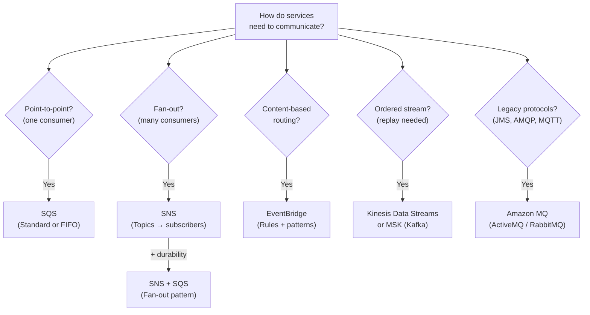

### Event-Driven Order Processing

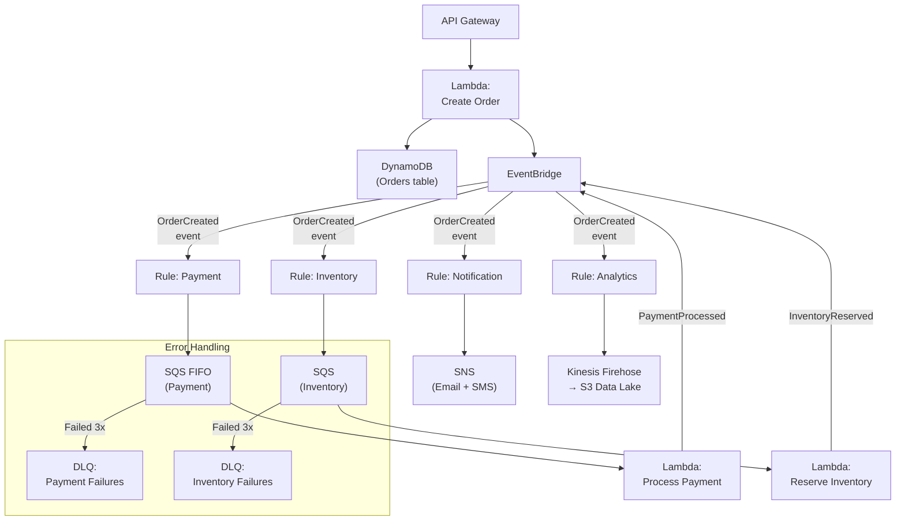

## Deep Dive

### Service Comparison Matrix

| Feature | SQS | SNS | EventBridge | Kinesis | MSK | Amazon MQ |
|---------|-----|-----|-------------|---------|-----|-----------|
| **Pattern** | Queue (P2P) | Pub/Sub | Event bus | Stream | Stream | Queue/Topic |
| **Ordering** | FIFO only | FIFO only | No | Per shard | Per partition | Yes |
| **Delivery** | At-least-once (Std), Exactly-once (FIFO) | At-least-once | At-least-once | At-least-once | At-least-once | Configurable |
| **Retention** | 4d (up to 14d) | None (immediate) | None (archive optional) | 1d (up to 365d) | 7d (configurable) | Configurable |
| **Replay** | No | No | Archive + Replay | Yes | Yes | No |
| **Throughput** | Unlimited (Std) | Unlimited | ~10K PutEvents/s per region | 1MB/s per shard | High (partitions) | Moderate |
| **Consumer Model** | Pull (polling) | Push | Push | Pull (polling) | Pull (polling) | Push/Pull |
| **Max Message** | 256 KB | 256 KB | 256 KB | 1 MB | Configurable (1MB+) | Configurable |
| **Best For** | Decoupling, retry | Broadcasting | Event routing | Real-time processing | Kafka workloads | Legacy migration |

### SQS Deep Dive

#### Standard vs FIFO Queues

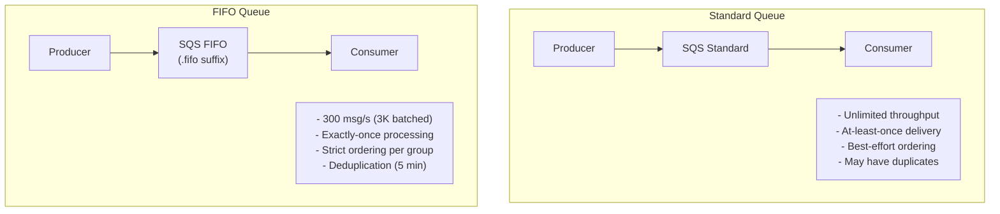

#### SQS Advanced Features

| Feature | Detail |
|---------|--------|
| **Visibility Timeout** | Hides message from other consumers during processing (default 30s, max 12h) |
| **Long Polling** | Wait up to 20s for messages (reduces empty responses and cost) |
| **Delay Queues** | Delay message delivery by 0-900s (use for scheduled processing) |
| **Message Timers** | Per-message delay (overrides queue delay) |
| **Dead Letter Queue** | After maxReceiveCount failures, message moves to DLQ |
| **DLQ Redrive** | Move messages from DLQ back to source queue for reprocessing |
| **Message Deduplication** | FIFO queues deduplicate by ID within 5-minute window |
| **Message Groups** | FIFO queues maintain ordering within a Message Group ID |
| **Temporary Queues** | Virtual queues for request-reply pattern |
| **SSE** | Server-side encryption with KMS |

### SNS Deep Dive

#### SNS Fan-Out Patterns

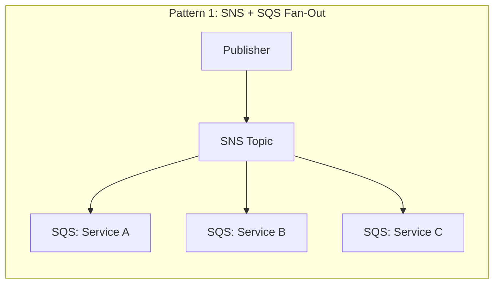

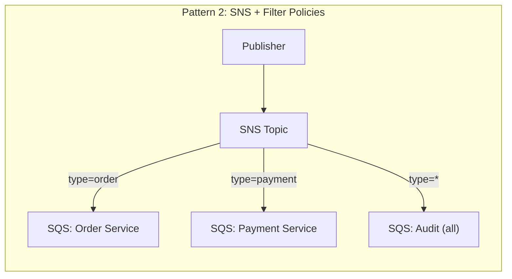

| Feature | Detail |
|---------|--------|
| **Message Filtering** | Filter policies on subscriptions — deliver only matching messages |
| **FIFO Topics** | Ordered, deduplicated pub/sub (pairs with FIFO queues) |
| **Message Archiving** | Store messages to S3 via Kinesis Firehose subscription |
| **Cross-Account** | Subscribe queues from other accounts |
| **Cross-Region** | Publish to topics in other regions |
| **Delivery Retries** | Configurable retry policy for HTTP/S endpoints |
| **Raw Message Delivery** | Skip SNS metadata wrapping (for SQS/Lambda subscribers) |

### EventBridge Deep Dive

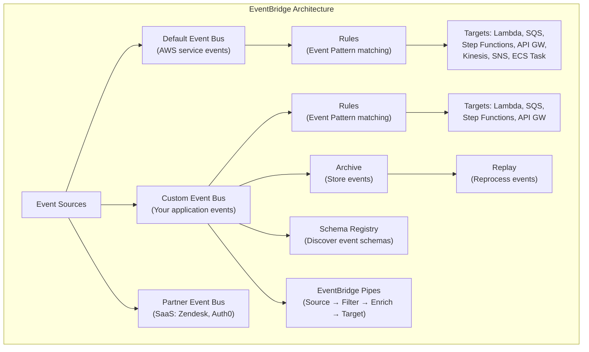

#### EventBridge Key Features

| Feature | Detail |
|---------|--------|
| **Event Pattern Matching** | Match on any field in the event JSON (nested, prefix, suffix, numeric, exists) |
| **Input Transformation** | Transform event before sending to target |
| **Archive & Replay** | Store events and replay them (debugging, reprocessing, disaster recovery) |
| **Schema Registry** | Auto-discover event schemas, generate code bindings (Java, Python, TypeScript) |
| **EventBridge Pipes** | Point-to-point integration: Source (SQS, Kinesis, DynamoDB Streams, MSK) → optional Filter → optional Enrichment (Lambda, API GW, Step Functions) → Target |
| **EventBridge Scheduler** | Cron and rate-based scheduling with one-time or recurring schedules |
| **Cross-Account** | Send events between accounts |
| **Global Endpoints** | Active-active event ingestion across two regions with automatic failover |
| **Throughput** | Soft limit ~10,000 PutEvents/sec per region (can request increase) |

#### EventBridge vs SNS

| Factor | EventBridge | SNS |
|--------|-------------|-----|
| **Filtering** | Content-based pattern matching (deep JSON) | Attribute-based filter policies |
| **Sources** | 200+ AWS services, SaaS, custom | Anything via API |
| **Schema** | Schema Registry, code generation | No schema support |
| **Replay** | Archive + Replay | No |
| **Cost** | $1/million events | $0.50/million publishes |
| **Targets** | 20+ target types | SQS, Lambda, HTTP, email, SMS |
| **Best For** | Complex routing, SaaS integration, event-driven architecture | Simple fan-out, notifications |

### EventBridge Pipes

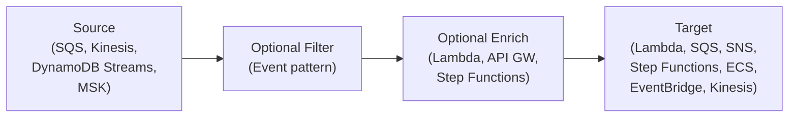

Pipes replace custom Lambda "glue" code for connecting sources to targets with optional filtering and enrichment.

### Amazon MQ

Managed message broker for **Apache ActiveMQ** and **RabbitMQ**. Use when migrating from on-premises messaging that uses JMS, AMQP, MQTT, OpenWire, or STOMP protocols.

| Feature | ActiveMQ | RabbitMQ |
|---------|----------|----------|
| **Protocols** | JMS, AMQP, MQTT, OpenWire, STOMP | AMQP |
| **Clustering** | Active-standby (Multi-AZ) | Cluster (3 nodes) |
| **Use Case** | Legacy Java apps using JMS | Modern apps needing RabbitMQ features |
| **Migration** | From on-prem ActiveMQ/IBM MQ | From on-prem RabbitMQ |

**Key point**: For new applications, always use SQS/SNS/EventBridge. Only use Amazon MQ when migrating existing applications that require specific messaging protocols.

### Common Messaging Patterns

#### Pattern 1: Queue-Based Load Leveling

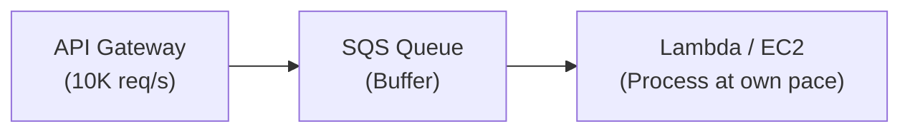

Decouple producers from consumers. SQS absorbs traffic spikes while consumers process at a sustainable rate.

#### Pattern 2: Fan-Out with SNS + SQS

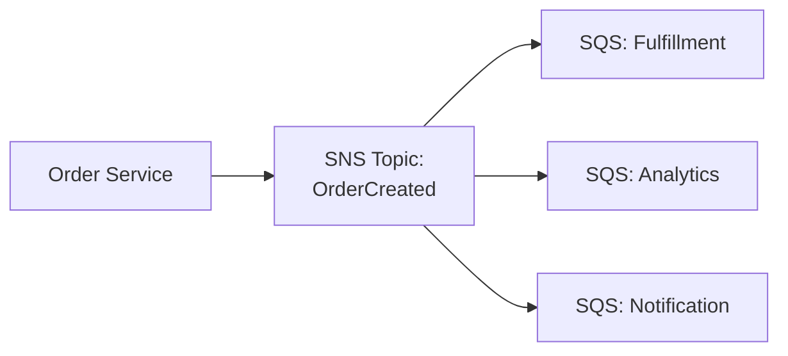

Each subscriber gets its own queue with independent retry and DLQ. Failure in one doesn't affect others.

#### Pattern 3: Saga Pattern (Distributed Transactions)

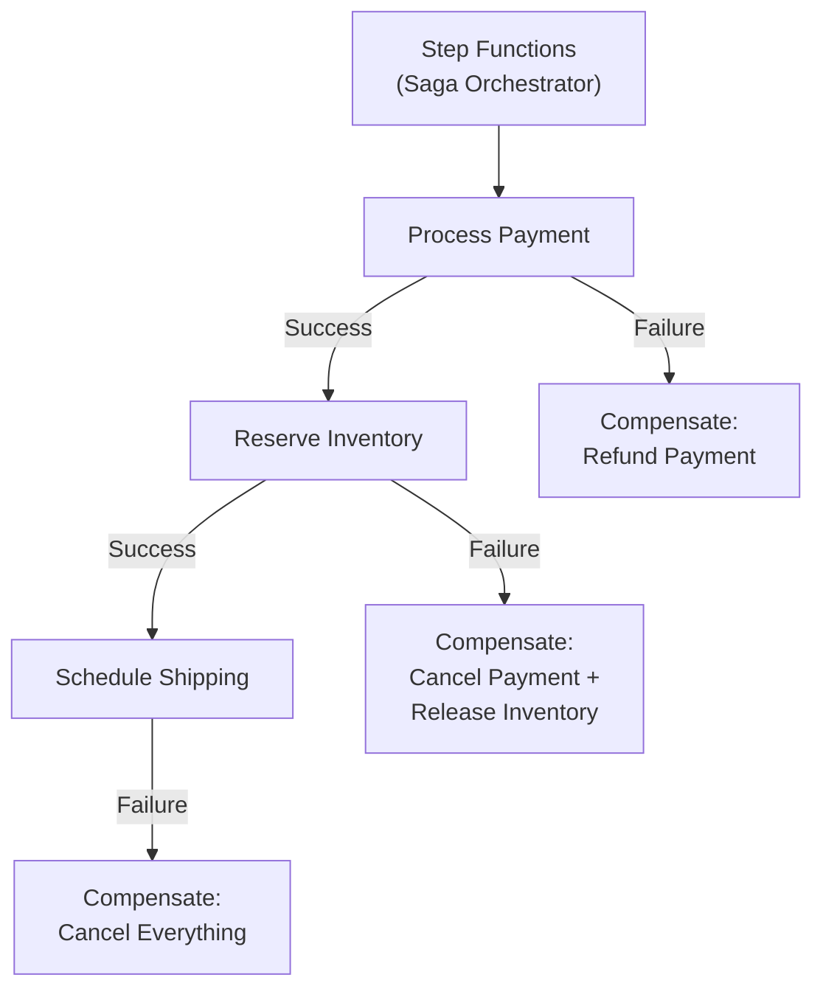

Use Step Functions to orchestrate distributed transactions with compensation logic for failures.

#### Pattern 4: CQRS (Command Query Responsibility Segregation)

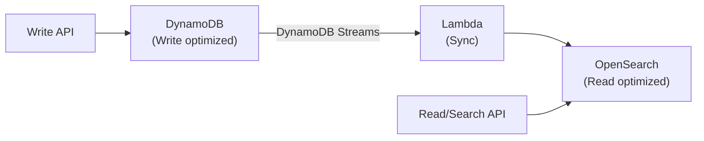

Separate write and read models for different optimization needs. Use DynamoDB Streams or EventBridge to sync.

#### Pattern 5: Claim-Check Pattern

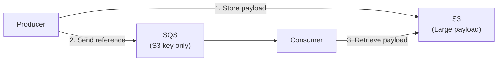

For payloads exceeding SQS's 256 KB limit. Store the large payload in S3 and send only the reference through the queue.

## Best Practices

1. **Use SQS between every pair of services** for decoupling and retry
2. **Always configure Dead Letter Queues** with maxReceiveCount of 3-5
3. **Use SNS + SQS fan-out** instead of publishing to multiple queues directly
4. **Use EventBridge for event routing** — content-based filtering is more maintainable than code
5. **Make consumers idempotent** — at-least-once delivery means messages may arrive twice
6. **Use SQS FIFO only when ordering matters** — Standard queues have much higher throughput
7. **Enable long polling** (WaitTimeSeconds=20) to reduce SQS costs
8. **Use message deduplication** in FIFO queues via content-based dedup or explicit IDs
9. **Set appropriate visibility timeouts** — 6x your average processing time
10. **Use EventBridge Pipes** instead of Lambda "glue" for simple source-to-target integrations
11. **Archive EventBridge events** for debugging and replay capability
12. **Use Amazon MQ only for legacy protocol compatibility** — prefer SQS/SNS for new apps

## Knowledge Check

### Q1: When would you use SQS vs SNS vs EventBridge?

**A:** **SQS** = point-to-point queueing. One producer sends messages; one consumer group processes them. Messages persist until consumed. Use for decoupling, load leveling, and retry. **SNS** = pub/sub fan-out. One message published to a topic is delivered to all subscribers (SQS, Lambda, HTTP, email). Use when multiple systems react to the same event. **EventBridge** = event bus with content-based routing. Rules match event patterns and route to specific targets. Use for complex event-driven architectures, SaaS integration, and when you need schema registry or event replay. For most architectures, use EventBridge for routing + SQS for each consumer's buffer.

### Q2: Explain the SNS + SQS fan-out pattern.

**A:** Publish a message to an SNS topic, and each SQS queue subscriber gets an independent copy. Each queue processes at its own pace with its own retry policy and DLQ. Benefits: (1) Producers don't need to know about consumers. (2) Adding a new consumer means adding a new SQS subscription — no code changes. (3) Failures in one consumer don't affect others. (4) Each consumer can have different scaling characteristics. Example: "Order Placed" → SNS → separate queues for payment, inventory, notification, and analytics.

### Q3: How do you ensure exactly-once processing with SQS?

**A:** SQS Standard provides at-least-once delivery — duplicates are possible. For exactly-once: (1) Use **SQS FIFO** which provides exactly-once processing via message deduplication (content-based or explicit ID within a 5-minute window). (2) For Standard queues, make your consumer **idempotent** — use DynamoDB conditional writes or a deduplication table to track processed message IDs. (3) Use DynamoDB transactions to atomically process the message and record the dedup key. The industry best practice is to design for at-least-once delivery with idempotent consumers.

### Q4: What is EventBridge Pipes and when would you use it?

**A:** EventBridge Pipes provides point-to-point integrations between AWS services without writing Lambda "glue" code. A Pipe has: Source (SQS, Kinesis, DynamoDB Streams, MSK, self-managed Kafka) → optional Filter → optional Enrichment (Lambda, API Gateway, Step Functions) → Target (20+ services). Use when you need simple, direct integrations: DynamoDB Streams → filter for INSERT events → enrich with Lambda → send to SQS. Before Pipes, this required a Lambda function to poll, filter, enrich, and send — Pipes handles the orchestration natively.

### Q5: How would you implement the Saga pattern on AWS?

**A:** Use **Step Functions** as the saga orchestrator. Each step calls a Lambda function (or direct service integration) for one operation. If a step fails, Step Functions executes compensating transactions (rollback logic) for all previously completed steps. Example order saga: (1) Process Payment → (2) Reserve Inventory → (3) Schedule Shipping. If step 2 fails: compensate by refunding payment. Step Functions provides built-in retry with exponential backoff, error handling with Catch, and visual monitoring. The alternative is choreography-based saga with EventBridge, but orchestration via Step Functions is easier to reason about and debug.

### Q6: What is the difference between Kinesis Data Streams and SQS?

**A:** **Kinesis** = ordered stream with replay. Data is retained (1-365 days), consumers can re-read from any point, ordering is maintained per shard, and multiple consumers read the same data independently. Use for real-time analytics, log processing, and streaming ETL. **SQS** = message queue with delete-on-consume. Once processed, messages are deleted. No replay. Better for task distribution, decoupling services, and handling variable load. Key differences: Kinesis has ordering guarantees and replay; SQS has simpler scaling and per-message visibility timeout. Use Kinesis when you need ordered, replayable data; SQS when you need job queuing.

### Q7: How do you handle poison messages?

**A:** A poison message is one that consistently fails processing. Strategy: (1) Configure a **Dead Letter Queue** on your SQS queue with maxReceiveCount (e.g., 3 attempts). (2) After 3 failures, the message moves to the DLQ automatically. (3) Set up a **CloudWatch Alarm** on DLQ message count (ApproximateNumberOfMessagesVisible > 0). (4) Build a **DLQ redrive** workflow — either a Lambda that inspects and reprocesses messages, or use the SQS console's built-in redrive. (5) Log the failure reason with each processing attempt. Never let poison messages block your main queue.

### Q8: Explain content-based message routing with EventBridge.

**A:** EventBridge rules use **event patterns** to match specific fields in event JSON and route to different targets. Example: an event `{"source": "orders", "detail-type": "OrderCreated", "detail": {"type": "premium", "amount": 500}}` can match rules like: (1) Route premium orders (detail.type = "premium") to a priority queue. (2) Route high-value orders (detail.amount > 100) to a fraud check Lambda. (3) Route all orders to an analytics Kinesis stream. Pattern matching supports exact values, prefix, suffix, numeric ranges, exists/not-exists, and OR logic. This replaces code-based routing in consumers.

### Q9: When would you use Amazon MQ instead of SQS/SNS?

**A:** Amazon MQ is for **migrating existing applications** that depend on specific messaging protocols: JMS (Java Message Service), AMQP, MQTT, OpenWire, or STOMP. Common scenario: you have an on-premises application using IBM MQ or ActiveMQ and want to migrate to AWS with minimal code changes. Amazon MQ provides protocol compatibility so the application code doesn't change. For any **new application**, always use SQS/SNS/EventBridge — they're serverless, more scalable, cheaper, and better integrated with AWS services.

### Q10: How do you implement request-reply pattern with SQS?

**A:** (1) Requester creates a temporary response queue (or uses SQS temporary queues). (2) Sends a message to the request queue with `ReplyToQueueUrl` attribute pointing to the response queue. (3) Worker picks up the request, processes it, and sends the response to the specified reply queue. (4) Requester polls the response queue. This pattern works but adds complexity. Consider alternatives: (1) **API Gateway + Lambda** for synchronous request-reply. (2) **Step Functions** for orchestrating async workflows with a callback pattern. (3) **AppSync** for real-time subscriptions to query results.

### Q11: How do you handle ordering with SQS FIFO message groups?

**A:** FIFO queues guarantee ordering within a **Message Group ID**, not across the entire queue. Use this to parallelize while maintaining per-entity ordering. Example: for an e-commerce system, set Message Group ID to `order_id`. All messages for order #123 are processed in order, while messages for order #456 are processed independently and in parallel. This gives you the throughput of multiple concurrent consumers while maintaining strict per-order sequencing. Each message group is processed by one consumer at a time — like having a dedicated ordered lane per entity.

### Q12: How would you design a system that needs exactly-once, ordered processing of 50,000 events per second?

**A:** SQS FIFO caps at 3,000 messages/sec with batching per message group. For 50K/sec with ordering: use **Kinesis Data Streams** with enough shards (50K / 1000 records/sec per shard = ~50 shards). Kinesis guarantees ordering within each shard via partition key. Consumers use Enhanced Fan-Out for dedicated throughput. For exactly-once semantics, make consumers idempotent: use DynamoDB conditional writes with the sequence number as a dedup key. Alternative: **MSK (Managed Kafka)** with sufficient partitions — Kafka natively supports ordered, exactly-once processing with transactions.

## Latest Updates (2025-2026)

- **EventBridge Pipes GA enhancements** — support for Apache Kafka (self-managed) as source, API destinations as targets, and CloudWatch Logs enrichment
- **SQS message-level encryption** — per-message KMS encryption alongside queue-level encryption, granular key control
- **SNS FIFO delivery to more targets** — FIFO topics now support Kinesis Data Firehose subscriptions for ordered archive to S3
- **MSK Serverless improvements** — automatic partition scaling, tiered storage GA reducing costs by up to 50% for cold data
- **EventBridge Global Endpoints GA** — active-active event ingestion across two regions with automated failover and health-based routing
- **SQS throughput increase** — FIFO queues now support up to 70,000 messages/sec with high-throughput mode (batched)

### Q13: What are EventBridge Global Endpoints and when would you use them?

**A:** Global Endpoints provide **active-active event ingestion** across two AWS regions. Events are sent to a single DNS endpoint, which routes to the primary region. If the primary's health check fails, EventBridge automatically routes events to the secondary region. Use for mission-critical event buses where regional outage can't cause event loss. Key: events are replicated to the secondary region, and a replication state machine ensures events aren't processed twice. This is different from multi-region SNS fan-out — Global Endpoints handle failover automatically with no client-side changes.

### Q14: How does SQS FIFO high-throughput mode work?

**A:** Standard FIFO queues support 300 messages/sec (3,000 with batching) per message group. High-throughput mode removes the per-group limit — the queue can process up to **70,000 messages/sec** across all message groups combined. Enable it by setting `DeduplicationScope=messageGroup` and `FifoThroughputLimit=perMessageGroupId`. Tradeoff: deduplication is now per message group (not queue-wide), so ensure your deduplication IDs are unique within each group. Use for high-volume FIFO workloads like financial transaction processing or event ordering systems.

### Q15: When would you use MSK Serverless vs MSK Provisioned vs Kinesis Data Streams?

**A:** **MSK Serverless**: Apache Kafka without managing brokers or capacity. Auto-scales partitions and throughput. Best for teams with Kafka expertise who want operational simplicity. **MSK Provisioned**: Full control over broker instance types, storage, and configuration. Best for high-throughput workloads needing fine-tuned Kafka settings or custom plugins. **Kinesis Data Streams**: AWS-native streaming, simpler API, integrates deeply with Lambda/Firehose/Analytics. Best for teams without Kafka expertise or workloads that benefit from AWS-native integrations. Key decision: if your team already uses Kafka, choose MSK. If starting fresh, Kinesis is simpler and cheaper at moderate scale.

## Deep Dive Notes

### Choreography vs Orchestration

Two approaches to coordinating distributed services:

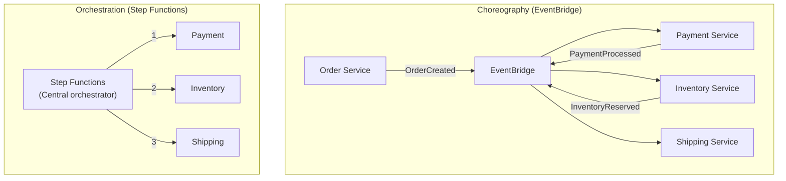

| Factor | Choreography | Orchestration |
|--------|-------------|---------------|
| **Coupling** | Loose — services don't know about each other | Tighter — orchestrator knows all steps |
| **Visibility** | Hard to trace end-to-end flow | Visual workflow in Step Functions console |
| **Error Handling** | Each service handles its own errors + compensation | Centralized retry, catch, and compensation |
| **Scaling** | Each service scales independently | Orchestrator can be a bottleneck |
| **Best For** | Simple flows, high autonomy, many teams | Complex flows, strict ordering, compensation logic |
| **AWS Service** | EventBridge + SQS | Step Functions |

**Key insight**: Most real systems use a hybrid — orchestration for critical business flows (order processing) and choreography for notifications and analytics.

### EventBridge Schema Registry & Discovery

Schema Registry automatically discovers event schemas from your event bus and generates code bindings:

1. **Schema Discovery** — enable on any event bus; EventBridge infers JSON Schema from observed events
2. **Schema Registry** — stores versioned schemas; supports OpenAPI 3.0 and JSON Schema Draft 4
3. **Code Bindings** — generate typed models for Java, Python, and TypeScript from discovered schemas
4. **Schema Versioning** — tracks schema changes automatically; enables backward compatibility checks

Use this to enforce contracts between event producers and consumers without manual schema documentation.

### Exactly-Once Processing Strategies

| Strategy | How It Works | Tradeoffs |
|----------|-------------|-----------|
| **SQS FIFO** | Built-in deduplication within 5-min window | 3K msg/s limit (70K with high-throughput mode) |
| **DynamoDB Conditional Writes** | `attribute_not_exists(messageId)` prevents reprocessing | Extra DynamoDB write per message |
| **Idempotency Key in Redis** | Store processed IDs with TTL in ElastiCache | Fast but adds Redis dependency |
| **Kafka Transactions (MSK)** | Producer transactions + consumer read-committed isolation | Complex setup, Kafka expertise required |
| **Step Functions** | Express workflows with exactly-once execution semantics | Cost at high volume |

Best practice: **always design for at-least-once delivery with idempotent consumers** — it works with every messaging service and handles edge cases gracefully.

### Dead Letter Queue Operations Playbook

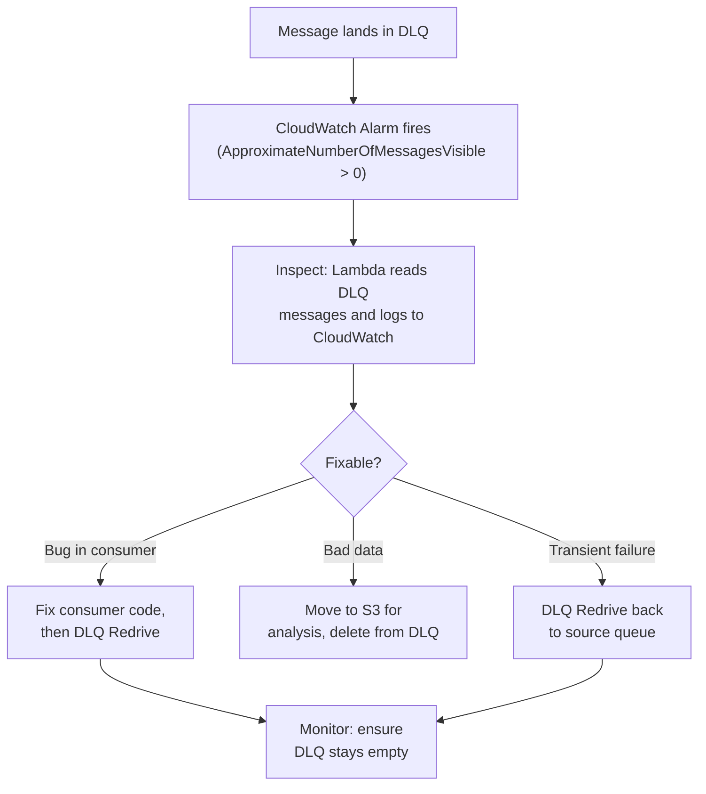

Key metrics to alarm on:
- **ApproximateNumberOfMessagesVisible** on DLQ > 0 (any message in DLQ)
- **ApproximateAgeOfOldestMessage** on main queue > threshold (processing stalled)
- **NumberOfMessagesSent** to DLQ > N/hour (systemic failure)

## Real-World Scenarios

### S1: Your SQS queue has 500,000 messages backed up and growing. Consumers are running but can't keep up. How do you handle this?

**A:** (1) **Scale consumers** — if using Lambda, increase reserved concurrency (Lambda auto-scales with SQS but respects concurrency limits). If using EC2/ECS, add more consumer instances. (2) **Check for poison messages** — if consumers fail and retry the same messages, they block new messages. Check DLQ for messages. Reduce `maxReceiveCount` to 2-3 so bad messages move to DLQ faster. (3) **Increase batch size** — process 10 messages per invocation instead of 1. (4) **Optimize consumer code** — batch DynamoDB writes, parallelize HTTP calls, reduce per-message processing time. (5) **Temporary burst** — spin up extra consumer capacity to drain the backlog, then scale back. (6) **Long-term** — if this happens regularly, the architecture needs redesign: add more consumers, use Kinesis for higher throughput, or pre-filter messages with EventBridge so consumers only get relevant messages.

### S2: You need to send the same event to 3 different microservices, but each service needs a different subset of the event data. How do you design this?

**A:** **SNS + SQS fan-out with filter policies**. (1) Publish the full event to an SNS topic. (2) Each microservice has its own SQS queue subscribed to the topic. (3) **SNS filter policies** — each subscription has a filter that only delivers relevant messages. Example: order events with `{"type": "premium"}` go to the priority queue, `{"region": "EU"}` to the compliance queue, and all events go to the analytics queue. (4) **Input transformation** — if services need different data shapes, use EventBridge instead of SNS. EventBridge input transformers reshape the event before sending to each target. (5) **Benefits**: services are decoupled, each has independent retry/DLQ, adding a new consumer is a new subscription (no code changes).

### S3: Your EventBridge rule was accidentally deleted and events from the past 3 hours are lost. How do you recover?

**A:** (1) **Check if Archive was enabled** — if EventBridge Archive is on for that event bus, all events are stored. Use **Replay** to reprocess the 3-hour window: specify start/end time and destination (the recreated rule). (2) **If no archive** — check CloudTrail for `PutEvents` API calls during the 3-hour window. You can see event payloads in CloudTrail data events (if enabled). Manually replay them via `aws events put-events`. (3) **Source recovery** — if events originated from DynamoDB Streams or S3, the source may still have the data. Re-trigger processing from the source. (4) **Prevention**: (a) Always enable Archive on production event buses. (b) Protect EventBridge rules with IAM policies — deny `events:DeleteRule` for non-admin roles. (c) Manage rules via IaC (Terraform/CDK) so deleted rules can be re-applied in seconds.

## Cheat Sheet

| Concept | Key Facts |
|---------|-----------|
| SQS Standard | Unlimited throughput, at-least-once, best-effort ordering |
| SQS FIFO | 300 msg/s (3K batched), exactly-once, strict ordering per message group |
| SQS DLQ | Messages that fail maxReceiveCount times, use DLQ redrive to reprocess |
| SQS Visibility Timeout | Default 30s, max 12h, set to 6x processing time |
| SNS | Pub/sub fan-out, push to SQS/Lambda/HTTP/email/SMS |
| SNS + SQS | Fan-out pattern — independent queues per subscriber |
| SNS Filter Policies | Deliver only matching messages to specific subscribers |
| EventBridge | Event bus, content-based routing, 200+ AWS sources, SaaS |
| EventBridge Pipes | Source → Filter → Enrich → Target (no Lambda glue) |
| EventBridge Archive | Store and replay events for debugging/recovery |
| Kinesis Data Streams | Real-time, ordered per shard, 1-365 day retention, replay |
| MSK | Managed Kafka, open-source ecosystem, high throughput |
| Amazon MQ | Legacy protocol support (JMS, AMQP, MQTT), migration only |
| Saga Pattern | Step Functions orchestrates distributed transactions with compensating actions |
| CQRS | Separate write/read models, sync via streams/events |
| Claim-Check | Large payload in S3, reference in SQS message |
| Idempotency | Design consumers to handle duplicate messages safely |

---

[← Previous: AI & ML Services](../17-ai-ml-services/) | [Next: Resilience & Disaster Recovery →](../19-resilience-and-dr/)
