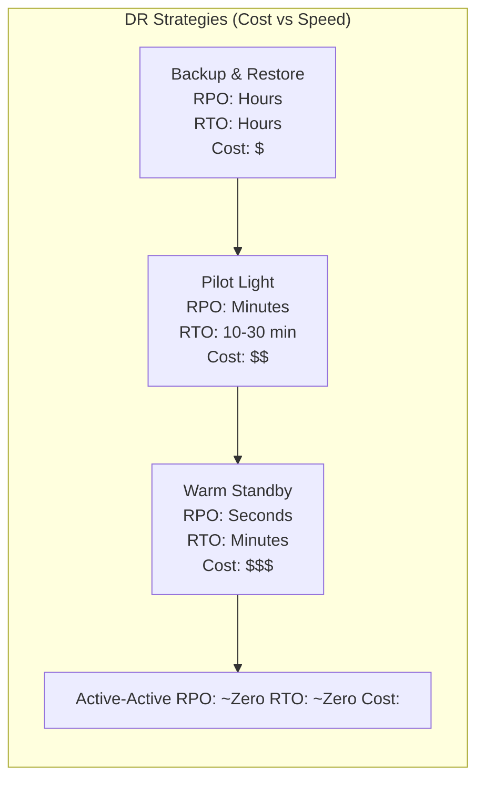
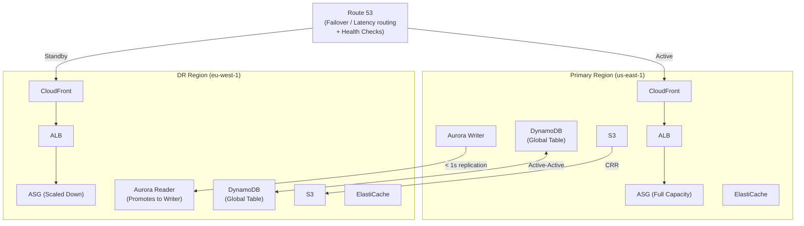
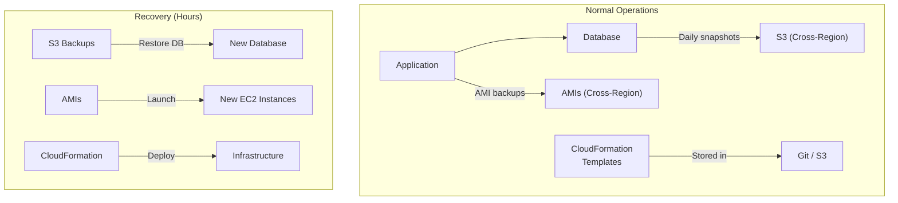
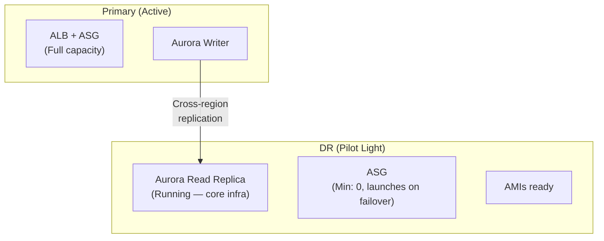
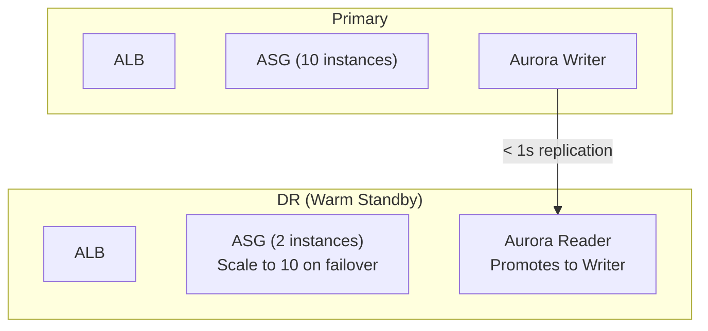
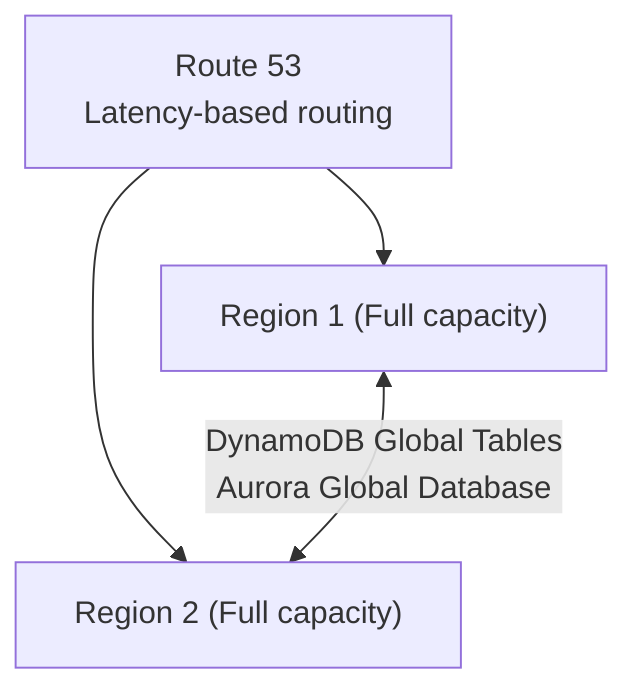
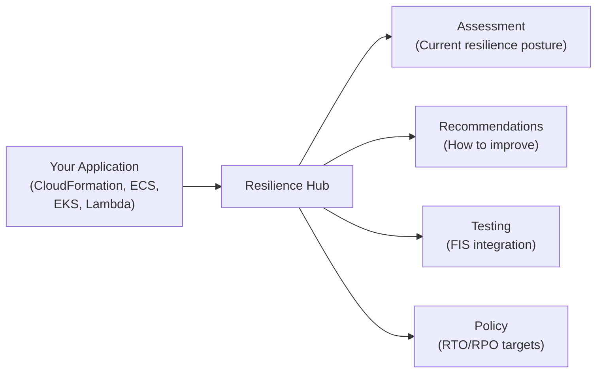

# Resilience & Disaster Recovery

## Overview

AWS interviews heavily test your understanding of resilience — how systems survive failures and recover from disasters. This section covers **disaster recovery strategies** (Backup & Restore, Pilot Light, Warm Standby, Active-Active), **resilience patterns** (multi-AZ, multi-region, chaos engineering), and key AWS services like **Route 53 health checks**, **Aurora Global Database**, **S3 Cross-Region Replication**, **AWS Elastic Disaster Recovery (DRS)**, and **AWS Resilience Hub**. Understanding RPO/RTO trade-offs is critical for Solutions Architect interviews.

## Key Concepts

| Concept | Description |
|---------|-------------|
| **RPO** (Recovery Point Objective) | Maximum acceptable data loss measured in time (e.g., RPO 1 hour = can lose up to 1 hour of data) |
| **RTO** (Recovery Time Objective) | Maximum acceptable downtime (e.g., RTO 15 minutes = must recover within 15 minutes) |
| **High Availability (HA)** | System continues operating when a component fails (e.g., Multi-AZ) |
| **Fault Tolerance** | System continues without degradation when a component fails (e.g., DynamoDB Global Tables) |
| **Disaster Recovery (DR)** | Ability to recover from a large-scale failure (e.g., entire region goes down) |
| **Resilience** | Ability to recover from disruptions and continue operating |
| **Blast Radius** | The scope of impact when a failure occurs |
| **Failover** | Switching from a failed component to a healthy one |
| **Failback** | Returning to the original component after recovery |

## Architecture Diagram

### DR Strategy Spectrum

### Multi-Region Resilience Architecture

## Deep Dive

### DR Strategy Comparison

| Strategy | RPO | RTO | Cost | How It Works | Use Case |
|----------|-----|-----|------|-------------|----------|
| **Backup & Restore** | Hours | Hours | $ | Backup data to S3/Glacier. On disaster, restore from backups and rebuild infrastructure | Non-critical apps, dev/test, compliance archives |
| **Pilot Light** | Minutes | 10-30 min | $$ | Core infrastructure running in DR (database replica, networking). Compute/app layer provisioned on failover | Business applications with moderate RTO |
| **Warm Standby** | Seconds | Minutes | $$$ | Scaled-down but fully functional copy in DR. Scale up on failover | Critical applications needing fast recovery |
| **Active-Active** | ~Zero | ~Zero | $$$$ | Full capacity in both regions. Traffic split across regions. No failover needed | Mission-critical, global applications |

### Backup & Restore

| Component | Backup Method | Storage |
|-----------|--------------|---------|
| EC2 | AMIs via AWS Backup | Cross-region AMI copy |
| EBS | Snapshots via DLM | Cross-region snapshot copy |
| RDS/Aurora | Automated backups + manual snapshots | Cross-region snapshot copy |
| DynamoDB | On-demand backups or PITR | Same region (use Global Tables for DR) |
| S3 | Cross-Region Replication | DR region bucket |
| Configuration | CloudFormation/CDK templates | Git repository |

### Pilot Light

The "pilot light" (like a gas pilot light) keeps the minimum core infrastructure running — typically just the database replica. On failover, you launch compute, update DNS, and scale up.

### Warm Standby

A scaled-down but fully functional copy. On failover, scale up to full capacity. Route 53 failover routing with health checks automates the DNS switch.

### Active-Active

Both regions serve traffic simultaneously. Data is replicated bidirectionally. No failover needed — if one region fails, the other absorbs all traffic. Most expensive but provides the best RPO/RTO.

### AWS Services for Resilience

| Service | Role in DR | Detail |
|---------|-----------|--------|
| **Route 53** | DNS failover | Health checks + failover routing. Primary/secondary endpoint config |
| **Aurora Global Database** | Database DR | Cross-region replication < 1s. Promote DR replica to writer in < 1 min |
| **DynamoDB Global Tables** | Active-active DB | Multi-region, bidirectional replication. All regions accept writes |
| **S3 Cross-Region Replication** | Data DR | Asynchronous replication to DR bucket. Same-prefix or full-bucket |
| **ElastiCache Global Datastore** | Cache DR | Cross-region Redis replication |
| **AWS Elastic Disaster Recovery** | Server DR | Continuous block-level replication of servers to DR region |
| **AWS Backup** | Centralized backups | Cross-region and cross-account backup copies with Vault Lock |
| **AWS Resilience Hub** | Resilience assessment | Assess, track, and test resilience of applications against RTO/RPO targets |

### AWS Resilience Hub

| Feature | Detail |
|---------|--------|
| **Assessment** | Analyzes your application against RTO/RPO targets, identifies gaps |
| **Recommendations** | Suggests improvements (Multi-AZ, backups, replicas) |
| **Resiliency Score** | 0-100 score across disruption types (AZ, region, infrastructure, application) |
| **Testing** | Integrates with AWS Fault Injection Service for chaos testing |
| **Drift Detection** | Alerts when application changes degrade resilience posture |

### AWS Fault Injection Service (FIS)

Chaos engineering service — intentionally inject failures to test resilience.

| Experiment | What It Does |
|-----------|-------------|
| **Stop EC2 instances** | Kill random instances to test ASG recovery |
| **Inject CPU stress** | Simulate CPU saturation on instances |
| **Throttle EBS I/O** | Simulate slow disk to test timeout handling |
| **Disrupt network** | Add latency or packet loss between services |
| **Failover RDS** | Force Multi-AZ failover to test recovery time |
| **Deny AZ traffic** | Simulate AZ failure by blocking network in one AZ |

### Multi-AZ vs Multi-Region

| Factor | Multi-AZ | Multi-Region |
|--------|----------|-------------|
| **Protects Against** | Single AZ failure, hardware failure | Region-wide outage, natural disaster |
| **Latency** | Same region (< 2ms between AZs) | Cross-region (50-200ms) |
| **Data Replication** | Synchronous (no data loss) | Asynchronous (potential small data loss) |
| **Cost** | Low-moderate (data transfer between AZs) | High (compute + storage + data transfer in 2 regions) |
| **Complexity** | Low (built into most AWS services) | High (custom failover logic, data conflicts) |
| **When to Use** | Always (default for production) | Compliance, global users, RPO < 1 min needed |

### Resilience for Common AWS Services

| Service | Multi-AZ (Built-in) | Multi-Region (Additional Setup) |
|---------|---------------------|-------------------------------|
| **EC2 + ASG** | ASG spans AZs automatically | Deploy ASG in each region, Route 53 failover |
| **RDS** | Multi-AZ deployment (sync standby) | Cross-region read replica, manual promotion |
| **Aurora** | 6 copies across 3 AZs by default | Aurora Global Database (< 1s replication) |
| **DynamoDB** | 3 AZs automatically | Global Tables (active-active) |
| **S3** | 3+ AZs automatically (11 9s durability) | Cross-Region Replication |
| **ElastiCache** | Multi-AZ with auto-failover | Global Datastore (Redis) |
| **Lambda** | Runs across AZs automatically | Deploy in multiple regions, Route 53 routing |
| **ECS/EKS** | Tasks spread across AZs | Deploy in multiple regions |
| **SQS** | Distributed across AZs automatically | No built-in cross-region (use SNS cross-region) |

## Best Practices

1. **Start with Multi-AZ** — it's free or low-cost and protects against the most common failures
2. **Define RPO and RTO before choosing a DR strategy** — let the business requirements drive the architecture
3. **Test your DR plan regularly** — use AWS Fault Injection Service for chaos engineering
4. **Automate failover** — manual failover is too slow; use Route 53 health checks and Lambda
5. **Use Aurora Global Database** for cross-region relational database DR (< 1s replication)
6. **Use DynamoDB Global Tables** for active-active NoSQL across regions
7. **Use AWS Backup with cross-region copies** for centralized backup management
8. **Enable S3 versioning before CRR** — it's required and protects against accidental deletes
9. **Monitor your DR region** — ensure resources are healthy even when not serving traffic
10. **Document and rehearse your failback procedure** — getting back to primary is often harder than failing over
11. **Use Resilience Hub** to continuously assess and improve your resilience posture
12. **Consider blast radius** — use multiple accounts and regions to limit the impact of failures

## Common Interview Questions

### Q1: Explain RPO and RTO with examples.

**A:** **RPO (Recovery Point Objective)** is the maximum acceptable data loss. RPO of 1 hour means you can afford to lose up to 1 hour of data — you need backups at least every hour. **RTO (Recovery Time Objective)** is the maximum acceptable downtime. RTO of 15 minutes means the system must be back online within 15 minutes. Example: an e-commerce site might have RPO of 5 minutes (can't lose more than 5 minutes of orders) and RTO of 10 minutes (every minute down costs $10K in revenue). The tighter the RPO/RTO, the more expensive the DR strategy.

### Q2: Compare the four DR strategies.

**A:** (1) **Backup & Restore** (RPO/RTO: hours) — cheapest, restore from S3 snapshots. For non-critical systems. (2) **Pilot Light** (RPO: minutes, RTO: 10-30 min) — core database running in DR, compute provisioned on failover. For business apps. (3) **Warm Standby** (RPO: seconds, RTO: minutes) — scaled-down but functional copy, scale up on failover. For critical apps. (4) **Active-Active** (RPO/RTO: ~zero) — full capacity in both regions, traffic split. For mission-critical global apps. Each step up roughly doubles cost but halves recovery time.

### Q3: How would you design DR for a critical financial application with RPO < 1 minute and RTO < 5 minutes?

**A:** This requires **Warm Standby** or **Active-Active**. Architecture: (1) **Aurora Global Database** — writer in primary, read replica in DR with < 1s replication lag (meets RPO < 1 min). Promotion to writer takes < 1 min. (2) **Route 53 failover routing** with health checks on primary ALB — automatic DNS switch. (3) **DR region** runs a scaled-down ASG (2 instances vs 10), scales up on failover. (4) **S3 CRR** for document storage. (5) **Lambda** triggered by Route 53 health check failure automates: promote Aurora, scale ASG, update configs. (6) **Secrets Manager** replicates secrets to DR. Test monthly with FIS.

### Q4: What is the difference between high availability and disaster recovery?

**A:** **High Availability (HA)** protects against component-level failures within a region: an EC2 instance dies, an AZ goes down. Achieved with Multi-AZ deployments, Auto Scaling, and load balancing. Automatic, fast recovery (seconds to minutes). **Disaster Recovery (DR)** protects against region-level or large-scale failures: natural disaster, region outage, data corruption. Requires cross-region infrastructure and data replication. Recovery is typically slower and may require manual steps. HA is a subset of resilience — you need both. Multi-AZ = HA; Multi-Region = DR.

### Q5: How does Route 53 failover routing work?

**A:** Configure two records: **Primary** (pointing to your primary ALB/endpoint) and **Secondary** (pointing to your DR ALB/endpoint). Route 53 health checks monitor the primary endpoint — sending HTTP/HTTPS/TCP checks every 10 or 30 seconds. If the primary fails 3 consecutive checks (configurable), Route 53 marks it unhealthy and starts routing traffic to the secondary. When the primary recovers, traffic automatically routes back. The TTL on DNS records determines how quickly clients switch (set to 60 seconds for fast failover). Combine with CloudFront for even faster failover via origin failover groups.

### Q6: How do you handle data consistency in multi-region architectures?

**A:** This is the fundamental challenge. Options: (1) **Active-Passive** — all writes go to primary, replicate async to DR. Simple but RPO > 0 (data in flight during failure is lost). (2) **Active-Active with last-writer-wins** — DynamoDB Global Tables uses this. Both regions accept writes; conflicts resolved by timestamp. Works for most cases but can lose concurrent conflicting writes. (3) **Active-Active with conflict resolution** — application-level logic resolves conflicts (merge, prompt user). Complex but most correct. (4) **CQRS pattern** — writes go to one region, reads served from both. Simpler consistency model. The CAP theorem means you must choose between consistency and availability during partitions.

### Q7: What is AWS Elastic Disaster Recovery (DRS)?

**A:** AWS DRS (formerly CloudEndure Disaster Recovery) provides continuous block-level replication of on-premises or cloud servers to a DR region. Key features: (1) **Continuous replication** — sub-second RPO by replicating every block write. (2) **Low-cost staging** — uses lightweight EC2 instances during normal operations. (3) **Launch on demand** — full-sized instances launched only during failover. (4) **Non-disruptive testing** — launch drill instances without affecting replication. (5) **Automated failback** — reverse replication after recovery. Use it for server-level DR when you need RPO < 1 second. Different from Aurora Global Database (database-level) or S3 CRR (object-level).

### Q8: How do you test disaster recovery without affecting production?

**A:** (1) **AWS Fault Injection Service (FIS)** — inject controlled failures: stop EC2 instances, add network latency, force RDS failover. Runs experiments with safeguards (stop conditions if things go wrong). (2) **DRS drill launches** — launch DR instances in the DR region without disrupting replication. (3) **Route 53 failover testing** — temporarily make the primary health check fail. (4) **Game days** — scheduled chaos engineering events where the team practices the full DR runbook. (5) **Resilience Hub** — continuous assessment against RTO/RPO targets. Test DR at least quarterly; test Multi-AZ failover monthly. Document results and improve.

### Q9: How would you implement chaos engineering on AWS?

**A:** Use **AWS Fault Injection Service (FIS)**: (1) Define **experiment templates** — which resources to target and what faults to inject. (2) Set **stop conditions** — CloudWatch alarms that abort the experiment if things go too wrong. (3) Start with read-only experiments (CPU stress) before destructive ones (terminate instances). (4) Run in non-production first, then graduate to production with tight stop conditions. Common experiments: terminate random EC2 instances (test ASG recovery), inject latency between services (test timeout handling), force RDS failover (test connection retry), block an AZ (test Multi-AZ resilience). Combine with Resilience Hub for continuous assessment.

### Q10: What happens when an entire AWS Region goes down?

**A:** Full region outages are extremely rare but possible (us-east-1 has had partial outages). Without DR: your application is down until the region recovers (hours). With DR: (1) Route 53 health checks detect the failure and route traffic to the DR region. (2) Aurora Global Database promotes the DR reader to writer. (3) DynamoDB Global Tables continue serving from the surviving region. (4) S3 CRR ensures objects are in the DR region. (5) ASG in DR scales up to handle full traffic. The recovery time depends on your DR strategy. Active-Active: seconds. Warm Standby: minutes. Pilot Light: 10-30 minutes. Backup & Restore: hours. The key lesson: multi-region DR is an insurance policy — expensive to maintain but critical for business continuity.

### Q11: How do you handle DNS TTL and caching during failover?

**A:** DNS TTL (Time To Live) determines how long clients cache DNS records. For fast failover: (1) Set Route 53 TTL to **60 seconds** (the minimum practical value). (2) Note that some resolvers and browsers ignore TTL and cache longer. (3) Use **CloudFront** in front of your application — CloudFront respects origin failover without DNS changes. (4) Use **Global Accelerator** — provides static anycast IPs that don't change during failover (no DNS propagation delay). (5) For mobile apps, implement client-side retry with service discovery to handle stale DNS. The reality: even with 60s TTL, expect 2-5 minutes for full DNS propagation to all clients worldwide.

### Q12: Explain the difference between RDS Multi-AZ, Aurora Multi-AZ, and Aurora Global Database.

**A:** **RDS Multi-AZ**: Synchronous replication to standby in another AZ. Failover: 60-120 seconds. Standby doesn't serve reads. Same region only. **Aurora Multi-AZ**: 6 copies across 3 AZs. Failover: < 30 seconds. Up to 15 read replicas serve reads. Same region. **Aurora Global Database**: Cross-region replication < 1 second. Supports up to 5 secondary regions. Secondary can be promoted to writer in < 1 minute. Use for multi-region DR and global read scaling. Each is a different resilience tier: RDS Multi-AZ = AZ failure protection. Aurora Multi-AZ = AZ failure + read scaling. Aurora Global = region failure protection.

## Cheat Sheet

| Concept | Key Facts |
|---------|-----------|
| RPO | Maximum acceptable data loss (time) |
| RTO | Maximum acceptable downtime (time) |
| Backup & Restore | RPO/RTO hours, cheapest, restore from S3 |
| Pilot Light | RPO minutes, RTO 10-30 min, core DB running, compute on-demand |
| Warm Standby | RPO seconds, RTO minutes, scaled-down full copy |
| Active-Active | RPO/RTO ~zero, full capacity both regions, most expensive |
| Route 53 Failover | Health checks + automatic DNS switch, set TTL to 60s |
| Aurora Global DB | < 1s cross-region replication, promote in < 1 min |
| DynamoDB Global Tables | Active-active multi-region, last-writer-wins |
| S3 CRR | Async cross-region replication, versioning required |
| AWS DRS | Continuous block-level server replication, sub-second RPO |
| AWS FIS | Chaos engineering: inject failures, test resilience |
| Resilience Hub | Assess resilience against RTO/RPO targets, score 0-100 |
| Multi-AZ | Protects against AZ failure, sync replication, low cost |
| Multi-Region | Protects against region failure, async replication, high cost |

---

[← Previous: Messaging & Event-Driven](../18-messaging-and-event-driven/) | [Next: Advanced DynamoDB →](../20-advanced-dynamodb/)
