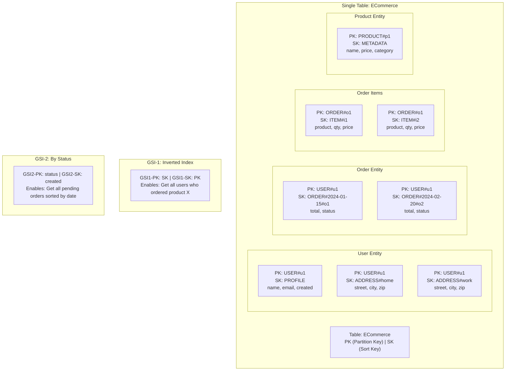
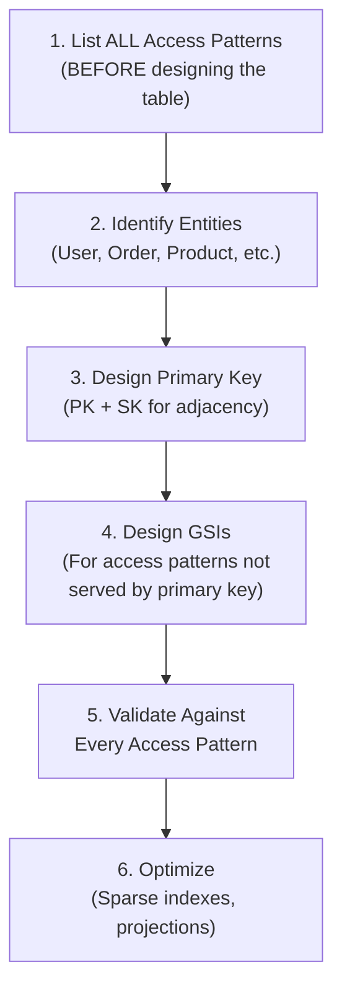
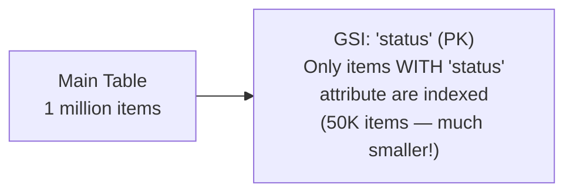
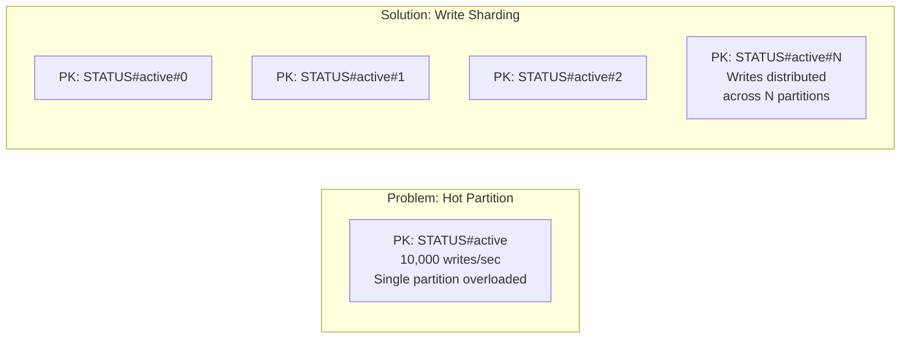
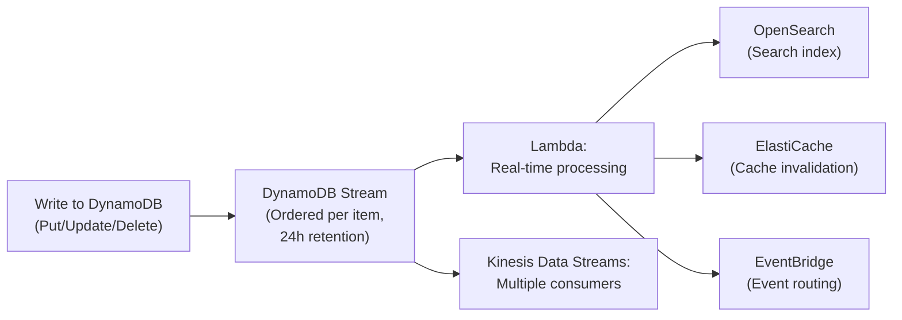
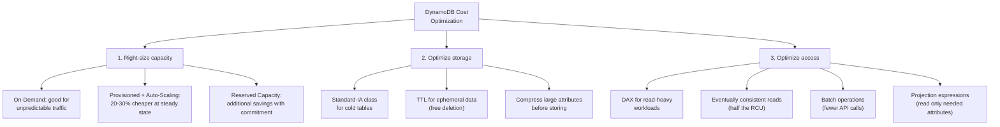

# Advanced DynamoDB Patterns

## Overview

DynamoDB is one of AWS's most powerful and nuanced services. While basic DynamoDB knowledge (partition keys, sort keys, GSIs) is covered in Section 06, this section goes deep on **single-table design**, **access pattern modeling**, **advanced indexing strategies**, **cost optimization**, and **production best practices**. Mastering DynamoDB data modeling is essential for building scalable AWS applications.

## Key Concepts

| Concept | Description |
|---------|-------------|
| **Single-Table Design** | Store all entity types in one table using overloaded keys and GSIs |
| **Access Pattern** | A specific query your application needs to perform (e.g., "get all orders for user X") |
| **Composite Key** | Partition Key + Sort Key together form the primary key |
| **Overloaded Keys** | Using generic key names (PK, SK) that hold different entity types |
| **Sparse Index** | GSI where only some items have the indexed attributes — reduces index size |
| **Adjacent Item Pattern** | Related items share a partition key with different sort keys |
| **Write Sharding** | Appending random suffix to partition key to distribute hot partitions |

## Architecture Diagram

### Single-Table Design Example (E-Commerce)



## Deep Dive

### Single-Table Design Principles

Single-table design stores multiple entity types (users, orders, products) in one DynamoDB table, using overloaded partition and sort keys. This is the recommended pattern for DynamoDB.

#### Why Single-Table?

| Benefit | Explanation |
|---------|-------------|
| **Fewer round-trips** | Fetch related entities in one query (user + addresses + recent orders) |
| **Transaction support** | TransactWriteItems works across items in one or more tables in the same region |
| **Lower cost** | One table = one set of capacity settings, fewer GSIs to maintain |
| **Simpler operations** | One table to backup, monitor, and manage |
| **DynamoDB was designed for this** | The data model is optimized for single-table patterns |

#### When NOT to Use Single-Table

| Scenario | Use Multi-Table Instead |
|----------|----------------------|
| Teams own different entities independently | Separate tables per team/microservice |
| Access patterns are completely independent | No benefit from co-location |
| You're new to DynamoDB | Start with one entity per table, graduate to single-table |
| Data has vastly different access volumes | Separate tables allow independent capacity settings |

### Data Modeling Process



### Step 1: Define Access Patterns

**This is the most critical step.** List every query before designing the table.

| # | Access Pattern | Parameters | Frequency |
|---|---------------|------------|-----------|
| 1 | Get user profile | user_id | High |
| 2 | Get user's addresses | user_id | Medium |
| 3 | Get user's orders (newest first) | user_id | High |
| 4 | Get order details with items | order_id | High |
| 5 | Get orders by status | status | Medium |
| 6 | Get product details | product_id | High |
| 7 | Get all orders for a product | product_id | Low |

### Step 2: Design the Key Schema

```
Table: ECommerce
- PK (Partition Key): String
- SK (Sort Key): String
```

| Entity | PK | SK | Attributes |
|--------|----|----|------------|
| User Profile | `USER#<user_id>` | `PROFILE` | name, email, created |
| User Address | `USER#<user_id>` | `ADDRESS#<type>` | street, city, zip |
| Order | `USER#<user_id>` | `ORDER#<date>#<order_id>` | total, status, GSI1-PK: `ORDER#<order_id>` |
| Order Item | `ORDER#<order_id>` | `ITEM#<item_id>` | product_id, qty, price |
| Product | `PRODUCT#<product_id>` | `METADATA` | name, price, category |

### Step 3: Map Access Patterns to Queries

| Access Pattern | Query |
|---------------|-------|
| Get user profile | `PK = USER#u1, SK = PROFILE` |
| Get user's addresses | `PK = USER#u1, SK begins_with ADDRESS#` |
| Get user + addresses + orders | `PK = USER#u1` (returns all items for this user) |
| Get user's orders (newest first) | `PK = USER#u1, SK begins_with ORDER#, ScanIndexForward=false` |
| Get order items | `PK = ORDER#o1, SK begins_with ITEM#` |
| Get product | `PK = PRODUCT#p1, SK = METADATA` |

### Step 4: Design GSIs

| GSI | PK | SK | Purpose |
|-----|----|----|---------|
| **GSI-1 (Inverted)** | SK | PK | Get order by order_id, get all items for a product |
| **GSI-2 (By Status)** | status | created | Get all orders by status (sparse — only order items have status) |

### Advanced Indexing Strategies

#### Sparse Indexes



If only a subset of items has the indexed attribute, the GSI only contains those items. This reduces GSI storage cost and improves query speed. Example: only orders have a `status` attribute, so the GSI on `status` only contains orders, not users or products.

#### Overloaded GSI

Use one GSI to serve multiple access patterns by overloading its key attributes:

| Entity | GSI-PK | GSI-SK | Purpose |
|--------|--------|--------|---------|
| Order | `ORDER#<id>` | `USER#<user_id>` | Look up order → find user |
| Product | `CATEGORY#<cat>` | `PRICE#<price>` | Browse products by category, sorted by price |
| User | `EMAIL#<email>` | `USER#<id>` | Look up user by email |

#### Write Sharding for Hot Partitions



Append a random suffix (0-N) to the partition key. Reads must scatter-gather across all shards. Use when a single partition key receives too many writes (> 1000 WCU/sec per partition).

### DynamoDB Capacity and Performance

#### Partition Behavior

| Metric | Value |
|--------|-------|
| **Max partition size** | 10 GB |
| **Max throughput per partition** | 3000 RCU + 1000 WCU |
| **Adaptive capacity** | Automatically redistributes throughput to hot partitions |
| **Burst capacity** | 5 minutes of unused throughput saved for spikes |

#### On-Demand vs Provisioned

| Factor | On-Demand | Provisioned |
|--------|-----------|-------------|
| **Pricing** | Per request (~$1.25/million writes, ~$0.25/million reads) | Per RCU/WCU per hour |
| **Capacity Planning** | None needed | Must estimate or use auto-scaling |
| **Cost at Scale** | ~5-7x more expensive than provisioned at steady state | Cheapest for predictable workloads |
| **Burst Handling** | Doubles previous peak instantly | Auto-scaling takes 5-15 minutes to react |
| **Best For** | Unpredictable/spiky traffic, new apps | Predictable traffic, cost-sensitive at scale |

**Cost optimization**: Start with On-Demand for new tables. After 2-4 weeks of CloudWatch data, switch to Provisioned with auto-scaling for steady-state tables. On-Demand tables that consistently use > 20% of their peak capacity are usually cheaper as Provisioned.

### DynamoDB Transactions

| Feature | Detail |
|---------|--------|
| **TransactWriteItems** | Atomic write of up to 100 items across tables |
| **TransactGetItems** | Consistent read of up to 100 items across tables |
| **Cost** | 2x the RCU/WCU of standard operations |
| **Use Cases** | Financial transfers, inventory reservation, deduplication |
| **Limitations** | 100 items max, 4 MB total, all items in same region |
| **Idempotency** | Use ClientRequestToken for exactly-once semantics |

### DynamoDB Streams



| Feature | DynamoDB Streams | Kinesis Data Streams for DynamoDB |
|---------|-----------------|----------------------------------|
| **Retention** | 24 hours | 1-365 days |
| **Consumers** | 2 per shard | Multiple (enhanced fan-out) |
| **Ordering** | Per item | Per item (partition key) |
| **Use Case** | Simple triggers (Lambda) | Complex processing, multiple consumers |

### DynamoDB Best Practices

#### Key Design

1. **High cardinality partition keys** — user_id (millions), not status (3 values)
2. **Use composite sort keys** — `ORDER#2024-01-15#o1` enables range queries and sorting
3. **Use key prefixes** — `USER#`, `ORDER#`, `PRODUCT#` to distinguish entity types
4. **Avoid scan operations** — every access pattern should map to a query
5. **Design for the most frequent access pattern first** — optimize the hot path

#### GSI Design

1. **Overload GSIs** — use one GSI for multiple access patterns
2. **Project only needed attributes** — reduce GSI storage and cost (KEYS_ONLY or INCLUDE)
3. **Use sparse indexes** — only items with the indexed attribute appear in the GSI
4. **GSI eventual consistency** — data appears in GSIs within milliseconds, but not instantly
5. **Max 20 GSIs per table** — if you need more, reconsider your data model

#### Cost Optimization

1. **Use On-Demand for new/spiky workloads**, Provisioned with auto-scaling for steady state
2. **Reduce item sizes** — use short attribute names (pk, sk, not partitionKey, sortKey) in high-volume tables
3. **Use projections in GSIs** — don't project attributes you don't query
4. **Enable TTL** to auto-delete expired items (free, no WCU cost)
5. **Use DAX** for read-heavy workloads (reduces RCU by 10x)
6. **Batch operations** — BatchWriteItem (25 items) and BatchGetItem (100 items) are more efficient

## Knowledge Check

### Q1: What is single-table design and why is it recommended for DynamoDB?

**A:** Single-table design stores all entity types (users, orders, products) in one DynamoDB table using generic key names (PK, SK) with type prefixes (USER#, ORDER#). It's recommended because: (1) **One query can return related entities** — get a user's profile, addresses, and recent orders in a single query since they share the same partition key. (2) **Transactions work within a table** — TransactWriteItems can atomically update a user and create an order. (3) **Fewer tables to manage** — one set of capacity settings, one backup policy. (4) **DynamoDB was designed for this** — it's a key-value store, not a relational database. The trade-off is complexity in data modeling.

### Q2: Walk me through how you would model an e-commerce application in DynamoDB.

**A:** Start by listing access patterns: (1) Get user profile, (2) Get user's orders, (3) Get order with items, (4) Get product, (5) Get orders by status. Key design: PK = entity type + ID (e.g., `USER#u1`), SK = entity subtype (e.g., `PROFILE`, `ORDER#<date>#<id>`, `ADDRESS#<type>`). A user's profile, addresses, and orders all share PK=`USER#u1` — one query returns all of them. Order items use PK=`ORDER#o1`, SK=`ITEM#<id>`. GSI-1 inverts PK/SK for order-level lookups. GSI-2 on `status` + `created` for status queries (sparse index — only orders have status).

### Q3: How do you handle hot partitions in DynamoDB?

**A:** Hot partitions occur when one partition key gets disproportionate traffic. Solutions: (1) **Better partition key design** — use high-cardinality keys (user_id vs status). (2) **Write sharding** — append a random suffix (0-N) to distribute writes across multiple partitions. Reads scatter-gather across all shards. (3) **Adaptive capacity** — DynamoDB automatically redistributes throughput to hot partitions (but there are limits). (4) **DAX caching** — cache reads to reduce load on hot partitions. (5) **On-demand capacity** — handles spikes without pre-provisioning. The root cause is usually a poor partition key choice — fix the data model first.

### Q4: Explain the difference between Query and Scan in DynamoDB.

**A:** **Query** is efficient — it uses the partition key (required) and optionally the sort key to fetch specific items. It only reads items matching the key condition, so it's fast and cheap. **Scan** reads the entire table and optionally filters results — extremely expensive for large tables because you pay for every item scanned, even filtered ones. Rule: every access pattern in production should use Query, never Scan. If you need a Scan-like operation, create a GSI that turns it into a Query. The only acceptable use of Scan is for one-time data export or migration.

### Q5: How do DynamoDB transactions work?

**A:** DynamoDB supports ACID transactions across multiple items (up to 100) in one or more tables. **TransactWriteItems** atomically writes/updates/deletes up to 100 items — all succeed or all fail. **TransactGetItems** reads up to 100 items with read-after-write consistency. Cost: 2x the normal RCU/WCU. Use cases: transfer money between accounts (debit one, credit another), place an order (create order, decrement inventory), ensure uniqueness (insert if not exists). Use `ClientRequestToken` for idempotent retries. Limitations: 100 items, 4 MB total, same region, no cross-table GSI updates.

### Q6: What are DynamoDB Streams and how do you use them?

**A:** DynamoDB Streams capture a time-ordered sequence of item-level changes (INSERT, MODIFY, REMOVE) with 24-hour retention. Each change record includes the old and/or new item image. Use cases: (1) **Trigger Lambda** to sync data to OpenSearch (build a search index). (2) **Cache invalidation** — update ElastiCache when items change. (3) **Cross-service events** — publish changes to EventBridge for downstream processing. (4) **Aggregation** — Lambda computes real-time statistics from changes. (5) **Global Tables** — built on streams for multi-region replication. For multiple consumers or longer retention, use **Kinesis Data Streams for DynamoDB** instead of native streams.

### Q7: How do you design a DynamoDB table for time-series data?

**A:** Time-series data (IoT readings, logs, metrics) is challenging because: (1) Data is write-heavy and append-only. (2) Queries are usually by time range for a specific entity. Design: PK = `DEVICE#<id>`, SK = timestamp (ISO 8601). This allows efficient range queries: "get all readings for device X between 9 AM and 10 AM." For hot devices, use **write sharding** (add random suffix to PK). For old data, use **TTL** to auto-expire records or **DynamoDB export** to S3 for archival. Alternative: use separate tables per time period (table per month) for easy bulk deletion.

### Q8: When would you use DAX vs ElastiCache for caching DynamoDB?

**A:** **DAX (DynamoDB Accelerator)** is a purpose-built, DynamoDB-aware cache. It sits in front of DynamoDB and caches both item-level (GetItem) and query-level results. No code changes — use the DAX client instead of the DynamoDB client. Microsecond read latency. **ElastiCache Redis** is a general-purpose cache — you control cache logic, eviction, and data structures. Use DAX when: caching DynamoDB reads is the primary goal and you want zero code changes. Use ElastiCache when: you need caching for multiple data sources (DynamoDB + RDS + APIs), complex data structures (leaderboards, sessions), or custom cache logic.

### Q9: How do you estimate DynamoDB capacity and cost?

**A:** (1) **Estimate item size**: sum all attribute sizes (name length + value size). Average item = 1-4 KB typically. (2) **Estimate throughput**: reads per second (RPS) × item size / 4 KB = RCU (strongly consistent) or RCU/2 (eventually consistent). Writes per second × item size / 1 KB = WCU. (3) **Account for GSIs** — each GSI needs its own RCU/WCU proportional to its traffic. (4) **Add 20-30% headroom** for spikes. (5) Compare On-Demand vs Provisioned: On-Demand is ~$1.25/million writes, $0.25/million reads. Provisioned is ~$0.00065/WCU-hour. At >20% utilization, Provisioned is cheaper. Use the **DynamoDB pricing calculator** for detailed estimates.

### Q10: Explain the adjacency list pattern in DynamoDB.

**A:** The adjacency list pattern models many-to-many relationships using the same table. Each entity and its relationships share the same partition key. Example — social network: PK = `USER#alice`, SK = `PROFILE` (Alice's profile), `FRIEND#bob` (Alice follows Bob), `FRIEND#charlie` (Alice follows Charlie). To find Alice's friends: `Query PK = USER#alice, SK begins_with FRIEND#`. To find who follows Bob: create a GSI that inverts PK/SK, then `Query GSI-PK = FRIEND#bob`. This models graph-like relationships without a graph database, using DynamoDB's Query efficiency.

### Q11: How do you handle large items (>400 KB) in DynamoDB?

**A:** DynamoDB's max item size is 400 KB. Strategies for large data: (1) **Compress attributes** — GZIP binary data before storing. (2) **Store large blobs in S3** — save the S3 URL/key in DynamoDB (claim-check pattern). (3) **Split items** — break a large item into multiple items with the same PK and different SK segments (`PART#1`, `PART#2`). (4) **Reduce attribute name length** — use short names (`n` instead of `name`) for high-volume tables. (5) **Separate read-heavy and write-heavy attributes** — store hot attributes in the main item and cold attributes in a separate item with a different SK. Most applications should use the S3 pointer pattern for data > 100 KB.

### Q12: How would you migrate from a relational database to DynamoDB?

**A:** (1) **Analyze access patterns** — list every SQL query your application makes. This is the most critical step because DynamoDB requires you to know queries in advance. (2) **Denormalize** — flatten JOINs into single items. An order + customer + items becomes one or two items, not three tables. (3) **Design the DynamoDB key schema** based on access patterns, not entities. (4) **Create GSIs** for secondary access patterns. (5) **Use DMS** to migrate data from RDS to DynamoDB. (6) **Test every access pattern** — DynamoDB doesn't support ad-hoc queries, so missing patterns require table redesign. Warning: if your workload is JOIN-heavy, highly relational, or requires complex aggregations, DynamoDB may not be the right choice — Aurora might be better.

## Best Practices

1. **Define ALL access patterns before designing the table** — DynamoDB doesn't support ad-hoc queries; missing a pattern may require table redesign
2. **Choose high-cardinality partition keys** — avoid hot partitions by ensuring even distribution (user IDs, device IDs, not status codes)
3. **Use composite sort keys** for hierarchical queries — `STATUS#CREATED_AT` enables filtering by status with date range
4. **Limit GSIs to what you need** — each GSI duplicates data and consumes separate throughput; max 20 per table
5. **Use sparse indexes** — GSIs only include items that have the indexed attribute, reducing cost and improving query efficiency
6. **Enable auto-scaling or use on-demand** — avoid manual capacity management; switch to provisioned with auto-scaling once patterns stabilize
7. **Set TTL on ephemeral data** — sessions, logs, and temp records should auto-expire at no WCU cost
8. **Use DynamoDB Streams for change data capture** — trigger Lambda, replicate to OpenSearch, or sync to analytics
9. **Keep items under 4 KB for reads, 1 KB for writes** — this aligns with RCU/WCU unit pricing for optimal cost
10. **Monitor with CloudWatch** — track ConsumedReadCapacityUnits, ConsumedWriteCapacityUnits, ThrottledRequests, and SystemErrors

## Latest Updates (2025-2026)

- **DynamoDB zero-ETL integration with Redshift** — automatically replicate DynamoDB tables to Redshift for analytics without pipeline code
- **Resource-based policies** — attach IAM policies directly to DynamoDB tables for cross-account access without assuming roles
- **DynamoDB table class optimization** — Standard-Infrequent Access (Standard-IA) class reduces storage cost by 60% for cold data
- **Warm throughput for on-demand** — pre-warm tables to previously achieved traffic levels, preventing throttling after idle periods
- **Enhanced import/export** — incremental export to S3 (export only changed items since last export), reducing export time and cost
- **Global Tables version 2019.11.21 improvements** — faster replication, improved conflict resolution metrics, and CloudWatch contributor insights

### Q13: How does DynamoDB zero-ETL to Redshift work and when would you use it?

**A:** Zero-ETL automatically replicates DynamoDB table data to Amazon Redshift without writing any ETL code. DynamoDB exports change data via Streams to Redshift, maintaining near-real-time sync. Use when: (1) You need SQL analytics on DynamoDB data (JOINs, aggregations, window functions). (2) Business analysts need BI tool access via Redshift/QuickSight. (3) You want to avoid building and maintaining Glue/Lambda ETL pipelines. Tradeoff: adds Redshift cost, slight replication lag (seconds to minutes). Alternative: DynamoDB export to S3 + Athena for less frequent, cheaper analytics.

### Q14: When should you use DynamoDB Standard-IA table class?

**A:** Standard-IA reduces storage cost by ~60% but increases read/write costs by ~25%. Use for tables where storage dominates cost: (1) Tables with large items (>4 KB) but low access frequency. (2) Audit logs, historical records, or compliance data accessed rarely. (3) Tables where storage cost is >50% of total table cost. Don't use for high-throughput tables where read/write costs dominate. Check the DynamoDB console's **Table Class Recommendations** which analyzes your actual usage patterns and recommends the optimal class.

### Q15: Explain DynamoDB resource-based policies and cross-account access patterns.

**A:** Resource-based policies let you attach IAM policies directly to a DynamoDB table, granting cross-account access without the target account needing to assume a role. Before this, cross-account access required: (1) Create IAM role in source account. (2) Grant assume-role to target account. (3) Target calls `sts:AssumeRole` then accesses DynamoDB. With resource-based policies: attach a policy to the table with `Principal: { "AWS": "arn:aws:iam::TARGET_ACCOUNT:role/role-name" }`. The target account accesses the table directly. Simpler for data sharing, data mesh architectures, and multi-account setups.

## Deep Dive Notes

### Single-Table Design Walkthrough: E-Commerce

Access patterns for an e-commerce system:
1. Get customer by ID
2. Get all orders for a customer
3. Get order by ID
4. Get order items for an order
5. Get all orders by status (e.g., "PENDING")

Table design:

| PK | SK | Attributes |
|----|-----|------------|
| `CUSTOMER#c1` | `PROFILE` | name, email, address |
| `CUSTOMER#c1` | `ORDER#o1` | status, total, date |
| `CUSTOMER#c1` | `ORDER#o2` | status, total, date |
| `ORDER#o1` | `ITEM#i1` | product, qty, price |
| `ORDER#o1` | `ITEM#i2` | product, qty, price |
| `ORDER#o2` | `ITEM#i3` | product, qty, price |

Query execution:
- **Pattern 1**: `Query PK=CUSTOMER#c1, SK=PROFILE`
- **Pattern 2**: `Query PK=CUSTOMER#c1, SK begins_with ORDER#`
- **Pattern 3**: `Query PK=ORDER#o1, SK=META` (add a META item) or use GSI
- **Pattern 4**: `Query PK=ORDER#o1, SK begins_with ITEM#`
- **Pattern 5**: **GSI** with `GSI-PK=status, GSI-SK=date` (sparse index — only order items have status)

### DynamoDB Streams vs Kinesis Data Streams for DynamoDB

| Feature | DynamoDB Streams | Kinesis Data Streams for DynamoDB |
|---------|-----------------|-----------------------------------|
| **Retention** | 24 hours | 1-365 days |
| **Consumers** | 2 simultaneous (Lambda + 1) | Unlimited via Enhanced Fan-Out |
| **Throughput** | 2 reads/sec per shard | 2 MB/sec per consumer per shard |
| **Ordering** | Per item | Per item (within shard) |
| **Cost** | Free (included with table) | Kinesis pricing ($0.015/shard-hour) |
| **Use Case** | Lambda triggers, replication | Multiple consumers, long retention, analytics |

**Decision rule**: Use DynamoDB Streams when you have 1-2 consumers and need simple Lambda triggers. Use Kinesis for DynamoDB when you need >2 consumers, retention >24h, or high-throughput stream processing.

### Cost Optimization Strategies



Key cost levers:
- **Eventually consistent reads** cost 50% less than strongly consistent — use by default unless you need strong consistency
- **S3 Bucket Key pattern** for large items — store in S3, reference in DynamoDB (avoids 400 KB item limit and reduces WCU)
- **GSI projections** — project only needed attributes into GSIs to reduce storage and read costs

### Global Tables Conflict Resolution

DynamoDB Global Tables use **last-writer-wins (LWW)** based on timestamp. When the same item is written in two regions simultaneously:

1. Both writes succeed locally (no cross-region coordination on writes)
2. Replication propagates both writes to the other region
3. The write with the **later timestamp** wins in both regions
4. The earlier write is silently overwritten

Mitigation strategies for conflict-sensitive data:
- **Region-affinity routing** — route each user/tenant to a specific "home" region for writes
- **Optimistic locking** — use a `version` attribute with conditional writes (`attribute_not_exists` or `version = :expected`)
- **Write to one region** — use Global Tables for read scaling but funnel all writes through one region
- **Application-level merge** — use DynamoDB Streams to detect conflicts and apply custom merge logic

## Real-World Scenarios

### S1: Your DynamoDB table scan for a daily report takes 45 minutes and consumes all RCU, throttling production reads. How do you fix this?

**A:** Full table scans are the #1 DynamoDB anti-pattern. (1) **Never scan in production** — scans read every item in the table (all partitions). (2) **Export to S3** — use DynamoDB Export to S3 (uses backup, zero RCU). Query with Athena for reports. (3) **GSI for the report query** — if the report filters by date or status, create a GSI with that as the key. Query the GSI instead of scanning. (4) **DynamoDB Streams → analytics** — stream changes to S3 via Firehose. Run reports on S3 data with Athena or Redshift. (5) **If scan is unavoidable** — use parallel scan with `TotalSegments` to speed it up, but with rate limiting (`Limit` parameter) to cap RCU consumption. Schedule during off-peak hours. (6) **Zero-ETL to Redshift** — automatic replication to Redshift for SQL analytics, no table scan needed.

### S2: Your single-table DynamoDB design works for 5 access patterns, but a new feature requires a 6th that doesn't fit. What do you do?

**A:** This is the real-world tension of single-table design. Options: (1) **Add a GSI** — if the new pattern can be served by a different key combination, add a GSI. You have up to 20. Overload the GSI key to serve multiple patterns. (2) **Denormalize differently** — duplicate data in a new item format that supports the pattern. More writes, but reads are efficient. (3) **Composite sort key** — restructure SK to include the new dimension (e.g., `STATUS#2026-04-19` becomes `STATUS#REGION#2026-04-19`). (4) **Accept a query + filter** — if the pattern is rare (admin/report), query a broader set and filter in application code. Less efficient but avoids schema changes. (5) **Separate table** — if the pattern is fundamentally different (full-text search, graph traversal), use the right tool: OpenSearch for search, Neptune for graphs. DynamoDB isn't the answer for every access pattern.

### S3: Your Global Tables setup has users in US and EU. An EU user updates their profile, but when they're immediately redirected to a US-served page, they see stale data. How do you fix this?

**A:** This is **read-after-write consistency across regions** — Global Tables is eventually consistent cross-region (typically <1s but not guaranteed). (1) **Region-affinity routing** — route each user to their home region for both reads and writes. EU users always hit eu-west-1. This eliminates cross-region consistency issues for most operations. (2) **Sticky sessions** — after a write, serve subsequent reads from the same region for 5 seconds (cookie or header-based routing in CloudFront/ALB). (3) **Optimistic UI** — after the profile update, the client displays the updated data locally without re-fetching from the server. The replication catches up in the background. (4) **Version check** — include a version number in the response. Client compares: if version is older than expected, retry the read after 1 second. (5) **Accept it** — for non-critical reads, eventual consistency is fine. Only apply fixes for user-facing flows where stale data causes confusion.

## Cheat Sheet

| Concept | Key Facts |
|---------|-----------|
| Single-Table Design | All entities in one table, overloaded PK/SK with type prefixes |
| Access Patterns | Define ALL queries BEFORE designing the table |
| Partition Key | High cardinality, even distribution. Max 10 GB, 3K RCU + 1K WCU per partition |
| Sort Key | Enables range queries, hierarchical data (begins_with) |
| GSI | Max 20 per table, eventually consistent, separate throughput |
| Sparse Index | GSI only includes items with the indexed attribute |
| Overloaded GSI | One GSI serves multiple access patterns |
| Write Sharding | Append random suffix to PK for hot partitions |
| Adjacency List | Model many-to-many with same PK, different SK |
| Transactions | Up to 100 items, 4 MB, 2x RCU/WCU cost |
| Streams | 24h retention, ordered per item, trigger Lambda |
| DAX | DynamoDB cache, microsecond reads, zero code changes |
| TTL | Auto-delete expired items, no WCU cost |
| Max Item Size | 400 KB — use S3 for larger data |
| On-Demand | No capacity planning, ~5-7x Provisioned cost at steady state |
| Provisioned | Auto-scaling, cheapest at predictable scale (> 20% utilization) |

---

[← Previous: Resilience & DR](../19-resilience-and-dr/) | [Back to Home →](../)
